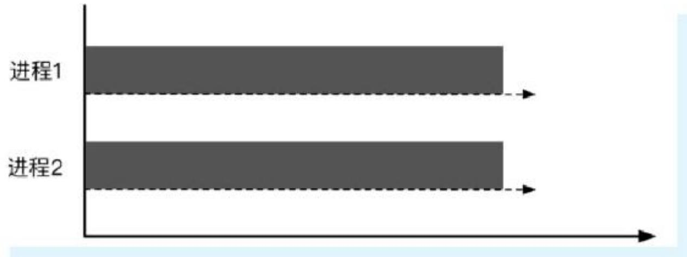
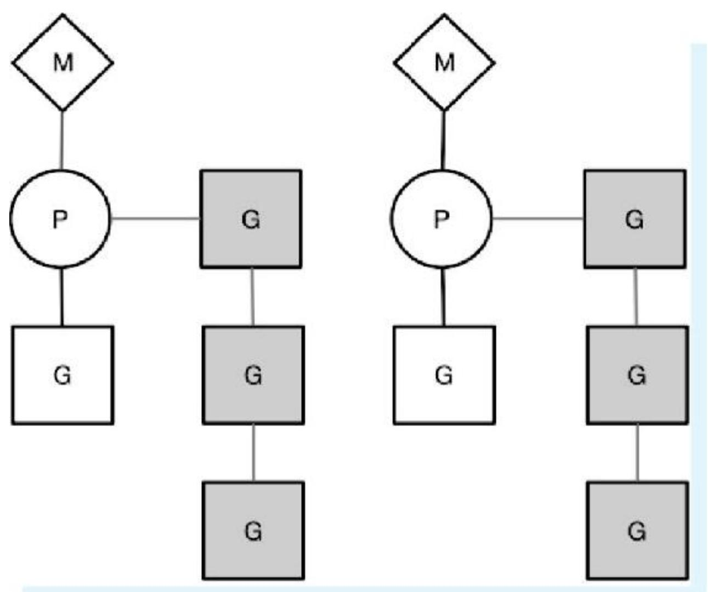
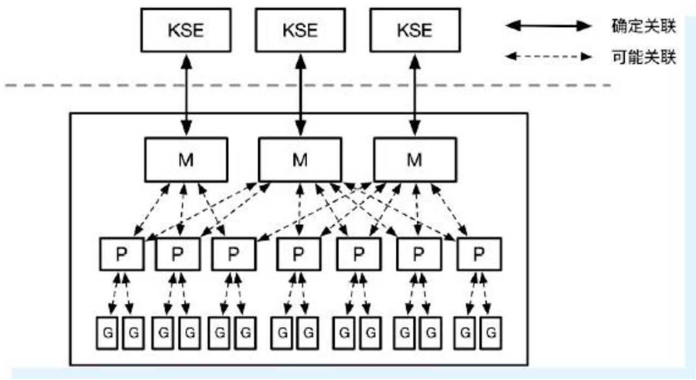
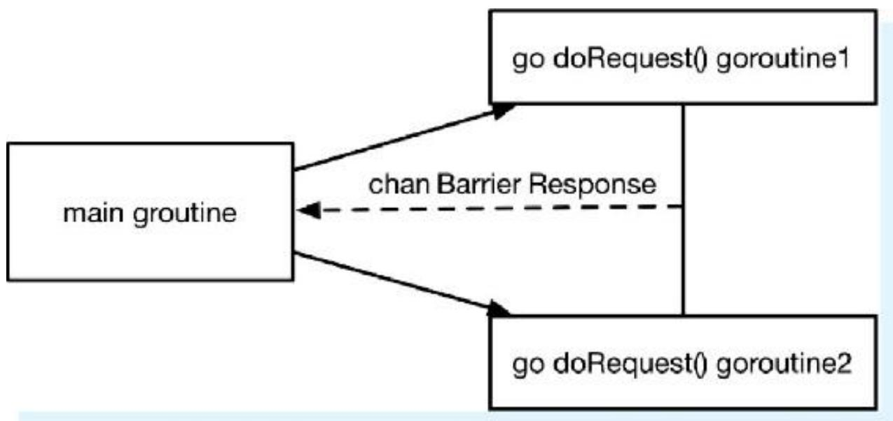
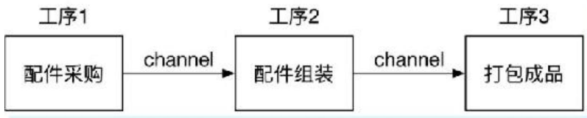
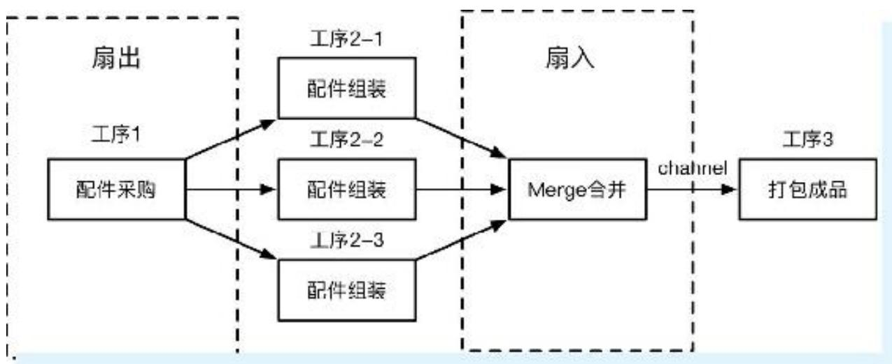
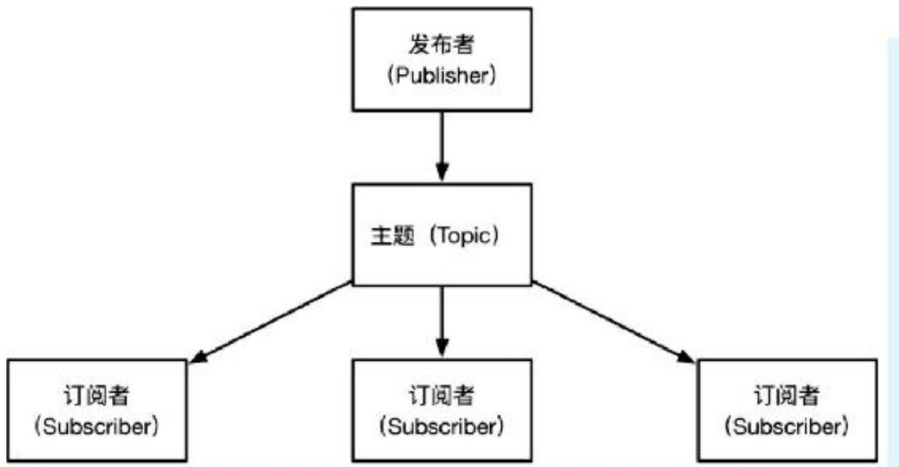
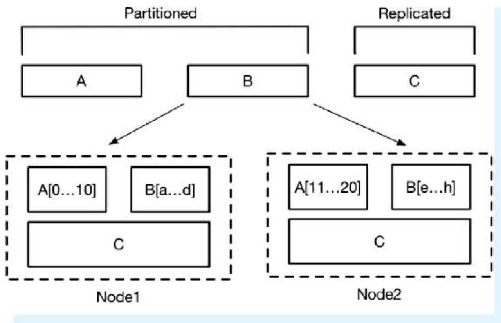

> 本文基于《Go语言高级开发与实战》第4章内容，系统讲解Go语言并发编程的核心知识。涵盖并发与并行概念、常见并发模型（线程与锁、Actor、CSP）、Go的GMP模型、六大并发设计模式（屏障、未来、管道、扇出扇入、协程池、发布订阅）、同步原语（Mutex、RWMutex、Once、WaitGroup、sync.Map）、竞态检测，以及goroutine使用技巧和完整的并发任务系统实战。通过大量代码示例，帮助读者掌握Go并发的精髓。

## 一、并发编程基础

### 1.1 什么是并发

**并发（Concurrent）**：在单CPU上，同一时刻只能有一条指令执行，多个进程指令被快速轮换执行。从宏观上看多个进程同时执行，微观上是分时交替执行。CPU将时间段划分成时间片，进程在时间片之间快速切换，使用户感觉多个进程同时进行。



### 1.2 什么是并行

**并行（Parallel）**：在多核或多CPU系统中，同一时刻有多条指令在多个处理器上同时执行。决定并行的不是CPU数量，而是CPU核心数量。一个CPU多个核也可以并行。



**区别**：并行是真正的同时执行，并发是交替执行（宏观同时、微观串行）。在多道程序环境下，并发是宏观上多程序同时运行，微观上分时交替；如果有多个处理机，并发程序可被分配到多个处理机上实现并行。

## 二、计算机常见并发模型

### 2.1 线程和锁

**线程**：轻量级进程，程序执行流的最小单元，拥有线程ID、PC、寄存器集合和堆栈。同一进程的线程共享进程资源。

**锁**：内存中的整型数，有“空闲”和“上锁”两种状态。加锁时判断是否空闲，空闲则修改为上锁状态；解锁时将状态改为空闲。锁机制保证同一时间只有一个线程进入临界区。

**无锁问题示例**：

```go
func main() {
    var b = 0
    for i := 0; i < 10; i++ {
        go func(idx int) {
            b += 1
            fmt.Println(b)
        }(i)
    }
    time.Sleep(time.Second)
}
// 输出顺序混乱，可能重复值
```

**加锁解决**：

```go
var mutex sync.Mutex
mutex.Lock()
b += 1
fmt.Println(b)
mutex.Unlock()
```

### 2.2 演员模型（Actor Model）

- 1973年由Carl Hewitt等人提出，由Erlang/OTP推广
- 哲学：“一切皆是演员”
- 演员是并发运算的基本单元，接收消息后可以：发送有限数量消息给其他演员、创建有限数量新演员、指定下一个消息的行为
- 特点：异步通信、通过地址区分接收者、消息到达顺序不限制

### 2.3 通信顺序进程（CSP）

- 1978年由东尼·霍尔提出
- 两个独立的并发实体通过共享通道（channel）通信
- Go语言借鉴了CSP模型，实现了goroutine和channel
- **与Actor的区别**：CSP关注通道（第一类对象），而非发送消息的实体；通道可以单独创建、读写、在进程间传递

Go实现两种并发形式：

1. 多线程共享内存（锁同步）
2. CSP模型（通过通信共享）

## 三、Go语言并发模型

### 3.1 goroutine

- goroutine是Go语言最基本的执行单元，每个Go程序至少有一个主goroutine
- 只需在函数名前加 `go` 关键字即可启动goroutine
- 遵循原则：“不要通过共享来通信，而要通过通信来共享”

**线程 vs 协程 vs goroutine**：

- 线程：独立栈、共享堆，由操作系统调度
- 协程：共享堆、不共享栈，由程序员显式控制切换
- goroutine：支持并发的协程，可运行在一个或多个线程上

### 3.2 GMP模型

Go采用两级线程模型，称为**GMP模型**：

- **G（Goroutine）**：轻量级线程/协程，待执行的代码
- **M（Machine）**：直接关联一个内核线程
- **P（Processor）**：M所需的上下文环境，处理用户级代码逻辑的处理器



**关键点**：

- P的数量由 `GOMAXPROCS` 环境变量或 `runtime.GOMAXPROCS()` 设置
- 当M上的goroutine进行系统调用被阻塞时，P可以交给其他M继续执行goroutine
- P会定期检查全局goroutine队列，以及从其他P的运行队列偷取goroutine实现负载均衡



## 四、Go语言常见并发设计模式

### 4.1 屏障模式（Barrier Mode）

**作用**：阻塞goroutine直到聚合所有goroutine返回结果。常用于多个网络请求并发、粗粒度任务拆分执行并聚合结果。

**场景**：微服务需要归并组合多个服务的结果。

**实现**：使用通道收集子goroutine结果，主goroutine等待所有结果返回。


```go
type BarrierResponse struct {
    Err    error
    Resp   string
    Status int
}

func doRequest(out chan<- BarrierResponse, url string) {
    // 发送HTTP请求，结果放入out
}

func Barrier(urls ...string) {
    in := make(chan BarrierResponse, len(urls))
    for _, url := range urls {
        go doRequest(in, url)
    }
    for i := 0; i < len(urls); i++ {
        resp := <-in
        // 处理响应
    }
}
```

### 4.2 未来模式（Future Mode / Promise Mode）

**特点**：“fire-and-forget”——主进程不等子进程执行完就直接返回，未来需要结果时再取（阻塞等待）。

**场景**：沏茶（放茶叶、烧水可同时做，最后一起用）

```go
func putInTea() <-chan string {
    vegetables := make(chan string)
    go func() {
        time.Sleep(5 * time.Second)
        vegetables <- "茶叶已经放入茶杯~"
    }()
    return vegetables
}

func boilingWater() <-chan string {
    water := make(chan string)
    go func() {
        time.Sleep(5 * time.Second)
        water <- "水已经烧开~"
    }()
    return water
}

func main() {
    leafCh := putInTea()
    waterCh := boilingWater()
    // 主goroutine干别的事
    time.Sleep(2 * time.Second)
    tea := <-leafCh
    water := <-waterCh
    fmt.Println("可以泡茶了：", tea, water)
}
```

### 4.3 管道模式（Pipeline Mode）

**特点**：模拟生产流水线，每道工序的输出是下一道工序的输入，数据流在工序间传递。

**计算机组装流水线示例**：





```go
// 工序1：采购
func Buy(n int) <-chan string {
    out := make(chan string)
    go func() {
        defer close(out)
        for i := 1; i <= n; i++ {
            out <- fmt.Sprint("配件", i)
        }
    }()
    return out
}

// 工序2：组装
func Build(in <-chan string) <-chan string {
    out := make(chan string)
    go func() {
        defer close(out)
        for c := range in {
            out <- "组装(" + c + ")"
        }
    }()
    return out
}

// 工序3：打包
func Pack(in <-chan string) <-chan string {
    out := make(chan string)
    go func() {
        defer close(out)
        for c := range in {
            out <- "打包(" + c + ")"
        }
    }()
    return out
}

func main() {
    accessories := Buy(6)
    computers := Build(accessories)
    packs := Pack(computers)
    for p := range packs {
        fmt.Println(p)
    }
}
```

**平方和示例**：

```go
// 生成器
func Generator(max int) <-chan int { ... }
// 求平方
func Square(in <-chan int) <-chan int { ... }
// 求和
func Sum(in <-chan int) <-chan int { ... }

func main() {
    arr := Generator(5)
    square := Square(arr)
    sum := <-Sum(square)
    println(sum) // 55
}
```

### 4.4 扇出和扇入模式（Fan-out / Fan-in）

**扇出（Fan-out）**：多个函数从同一个通道读取数据（多个goroutine处理同一输入）。  
**扇入（Fan-in）**：一个函数从多个输入通道读取数据并合并到一个通道。

**场景**：流水线中某道工序成为瓶颈，增加多班人手并行处理。



**扇入组件（可复用）**：

```go
func Merge(ins ...<-chan string) <-chan string {
    var wg sync.WaitGroup
    out := make(chan string)
    output := func(in <-chan string) {
        defer wg.Done()
        for c := range in {
            out <- c
        }
    }
    wg.Add(len(ins))
    for _, cs := range ins {
        go output(cs)
    }
    go func() {
        wg.Wait()
        close(out)
    }()
    return out
}

func main() {
    accessories := Buy(12)
    // 三个工人同时组装
    computers1 := Build(accessories)
    computers2 := Build(accessories)
    computers3 := Build(accessories)
    computers := Merge(computers1, computers2, computers3)
    packs := Pack(computers)
    // 输出...
}
```

### 4.5 协程池模式（Worker Pool）

**场景**：当有大批量任务时，大量goroutine会给系统带来内存开销和GC压力，可使用固定数量的worker池。

```go
type Task struct {
    Param   interface{}
    Handler func(interface{})
}

type WorkerPool struct {
    wg   sync.WaitGroup
    inCh chan Task
}

func (p *WorkerPool) AddWorker() {
    p.wg.Add(1)
    go func() {
        for task := range p.inCh {
            task.Handler(task.Param)
        }
        p.wg.Done()
    }()
}

func (p *WorkerPool) SendTask(t Task) {
    p.inCh <- t
}

func (p *WorkerPool) Release() {
    close(p.inCh)
    p.wg.Wait()
}

func NewWorkerPool(buffer int) *WorkerPool {
    return &WorkerPool{
        inCh: make(chan Task, buffer),
    }
}
```

### 4.6 发布-订阅模式（Publish Subscribe）

**特点**：发布者不直接发送消息给特定订阅者，而是按类别发布；订阅者只接收感兴趣类别的消息。



**核心结构**：

```go
type Publisher struct {
    subscribers map[Subscriber]TopicFunc
    buffer      int
    timeout     time.Duration
    m           sync.RWMutex
}

type Subscriber chan interface{}
type TopicFunc func(v interface{}) bool
```

**关键方法**：`Subscribe()`、`SubscribeTopic()`、`Delete()`、`Publish()`、`Close()`。

## 五、同步常用技巧

### 5.1 竞态（Data Race）

**数据竞态**：多个goroutine并发访问同一变量，且至少有一个是写操作，导致结果不确定。

```go
func getNum() int {
    var i int
    go func() { i = 8 }()
    return i  // 可能0或8
}
```

### 5.2 互斥锁（sync.Mutex）

**定义**：`type Mutex struct { state int32; sema uint32 }`

**方法**：

- `Lock()`：加锁，已锁定时再次Lock会阻塞（死锁）
- `Unlock()`：解锁，未加锁时调用会panic

**注意事项**：

- 加锁后不能再次加锁，需先解锁
- 已锁定的Mutex不与特定goroutine关联，可不同goroutine加锁/解锁
- 同一goroutine中解锁前再次加锁会死锁
- 适用于读写不确定、只有一个读或写的场景

### 5.3 读写互斥锁（sync.RWMutex）

**定义**：组合了Mutex，另有`writerSem`、`readerSem`、`readerCount`、`readerWait`

**方法**：

- 写锁：`Lock()`、`Unlock()`
- 读锁：`RLock()`、`RUnlock()`

**特性**：

- 读锁占用时阻止写，但不阻止读（多个goroutine可同时持有读锁）
- 写锁占用时阻止任何其他goroutine（无论读还是写）
- 写锁优先级高于读锁
- 适用于读多写少的场景

### 5.4 只执行一次（sync.Once）

**作用**：确保某操作在高并发场景下只执行一次（如加载配置、关闭通道）。

**结构**：`type Once struct { done int32; m Mutex }`

**方法**：`Do(f func())`

**单例示例**：

```go
type Singleton struct{}
var instance *Singleton
var once sync.Once

func GetInstance() *Singleton {
    once.Do(func() {
        instance = &Singleton{}
    })
    return instance
}
```

### 5.5 等待组（sync.WaitGroup）

**作用**：等待一组goroutine结束。

**方法**：

- `Add(delta int)`：增加或减少计数器（负数会panic）
- `Done()`：等价于`Add(-1)`
- `Wait()`：阻塞直到计数器为0

**使用模式**：

```go
var wg sync.WaitGroup
wg.Add(5)
for i := 0; i < 5; i++ {
    go func() {
        defer wg.Done()
        // 工作
    }()
}
wg.Wait()
```

### 5.6 竞态检测器（Race Detector）

**使用**：在`go build`、`go run`、`go test`命令中添加`-race`参数

```bash
go run -race main.go
```

**原理**：编译器构建修订版本，运行时检测事件流，发现对共享变量的并发访问（无同步操作）时报告。

**注意**：只能检测运行时发生的竞态，不能保证无竞态。

### 5.7 并发安全字典（sync.Map）

**问题**：Go原生map在并发读写时会报`fatal error: concurrent map read and map write`。

**sync.Map特性**：

- 无须初始化，直接声明
- 不能使用`map[key]`方式，需用方法：
  - `Store(key, value)`：存储
  - `Load(key)`：读取
  - `Delete(key)`：删除
  - `Range(func(k, v interface{}) bool)`：遍历（返回false停止）

```go
var scene sync.Map
scene.Store("Jack", 90)
scene.Store("Barry", 99)
if val, ok := scene.Load("Barry"); ok {
    fmt.Println(val)
}
scene.Delete("Jack")
scene.Range(func(k, v interface{}) bool {
    fmt.Println(k, v)
    return true
})
```

**注意**：`sync.Map`有性能损失，非并发场景使用普通map性能更好。

## 六、goroutine使用技巧

### 6.1 限制并发数量

**问题**：无限制的并行会耗尽系统资源（文件句柄、网络连接等）。

**解决方案**：使用带缓冲的通道作为计数信号量（令牌桶）。

```go
var tokens = make(chan struct{}, 20) // 最多20个并发

func Crawl(url string) []string {
    fmt.Println(url)
    tokens <- struct{}{}        // 获取令牌
    list, err := Extract(url)
    <-tokens                    // 释放令牌
    if err != nil {
        log.Println(err)
    }
    return list
}
```

**完整爬虫改进**：通过计数器`n`跟踪任务数量，当`n==0`时退出。

### 6.2 节拍器（time.Tick）

**作用**：定期发送事件，用于定时任务。

```go
func main() {
    fmt.Println("开始倒计时...")
    tick := time.Tick(1 * time.Second)
    for countdown := 5; countdown > 0; countdown-- {
        fmt.Println(countdown)
        <-tick
    }
}
```

**更灵活的方式**：

```go
ticker := time.NewTicker(1 * time.Second)
<-ticker.C
ticker.Stop()
```

### 6.3 使用select多路复用

**场景**：同时从多个通道接收数据，避免轮询。

```go
select {
case <-chan1:
    // chan1有数据
case data := <-chan2:
    // chan2有数据
case chan3 <- value:
    // 成功写入chan3
case <-abort:
    // 中止信号
default:
    // 所有通道都阻塞时执行
}
```

**倒计时+中止示例**：

```go
abort := make(chan struct{})
go func() {
    os.Stdin.Read(make([]byte, 1))
    abort <- struct{}{}
}()

tick := time.Tick(1 * time.Second)
for countdown := 5; countdown > 0; countdown-- {
    fmt.Println(countdown)
    select {
    case <-tick:
        // 正常倒计时
    case <-abort:
        fmt.Println("abort...!")
        return
    }
}
```

## 七、【实战】开发一个并发任务系统

**需求**：8个工作任务并发执行，每个任务包含两个子过程，子过程独立执行，结果合并后返回。

### 7.1 过程数据存储容器

```go
type WorkProcessData struct {
    Data map[string]string
    mux  sync.RWMutex
}

func (d *WorkProcessData) AddData(key, value string) {
    d.mux.Lock()
    defer d.mux.Unlock()
    if d.Data == nil {
        d.Data = make(map[string]string)
    }
    d.Data[key] = value
}

func (d *WorkProcessData) GetData() string {
    d.mux.RLock()
    defer d.mux.RUnlock()
    return d.Data["1"] + "," + d.Data["2"]
}
```

### 7.2 工作过程函数

```go
func workProcessUnit(name string, ch chan string) {
    wd := &WorkProcessData{}
    var wg sync.WaitGroup
    wg.Add(2)
    go process1(&wg, wd)
    go process2(&wg, wd)
    wg.Wait()
    ch <- name + ":" + wd.GetData()
}

func process1(wg *sync.WaitGroup, data *WorkProcessData) {
    defer wg.Done()
    time.Sleep(time.Microsecond * 1)
    data.AddData("1", strconv.Itoa(rand.Intn(10)))
}

func process2(wg *sync.WaitGroup, data *WorkProcessData) {
    defer wg.Done()
    time.Sleep(time.Microsecond * 2)
    data.AddData("2", strconv.Itoa(rand.Intn(10)))
}
```

### 7.3 任务生产者

```go
func TaskProducer(ch chan string) {
    for i := 1; i <= 8; i++ {
        go workProcessUnit("Task"+strconv.Itoa(i), ch)
    }
}
```

### 7.4 任务消费者

```go
func TaskConsumer(ch chan string, finished chan bool) {
    var result string
    i := 0
    for value := range ch {
        result += value + "\n"
        i++
        if i == 8 {
            break
        }
    }
    finished <- true
    fmt.Println(result)
}
```

### 7.5 启动系统

```go
func main() {
    ch := make(chan string, 2)
    finished := make(chan bool)
    go TaskProducer(ch)
    go TaskConsumer(ch, finished)
    <-finished
}
```

## 八、回顾与启示

本章系统学习了：

- 并发与并行的区别
- 线程与锁、Actor、CSP三种并发模型
- Go的GMP模型原理
- 六大并发设计模式：屏障、未来、管道、扇出扇入、协程池、发布订阅
- 同步原语：Mutex、RWMutex、Once、WaitGroup、sync.Map
- 竞态检测器使用
- goroutine使用技巧：限制并发、节拍器、select多路复用
- 完整的并发任务系统实战

掌握这些知识，能够编写高效、安全、可扩展的Go并发程序。
