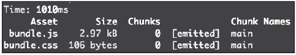
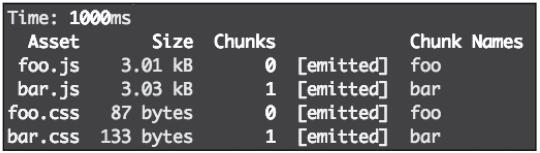
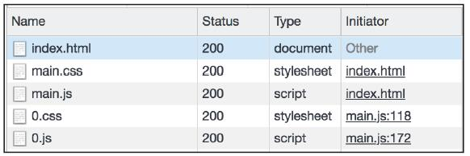
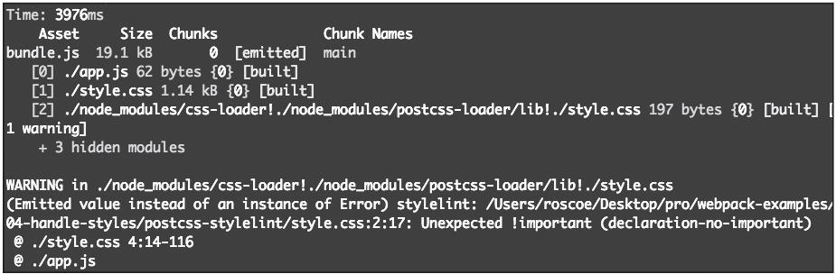

在前端工程化体系中，样式处理是与JavaScript打包同等重要的核心环节。手工维护大规模项目的CSS存在兼容性处理复杂、样式隔离难、扩展能力弱等问题，而Webpack结合各类loader与插件可一站式解决这些痛点。本文将从样式文件分离、预编译语言处理、PostCSS增强、CSS模块化四个维度，完整拆解Webpack样式处理的核心方案与实操配置，学完后你可独立完成从样式打包到工程化落地的全流程配置。

### 【本篇核心收获】

- 掌握Webpack分离样式文件的两种核心插件（extract-text-webpack-plugin/mini-css-extract-plugin）的配置与适配场景
- 熟练配置Sass/SCSS、Less预编译样式的loader，实现源码到CSS的编译转换
- 理解PostCSS的插件化工作模式，掌握自动前缀、样式检测、新特性兼容等核心能力的落地
- 精通CSS Modules的启用与使用方式，彻底解决样式命名冲突问题
- 掌握多入口项目中样式文件的动态命名技巧，规避资源重名风险

## 5.1 分离样式文件

在开发环境中，我们可通过`style-loader`将CSS以`style`标签注入页面，但生产环境下，单独的CSS文件更利于客户端缓存。Webpack提供了两款专用插件实现样式提取：`extract-text-webpack-plugin`（适配Webpack 4之前版本）和`mini-css-extract-plugin`（适配Webpack 4及以上版本）。

### 5.1.1 extract-text-webpack-plugin（Webpack 4前）

#### 1. 安装与基础配置

首先通过npm安装插件：

```bash
npm install extract-text-webpack-plugin
```

在`webpack.config.js`中配置插件与CSS处理规则：

```javascript
const ExtractTextPlugin = require('extract-text-webpack-plugin');
module.exports = {
    entry: './app.js',
    output: {
        filename: 'bundle.js',
    },
    mode: 'development',
    module: {
        rules: [
            {
                test: /\.css$/,
                use: ExtractTextPlugin.extract({
                    fallback: 'style-loader',
                    use: 'css-loader',
                }),
            }
        ],
    },
    plugins: [
        new ExtractTextPlugin("bundle.css")
    ],
};
```

**核心配置说明**：

- `extract`方法中，`fallback`指定插件无法提取样式时的兜底loader（如`style-loader`），`use`指定提取前预处理的loader（如`css-loader`）；
- `plugins`数组中实例化插件，传入提取后的CSS文件名。

#### 2. 效果验证

创建测试文件：

```javascript
// index.js
import './style.css';
document.write('My Webpack app');
```

```css
/* style.css */
body {
    display: flex;
    align-items: center;
    justify-content: center;
    text-align: center;
}
```

执行打包后，输出目录会新增`bundle.css`文件，即插件指定的提取文件，打包结果如下：


### 5.1.2 多样式文件的处理

样式提取以**chunk**（有依赖关系的模块集合）为单位，单入口项目只会生成一个CSS文件，多入口项目需通过动态命名规避重名问题。

#### 1. 多入口场景示例

创建多入口源码文件：

```javascript
// ./src/scripts/foo.js
import '../styles/foo-style.css';
document.write('foo.js');

// ./src/scripts/bar.js
import '../styles/bar-style.css';
document.write('bar.js');
```

```css
/* ./src/styles/foo-style.css */
body { background-color: #eee; }

/* ./src/styles/bar-style.css */
body { color: #09c; }
```

#### 2. 动态命名配置

修改`webpack.config.js`，使用`[name]`模板匹配chunk名称（即entry中定义的入口名）：

```javascript
const ExtractTextPlugin = require('extract-text-webpack-plugin');

module.exports = {
    entry: {
        foo: './src/scripts/foo.js',
        bar: './src/scripts/bar.js',
    },
    output: {
        filename: '[name].js',
    },
    mode: 'development',
    module: {
        rules: [
            {
                test: /\.css$/,
                use: ExtractTextPlugin.extract({
                    fallback: 'style-loader',
                    use: 'css-loader',
                }),
            }
        ],
    },
    plugins: [
        new ExtractTextPlugin('[name].css')
    ],
};
```

#### 3. 结果验证

打包后会生成`foo.css`和`bar.css`，对应entry中的`foo`和`bar`入口，`[name]`始终指向chunk名称（非CSS文件名或入口JS文件名），打包结果如下：


### 5.1.3 mini-css-extract-plugin（Webpack 4+）

该插件是`extract-text-webpack-plugin`的升级版，支持**按需加载CSS**（异步chunk的样式可单独打包并动态加载），性能与特性更优，是Webpack 4+的官方推荐方案。

#### 1. 核心特性

异步加载场景下（如通过`import()`加载模块），`mini-css-extract-plugin`可将异步模块的样式单独打包，通过动态插入`link`标签加载；而`extract-text-webpack-plugin`仅支持同步加载所有样式。

#### 2. 配置示例

创建测试文件：

```javascript
// app.js
import './style.css';
import('./next-page');
document.write('app.js<br/>');

// next-page.js
import './next-page.css';
document.write('Next page.<br/>');
```

```css
/* style.css */
body { background-color: #eee; }

/* next-page.css */
body { background-color: #999; }
```

配置`webpack.config.js`：

```javascript
const MiniCssExtractPlugin = require('mini-css-extract-plugin');
module.exports = {
  entry: './app.js',
  output: {
    filename: '[name].js',
  },
  mode: 'development',
  module: {
    rules: [{
      test: /\.css$/,
      use: [
        {
          loader: MiniCssExtractPlugin.loader,
          options: {
            publicPath: '../', // 指定异步CSS的加载路径
          },
        },
        'css-loader'
      ],
    }],
  },
  plugins: [
    new MiniCssExtractPlugin({
      filename: '[name].css', // 同步加载的CSS文件名
      chunkFilename: '[id].css', // 异步加载的CSS文件名
    })
  ]
};
```

#### 3. 配置差异说明

| 配置项                | extract-text-webpack-plugin | mini-css-extract-plugin                |
|-----------------------|-----------------------------|----------------------------------------|
| loader配置形式        | 嵌套在extract方法中         | 直接声明MiniCssExtractPlugin.loader    |
| fallback配置          | 必须配置                    | 无需配置                               |
| 异步样式命名          | 不支持                      | 通过chunkFilename指定                  |
| 公共路径配置          | 无                          | 支持通过loader的options配置publicPath  |

#### 4. 效果验证

打包后同步样式生成`main.css`，异步模块的样式生成`0.css`（默认id命名），运行时`app.js`会动态插入`link`标签加载`0.css`，效果如下：


### 5.1 模块小结

分离样式文件的核心是通过专用插件将CSS从JS中提取为独立文件，`extract-text-webpack-plugin`适配Webpack 4前版本，`mini-css-extract-plugin`支持异步加载、性能更优，多入口场景需通过`[name]`模板实现动态命名，避免资源重名。

## 5.2 样式预处理

样式预编译语言（Sass/SCSS、Less）可通过变量、嵌套、混合等特性简化CSS开发，Webpack通过对应的loader将其编译为标准CSS。

### 5.2.1 Sass与SCSS

SCSS是Sass的主流语法（兼容CSS3），`sass-loader`负责将SCSS编译为CSS，需搭配`node-sass`（编译核心）、`css-loader`（解析CSS）、`style-loader`（注入页面）使用。

#### 1. 安装依赖

```bash
# 配置node-sass镜像（解决下载慢问题）
npm config set sass_binary_site=https://npm.taobao.org/mirrors/node-sass/
# 安装loader与编译核心
npm install sass-loader node-sass
```

#### 2. Webpack配置

```javascript
module: {
    rules: [
        {
            test: /\.scss$/,
            use: ['style-loader', 'css-loader', 'sass-loader'],
        }
    ],
},
```

#### 3. 源码示例与编译结果

```scss
// style.scss
$primary-color: #09c;
.container {
    .title {
        color: $primary-color;
    }
}
```

```javascript
// index.js
import './style.scss';
```

编译后生成的CSS：

```css
.container .title {
    color: #09c;
}
```

#### 4. Source Map配置（调试用）

如需在浏览器调试工具中查看SCSS源码，需为`css-loader`和`sass-loader`单独开启source map：

```javascript
module: {
    rules: [
        {
            test: /\.scss$/,
            use: [
                'style-loader',
                {
                    loader: 'css-loader',
                    options: {
                        sourceMap: true,
                    },
                }, {
                    loader: 'sass-loader',
                    options: {
                        sourceMap: true,
                    },
                }
            ],
        }
    ],
},
```

### 5.2.2 Less

Less与SCSS功能类似，`less-loader`负责编译Less，需搭配`less`（编译核心）使用。

#### 1. 安装依赖

```bash
npm install less-loader less
```

#### 2. Webpack配置

```javascript
module: {
    rules: [
        {
            test: /\.less/,
            use: [
                'style-loader',
                {
                    loader: 'css-loader',
                    options: {
                        sourceMap: true,
                    },
                }, {
                    loader: 'less-loader',
                    options: {
                        sourceMap: true,
                    },
                }
            ],
        }
    ],
},
```

#### 3. 源码示例与编译结果

```less
// style.less
@primary-color: #09c;
.container {
    .title {
        color: @primary-color;
    }
}
```

```javascript
// index.js
import './style.less';
```

编译后生成的CSS：

```css
.container .title {
    color: #09c;
}
```

#### 4. 进阶配置

Less的编译参数可通过`less-loader`的`options`传入（驼峰命名），具体配置参考[Less官方文档](http://lesscss.org/usage/#less-options)。

### 5.2 模块小结

样式预处理的核心是通过专用loader将预编译语言（SCSS/Less）转换为标准CSS，需安装loader+编译核心依赖，source map配置可辅助调试，不同预编译语言的配置逻辑一致，仅需替换对应的loader。

## 5.3 PostCSS

PostCSS并非预编译器，而是**CSS编译插件容器**，通过插件实现自动前缀、样式检测、新特性兼容等功能，`postcss-loader`用于将其与Webpack集成。

### 5.3.1 PostCSS与Webpack集成

#### 1. 安装依赖

```bash
npm install postcss-loader
```

#### 2. Webpack配置

```javascript
module: {
    rules: [
        {
            test: /\.css/,
            use: [
                'style-loader',
                'css-loader',
                'postcss-loader', // 建议放在css-loader之后
            ] ,
        }
    ],
},
```

**注意**：`postcss-loader`可单独使用，但不建议在CSS中使用`@import`（会产生冗余代码），官方推荐搭配`css-loader`。

#### 3. 配置文件

PostCSS需单独创建`postcss.config.js`（Webpack 2+不支持从loader传入配置），初始配置如下：

```javascript
// postcss.config.js
module.exports = {};
```

### 5.3.2 自动前缀（Autoprefixer）

Autoprefixer根据caniuse数据自动为CSS添加厂商前缀，支持指定兼容的浏览器范围。

#### 1. 安装依赖

```bash
npm install autoprefixer
```

#### 2. 配置插件

```javascript
// postcss.config.js
const autoprefixer = require('autoprefixer');
module.exports = {
    plugins: [
        autoprefixer({
            grid: true, // 为grid特性添加IE前缀
            browsers: [
                '> 1%',
                'last 3 versions',
                'android 4.2',
                'ie 8',
            ],
        })
    ],
};
```

#### 3. 效果验证

源码CSS：

```css
.container {
    display: grid;
}
```

编译后CSS（自动添加-ms前缀）：

```css
.container {
    display: -ms-grid;
    display: grid;
}
```

### 5.3.3 样式质量检测（stylelint）

stylelint是CSS的代码质量检测工具，类似ESLint，可自定义规则统一代码风格。

#### 1. 安装依赖

```bash
npm install stylelint
```

#### 2. 配置插件

```javascript
// postcss.config.js
const stylelint = require('stylelint');
module.exports = {
    plugins: [
        stylelint({
            config: {
                rules: {
                    'declaration-no-important': true, // 禁止使用!important
                },
            },
        })
    ],
};
```

#### 3. 效果验证

若CSS中包含`!important`：

```css
body {
    color: #09c!important;
}
```

打包时控制台会输出警告信息：


### 5.3.4 CSSNext（新特性兼容）

CSSNext允许使用最新的CSS语法，PostCSS会将其转换为浏览器兼容的代码。

#### 1. 安装依赖

```bash
npm install postcss-cssnext
```

#### 2. 配置插件

```javascript
// postcss.config.js
const postcssCssnext = require('postcss-cssnext');
module.exports = {
    plugins: [
        postcssCssnext({
            browsers: [
                '> 1%',
                'last 2 versions',
            ],
        })
    ],
};
```

#### 3. 效果验证

源码CSS（使用CSS变量）：

```css
/* style.css */
:root {
    --highlightColor: hwb(190, 35%, 20%);
}
body {
    color: var(--highlightColor);
}
```

编译后CSS（转换为具体颜色值）：

```css
body {
    color: rgb(89, 185, 204);
}
```

### 5.3 模块小结

PostCSS通过插件化机制扩展CSS能力，核心配置包括Webpack集成（postcss-loader）+ 插件配置（postcss.config.js），Autoprefixer解决兼容性前缀，stylelint保障代码质量，CSSNext实现新特性兼容，是工程化样式处理的核心增强工具。

## 5.4 CSS Modules

CSS Modules是样式模块化开发模式，通过作用域隔离、依赖管理、样式复用解决命名冲突问题，仅需开启`css-loader`的`modules`配置即可使用。

### 5.4.1 核心理念

- 作用域隔离：每个CSS文件的样式仅作用于当前模块，无全局冲突；
- 依赖管理：通过相对路径引入CSS文件，清晰描述模块依赖；
- 样式复用：通过`composes`复用其他CSS模块的样式。

### 5.4.2 Webpack配置

```javascript
module: {
    rules: [
        {
            test: /\.css/,
            use: [
                'style-loader',
                {
                    loader: 'css-loader',
                    options: {
                        modules: true, // 开启CSS Modules
                        localIdentName: '[name]__[local]__[hash:base64:5]', // 类名编译规则
                    },
                }
            ],
        }
    ],
},
```

**localIdentName规则说明**：

- `[name]`：CSS模块名（如style.css的name为style）；
- `[local]`：原类名（如.title的local为title）；
- `[hash:base64:5]`：基于模块名+原类名生成的5位hash值，确保唯一性。

示例：`.title`会被编译为`.style__title__1CFy6`。

### 5.4.3 使用方式

CSS Modules的CSS文件会导出一个对象，需在JS中引入并将编译后的类名绑定到HTML标签：

```css
/* style.css */
.title {
    color: #f938ab;
}
```

```javascript
// app.js
import styles from './style.css';
document.write(`<h1 class="${styles.title}">My Webpack app.</h1>`);
```

**注意**：若直接引入CSS（`import './style.css'`），无法获取编译后的类名，会导致样式失效。

### 5.4 模块小结

CSS Modules通过`css-loader`的`modules`配置实现样式模块化，核心是类名的唯一编译规则，使用时需通过JS导入CSS模块并绑定类名，彻底解决全局样式冲突问题。

## 【本篇核心知识点速记】

1. 样式分离：Webpack 4前用`extract-text-webpack-plugin`，Webpack 4+用`mini-css-extract-plugin`（支持异步加载），多入口用`[name]`动态命名；
2. 样式预处理：SCSS需`sass-loader+node-sass`，Less需`less-loader+less`，source map可辅助调试源码；
3. PostCSS：通过`postcss-loader`集成，核心插件包括Autoprefixer（自动前缀）、stylelint（质量检测）、CSSNext（新特性兼容）；
4. CSS Modules：开启`css-loader`的`modules`，配置`localIdentName`规则，JS中导入CSS模块并绑定类名实现样式隔离；
5. 核心原则：样式处理的所有配置需保证loader执行顺序（如style-loader在最外层，postcss-loader在css-loader之后），确保编译流程正确。
