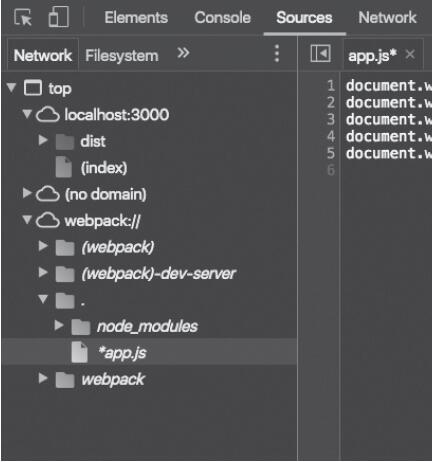
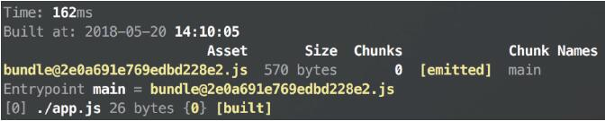
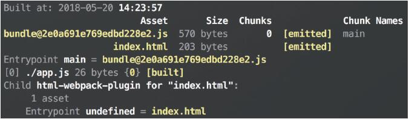
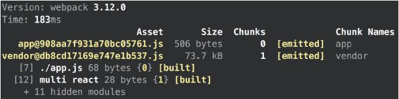
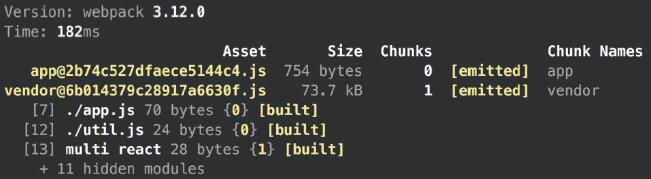
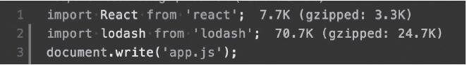
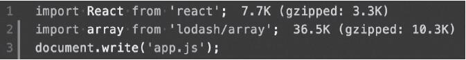
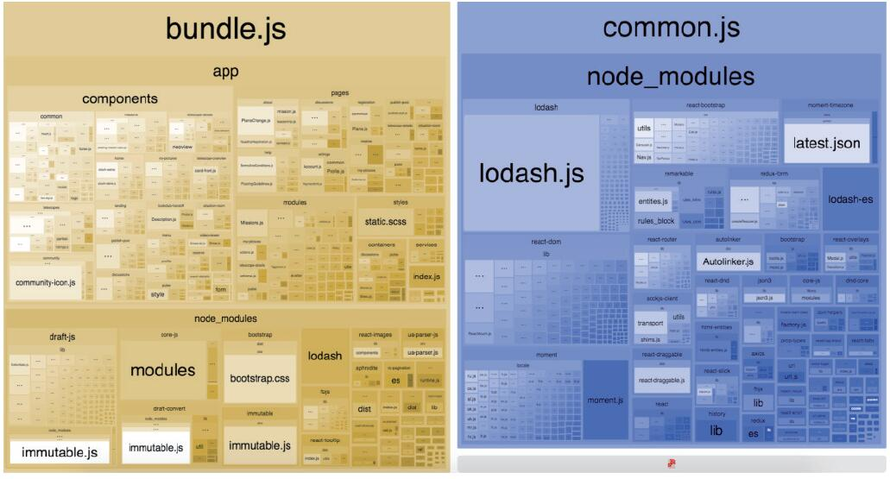

本文聚焦Webpack生产环境配置的全维度实操与原理解析，从环境配置封装、production模式开启，到环境变量设置、source map策略、资源压缩、缓存优化，再到bundle体积监控分析，全方位讲解生产环境下如何优化资源加载速度、利用缓存、保障代码安全，学完即可落地一套完整的Webpack生产环境打包方案。

### 【本篇核心收获】

- 掌握Webpack生产/开发环境配置的两种封装方式，以及webpack-merge的应用场景
- 理解mode: 'production'的底层作用，熟练使用DefinePlugin配置多类型环境变量
- 精通source map的工作原理、配置方式，以及生产环境下兼顾调试与安全的source map策略
- 掌握JavaScript、CSS资源的压缩配置，以及chunkhash结合动态HTML的缓存优化方案
- 学会使用Import Cost、webpack-bundle-analyzer、bundlesize监控和分析bundle体积

## 7.1 环境配置的封装

生产环境的配置与开发环境存在明显差异，比如需要设置mode、环境变量，为文件名添加chunk hash作为版本号等。Webpack支持两种主流的环境配置封装方式，可根据项目规模选择：

### 方式1：使用相同的配置文件

核心思路是通过环境变量区分环境，在单一配置文件中通过条件判断加载对应配置。具体实现如下：

```json
// package.json
{
  ...
  "scripts": {
    "dev": "ENV=development webpack-dev-server",
    "build": "ENV=production webpack"
  },
}
```

```javascript
// webpack.config.js
const ENV = process.env.ENV;
const isProd = ENV === 'production';
module.exports = {
  output: {
    filename: isProd ? 'bundle@[chunkhash].js' : 'bundle.js',
  },
  mode: ENV,
};
```

该方式通过npm脚本传入ENV环境变量，配置文件根据变量值动态调整输出文件名、mode等核心配置。

### 方式2：为不同环境创建独立配置文件

为开发/生产环境分别创建专属配置文件，通过`--config`指定打包时使用的配置：

```json
{
  ...
  "scripts": {
    "dev": " webpack-dev-server --config=webpack.development.config.js",
    "build": " webpack --config=webpack.production.config.js"
  },
}
```

#### 优化：提取公共配置

多配置文件易出现重复内容，可将公共逻辑抽离到`webpack.common.config.js`：

```javascript
// webpack.common.config.js
module.exports = {
  entry: './src/index.js',
  // development 和 production共有配置
};
```

其他环境配置文件可引用该文件并补充专属配置，也可使用`webpack-merge`工具简化配置合并，降低维护成本。

**本模块小结**：Webpack环境配置有单文件（环境变量判断）、多文件（抽离公共配置）两种封装方式，后者通过webpack-merge可解决配置重复问题，更适合中大型项目。

## 7.2 开启production模式

Webpack 4引入`mode`配置项，可快速切换打包模式，减少手动配置成本：

```javascript
// webpack.config.js
module.exports = {
    mode: 'production',
};
```

设置`mode: 'production'`后，Webpack会自动注入生产环境专属配置（如代码压缩、环境变量设置等），核心设计理念是隐藏底层配置细节，让配置文件更简洁。

需注意，仅设置mode通常无法满足复杂生产环境需求，仍需结合自定义配置补充优化。

**本模块小结**：mode: 'production'可自动启用Webpack内置的生产环境配置，大幅简化配置量，但复杂场景需配合自定义配置使用。

## 7.3 环境变量

生产/开发环境常需不同的环境变量，Webpack通过`DefinePlugin`实现环境变量注入，支持多类型变量配置。

### 基础使用

```javascript
// webpack.config.js
const webpack = require('webpack');
module.exports = {
    entry: './app.js',
    output: {
        filename: 'bundle.js',
    },
    mode: 'production',
    plugins: [
        new webpack.DefinePlugin({
            ENV: JSON.stringify('production'),
        })
    ],
};

// app.js
document.write(ENV); // 页面输出：production
```

### 多类型变量配置

```javascript
new webpack.DefinePlugin({
    ENV: JSON.stringify('production'),
    IS_PRODUCTION: true,
    ENV_ID: 130912098,
    CONSTANTS: JSON.stringify({
        TYPES: ['foo', 'bar']
    })
})
```

### 重要注意事项

DefinePlugin对字符串类型值做完全替换，若未添加`JSON.stringify`，替换后会成为变量名而非字符串值。因此，字符串类型环境变量及包含字符串的对象必须通过`JSON.stringify`处理。


### 框架/库通用的NODE_ENV变量

多数框架/库会通过`process.env.NODE_ENV`区分环境，生产环境下该变量为`production`时，框架会移除开发环境的警告、日志等代码，减小体积并提升性能。配置方式：

```javascript
new webpack.DefinePlugin({
    process.env.NODE_ENV: 'production',
})
```

**避坑指南**：若已开启`mode: production`，Webpack会自动设置`process.env.NODE_ENV`，无需手动配置。

**本模块小结**：DefinePlugin是Webpack注入环境变量的核心插件，需注意字符串类型变量的JSON.stringify处理，NODE_ENV是框架/库识别环境的通用变量，mode: production会自动配置该变量。

## 7.4 source map

source map用于将打包压缩后的代码映射回源代码，解决生产环境代码不可读、错误难以追溯的问题，同时需兼顾安全性。

### 7.4.1 工作原理

Webpack对源代码的每一步处理都会生成对应的source map，最终生成`.map`文件（如`bundle.js.map`），并在bundle文件末尾添加注释标识map文件位置：

```javascript
// bundle.js
(function() {
  // bundle 的内容
})();
//# sourceMappingURL=bundle.js.map
```

浏览器开发者工具开启时会加载map文件，解析出源代码的目录结构和内容；未开启时不会加载，不影响普通用户。但map文件会暴露源码，需通过特殊配置保障安全。

### 7.4.2 source map配置

#### JavaScript配置

```javascript
module.exports = {
    // ...
    devtool: 'source-map',
};
```

#### CSS/SCSS/Less配置

需为样式加载器单独开启source map：

```javascript
const path = require('path');
module.exports = {
    // ...
    devtool: 'source-map',
    module: {
        rules: [
            {
                test: /\.scss$/,
                use: [
                    'style-loader',
                    {
                        loader: 'css-loader',
                        options: {
                            sourceMap: true,
                        },
                    }, {
                        loader: 'sass-loader',
                        options: {
                            sourceMap: true,
                        },
                    }
                ] ,
            }
        ],
    },
};
```

开启后，Chrome开发者工具「Sources」选项卡的「webpack：//」目录中可查看解析后的源码：

*图2：通过source map查看源码*

### 7.4.3 配置类型选择

Webpack支持多种source map形式，不同形式的打包速度和源码还原程度不同：

- 开发环境：`cheap-module-eval-source-map`是打包速度与源码还原的折中选择；
- 生产环境：因代码压缩插件（如UglifyjsWebpackPlugin）仅支持完整source map，仅可选择`source-map`、`hidden-source-map`、`nosources-source-map`。

### 7.4.4 安全性策略

source map虽便于调试，但会暴露源码，生产环境需通过以下方式兼顾调试与安全：

| 配置类型 | 核心特点 | 适用场景 |
|----------|----------|----------|
| hidden-source-map | 生成完整map文件，但bundle中不添加map引用，浏览器无法直接解析 | 结合Sentry等第三方错误跟踪平台使用，仅将map文件上传至平台，用于线上错误追溯 |
| nosources-source-map | 浏览器可看到源码目录结构，但无法查看文件内容；仍可追溯错误栈/日志行数 | 无需第三方平台，兼顾错误追溯与基础安全 |
| 服务器权限控制 | 正常打包map文件，通过Nginx等工具将.map文件仅对公司内网/白名单开放 | 企业级项目，完全控制源码访问权限 |

**本模块小结**：source map是生产环境调试的核心工具，需根据场景选择配置类型；通过hidden-source-map、nosources-source-map或服务器权限控制，可兼顾调试需求与源码安全。

## 7.5 资源压缩

资源压缩（uglify）可移除冗余空格、换行、无效代码，缩短变量名，显著减小资源体积，同时提升代码安全性。

### 7.5.1 压缩JavaScript

Webpack不同版本的压缩插件不同：

- Webpack 3及以下：使用`UglifyJsPlugin`

  ```javascript
  // Webpack version < 4
  const webpack = require('webpack');
  module.exports = {
      entry: './app.js',
      output: {
          filename: 'bundle.js',
      },
      plugins: [new webpack.optimize.UglifyJsPlugin()],
  };
  ```

- Webpack 4及以上：默认使用`terser-webpack-plugin`，配置移至`optimization.minimize`（开启`mode: production`时无需手动设置）

  ```javascript
  module.exports = {
      entry: './app.js',
      output: {
          filename: 'bundle.js',
      },
      optimization: {
          minimize: true,
      },
  };
  ```

#### 自定义terser-webpack-plugin配置

```javascript
const TerserPlugin = require('terser-webpack-plugin');
module.exports = {
    //...
    optimization: {
        // 覆盖默认的 minimizer
        minimizer: [
            new TerserPlugin({
                /* 自定义配置 */
                test: /\.js(\?.*)?$/i, // 匹配需要压缩的文件
                exclude: /\/excludes/, // 排除不需要压缩的目录
            })
        ],
    },
};
```

常用配置项如下（表7-1优化为标准表格）：

| 配置项 | 作用 | 默认值 |
|--------|------|--------|
| test | 匹配需要压缩的文件 | /\.js(\?.*)?$/i |
| exclude | 排除不需要压缩的文件/目录 | undefined |
| parallel | 启用多进程并行压缩 | true |
| extractComments | 是否提取注释到单独文件 | true |
| terserOptions | terser核心配置（如压缩级别、是否保留console等） | 默认压缩配置 |

### 7.5.2 压缩CSS

CSS压缩需先提取样式文件，再通过`optimize-css-assets-webpack-plugin`压缩（底层依赖`cssnano`）：

```javascript
const ExtractTextPlugin = require('extract-text-webpack-plugin');
const OptimizeCSSAssetsPlugin = require('optimize-css-assets-webpack-plugin');
module.exports = {
    // ...
    module: {
        rules: [
            {
                test: /\.css$/,
                use: ExtractTextPlugin.extract({
                    fallback: 'style-loader',
                    use: 'css-loader',
                }),
            }
        ],
    },
    plugins: [new ExtractTextPlugin('style.css')],
    optimization: {
        minimizer: [new OptimizeCSSAssetsPlugin({
            // 生效范围，只压缩匹配到的资源
            assetNameRegExp: /\.optimize\.css$/g,
            // 压缩处理器，默认为 cssnano
            cssProcessor: require('cssnano'),
            // 压缩处理器的配置（移除所有注释）
            cssProcessorOptions: { discardComments: { removeAll: true } },
            // 是否展示日志
            canPrint: true,
        })],
    },
};
```

**本模块小结**：JavaScript压缩在Webpack 4+中默认使用terser-webpack-plugin，CSS压缩需先提取样式文件再使用optimize-css-assets-webpack-plugin，均可通过自定义配置调整压缩规则。

## 7.6 缓存

合理利用浏览器缓存可提升客户端性能，核心思路是通过修改资源URL强制客户端加载最新资源，同时最大化利用缓存。

### 7.6.1 资源hash

为资源文件名添加基于内容的hash（常用`chunkhash`），内容不变则hash不变，浏览器复用缓存；内容变化则hash变化，触发资源重新下载：

```javascript
module.exports = {
    entry: './app.js',
    output: {
        filename: 'bundle@[chunkhash].js',
    },
    mode: 'production',
};
```

打包结果示例：

*图3：使用chunkhash作为版本号*

### 7.6.2 输出动态HTML

资源名变化后，需自动同步HTML中的引用路径，`html-webpack-plugin`可实现该需求：

#### 基础使用

```javascript
const HtmlWebpackPlugin = require('html-webpack-plugin');
module.exports = {
    // ...
    plugins: [
        new HtmlWebpackPlugin()
    ],
};
```

打包后生成`index.html`，自动注入最新资源名：

*图4：同步资源名*

生成的`index.html`内容：

```html
<!DOCTYPE html>
<html>
  <head>
    <meta charset="UTF-8">
    <title>Webpack App</title>
  </head>
  <body>
  <script type="text/javascript"
  src="bundle@2e0a691e769edbd228e2.js"></script>
</body>
</html>
```

#### 自定义HTML模板

若需个性化HTML内容，可传入模板文件：

```html
<!-- template.html -->
<!DOCTYPE html>
<html lang="zh-CN">
    <head>
        <meta charset="UTF-8">
        <title>Custom Title</title>
    </head>
    <body>
        <div id="app">app</div>
        <p>text content</p>
    </body>
</html>
```

```javascript
// webpack.config.js
new HtmlWebpackPlugin({
    template: './template.html',
})
```

打包后生成的`index.html`：

```html
<!DOCTYPE html>
<html lang="zh-CN">
    <head>
        <meta charset="UTF-8">
        <title>Custom Title</title>
    </head>
    <body>
        <div id="app">app</div>
        <p>text content</p>
        <script type="text/javascript"
        src="bundle@2e0a691e769edbd228e2.js"></script>
    </body>
</html>
```

更多配置可参考官方文档：<https://github.com/jantimon/html-webpack-plugin>

### 7.6.3 使chunk id更稳定

使用`CommonsChunkPlugin`（Webpack 3及以下）提取公共代码时，新增模块会导致模块id变化，进而使vendor chunk的hash改变，破坏缓存。解决方案如下：

#### 问题复现

```javascript
// app.js
import React from 'react';
document.write('app.js');

// webpack.config.js
const webpack = require('webpack');
module.exports = {
    entry: {
        app: './app.js',
        vendor: ['react'],
    },
    output: {
        filename: '[name]@[chunkhash].js',
    },
    plugins: [
        new webpack.optimize.CommonsChunkPlugin({
            name: 'vendor',
        })
    ],
};
```

首次打包vendor chunk hash为`db8cd17169e747e1b537`：

*图5：vendor chunk hash为db8cd17169e747e1b537*

新增`util.js`并引入后，vendor chunk hash变为`6b014379c28917a6630f`：

*图6：vendor chunk hash为6b014379c28917a6630f*

#### 解决方案

- Webpack 3：使用`HashedModuleIdsPlugin`，按模块路径生成字符串hash id，避免数字id变化：

  ```javascript
  plugins: [
      new webpack.HashedModuleIdsPlugin(),
      new webpack.optimize.CommonsChunkPlugin({
          name: 'vendor',
      })
  ]
  ```

- Webpack 3以下：使用社区插件`webpack-hashed-module-id-plugin`；
- Webpack 4+：默认修改了模块id生成机制，无此问题。

**本模块小结**：缓存优化的核心是通过chunkhash标识资源版本，结合html-webpack-plugin自动同步HTML引用；Webpack 3及以下需通过HashedModuleIdsPlugin稳定chunk id，避免vendor chunk hash无故变化。

## 7.7 bundle体积监控和分析

监控bundle体积可防止冗余模块引入，保证用户体验，以下是三类核心工具：

### 1. Import Cost（VS Code插件）

实时监测引入模块的体积（压缩后/gzip后），帮助提前发现过大依赖：

*图7：通过Import Cost计算出引入模块的体积*

**优化技巧**：发现大体积包时，可选择更小的替代方案或仅引用子模块：

*图8：通过引用子模块来减小体积*

### 2. webpack-bundle-analyzer

可视化分析bundle的模块构成，清晰展示各模块体积占比：

```javascript
const Analyzer = require('webpack-bundle-analyzer').BundleAnalyzerPlugin;
module.exports = {
    // ...
    plugins: [
        new Analyzer()
    ],
};
```

生成的模块组成结构图：

*图9：使用webpack-bundle-analyzer分析bundle构成*

### 3. bundlesize（自动化体积监控）

配置资源体积阈值，自动化验证bundle是否超限，可集成到CI/CD流程：

```json
{
  "name": "my-app",
  "version": "1.0.0",
  "bundlesize": [
    {
      "path": "./bundle.js",
      "maxSize": "50 kB"
    }
  ],
  "scripts": {
    "test:size": "bundlesize"
  }
}
```

执行`npm run test:size`即可验证体积，超限则报错，避免大体积资源发布。

**本模块小结**：Import Cost用于开发时实时监测模块体积，webpack-bundle-analyzer用于可视化分析bundle构成，bundlesize用于自动化体积校验，三者结合可全面监控bundle体积。

## 【本篇核心知识点速记】

1. 环境配置封装：单文件（环境变量判断）、多文件（抽离公共配置+webpack-merge）两种方式，适配不同项目规模；
2. production模式：Webpack 4+自动注入生产环境配置，简化手动配置，同时自动设置process.env.NODE_ENV；
3. 环境变量：DefinePlugin是核心工具，字符串类型变量需用JSON.stringify处理，避免替换为变量名；
4. source map：生产环境可选hidden-source-map（配合Sentry）、nosources-source-map（基础安全），兼顾调试与源码保护；
5. 资源压缩：JS用terser-webpack-plugin（Webpack 4+），CSS需先提取再用optimize-css-assets-webpack-plugin；
6. 缓存优化：chunkhash标识版本，html-webpack-plugin同步HTML引用，Webpack 3需用HashedModuleIdsPlugin稳定chunk id；
7. 体积监控：Import Cost（实时）、webpack-bundle-analyzer（可视化）、bundlesize（自动化）覆盖全流程监控。
