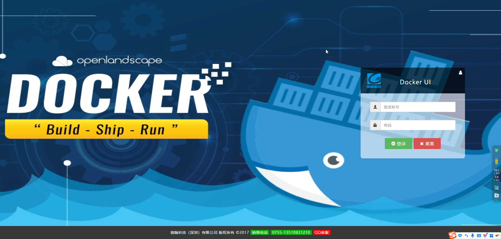
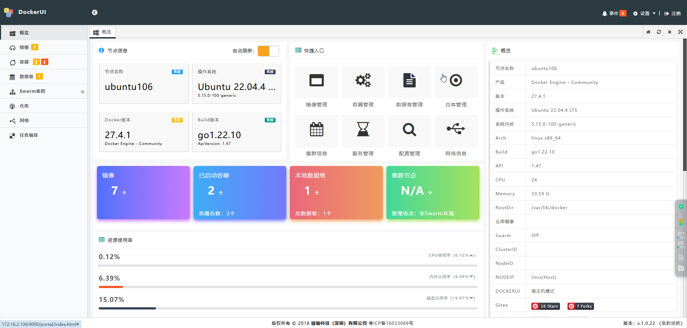
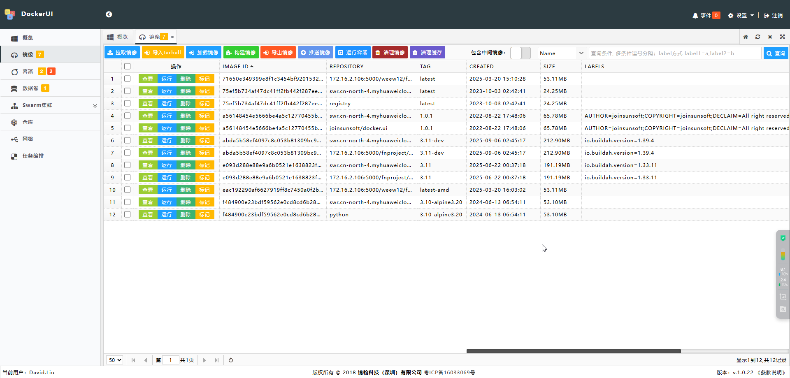

## docker.ui 部署

[github 地址](https://github.com/gohutool/docker.ui)

## 拉取镜像

```bash
docker pull swr.cn-north-4.myhuaweicloud.com/ddn-k8s/docker.io/joinsunsoft/docker.ui:1.0.1
docker tag  swr.cn-north-4.myhuaweicloud.com/ddn-k8s/docker.io/joinsunsoft/docker.ui:1.0.1  docker.io/joinsunsoft/docker.ui:1.0.1
```

## 启动容器实例

```bash
root@ubuntu106:/home/weew12# docker run -d --rm --name docker.ui -v /var/run/docker.sock:/var/run/docker.sock -p 9000:8999 docker.io/joinsunsoft/docker.ui:1.0.1
fc3bcfac72a6669cfba40aa4b0fb2cfd2dd2381ba9591793b343499e4880d561
root@ubuntu106:/home/weew12# docker ps
CONTAINER ID   IMAGE                         COMMAND                  CREATED         STATUS         PORTS                                         NAMES
fc3bcfac72a6   joinsunsoft/docker.ui:1.0.1   "./server"               4 seconds ago   Up 2 seconds   0.0.0.0:9000->8999/tcp, [::]:9000->8999/tcp   docker.ui
40949e270849   registry                      "/entrypoint.sh /etc…"   6 months ago    Up 6 months    0.0.0.0:5000->5000/tcp, :::5000->5000/tcp     registry
```

## 访问页面

[http://ip:9000](http://ip:9000)

默认账号密码：**ginghan/123456**






