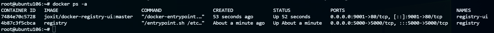
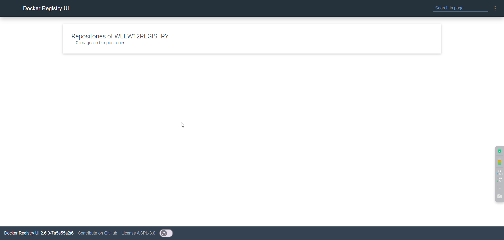
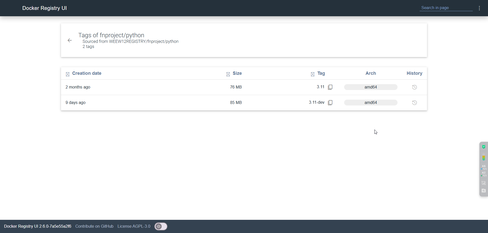

## 拉取registry镜像

```bash
docker pull registry
```

## 自签名证书生成（todo 完善）

参考：<https://vuepress.mirror.docker-practice.com/repository/registry_auth/#>

## 启动registry容器（设置好后面需要适配docker-registry-ui 的环境变量）

```bash
docker run -d \
  --name registry \
  -v /data/docker.registry/etc/cert.d:/etc/cert.d \
  -v /data/docker.registry/var/lib/registry:/var/lib/registry \
  -p 5000:5000 \
  --restart always \
  -e REGISTRY_HTTP_TLS_KEY=/etc/cert.d/registry.key \
  -e REGISTRY_HTTP_TLS_CERTIFICATE=/etc/cert.d/registry.crt \
  -e REGISTRY_HTTP_HEADERS_Access-Control-Allow-Origin='[http://172.16.2.106:9001]' \
  -e REGISTRY_HTTP_HEADERS_Access-Control-Allow-Methods='[HEAD,GET,OPTIONS,DELETE]' \
  -e REGISTRY_HTTP_HEADERS_Access-Control-Allow-Credentials='[true]' \
  -e REGISTRY_HTTP_HEADERS_Access-Control-Allow-Headers='[Authorization,Accept,Cache-Control]' \
  -e REGISTRY_HTTP_HEADERS_Access-Control-Expose-Headers='[Docker-Content-Digest]' \
  -e REGISTRY_STORAGE_DELETE_ENABLED='true' \
  docker.io/registry
```

## 配置docker-registry-ui

[官方相关配置](https://github.com/Joxit/docker-registry-ui?tab=readme-ov-file#recommended-docker-registry-usage)

```bash
docker run -d --name registry-ui -p 9001:80 -e REGISTRY_URL=https://172.16.2.106:5000 -e REGISTRY_TITLE=WEEW12REGISTRY docker.io/joxit/docker-registry-ui:master
```



## 访问页面

[http://ip:9001](http://ip:9001)



推送镜像后再查看：


