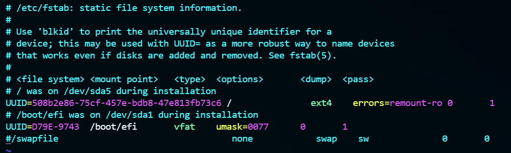
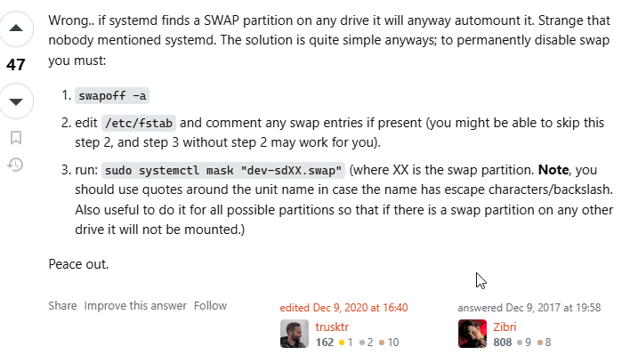
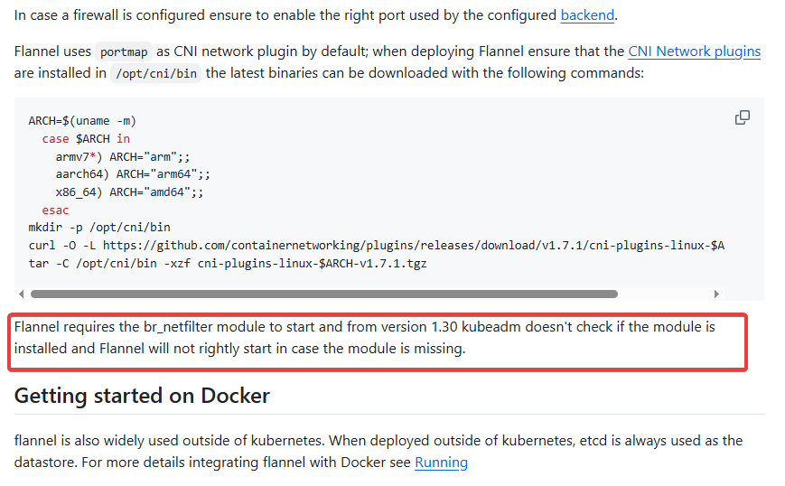
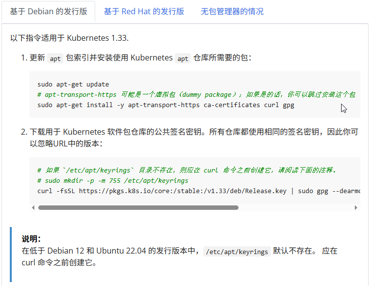
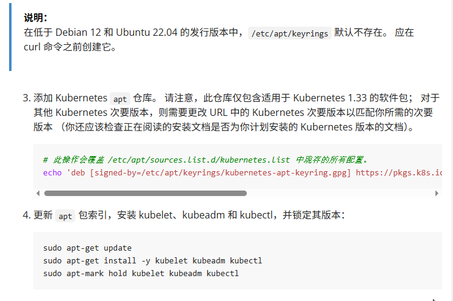
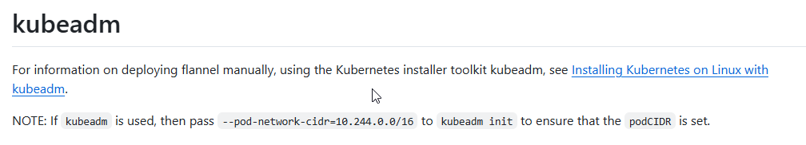

## 1. kubeadm搭建kubernetes集群

### 1.1 环境准备

三台物理机或虚拟机:

操作系统：Ubuntu 20.04

主机名及IP地址规划：

- master节点：master1
  - IP：192.168.23.51
  - 主机名：kb1
  - 角色：master
- worker节点：worker1
  - IP：192.168.23.52
  - 主机名：kb2
  - 角色：worker
- worker节点：worker2
  - IP：192.168.23.53
  - 主机名：kb3
  - 角色：worker

---

## 2. 主机节点配置（所有节点适用）

准备基于kubeadm搭建kubernetes集群的主机节点配置：

参考kubeadm文档(#准备开始)：[https://v1-33.docs.kubernetes.io/zh-cn/docs/setup/production-environment/tools/kubeadm/install-kubeadm/#%E5%87%86%E5%A4%87%E5%BC%80%E5%A7%8B](https://v1-33.docs.kubernetes.io/zh-cn/docs/setup/production-environment/tools/kubeadm/install-kubeadm/#%E5%87%86%E5%A4%87%E5%BC%80%E5%A7%8B))

### 2.1 重点总结（细节参考上面文档）

- **集群中的所有机器的网络彼此均能相互连接（公网和内网都可以）。**
- **节点之中不可以有重复的主机名、MAC 地址或 product_uuid。**
- 交换分区的配置。**kubelet 的默认行为是在节点上检测到交换内存时无法启动。**
  - 如果 kubelet 未被正确配置使用交换分区，则你必须禁用交换分区。

### 2.2 细节补充

关闭交换分区(永久关闭)：

- 编辑 `/etc/fstab` 文件，注释掉交换分区的挂载行
- 彻底禁止系统通过 swapfile.swap 服务启用交换文件（swap file）
  - 查看交换分区文件：
  
    ```shell
    root@kb2:~# systemctl list-unit-files | grep swap
    swapfile.swap                                                                         masked          enabled
    swap.target                                                                           static          enabled
    root@kb2:~#
    ```

- 细节([ref](https://askubuntu.com/questions/440326/how-can-i-turn-off-swap-permanently))：

关闭防火墙：

```shell
root@kb1:~# ufw status
状态：不活动
root@kb1:~# ufw disable 
防火墙在系统启动时自动禁用
root@kb1:~# 
```

加载并配置内核模块 br_netfilter：

br_netfilter 模块用于在桥接网络中启用 iptables 规则，这是 Kubernetes 网络插件Flannel 正常工作的必要条件


> Flannel 需要 br_netfilter 模块才能启动，从 1.30 版本开始，kubeadm 不再检查该模块是否已安装，如果缺少该模块，Flannel 将无法正确启动。

配置细节：

加载 br_netfilter 模块:

```shell
sudo modprobe br_netfilter
```

编辑 /etc/modules-load.d/br_netfilter.conf 文件，确保在系统启动时加载 br_netfilter 模块：

```shell
root@kb1:~# cd /etc/modules-load.d/
root@kb1:/etc/modules-load.d# ls
br_netfilter.conf  cups-filters.conf  modules.conf
root@kb1:/etc/modules-load.d# cat br_netfilter.conf 
br_netfilter
root@kb1:/etc/modules-load.d#
```

配置以启用桥接网络的 iptables 规则:

```shell
root@kb1:/etc# cd sysctl.d/
root@kb1:/etc/sysctl.d# ls
10-console-messages.conf  10-kernel-hardening.conf   10-magic-sysrq.conf       10-ptrace.conf    99-sysctl.conf  README.sysctl
10-ipv6-privacy.conf      10-link-restrictions.conf  10-network-security.conf  10-zeropage.conf  k8s.conf
root@kb1:/etc/sysctl.d# cat k8s.conf 
net.ipv4.ip_forward = 1 # 开启路由转发
net.bridge.bridge-nf-call-ip6tables = 1 # 开启桥流量监控
net.bridge.bridge-nf-call-iptables = 1 # 开启桥流量监控
root@kb1:/etc/sysctl.d# 
```

生效:

```shell
sudo sysctl --system  
```

---

## 3. kubeadm 初始化集群与组件安装

- 集群初始化工具：kubeadm 1.33
- 容器运行时：containerd(独立安装或者使用原有的docker安装后附带的containerd)
- 网络插件：Flannel

安装kubeadm、kubelet、kubectl : [https://v1-33.docs.kubernetes.io/zh-cn/docs/setup/production-environment/tools/kubeadm/install-kubeadm/#installing-kubeadm-kubelet-and-kubectl](https://v1-33.docs.kubernetes.io/zh-cn/docs/setup/production-environment/tools/kubeadm/install-kubeadm/#installing-kubeadm-kubelet-and-kubectl)





### 3.1 containerd 配置示例

```shell
root@kb1:/etc/sysctl.d# cat /etc/containerd/config.toml 
disabled_plugins = []
imports = []
oom_score = 0
plugin_dir = ""
required_plugins = []
root = "/var/lib/containerd"
state = "/run/containerd"
temp = ""
version = 2

[cgroup]
    path = ""

[debug]
    address = ""
    format = ""
    gid = 0
    level = ""
    uid = 0

[grpc]
    address = "/run/containerd/containerd.sock"
    gid = 0
    max_recv_message_size = 16777216
    max_send_message_size = 16777216
    tcp_address = ""
    tcp_tls_ca = ""
    tcp_tls_cert = ""
    tcp_tls_key = ""
    uid = 0

[metrics]
    address = ""
    grpc_histogram = false

[plugins]

    [plugins."io.containerd.gc.v1.scheduler"]
        deletion_threshold = 0
        mutation_threshold = 100
        pause_threshold = 0.02
        schedule_delay = "0s"
        startup_delay = "100ms"

    [plugins."io.containerd.grpc.v1.cri"]
        ......
        sandbox_image = "registry.k8s.io/pause:3.10"
        ......

                ......
            [plugins."io.containerd.grpc.v1.cri".containerd.runtimes]

                [plugins."io.containerd.grpc.v1.cri".containerd.runtimes.runc]
                        ......

                    [plugins."io.containerd.grpc.v1.cri".containerd.runtimes.runc.options]
                        ......
                        SystemdCgroup = true

        [plugins."io.containerd.grpc.v1.cri".image_decryption]
            key_model = "node"

        [plugins."io.containerd.grpc.v1.cri".registry]
            config_path = "/etc/containerd/certs.d"
            ......

[proxy_plugins]
......

```

### 3.2 初始化控制平面节点（示例命令）

```shell
kubeadm init --kubernetes-version v1.33.5 --apiserver-advertise-address 192.168.23.51 --pod-network-cidr 10.244.0.0/16  --token-ttl 0

mkdir -p $HOME/.kube
sudo cp -i /etc/kubernetes/admin.conf $HOME/.kube/config
sudo chown $(id -u):$(id -g) $HOME/.kube/config
```

安装 Flannel 网络插件（注意要配置好节点上的br_netfilter模块）：

```shell
kubectl apply -f https://github.com/flannel-io/flannel/releases/latest/download/kube-flannel.yml
```

> 注意：官方文档中明确指出，必须在kubeadm init的时候设置 --pod-network-cidr=10.244.0.0/16, 否则， flannel网络插件在尝试为节点注册网络时，Kubernetes无法为其分配一个Pod CIDR（Pod网络的IP地址范围）

工作节点加入集群（示例）：

```shell
kubeadm join 192.168.23.51:6443 --token 28612x.vtbc80ei6ngb6199 \
                --discovery-token-ca-cert-hash sha256:2dfb14224b27b1435d67a9cf0ad6e144e7e099c218d7b54f7afbdc3401c90086 
```

### 3.3 验证集群状态

```shell
root@kb1:~# kubectl get pods --all-namespaces
NAMESPACE      NAME                          READY   STATUS    RESTARTS       AGE
kube-flannel   kube-flannel-ds-72zj8         1/1     Running   2 (77m ago)    132m
kube-flannel   kube-flannel-ds-mlf4r         1/1     Running   19 (74m ago)   128m
kube-flannel   kube-flannel-ds-w2jm4         1/1     Running   19 (75m ago)   129m
kube-system    coredns-674b8bbfcf-5kxhl      1/1     Running   1 (79m ago)    132m
kube-system    coredns-674b8bbfcf-6zmt2      1/1     Running   1 (79m ago)    132m
kube-system    etcd-kb1                      1/1     Running   4 (79m ago)    132m
kube-system    kube-apiserver-kb1            1/1     Running   4 (79m ago)    132m
kube-system    kube-controller-manager-kb1   1/1     Running   1 (79m ago)    132m
kube-system    kube-proxy-8sqcg              1/1     Running   1 (79m ago)    132m
kube-system    kube-proxy-bmdmw              1/1     Running   1 (76m ago)    128m
kube-system    kube-proxy-pgxl2              1/1     Running   1 (76m ago)    129m
kube-system    kube-scheduler-kb1            1/1     Running   4 (79m ago)    132m
root@kb1:~# 
```
