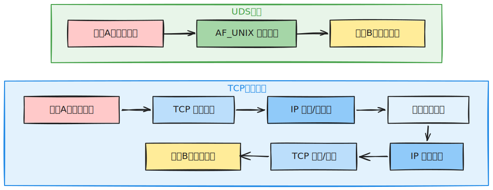
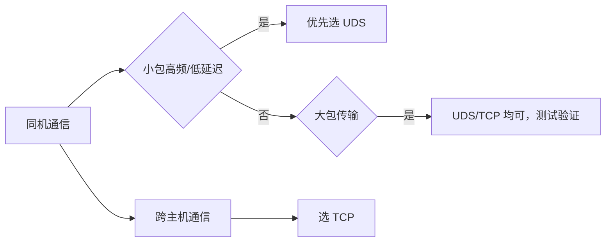

# Unix 域套接字（UDS）深度解析：Go 实战、性能优化与工程实践

## 摘要

在 Linux 单机进程间通信（IPC）场景中，Unix 域套接字（UDS）凭借“复用 Socket 接口、无网络协议栈开销”的特性，成为同机高频通信的优选方案。Go 标准库 `net` 原生支持 UDS，且其网络抽象模型让 UDS 开发与 TCP 开发高度兼容。本文从 UDS 核心原理出发，对比其与 TCP 回环套接字的差异，通过完整的 Go 实战案例（流模式、数据报模式、HTTP/RPC 承载），结合性能测试方法与开源项目实践，总结 UDS 开发的最佳实践与避坑要点，为 Go 开发者提供“能用、用好、用优”UDS 的完整指南。

## 一、Unix 域套接字核心原理

### 1.1 本质定义

Unix 域套接字是**同一主机内**的进程间通信端点，它复用 TCP/UDP 通用的 Socket API，但通信路径完全不经过 IP 路由和网络协议栈，仅依赖本地内核态转发，是 Linux 同机 IPC 中“高性能、易适配”的典型方案。

UDS 支持两种核心通信模式，适配不同业务场景：

- **流模式（`SOCK_STREAM`）**：类 TCP 特性，面向连接、可靠字节流传输，适用于需要数据完整性的高频交互（如本地 RPC、HTTP 服务）；
- **数据报模式（`SOCK_DGRAM`）**：类 UDP 特性，保留消息边界、无连接开销，适用于轻量通知、日志上报等场景。

> 核心澄清：UDS 并非“零拷贝”技术，其性能优势源于**省去 TCP/IP 协议栈处理、跨进程数据路径更短**，而非完全消除内存拷贝；在同机小包高频场景下，这一优势会显著体现。

### 1.2 与 TCP 回环套接字的核心差异

TCP 回环套接字（`127.0.0.1/localhost`）虽也用于同机通信，但仍需走完整的 TCP/IP 协议栈处理（如校验和、分片、IP 路由）；而 UDS 直接通过 `AF_UNIX` 域完成进程间数据转发，两者数据路径差异如下：



微软 gRPC/IPC 官方文档也明确：客户端与服务端同机部署时，UDS 延迟通常低于 TCP 回环，尤其在小包、高频交互场景下差距更明显。

### 1.3 寻址与权限控制

UDS 区别于 TCP/UDP 的核心特征是**基于文件系统路径寻址**（pathname socket），对应内核结构体 `sockaddr_un`。Linux `unix(7)` 手册定义了其权限语义：

- 创建 UDS 文件需目标目录的“写+搜索”权限；
- 连接流模式 UDS/向数据报模式 UDS 发消息，需对 UDS 文件有写权限。

典型的 UDS 文件权限示例：

```sh
srwxr-xr-x 1 root root 0 Mar 26 10:00 /run/echo.sock
```

这一特性让 UDS 具备两大优势：

1. 借助文件系统路径实现直观寻址，无需管理端口冲突；
2. 可通过 `chown`/`chmod`、目录权限等实现进程访问控制（注：该语义仅 Linux 下稳定，跨平台场景需谨慎依赖）。

## 二、Go 操作 UDS 基础实战

Go 标准库 `net` 对 UDS 提供“通用接口（`Dial/Listen`）+ 专用接口（`DialUnix/ListenUnixgram`）”双层支持，开发模式与 TCP 高度一致，学习成本极低。

### 2.1 流模式：Echo 服务（类 TCP 可靠通信）

流模式是 UDS 最常用的场景，以下实现“客户端发什么，服务端回什么”的经典 Echo 服务，重点体现 UDS 文件生命周期管理、连接处理核心逻辑。

#### 服务端

```go
package main

import (
    "io"
    "log"
    "net"
    "os"
    "os/signal"
    "syscall"
)

// SockAddr UDS 文件路径（生产环境建议放 /run/[应用名]/ 而非 /tmp）
const SockAddr = "/tmp/echo.sock"

// echoServer 处理单个客户端连接，实现回声逻辑
func echoServer(c net.Conn) {
    defer func() {
        _ = c.Close()
        log.Printf("客户端断开连接: %v", c.RemoteAddr())
    }()

    log.Printf("新客户端接入: %v", c.RemoteAddr())
    // io.Copy 实现“读-写”闭环，等价于把客户端发送的数据原封返回
    if _, err := io.Copy(c, c); err != nil {
        log.Printf("连接处理异常: %v", err)
    }
}

func main() {
    // 关键：启动前清理残留的 UDS 文件，避免 bind 失败
    if err := os.Remove(SockAddr); err != nil && !os.IsNotExist(err) {
        log.Fatalf("清理旧 UDS 文件失败: %v", err)
    }

    // 监听 Unix 域套接字
    l, err := net.Listen("unix", SockAddr)
    if err != nil {
        log.Fatalf("监听 UDS 失败: %v", err)
    }
    // 优雅清理：退出时关闭监听并删除 UDS 文件
    defer func() {
        _ = l.Close()
        _ = os.Remove(SockAddr)
    }()

    // 优雅退出：捕获 SIGINT/SIGTERM 信号，避免 UDS 文件残留
    sigCh := make(chan os.Signal, 1)
    signal.Notify(sigCh, syscall.SIGINT, syscall.SIGTERM)
    go func() {
        <-sigCh
        log.Println("收到退出信号，开始清理资源")
        _ = l.Close()
        _ = os.Remove(SockAddr)
        os.Exit(0)
    }()

    log.Printf("UDS Echo 服务已启动，地址: %s", SockAddr)
    // 循环接收客户端连接
    for {
        conn, err := l.Accept()
        if err != nil {
            log.Printf("Accept 失败: %v", err)
            continue
        }
        // 并发处理每个连接（Go 协程轻量化，适合高并发场景）
        go echoServer(conn)
    }
}
```

#### 客户端

```go
package main

import (
    "log"
    "net"
)

const SockAddr = "/tmp/echo.sock"

func main() {
    // 连接 UDS 服务
    c, err := net.Dial("unix", SockAddr)
    if err != nil {
        log.Fatalf("连接 UDS 服务失败: %v", err)
    }
    defer c.Close()

    // 发送测试数据
    sendData := []byte("Hello Unix Domain Socket!")
    if _, err := c.Write(sendData); err != nil {
        log.Fatalf("发送数据失败: %v", err)
    }

    // 读取服务端响应
    buf := make([]byte, 1024)
    n, err := c.Read(buf)
    if err != nil {
        log.Fatalf("读取响应失败: %v", err)
    }

    log.Printf("收到服务端响应: %s", string(buf[:n]))
}
```

#### 快速调试（无需编写客户端）

```bash
# 使用 nc 工具连接 UDS 流服务
nc -U /tmp/echo.sock
```

### 2.2 数据报模式：unixgram（类 UDP 轻量通信）

数据报模式无连接开销、保留消息边界，适合“一次性轻量通知”场景。需注意：Go 标准库无 `DialUnixgram` 接口，需通过 `DialUnix` 实现 `unixgram` 通信。

#### 服务端

```go
package main

import (
    "log"
    "net"
    "os"
)

const SockAddr = "/tmp/dgram.sock"

func main() {
    // 清理残留 UDS 文件
    if err := os.Remove(SockAddr); err != nil && !os.IsNotExist(err) {
        log.Fatalf("清理旧 UDS 文件失败: %v", err)
    }

    // 定义 UDS 地址（指定 unixgram 模式）
    addr := &net.UnixAddr{Name: SockAddr, Net: "unixgram"}
    // 监听数据报模式 UDS
    conn, err := net.ListenUnixgram("unixgram", addr)
    if err != nil {
        log.Fatalf("监听 unixgram 失败: %v", err)
    }
    defer func() {
        _ = conn.Close()
        _ = os.Remove(SockAddr)
    }()

    log.Printf("UDS 数据报服务已启动，地址: %s", SockAddr)
    buf := make([]byte, 1024)
    // 循环读取客户端消息
    for {
        n, remote, err := conn.ReadFromUnix(buf)
        if err != nil {
            log.Printf("读取消息失败: %v", err)
            continue
        }
        log.Printf("收到 [%v] 的消息: %s", remote, string(buf[:n]))
    }
}
```

#### 客户端

```go
package main

import (
    "log"
    "net"
)

const SockAddr = "/tmp/dgram.sock"

func main() {
    // 定义服务端 UDS 地址
    raddr := &net.UnixAddr{Name: SockAddr, Net: "unixgram"}
    // 关键：通过 DialUnix 建立 unixgram 连接（无 DialUnixgram 接口）
    conn, err := net.DialUnix("unixgram", nil, raddr)
    if err != nil {
        log.Fatalf("连接 unixgram 服务失败: %v", err)
    }
    defer conn.Close()

    // 发送数据报消息
    msg := []byte("UDS 数据报模式测试")
    if _, err := conn.Write(msg); err != nil {
        log.Fatalf("发送数据报失败: %v", err)
    }
    log.Println("数据报发送成功")
}
```

## 三、基于 UDS 承载上层协议：HTTP 与 RPC

UDS 作为传输层载体，可无缝承载基于 `net.Conn/net.Listener` 的上层协议。Go 标准库的 `net/http`、`net/rpc` 均符合该模型，只需少量改造即可从 TCP 切换到 UDS。

### 3.1 UDS 承载 HTTP 服务

#### 服务端

```go
package main

import (
    "log"
    "net"
    "net/http"
    "os"
)

const SockAddr = "/tmp/http.sock"

func main() {
    // 清理残留 UDS 文件
    if err := os.Remove(SockAddr); err != nil && !os.IsNotExist(err) {
        log.Fatalf("清理旧 UDS 文件失败: %v", err)
    }

    // 定义 HTTP 路由
    mux := http.NewServeMux()
    mux.HandleFunc("/hello", func(w http.ResponseWriter, r *http.Request) {
        _, _ = w.Write([]byte("Hello UDS HTTP!"))
    })
    mux.HandleFunc("/status", func(w http.ResponseWriter, r *http.Request) {
        w.Header().Set("Content-Type", "application/json")
        _, _ = w.Write([]byte(`{"code":200,"msg":"success","protocol":"uds"}`))
    })

    // 监听 UDS
    l, err := net.Listen("unix", SockAddr)
    if err != nil {
        log.Fatalf("监听 UDS 失败: %v", err)
    }
    defer func() {
        _ = l.Close()
        _ = os.Remove(SockAddr)
    }()

    log.Printf("UDS HTTP 服务已启动，地址: %s", SockAddr)
    // 启动 HTTP 服务（复用 UDS 监听器）
    if err := http.Serve(l, mux); err != nil {
        log.Fatalf("HTTP 服务退出: %v", err)
    }
}
```

#### 访问方式

1. 用 `curl` 快速测试：

```bash
# --unix-socket 指定 UDS 文件路径
curl --unix-socket /tmp/http.sock http://localhost/hello
curl --unix-socket /tmp/http.sock http://localhost/status
```

1. Go 客户端访问：

```go
package main

import (
    "context"
    "io"
    "log"
    "net"
    "net/http"
    "time"
)

func main() {
    // 自定义 HTTP 传输层：将 TCP 拨号替换为 UDS 拨号
    transport := &http.Transport{
        DialContext: func(ctx context.Context, network, addr string) (net.Conn, error) {
            // 忽略 network/addr，直接连接指定 UDS 文件
            return net.Dial("unix", "/tmp/http.sock")
        },
    }

    // 构建 HTTP 客户端
    client := &http.Client{
        Transport: transport,
        Timeout:   5 * time.Second, // 避免连接阻塞
    }

    // 发起请求
    resp, err := client.Get("http://localhost/hello")
    if err != nil {
        log.Fatalf("请求失败: %v", err)
    }
    defer resp.Body.Close()

    // 读取响应
    body, err := io.ReadAll(resp.Body)
    if err != nil {
        log.Fatalf("读取响应失败: %v", err)
    }
    log.Printf("HTTP 响应结果: %s", string(body))
}
```

### 3.2 UDS 承载 Go 标准库 RPC

#### 服务端

```go
package main

import (
    "log"
    "net"
    "net/http"
    "net/rpc"
    "os"
)

const SockAddr = "/tmp/rpc.sock"

// Greeter RPC 服务结构体
type Greeter struct{}

// Greet RPC 方法（必须符合 Go RPC 规范：入参/出参为指针、返回 error）
func (g *Greeter) Greet(name *string, reply *string) error {
    *reply = "Hello, " + *name + "! (UDS RPC)"
    return nil
}

func main() {
    // 清理残留 UDS 文件
    if err := os.Remove(SockAddr); err != nil && !os.IsNotExist(err) {
        log.Fatalf("清理旧 UDS 文件失败: %v", err)
    }

    // 注册 RPC 服务
    if err := rpc.Register(new(Greeter)); err != nil {
        log.Fatalf("注册 RPC 服务失败: %v", err)
    }
    // 将 RPC 服务绑定到 HTTP 协议
    rpc.HandleHTTP()

    // 监听 UDS
    l, err := net.Listen("unix", SockAddr)
    if err != nil {
        log.Fatalf("监听 UDS 失败: %v", err)
    }
    defer func() {
        _ = l.Close()
        _ = os.Remove(SockAddr)
    }()

    log.Printf("UDS RPC 服务已启动，地址: %s", SockAddr)
    // 启动 RPC 服务
    if err := http.Serve(l, nil); err != nil {
        log.Fatalf("RPC 服务退出: %v", err)
    }
}
```

#### 客户端

```go
package main

import (
    "log"
    "net/rpc"
)

const SockAddr = "/tmp/rpc.sock"

func main() {
    // 连接 UDS RPC 服务
    client, err := rpc.DialHTTP("unix", SockAddr)
    if err != nil {
        log.Fatalf("拨号 RPC 服务失败: %v", err)
    }
    defer client.Close()

    // 调用 RPC 方法
    var reply string
    name := "Go开发者"
    if err := client.Call("Greeter.Greet", &name, &reply); err != nil {
        log.Fatalf("调用 RPC 失败: %v", err)
    }

    log.Printf("RPC 调用结果: %s", reply)
}
```

## 四、性能对比：UDS vs TCP 回环

性能结论需基于“同机器、同内核、同负载”的基准测试，以下是通用结论与可落地的测试方法：

### 4.1 核心结论

| 场景                | UDS 优势                | TCP 回环适配性          |
|---------------------|-------------------------|-------------------------|
| 小包高频（128B/512B） | 延迟低（P95/P99 更优）| 协议栈开销高，延迟高    |
| 大包传输（4MB+）| 优势缩小（瓶颈在内存拷贝） | 与 UDS 性能接近         |
| 跨进程高并发        | 系统调用少，CPU 占用低  | 协议栈处理占用更多 CPU  |

### 4.2 基准测试设计

#### 延迟测试

- 测试维度：平均延迟、P95 延迟、P99 延迟；
- 测试负载：128B/512B/1KB 小包，请求-响应模式；
- 实现方式：用 Go `testing/benchmark` 编写压测用例，控制单连接/多连接场景。

#### 吞吐测试

- 测试维度：吞吐量（MB/s）、CPU 占用、系统调用次数（`strace -c`）；
- 测试负载：4KB/64KB/512KB/4MB 消息，单连接流式传输；
- 辅助工具：`perf` 分析内核态开销，`netstat` 监控连接状态。

### 4.3 选型建议



> 注：若需在文档中呈现具体数值，需补充：机器配置（CPU/内存）、Go 版本、内核版本、压测脚本、测试时长。

## 五、UDS 在开源项目中的工程实践

UDS 是容器、云原生基础设施的核心 IPC 方案，典型场景：

1. **容器运行时**：Docker（`/var/run/docker.sock`）、containerd（`/run/containerd/containerd.sock`）通过 UDS 实现本地控制面与运行时通信；
2. **本地代理/Agent**：Sidecar 进程、日志采集器（如 fluentd）通过 UDS 与业务进程通信；
3. **数据库本地连接**：MySQL/PostgreSQL 支持 UDS 连接（避免端口暴露）；
4. **同机微服务**：K8s 同 Pod 内容器间通信优先使用 UDS。

## 六、最佳实践与避坑指南

### 6.1 必做：管理 UDS 文件生命周期

- 启动前：调用 `os.Remove` 清理残留 UDS 文件（避免 `address already in use`）；
- 退出时：通过 `defer` + 信号处理（SIGINT/SIGTERM）确保关闭监听并删除 UDS 文件；
- 生产路径：避免 `/tmp`（易被系统清理），推荐 `/run/[应用名]/` 或 `/var/run/[应用名]/`。

### 6.2 谨慎：权限控制的跨平台性

- Linux 下可通过 `chown/chmod` 控制 UDS 文件权限，但该语义不具备跨平台兼容性；
- 高安全场景：结合 Linux 命名空间、SELinux 增强隔离，而非仅依赖文件权限。

### 6.3 关键：设置超时避免资源泄漏

UDS 连接仍可能阻塞，需显式设置读写超时：

```go
// 示例：设置 10 秒读写超时
_ = conn.SetReadDeadline(time.Now().Add(10 * time.Second))
_ = conn.SetWriteDeadline(time.Now().Add(10 * time.Second))
```

### 6.4 避坑：控制 UDS 路径长度

Linux 下 `sockaddr_un.sun_path` 有长度限制（通常 108 字节），路径过长会导致 `bind` 失败，建议保持路径短小（如 `/run/app/app.sock`）。

## 七、总结与选型建议

UDS 的核心价值是：**同机通信场景下，以极低的迁移成本获得比 TCP 回环更优的性能，且借助文件系统实现灵活的寻址与权限控制**。

### 优先选 UDS 的场景

- 同机微服务/进程间高频交互；
- 本地 HTTP/RPC/gRPC 服务；
- 容器运行时、数据库本地连接；
- Sidecar/Agent/Daemon 与业务进程通信。

### 优先选 TCP 的场景

- 需要跨主机通信；
- 依赖现有网络基础设施（如负载均衡、监控）；
- 需跨平台兼容（Windows/macOS 对 UDS 支持有限）。

### 最终建议

对于 Go 项目，从 TCP 切换到 UDS 的成本极低：仅需将 `net.Listen("tcp", ...)`/`net.Dial("tcp", ...)` 替换为 `unix` 相关接口，并补充 UDS 文件生命周期管理。若服务端与客户端明确同机部署，优先尝试 UDS，可显著降低延迟与系统开销。

### 参考

ref: <https://zhuanlan.zhihu.com/p/423856852>
