## 导语

想学好Prometheus，先得搞懂它在监控和时序数据库领域的“定位”。这篇作为系列开篇，我们先聊聊时序数据库的江湖格局，再拆解Prometheus的核心架构，最后手把手教你安装Prometheus、搭建源码环境，以及对接Grafana实现数据可视化。

## 一、时序数据库的“江湖混战”

在Prometheus出圈之前，时序数据库和监控系统早已百花齐放，不同方案各有优劣，我们逐一拆解它们的核心特性与痛点，更清晰地看到Prometheus的“破局点”：

### 1. InfluxDB：性能出众但生态与商用受限

InfluxDB是Golang编写的时序数据库，在2019年前后仍是时序数据库领域的热门选择，其核心优势体现在**极致的读写性能**——官方对比测试显示，它在时序数据写入、压缩及实时查询上远超Cassandra、OpenTSDB等同类；同时支持HTTP API/gRPC等多接口、类SQL的InfluxQL查询语言，降低了使用门槛。

为了补齐监控生态，InfluxData围绕InfluxDB打造了TICK Stack：Telegraf负责数据采集、Kapacitor做流处理与告警、Chronograf提供可视化。但InfluxDB的硬伤也十分明显：高可用与集群方案仅在企业版/云服务中付费提供，且价格高昂，这成为很多企业转向Prometheus的关键原因。

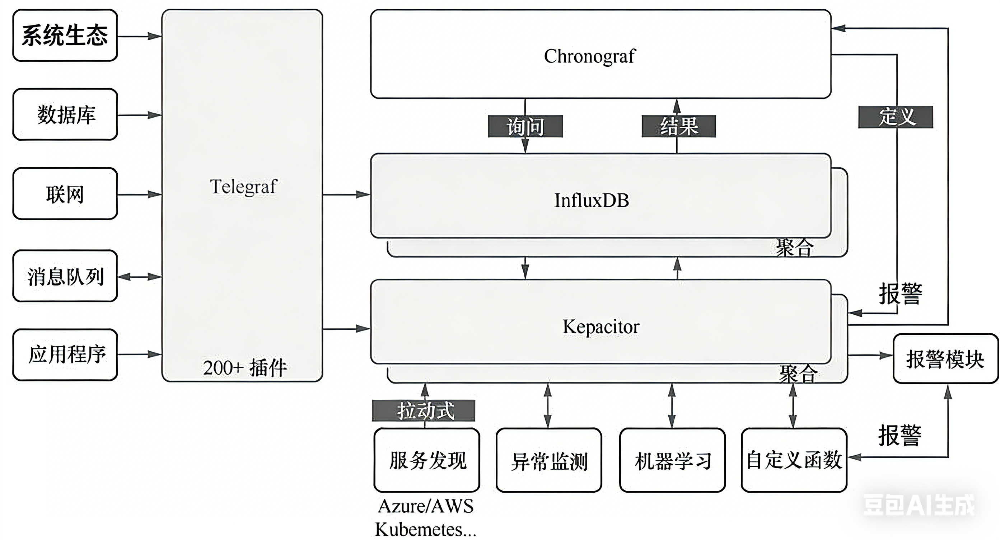

**图 1-1：TICK Stack 架构图**

### 2. Graphite：轻量老牌但功能短板突出

Graphite是老牌企业级监控工具，能在低配硬件上稳定运行，核心定位是机器指标（CPU、内存、I/O等）监控。它的架构简单：Carbon接收数据、Whisper（RRD格式）存储数据、Graphite API支撑Web UI，但自身不采集数据，需搭配Collectd等工具使用。


**图 1-2：Graphite 架构图**

Graphite的优势是社区成熟、插件丰富，但缺点也致命：

- RRD存储要求数据固定间隔写入，处理乱序数据需额外适配；
- 无类SQL查询能力、缺乏复制一致性保障；
- 原生无告警功能，只能靠第三方插件弥补。

### 3. OpenTSDB：海量存储但部署复杂

OpenTSDB基于HBase构建，其时序数据模型与Prometheus高度相似（均通过metric+tag/label标识时序）。它的无状态设计可轻松实现高可用，底层依赖HBase的多副本特性保障数据安全。

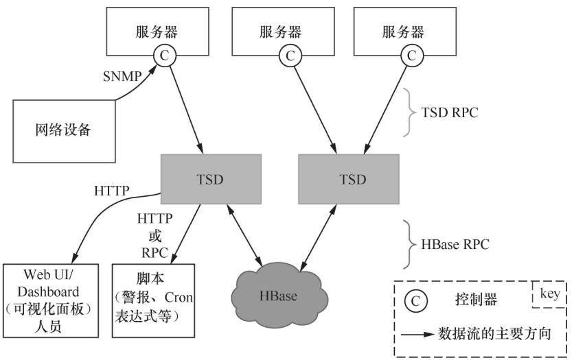

**图 1-3：OpenTSDB 架构图**

但OpenTSDB的痛点集中在“重部署、低灵活”：

- 依赖Hadoop/HBase增加了运维复杂度；
- RowKey设计易引发HBase热点问题；
- 无数据压缩、无自动聚合/降采样能力，查询大时间段数据时响应极慢；
- 原生无告警、Web UI功能单一，只能依赖Grafana可视化。

### 4. Open-Falcon：中小规模适配但架构有瓶颈

Open-Falcon是小米开源的完整监控方案，由十余个组件构成，核心包括Falcon-Agent（数据采集）、Transfer（数据转发）、Graph（数据存储）、Judge（告警判断）、Alarm（告警发送）等。多数组件无状态可水平扩展，适配中小规模企业的监控需求。

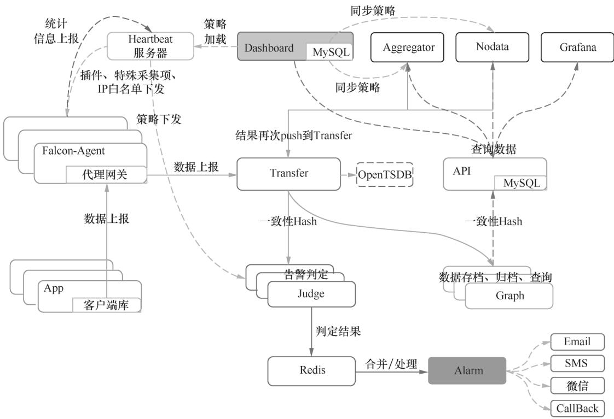

**图 1-4：Open-Falcon 架构图**

但Open-Falcon的架构瓶颈显著：

- Graph基于RRD格式存储，数据量增大后磁盘I/O易成瓶颈；
- 精确历史数据保存时间短，不利于问题回溯；
- Alarm模块存在单点风险，且Hash不均、Graph写入瓶颈等问题长期未彻底解决。

这些方案的痛点，也正是Prometheus能快速崛起的原因——它不只是一个监控系统，而是一套“监控生态”，既解决了时序存储的性能问题，又补齐了生态完整性的短板。

## 二、Prometheus 核心架构与组件

Prometheus能成为新一代监控标杆，核心在于其“全链路闭环”的生态设计，每个组件各司其职，且可灵活扩展：

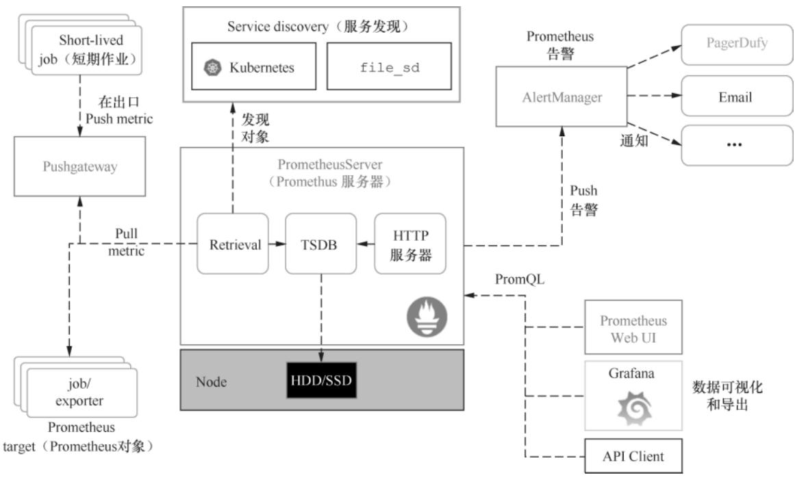

**图 1-5：Prometheus 核心架构图**

### 1. 核心组件：从采集到告警的完整链路

| 组件                | 核心功能                                                                 |
|---------------------|--------------------------------------------------------------------------|
| Prometheus Server   | 生态核心，包含Scrape（数据拉取）、存储（本地TSDB）、查询（PromQL）三大模块 |
| TSDB                | 本地时序存储，极致压缩时序数据，保障读写性能                             |
| AlertManager        | 告警管理中心，支持去重、分组、多渠道告警发送，集群部署避免单点           |
| Exporter/Client     | 数据采集端：Client直出应用指标，Exporter适配第三方组件，Pushgateway中转推送 |
| Recording Rule      | 预计算复杂PromQL并持久化，避免频繁查询损耗性能                           |
| Grafana             | 可视化标配，自定义Dashboard、多数据源聚合，远超原生UI                    |

**Prometheus Server 细分模块说明**：

- Scrape模块：周期性从各类Target拉取（pull）监控数据，支持静态配置Target或动态服务发现；
- 存储模块：默认使用本地TSDB存储数据，也支持对接InfluxDB、OpenTSDB等远程存储扩展容量；
- 查询模块：提供PromQL查询语言，支持瞬时值、范围查询及复杂聚合/函数操作，满足多维度分析需求。

### 2. 核心设计：Pull模式的优势

Prometheus采用“拉取（pull）”模式采集数据，相比传统Push模式有两大核心优势：

- **灵活性**：Prometheus可自主控制采集频率，且能直接访问Target的`/metrics`接口验证数据，排查问题更高效；
- **鲁棒性**：即使Target短暂离线，也不会丢失数据（恢复后可补采），且无需担心Push模式下“数据洪峰”压垮监控系统。

## 三、快速上手：安装与环境搭建

### 1. 5分钟安装Prometheus（以Mac版本2.8.0为例）

Prometheus无需依赖复杂环境，二进制包即可一键启动：

#### 步骤1：下载并解压

```bash
# 下载对应版本二进制包（可从Prometheus官网获取）
tar xvfz prometheus-2.8.0.darwin-amd64.tar.gz
cd prometheus-2.8.0.darwin-amd64
```

#### 步骤2：理解核心配置文件prometheus.yml

默认配置文件包含3个核心部分，是后续定制化的基础：

```yaml
# global：全局配置
global:
  scrape_interval: 15s        # 采集Target的默认间隔
  evaluation_interval: 15s    # 计算Recording Rule的默认间隔

# rule_files：指定Recording Rule/告警规则文件
rule_files:
  # - "alert.rules"   # 告警规则文件（按需启用）
  # - "record.rules"  # 记录规则文件（按需启用）

# scrape_configs：配置需要采集的Target
scrape_configs:
  - job_name: 'prometheus'    # 采集自身监控数据的Job名称
    static_configs:
      - targets: ['localhost:9090']  # Prometheus自身的监听地址
```

#### 步骤3：启动Prometheus

```bash
./prometheus --config.file=prometheus.yml
```

启动验证：

- 访问 `http://localhost:9090/graph` 进入原生查询界面；

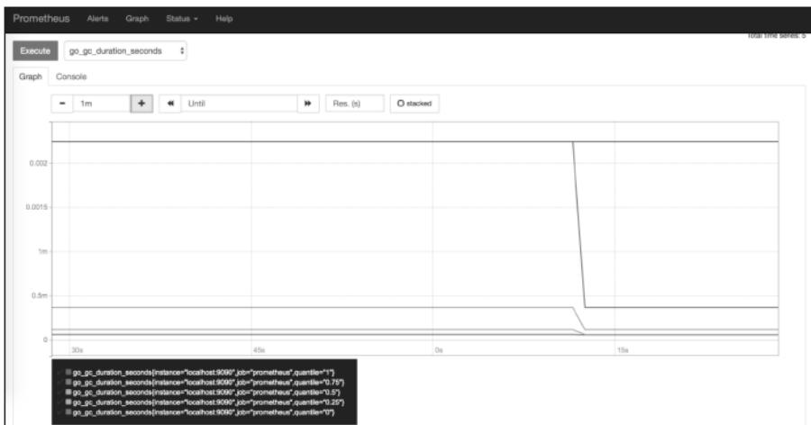

**图 1-6：Prometheus 原生查询界面**

- 访问 `http://localhost:9090/metrics` 可查看Prometheus自身的监控指标，示例格式如下：

```
# HELP go_gc_duration_seconds A summary of the GC invocation durations.
# TYPE go_gc_duration_seconds summary
go_gc_duration_seconds{quantile="0"} 1.8375e-05
go_gc_duration_seconds{quantile="0.25"} 3.4324e-05
go_gc_duration_seconds{quantile="0.5"} 4.0923e-05
go_gc_duration_seconds{quantile="0.75"} 5.0942e-05
go_gc_duration_seconds{quantile="1"} 0.003033757
go_gc_duration_seconds_sum 0.028591953
go_gc_duration_seconds_count 371

# HELP go_goroutines Number of goroutines that currently exist.
# TYPE go_goroutines gauge
go_goroutines 36

# HELP go_info Information about the Go environment.
# TYPE go_info gauge
go_info{version="go1.11.1"} 1
```

**图 1-7：Prometheus自身metrics数据格式示例**

### 2. 源码环境搭建：读懂Prometheus的底层逻辑

若想深入理解Prometheus的实现原理，搭建源码环境是必经之路（以Goland IDE为例）：

#### 步骤1：准备Go环境

确保本地安装了Go环境（建议匹配Prometheus开发版本，如go1.11+），并配置好`GOPATH`、`GOROOT`等环境变量。

#### 步骤2：拉取源码

```bash
# 拉取Prometheus源码到本地GOPATH
go get github.com/prometheus/prometheus
# 进入源码目录
cd $GOPATH/src/github.com/prometheus/prometheus
```

#### 步骤3：导入Goland并配置运行

1. 将下载的源码导入Goland IDE；

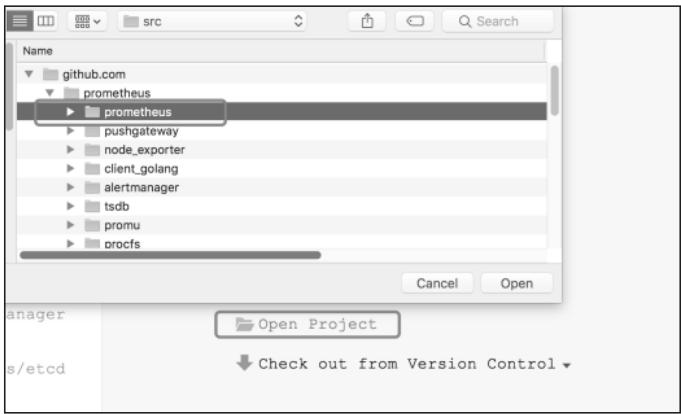

**图 1-8：Goland 导入Prometheus源码**

2. 配置运行参数：
   - 定位到`main.go`文件（路径：`cmd/prometheus/main.go`）；
   - Program arguments填写：`--config.file=./prometheus.yml`；

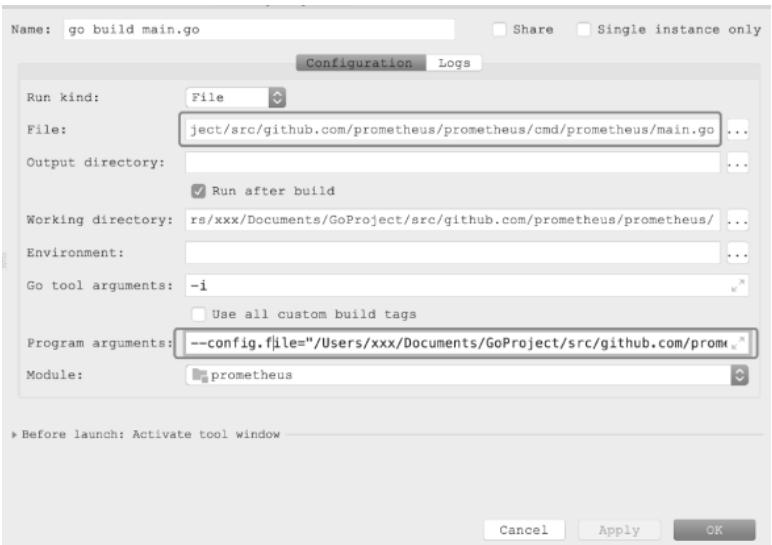

**图 1-9：Goland 配置Prometheus运行参数**

3. 编译/调试：
   - 编译：执行`go build main.go`生成可执行文件；
   - 调试：直接点击“Run”按钮启动，可断点调试源码逻辑。

### 3. Grafana接入Prometheus：可视化监控数据

Prometheus原生UI仅适合调试，Grafana是生产环境可视化的首选，以下是快速对接步骤：

#### 步骤1：安装Grafana（Mac版）

```bash
# 更新brew源
brew update
# 安装Grafana
brew install grafana
# 启动Grafana服务（开机自启）
brew services start grafana
```

#### 步骤2：配置Prometheus数据源

1. 访问 `http://localhost:3000`，使用默认账号`admin/admin`登录（首次登录需修改密码）；
2. 进入“Data Sources”页面；

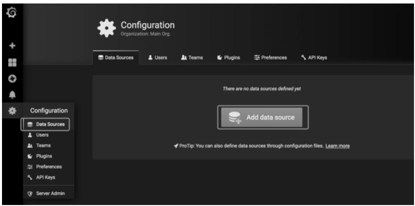

**图 1-10：Grafana Data Sources 页面**

1. 点击“Add data source”，选择“Prometheus”；
2. 填写配置项：
   - Name：自定义名称（如Prometheus-Local）；
   - URL：`http://localhost:9090`（Prometheus服务地址）；
   - 其余保持默认，点击“Save & Test”验证，提示“Data source is working”即配置成功；

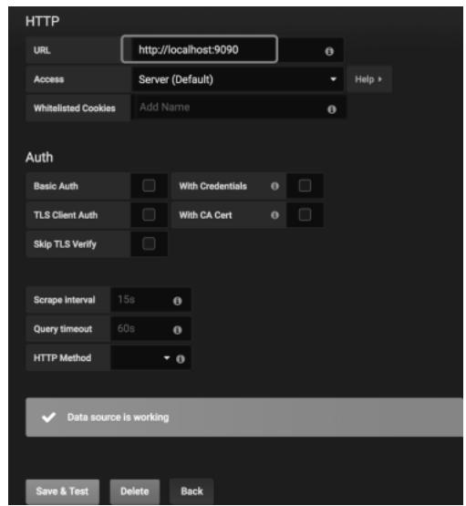

**图 1-11：Grafana 配置Prometheus数据源**

#### 步骤3：创建自定义Dashboard

1. 返回主页，点击“Dashboard”；

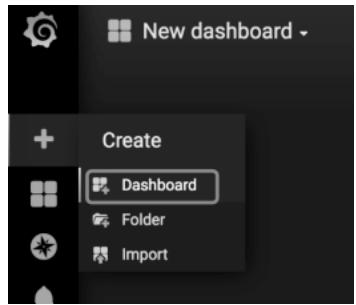

**图 1-12：Grafana Dashboard 入口**

2. 选择“New panel” → “Add Query”；

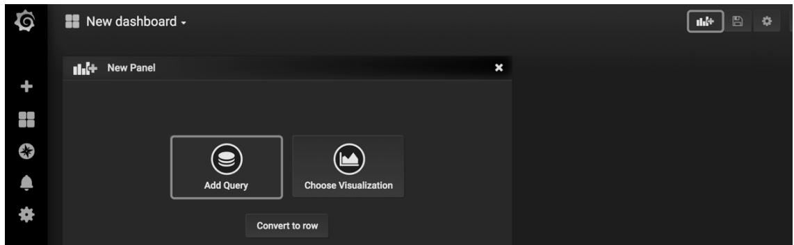

**图 1-13：Grafana 新建Panel并添加Query**

3. 选择已配置的Prometheus数据源，输入PromQL语句（如`go_goroutines`），即可可视化时序数据；

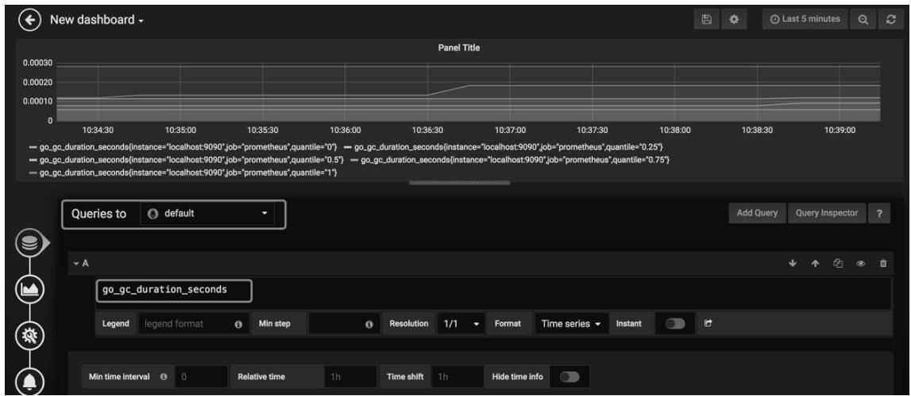

**图 1-14：Grafana 可视化Prometheus时序数据**

## 小结

本篇我们从“时序数据库江湖”切入，对比了InfluxDB、Graphite、OpenTSDB、Open-Falcon等主流方案的优劣势，清晰看到了Prometheus的定位与优势；接着拆解了Prometheus的核心架构与组件逻辑，理解了其“Pull模式+TSDB+PromQL”的核心设计；最后完成了Prometheus的快速安装、源码环境搭建，以及Grafana的可视化对接。

到这里，你已经掌握了Prometheus的“入门三板斧”，但真正的实战才刚刚开始——下一篇，我们将聚焦Prometheus的核心配置文件`prometheus.yml`，逐行拆解`global`、`scrape_configs`、`rule_files`等配置项的含义，结合实战场景讲解如何定制采集规则、优化采集性能，以及编写第一条告警规则。
