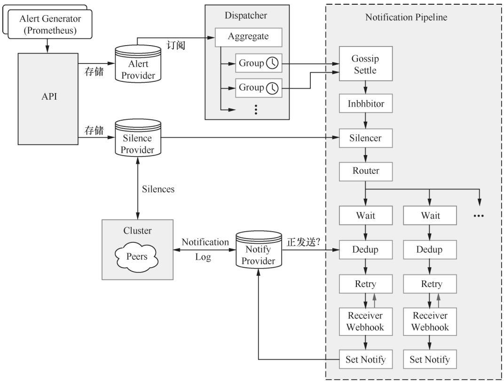
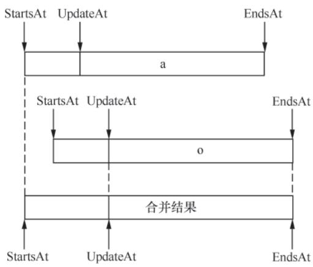
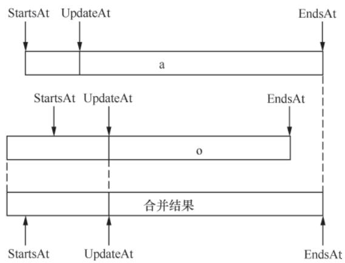
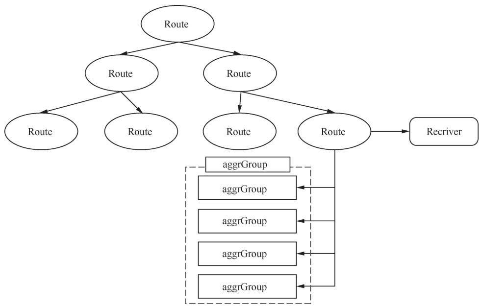
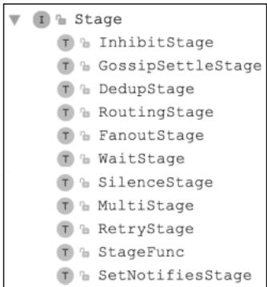
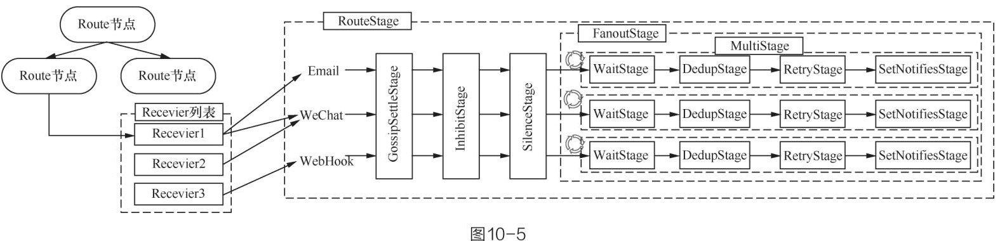

# Prometheus 技术秘笈（十）：深入AlertManager - 告警处理的全流程

## 导语

Prometheus仅负责通过Alerting Rule触发并生成告警，而AlertManager承担了告警“最终处理”的核心职责：涵盖告警去重、分组聚合、级别抑制、静默屏蔽、多渠道路由等关键能力。相较于简单的“消息推送”，AlertManager的设计围绕**降低告警噪音**、**保障高可用**、**适配复杂业务场景**三大核心目标展开。本文将从架构拆解、Pipeline全流程、集群实现三个维度，深入剖析AlertManager的底层实现逻辑。

## 一、AlertManager核心架构

AlertManager的核心架构围绕“接收-存储-分发-处理-发送”的链路设计，官方架构图清晰呈现了各模块的协作关系：


**图10-1 AlertManager核心架构图**

其核心模块可拆解为以下5个部分，各模块的职责与实现细节如下：

### 1.1 接收告警（API模块）

AlertManager通过V1版本API（V2版本暂未稳定）接收Prometheus Server推送的告警信息，核心接口为`/api/v1/alerts`，由`API.addAlerts()`方法实现，核心流程：

1. 反序列化Prometheus发送的JSON格式告警数据，生成`types.Alert`实例；
2. 校验告警的Label合法性（清除空Label、检测字段完整性）；
3. 调整告警的时间字段（`StartsAt`/`EndsAt`/`UpdatedAt`），例如补全空的`EndsAt`为当前时间+超时时间；
4. 调用`API.insertAlerts()`将告警写入Alert Provider暂存。

API模块注册的核心接口如下（伪代码）：

```go
func (api *API) Register(r *route.Router) {
    r.OPTIONS("/*path", wrap(func(w http.ResponseWriter, r *http.Request) {}))
    r.Get("/status", wrap(api.status))
    r.Get("/receivers", wrap(api.receivers))
    r.Post("/alerts", wrap(api.addAlerts)) // 核心接收告警接口
    r.Get("/silences", wrap(api.listSilences)) // 静默规则查询
    r.Post("/silences", wrap(api.setSilence)) // 静默规则新增/更新
    // 其他静默规则、错误查询接口...
}
```

### 1.2 查询Receiver（配置解析模块）

Receiver是告警接收方的抽象，对应AlertManager配置文件中的`receivers`节点，可配置邮件、微信、Webhook等多种通知渠道（支持多渠道并存）。核心字段包括：

- `Name`：接收方唯一标识；
- `EmailConfigs`：邮件配置（接收邮箱、SMTP信息等）；
- `WebhookConfigs`：Webhook配置（回调URL、请求头等）；
- `WechatConfigs`：微信配置（企业微信机器人、接收人等）。

API模块提供`/api/v1/receivers`接口查询所有Receiver配置，核心逻辑是遍历`config.Receivers`集合，返回所有接收方名称：

```go
func (api *API) receivers(w http.ResponseWriter, req *http.Request) {
    // 加锁保证并发安全
    receivers := make([]string, 0, len(api.config.Receivers))
    for _, r := range api.config.Receivers {
        receivers = append(receivers, r.Name)
    }
    api.response(w, receivers)
}
```

### 1.3 存储告警（Alert Provider）

Alert Provider是告警的暂存层，核心接口为`provider.Alerts`，定义了告警的订阅、查询、写入能力：

```go
type Alerts interface {
    // 订阅告警变更（返回迭代器）
    Subscribe() AlertIterator
    // 获取待发送的告警
    GetPending() AlertIterator
    // 根据唯一标识（Fingerprint）查询告警
    Get(model.Fingerprint) (*types.Alert, error)
    // 写入告警集合
    Put(...*types.Alert) error
}
```

AlertManager默认实现为基于内存的`mem.Alerts`，核心特性：

- 底层通过`store.Alerts`存储（`map[model.Fingerprint]*types.Alert`），定期GC清理已恢复的告警；
- 支持告警合并：写入重复告警时，根据`Fingerprint`合并`StartsAt`/`EndsAt`字段；
- 订阅机制：通过`listeners`维护订阅者的通道，新告警写入时主动推送至订阅方（Dispatcher）。



**图10-2 告警合并逻辑示意图**

`mem.Alerts`的GC机制：后台goroutine定期调用`gc()`方法，筛选出`Resolved()`为true的告警，删除并触发回调函数（同步至集群其他节点）：

```go
func (a *Alerts) gc() {
    resolved := []*types.Alert{}
    for fp, alert := range a.c {
        if alert.Resolved() {
            delete(a.c, fp)
            resolved = append(resolved, alert)
        }
    }
    a.cb(resolved) // 回调清理订阅者、Marker等
}
```

### 1.4 分发告警（Dispatcher）

Dispatcher是告警的“分发中枢”，核心职责是将Alert Provider中的告警按Route规则过滤、按Label分组，最终送入Pipeline处理。


**图10-3 Dispatcher核心结构**

#### 1.4.1 Route规则树

Dispatcher维护一棵Route规则树，每个Route节点通过`Matchers`（等于/正则匹配）筛选告警，支持`Continue`配置（匹配后是否继续匹配同层级Route）。核心匹配逻辑（修复切片追加错误）：

```go
func (r *Route) Match(lset model.LabelSet) []*Route {
    if !r.Matchers.Match(lset) {
        return nil
    }
    var all []*Route
    for _, cr := range r.Routes {
        matches := cr.Match(lset)
        all = append(all, matches...) // 修复原代码切片嵌套问题
        if matches != nil && !cr.Continue {
            break
        }
    }
    if len(all) == 0 {
        all = append(all, r)
    }
    return all
}
```

#### 1.4.2 告警分组（Aggregate Group）

匹配Route的告警会按指定Label分组为`aggrGroup`，避免“告警洪泛”（例如数据中心故障导致上千条告警）。`aggrGroup`核心特性：

- 按分组Label的`Fingerprint`唯一标识；
- 定时调用`flush()`方法，将分组内告警送入Pipeline；
- 清理已恢复的告警，避免重复发送。

```go
func (d *Dispatcher) processAlert(alert *types.Alert, route *Route) {
    // 获取分组Label并生成唯一标识
    groupLabels := getGroupLabels(alert, route)
    fp := groupLabels.Fingerprint()
    
    // 查找/创建aggrGroup
    group, ok := d.aggrGroups[route]
    if !ok {
        group = map[model.Fingerprint]*aggrGroup{}
        d.aggrGroups[route] = group
    }
    ag, ok := group[fp]
    if !ok {
        ag = newAggrGroup(d.ctx, groupLabels, route, d.timeout, d.logger)
        group[fp] = ag
        // 启动goroutine定时处理分组告警
        go ag.run(func(ctx context.Context, alerts ...*types.Alert) bool {
            _, err := d.stage.Exec(ctx, d.logger, alerts...)
            return err == nil
        })
    }
    
    // 写入告警至分组
    ag.insert(alert)
}
```

### 1.5 通知日志（Notify Provider）

Notify Provider负责记录告警通知的发送日志，并同步至集群其他节点，核心目标是避免重复发送。日志内容包括告警标识、发送时间、接收方、发送状态等，是DedupStage（去重）的核心依赖。

## 二、告警处理Pipeline

Pipeline是AlertManager处理告警的“责任链”，由多个Stage串联而成，核心目标是对告警进行过滤、去重、重试，最终发送至指定Receiver。


**图10-4 Stage接口及核心实现**

Pipeline的整体结构由`RoutingStage`（按Receiver路由）、`MultiStage`（顺序执行Stage）、`FanoutStage`（并发执行Stage）封装：


**图10-5 Route、Receiver与Pipeline的对应关系**

以下是核心Stage的实现细节：

### 2.1 GossipSettleStage：集群状态同步

AlertManager集群基于Gossip协议实现去中心化同步，GossipSettleStage的核心职责是等待集群节点状态一致（避免刚启动/加入的节点处理告警时数据不全）。

Gossip协议的三种实现方式：

- Push：节点A收到告警后，随机选择节点B推送，节点B重复该操作（跳过A）；
- Pull：节点A定期随机选节点拉取新告警；
- Pull+Push：结合两种方式，是AlertManager的默认实现。

GossipSettleStage的实现逻辑：

```go
func (n *GossipSettleStage) Exec(ctx context.Context, l log.Logger, alerts ...*types.Alert) (context.Context, []*types.Alert, error) {
    if n.peer != nil {
        n.peer.WaitReady() // 阻塞至集群同步完成（默认超时2s）
    }
    return ctx, alerts, nil
}
```

### 2.2 InhibitStage：告警抑制

告警抑制用于避免“级联告警噪音”（例如：critical级别告警触发时，屏蔽同对象的warning级别告警），依赖配置文件中的`inhibit_rule`：

```yaml
inhibit_rules:
  - source_match:
      severity: 'critical'
    target_match:
      severity: 'warning'
    equal: ['alertname', 'cluster', 'service'] # 必须匹配的Label
```

InhibitStage的核心是`Inhibitor`（实现`types.Muter`接口），通过`Mutes()`方法判断告警是否应被抑制：

```go
func (n *InhibitStage) Exec(ctx context.Context, l log.Logger, alerts ...*types.Alert) (context.Context, []*types.Alert, error) {
    var filtered []*types.Alert
    for _, a := range alerts {
        if !n.muter.Mutes(a.Labels) { // 过滤被抑制的告警
            filtered = append(filtered, a)
        }
    }
    return ctx, filtered, nil
}
```

> 补充说明：`Inhibitor.Mutes()`逻辑为遍历所有`inhibit_rule`，若存在“source匹配的告警”且“equal Label一致”，则抑制target匹配的告警。

### 2.3 SilenceStage：静默规则

静默规则是“临时屏蔽指定告警”的能力（例如：运维变更期间屏蔽相关告警），通过API配置（`/api/v1/silences`），核心逻辑：

1. 静默规则存储在`silence.Silences`中，通过Gossip同步至集群所有节点；
2. SilenceStage遍历告警，若匹配任意生效的静默规则，则直接过滤（不进入后续Stage）；
3. 静默规则支持按Label匹配、指定生效时间，过期后自动失效。

### 2.4 WaitStage：让步等待

WaitStage的核心作用是“按集群节点索引等待”，避免集群内多个节点同时处理同一条告警。默认等待时间为`节点索引 * 5s`，实现逻辑：

```go
func (n *WaitStage) Exec(ctx context.Context, l log.Logger, alerts ...*types.Alert) (context.Context, []*types.Alert, error) {
    select {
    case <-time.After(n.wait()): // 等待指定时长
    case <-ctx.Done():
        return ctx, nil, ctx.Err()
    }
    return ctx, alerts, nil
}
```

### 2.5 DedupStage：告警去重

DedupStage是避免“重复发送告警”的核心，依赖Notify Provider存储的发送日志：

1. 读取告警的`Fingerprint`，查询集群内是否已有节点发送过该告警；
2. 若已发送（日志存在且未过期），则过滤该告警；
3. 若未发送，标记“待发送”并进入后续Stage。

> 补充说明：核心依赖的`NotificationLog`会记录告警发送状态，并通过Gossip同步至集群，确保所有节点感知发送状态。

### 2.6 RetryStage：失败重试

RetryStage负责处理告警发送失败的场景，核心逻辑：

1. 按配置的重试策略（指数退避/固定间隔）重新调用发送逻辑；
2. 记录重试次数，超过阈值则标记为“发送失败”，停止重试；
3. 失败日志同步至集群，避免其他节点重复重试。

```go
func (n *RetryStage) Exec(ctx context.Context, l log.Logger, alerts ...*types.Alert) (context.Context, []*types.Alert, error) {
    var err error
    for i := 0; i < n.maxRetries; i++ {
        _, _, err = n.next.Exec(ctx, l, alerts...) // 调用下一个Stage
        if err == nil {
            return ctx, alerts, nil
        }
        time.Sleep(n.retryInterval(i)) // 退避等待
    }
    return ctx, alerts, fmt.Errorf("max retries reached: %v", err)
}
```

### 2.7 SetNotifiesStage：发送告警

SetNotifiesStage是Pipeline的最后一环，核心职责是：

1. 根据Receiver配置，选择对应的通知渠道（邮件/微信/Webhook等）；
2. 渲染告警内容（结合模板），调用对应Notifier的发送方法；
3. 记录发送日志至`NotificationLog`，同步至集群。

## 三、cluster模块：AlertManager集群实现

集群模式是AlertManager高可用的核心保障，cluster模块基于Gossip协议实现以下核心能力：

### 3.1 集群节点发现

AlertManager支持多种节点发现方式：

- 静态配置：直接指定集群节点地址；
- DNS发现：通过DNS解析获取集群节点；
- 服务发现：对接K8s/Consul等服务注册中心。

### 3.2 集群数据同步

集群内同步的核心数据包括：

- 静默规则（`silence.Silences`）：新增/删除/更新时通过Gossip扩散至所有节点；
- 告警发送日志（`NotificationLog`）：发送告警后立即同步，避免重复发送；
- 已恢复告警：GC清理的告警同步至集群，确保所有节点删除该告警。

### 3.3 无主集群设计

AlertManager集群无Master/Slave之分，所有节点平等：

- Prometheus Server可将告警发送至任意节点；
- 任意节点均可处理告警、响应API请求；
- 单个节点宕机不影响整体功能，剩余节点自动接管。

## 小结

AlertManager是Prometheus告警体系的“总控中心”，其核心价值在于：

1. 降低告警噪音：通过分组、抑制、静默、去重，避免“告警洪泛”；
2. 保障高可用：去中心化集群设计，无单点故障；
3. 适配复杂场景：支持多渠道路由、自定义模板、重试策略等。

合理配置AlertManager的Route规则、抑制规则、静默规则，可大幅提升故障响应效率——让运维人员只关注“关键告警”，而非被海量冗余告警淹没。

> 下一篇预告：聚焦Prometheus Client，详解如何在业务代码中埋点，实现自定义指标的采集与监控，完成Prometheus生态的最后一块拼图。
