# Prometheus 技术秘笈（三）：深入TSDB - 读懂Prometheus的存储底层

## 导语

TSDB 是 Prometheus 的核心，所有时序数据的存储、读写、压缩均依托于它。Prometheus TSDB 的设计高度借鉴 Facebook Gorilla 压缩算法，通过分块存储、写前日志（WAL）、后台压缩等机制实现时序数据的高效管理；但其本地存储特性也决定了它更适用于短期窗口的时序数据保存与查询。本文从底层原理入手，拆解 TSDB 的设计思路、文件结构、核心实现，厘清 Prometheus 高效存储时序数据的底层逻辑。

## 一、TSDB 的底层基石：Gorilla 压缩算法

Facebook 的 Gorilla 论文是 TSDB 设计的核心，核心思路是对 timestamp（时间戳）和 value（时序值）做极致压缩——可将原本 16 字节的时序点压缩至 1.37 字节，大幅降低存储开销。

## 1.1 timestamp 压缩：delta-of-delta（差值的差值）编码

在时序监控场景中（如机器 CPU、内存监控），一条时序的相邻时序点时间戳间隔具备强规律性（如分钟级监控的 60s 间隔）。若完整存储每个 64 位时间戳，会占用大量磁盘 I/O 和存储空间。为此 Gorilla 提出 delta-of-delta（dod，差值的差值）压缩方式，Prometheus TSDB 为适配毫秒级时间戳，对该方案做了扩展优化。

### 核心存储规则

- 时序第一个时序点的时间戳 $t_0$ 完整存储；
- 第二个时序点的时间戳 $t_1$，实际存储 $t_1 - t_0$ 的差值；
- 后续时序点时间戳 $t_n$，先计算 dod 值：$\text{delta} = (t_n - t_{n-1}) - (t_{n-1} - t_{n-2})$，再按变长编码规则存储：
  - dod 值为 0：仅用 1bit 存储“0”；
  - dod 值在 [-8191, 8192]：存储“10”标识 + 14bit 存储该 dod 值；
  - dod 值在 [-65535, 65536]：存储“110”标识 + 17bit 存储该 dod 值；
  - dod 值在 [-524287, 524288]：存储“1110”标识 + 20bit 存储该 dod 值；
  - dod 值超出上述范围：存储“1111”标识 + 64bit 存储该 dod 值。

实践中约 95% 的 timestamp 可按 dod 值为 0 的规则存储，极大减少存储占用。

### 示例说明

某机器 CPU 监控时序的相邻时间戳差值为 60s、60s、59s、60s、61s、59s，对应的 dod 值为 0s、-1s、1s、1s、-2s。
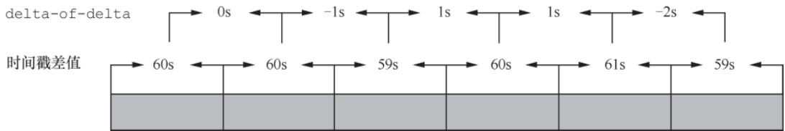
**图 3-1 delta-of-delta计算示例**

## 1.2 value 值压缩：XOR 异或编码

时序场景中，同一条时序的相邻 value 值（多为浮点型）通常变化极小，其符号位、指数位和尾数前几位高度一致，基于此 Gorilla 采用 XOR 运算实现压缩。

### 核心压缩步骤

- 时序第一个时序点的 value 值直接保存（不压缩）；
- 从第二个时序点开始，将当前 value 值与前一个 value 值做 XOR 运算：
  - 若 XOR 结果为 0（值完全相同）：仅用 1bit 存储“0”；
  - 若 XOR 结果非 0：先存储 1bit“1”作为控制位第 1bit，再根据控制位第 2bit 处理：
    - 控制位第 2bit 为“0”：XOR 结果的非 0 部分与前一次 XOR 结果一致，仅存储该非 0 部分；
    - 控制位第 2bit 为“1”：用 5bit 存储 XOR 结果中前置 0 的数量 + 6bit 存储非 0 位长度 + 存储非 0 位内容。

### 数据表现

- 约 60% 的 value 值仅用 1bit 存储（与前值完全一致）；
- 近 30% 的时序点控制位为“10”，平均每个 value 值占 27 位；
- 剩余约 10% 的时序点控制位为“11”，平均每个 value 值占 37 位。

## 二、时序数据的存储逻辑

TSDB 把时序数据封装成 Chunk（块），从底层位操作到磁盘持久化形成完整存储链路，核心组件如下：

## 2.1 bstream：底层位操作核心

bstream 是 Prometheus TSDB 的基础位操作组件，封装了 byte 切片，提供逐位/逐字节的读写能力，是时序数据压缩存储的底层支撑。

### 核心字段

- `stream`（[]byte）：存储数据的字节切片；
- `count`（uint8）：记录当前字节中可读写的比特数，作为读写位置的“下标”。

### 核心方法

- `writeByte()`/`writeBit()`：实现字节/比特的写入，支持跨字节写入；
- `readByte()`/`readBit()`：实现字节/比特的读取，支持跨字节读取。

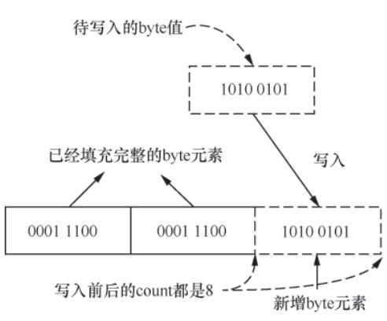
**图3-4 bstream.writeByte()方法工作原理**

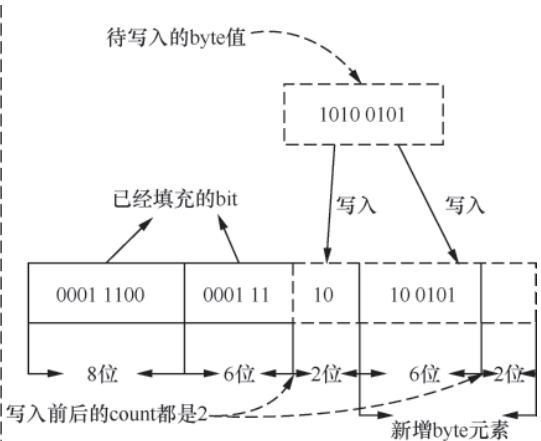
**图3-4 bstream.writeByte()跨字节场景（补充）**

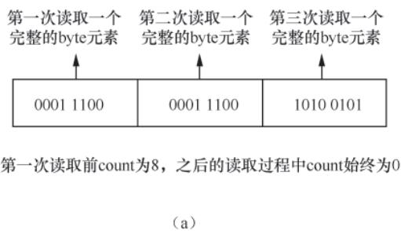
**图3-5 bstream.readByte()方法工作原理1**

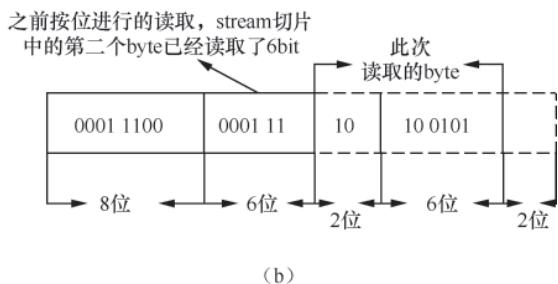
**图3-5 bstream.readByte()方法工作原理2**

## 2.2 Chunk 接口与 XORChunk 实现

Chunk 是时序点集合的抽象接口，是 TSDB 存储时序数据的核心载体；XORChunk 是该接口的唯一实现，完整落地 Gorilla 压缩逻辑。

### Chunk 接口

定义了时序数据的核心操作：

- `Bytes()`：获取字节数据；
- `Encoding()`：编码类型（仅 XOR）；
- `Appender()`：追加数据；
- `Iterator()`：迭代数据。

### XORChunk 核心实现

- 底层依赖 bstream 存储数据，前 2 个字节记录时序点个数；
- `xorAppender`：实现时序点追加，完成 timestamp 的 delta-of-delta 压缩和 value 的 XOR 压缩；
- `xorIterator`：实现时序点迭代读取，反向解析压缩后的 timestamp 和 value 值。

## 2.3 Pool：XORChunk 对象池

基于 Go 的 `sync.Pool` 实现 XORChunk 实例的复用，避免频繁创建/销毁对象导致的 GC 压力：

- `Get()`：从池中获取 XORChunk 实例，填充 bstream 数据后使用；
- `Put()`：将使用完毕的 XORChunk 实例清空数据后放回池中。

## 2.4 Meta 元数据

记录 Chunk 的核心元信息，是 Chunk 管理的关键。

### 核心字段

- `Ref`：Chunk 在磁盘的位置；
- `Chunk`：关联的 XORChunk 实例；
- `MinTime/MaxTime`：Chunk 覆盖的时间范围。

### 关键能力

`OverlapsClosedInterval()` 方法可判断指定时间范围是否与 Chunk 的时间范围重合。

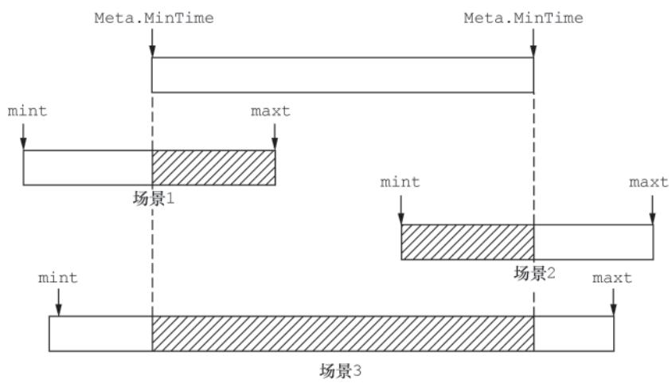
**图3-6 Meta.OverlapsClosedInterval()方法判定重合的场景**

## 2.5 ChunkWriter：时序数据持久化

负责将内存中的 Chunk 数据写入磁盘，是 TSDB 落地存储的核心接口。

### 存储目录结构

时序数据最终写入 block 目录下的 chunks 子目录：

- 每个 block 对应 2 小时的时序数据；
- chunks 目录下的 segment 文件有大小上限（默认 512MB），达到上限后切换新文件。

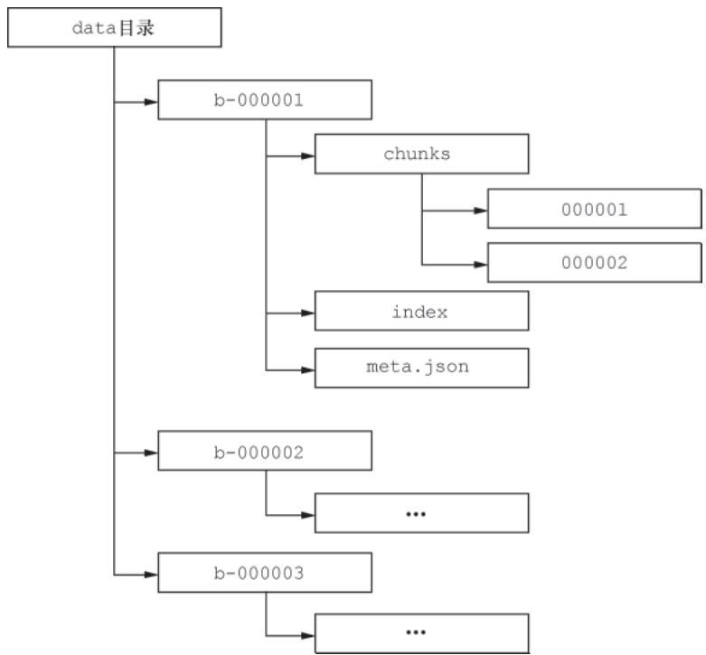
**图3-7 Prometheus TSDB磁盘目录结构**

### segment 文件格式

- 文件头占 8 字节；
- 每个 Chunk 的存储格式为：`Chunk字节数 + 编码类型 + 时序数据 + CRC32校验码`。

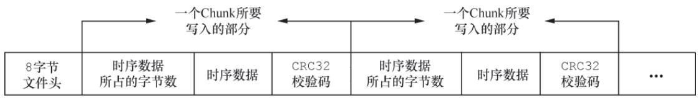
**图3-8 segment文件存储格式**

### 核心方法 `WriteChunks()`

批量写入 Meta 关联的 Chunk 数据，自动赋值 `Ref` 字段（高 32 位为 segment 文件序号，低 32 位为文件内偏移）。

## 2.6 ChunkReader

ChunkReader 是 ChunkWriter 的反向实现，核心负责从磁盘 segment 文件中读取 Chunk 数据。

### 核心逻辑

根据 Meta 的 `Ref` 字段（高 32 位 segment 序号 + 低 32 位文件内偏移）定位 Chunk 位置。

### 校验机制

读取 Chunk 数据后校验 CRC32 码，确保数据完整性。

### 性能优化

支持批量读取多个 Chunk，减少磁盘 I/O 次数。

## 三、Label 组件与索引文件：快速查找时序数据

TSDB 通过 Label 标识时序、通过 index 文件建立 Label 与 Chunk 的映射，是快速检索时序数据的核心。

## 3.1 Label 组件：时序数据的标识与筛选

Prometheus 通过一组 Label 确定一条时序（叠加 timestamp 可确定时序中的一个数据点），Label 是 TSDB 中标识时序的核心载体，也是筛选时序数据的关键依据。

### 3.1.1 Label 与 Labels 核心定义

Prometheus TSDB 中用 `Label` 结构体抽象一对 Label Name 和 Label Value：

```go
type Label struct {
    Name, Value string // 分别记录Label Name 和 Label Value 的值
}
```

同时为 `[]Label` 定义类型别名 `Labels`（表示一条时序的多个 Label，内部 Label 按序存储），并提供核心辅助方法：

- `Len()`/`Less()`/`Swap()`：实现 `sort.Interface`，仅按 Label 的 Name 值排序；
- `Compare()`：逐一对两个 Labels 实例的 Label Name 和 Value 做对比；
- `String()`：实现 `Stringer`，格式化输出所有 Label 的 Name 和 Value；
- `Get()`：根据 Label Name 查找对应 Value；
- `Map()`/`FromMap()`：实现 Labels 与 map 的双向转换。

### 3.1.2 Matcher 接口：时序筛选的核心规则

Matcher 接口用于匹配时序中指定 Label 的 Value，实现时序数据过滤，定义如下：

```go
type Matcher interface {
    Name() string       // 当前 Matcher 用来匹配哪个 Label 的 Value
    Matches(v string) bool // 检测传入的 Label Value 是否符合匹配规则
}
```

Prometheus TSDB 提供 4 种 Matcher 实现：

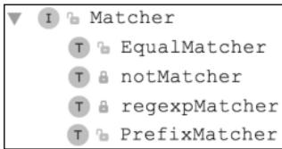
**图 3-11 四种Matcher实现类型**

- **EqualMatcher**：精准匹配 Label Name 和 Value，仅匹配包含 `{name=value}` 标签的时序；
- **regexpMatcher**：通过正则表达式匹配 Label Value，仅符合正则规则的时序可匹配成功；
- **PrefixMatcher**：匹配 Label Value 的指定前缀，仅包含该前缀的时序可匹配成功；
- **notMatcher**：封装其他 Matcher 实例，实现“非”逻辑匹配。

各 Matcher 核心定义：

```go
// EqualMatcher
type EqualMatcher struct { name, value string } 

// regexpMatcher
type regexpMatcher struct { name string; re *regexp.Regexp } 

// PrefixMatcher
type PrefixMatcher struct { name, prefix string } 
```

### 3.1.3 Selector：多 Matcher 的组合筛选

TSDB 为 `[]Matcher` 定义类型别名 `Selector`，表示多个 Matcher 的组合，并提供 `Matches()` 方法实现最终的时序过滤：

```go
type Selector []Matcher // Selector定义  
func (s Selector) Matches(labels Labels) bool {  
    for _, m := range s { 
        // 根据Label Name获取Value，全部Matcher匹配通过则返回true
        if v := labels.Get(m.Name()); !m.Matches(v) {  
            return false  
        }  
    }
    return true  
}
```

## 3.2 索引文件：快速查找时序数据

为加快 Label 和时序数据的查询效率，Prometheus 为 Label 建立专用索引——每个 block 目录下都会生成一个 `index` 文件，它是 TSDB 的“索引目录”，记录标签与 Chunk 的映射关系。

### 3.2.1 index 文件格式

`index` 文件整体遵循“长度+内容+CRC32校验码”的记录规则（TOC 部分除外，长度固定），核心由 7 个部分组成：

1. **文件头与版本号**：最开始是 4 字节固定魔数（`0xBAAAD700`），随后是 1 字节的版本号，用于标识 index 文件格式版本。
2. **Symbol Table（符号表）**：存储当前 block 涉及的所有 Label Name 和 Label Value 字符串，按字典序排列。后续其他部分引用字符串时，只需使用符号表中的下标（而非完整字符串），大幅减小文件体积。
   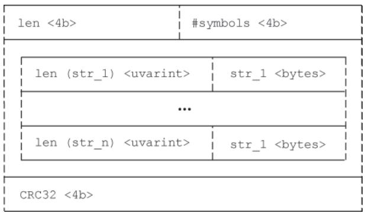
   **图 Symbol Table 结构**

3. **Series（时序数据）**：存储当前 block 下所有时序信息，每条时序按 16 字节对齐（不足则填充），按 Labels 排序。
   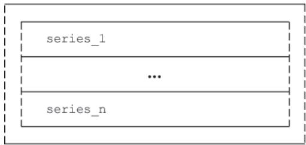
   **图 Series 整体结构**

   单条时序的存储规则：
   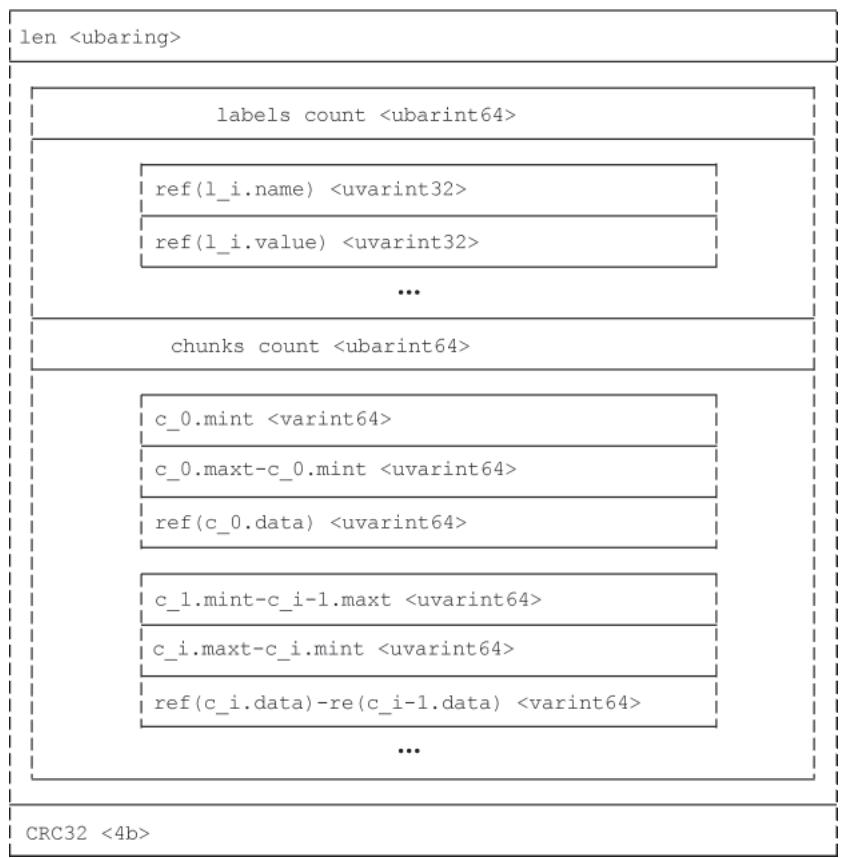
   **图 单条Series存储规则**

4. **Label Index（标签索引）**：记录 Label Name 到 Label Value 的映射关系，一个 Label Index 对应一个 Label Name 的所有关联 Value（按字典序排列）。
   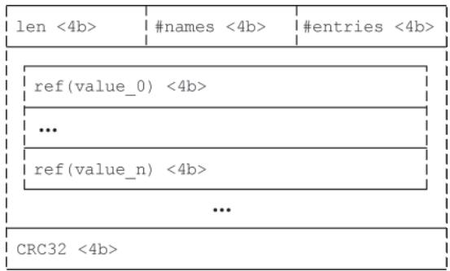
   **图 Label Index 结构**

5. **Postings（标签-时序映射）**：记录 Label（Name+Value）与时序的映射关系，每个 Postings 存储关联的时序编号（引用 Series 部分的编号）。
   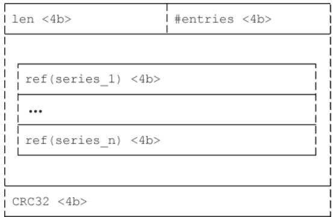
   **图 Postings 结构**

6. **Offset Table（偏移量表）**：分为 Label Index Table 和 Postings Table，分别记录 Label Name 与 Label Index、Label 与 Postings 的偏移量映射，是查询时快速定位的关键。
   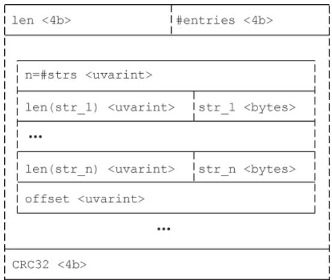
   **图 Offset Table 结构**

7. **TOC（目录）**：记录 index 文件各部分的起始偏移量（相对于文件开头），值为 0 表示无该部分内容，是读取 index 文件的“导航目录”。
   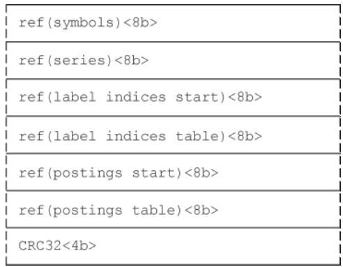
   **图 TOC 结构**

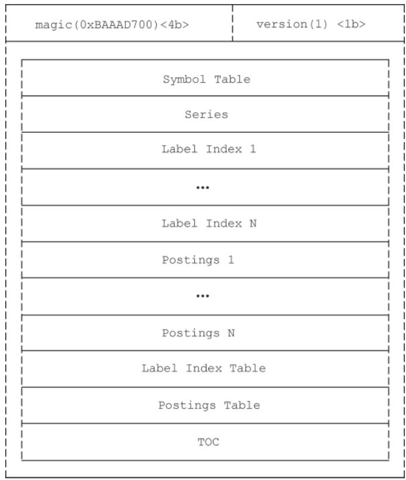
**图 index文件整体结构**

### 3.2.2 encbuf 与 decbuf：索引的编解码核心

TSDB 读写 index 文件依赖两个基础组件，实现数据的序列化/反序列化：

- **encbuf**：将数据序列化为字节数组，核心字段包括 `b`（序列化缓存）、`c`（可重用整数序列化缓冲区），提供 `put*()` 系列方法完成序列化；
- **decbuf**：将字节数组反序列化为数据实例，仅包含 `b`（待反序列化字节切片），提供 `be32()` 等方法完成反序列化，与 encbuf 的 `put*()` 方法一一对应。

核心代码示例：

```go
// encbuf的putBE32方法：序列化uint32为大端字节序
func (e *encbuf) putBE32(x uint32) {
    binary.BigEndian.PutUint32(e.c[:], x) // 修正：binary/bigEndian → binary.BigEndian
    e.b = append(e.b, e.c[:4]...)
}

// decbuf的be32方法：反序列化大端字节序的uint32
func (d *decbuf) be32() uint32 {
    if len(d.b) < 4 { 
        d.e = errInvalidSize
        return 0
    }
    x := binary.BigEndian.Uint32(d.b) // 修正：binary/bigEndian → binary.BigEndian
    d.b = d.b[4:] 
    return x
}
```

### 3.2.3 索引的写入流程

TSDB 通过 `IndexWriter` 接口定义 index 文件的写入规范，核心实现为 `index.Writer` 结构体，写入需严格遵循 `Symbol Table → Series → Label Index → Postings → Offset Table → TOC` 的顺序：

1. **初始化**：调用 `NewWriter()` 创建 Writer 实例 → 删除同名 index 文件 → 新建文件 → 写入魔数和版本号 → 初始化缓冲区、校验码等核心字段。
2. **写入 Symbol Table**：提取所有待写入字符串并排序，按“字符串总数+长度+UTF-8字符串”写入缓冲区，追加 CRC32 校验码后写入文件，记录符号表偏移量。
   核心代码：

   ```go
   func (w *Writer) AddSymbols(sym map[string]struct{}) error {
       if err := w.ensureStage(idxStageSymbols); err != nil {
           return err
       }
       symbols := make([]string, 0, len(sym))
       for s := range sym {
           symbols = append(symbols, s)
       }
       sort.Strings(symbols)
       w.buf1.Reset()
       w.buf2.Reset()
       w.buf2.putBE32(uint32(len(symbols)))
       w.symbols = make(map[string]uint32, len(symbols))
       for index, s := range symbols {
           w.symbols[s] = uint32(index)
           w.buf2.putUvarIntStr(s)
       }
       w.buf1.putBE32(uint32(w.buf2.len()))
       w.buf2.putHash(w.crc32)
       err := w.write(w.buf1.get(), w.buf2.get())
       return errors.Wrap(err, "write symbols")
   }
   ```

3. **写入 Series**：确保时序按 Labels 有序且 16 字节对齐，写入 Label 个数（引用符号表下标）、Chunk 个数及 Chunk 的差值编码信息，追加校验码后写入文件。
4. **写入 Label Index**：按 4 字节对齐填充，记录 Label Name 与 Value 的映射（Value 引用符号表下标），写入长度和校验码并记录偏移量。
5. **写入 Postings**：按 4 字节对齐填充，遍历 Label 关联的时序编号并排序，写入编号总数+列表，追加校验码后写入文件。
   核心代码：

   ```go
   func (w *Writer) WritePostings(name, value string, it Postings) error {
       if err := w.ensureStage(idxStagePostings); err != nil {
           return err
       }
       if err := w.addPadding(4); err != nil {
           return err
       }
       w.postings = append(w.postings, hashEntry{
           keys: []string{name, value},
           offset: w.pos,
       })
       refs := w.uint32s[:0]
       for it.Next() {
           offset, ok := w.seriesOffsets[it.At()]
           refs = append(refs, uint32(offset))
       }
       sort.Sort(uint32slice(refs))
       w.buf2.Reset()
       w.buf2.putBE32(uint32(len(refs)))
       for _, r := range refs {
           w.buf2.putBE32(r)
       }
       w.uint32s = refs
       w.buf1.Reset()
       w.buf1.putBE32(uint32(w.buf2.len()))
       w.buf2.putHash(w.crc32)
       err := w.write(w.buf1.get(), w.buf2.get())
       return errors.Wrap(err, "write postings")
   }
   ```

6. **写入 Offset Table**：记录 Label Name 到 Label Index、Label 到 Postings 的偏移量映射。
7. **写入 TOC**：记录各部分起始偏移量，完成 index 文件写入。
   核心代码片段：

   ```go
   func (w *Writer) writeTOC() error {
       w.buf1.Reset()
       w.buf1.putBE64(w.toc.symbols)
       w.buf1.putBE64(w.toc.series)
       w.buf1.putBE64(w.toc.labelIndices)
       // 省略其他部分写入逻辑（补充：完整需写入postings、offsetTable等）
       w.buf1.putBE64(w.toc.postings)
       w.buf1.putBE64(w.toc.offsetTable)
       w.buf1.putBE64(w.toc.toc)
       return w.write(w.buf1.get())
   }
   ```

### 3.2.4 索引的读取流程

index 文件的读取核心依赖 `IndexReader` 接口，流程如下：

1. **文件校验**：读取文件头魔数和版本号，校验格式合法性；
2. **读取 TOC**：定位各部分的起始偏移量，为后续读取做导航；
3. **读取 Symbol Table**：加载所有字符串到内存，建立“下标→字符串”的映射；
4. **读取 Series/Label Index/Postings**：根据查询的 Label 条件，先通过 Label Index 找到目标 Value，再通过 Postings 定位关联的 Series，最后通过 Series 找到 Chunk 的 Ref；
5. **数据校验**：读取各部分数据后校验 CRC32 码，确保数据未损坏；
6. **结果组装**：将 Symbol Table 的下标还原为实际 Label 字符串，组装成可查询的时序元数据。

## 四、WAL 日志：保证数据可靠性

Write-Ahead Log（预写日志）是 TSDB 保证数据完整性的核心机制，避免内存数据未刷盘时因宕机丢失。

## 4.1 WAL 的核心设计背景与核心组件

存储系统常用“写缓存+定期刷新”提升性能，但存在内存数据丢失风险；WAL 通过“写入内存时同步持久化操作日志”解决该问题，且 WAL 为顺序写入，性能损耗可控。

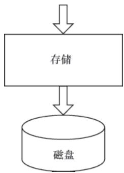
**图 3-24 WAL设计背景与核心逻辑**

Prometheus TSDB 的 WAL 实现位于 `wal` 包，核心设计层级为：`Record`（[]byte 格式）→ `page`（32KB）→ `Segment`（128MB）→ WAL（管理多个 Segment），且一条 Record 可跨多个 page，但不可跨 Segment。

### 核心组件

- **page**：核心字段包括 `buf`（存储数据）、`alloc`（已用字节数）、`flushed`（已刷盘字节下标），提供 `remain()`（剩余空间）、`full()`（是否满）方法；
- **Segment**：内嵌 `*os.File` 实现文件读写，对应一个 WAL 日志文件，文件名是递增序号，Prometheus 会定期清理旧 Segment；
- **WAL**：管理多个 Segment 的核心结构体，核心字段包括 `dir`（日志目录）、`segmentSize`（Segment 大小上限，默认 128MB）、`mtx`（写入锁）、`segment`（当前写入的 Segment）、`page`（当前写入的 page）等。

## 4.2 WAL 初始化

初始化核心逻辑在 `NewSize()` 函数，指定 Segment 目录和大小上限，流程为：

1. 校验参数并创建 WAL 目录；
2. 调用 `Segments()` 读取目录下 Segment 的最大/小编号，若目录为空则创建编号为 0 的 Segment，否则打开最大编号的 Segment；
3. 启动独立 goroutine 执行 `WAL.run()`，处理 Segment 异步刷盘和 WAL 关闭协调。

其中，`CreateSegment()` 负责创建新 Segment 文件，`OpenWriteSegment()` 打开已有 Segment 并校验文件大小是否为 pageSize 整数倍（非整数倍则补 0）。

## 4.3 WAL 日志写入详解

WAL 实现 `RecordLogger` 接口，通过 `Log()` 方法写入 Record，核心流程：

1. 校验当前 Segment/page 剩余空间，若不足则调用 `nextSegment()` 切换新 Segment；
2. 拆分超长 Record（可跨多个 page），按写入场景标记 `recType`（`recFull`/`recFirst`/`recMiddle`/`recLast`）；
3. 构建 Record 头（含 `recType`、长度、CRC32 校验码），写入数据并更新 page 的 `alloc`；
4. 满足“page 写满/写入完整 Record/批量写入完成”任一条件时，调用 `flushPage()` 刷盘。

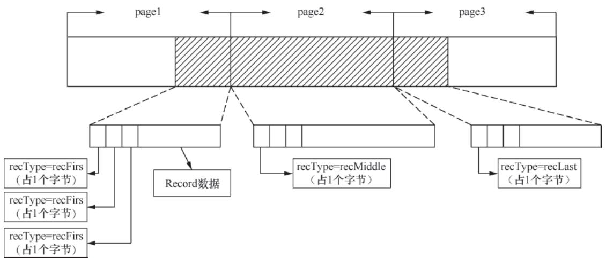
**图 3-25 跨page的超长Record写入状态**

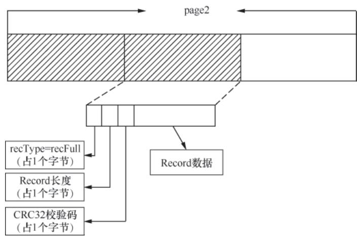
**图 3-26 单page多Record写入场景**

`nextSegment()` 切换 Segment 时，会先刷盘当前 page，创建新 Segment，再通过 `actorc` 通道异步刷盘并关闭旧 Segment；`WAL.run()` 监听 `actorc` 执行异步操作，监听 `stopc` 处理 WAL 关闭逻辑。此外，`Truncate()` 方法可删除指定编号前的 Segment，实现日志清理。

## 4.4 WAL 日志读取详解

- **segmentBufReader**：支持跨多个 Segment 读取，内置 16 个 page 的缓冲区，读取完当前 Segment 自动切换下一个；
- **wal.Reader**：实现 `RecordReader` 接口，封装 `io.Reader` 读取数据，通过解析 Record 头的 `recType` 拼接跨 page 的 Record，直至读取到完整 Record；
- **损坏修复**：若 Segment 文件损坏，`WAL.Repair()` 会删除损坏点后的 Segment，读取损坏 Segment 中可用 Record 并写入新文件，最终删除损坏文件。

## 4.5 Record 类型

Record 是 WAL 日志的最小单元（[]byte 格式），包含 4 种类型：

- `RecordInvalid`：不合法类型；
- `RecordSeries`：新时序写入时产生，对应 `RefSeries`（时序编号+Label集合）；
- `RecordSamples`：时序点写入时产生，对应 `RefSample`（时序编号+时间戳+指标值）；
- `RecordTombstones`：写入删除标识时产生，对应 `Stone` 结构体（时序删除标记）。

`RecordDecoder/RecordEncoder` 负责 Record 的反序列化/序列化，可根据 Record 类型解析出 `RefSeries`/`RefSample`/`Stone` 实例。

## 五、TSDB 的核心机制

## 5.1 tombstones 文件：实现“标记删除”

Prometheus TSDB 执行时序数据删除时，并非直接从 Chunk 文件物理删除，而是将删除信息记录到 `tombstones` 文件中——这种“标记删除”策略避免了 Chunk 文件随机操作的性能开销，将随机操作转化为顺序操作（物理删除推迟到 Block 压缩阶段，查询时会过滤标记删除的数据）。

### 核心结构：Stone 与 Intervals

`Stone` 结构体是 WAL 中待删除时序的抽象，包含两个核心字段：

- `ref（uint64）`：待删除的时序编号；
- `intervals（Intervals）`：待删除的时间范围（`Intervals` 是 `[]Interval` 的类型别名，每个 `Interval` 包含 `Mint`/`Maxt`，标识单段删除时间范围）。

`Intervals.add()` 方法会智能合并重叠/相邻的时间范围，核心场景：

1. 新增 Interval 与多个已有 Interval 重叠：合并为一个大 Interval（取所有 Interval 中最小的 Mint、最大的 Maxt）；
   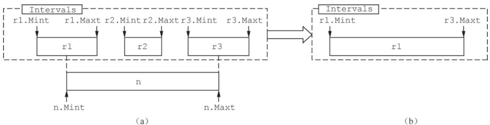
   **图 3-27 多Interval重叠合并场景**

2. 新增 Interval 仅与单个已有 Interval 交界，且新增 Interval 的 `Maxt` 在已有范围中：合并为一个 Interval（取新增 Interval 的 Mint）；
   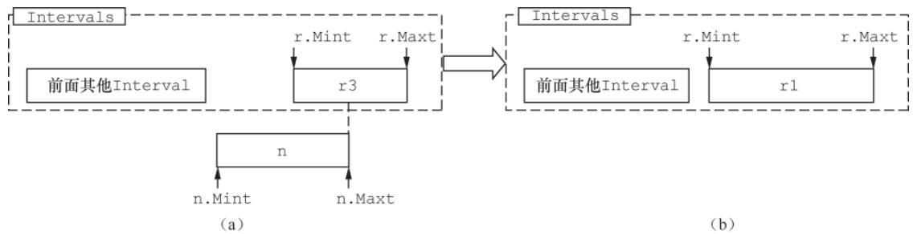
   **图 3-28 单Interval交界合并场景**

3. 新增 Interval 无重叠/交界：直接添加到 `Intervals` 中。

## 5.2 Checkpoint：WAL 日志的轻量化机制

随着 WAL 日志持续写入，会引发磁盘空间浪费、宕机恢复耗时变长的问题，Checkpoint 机制通过压缩清理过期 WAL 日志解决该问题：

- **核心逻辑**：将已持久化到 Block 的 WAL 日志合并为一个 Checkpoint 文件，删除原有的老旧 Segment；
- **触发时机**：后台定时执行（默认每 30 分钟），或 Block 刷盘时触发；
- **恢复优化**：重启时优先读取 Checkpoint 文件恢复数据，仅重放最新的未持久化 WAL 日志，大幅缩短恢复时长。

## 5.3 Block：时序数据的分块存储

TSDB 将时序数据按时间分块存储（默认每 2 小时一个 Block），每个 Block 以磁盘目录形式存在，包含 Chunk 文件、index 文件、metadata 文件等。

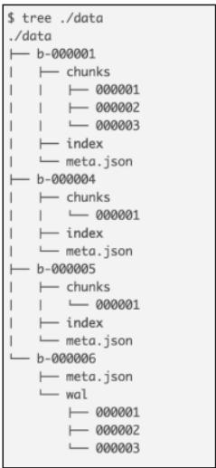
**图3-2 Prometheus TSDB block目录结构**

### 5.3.1 Block 初始化

Block 初始化由 `BlockWriter` 完成，流程为：

1. 创建 Block 目录及子目录（chunks、index 等）；
2. 初始化 ChunkWriter、IndexWriter，准备写入数据；
3. 记录 Block 的时间范围、Label 集合等元数据到 metadata 文件。

### 5.3.2 Block 相关操作

- **数据写入**：将内存中的 Chunk 数据刷盘到 Block 的 chunks 目录，更新 index 文件；
- **数据查询**：通过 index 文件定位目标 Chunk，读取并解压数据；
- **元数据管理**：维护 Block 的 MinTime/MaxTime、Label 集合等元信息，用于快速过滤无效 Block。

## 5.4 Block 压缩：平衡存储效率与查询性能

TSDB 后台会自动将多个小 Block 压缩合并为更大的 Block（如将多个 2 小时 Block 合并为 12 小时/24 小时 Block），删除原小 Block，平衡存储效率和查询性能（与 LevelDB/RocksDB 的 LSM 树思路一致）。

### 5.4.1 压缩计划

- **触发条件**：当 Block 数量超过阈值（默认 5 个），或 Block 存在时间超过阈值（默认 1 小时）；
- **压缩策略**：按时间顺序合并相邻的 Block，优先合并老旧 Block，避免频繁压缩；
- **并发控制**：限制同时压缩的 Block 数量，避免占用过多 CPU/磁盘资源。

### 5.4.2 压缩数据

- **数据合并**：将多个小 Block 的 Chunk 数据合并，重新计算 delta-of-delta 和 XOR 压缩，提升压缩比；
- **索引重构**：重新生成合并后 Block 的 index 文件，优化 Label 与 Chunk 的映射关系；
- **物理删除**：合并过程中，将 tombstones 标记的删除数据从 Chunk 中物理移除，释放磁盘空间；
- **原子替换**：压缩完成后，原子替换原小 Block 为新的大 Block，保证查询无感知。

## 5.5 Head 内存窗口：最新数据的高性能存储

最新写入的数据保存在内存 Block（Head）中，达到 2 小时后写入磁盘，保证最新数据的读写性能。

### 5.5.1 memSeries：内存时序数据载体

`memSeries` 是内存中单个时序的抽象，核心字段包括：

- `labels`：时序的 Label 集合；
- `chunk`：当前写入的内存 Chunk（XORChunk 实例）；
- `lastSample`：最后写入的采样点（时间戳+value），用于 XOR 压缩；
- `ref`：时序的唯一编号。

### 5.5.2 stripeSeries：提升并发读写性能

为解决多协程读写 `memSeries` 的锁竞争问题，TSDB 引入 `stripeSeries`：

- 将 `memSeries` 哈希分片到多个桶（默认 16 个），每个桶有独立的锁；
- 读写时序时，先根据 Label 哈希到指定桶，仅竞争桶级锁，大幅提升并发性能。

### 5.5.3 Head 结构体：内存窗口核心逻辑

`Head` 结构体管理整个内存 Block 的生命周期，核心能力：

- **数据写入**：接收采样点，找到对应的 `memSeries`，追加到 Chunk 并同步写入 WAL；
- **数据查询**：遍历 `stripeSeries` 找到匹配 Label 的 `memSeries`，读取 Chunk 数据并解压；
- **Block 刷盘**：达到 2 小时阈值时，将内存 Chunk 刷盘为磁盘 Block，清空内存数据；
- **tombstones 处理**：记录删除标记，查询时过滤对应时间范围的数据。

## 5.6 DB：TSDB 的顶层封装

`DB` 结构体是 TSDB 的顶层抽象，整合了 Head、Block、WAL、tombstones 等所有组件，对外提供统一的读写删接口。

### 5.6.1 初始化流程

1. 初始化 WAL，恢复宕机前的内存数据；
2. 加载磁盘上的所有 Block，构建 Block 索引；
3. 初始化 Head 内存窗口，启动后台压缩 goroutine；
4. 加载 tombstones 文件，恢复删除标记；
5. 启动 Checkpoint 定时任务，清理过期 WAL 日志。

### 5.6.2 Querier 接口：数据查询核心

`Querier` 接口封装了时序数据的查询逻辑，核心流程：

1. 解析查询条件（Label Matcher+时间范围）；
2. 遍历 Head 和所有 Block，过滤出匹配 Label 的时序；
3. 读取时序的 Chunk 数据，解压并过滤 tombstones 标记的删除数据；
4. 聚合/计算查询结果，返回给调用方。

### 5.6.3 删除接口：基于 tombstones 的逻辑删除

删除接口接收“Label 条件+时间范围”，核心流程：

1. 写入 `RecordTombstones` 到 WAL，保证删除操作不丢失；
2. 将删除标记记录到 tombstones 文件；
3. 后台压缩 Block 时，物理删除标记的数据。

### 5.6.4 写入操作：从 WAL 到 Block 的完整链路

1. 接收采样点数据，先写入 WAL（`RecordSamples`）；
2. 将采样点追加到 Head 中对应的 `memSeries` 的 Chunk；
3. Head 达到 2 小时阈值时，刷盘为磁盘 Block；
4. 后台压缩 Block，优化存储效率。

## 小结

TSDB 是 Prometheus 的“数据底座”，其设计围绕“高效存储时序数据”展开：

- 基于 Gorilla 算法实现极致的压缩比，大幅降低存储开销；
- 通过 Chunk 分块、Block 压缩、WAL 日志保证数据可靠性；
- 借助 Head 内存窗口提升最新数据的读写性能；
- 通过 Label 组件+index 索引实现时序数据的快速检索；
- 基于 tombstones 的标记删除平衡查询与修改效率。

但 TSDB 的本地存储特性也决定了它无法直接用于长期数据存储，需结合远程 TSDB 集成 API 扩展。厘清其存储逻辑，才能理解 Prometheus 的性能特点和使用限制。
