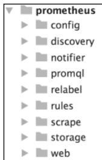
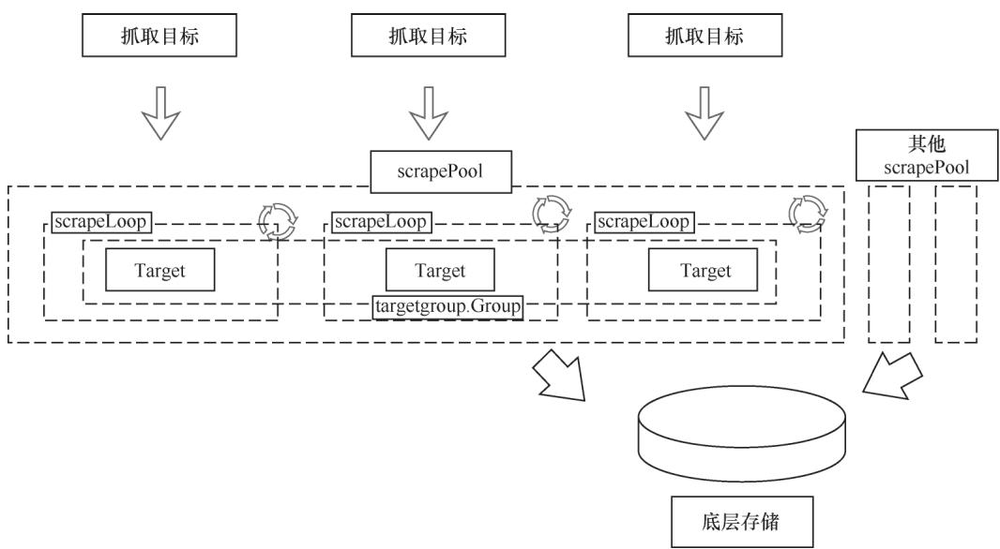
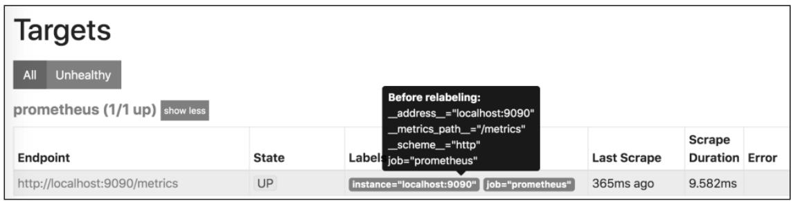
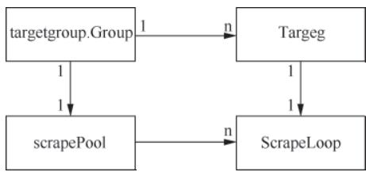

## 导语

Prometheus最核心的工作之一就是“采集数据”，而scrape模块是负责该工作的核心模块。本文从源码角度拆解scrape模块的实现逻辑，详解其如何按配置拉取数据、处理数据并写入TSDB。

## 前置知识：Prometheus Server 架构与模块定位

在深入scrape模块前，先明确其在Prometheus源码中的位置。Prometheus Server采用清晰的模块化设计，各核心目录分工如下：

- `config`：解析配置文件为内部实例
- `discovery`：服务发现组件
- `promql`：查询语句解析与执行
- **`scrape`**：核心模块，负责从监控目标（Target）拉取时序数据
- `storage`：存储层封装（对接TSDB等存储）
- `web`：API接口与UI界面提供



**图4-1 Prometheus Server 源码目录结构**

scrape模块作为数据采集的核心入口，是连接监控目标与存储层的关键桥梁，整体结构如下：



**图4-2 scrape模块整体结构**

## 一、核心概念：Target

Target是采集的**目标对象**，每个Target对应一个采集端点（例如node_exporter的9100端口），scrape模块会持续维护Target的运行状态与采集周期。

在Prometheus中，`Target`结构体完整抽象了采集目标，可通过Web UI（`http://localhost:9090/metrics`）直观查看其状态：



**图4-3 Target 状态展示界面**

### 1.1 Target 核心字段

- `discoveredLabels`：Relabel处理前的原始标签（包含服务发现生成的`__meta_`类标签）
- `labels`：Relabel处理后的最终标签，会随时序数据持久化至存储层
- `params`：HTTP采集请求的URL参数（如自定义查询参数）
- `health`：目标健康状态（枚举值：未知/正常/异常）
- `metadata`：指标元数据缓存（包含指标名称、类型、描述、单位）

### 1.2 Target 核心方法

1. `URL()`：拼接协议、地址、路径、参数，生成最终的采集请求地址
2. `report()`：实时更新采集状态（包括采集耗时、错误信息、健康度）
3. `offset()`：打散首次采集时间，避免大量Target并发采集引发的性能瓶颈

## 二、核心接口与实现

scrape模块通过**接口分层设计**实现采集逻辑解耦，四大核心组件各司其职，保证采集流程的扩展性与稳定性。

### 2.1 scraper 接口：单次采集执行者

定义单个Target的**单次采集行为**，是采集流程最底层的核心接口，仅负责单次数据拉取与状态上报：

```go
type scraper interface {
    // 拉取目标数据并写入指定缓冲区，返回采集标识（如目标ID）及错误信息
    scrape(ctx context.Context, w io.Writer) (string, error)
    // 上报本次采集的耗时、错误等状态信息
    report(start time.Time, dur time.Duration, err error)
    // 计算采集偏移量，用于打散首次采集时间
    offset(interval time.Duration) time.Duration
}
```

`targetScraper`是该接口的唯一实现，核心逻辑：

- 通过HTTP客户端向Target端点发送采集请求
- 支持gzip压缩数据的自动解压
- 将原始监控数据写入指定的IO缓冲区

### 2.2 loop 接口：周期采集主循环

定义**周期性采集**逻辑，一个`loop`实例对应一个Target，实例创建后不可重启或复用：

```go
type loop interface {
    // 启动周期性采集：interval为采集周期，timeout为单次采集超时时间，errc用于传递错误
    run(interval, timeout time.Duration, errc chan<- error)
    // 停止采集并释放相关资源
    stop()
}
```

`scrapeLoop`是该接口的唯一实现，内置三大关键子组件，是采集流程的核心载体：

#### 2.2.1 Pool 缓冲区池（内存池）

`scrapeLoop`共享全局内存池，核心目标是避免频繁的内存分配/释放引发GC压力：

- 按缓冲区大小分桶管理（如1KB、4KB、16KB等）
- 采集时按需申请对应大小的缓冲区，采集完成后归还
- 大幅提升高并发采集场景下的内存使用效率

#### 2.2.2 scrapeCache 元数据缓存

负责缓存Target的时序指标元数据，实现**过期时序自动标记**能力：

- 缓存内容：指标类型（Counter/Gauge/Histogram等）、描述、单位
- 核心能力：追踪时序采集周期，为消失的时序写入`StaleNaN`标记（标记时序失效）
- 自动清理：定期清理长期未更新的缓存项，防止缓存膨胀

#### 2.2.3 标签处理器：sampleMutator & Relabel

采集数据写入存储前的**核心数据清洗环节**，保证标签的规范性与有效性：

- 标签冲突处理：根据`honor_labels`配置，决定保留Target原生标签或重命名冲突标签
- Relabel规则执行：支持Drop（丢弃）、Keep（保留）、Replace（替换）、LabelMap（标签映射）等7种核心操作
- 无效数据过滤：剔除空标签、无效值的时序数据，清理冗余标签

### 2.3 scrapePool：分组采集管理器

多个拥有共享标签的Target会被归类为`targetgroup.Group`，**一个分组对应一个scrapePool实例**：



**图4-4 scrapePool 与 Target、scrapeLoop 关系**

scrapePool的核心能力：

- 管理分组内所有Target对应的`scrapeLoop`实例
- 同步服务发现的Target变化（新增/删除/更新）
- 共享HTTP客户端、缓冲区池等资源，降低资源消耗
- 支持配置热重载后，平滑重启分组内的采集任务

### 2.4 Manager：全局采集调度中心

scrape模块的**顶层管理者**，统筹所有采集任务的生命周期：

- 加载`prometheus.yml`中的采集配置（如`scrape_configs`）
- 对接服务发现组件（如K8s SD、File SD），动态更新Target分组
- 根据Target分组的变化，创建/销毁对应的`scrapePool`实例
- 处理全局配置重载，实现采集任务的全局调度与更新

## 三、数据采集的完整流程

基于Prometheus源码实现，scrape模块的**全链路采集流程**分为4个核心步骤，形成完整的采集闭环：

### 步骤1：从Target拉取原始数据

`scrapeLoop`的定时器触发采集任务后，通过`targetScraper`向Target端点发送HTTP请求：

1. 携带配置的请求参数与头部信息
2. 接收并解压gzip格式的返回数据
3. 将原始监控数据写入内存缓冲区（从Pool申请）

### 步骤2：执行relabel_configs标签重写

解析缓冲区中的原始数据后，执行Relabel规则链：

1. 过滤无效Target（如通过Keep/Drop规则保留核心目标）
2. 修改/新增标签（如Replace规则标准化标签值）
3. 剔除冗余标签，保证标签集的简洁性

### 步骤3：通过sampleMutator处理样本数据

完成Relabel后，进入样本数据的最终清洗环节：

1. 解决标签冲突（如Target原生标签与Prometheus内置标签冲突）
2. 更新`scrapeCache`中的指标元数据
3. 为消失的时序标记`StaleNaN`，标记其失效状态

### 步骤4：写入TSDB并上报状态

1. 调用存储层接口，将处理后的时序数据写入TSDB
2. 上报本次采集的耗时、错误、健康状态等内置监控指标
3. 归还缓冲区至Pool，释放临时资源

## 四、scrape 模块核心原理总结

scrape模块作为Prometheus的数据入口，其设计精髓可总结为4点：

1. **分层解耦**：通过scraper/loop/scrapePool/Manager四层接口定义行为，实现细节封装，易于扩展（如新增采集协议）
2. **性能优化**：内存池复用、采集时间打散、元数据缓存自动清理，大幅降低GC与资源消耗
3. **动态适配**：对接服务发现实现Target动态更新，支持配置热重载，适配动态监控场景
4. **可靠性保障**：自动标记过期时序、采集状态实时监控、异常采集重试，保证数据完整性

## 小结

scrape模块是Prometheus实现**配置化、高性能、高可靠**时序数据采集的核心，从Target抽象、接口分层设计，到分组管理、全流程数据清洗，完整覆盖了数据采集的全生命周期。

理解scrape模块的实现逻辑，可有效解决采集失败、数据异常、标签冲突、高并发采集性能瓶颈等常见问题。

> 下一篇预告：深入storage模块，详解Prometheus本地存储（TSDB）与远程存储的封装逻辑。
