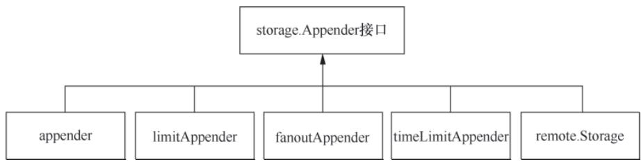
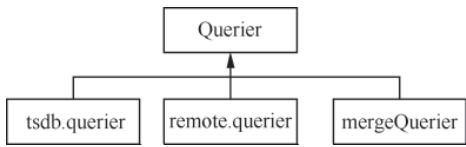
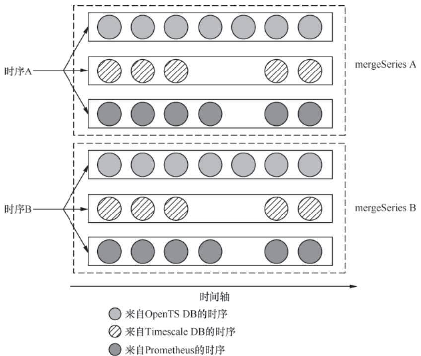
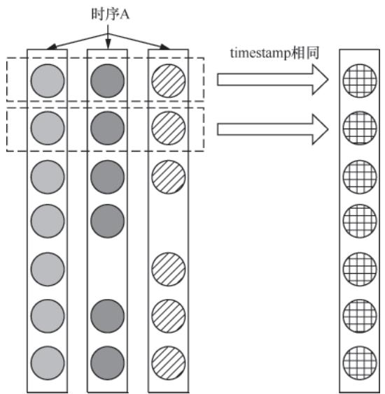

# Prometheus 技术秘笈（五）：storage模块 - 本地与远程存储的封装与适配

## 导语

storage模块是Prometheus Server对存储层的“统一封装”，不管是本地TSDB还是远程存储，上层模块（如scrape、query）均通过storage模块完成数据交互。本文拆解storage模块的核心能力：

- 数据写入的适配逻辑（本地/远程存储的统一写入）；
- 数据查询的路由与结果合并逻辑；
- 核心接口设计如何屏蔽底层存储的差异。

## 一、数据写入流程

storage模块接收scrape模块采集的原始时序数据，经过统一的校验、格式化后，分发给本地TSDB或远程存储（若配置）。整个写入流程的核心是`Appendable`和`storage.Appender`接口——前者是上层模块与storage模块的交互入口，后者定义了时序点写入的核心方法。

## 1. 写入的核心接口：Appendable & Appender

scrape模块的`scrape.Manager`、`scrapePool`等核心组件均包含`Appendable`类型字段，其唯一方法`Appender()`会返回`storage.Appender`实例，该接口是时序数据写入的核心抽象：

```go
// Appender 定义时序数据写入的核心方法集
type Appender interface { 
    // 向底层存储写入单个时序点，返回时序引用ID和错误信息
    Add(labels.Labels, t int64, v float64) (uint64, error) 
    // 基于已有时序引用ID快速写入时序点（避免重复解析Label）
    AddFast(labels.Labels, ref uint64, t int64, v float64) error
    // 提交批量写入的时序数据（持久化到存储）
    Commit() error
    // 放弃此次批量写入，回滚未提交的数据
    Rollback() error
}
```

`storage.Appender`接口的所有实现是写入流程的核心载体：  


**图 5-1：storage.Appender 接口的实现类**

## 2. 本地存储写入：ReadyStorage + adapter 的适配逻辑

storage模块对本地TSDB的适配核心是`ReadyStorage`和`adapter`结构体，二者配合完成TSDB能力到storage接口的适配：

- `adapter`：TSDB的适配层，将`tsdb.DB`（TSDB核心实例）的能力适配到storage模块的`Storage`接口（`Storage`内嵌`Appendable`和`Queryable`接口）；
- `ReadyStorage`：封装`adapter`实例，其`Appender()`方法最终返回适配后的`appender`实例，该实例会将`storage.Appender`的方法调用转发给`tsdb.Appender`，最终完成本地TSDB的写入。

**本地写入调用链路**：  
`ReadyStorage.Appender()` → `adapter.Appender()` → `appender` → `tsdb.DB`

## 3. 远程存储写入：remote.Storage 的队列化处理

对于配置了远程可写存储（如InfluxDB、TiKV、VictoriaMetrics）的场景，`remote.Storage`是核心抽象，其`queues`字段（`[]*QueueManager`）为每个远程存储维护独立的写入队列，实现异步、可靠的远程写入：

| 阶段       | 核心逻辑                                                                 |
|------------|--------------------------------------------------------------------------|
| 初始化阶段 | `ApplyConfig()`遍历远程写配置，为每个配置创建HTTP客户端和`QueueManager`，启动队列后负责时序数据异步发送； |
| 写入阶段   | `remote.Storage`直接实现`Appender`接口，`Add()`方法遍历所有`QueueManager`，将时序点写入对应远程存储队列； |
| 特殊处理   | 远程存储的持久化由远端控制，因此`Commit()`/`Rollback()`均为空实现；       |

**核心代码（远程写配置处理）**：

```go
// ApplyConfig 应用远程写配置，创建/替换远程写入队列
func (s *Storage) ApplyConfig(conf *config.Config) error {
    // 加锁保证配置更新的线程安全（省略锁操作）
    newQueues := []*QueueManager{}
    for i, rwConf := range conf.RemoteWriteConfigs { 
        // 根据远程写配置创建HTTP客户端
        c, err := NewClient(i, &ClientConfig{
            URL:              rwConf.URLs,
            Timeout:          rwConf.RemoteTimeout,
            HTTPClientConfig: rwConf.HTTPClientConfig,
        })
        if err != nil {
            return fmt.Errorf("create remote write client %d: %v", i, err)
        }
        // 为每个远程存储配置创建QueueManager（负责队列管理和数据发送）
        newQueues = append(newQueues, NewQueueManager(
            s.logger,
            rwConf.QueueConfig,
            conf.GlobalConfig.ExternalLabels,
            rwConf.WriteRelabelConfigs,
            c,
            s.flushDeadline,
        ))
    }
    // 优雅替换队列：停止旧队列 → 替换队列列表 → 启动新队列
    for _, q := range s.queues {
        q.Stop()
    }
    s.queues = newQueues
    for _, q := range s.queues {
        q.Start()
    }
    return nil
}
```

## 4. 本地+远程的统一写入：fanout + fanoutAppender

为让上层模块无感知地同时写入本地和远程存储，storage模块提供`fanout`结构体作为“写入门面”，屏蔽多存储端的写入差异：

- `fanout`核心字段：
  - `primary`：本地存储（`ReadyStorage`实例）；
  - `secondaries`：多个远程存储（`[]remote.Storage`实例）；
- 核心逻辑：`fanout.Appender()`分别获取本地/远程的`Appender`，封装为`fanoutAppender`返回；`fanoutAppender.Add()`先写本地、再遍历写所有远程，实现“一次调用，多端写入”。

**核心代码（fanoutAppender.Add 方法）**：

```go
// Add 写入时序点到本地+所有远程存储
func (f *fanoutAppender) Add(l labels.Labels, t int64, v float64) (uint64, error) {
    // 1. 优先写入本地存储（保证数据本地可查）
    ref, err := f.primary.Add(l, t, v) 
    if err != nil {
        return 0, fmt.Errorf("write to primary storage: %v", err)
    }
    // 2. 遍历写入所有远程存储（异步队列，不阻塞本地写入）
    for _, appender := range f.secondaries {
        if _, err := appender.Add(l, t, v); err != nil {
            s.logger.Warn("write to remote storage failed", "labels", l, "err", err)
            // 远程写入失败不阻断流程，仅日志告警
        }
    }
    return ref, nil
}
```

## 5. 写入增强：装饰器模式的扩展

storage模块通过`timeLimitAppender`和`limitAppender`两个装饰器，在不修改核心`Appender`逻辑的前提下，增强写入校验和限流能力：

| 装饰器类型         | 核心能力                                                                 |
|--------------------|--------------------------------------------------------------------------|
| timeLimitAppender  | 校验时序点timestamp是否超出合法范围（如超出服务器时间阈值），避免无效时间数据写入； |
| limitAppender      | 限制单次批量写入的时序点数量，防止存储层因突发大流量压垮；                 |

**示例代码（timeLimitAppender）**：

```go
// timeLimitAppender 内嵌底层Appender，实现装饰器模式
type timeLimitAppender struct {
    Appender // 内嵌底层Appender，复用核心写入逻辑
    maxTime  int64 // 允许写入的最大时间戳（通常为服务器当前时间+容差）
}

// Add 增强时间戳校验的写入方法
func (app *timeLimitAppender) Add(lset labels.Labels, t int64, v float64) (uint64, error) { 
    // 校验时间戳合法性，超出阈值则返回错误
    if t > app.maxTime { 
        return 0, storage.ErrOutOfBounds 
    }
    // 委托底层Appender完成实际写入
    ref, err := app.Appender.Add(lset, t, v)
    return ref, err 
}
```

## 二、数据查询流程

查询请求经storage模块路由后，优先从本地TSDB查询；若配置了远程查询，则补充远程存储的数据，最终合并为统一结果返回。查询流程的核心是`Queryable`和`Querier`接口——前者定义“获取查询器”的能力，后者是实际执行查询的载体。

## 1. 查询的核心接口：Queryable & Querier

`Storage`接口内嵌`Queryable`接口，其`Querier()`方法返回`storage.Querier`实例，该接口定义了时序数据查询的核心能力：

```go
// Querier 定义时序数据查询的核心方法集
type Querier interface {
    // 根据筛选条件（时间范围、Label匹配器）查询时序数据，返回时序集合
    Select(*SelectParams, ...*labels.Matcher) (SeriesSet, error) 
    // 根据Label Name查询对应的Label Value集合（用于标签探索）
    LabelValues(name string) ([]string, error) 
    // 关闭查询器，释放底层资源（如TSDB迭代器、网络连接）
    Close() error 
}
```

`Querier`接口的常用实现覆盖本地/远程查询场景：  


**图 5-3：storage.Querier 接口的常用实现类**

查询结果通过三层接口封装，保证格式统一：

| 接口类型       | 核心作用                                                                 |
|----------------|--------------------------------------------------------------------------|
| SeriesSet      | 抽象一组时序集合，提供迭代能力（`Next()`/`At()`/`Err()`）；               |
| Series         | 表示单条时序，包含Label集合和迭代器（`Iterator()`）；                     |
| SeriesIterator | 迭代单条时序的所有数据点（`Seek()`定位时间点/`At()`获取当前点/`Next()`下一个点）； |

## 2. 本地存储查询：querier 的适配逻辑

本地查询的核心是`querier`结构体（`tsdb.Querier`的适配层），实现`storage.Querier`接口，完成storage层到TSDB层的查询适配：

- 适配逻辑：`ReadyStorage`/`adapter`的`Querier()`方法返回`querier`实例；`querier.Select()`将storage层的`labels.Matcher`适配为TSDB可处理的类型，再调用`tsdb.Querier.Select()`查询本地数据；
- 结果封装：查询结果被封装为`seriesSet`（适配`storage.SeriesSet`），底层复用TSDB的时序迭代逻辑，保证性能。

**本地查询核心链路**：  
`ReadyStorage.Querier()` → `adapter.Querier()` → `querier` → `tsdb.Querier` → 本地TSDB数据

## 3. 远程存储查询：mergeQuerier 的结果合并

对于配置了远程可读存储的场景，`remote.Storage`的`QuerierCtx()`方法为每个远程存储创建`Querier`实例，并合并为`mergeQuerier`，实现多远程存储的查询结果聚合：

**核心代码（远程查询器创建）**：

```go
// QuerierCtx 创建远程存储查询器并合并为mergeQuerier
func (s *Storage) QuerierCtx(ctx context.Context, mint, maxt int64) (storage.Querier, error) {
    queryables := s.queryables // 获取所有配置的可读远程存储
    queryers := make([]storage.Querier, 0, len(queryables))
    for _, queryable := range queryables { 
        // 为每个远程存储创建独立的Querier
        q, err := queryable.Querier(ctx, mint, maxt)
        if err != nil {
            return nil, fmt.Errorf("create remote querier: %v", err)
        }
        queryers = append(queryers, q)
    }
    // 合并所有远程查询器，返回统一的mergeQuerier
    return storage.NewMergeQuerier(queryers), nil 
}
```

`mergeQuerier`的核心能力：

- `LabelValues()`：从所有远程存储查询Label Value，合并后去重返回；
- `Select()`：从所有远程存储查询时序数据，结果封装为`mergeSeriesSet`返回。

## 4. 本地+远程的统一查询：mergeSeriesSet 的时序合并

`fanout`结构体在查询时会合并本地和远程的`Querier`结果，核心是`mergeSeriesSet`，解决“本地/远程返回重复时序、数据点缺失”的问题：

- 时序合并：`mergeSeriesSet`迭代时，将Label完全相同的时序合并为`mergeSeries`；
- 数据点合并：`mergeSeries`的迭代器`mergeIterator`会合并相同时序点，补全本地/远程的缺失数据；


**图 5-5：mergeSeriesSet 时序合并逻辑**  


**图 5-6：mergeIterator 数据点合并逻辑**

## 小结

storage模块是Prometheus存储层的“中间适配层”，通过`Storage`、`Appender`、`Querier`三大核心接口实现本地TSDB与远程存储的解耦：

| 维度   | 核心设计                                                                 |
|--------|--------------------------------------------------------------------------|
| 写入侧 | 基于`fanoutAppender`屏蔽本地/远程写入差异，通过装饰器（timeLimit/limit）增强写入校验、限流能力； |
| 查询侧 | 基于`mergeQuerier`和`mergeSeriesSet`合并本地/远程查询结果，返回统一格式的时序数据；             |
| 扩展性 | 新存储后端只需实现`Appender`/`Querier`接口，即可无缝接入Prometheus，无需修改上层模块；         |

下一篇将聚焦Prometheus的HTTP API层，讲解如何通过接口查询时序数据、管理Prometheus实例。
