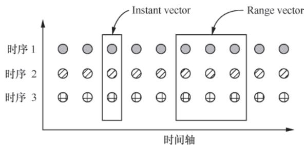

# Prometheus 技术秘笈（六）：HTTP API接口 - 玩转Prometheus的程序化操作

## 导语

除了Web UI和PromQL查询，Prometheus还提供了丰富的HTTP API，支持程序化查询数据、管理实例。Prometheus Server目前提供V1和V2两个版本的HTTP API：

- V1版本：稳定版本，是生产环境中最常使用的版本；
- V2版本及gRPC接口：仍处于不稳定状态。

这些API不仅支撑Prometheus自带Web UI、Grafana等可视化工具的数据查询，还能通过代码/脚本实现定制化的监控数据获取、实例管理等操作。本文将拆解V1版本API的核心能力、底层实现逻辑及实际使用场景。

## 一、PromQL相关接口

这是最常用的API类别，核心用于执行PromQL语句获取时序数据，是Prometheus数据查询能力的核心出口，包含两种核心查询方式：

### 1. Instant Query（瞬时查询）

#### 核心能力

获取**某个时间点**的指标值，返回`Instant vector`（瞬时向量）——多条时序，每条时序仅包含一个时间戳相同的时序点。

#### 接口基础信息

| 项目       | 内容                          |
|------------|-------------------------------|
| 接口路径   | `/api/v1/query`               |
| 请求方式   | GET / POST                    |

#### 请求参数

| 参数名   | 必填 | 说明                                                                 | 示例                                                                 |
|----------|------|----------------------------------------------------------------------|----------------------------------------------------------------------|
| `query`  | 是   | PromQL查询语句                                                       | `sum(go_gc_durationSeconds{instance="localhost:9090",job="test_job"})` |
| `time`   | 否   | 查询时间戳（未指定则用当前时间，Unix秒级）| `1718000000`                                                         |
| `timeout`| 否   | 查询超时时间（支持s/ms/m/h等单位）| `5s`                                                                 |
| `stats`  | 否   | 非空时，响应携带查询监控信息（如执行耗时、扫描样本数）| `true`                                                               |

#### 返回值结构（JSON）

```json
{
  "status":"success",
  "data":{
    "resultType":"vector",
    "result":[
      {
        "metric":{
          "__name__":"up",
          "job":"prometheus",
          "instance":"localhost:9090"
        },
        "value":[1435781451.781, "1"]
      }
    ]
  }
}
```

- `status`：请求状态（`success`/`error`）；
- `data.resultType`：结果类型（瞬时查询固定为`vector`）；
- `data.result`：时序数组，每个元素包含`metric`（标签集合）和`value`（[时间戳, 指标值]）。

#### 底层实现逻辑

该接口逻辑封装在`API.query()`方法中，核心流程：

1. 解析并校验请求参数（如`query`语法、时间戳格式）；
2. 创建`Query`实例（PromQL执行核心接口，承载语句解析/执行/资源释放）；
3. 调用`Exec()`方法（底层通过`promql.Engine.exec()`执行PromQL）；
4. 格式化执行结果并返回。

### 2. Range Query（范围查询）

#### 核心能力

获取**一段时间内**的指标序列，返回`Range vector`（范围向量）——多条时序，每条时序包含多个不同时间戳的时序点。

#### 接口基础信息

| 项目       | 内容                              |
|------------|-----------------------------------|
| 接口路径   | `/api/v1/query_range`             |
| 请求方式   | GET / POST                        |

#### 请求参数

| 参数名   | 必填 | 说明                                                                 | 示例                  |
|----------|------|----------------------------------------------------------------------|-----------------------|
| `query`  | 是   | PromQL查询语句                                                       | `up{job="prometheus"}`|
| `start`  | 是   | 查询起始时间戳（Unix秒级）| `1718000000`          |
| `end`    | 是   | 查询结束时间戳（Unix秒级）| `1718003600`          |
| `step`   | 是   | 查询精度（同一条时序中两个数据点的时间间隔）| `15s`（最小支持1ms）|
| `timeout`| 否   | 查询超时时间                                                         | `10s`                 |

> ⚠️ 限制说明：Prometheus限制返回数据点数量，若`(end - start)/step > 11000`，会直接返回错误（避免单次查询数据量过大）。

#### 返回值结构（JSON）

```json
{
  "status":"success",
  "data":{
    "resultType":"matrix",
    "result":[
      {
        "metric":{
          "__name__":"up",
          "job":"prometheus",
          "instance":"localhost:9090"
        },
        "values":[
          [1435781430.781,"1"],
          [1435781445.781,"1"],
          [1435781460.781,"1"]
        ]
      }
    ]
  }
}
```

- `data.resultType`：结果类型（范围查询固定为`matrix`）；
- `data.result.values`：时序数据数组，每个元素为[时间戳, 指标值]。

#### 底层实现逻辑

处理逻辑封装在`API.queryRange()`方法中，流程与瞬时查询类似，核心差异：

1. 创建`RangeQuery`实例而非`Query`；
2. 额外校验`start`/`end`/`step`合法性（如`start < end`、`step > 0`）；
3. 最终仍通过`promql.Engine`执行查询。

#### 瞬时查询 vs 范围查询

**PromQL瞬时查询与范围查询核心区别**  


## 二、元数据查询接口

用于获取指标的标签、类型等基础信息，是理解Prometheus指标体系的关键入口。

### 1. 时序元数据查询

#### 核心能力

查询指定时间段内符合过滤条件的时序信息（仅返回标签集合，不包含具体数值）。

#### 接口基础信息

| 项目       | 内容                  |
|------------|-----------------------|
| 接口路径   | `/api/v1/series`      |
| 请求方式   | GET / POST            |

#### 请求参数

| 参数名    | 必填 | 说明                                                                 |
|-----------|------|----------------------------------------------------------------------|
| `match[]` | 是   | 过滤时序的条件（支持多个，多条件为OR关系）|
| `start`   | 是   | 查询起始时间戳（Unix秒级）|
| `end`     | 是   | 查询结束时间戳（Unix秒级）|

#### 请求示例（curl）

```bash
curl 'http://localhost:9090/api/v1/series?match[]=up&match[]=process_start_timeSeconds{job="prometheus"}'
```

#### 返回值示例（JSON）

```json
{
  "status":"success",
  "data":[
    {
      "__name__":"up",
      "job":"prometheus",
      "instance":"localhost:9090"
    },
    {
      "__name__":"up",
      "job":"node",
      "instance":"localhost:9091"
    },
    {
      "__name__":"process_start_timeSeconds",
      "job":"prometheus",
      "instance":"localhost:9090"
    }
  ]
}
```

#### 底层实现逻辑

核心在`API.series()`方法中，流程：

1. 解析`match[]`为`Matcher`实例（用于过滤时序）；
2. 创建`Querier`实例（指定查询时间范围）；
3. 调用`Querier.Select()`查询符合条件的时序；
4. 遍历结果，提取标签集合并返回。

### 2. Label Value查询

#### 核心能力

根据标签名，查询Prometheus中该标签的所有取值。

#### 接口基础信息

| 项目       | 内容                              |
|------------|-----------------------------------|
| 接口路径   | `/api/v1/label/<label_name>/values` |
| 请求方式   | GET / POST                        |

#### 请求示例（curl）

```bash
# 查询job标签的所有取值
curl 'http://localhost:9090/api/v1/label/job/values'
```

#### 底层实现逻辑

封装在`API.labelValues()`方法中：

1. 创建`Querier`实例（时间范围覆盖全量数据）；
2. 调用`q.LabelValues(name)`获取标签值集合；
3. 格式化结果并返回。

## 三、管理类接口

聚焦Prometheus实例的运维管理，涵盖采集目标、规则配置、数据管理等核心能力。

### 1. Target和Rule查询

#### （1）Target查询

##### 核心能力

获取当前所有采集目标（Target）的信息，包括发现的标签、抓取地址、最后抓取时间、健康状态等。

##### 接口基础信息

| 项目       | 内容              |
|------------|-------------------|
| 接口路径   | `/api/v1/targets` |
| 请求方式   | GET               |

##### 返回值示例（JSON）

```json
{
  "status":"success",
  "data":{
    "activeTargets":[
      {
        "discoveredLabels":{
          "__address__":"localhost:9090",
          "__metrics_path__":"/metrics",
          "__scheme__":"http",
          "job":"test_job"
        },
        "labels":{
          "instance":"localhost:9090",
          "job":"test_job"
        },
        "scrapeUrl":"http://localhost:9090/metrics",
        "lastError":"",
        "lastScrape":"2019-03-24T09:27:11.505320069+08:00",
        "health":"up"
      }
    ],
    "droppedTargets":[]
  }
}
```

- `activeTargets`：正在运行的采集目标；
- `droppedTargets`：被过滤/丢弃的采集目标；
- `health`：目标健康状态（`up`/`down`/`unknown`）。

##### 底层实现逻辑

数据来源：`scrape.Manager`（采集模块核心管理结构体）；
接口逻辑：读取`scrape.Manager`中的Target信息，格式化后返回。

#### （2）Rule查询

| 接口路径          | 核心能力                                                                 |
|-------------------|--------------------------------------------------------------------------|
| `/api/v1/alerts`  | 查询Alerting Rule（告警规则）及当前触发的告警信息                       |
| `/api/v1/rules`   | 查询Recording Rule（记录规则）和Alerting Rule的完整配置（含表达式、触发条件） |

##### 底层实现逻辑

数据来源：`rules.Manager`（规则模块核心管理结构体）；
接口逻辑：读取`rules.Manager`中的规则信息，格式化后返回。

### 2. Admin接口（运维管理）

Admin接口是Prometheus运维核心入口，支持数据删除、备份等操作，**需先开启`enableAdmin`配置**才能使用。

#### （1）删除时序数据

##### 核心能力

标记指定时间范围、符合过滤条件的时序数据为“待删除”（不立即清理磁盘，返回速度快）。

##### 接口基础信息

| 项目       | 内容                          |
|------------|-------------------------------|
| 接口路径   | `/admin/tsdb/delete_series`   |
| 请求方式   | GET / POST                    |

##### 请求参数

| 参数名    | 必填 | 说明                                                                 |
|-----------|------|----------------------------------------------------------------------|
| `match[]` | 是   | 过滤要删除的时序（支持多个，多条件为OR关系）|
| `start`   | 是   | 删除起始时间戳（Unix秒级）|
| `end`     | 是   | 删除结束时间戳（Unix秒级）|

##### 底层实现逻辑

调用`tsdb.DB.Delete()`方法，仅对数据做“标记删除”（写入墓碑文件），磁盘数据需手动触发清理。

#### （2）清理标记删除的数据

##### 核心能力

手动触发磁盘数据清理，删除已标记为“待删除”的时序数据。

##### 接口基础信息

| 项目       | 内容                                  |
|------------|---------------------------------------|
| 接口路径   | `/api/v1/admin/tsdb/clean_tombstones` |
| 请求方式   | GET / POST                            |

##### 底层实现逻辑

调用`tsdb.DB.CleanTombstones()`方法，真正删除磁盘上标记为“待删除”的数据文件。

#### （3）TSDB快照备份

##### 核心能力

对Prometheus TSDB（时序数据库）做快照备份，支持是否包含内存中的Head窗口数据。

##### 接口基础信息

| 项目       | 内容                                  |
|------------|---------------------------------------|
| 接口路径   | `/admin/tsdb/snapshot?skip_head=<bool>`|
| 请求方式   | GET / POST                            |

##### 请求参数

| 参数名     | 必填 | 说明                                                                 |
|------------|------|----------------------------------------------------------------------|
| `skip_head`| 否   | 是否跳过内存Head数据：<br>- `false`（默认）：持久化Head后备份<br>- `true`：仅备份磁盘历史数据 |

##### 底层实现逻辑

触发TSDB快照机制，将数据备份到`data/snapshots`目录（Prometheus数据目录下）。

## 小结

HTTP API是Prometheus与外部系统集成的核心，典型应用场景：

- 自研监控面板：基于`/api/v1/query`/`/api/v1/query_range`实现定制化图表；
- 自动化运维脚本：通过`/api/v1/targets`监控采集目标健康状态，异常时自动告警/重启；
- 运维工具：基于Admin接口实现数据清理、定时备份，避免磁盘占用过高。

掌握这些API的用法和底层逻辑，可突破Prometheus Web UI的限制，适配更多定制化运维/监控场景。
