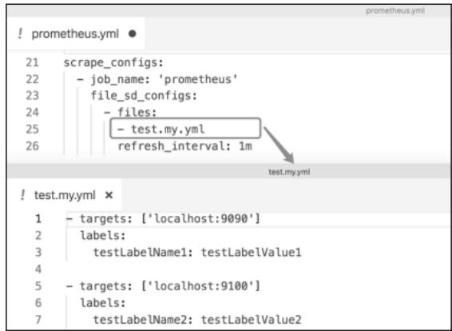
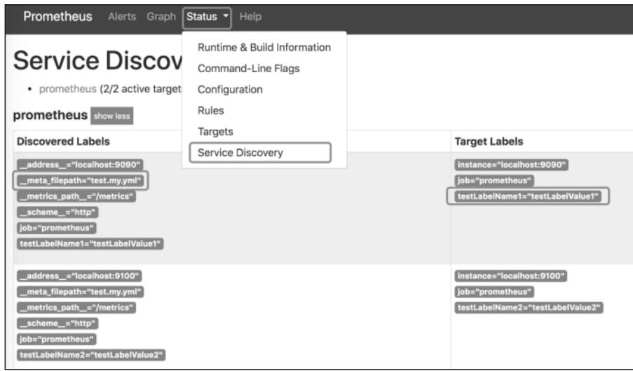
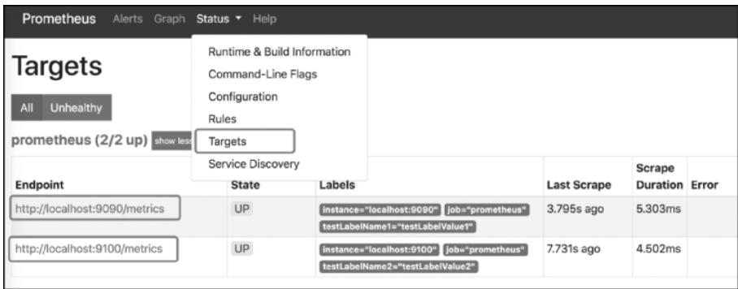

## 导语

在传统静态部署环境中，我们可以直接在`prometheus.yml`中配置固定的Target地址，但在K8s、云原生这类动态环境下，实例的创建、销毁、IP变更成为常态。静态配置不仅维护成本极高，还会导致监控覆盖不及时。而Prometheus的Discovery模块正是解决这一问题的核心——它如同Prometheus的“动态发现大脑”，能自动感知目标实例的变化，无需手动修改配置或重启服务。本文将从底层逻辑拆解Discovery模块的核心设计、实现方式，以及它如何与Prometheus Server的整体流程联动。

## 一、基于文件的服务发现

基于文件的服务发现是Prometheus最基础、最易理解的动态发现方式。它通过监听指定文件/目录的变更自动更新Target列表，也是理解K8s、Consul等复杂服务发现的基础。

### 1. 静态配置的痛点

无服务发现场景下，修改Target需手动编辑`prometheus.yml`，再调用接口触发全量配置重载。这不仅需要运维手动介入，还会导致notifier等无关模块重载配置，增加服务稳定性风险。文件服务发现通过“监听文件变更”实现Target的无感更新，规避了上述问题。

### 2. 基础配置与效果

文件服务发现通过`file_sd_configs`配置项指定监听的文件（支持通配符/目录），示例配置如下：



**图9-1 基于文件的服务发现配置示例**

启动Prometheus后，可在Web UI的“Service Discovery”页面看到Target的元数据（如`__meta_filepath`标签记录配置文件路径）：



**图9-2 Service Discovery页面的元数据展示**

在“Targets”页面可直接查看通过文件发现的Target列表：



**图9-3 Targets页面的文件发现结果展示**

### 3. 底层实现逻辑

文件服务发现的核心是`file.Discovery`结构体，其核心字段决定了监听和更新逻辑：

- `paths`：记录监听的文件/目录（支持通配符）；
- `watcher`：基于`fsnotify.Watcher`实现，监听文件的修改、新增、删除事件；
- `interval`：默认5分钟，定期主动推送Target信息（避免事件监听遗漏）；
- `timestamps`/`lastRefresh`：记录文件最后读取时间、Target分组数量，用于对比变更。

#### （1）核心监听逻辑

`file.Discovery`的`Run()`方法是核心入口，执行流程如下：

1. 创建`fsnotify.Watcher`实例，监听`paths`指定的文件；
2. 初始化时调用`refresh()`读取文件，将Target解析为`targetgroup.Group`并写入通道；
3. 监听两类事件：
   - 文件变更事件（修改、新增等）：过滤非`Chmod`的有效变更，触发`refresh()`重新读取文件；
   - 定时器到期（interval）：主动触发`refresh()`，保证事件监听失效时仍能更新Target。

**核心代码逻辑（修正后）**：

```go
func (d *Discovery) Run(ctx context.Context, ch chan<- []*targetgroup.Group) {
    // 创建文件监听器，处理创建失败的异常
    watcher, err := fsnotify.NewWatcher()
    if err != nil {
        log.Error("failed to create fsnotify watcher", "err", err)
        return
    }
    d.watcher = watcher
    defer d.watcher.Close() // 确保退出时关闭监听器

    // 初始化读取文件，推送初始Target列表
    d.refresh(ctx, ch)

    // 初始化定时器，默认5分钟触发一次主动刷新
    ticket := time.NewTicker(d.interval)
    defer ticket.Stop() // 退出时停止定时器

    for {
        select {
        // 监听文件变更事件
        case event, ok := <-d.watcher.Events:
            // 过滤无效事件（空文件名、仅Chmod操作）
            if !ok || len(event.Name) == 0 || event.Op&fsnotify.Chmod == fsnotify.Chmod {
                break
            }
            // 触发刷新，重新读取文件并推送新Target
            d.refresh(ctx, ch)
        // 定时器触发主动刷新
        case <-ticket.C:
            d.refresh(ctx, ch)
        // 上下文取消（服务关闭），退出循环
        case <-ctx.Done():
            log.Info("file discovery run context canceled, exiting")
            return
        // 监听监听器错误
        case err, ok := <-d.watcher.Errors:
            if ok {
                log.Warn("fsnotify watcher error", "err", err)
            }
        }
    }
}
```

#### （2）文件解析与变更对比

`refresh()`方法负责读取文件、解析Target，并处理“删除Target”场景，核心流程：

1. 遍历`paths`匹配的所有文件，调用`readFile()`解析内容（支持JSON/YAML格式）；
2. 为每个`targetgroup.Group`添加`__meta_filepath`标签，记录配置文件路径；
3. 对比`lastRefresh`的历史分组数量，若文件被删除/Target数量减少，向通道发送空`targetgroup.Group`以删除无效Target；
4. 更新`lastRefresh`和`timestamps`，并重新注册文件监听。

`readFile()`方法按文件后缀解析内容，生成`targetgroup.Group`实例：

```go
func (d *Discovery) readFile(filename string) ([]*targetgroup.Group, error) {
    // 打开文件，处理打开失败的异常
    fd, err := os.Open(filename)
    if err != nil {
        log.Warn("failed to open file", "filename", filename, "err", err)
        return nil, err
    }
    defer fd.Close() // 确保文件句柄关闭

    // 读取文件内容（新版Go建议使用os.ReadFile，此处保留原逻辑）
    content, err := ioutil.ReadAll(fd)
    if err != nil {
        log.Warn("failed to read file content", "filename", filename, "err", err)
        return nil, err
    }

    // 获取文件元信息，记录修改时间
    info, err := fd.Stat()
    if err != nil {
        log.Warn("failed to get file stat", "filename", filename, "err", err)
        return nil, err
    }

    var targetGroups []*targetgroup.Group

    // 按文件后缀解析（JSON/YAML）
    switch ext := filepath.Ext(filename); ext {
    case ".json":
        if err := json.Unmarshal(content, &targetGroups); err != nil {
            log.Error("failed to unmarshal json file", "filename", filename, "err", err)
            return nil, err
        }
    case ".yaml", ".yml":
        if err := yaml.UnmarshalStrict(content, &targetGroups); err != nil {
            log.Error("failed to unmarshal yaml file", "filename", filename, "err", err)
            return nil, err
        }
    default:
        err := fmt.Errorf("unsupported file extension %q", ext)
        log.Error(err.Error(), "filename", filename)
        return nil, err
    }

    // 为每个TargetGroup添加元数据标签和唯一标识
    for i, tg := range targetGroups {
        tg.Source = fileSource(filename, i) // 生成唯一Source标识
        if tg.Labels == nil {
            tg.Labels = model.LabelSet{}
        }
        // 添加__meta_filepath标签，记录配置文件路径
        tg.Labels[fileSDFPathLabel] = model.LabelValue(filename)
    }

    // 记录文件读取时间戳
    d.writeTimestamp(filename, float64(info.ModTime().Unix()))
    return targetGroups, nil
}
```

## 二、discovery.Manager实现

`file.Discovery`是单一类型的服务发现实现，而`discovery.Manager`是Discovery模块的“总控中心”——管理多个Discoverer实例（文件、K8s、Consul等），汇总所有发现结果，并同步给scrape、notifier等外部模块。

### 1. 核心字段与定位

`discovery.Manager`的核心字段决定了管理和同步能力：

- `targets`：存储所有已发现的Target信息，以`poolKey`（唯一标识）为键；
- `providers`：记录管理的Discoverer实例（封装Discoverer、名称、配置）；
- `syncCh`：外部模块（如scrape）监听的通道，Target变更时推送全量数据；
- `updatert`：最小推送间隔（避免频繁推送）；
- `triggerSend`：Target变更时触发的信号通道，控制是否向`syncCh`推送数据。

### 2. 初始化与Discoverer管理

Prometheus启动时，`Manager.ApplyConfig()`方法根据`prometheus.yml`的服务发现配置，创建对应的Discoverer和`provider`实例：

1. 遍历配置中的服务发现组件（如`file_sd_configs`），调用`registerProviders()`；
2. `registerProviders()`通过回调函数创建Discoverer实例（如`file.NewDiscovery()`），并封装为`provider`；
3. 将`provider`添加到`providers`列表，调用`startProvider()`启动实例。

**核心代码逻辑**：

```go
func (m *Manager) ApplyConfig(cfg map[string]sd_config.ServiceDiscoveryConfig) error {
    // 清空旧的provider，避免配置重载时重复注册
    m.providers = []*provider{}

    for name, scfg := range cfg {
        m.registerProviders(scfg, name) // 创建Discoverer和provider
    }

    // 启动所有新注册的provider
    for _, prov := range m.providers {
        if err := m.startProvider(m.ctx, prov); err != nil {
            log.Error("failed to start provider", "provider", prov.name, "err", err)
            return err
        }
    }
    return nil
}

func (m *Manager) registerProviders(cfg sd_config.ServiceDiscoveryConfig, title string) {
    // 封装Discoverer创建逻辑的回调函数
    add := func(cfg interface{}, newDiscoverer func() (Discoverer, error)) {
        d, err := newDiscoverer()
        if err != nil {
            log.Error("failed to create discoverer", "title", title, "err", err)
            return
        }
        // 封装为provider实例
        provider := &provider{
            name:   fmt.Sprintf("%s/%d", title, len(m.providers)),
            d:      d,
            config: cfg,
            subs:   []string{title},
        }
        m.providers = append(m.providers, provider) // 加入管理列表
    }

    // 处理文件服务发现配置
    for _, c := range cfg.FileSDConfigs {
        add(c, func() (Discoverer, error) {
            return file.NewDiscovery(c, log.With(m.logger, "discovery", "file")), nil
        })
    }

    // 处理K8s/Consul等其他服务发现配置（省略）
}
```

### 3. 实例启动与数据同步

`startProvider()`为每个Discoverer启动两个goroutine：

- 执行`Discoverer.Run()`：监听Target变更，将结果写入`updates`通道；
- 执行`Manager.updater()`：读取`updates`通道，更新`Manager.targets`，并向`triggerSend`发送变更信号。

同时，`Manager.Run()`启动`sender()` goroutine，监听`triggerSend`信号，结合`updatert`定时器控制推送频率，避免频繁向`syncCh`推送数据。

**核心代码逻辑**：

```go
// 启动单个provider
func (m *Manager) startProvider(ctx context.Context, p *provider) error {
    // 创建带缓冲的通道，避免阻塞Discoverer
    updates := make(chan []*targetgroup.Group, 1)

    // 启动Discoverer的Run方法，监听Target变更
    go func() {
        defer close(updates) // 退出时关闭通道
        p.d.Run(ctx, updates)
    }()

    // 启动updater，处理Target更新
    go m.updater(ctx, p, updates)
    return nil
}

// 处理Target更新，同步到Manager.targets
func (m *Manager) updater(ctx context.Context, p *provider, updates <-chan []*targetgroup.Group) {
    for {
        select {
        case tgs, ok := <-updates:
            if !ok {
                log.Info("updater channel closed", "provider", p.name)
                return
            }
            // 加锁更新targets，避免并发冲突
            m.mtx.Lock()
            m.targets[p.name] = tgs
            m.mtx.Unlock()

            // 发送变更信号，触发sender推送
            select {
            case m.triggerSend <- struct{}{}:
            default:
                // 通道满时忽略，等待下一次定时器触发
            }
        case <-ctx.Done():
            log.Info("updater context canceled", "provider", p.name)
            return
        }
    }
}

// 控制向外部模块推送Target的频率
func (m *Manager) sender() {
    ticker := time.NewTicker(m.updatert)
    defer ticker.Stop()

    for {
        select {
        case <-ticker.C:
            select {
            // 检测到变更信号，推送全量Target
            case <-m.triggerSend:
                m.mtx.RLock()
                allGroups := m.allGroups() // 汇总所有TargetGroup
                m.mtx.RUnlock()

                // 推送全量数据到syncCh，通道满时重试
                select {
                case m.syncCh <- allGroups:
                    log.Debug("sent updated target groups to sync channel")
                default:
                    // 通道满，重新触发信号，下次定时器重试
                    select {
                    case m.triggerSend <- struct{}{}:
                    default:
                    }
                    log.Warn("sync channel is full, will retry next tick")
                }
            default:
                // 无变更，无需推送
            }
        case <-m.ctx.Done():
            log.Info("sender context canceled, exiting")
            return
        }
    }
}

// 汇总所有已发现的TargetGroup
func (m *Manager) allGroups() []*targetgroup.Group {
    var all []*targetgroup.Group
    for _, tgs := range m.targets {
        all = append(all, tgs...)
    }
    return all
}
```

## 三、Prometheus Server的启动流程（与Discovery相关）

Discovery模块与Prometheus Server的启动流程深度绑定，核心是“初始化→配置加载→模块联动→配置重载”的闭环。

### 1. 模块初始化

Prometheus启动时，初始化两个核心的`discovery.Manager`实例：

- `discoveryManagerNotify`：为notifier模块服务，动态发现AlertManager地址；
- `discoveryManagerScrape`：为scrape模块服务，动态发现Target地址。

**核心初始化代码**：

```go
// 初始化上下文（用于控制模块生命周期）
ctxMain, cancelMain := context.WithCancel(context.Background())
defer cancelMain()

ctxNotify, cancelNotify := context.WithCancel(ctxMain)
ctxScrape, cancelScrape := context.WithCancel(ctxMain)

// 初始化notify模块的discovery manager
discoveryManagerNotify = discovery.NewManager(
    ctxNotify,
    log.With(logger, "component", "discovery manager notify"),
    discovery.Name("notify"),
)

// 初始化scrape模块的discovery manager
discoveryManagerScrape = discovery.NewManager(
    ctxScrape,
    log.With(logger, "component", "discovery manager scrape"),
    discovery.Name("scrape"),
)

// 初始化scrape manager，关联存储层
scrapeManager = scrape.NewManager(
    log.With(logger, "component", "scrape manager"),
    fanoutStorage,
)
```

### 2. 启动流程的核心时序

Prometheus通过`group.Group`管理多个goroutine（actor），并行执行且相互联动，核心时序：

1. **监听关闭事件**：监听SIGTERM信号`/-/quit`接口，触发服务关闭；
2. **启动TSDB存储**：初始化本地存储和远程存储，完成后关闭`dbOpen`通道；
3. **初次加载配置**：监听`dbOpen`通道关闭后，调用`reloadConfig()`加载`prometheus.yml`，并关闭`reloadReady.C`通道；
4. **启动核心模块**：`reloadReady.C`关闭后，启动`discoveryManagerScrape`和`scrapeManager`，scrape模块通过`syncCh`监听discovery模块的Target变更；
5. **监听配置重载**：监听SIGHUP信号`/-/reload`接口，触发`reloadConfig()`更新配置。

**核心联动代码**：

```go
// 使用group.Group管理goroutine，保证优雅退出
g := group.NewGroup(ctxMain, group.WithLogger(logger))

// 启动discoveryManagerScrape
g.Add(
    func() error {
        return discoveryManagerScrape.Run()
    },
    func(err error) {
        cancelScrape() // 异常时关闭scrape上下文
        log.Error("discovery manager scrape exited with error", "err", err)
    },
)

// 启动scrapeManager（依赖discovery模块的配置加载完成）
g.Add(
    func() error {
        <-reloadReady.C // 等待初次配置加载完成
        // 监听discovery模块的syncCh，同步Target变更
        return scrapeManager.Run(discoveryManagerScrape.SyncCh())
    },
    func(err error) {
        scrapeManager.Stop() // 异常时停止scrape模块
        log.Error("scrape manager exited with error", "err", err)
    },
)

// 启动其他模块（如notify、web）（省略）

// 等待所有goroutine退出
if err := g.Run(); err != nil {
    log.Fatal("prometheus server exited with error", "err", err)
}
```

### 3. 配置重载逻辑

修改`prometheus.yml`后，触发SIGHUP信号或调用`/-/reload`接口，会执行`reloadConfig()`函数：

1. 读取`prometheus.yml`并解析为`Config`实例；
2. 遍历`reloaders`回调函数，调用各模块的`ApplyConfig()`方法更新配置；
3. 针对discovery模块的回调，更新`discoveryManagerScrape`的服务发现配置。

**核心代码逻辑**：

```go
// 重载配置的核心函数
func reloadConfig(filename string, logger log.Logger, rls ...func(*config.Config) error) error {
    // 加载并解析配置文件
    conf, err := config.LoadFile(filename)
    if err != nil {
        log.Error("failed to load config file", "filename", filename, "err", err)
        return err
    }

    // 校验配置合法性
    if err := conf.Validate(); err != nil {
        log.Error("invalid config", "err", err)
        return err
    }

    // 执行各模块的配置更新回调
    for _, rl := range rls {
        if err := rl(conf); err != nil {
            log.Error("failed to apply config to module", "err", err)
            return err
        }
    }

    log.Info("config reloaded successfully")
    return nil
}

// 定义各模块的配置更新回调
reloaders := []func(cfg *config.Config) error{
    // 更新scrape模块的discovery配置
    func(cfg *config.Config) error {
        sdCfg := make(map[string]sd_config.ServiceDiscoveryConfig)
        for _, sc := range cfg.ScrapeConfigs {
            sdCfg[sc.JobName] = sc.ServiceDiscoveryConfig
        }
        return discoveryManagerScrape.ApplyConfig(sdCfg)
    },
    // 更新notify模块的discovery配置（省略）
    // 更新其他模块配置（省略）
}

// 注册配置重载的信号监听（SIGHUP）
signal.Notify(sigCh, syscall.SIGHUP)
go func() {
    for range sigCh {
        log.Info("received SIGHUP, triggering config reload")
        if err := reloadConfig(promConfigFile, logger, reloaders...); err != nil {
            log.Error("config reload failed", "err", err)
        }
    }
}()
```

## 小结

Discovery模块是Prometheus适配动态云原生环境的核心：

- 底层通过`Discoverer`接口抽象各类服务发现实现（文件、K8s、Consul等），`file.Discovery`是最基础的实现，基于`fsnotify`监听文件变更；
- `discovery.Manager`作为“总控中心”，管理多个Discoverer实例，汇总结果并按频率同步给scrape模块；
- 与Prometheus Server的启动流程深度绑定，通过配置加载、模块联动、配置重载，实现Target的全生命周期动态管理。

正是因为Discovery模块的存在，Prometheus才能摆脱静态配置的束缚，成为K8s生态中主流的监控解决方案。下一篇将聚焦AlertManager，拆解告警的处理、分组、抑制和分发逻辑，分析Prometheus如何将告警精准推送到指定渠道。
