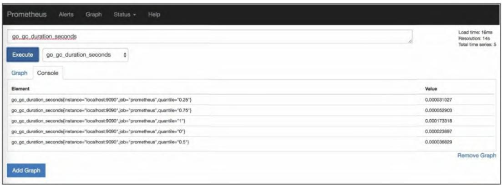
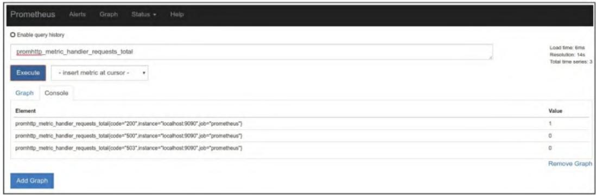

# Prometheus 监控实战系列 03：从零落地：多环境安装部署与核心配置快速上手

本篇将聚焦Prometheus的落地实操——覆盖Linux、Windows、Mac OS X等多环境的安装部署方式，拆解核心配置文件，手把手教你启动Prometheus并上手PromQL查询，让你快速掌握Prometheus的基础运行与使用逻辑。

## 一、多环境安装Prometheus

Prometheus提供跨平台的独立二进制文件，支持Linux、Windows、Mac OS X、FreeBSD等主流系统，我们重点讲解最常用的三类系统安装方式，同时补充Docker、配置管理工具、K8s等生产级部署方式。

### 1.1 Linux（64位）安装

Linux是Prometheus的主流运行环境，步骤如下：

#### 步骤1：下载二进制包

```bash
cd /tmp
wget https://github.com/prometheus/prometheus/releases/download/v2.3.2/prometheus-2.3.2-linux-amd64.tar.gz
```

#### 步骤2：解压并安装二进制文件

```bash
tar -xzf prometheus-2.3.2-linux-amd64.tar.gz
sudo cp prometheus-2.3.2-linux-amd64/prometheus /usr/local/bin/
sudo cp prometheus-2.3.2-linux-amd64/promtool /usr/local/bin/
```

#### 步骤3：验证安装

```bash
prometheus --version
```

输出示例：

```
prometheus, version 2.3.2 (branch: HEAD, revision: 3569eef8b1bc062bb5df43181b938277818f365b)
build user: root@bd4857492255
build date: 20171006-22:16:15
go version: go1.9.1
```

### 1.2 Windows安装

Windows环境下需下载专属可执行文件，步骤如下：

#### 步骤1：创建安装目录

```cmd
C:\> MKDIR prometheus
C:\> CD prometheus
```

#### 步骤2：下载安装包

下载地址：<https://github.com/prometheus/prometheus/releases/download/v2.3.2/prometheus-2.3.2.windows-amd64.tar.gz>

#### 步骤3：解压并配置环境变量

用7-Zip解压文件到`C:\prometheus`，通过PowerShell添加环境变量：

```powershell
$env:Path += ";C:\prometheus"
```

#### 步骤4：验证安装

```cmd
C:\> prometheus.exe --version
```

（输出与Linux类似，核心版本信息一致）

> 补充：也可通过Chocolatey包管理器快速安装：
>
> ```batch
> C:\>choco install prometheus
> ```

### 1.3 Mac OS X安装

Mac推荐使用Homebrew一键安装：

```powershell
brew install prometheus
```

验证安装：

```bash
prometheus --version
```

### 1.4 扩展部署方式（生产级）

如果是生产环境或规模化部署，推荐以下方式：

- **Docker快速运行**：
  基础运行（默认配置）：

  ```bash
  docker run -p 9090:9090 prom/prometheus
  ```

  挂载自定义配置：

  ```bash
  docker run -p 9090:9090 -v /tmp/prometheus.yml:/etc/prometheus/prometheus.yml prom/prometheus
  ```

- **配置管理工具**：推荐使用Puppet模块、Chef cookbook、Ansible role、SaltStack formula（标准化部署，适配大规模集群）；
- **Kubernetes部署**：可基于自定义配置文件打包成服务，或使用CoreOS的Prometheus Operator（K8s生态首选）。

## 二、Prometheus核心配置解析

Prometheus通过YAML文件配置，默认配置文件为`prometheus.yml`，核心包含4个配置块，先看默认配置精简版：

```yaml
global: 
  scrape_interval: 15s 
  evaluation_interval: 15s   
alerting: 
  alertmanagers: 
    - static_configs: 
      - targets: 
        # - alertmanager:9093   
rule_files: 
  # - "first/rules.yml" 
  # - "second/rules.yml"   
scrape_configs: 
  - job_name: 'prometheus' 
    static_configs: 
      - targets: ['localhost:9090']
```

### 2.1 global：全局配置

控制Prometheus服务器核心行为：

- `scrape_interval`：抓取指标的时间间隔（默认15s），**建议保持全局统一**，避免时间序列颗粒度不一致导致查询异常；
- `evaluation_interval`：评估“记录规则/警报规则”的频率（默认15s），规则会在后续章节详细配置。

### 2.2 alerting：警报配置

用于对接Alertmanager（Prometheus的独立警报管理工具），默认仅注释了示例地址，可通过静态配置/服务发现指定Alertmanager列表，后续章节会完成完整配置。

### 2.3 rule_files：规则文件

指定包含“记录规则（预计算复杂指标）”“警报规则（定义告警条件）”的文件列表，是Prometheus扩展能力的核心配置。

### 2.4 scrape_configs：抓取配置

定义Prometheus的监控目标，核心概念：

- **作业（job）**：一组监控目标的集合（如“监控所有服务器”“监控所有容器”）；
- **实例（instance）**：作业中唯一标识的单个监控目标；
- **static_configs**：静态配置（手动指定目标，区别于自动服务发现）。

默认配置中，`job_name: 'prometheus'` 表示监控Prometheus自身，从`localhost:9090/metrics`抓取指标（默认路径可通过配置覆盖）。

## 三、启动Prometheus

### 3.1 常规启动（Linux/Mac）

#### 步骤1：迁移配置文件到规范目录

```bash
sudo mkdir -p /etc/prometheus
sudo cp prometheus.yml /etc/prometheus/
```

#### 步骤2：启动服务器

```bash
prometheus --config.file "/etc/prometheus/prometheus.yml"
```

启动成功会输出`Starting prometheus`相关日志，无报错即代表启动完成。

#### 步骤3：配置校验（异常排查）

若启动失败，使用`promtool`校验配置文件语法：

```bash
promtool check config prometheus.yml
```

输出`SUCCEED: 0 rule files found`表示配置无语法问题。

### 3.2 Docker启动（快速验证）

适合快速测试，无需配置本地环境：

```bash
# 基础启动（默认配置）
docker run -p 9090:9090 prom/prometheus
# 挂载自定义配置
docker run -p 9090:9090 -v /tmp/prometheus.yml:/etc/prometheus/prometheus.yml prom/prometheus
```

## 四、第一个指标与表达式浏览器

启动后，Prometheus已开始抓取自身指标，我们通过两种方式查看，并上手PromQL（Prometheus查询语言）。

### 4.1 查看原始指标

直接访问`http://localhost:9090/metrics`，可看到原生格式的指标，例如：

```
# HELP go_gc_durationSeconds A summary of the GC invocation durations.
# TYPE go_gc_durationSeconds summary
go_gc_durationSeconds{quantile="0"} 1.6166e-05
go_gc_durationSeconds{quantile="0.25"} 3.8655e-05
go_gc_durationSeconds{quantile="0.5"} 5.3416e-05
```

指标格式：`指标名{标签=值} 数值`，例如`go_gc_durationSeconds{quantile="0.5"} 5.3416e-05`，标签用于维度区分，数值是指标的具体值。

### 4.2 表达式浏览器（可视化查询）

访问`http://localhost:9090/graph`打开**表达式浏览器**（Prometheus内置的查询工具），这是日常操作Prometheus的核心入口。

#### 4.2.1 基础查询（即时向量）

PromQL的核心数据类型之一是**即时向量**（一组共享时间戳的时间序列样本），示例：

- 查询第50百分位的GC耗时：`go_gc_durationSeconds{quantile="0.5"}`
- 排除第75百分位的GC耗时：`go_gc_durationSeconds{quantile!="0.75"}`（支持正则/运算符过滤标签）

**图3-1 Prometheus表达式浏览器**  
  

示例：查询`prometheus_build_info`（包含Prometheus构建信息），返回结果如下：

```
prometheus_build_info{branch="HEAD",goversion="go1.9.1",instance="localhost:9090",job="prometheus",revision="5ab8834befbd92241a88976c790ace7543edcd59",version="2.3.2"} 1
```

这类指标常以`值=1`为载体，通过标签传递元信息（版本、构建环境等），是Prometheus的常见设计模式。

**图3-3 查询百分位数**  
  

#### 4.2.2 聚合查询（进阶）

以`promhttp_metric_handler_requests_total`（Prometheus HTTP请求总数）为例，演示聚合与速率计算：

1. 求和所有请求（无维度）：`sum(promhttp_metric_handler_requests_total)`
2. 按job维度求和：`sum(promhttp_metric_handler_requests_total) by (job)`

3. 计算5分钟内每秒请求速率（生产环境更实用）：`sum(rate(promhttp_metric_handler_requests_total[5m])) by (job)`

关键概念解析：

- `rate()`：计算时间序列的每秒平均增长率（仅用于计数器），可适配计数器重置、数据抓取间隔异常；
- `irate()`：计算瞬时增长率（适合快速增长的计数器，如接口QPS）；
- **范围向量**：`[5m]`表示5分钟时间范围（单位：s/秒、m/分、h/时、d/天、w/周），是PromQL另一核心数据类型。

> 🔍 小贴士：点击表达式浏览器的`Graph`标签，可将查询结果可视化成时序图表，直观观察指标变化。

## 五、容量规划（生产环境必看）

Prometheus的性能主要依赖内存和磁盘，需提前规划，避免性能瓶颈。

### 5.1 内存

Prometheus在内存中处理时间序列、查询、规则，经验公式：
`内存占用 ≈ 每秒样本数 × 单样本大小（1-2字节） × 运行时长`

查看样本采集率（实时监控）：

```
rate(prometheus_tsdb_head_samples_appended_total[1m])
```

查看当前指标总数：

```
sum(count by (name)({name=~".+"}))
```

示例：每秒采集10万样本，按2字节/样本、运行12小时计算，内存≈100000×2×43200=8.64GB（需额外预留查询/规则的内存，建议多留30%余量）。

### 5.2 磁盘

磁盘占用取决于时间序列数量和保留时间（默认15天），经验公式：
`磁盘占用 ≈ 每秒样本数 × 单样本大小（1-2字节） × 保留时长`

关键配置：

- `--storage.tsdb.path`：指定TSDB数据目录（默认当前目录）；
- `--storage.tsdb.retention`：指定指标保留时间（默认15d，可按需调整）；
- 硬件建议：推荐使用SSD存储TSDB（提升读写性能，适配时序数据高频写入特性）。

示例：每秒10万样本、2字节/样本、保留15天，磁盘≈100000×2×1296000=259GB。

## 六、小结

本章我们完成了Prometheus在Linux、Windows、Mac多环境的安装部署，拆解了核心配置文件的4大模块（global/alerting/rule_files/scrape_configs），成功启动Prometheus并抓取首个目标（自身）的指标，通过表达式浏览器上手了PromQL基础查询与聚合分析，同时梳理了生产环境的容量规划要点。
