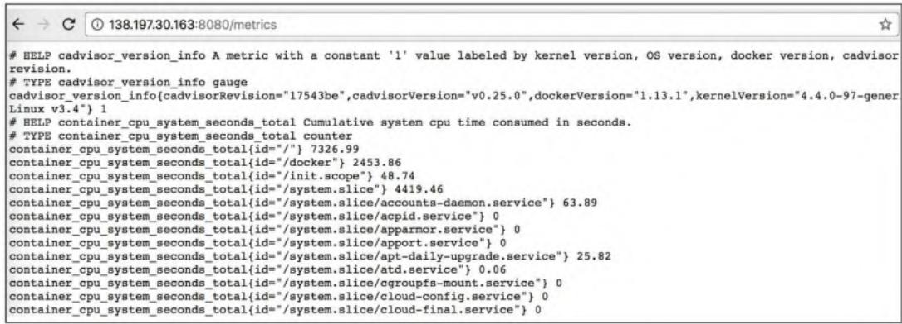
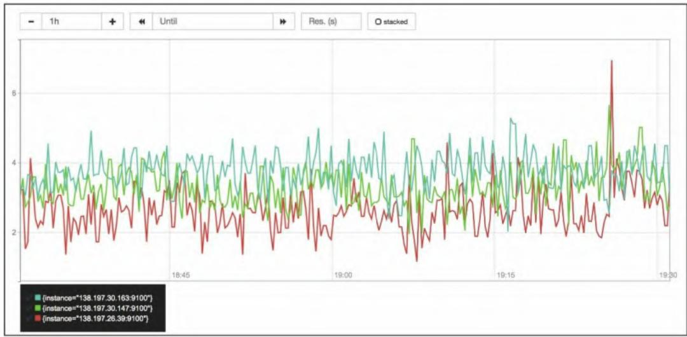
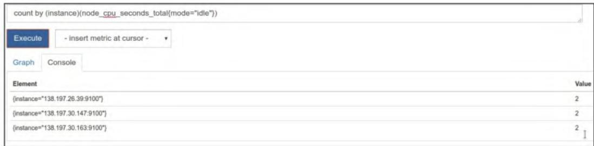
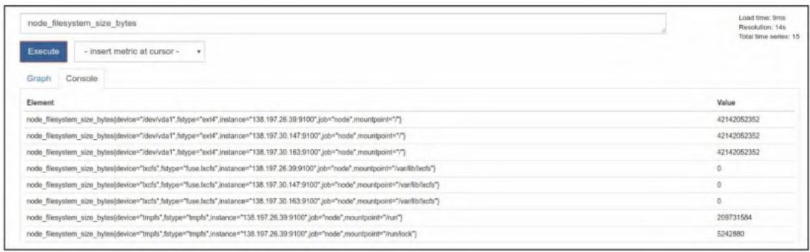

# Prometheus 监控实战系列 04：主机与容器监控实战：指标采集、规则配置与可视化搭建

在上一篇内容中，我们完成了Prometheus的基础安装与配置，并实现了对Prometheus自身指标的采集。本文将聚焦**主机（节点）** 和**Docker容器**的监控实战，从exporter部署、指标采集配置、标签管理到核心指标分析，完整覆盖Prometheus监控主机/容器的核心流程，为后续故障诊断和性能分析打下基础。

## 一、监控节点：Node Exporter 部署与配置

Prometheus通过`exporter`暴露主机/应用指标，`Node Exporter`是官方推荐的主机指标采集工具，基于Go语言开发，可收集CPU、内存、磁盘、网络等核心主机指标，同时支持自定义静态指标导出。

### 1.1 安装Node Exporter

Node Exporter支持tar包安装（跨Linux发行版）和系统包管理器安装，推荐tar包方式保证版本一致性。

#### 步骤1：下载并解压

```shell
# 下载对应版本（示例为0.16.0，建议替换为最新版）
wget https://github.com/prometheus/node_exporter/releases/download/v0.16.0/node_exporter-0.16.0-linux-amd64.tar.gz
# 解压
tar -xzf node_exporter-*
# 移动二进制文件到系统PATH目录
sudo cp node_exporter-*/node_exporter /usr/local/bin/
```

#### 步骤2：验证安装

```shell
node_exporter --version
# 输出示例：node_exporter, version 0.16.0 (branch: HEAD, revision: 6e2053c557f96efb63aef3691f15335a70baaffd)
```

### 1.2 配置Node Exporter

Node Exporter通过命令行参数配置，核心配置包括**端口/路径**、**收集器开关**、**自定义指标目录**三类。

#### （1）基础端口/路径配置

默认情况下，Node Exporter监听9100端口，在`/metrics`路径暴露指标，可通过参数自定义：

```shell
# 自定义端口9600，指标路径/node.metrics
node_exporter --web.listen-address=:9600 --web.telemetry-path="/node.metrics"
```

#### （2）收集器控制

Node Exporter内置多个收集器（如arp、cpu、meminfo），默认大部分启用，可通过`--no-collector.xxx`禁用指定收集器：

```shell
# 禁用arp收集器
node_exporter --no-collector.arp
```

#### （3）textfile收集器（自定义静态指标）

textfile收集器支持导出自定义静态指标（如主机角色、机房信息），适用于无专属exporter的场景，核心步骤：

1. 创建指标目录：

   ```shell
   mkdir -p /var/lib/node_exporter/textfile_collector
   ```

2. 写入自定义指标（Prometheus文本格式）：

   ```shell
   # 示例：添加主机角色、机房标签
   echo 'metadata{role="docker_server", datacenter="NJ"} 1' | sudo tee /var/lib/node_exporter/textfile_collector/metadata.prom
   ```

3. 启动时指定目录：

   ```shell
   node_exporter --collector.textfile_directory=/var/lib/node_exporter/textfile_collector
   ```

#### （4）systemd收集器（监控指定服务）

启用systemd收集器可监控systemd管理的服务状态，通过白名单过滤仅关注核心服务（如docker、ssh）：

```shell
node_exporter --collector.systemd --collector.systemd.unit-whitelist="(docker|ssh|rsyslog).service"
```

### 1.3 启动Node Exporter（多节点部署）

以启用textfile和systemd收集器为例，启动命令：

```shell
node_exporter \
--collector.textfile_directory=/var/lib/node_exporter/textfile_collector \
--collector.systemd \
--collector.systemd.unit-whitelist="(docker|ssh|rsyslog).service"
```

需在所有待监控主机（示例为3台Docker节点：138.197.26.39、138.197.30.147、138.197.30.163）执行上述配置。

### 1.4 配置Prometheus抓取Node Exporter指标

编辑Prometheus配置文件`prometheus.yml`，添加`node`作业，静态指定待抓取的Node Exporter节点：

```yaml
scrape_configs:
  # 原有Prometheus自身监控作业
  - job_name: 'prometheus'
    static_configs:
      - targets: ['localhost:9090']
  # 新增Node Exporter监控作业
  - job_name: 'node'
    static_configs:
      - targets: ['138.197.26.39:9100', '138.197.30.147:9100', '138.197.30.163:9100']
```

#### 可选：过滤抓取的收集器

若无需采集所有指标，可通过`params`限制仅抓取指定收集器（如cpu、meminfo）：

```yaml
- job_name: 'node'
  static_configs:
    - targets: ['138.197.26.39:9100', '138.197.30.147:9100', '138.197.30.163:9100']
  params:
    collect[]:
      - cpu
      - meminfo
      - diskstats
      - netdev
      - systemd
```

配置完成后，重启Prometheus或发送`SIGHUP`信号重载配置，即可开始采集节点指标。

## 二、监控Docker容器：cAdvisor 部署与配置

监控Docker容器推荐使用Google的`cAdvisor`（容器顾问），它以容器形式运行，可收集Docker守护进程及所有运行中容器的资源使用指标，原生支持Prometheus格式导出。

### 2.1 运行cAdvisor

通过`docker run`启动cAdvisor，需挂载主机核心目录以获取容器/系统信息：

```shell
docker run \
--volume=/:/rootfs:ro \
--volume=/var/run:/var/run:rw \
--volume=/sys:/sys:ro \
--volume=/var/lib/docker:/var/lib/docker:ro \
--volume=/dev/disk:/dev/disk:ro \
--publish=8080:8080 \
--detach=true \
--name=cadvisor \
google/cadvisor:latest
```

参数说明：

- `ro`：只读挂载（如`/sys`、`/rootfs`），仅用于采集数据；
- `rw`：读写挂载（如`/var/run`），用于访问Docker套接字；
- `--publish=8080:8080`：映射容器8080端口到主机，用于访问cAdvisor Web界面和指标。

#### 验证运行状态

```shell
# 查看容器状态
docker ps | grep cadvisor
# 输出示例：6fca3002e351 google/cadvisor "/usr/bin/..." Up 1 hours 0.0.0.0:8080->8080/tcp cadvisor

# 访问Web界面验证（浏览器打开）
http://<主机IP>:8080
```

#### 验证指标暴露

访问`http://<主机IP>:8080/metrics`，可看到Prometheus格式的容器指标：


需在所有3台Docker节点部署cAdvisor。

### 2.2 配置Prometheus抓取cAdvisor指标

编辑`prometheus.yml`，添加`docker`作业，指定cAdvisor节点（默认端口8080）：

```yaml
scrape_configs:
  - job_name: 'prometheus'
    static_configs:
      - targets: ['localhost:9090']
  - job_name: 'node'
    static_configs:
      - targets: ['138.197.26.39:9100', '138.197.30.147:9100', '138.197.30.163:9100']
  # 新增Docker容器监控作业
  - job_name: 'docker'
    static_configs:
      - targets: ['138.197.26.39:8080', '138.197.30.147:8080', '138.197.30.163:8080']
```

重载Prometheus配置后，即可采集容器指标。

## 三、Prometheus 抓取生命周期与标签管理

### 3.1 抓取生命周期

Prometheus的指标抓取分为4个核心阶段，决定了指标从“发现目标”到“存储入库”的完整流程：

1. **服务发现**：生成目标列表，附带`__meta_`前缀的元数据标签（如机房、实例类型）；
2. **配置覆盖**：覆盖默认标签（如`__scheme__`、`__metrics_path__`）；
3. **目标重标记（relabel_configs）**：抓取前过滤/修改目标（如基于元数据添加标签）；
4. **指标重标记（metric_relabel_configs）**：抓取后过滤/修改指标（如删除无用指标、替换标签值）。

### 3.2 标签分类：规范标签设计

标签是Prometheus时间序列的核心维度，不合理的标签会导致时间序列膨胀、监控混乱，建议按以下分类设计：

- **拓扑标签**：按物理/逻辑属性划分（如`job`、`instance`、`datacenter`），`job`表示监控类型，`instance`表示目标地址；
- **模式标签**：按业务属性划分（如`url`、`error_code`、`user`），用于聚合/匹配同层级时间序列。

### 3.3 重新标记：管控指标入库

重标记是Prometheus管控指标的核心能力，分为“删除指标”“替换标签值”“删除标签”三类常见场景。

#### （1）删除无用指标

通过`metric_relabel_configs`删除cAdvisor的冗余指标（如`container_tasks_state`）：

```yaml
- job_name: 'docker'
  static_configs:
    - targets: ['138.197.26.39:8080', '138.197.30.147:8080', '138.197.30.163:8080']
  metric_relabel_configs:
    - source_labels: [__name__]
      regex: '(container_tasks_state|container_memory_failures_total)'
      action: drop
```

#### （2）替换标签值

提取cAdvisor`id`标签中的容器ID，存入新标签`container_id`：

```yaml
metric_relabel_configs:
  - source_labels: [id]
    regex: '/docker/([a-z0-9]+)'
    replacement: '$1'
    target_label: container_id
```

#### （3）删除敏感标签

删除`kernelVersion`标签（隐藏主机内核版本）：

```yaml
metric_relabel_configs:
  - regex: 'kernelVersion'
    action: labeldrop
```

#### 关键参数：honor_labels

默认`honor_labels: false`，若抓取的指标包含`job`/`instance`等内置标签，Prometheus会添加`exported_`前缀（如`exported_job`）；若设置为`true`，则保留原标签，忽略Prometheus的重标记规则。

## 四、基于USE方法分析核心指标

USE方法（使用率Utilization、饱和度Saturation、错误Errors）是性能诊断的经典框架，结合Node Exporter指标可快速分析主机核心资源状态。

### 4.1 CPU监控

#### （1）CPU使用率（Utilization）

基于`node_cpu_seconds_total`（CPU各模式耗时）计算CPU使用率百分比：

```promql
# 5分钟内平均CPU使用率（排除idle）
100 - avg(irate(node_cpu_seconds_total{job="node", mode="idle"}[5m])) by (instance) * 100
```

**图4-7 每台主机平均CPU使用率指标**  


**图4-8 每台主机CPU使用率指标图示**  


#### （2）CPU饱和度（Saturation）

通过“1分钟平均负载”和“CPU核数”判断饱和度，负载超过CPU核数2倍需关注：

```promql
# 计算每台主机CPU核数
count by (instance)(node_cpu_seconds_total{mode="idle"})

# 筛选负载超过CPU核数2倍的主机
node_load1 > on (instance) 2 * count by (instance)(node_cpu_seconds_total{mode="idle"})
```

### 4.2 内存监控（使用率）

基于`node_memory_*`指标计算内存使用率百分比：

```promql
# 内存使用率 = (总内存 - 空闲/缓存/缓冲) / 总内存 * 100
(node_memory_MemTotal_bytes - (node_memory_MemFree_bytes + node_memory_Cached_bytes + node_memory_Buffers_bytes)) / node_memory_MemTotal_bytes * 100
```

**图4-11 每台主机的内存使用率**  


## 五、可视化：Grafana 对接 Prometheus

Prometheus自带的Web界面仅用于临时查询，生产环境建议使用Grafana实现可视化：

1. 添加Prometheus数据源：Grafana → Configuration → Data Sources → Add data source → 选择Prometheus，填写地址（如`http://localhost:9090`）；
2. 导入预制仪表盘：
   - Node Exporter仪表盘：推荐ID `1860`（Node Exporter Full）；
   - cAdvisor仪表盘：推荐ID `893`（cAdvisor Docker监控）；
3. 自定义面板：基于上文的PromQL查询，创建CPU/内存/容器的专属监控面板。

## 六、总结

本文完整覆盖了Prometheus监控主机（Node Exporter）和容器（cAdvisor）的核心流程：

1. 部署Node Exporter采集主机指标，支持自定义静态指标和服务状态监控；
2. 部署cAdvisor采集容器指标，轻量化且原生适配Prometheus；
3. 掌握抓取生命周期和标签管理，通过重标记管控指标入库；
4. 基于USE方法分析CPU/内存核心指标，快速定位性能问题；
5. 对接Grafana实现指标可视化，提升监控可读性。
