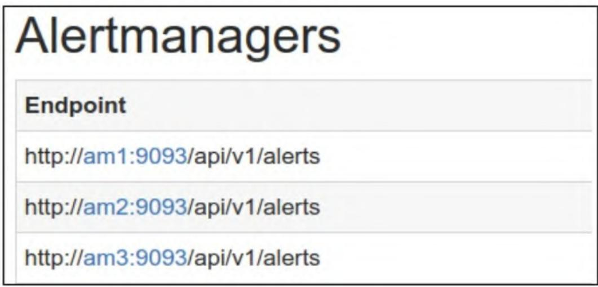

# Prometheus 监控实战系列 07：生产级架构设计：高可用、水平扩展与远程存储方案落地

在Prometheus基础使用阶段，单服务器+单Alertmanager的部署模式能满足小规模监控需求，但生产环境中该模式存在两大核心问题：一是可靠性不足，Prometheus/Alertmanager单点故障会导致监控或告警完全失效；二是扩展性受限，单节点无法承载海量监控目标的指标采集压力。本文从高可用容错、可扩展性设计、远程存储集成三个维度，详解Prometheus生产级架构的落地方案。

## 一、可靠性与容错性：保障监控不中断

Prometheus未采用复杂的集群方案解决容错问题，而是通过「双活Prometheus + Alertmanager集群」的轻量架构，在兼顾运维复杂度的前提下实现高可用。

### 1.1 核心思路：双活Prometheus服务器

Prometheus认为，构建复杂集群的投入远高于监控数据本身的价值，因此推荐**并行运行两台配置完全相同的Prometheus服务器**（双活模式）：

- 两台服务器同时采集指标，产生的重复告警由上游Alertmanager通过分组/抑制功能自动去重；
- 若其中一台故障，另一台可继续提供监控能力，仅存在少量数据缺失（可通过PromQL补充，如用`max`聚合多实例指标）；
- 双活部署可通过Ansible等配置管理工具自动化实现，复用基础安装步骤即可。

### 1.2 关键落地：Alertmanager集群搭建

Alertmanager的集群能力基于HashiCorp Memberlist库（SWIM协议扩展）实现，核心是多节点组成集群，共享告警状态并自动去重。

#### 步骤1：基础准备

在多台主机（示例为am1、am2、am3）上安装相同版本的Alertmanager，并确保所有节点使用**完全一致的配置文件**（alertmanager.yml）——配置不一致会导致集群高可用失效。

#### 步骤2：启动集群主节点（am1）

指定集群监听地址和端口（默认0.0.0.0:9094）：

```txt
am1$ alertmanager --config.file alertmanager.yml --cluster.listen-address 172.19.0.10:8001
```

#### 步骤3：启动集群从节点（am2/am3）

通过`--cluster.peer`指定主节点地址，加入集群：

```txt
am2$ alertmanager --config.file alertmanager.yml --cluster.listen-address 172.19.0.20:8001 --cluster.peer 172.19.0.10:8001
am3$ alertmanager --config.file alertmanager.yml --cluster.listen-address 172.19.0.30:8001 --cluster.peer 172.19.0.10:8001
```

#### 步骤4：验证集群状态

访问任意Alertmanager节点的`/status`页面（如`https://172.19.0.10:9093/status`），可查看集群所有节点；也可在am1创建silence规则，验证是否同步到am2/am3的`/silences`路径。

**图7-2 Alertmanager集群状态**

  

### 1.3 Prometheus对接Alertmanager集群

Prometheus需配置所有Alertmanager节点地址，确保单个Alertmanager故障时，告警仍能发送到其他节点（无需额外负载均衡，Prometheus会自动处理）。

#### 方式1：静态配置

在prometheus.yml中直接指定所有节点：

```yaml
alerting:
  alertmanagers:
  - static_configs:
    - targets:
      - am1:9093
      - am2:9093
      - am3:9093
```

#### 方式2：DNS服务发现（推荐）

1. 添加DNSSRV记录：

```txt
alertmanager._tcp.example.com. 300 IN SRV 10 1 9093 am1.example.com.
alertmanager._tcp.example.com. 300 IN SRV 10 1 9093 am2.example.com.
alertmanager._tcp.example.com. 300 IN SRV 10 1 9093 am3.example.com.
```

1. Prometheus配置DNS发现：

```yaml
alerting:
  alertmanagers:
  - dns_sdconfigs:
    - names: ['_alertmanager._tcp.example.com']
```

验证：重启Prometheus后，在状态页面可查看所有连接的Alertmanager节点。

## 二、可扩展性设计：支撑海量监控目标

当监控目标规模扩大时，需通过「功能扩展」或「水平分片」拆分采集压力，核心思路是「分片采集、按需聚合」。

### 2.1 功能扩展：按维度垂直分片

将监控目标按**地理位置、逻辑域、功能模块**拆分到不同Prometheus服务器：

- 示例：基础设施指标（服务器/网络）由一台Prometheus采集，应用指标由另一台采集；
- 优势：配置简单，可通过配置管理工具自动化部署；
- 全局视图：可通过Prometheus联邦（federation）将分片数据聚合到中心节点，或在Grafana中直接对接多Prometheus数据源。

### 2.2 水平分片：大规模场景的分布式采集

当单个作业包含数千个实例时（如海量服务器的node_exporter），需采用「工作节点+主节点」的层级架构：

- 工作节点：按哈希分片采集部分目标的指标，并聚合核心指标；
- 主节点：通过联邦API抓取所有工作节点的聚合指标，提供全局视图。

#### 步骤1：工作节点配置

核心是通过`hashmod`重标记实现目标分片，以worker0为例（prometheus.yml）：

```yaml
global:
  external_labels:
    worker: 0  # 每个工作节点唯一标识（worker1/2同理）
rule_files:
  - "rules/node/rules.yml"  # 聚合规则文件
scrape_configs:
  - job_name: 'node'
    file_sd_configs:
      - files:
        - targets/nodes/*.json
        refresh_interval: 5m
    relabel_configs:
      # 基于目标地址哈希，按3个工作节点分片
      - source_labels: [__address__]
        modulus: 3
        target_label: __tmp_hash
        action: hashmod
      # 仅保留哈希值为0的目标（worker0）
      - source_labels: [__tmp_hash]
        regex: ^0$
        action: keep
```

聚合规则示例（rules/node/rules.yml）：

```yaml
groups:
- name: node_rule
  rules:
  - record: instance:node_cpu:avg_rate5m
    expr: 100 - avg(irate(node_cpu_seconds_total{job="node", mode="idle"}[5m])) by (instance) * 100
```

#### 步骤2：主节点配置

抓取所有工作节点的聚合指标（prometheus.yml）：

```yaml
scrape_configs:
  - job_name: 'node_workers'
    file_sd_configs:
      - files:
        - 'targets/workers/*.json'
        refresh_interval: 5m
    honor_labels: true  # 保留工作节点的标签，避免覆盖
    metrics_path: /federate  # 使用联邦API
    params:
      'match[]':
        - '{__name__=~"^instance:.*"}'  # 匹配所有instance:前缀的聚合指标
```

工作节点的文件服务发现配置（targets/workers/*.json）：

```json
{
  "targets": ["worker0:9090", "worker1:9090", "worker2:9090"]
}
```

#### 注意事项

- 水平分片是「最后选择」，仅当目标数达数万个或时间序列海量时使用；
- 主节点仅抓取聚合指标，原始指标需到对应工作节点查询；
- 告警建议在工作节点触发（减少延迟），主节点仅用于全局聚合视图；
- 需注意主节点抓取工作节点的负载，以及数据延迟/一致性问题。

## 三、远程存储：突破Prometheus存储上限

Prometheus本地存储存在容量和保留期限制，通过远程存储可将指标写入外部系统，解决扩展性问题。

### 3.1 核心能力

Prometheus支持两种远程存储集成：

- 远程写入：将指标样本推送到外部存储；
- 远程读取：从外部存储拉取指标样本。

### 3.2 集成方式

基于HTTP的Snappy压缩协议缓冲编码，通过`remote_write`/`remote_read`配置块实现，支持的存储系统包括：

- Chronix、CrateDB、Graphite、InfluxDB、OpenTSDB、PostgreSQL等；
- 具体配置可参考Prometheus官方文档，集成步骤简单且标准化。

## 四、第三方扩展工具

针对大规模场景，可借助成熟的第三方工具简化Prometheus扩展：

- **Cortex**：可扩展的Prometheus即服务工具，提供多租户、水平扩展能力；
- **Thanos**：为Prometheus提供长期存储和高可用能力；
- **Vulcan**：已暂停维护，但设计思路可作为扩展参考。

## 五、小结

生产级Prometheus架构的核心是「轻量高可用+按需扩展」：

1. 高可用：通过双活Prometheus+Alertmanager集群，保障监控和告警不中断；
2. 可扩展性：小规模用功能分片，大规模用水平分片+联邦聚合；
3. 存储扩展：通过远程存储突破本地存储限制，结合第三方工具可进一步简化大规模部署。
