本文聚焦Docker容器监控场景，从Docker架构底层逻辑出发，系统讲解原生监控方法与cAdvisor全维度监控方案，涵盖部署、指标采集、第三方集成全流程，学完可独立落地容器监控可视化体系。

【本篇核心收获】

- 吃透Docker容器架构核心逻辑，掌握docker stats、Remote API、cgroup伪文件系统三类原生监控方法
- 深度理解cAdvisor架构设计与核心功能，能独立完成二进制/容器化部署及关键参数配置
- 熟练获取cAdvisor监控输出，解读CPU、内存、网络、文件系统等核心监控指标含义
- 掌握cAdvisor与Prometheus、Grafana的集成方法，实现容器监控数据可视化
- 了解cAdvisor与InfluxDB、Heapster等存储的搭配方案，适配不同监控场景需求

## 1. Docker容器架构与监控

Docker自2013年发展至今已形成完整生态体系，先理解容器底层架构，再掌握对应的监控方法，是落地容器监控的核心前提。

### 1.1 Docker容器架构

Docker采用经典的Client-Server架构模式，整体架构如下：

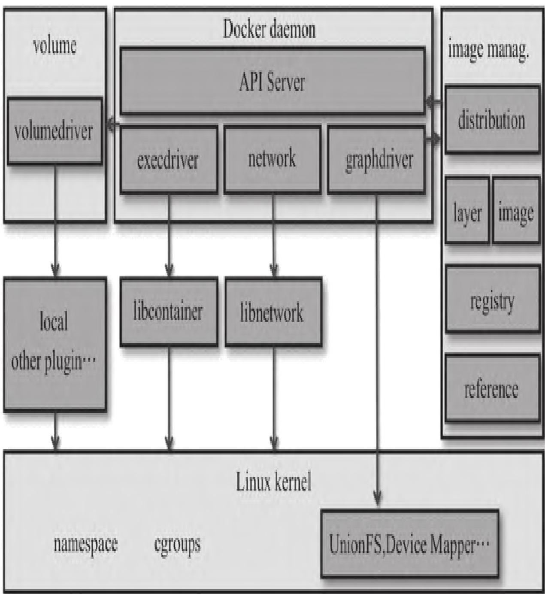

Docker通过**driver模块**实现容器执行环境的创建与管理，核心模块分工如下：

- 镜像管理：通过distribution、registry下载镜像，image、reference、layer存储元数据，graphdriver管理镜像文件存储
- 网络管理：network模块调用libnetwork配置容器网络环境
- 数据卷管理：volume模块调用volumedriver创建并挂载数据卷
- 资源管理：execdriver通过libcontainer实现容器资源限制与指令执行

**libcontainer**是对cgroups和namespace的二次封装，核心作用：

- 利用UTS、IPC、PID、Network、Mount、User等namespace实现容器资源隔离
- 利用cgroups实现容器资源限制
- Docker 1.9+版本中，volume和network生命周期独立于容器，可单独管理后配置给容器

> 模块小结：Docker架构核心是Client-Server模式，通过driver+libcontainer（cgroups+namespace）实现容器的资源隔离与限制，是理解容器监控指标来源的基础。

### 1.2 Docker容器监控方式

Docker原生提供三类核心监控方式，覆盖从命令行快速查看、API集成到底层文件读取的全场景。

#### 1.2.1 docker stats

`docker stats`是最常用的容器资源实时监控命令，默认流式输出，核心使用规则如下：

- 关键参数：`--no-stream=true` 打印最新数据后立即退出
- 适用范围：可指定已停止容器，但停止容器无数据返回
- 监控维度：CPU、内存、内存使用率、网络I/O、块设备I/O

示例输出：

```txt
[root@node1 ~]# docker stats
CONTAINER           CPU %   MEM USAGE / LIMIT     MEM%   NET I/O           BLOCK I/O
3de522e51585        0.00%   0 B / 0 B             0.00%  0B / 0B           0B / 0B
4af8514949fe        0.00%   1.47 MB / 3.96 GB    0.04%  1.316kB/648B      1.188MB/0B
```

#### 1.2.2 Docker Remote API

Docker Remote API是替代远程命令行的REST API，核心特点：

- 基础用法：`curl http://127.0.0.1:4243/containers/json` 获取容器列表
- 适用场景：集成到第三方监控系统，批量获取容器监控数据
- 避坑指南：高频采集会给Docker daemon带来性能负担，多容器主机需控制采集频率

#### 1.2.3 伪文件系统（cgroup）

`docker stats`的底层数据来源是`/sys/fs/cgroup`伪文件系统（以CentOS7 + Docker 17.03为例），核心指标对应关系：

- 内存使用量：`/sys/fs/cgroup/memory/docker/[containerId]/memory.usage_in_bytes`
- 内存限制：无限制时为主机总内存，有限制时来自`/sys/fs/cgroup/memory/docker/[id]/memory.limit_in_bytes`
- 内存使用率：`memory.usage_in_bytes / memory.limit_in_bytes`

cgroup核心目录及功能：

| 目录 | 说明 |
| :--- | :--- |
| `devices` | 设备权限控制 |
| `cpuset` | 分配指定的CPU和内存节点 |
| `cpu` | 控制CPU占用率 |
| `cpuacct` | 统计CPU使用情况 |
| `memory` | 限制内存的使用上限 |
| `freezer` | 冻结（暂停）cgroup中的进程 |
| `net_cls` | 配合tc（traffic controller）限制网络带宽 |
| `net_prio` | 设置进程的网络流量优先级 |
| `huge_tlb` | 限制HugeTLB的使用 |
| `perf_event` | 允许Perf工具基于cgroup分组做性能监测 |

memory目录核心指标：

| 指标 | 说明 |
| :--- | :--- |
| `memory.usage_in_bytes` | 已使用的内存量（包含cache和buffer），相当于used_mem |
| `memory.limit_in_bytes` | 限制的内存总量（字节），相当于Linux的total_mem |
| `memory.failcnt` | 申请内存失败次数计数 |
| `memory.memsw.usage_in_bytes` | 已使用的内存和swap容量（字节） |
| `memory.memsw.limit_in_bytes` | 限制的内存和swap容量（字节） |
| `memory.memsw.failcnt` | 申请内存和swap失效次数计数 |
| `memory.stat` | 内存相关状态，详细说明见下表 |

memory.stat细分指标：

| 指标项 | 说明 |
| :--- | :--- |
| `cache` | 页缓存，包括 tmpfs (shmem)，单位为字节 |
| `rss` | 匿名和 swap 缓存，不包括 tmpfs (shmem)，单位为字节 |
| `mapped_file` | 内存映射的文件大小，包括 tmpfs (shmem)，单位为字节 |
| `pgpgin` | 存入内存中的页数 |
| `pgpgout` | 从内存中读出的页数 |
| `swap` | swap 使用量，单位为字节 |
| `active_anon` | 在活跃的最近最少使用（LRU）队列中的匿名和 swap 缓存，包括 tmpfs (shmem)，单位为字节 |
| `inactive_anon` | 在不活跃的LRU队列中的匿名和 swap 缓存，包括 tmpfs (shmem)，单位为字节 |
| `active_file` | 活跃 LRU 队列中的 file-backed 内存，单位为字节 |
| `inactive_file` | 不活跃 LRU 队列中的 file-backed 内存，单位为字节 |
| `unevictable` | 无法再生的内存，单位为字节 |
| `hierarchical_memory_limit` | 包含 memorygroup 的层级的内存限制，单位为字节 |
| `hierarchical_memsw_limit` | 包含 memorygroup 的层级的内存加 swap 限制，单位为字节 |

容器集群监控核心维度（如图2所示）：

- 容器本身：CPU、内存、网络、磁盘
- 物理机：CPU、内存、网络、磁盘
- 镜像信息：名字、大小、版本

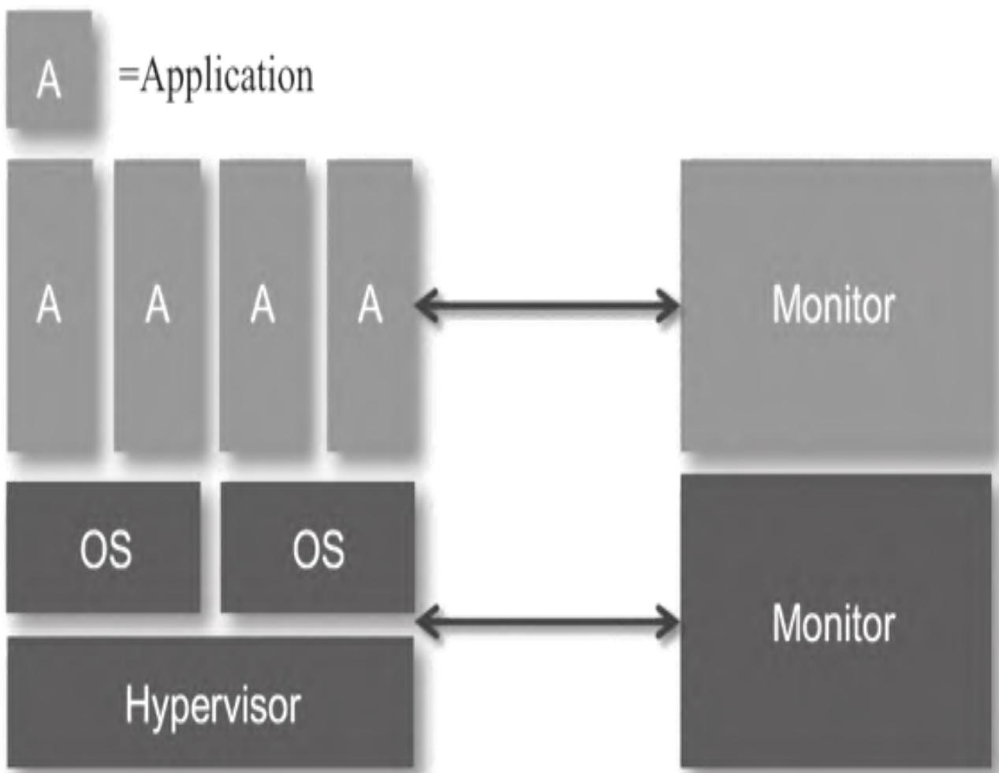

主流容器监控工具对比：

| 工具 | 核心优势 | 核心劣势 |
| :--- | :--- | :--- |
| DockerStats | 原生内置、操作简单、支持API | 无图形界面、仅基础指标 |
| cAdvisor | 可视化界面、支持宿主机/容器双维度、Prometheus兼容 | 仅支持单主机、无长期存储 |
| Scout | 多主机聚合、支持告警 | 收费、无容器详细信息 |
| Data Dog | 功能全面、支持集群聚合 | 使用成本高 |
| Sensu | 可定制化程度高 | 部署复杂 |

> 模块小结：Docker原生监控覆盖命令行、API、底层文件三类方式，是容器监控的基础；cAdvisor作为Google开源工具，是单主机容器监控的最优选择，下文重点讲解其部署与使用。

## 2. cAdvisor架构及分析

cAdvisor是Google开源的容器监控工具，仅需在宿主机部署即可采集容器/主机的CPU、内存、网络、磁盘等全维度指标，核心能力包括：

- 采集容器基础指标、进程信息、运行状态
- 支持监控数据推送至第三方存储
- 内置Prometheus指标输出、支持自定义指标采集
- Collector/Storage模块可扩展，适配更多采集/存储场景

### 2.1 cAdvisor核心架构

cAdvisor的整体架构如图3所示，核心模块分工明确：

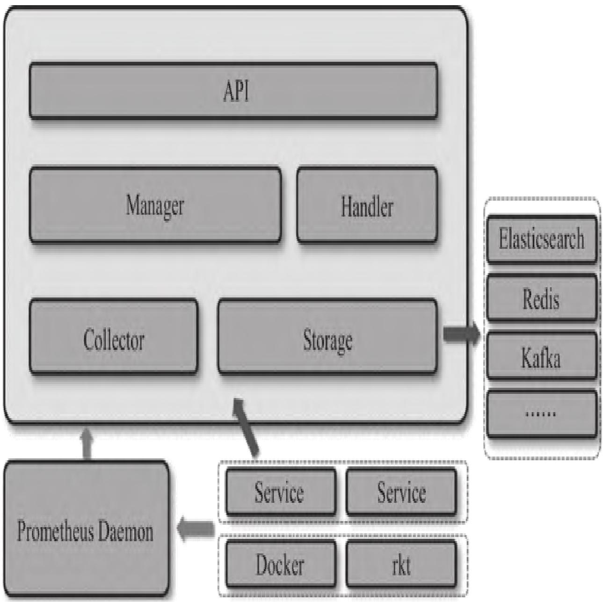

- **API层**：提供节点/容器状态、自定义指标、spec信息、进程列表等查询接口
- **Handler**：内置rkt/Docker适配器，提供容器spec和Storage栈信息，供Manager调用
- **Manager**：核心总控模块，实例化Storage、周期检测容器增删、调用Handler获取容器列表
- **Collector**：内置Prometheus指标采集器和自定义指标采集器，负责数据采集

> 模块小结：cAdvisor通过分层架构实现容器指标的采集、处理与输出，核心优势是轻量化、易部署、原生支持Prometheus，是容器监控的核心组件。

## 3. 部署cAdvisor容器监控

cAdvisor支持二进制、Docker容器、Kubernetes三种部署方式，是解决Docker stats无存储/可视化问题的核心方案，且默认集成在Kubernetes的Kubelet中。

### 3.1 二进制部署

步骤1：下载最新版本（以v0.32.0为例）

```bash
wget https://github.com/google/cadvisor/releases/download/v0.32.0/cadvisor
```

步骤2：赋予执行权限并启动

```bash
chmod +x cadvisor
./cadvisor -port=8080 &> /var/log/cadvisor.log
```

### 3.2 Docker容器部署

步骤1：拉取镜像（解决Docker Hub下载慢问题，可提前同步至本地仓库）

```bash
root@controller:~# docker pull google/cadvisor:latest
latest: Pulling from google/cadvisor
552b69c7399e: Pull complete
a3ed95caeb02: Pull complete
fd2c5cdc47b1: Pull complete
e1d2af7223fb: Pull complete
Digest: sha256:23da68ea2fd51d990e5b68c5886a9de43f1d030aa9c3fb36e9c50d2784a6a21a
Status: Downloaded newer image for google/cadvisor:latest
```

步骤2：启动容器（核心挂载目录不可省略）

```bash
root@controller:~# docker run \
  --volume=/:/rootfs:ro \
  --volume=/var/run:/var/run:rw \
  --volume=/sys:/sys:ro \
  --volume=/var/lib/docker/:/var/lib/docker:ro \
  --publish=8080:8080 \
  --detach=true \
  --name=cadvisor \
  google/cadvisor:latest
```

步骤3：验证运行状态

```bash
root@controller:~# docker ps -a
CONTAINER ID   IMAGE                      COMMAND                  CREATED         STATUS         PORTS                    NAMES
953fa954d08f   google/cadvisor:latest     "/usr/bin/cadvisor -l"   About a minute ago   Up About a minute   0.0.0.0:8080->8080/tcp   cadvisor
```

#### 关键参数说明（避坑指南）

- 4个`--volume`挂载是核心：缺失会导致无法连接Docker daemon，`ro`表示只读挂载
- `--detach`：后台运行，避免进入容器交互界面
- 红帽系系统（CentOS/RHEL/Fedora）需加：`--privileged=true`（SELinux安全策略要求）
- `--storage_duration`：内存数据保存时长，默认2分钟
- `--allow_dynamic_housekeeping`：根据容器活跃度动态调整采集间隔
- `--global_housekeeping_interval`：检测新增容器的周期
- `--housekeeping_interval`：容器数据统计周期，默认1秒/次，保留最近60条

#### 启动验证

访问`http://主机IP:8080`可打开cAdvisor Web界面，访问`http://主机IP:8080/metrics`可查看Prometheus格式指标。

### 3.3 Kubernetes中部署

步骤1：通过文件发现配置Prometheus节点

```bash
kubectl create -f prometheus-file-sd.yaml
```

步骤2：通过Kustomize管理配置文件（推荐）
详细配置参考cAdvisor官网：<https://github.com/google/cadvisor/tree/master/deploy/kubernetes>

> 模块小结：cAdvisor部署核心是保证挂载目录完整，不同系统需注意特权参数配置；启动后可通过8080端口验证Web界面和指标输出，是后续集成Prometheus的基础。

## 4. cAdvisor监控输出

cAdvisor提供Web界面（/containers）和Prometheus指标（/metrics）两种输出方式，覆盖可视化查看和自动化采集场景。

### 4.1 /containers Web界面输出

访问`http://主机IP:8080/containers`可查看cAdvisor内置监控界面（如图4所示）：

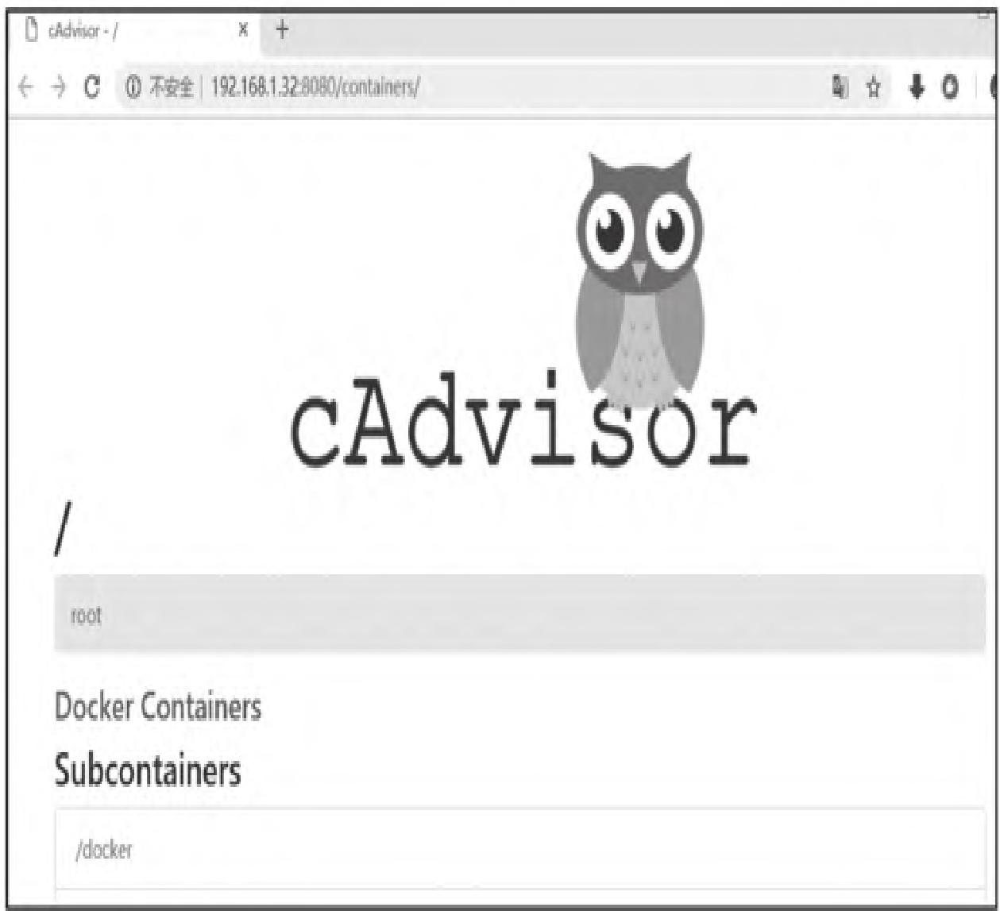

监控维度包括：

- 宿主机：CPU、内存、网络、文件系统、进程数
- 容器：CPU、内存、网络、文件系统、进程、镜像信息（如图5所示）

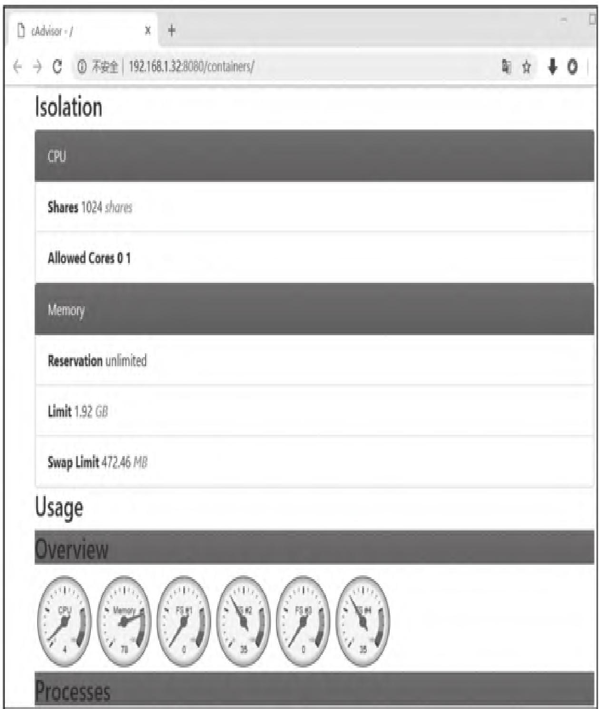

### 4.2 /metrics Prometheus指标输出

访问`http://localhost:8080/metrics`可获取标准Prometheus格式指标，示例如下：

```txt
# HELP cadvisor_version_info A metric with a constant '1' value labeled by kernel version, OS version, docker version, cadvisor version & cadvisor revision.
# TYPE cadvisor_version_info gauge
cadvisor_version_info{cadvisorRevision="1e567c2",cadvisorVersion="v0.28.3", dockerVersion="17.09.1-ce",kernelVersion="4.9.49-moby",osVersion="Alpine Linux v3.4"} 1
# HELP container_cpu_load_average_10s Value of container cpu load average over the last 10 seconds.
# TYPE container_cpu_load_average_10s gauge
container_cpu_load_average_10s{container_label_maintainer="",id="/",image="",name=""} 0
container_cpu_load_average_10s{container_label_maintainer="",id="/docker/15535a1e09b3a307b46d90400423d5b262ec84dc55b91ca9e7dd886f4f764ab3",image="busybox",name="lucid_shaw"} 0
```

#### 核心监控指标（必记）

| 指标名称 | 类型 | 含义 |
| :--- | :--- | :--- |
| `container_cpu_load_average_10s` | gauge | 过去10秒容器CPU平均负载 |
| `container_cpu_usage_seconds_total` | counter | 容器在每个CPU内核上的累积占用时间（秒） |
| `container_cpu_system_seconds_total` | counter | System CPU累积占用时间（秒） |
| `container_cpu_user_seconds_total` | counter | User CPU累积占用时间（秒） |
| `container_fs_usage_bytes` | gauge | 容器文件系统使用量（字节） |
| `container_fs_limit_bytes` | gauge | 容器文件系统可用总量（字节） |
| `container_fs_reads_bytes_total` | counter | 容器累积读取数据量（字节） |
| `container_fs_writes_bytes_total` | counter | 容器累积写入数据量（字节） |
| `container_memory_max_usage_bytes` | gauge | 容器最大内存使用量（字节） |
| `container_memory_usage_bytes` | gauge | 容器当前内存使用量（字节） |
| `container_spec_memory_limit_bytes` | gauge | 容器内存限制（字节） |
| `machine_memory_bytes` | gauge | 主机总内存（字节） |
| `container_network_receive_bytes_total` | counter | 容器网络累积接收数据量（字节） |
| `container_network_transmit_bytes_total` | counter | 容器网络累积传输数据量（字节） |

cAdvisor共支持62个Prometheus指标，分5大类：CPU（10个）、内存（9个）、文件（18个）、网络（12个）、容器状态（13个），详细说明参考：<https://github.com/google/cadvisor/blob/master/docs/storage/prometheus.md>

### 4.3 输出到第三方存储

cAdvisor支持通过`-storage_driver`参数将数据输出到第三方存储，支持类型包括：

- BigQuery、ElasticSearch、InfluxDB、Kafka
- Prometheus、Redis、StatsD、stdout

详细配置参考：<https://github.com/google/cadvisor/tree/master/docs/storage>

> 模块小结：cAdvisor的Web界面适合快速查看容器状态，/metrics接口是集成Prometheus的核心；掌握核心指标含义是后续编写PromQL、配置Grafana面板的基础。

## 5. cAdvisor常用搭配方案

cAdvisor本身仅支持单主机短期存储，需结合外部存储/可视化工具形成完整监控体系，主流方案有两种。

### 5.1 cAdvisor+Heapster+InfluxDB组合

该方案适用于Kubernetes集群场景，架构如图6所示：

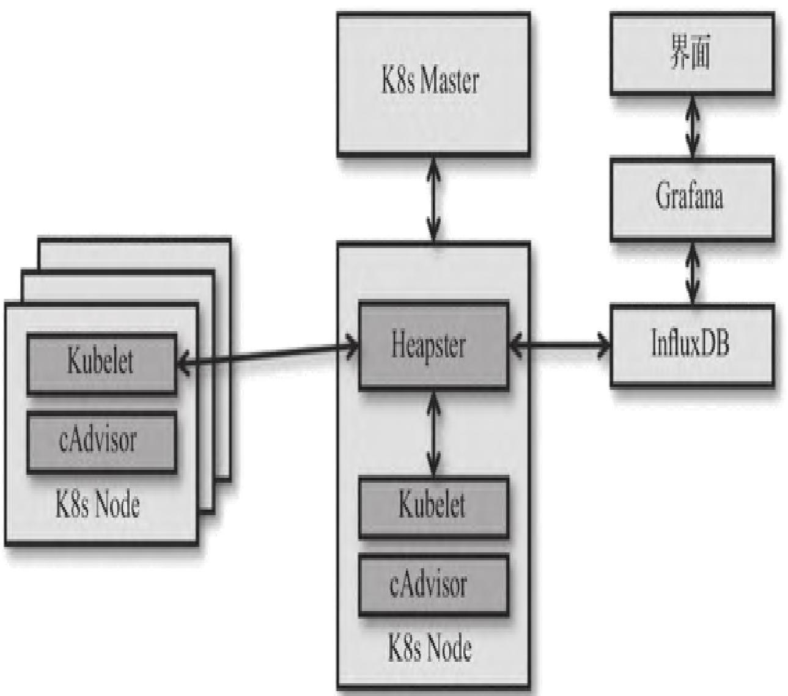

核心逻辑：

- cAdvisor采集每个Node节点和容器的资源数据
- Heapster汇总集群内所有cAdvisor数据
- 数据存入InfluxDB，配合Grafana实现可视化
- 可查看cluster、node、namespace、pod多层级资源使用情况

### 5.2 cAdvisor+Prometheus+Grafana组合

通用型容器监控方案，架构如图7所示：

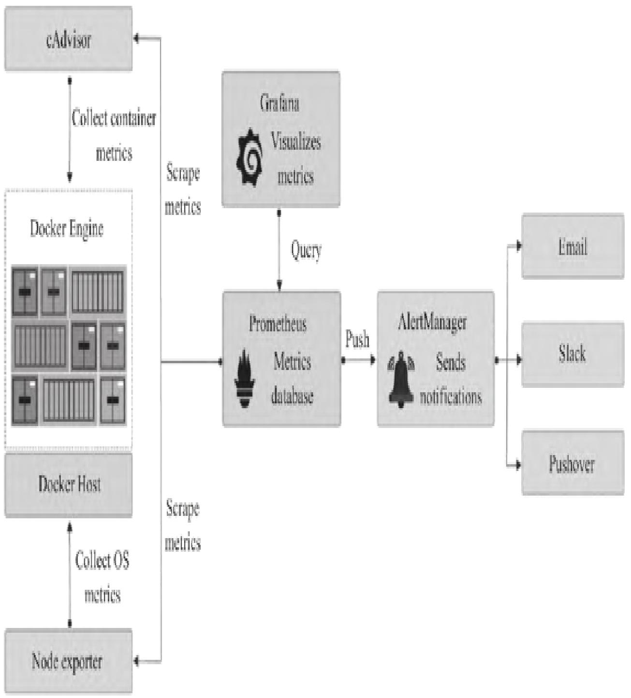

核心逻辑：

- Node Exporter采集物理主机指标
- cAdvisor采集容器指标（通过/metrics接口）
- Prometheus汇总所有指标并长期存储
- AlertManager实现告警，Grafana实现可视化

> 模块小结：两种方案适配不同场景，K8s集群优先选择Heapster组合，通用场景优先Prometheus+Grafana组合，核心是利用cAdvisor的指标采集能力。

## 6. 集成Prometheus

将cAdvisor接入Prometheus是实现容器指标长期存储和分析的核心步骤，配置流程如下：

### 6.1 修改Prometheus配置文件

编辑`/etc/prometheus/prometheus.yml`，添加cAdvisor采集任务：

```yaml
global:
  scrape_interval: 15s
  evaluation_interval: 15s
scrape_configs:
  - job_name: 'cadvisor'
    scrape_interval: 5s  # 容器指标采集频率可提高
    static_configs:
      - targets: ['cadvisor:8080']  # 替换为cAdvisor实际地址
  - job_name: 'grafana'
    scrape_interval: 5s
    static_configs:
      - targets: ['grafana:3000']
```

### 6.2 启动Prometheus服务

```bash
prometheus --config.file=/etc/prometheus/prometheus.yml --storage.tsdb.path=/data/prometheus
```

### 6.3 验证采集状态

步骤1：访问Prometheus UI（默认9090端口），点击Status → Targets（如图8所示）：

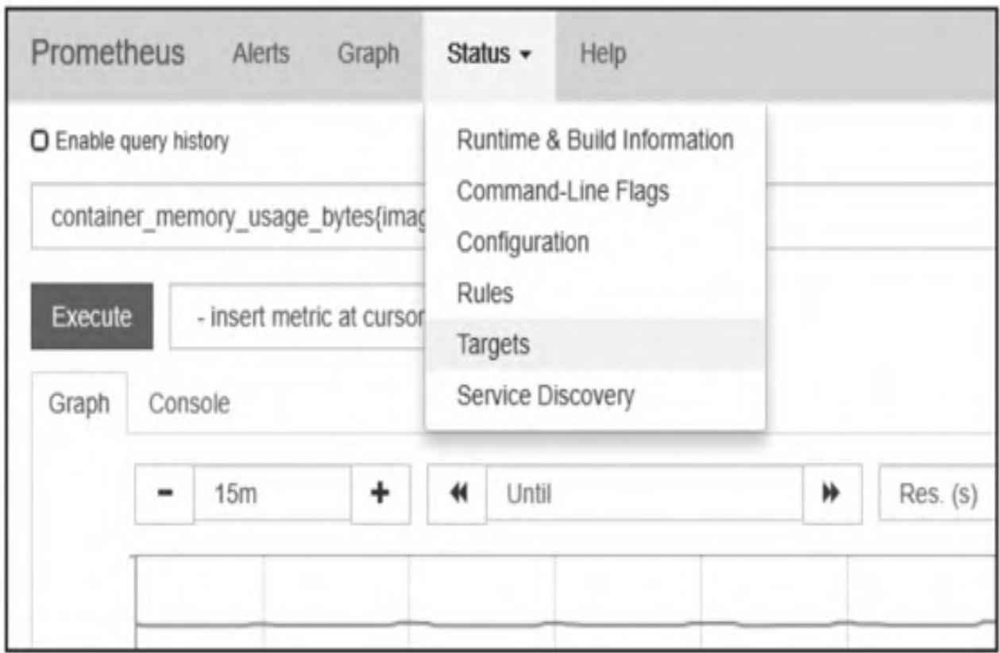

步骤2：查看Target状态，确认cAdvisor采集正常（如图9所示）：

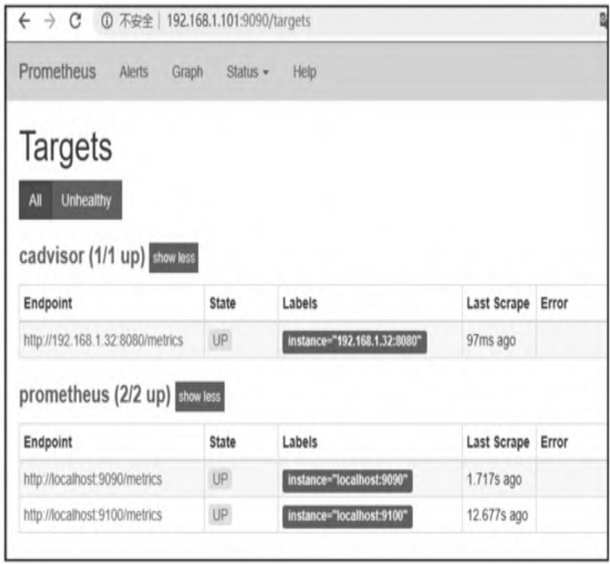

### 6.4 常用PromQL查询

- 容器CPU使用率：

  ```promql
  sum(rate(container_cpu_usage_seconds_total{image!=""}[1m])) without (cpu)
  ```

  效果如图10所示：

  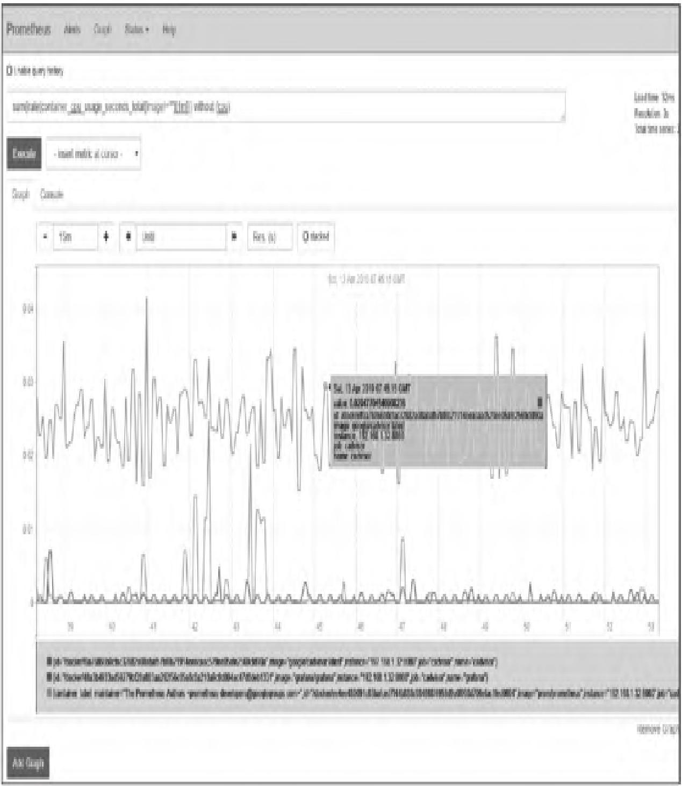

- 容器内存使用量（字节）：

  ```promql
  container_memory_usage_bytes{image!=""}
  ```

- 容器网络接收速率（字节/秒）：

  ```promql
  sum(rate(container_network_receive_bytes_total{image!=""}[1m])) without (interface)
  ```

- 容器网络传输速率（字节/秒）：

  ```promql
  sum(rate(container_network_transmit_bytes_total{image!=""}[1m])) without (interface)
  ```

- 容器文件系统读取速率（字节/秒）：

  ```promql
  sum(rate(container_fs_reads_bytes_total{image!=""}[1m])) without (device)
  ```

- 容器文件系统写入速率（字节/秒）：

  ```promql
  sum(rate(container_fs_writes_bytes_total{image!=""}[1m])) without (device)
  ```

> 模块小结：集成Prometheus的核心是配置采集任务、验证Target状态，掌握核心PromQL可实现容器指标的灵活查询，是可视化和告警的基础。

## 7. 集成Grafana实现可视化

Grafana与Prometheus完美兼容，可通过社区模板快速实现容器监控可视化：

### 7.1 配置数据源

在Grafana中添加Prometheus数据源，指向Prometheus服务地址。

### 7.2 导入社区模板

推荐模板：Docker System Monitoring（ID：893），下载地址：<https://grafana.com/dashboards/893>

### 7.3 查看监控面板

导入模板后可查看Docker容器的CPU、内存、网络、磁盘等全维度指标，效果如图11所示：

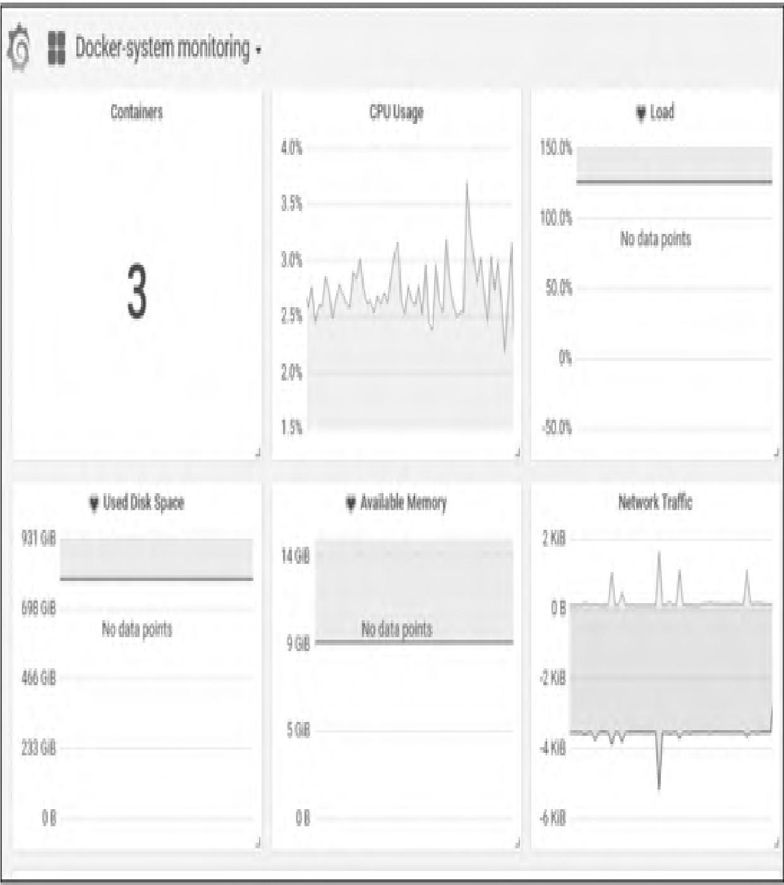

> 模块小结：Grafana社区模板可快速落地容器监控可视化，无需手动配置面板；模板ID 893是Docker监控的经典模板，覆盖核心指标展示。

## 【本篇核心知识点速记】

- **Docker架构核心**：Client-Server模式，通过driver、libcontainer（cgroups+namespace）实现容器隔离与资源限制
- **原生监控方式**：
  - `docker stats`：命令行实时查看容器CPU/内存/网络/磁盘指标
  - Docker Remote API：REST API获取容器信息，注意控制采集频率
  - 伪文件系统：读取`/sys/fs/cgroup`文件，是`docker stats`底层数据来源
- **cAdvisor定位**：单主机容器监控工具，集成于Kubelet，提供Web界面和Prometheus指标端点
- **cAdvisor架构**：API层、Handler、Manager、Collector四层架构，支持多存储后端扩展
- **cAdvisor部署**：
  - 二进制：`./cadvisor -port=8080`
  - Docker：必须挂载`/`、`/var/run`、`/sys`、`/var/lib/docker`，映射8080端口
  - 关键参数：`--storage_duration`（内存数据保存时长）、`--housekeeping_interval`（采集间隔）
- **监控输出**：
  - Web UI：`/containers`，展示容器/主机实时状态
  - Prometheus metrics：`/metrics`，内置标准Prometheus格式指标
- **核心指标**：`container_cpu_usage_seconds_total`（CPU累积）、`container_memory_usage_bytes`（内存使用）、`container_network_*_bytes_total`（网络）、`container_fs_*_bytes_total`（文件系统）
- **集成Prometheus**：修改`prometheus.yml`添加采集任务，使用PromQL查询容器指标
- **可视化**：Grafana导入模板（ID 893）实现Docker监控面板展示
- **扩展方案**：cAdvisor+Heapster+InfluxDB（K8s集群）、cAdvisor+Prometheus+Grafana（通用场景）
