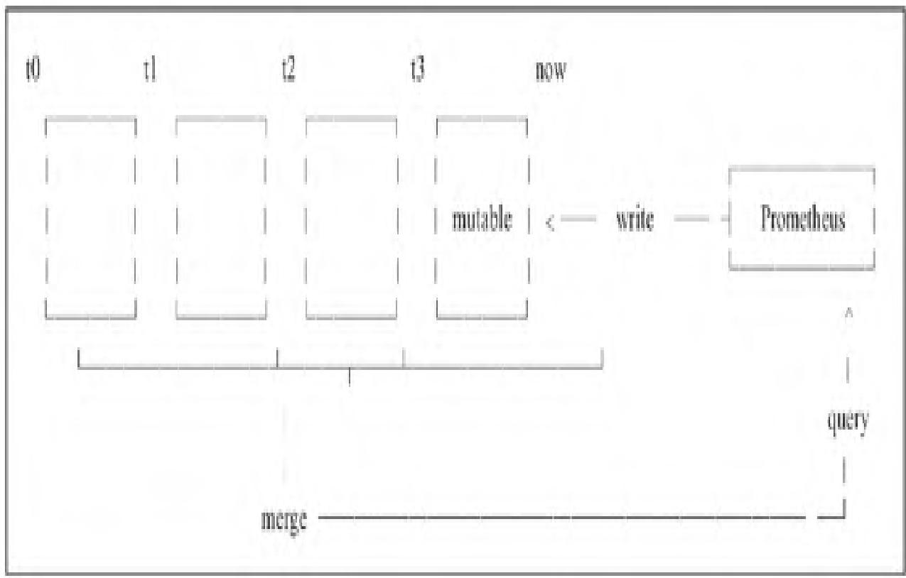
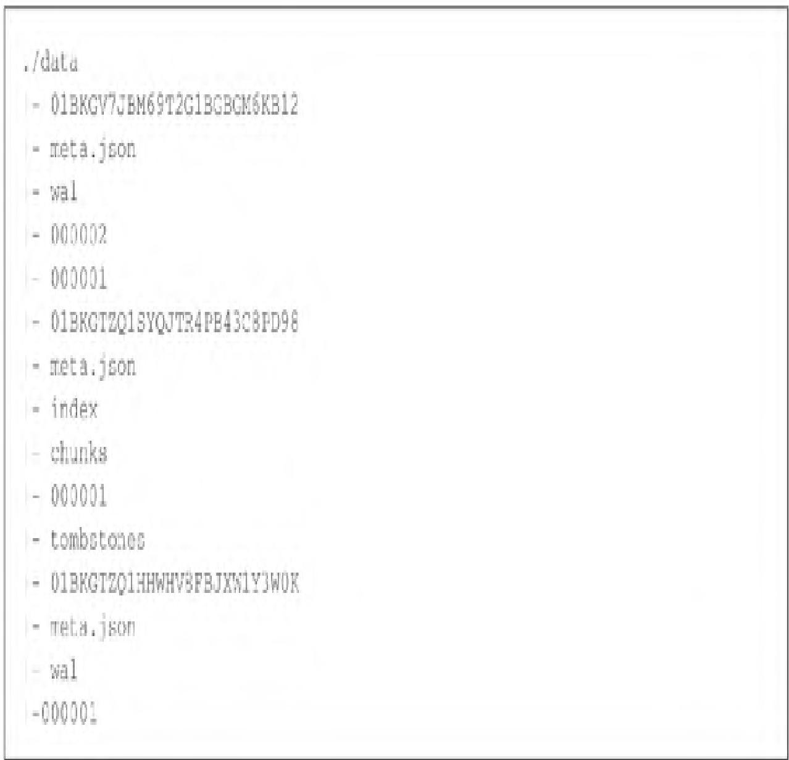
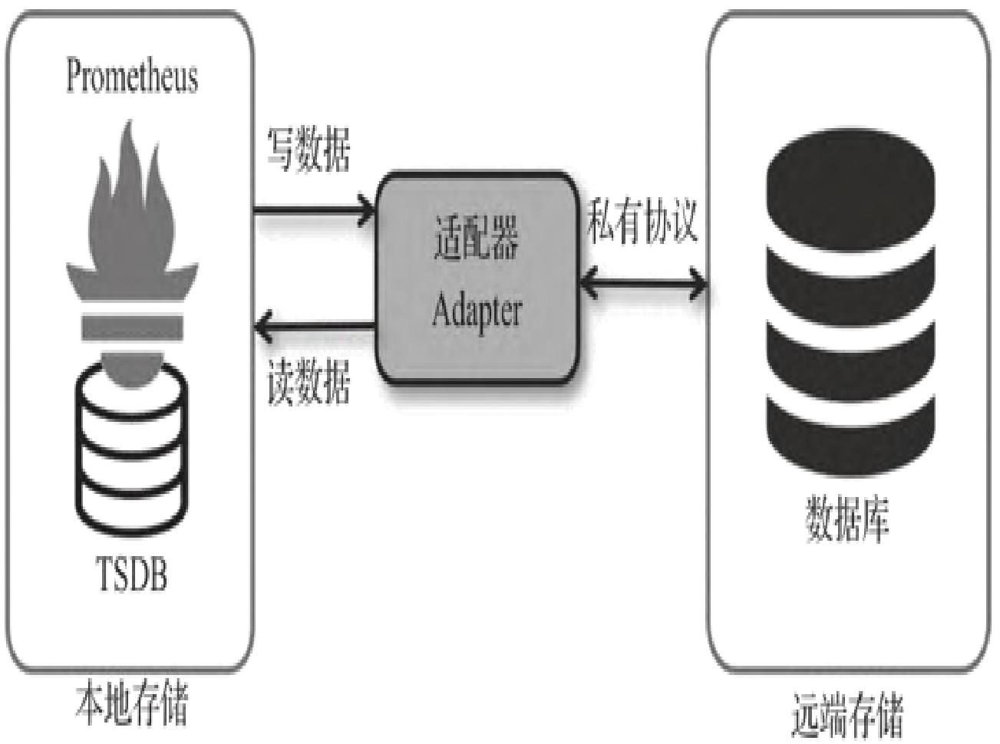
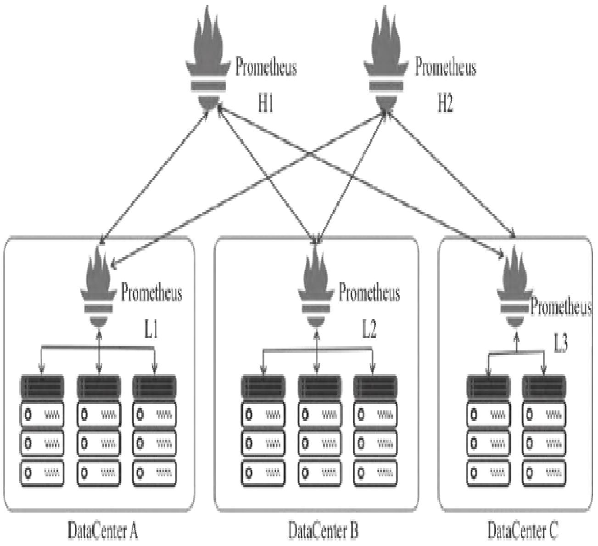
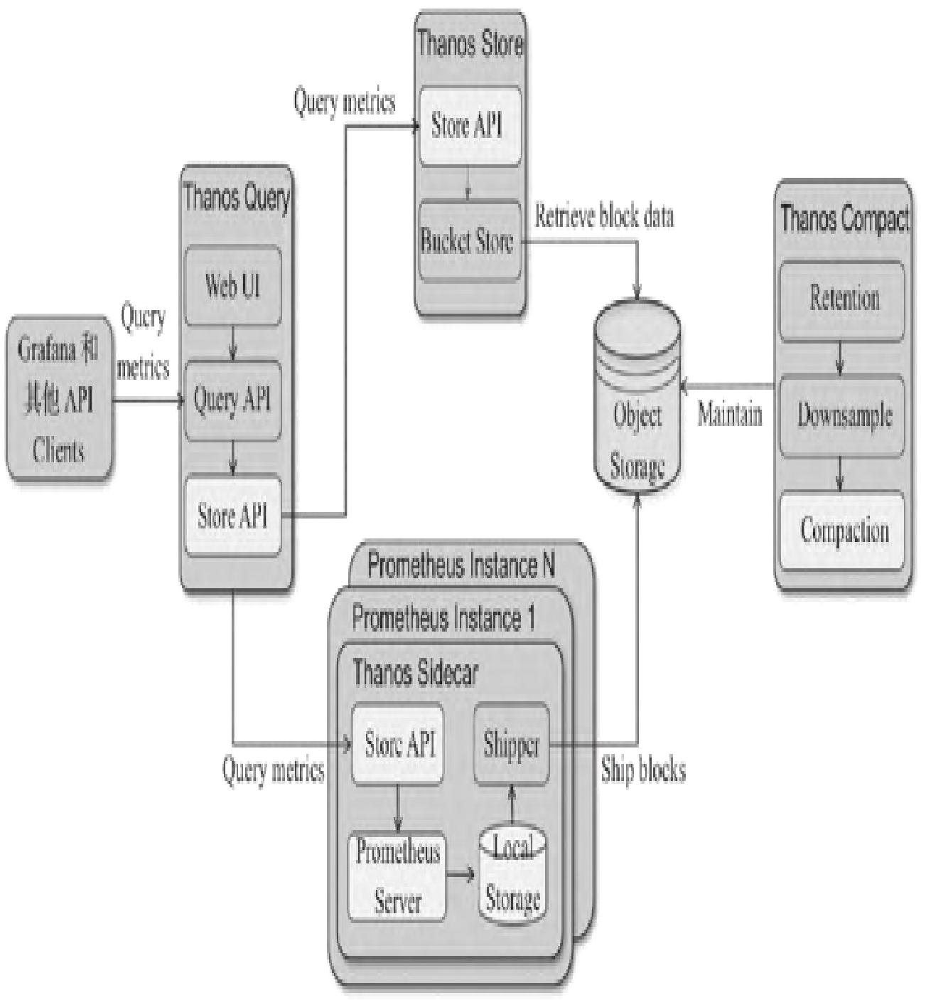
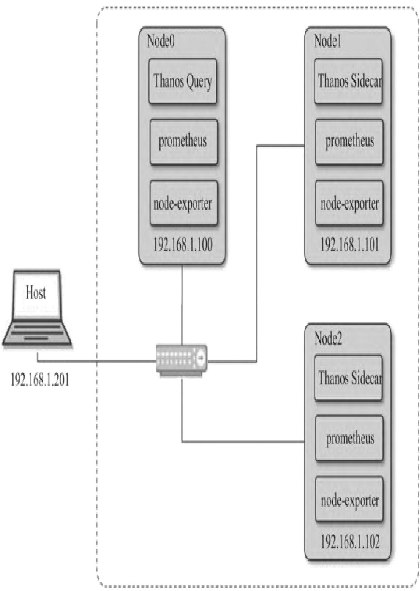
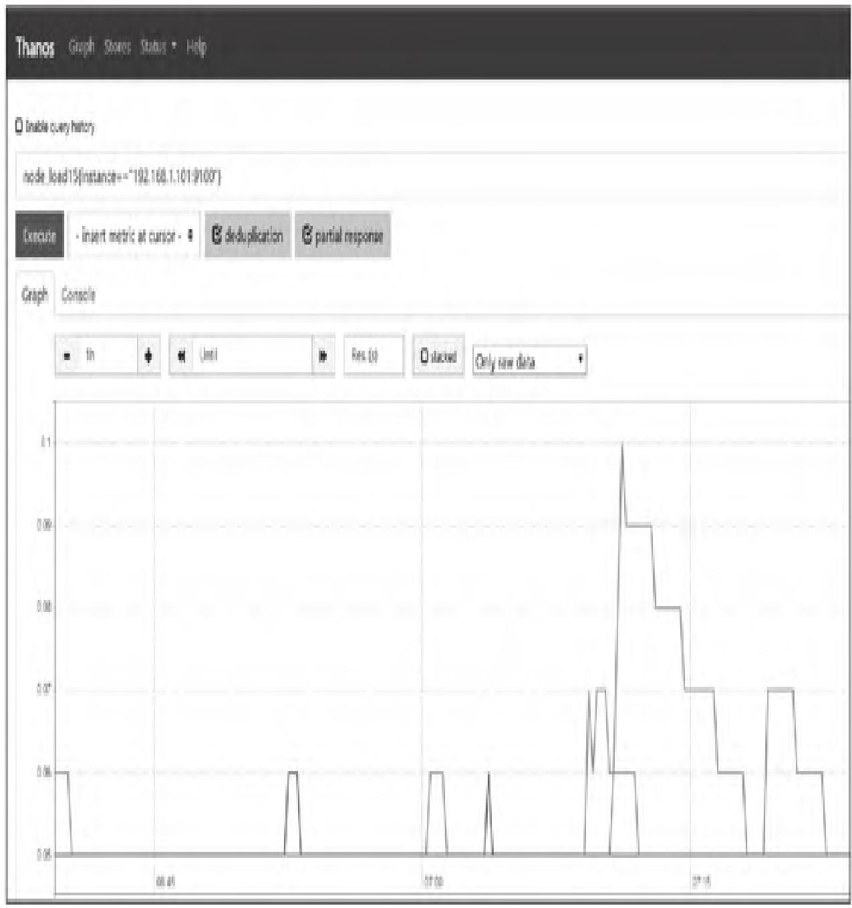
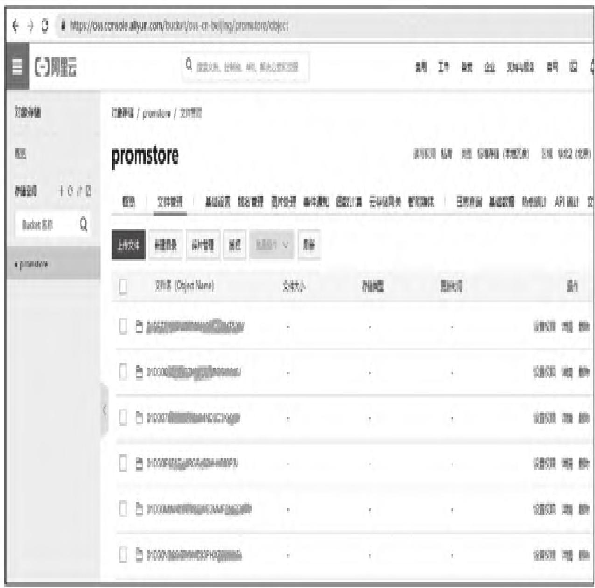
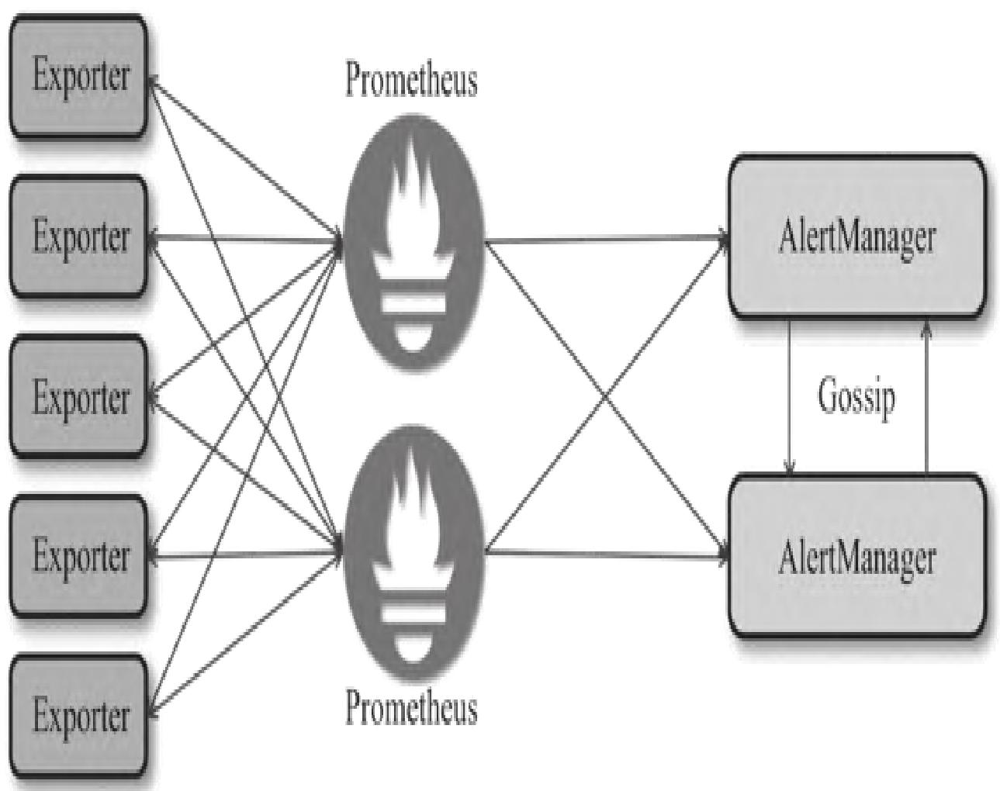
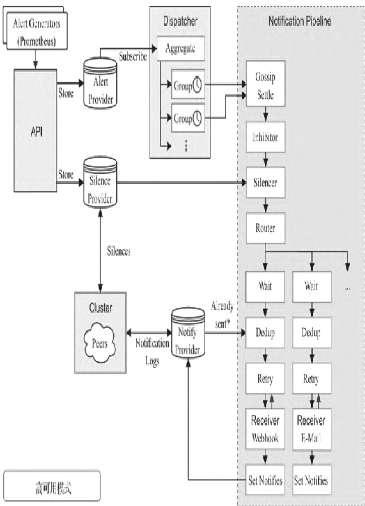

本文聚焦Prometheus监控系统生产部署全流程，从官方最佳实践原则切入，深度拆解本地/远端存储架构、联邦集群与Thanos集群搭建、Alertmanager高可用实现，帮助读者掌握生产级Prometheus集群的设计、部署与运维核心能力。

### 本篇核心收获

- 掌握Prometheus生产部署的官方最佳实践，规避指标设计、告警、PushGateway使用等核心陷阱
- 理解Prometheus本地存储V3引擎的底层原理与容量规划方法，以及远端存储的对接流程
- 学会搭建Prometheus联邦集群，解决大规模监控的分片与聚合问题
- 掌握Thanos集群部署与配置方法，实现监控数据的全局视图、长期存储与高可用
- 理解Alertmanager Gossip机制原理，搭建无单点故障的告警高可用架构

## 14.1 最佳实践原则

Prometheus官网及创始人Julius Volz提出的最佳实践，是生产环境落地的核心准则，覆盖指标设计、可视化、度量类型、告警、PushGateway使用等关键维度。

### 14.1.1 指标与标签的命名

- 指标命名需符合数据模型有效字符规范，需包含与业务域相关的应用前缀（命名空间）。
- 同一指标在所有标签维度上的逻辑测量内容需一致（如请求耗时、传输字节数等）。
- 标签用于区分测量对象特征，**禁止将标签名称嵌入度量名称**（避免冗余与存储膨胀）。
- 指标单位优先使用国际基本单位（无硬编码，但需保证兼容性）。

### 14.1.2 控制台和仪表盘

- 聚焦故障模式设计仪表盘，而非展示所有数据；按服务拆分仪表盘（如单服务的延迟/错误指标），支持从顶层钻取到具体服务。
- 核心限制：单控制台图形≤5个、单图表线条≤5个、控制台模板右侧表格数据项≤30个。

### 14.1.3 测量仪表

- 同一文件实例化度量类，便于从控制台告警快速定位到代码层错误。
- 按监控目的将服务分为在线服务、离线处理、批处理作业三类；同时需监控库接口、日志、失效、线程池、缓存、采集器等核心组件。

### 14.1.4 直方图和摘要

直方图和摘要用于跟踪请求耗时、响应大小等连续值，均会记录观测数量（计数器，只增不减）和观测值总和（计数器，非负场景）；若观测负值（如温度），总和可能下降，无法使用rate函数。
**核心经验法则**：

- 需要聚合场景选直方图；
- 已知值的范围/分布选直方图，需精确分位数选摘要。

### 14.1.5 告警

- 告警需简洁、准确，配套清晰的控制台便于根因定位。
- 确保Prometheus、Alertmanager、PushGateway等监控基础设施自身可用（如黑盒测试全链路：Pushgateway→Prometheus→Alertmanager→email）。
- 优先对根因告警以减少噪声，结合白盒监控（内部）与黑盒监控（外部），捕捉隐蔽问题并作为容灾备用手段。

### 14.1.6 使用PushGateway

PushGateway是适配无法被Pull的作业的中介服务，使用时需规避三大陷阱：

- 多实例共用一个PushGateway时，易成为单点故障和性能瓶颈；
- Prometheus基于Up指标的健康监控失效；
- PushGateway会永久暴露数据，需手动删除才会清理。

**模块小结**：本模块梳理了Prometheus生产使用的六大核心最佳实践，覆盖指标设计、可视化、度量类型、告警、PushGateway等维度，是规避生产陷阱的基础准则。

## 14.2 数据存储

生产级Prometheus的核心基础是对存储的深度理解，其存储分为本地存储（高性能）和远端存储（大容量、可扩展）两类，需根据场景选择适配方案。

### 14.2.1 本地存储

Prometheus本地存储历经V1（2012）、V2（2015）、V3（2017）三个版本，V2及以上借鉴Facebook Gorilla设计思想，针对时序数据特征做了极致优化。

#### 1. 高效的本地存储模型

**时序数据核心特征**：

- 相邻数据点时间戳差值相对固定，波动范围小；
- 相邻数据点值变化幅度小，甚至无变化；
- 热数据（近期数据）查询频率远高于冷数据，越新的数据热度越高。

**Gorilla压缩算法原理**：

- 时间戳：两次去差值压缩（如t(N-2)=02:00:00、t(N-1)=02:01:02、t(N)=02:02:02，第一次差值为62、60，第二次差值为-2），固定采样频率下差值几乎为0，大幅节省空间；
- 指标值：相邻值异或操作，若值不变则异或结果为0，仅需存储0（监控数据变化小，异或结果通常极小）。

**V2版本核心问题**：

1. 每个时序对应10MB文件，易耗尽文件系统Inode，随机读写导致磁盘性能下降（SSD存在写放大）；
2. 容器等短生命周期对象会引发“时序流失”，时间序列数量线性增长，内存压力剧增；
3. 容量不可预测，历史数据查询需全量加载到内存，易触发OOM导致Prometheus进程被杀死。

**V3版本（tsdb）核心优化**（保留高压缩比分块存储，解决V2核心问题）：

- 多块合并到单个文件，新增index索引文件，避免大量小文件；
- 引入WAL（写入日志）机制，防止数据丢失；
- 按时间水平拆分存储空间，每个时间区间为独立数据库；
- 单文件分块最大512MB，规避SSD写效率问题；
- 删除数据直接删除分区，查询时懒加载数据（避免OOM）。



**V3存储结构**：

- wal目录：存储监控数据WAL，确保进程崩溃/重启后数据恢复；
- 按2小时时间窗口分块（Block），每个块包含采样数据（chunks）、元数据（meta.json）、索引文件（index）；
- 实时采样数据暂存内存，删除操作记录在tombstone文件；
- 块以独立目录存储，查询时仅加载目标时间范围的块，提升效率。



**V3数据删除逻辑**：若块的时间范围超出配置的保留期，直接丢弃该块即可，逻辑简化且高效。


#### 2. 本地存储配置

- 配置方式：通过命令行参数修改本地存储参数；
- 容量规划公式：**需要磁盘容量=保留时间(秒)×每秒采样数×采样大小(字节数)**（单采样约1~2字节）；
- 减少磁盘占用的手段：① 减少时间序列数量（效果更显著）；② 增加采样间隔。

#### 3. 从失效中恢复

- 直接方案：停止Prometheus，删除data目录所有数据（丢失全部历史数据）；
- 精细化方案：仅删除失效的块目录（丢失该块2小时的监控数据）。

**模块小结**：本模块拆解了Prometheus本地存储V3引擎的底层原理、容量规划与故障恢复方法，V3通过分块合并、索引、WAL等机制解决了V2的核心痛点，是单节点高性能存储的核心保障。

### 14.2.2 远端存储

本地存储无法解决长期数据保存、大规模扩展问题，Prometheus通过`remote_read/remote_write`标准接口对接第三方存储（远端存储），保持自身架构简洁。

#### 1. 远端存储读/写结构

- 核心组件：适配器（Adaptor），作为Prometheus与第三方存储的中介；
- 远端写流程：Prometheus将样本数据通过HTTP发送给适配器，适配器转发至第三方存储（如InfluxDB、Cortex等）；
- 远端读流程：Prometheus向适配器发起查询请求，适配器从第三方存储获取数据并转换为Prometheus样本格式返回，本地再通过PromQL二次处理。



**注意**：规则文件处理、Metadata API仅基于本地存储完成，远端读不影响这两类操作。

#### 2. 设置配置文件

需在Prometheus配置文件中添加`remote_write`和`remote_read`节点，核心配置项包括URL（适配器地址）、认证、超时、代理等，标准配置模板如下：

```yaml
remote_write:  
  url: <string>  
  [ remote_timeout: <duration> | default = 30s ]  
  write_relabel_configs:  
    [ - <relabel_config>... ]  
  basic_auth:  
    [ username: <string> ]  
    [ password: <string> ]  
  [ bearer_token: <string> ]  
  [ bearer_token_file: /path/to/bearer-token/file ]  
  tls_config:  
    [ <tls_config> ]  
  [ proxy_url: <string> ]  

remote_read:  
  url: <string>  
  required_matchers:  
    [ <labelname>: <labelvalue>... ]  
  [ remote_timeout: <duration> | default = 30s ]  
  [ read_recent: <boolean> | default = false ]  
  basic_auth:  
    [ username: <string> ]  
    [ password: <string> ]  
  [ bearer_token: <string> ]  
  [ bearer_token_file: /path/to/bearer-token/file ]  
  tls_config:  
    [ <tls_config> ]  
  [ proxy_url: <string> ] 
```

#### 3. 使用InfluxDB作为Remote Storage

以InfluxDB为例，完整对接流程如下：

##### 步骤1：启动InfluxDB服务（Docker Compose）

```yaml
version: '2'  
services:  
  influxdb:  
    image: influxdb:1.3.5  
    command: -config /etc/influxdb/influxdb.conf  
    ports:  
      - "8086:8086"  
    environment: 
      - INFLUXDB_DB=prometheus
      - INFLUXDB_ADMIN_ENABLED=true
      - INFLUXDB_ADMIN_USER=admin
      - INFLUXDB_ADMIN_PASSWORD=admin
      - INFLUXDB_USER=prom
      - INFLUXDB_USER_PASSWORD=prom 
```

启动命令：

```shell
docker-compose up -d
docker ps # 验证容器运行状态
```

##### 步骤2：部署Remote Storage Adapter

```shell
# 获取源码并编译
go get github.com/prometheus/prometheus/documentation/examples/remote_storage/remote_storageadapter 
# 启动适配器（指定InfluxDB认证信息）
INFLUXDB_PW=prom $GOPATH/bin/remote_storage_adapter -influxdb.url=http://localhost:8086 -influxdb.username=prom -influxdb.database=prometheus -influxdb.retention-policy=autogen 
```

##### 步骤3：配置Prometheus对接适配器

修改`prometheus.yml`，添加远端读写配置：

```yaml
remote_write:  
  - url: "http://localhost:9201/write"  
remote_read:  
  - url: "http://localhost:9201/read" 
```

##### 步骤4：验证数据写入

重启Prometheus后，进入InfluxDB容器验证数据：

```shell
docker exec -it <容器ID> influx   
Connected to http://localhost:8086 version 1.3.5   
InfluxDB shell version: 1.3.5   
> auth   
username: prom   
password: prom  
> use prometheus   
> SHOW MEASUREMENTS # 可看到Prometheus指标（如go_gc_duration_seconds等）
```

##### 步骤5：验证数据恢复

停止Prometheus → 删除本地data目录 → 重启Prometheus → 通过UI查询历史数据，确认可从InfluxDB读取。

**支持的远端存储列表**：

| 存储服务 | 支持模式 |
|----------|----------|
| AppOptics | write |
| Chronix | write |
| Cortex | read/write |
| CrateDB | read/write |
| Gnocchi | write |
| Graphite | write |
| InfluxDB | read/write |
| OpenTSDB | write |
| PostgreSQL/TimescaleDB | read/write |
| SignalFx | write |

**模块小结**：本模块讲解了远端存储的架构、配置与InfluxDB对接实操，通过远端存储可解决Prometheus数据持久化与扩展问题，适配大规模、长周期监控场景。

## 14.3 构建联邦集群系统

Prometheus设计定位为“简洁、可组合”，原生不支持分布式存储、全局视图、多租户，联邦集群是解决大规模监控分片与聚合的核心方案。

### 14.3.1 联邦集群核心设计

- 适用场景：单Prometheus可处理百万级时序，但大规模场景需按数据中心/集群分片部署；
- 架构：每个数据中心部署Prometheus Lx（采集本地数据），中心节点Prometheus Hx通过`/federate`接口聚合Lx数据。



### 14.3.2 联邦集群配置

中心Prometheus Hx需配置采集任务，从Lx节点拉取数据，核心配置如下：

```yaml
scrape_configs:  
  - job_name: 'federate'  
    scrape_interval: 15s  
    honor_labels: true  
    metrics_path: '/federate'  
    params:  
      'match[]':  
        - '{job="prometheus"}'  
        - '{__name__=~"job:.*"}'  
        - '{__name__=~"node.*"}'  
    static_configs:  
      - targets:  
        - '192.168.0.11:9090' # Lx节点1
        - '192.168.0.12:9090' # Lx节点2
```

**核心参数说明**：

- `match[]`：瞬时向量选择器，指定需拉取的时序（支持多个）；
- `honor_labels: true`：忽略采集数据的标签冲突，false则将冲突标签重命名为`exported_xxx`。

### 14.3.3 联邦模式分类

- 网格模式：同一数据中心内，每个Prometheus监控其他Prometheus；
- 上下级模式：上级Prometheus聚合数据中心级别的Prometheus数据。

### 14.3.4 联邦集群局限性

- 配置复杂，无统一全局视图；
- 历史数据存储仍依赖远端存储，无原生降准采样能力；
- 本质是实时监控系统，分布式能力非原生设计。

**模块小结**：本模块讲解了联邦集群的架构、配置与局限性，通过分片+聚合解决了大规模监控的采集压力，但未解决全局视图与长期存储核心问题。

## 14.4 Thanos集群解决方案

Thanos是CNCF沙箱项目，与Prometheus无缝集成，解决联邦集群的全局视图、高可用、长期存储等核心痛点，是生产级大规模Prometheus集群的主流方案。

### 14.4.1 Thanos集群架构

Thanos由Sidecar、Querier、Store、Compactor、Ruler等组件构成，核心能力包括全局视图、长期存储、压缩降准、统一规则管理。



#### 1. 全局视图

- Sidecar：部署在Prometheus节点，通过gRPC的Store API暴露本地数据，支持按标签/时间段筛选；
- Querier：无状态、可横向扩展，通过Gossip协议发现Sidecar/Store组件，聚合数据并去重，提供全局查询入口。

#### 2. 长期保留数据

- Sidecar监听Prometheus数据目录，将2小时粒度的不可变数据块上传至对象存储（S3/阿里云OSS等）；
- Store Gateway：作为对象存储的检索代理，实现Store API，按需加载数据块索引，避免全量下载，查询效率接近本地SSD。

#### 3. 压缩和降准采样

- Compactor组件：对对象存储中的历史数据执行Prometheus本地压缩逻辑，聚合序列数据并降准采样，提升查询效率，无需用户额外配置。

#### 4. 记录规则

- Ruler组件：统一管理告警/记录规则，基于Querier执行规则并触发告警，解决规则分散管理问题。

### 14.4.2 部署Thanos监控集群

#### 1. 准备环境

- 基础环境：CentOS 7.5 x64、node_exporter-0.18.1、prometheus-2.14.0、thanos-0.8.1；
- 前置条件：Prometheus v2.2.1+、Go 1.10+、可选对象存储；
- 测试环境：两台主机（192.168.1.101/102），模拟多Prometheus节点。



#### 2. 部署集群

##### 步骤1：配置Prometheus

修改`prometheus.yml`的`global`节点，添加`external_labels`（用于Thanos去重）：

```yaml
global: 
  scrape_interval: 15s 
  evaluation_interval: 15s 
  external_labels: 
    monitor: 'monitor101' # 102节点对应monitor102
alerting:   
  # 原有配置
scrape_configs: 
  - job_name: 'prometheus'   
    static_configs: 
      - targets: ['192.168.1.101:19090','192.168.1.102:19090'] 
  - job_name: 'node'   
    static_configs: 
      - targets: ['192.168.1.101:9100','192.168.1.102:9100']
```

启动Prometheus和node_exporter（两台主机均执行）。

##### 步骤2：启动Thanos组件

两台主机均执行以下命令启动Sidecar和Querier：

```shell
# 启动Sidecar
nohup ./thanos sidecar \
  --tsdb.path /var/prometheus/data \
  --prometheus.url http://192.168.1.102:9090 \ # 替换为当前主机IP
  --http-address 0.0.0.0:19191 \
  --grpc-address 0.0.0.0:19091 &   

# 启动Querier
nohup ./thanos query \
  --http-address 0.0.0.0:29090 \
  --grpc-address 0.0.0.0:29091 \
  --query.replica-label monitor \ # 基于external_labels去重
  --store 192.168.1.101:19091 \
  --store 192.168.1.102:19091 &
```

##### 步骤3：开放防火墙端口

开放19191、19091、29090、29091端口，确保组件间通信。

#### 3. 数据验证

- 访问任意节点的`http://<IP>:29090`，打开Thanos Query Web UI（与Prometheus UI类似，新增deduplication/partial response去重选项）；
- 验证指标一致性：两台节点的Query UI展示的指标数据完全一致；
- 可选：部署Nginx转发，将Grafana数据源指向Nginx，实现可视化展示。



### 14.4.3 Thanos远程存储

Thanos通过Sidecar将Prometheus数据写入对象存储（AWS S3/阿里云OSS等），实现数据长期保留，对Prometheus性能影响极小。

#### 1. 配置Sidecar对接对象存储

启动Sidecar时添加对象存储配置文件参数：

```shell
$ thanos sidecar \
  --tsdb.path /var/prometheus \ # Prometheus TSDB目录
  --prometheus.url "http://localhost:9090" \ # Prometheus地址
  --objstore.config-file bucket_config.yaml \ # 存储配置文件
```

#### 2. 阿里云OSS配置示例

`bucket_config.yaml`（Aliyun OSS）：

```textproto
type: ALIYUNOSS   
config:   
  endpoint: "oss-cn-beijing.aliyuncs.com"   
  bucket: "promstore"   
  access_key_id: "LTAI****Z9****9bc8cS"   
  access_key_secret: "6bCKg****xcU****ws****wb" 
```

#### 3. 启动Store组件并验证

- 启动Store组件（需指定相同的对象存储配置文件）；
- 验证数据上传：`thanos bucket ls --objstore.config-file=/etc/thanos/oss.yml`；
- 查看对象存储：数据块会自动上传至阿里云OSS，完成长期存储。



**模块小结**：本模块完整拆解了Thanos集群的架构、部署、数据验证与远程存储配置，Thanos解决了Prometheus联邦集群的核心痛点，是生产级高可用、长存储的最优解。

## 14.5 Alertmanager高可用

Prometheus Server多实例部署可解决采集高可用，但单Alertmanager存在单点故障，需基于Gossip机制搭建Alertmanager高可用集群。

### 14.5.1 告警处理基础流程

- Prometheus多实例部署：配置完全相同（Job/告警规则），避免采集单点故障；
- Alertmanager分组机制：自动合并多Prometheus实例发送的相同告警，避免重复通知。


### 14.5.2 单点问题与Gossip机制

- 单Alertmanager风险：失效后告警全链路中断；
- 多Alertmanager无协调问题：重复发送告警通知；
- Gossip机制：Alertmanager集群间通过Gossip协议同步告警状态，确保相同告警仅发送一次通知。



### 14.5.3 Gossip机制下的告警处理流程

Alertmanager通过流水线处理告警，Gossip机制确保集群内告警状态一致，最终仅触发一次有效通知。



**模块小结**：本模块讲解了Alertmanager高可用的核心——Gossip机制，通过该机制解决多实例告警重复问题，实现无单点故障的告警体系。

## 本篇核心知识点速记

1. 生产部署最佳实践：指标命名需带应用前缀、仪表盘聚焦故障模式、直方图/摘要按聚合/分位数场景选择、告警优先根因、PushGateway规避单点/数据残留问题；
2. 存储层：本地存储V3通过分块合并/索引/WAL解决V2痛点，容量规划需计算保留时间×每秒采样数×单采样大小；远端存储通过`remote_read/write`对接第三方，如InfluxDB；
3. 集群层：联邦集群解决分片采集，Thanos解决全局视图/长期存储/高可用，核心组件包括Sidecar（暴露数据）、Querier（聚合查询）、Store Gateway（对象存储检索）；
4. 告警高可用：Alertmanager基于Gossip机制同步状态，避免多实例重复告警，实现无单点故障；
5. 实操核心：Thanos部署需配置Prometheus external_labels（去重），对接对象存储需配置Sidecar/Store组件，验证数据一致性与长期存储。
