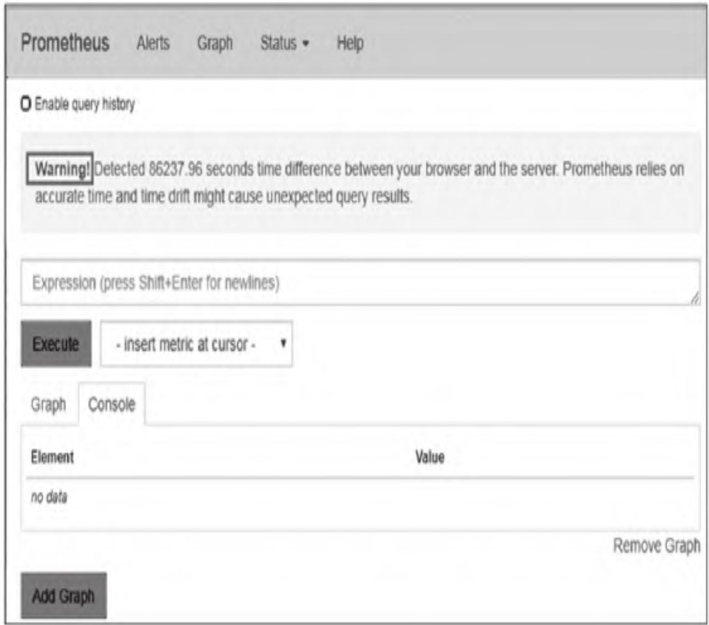
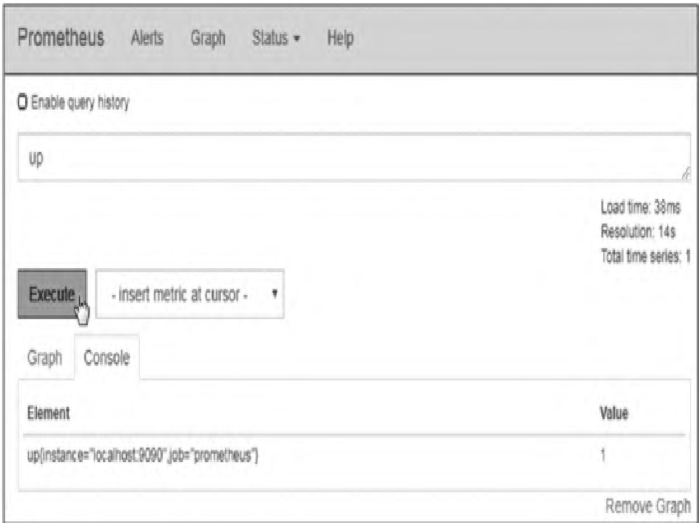
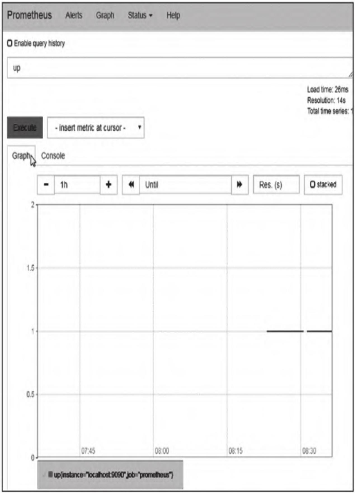
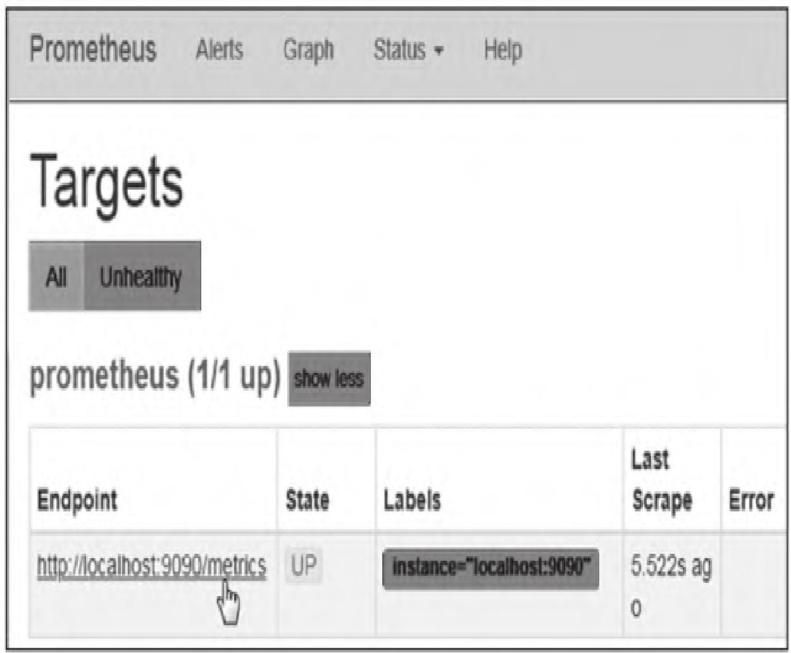

作为Prometheus监控体系学习的第二站，本文聚焦Prometheus核心架构与落地实操，从架构设计逻辑到二进制/Docker两种部署方式，再到数据模型、指标类型等核心概念，全方位拆解Prometheus入门必备的理论与实操知识，帮助新手快速搭建可用的Prometheus监控环境，同时吃透底层核心概念。

【本篇核心收获】

- 掌握Prometheus的整体架构设计理念与核心工作流程，明确各组件的职责与协作逻辑
- 学会在CentOS环境中通过二进制文件快速部署Prometheus，并配置系统服务实现开机自启
- 掌握Prometheus热加载配置、配置校验的方法，以及Docker部署的核心操作
- 理解Prometheus数据模型（metric、label、sample）及四种核心指标类型的特点与适用场景
- 清晰区分Job与Instance的概念，熟悉Prometheus生态核心组件的定位与作用

## 1. Prometheus架构概览

Prometheus的核心设计理念是**中心化数据采集和分析**，其生态圈由多个组件协同构成，整体架构如下：


### 1.1 核心工作流程

Prometheus的核心运行逻辑可拆解为5个关键阶段，每个阶段的核心动作与数据流转清晰明确：

1. **数据采集**：Prometheus Server通过3种方式获取监控指标：
   - 主动拉取已配置的Job/Exporter暴露的metric
   - 接收Pushgateway推送的metric（适配短期任务场景）
   - 从其他Prometheus服务器拉取metric（联邦集群场景）
2. **数据存储与处理**：采集到的数据默认存储在本地时序数据库，同时可通过规则对数据清洗、整理后存储为新的时间序列
3. **告警触发**：定时校验告警规则，满足触发条件时将alert信息推送至Alertmanager
4. **告警处理**：Alertmanager对告警进行聚合、去重、降噪后，通过邮件、网页等方式推送通知
5. **数据可视化**：通过PromQL查询数据，依托Prometheus Web UI、Grafana等工具实现可视化展示

### 1.2 设计理念与适用场景

Prometheus在纯数字时间序列监控场景中优势显著，尤其适配以下场景：

- 服务器硬件指标监控（CPU、内存、磁盘等）
- 高度动态的面向服务架构（如微服务）监控
- 虚拟化环境（VM、Docker容器）监控

**核心原理**：通过HTTP协议周期性拉取被监控组件的状态，无需集成SDK，仅需组件暴露HTTP接口即可接入，适配动态环境的集成需求；故障发生时可快速定位诊断问题。

**独立性优势**：每个Prometheus Server独立运行，不依赖网络存储或远程服务，基础架构故障时可快速恢复，无需复杂的依赖配置。

### 1.3 不适用场景

Prometheus无法满足“数据100%精确”的监控需求，因其采集的数据可能存在细节缺失，例如**精准实时计费的服务平台**这类对数据精度要求极高的场景，不适合使用Prometheus。

#### 模块小结

本模块拆解了Prometheus的核心架构与工作流程，明确其“中心化采集+独立部署”的设计特点，同时界定了适用与不适用场景，为后续实操落地奠定认知基础。

## 2. Prometheus快速部署

Prometheus官方提供多种部署方式，基于Go语言编译后的二进制包无第三方依赖，是最简便的部署方式；同时也支持Docker容器部署，适配容器化环境。

> **官方下载地址**：
>
> - 官方网站下载页面：<https://prometheus.io/download/>
> - GitHub下载页面：<https://github.com/prometheus/prometheus/releases>

### 2.1 使用二进制文件快速部署

#### 2.1.1 环境信息

| 配置项 | 具体信息 |
|--------|----------|
| 操作系统 | CentOS Linux release 7.5.1804（Core）x86_64 |
| 主机IP地址 | 192.168.24.17 |
| Prometheus版本 | prometheus-2.4.0.linux-amd64.tar.gz |

#### 2.1.2 部署步骤

**步骤1：下载并校验软件包**
下载完成后，通过哈希值校验软件包完整性：

```bash
# 下载完成后，获取软件包的哈希值
sha256sum prometheus-2.4.0-linux-amd64.tar.gz
```

将计算出的哈希值与官网“SHA256 Checksum”列的数值核对，确保软件包未损坏。

**步骤2：解压二进制软件包**

```bash
# 解压缩到指定安装目录
tar -zxf prometheus-2.4.0-linux-amd64.tar.gz -C /data

# 进入安装目录
cd /data

# 设置目录权限（示例使用root用户，生产环境建议使用非root用户）
chown -R root:root prometheus-2.4.0-linux-amd64

# 创建软链接，便于版本更新
ln -sv prometheus-2.4.0-linux-amd64 prometheus
```

**步骤3：启动Prometheus**
快速部署阶段暂不修改prometheus.yml配置，直接启动程序验证环境：

```bash
cd /data/prometheus
./prometheus
```

启动成功后，终端会输出如下核心日志（表明服务正常运行）：

```txt
level=info msg="Starting Prometheus" version=("version=2.4.0, branch=HEAD, revision=068eea5dbfce6c08f3d05d3d3c0bfd96267cfed2")
level=info msg="Build context" build_context=("go=gol.10.3, user=root@d84c15ea5e93, date=20180911-10:46:37")
level=info msg="Host details" host_details=("Linux 3.10.0-957.1.3.el7.x86_64 #1 SMP Thu Nov 29 14:49:43 UTC 2018 x86_64 k8s-node2 (none)")
level=info msg="Listening on" address=0.0.0.0:9090
level=info msg="Server is ready to receive web requests."
```

Prometheus默认监听9090端口，如需修改，启动时添加参数：`--web.listen-address="0.0.0.0:端口号"`。

**步骤4：添加Prometheus为系统服务（开机自启动）**
终端关闭或Ctrl+C会导致Prometheus停止，需配置系统服务实现持久运行：

1. 在`/usr/lib/systemd/system/`目录创建服务文件：

   ```bash
   vi /usr/lib/systemd/system/prometheus.service
   ```

2. 写入以下配置（核心参数已标注，可根据实际环境调整）：

   ```ini
   [Unit]
   Description=Prometheus server daemon
   After=network.target

   [Service]
   Type=simple
   User=root
   Group=root
   ExecStart=/data/prometheus/prometheus \
       --config.file "/data/prometheus/prometheus.yml" \
       --storage.tsdb.path "/data/prometheus/data" \
       --storage.tsdb.retention=15d \
       --webconsole.template=/data/prometheus/consoles \
       --webconsole.libraries=/data/prometheus/console_libraries \
       --web.max-connections=512 \
       --web.external-url="http://192.168.24.17:9090" \
       --web.listen-address="0.0.0.0:9090"
   Restart=on-failure

   [Install]
   WantedBy=multi-user.target
   ```

3. 核心配置项说明：

   | 选项 | 说明 |
   |------|------|
   | `ExecStart` | Prometheus程序运行路径 |
   | `--config.file` | prometheus.yml配置文件路径 |
   | `--storage.tsdb.path` | 监控指标数据存储路径 |
   | `--storage.tsdb.retention` | 历史数据最大保留时间（默认15天） |
   | `--webconsole.template` | 控制台模板目录路径 |
   | `--webconsole.libraries` | 控制台库目录路径 |
   | `--web.max-connections` | 最大同时连接数 |
   | `--web.external-url` | 生成Prometheus链接地址（告警通知中可直接访问） |
   | `--web.listen-address` | Prometheus监听端口（默认9090） |

> **避坑指南**：示例中使用root用户，生产环境建议创建非root用户（如prometheus），并修改配置中的User/Group字段，避免权限过大风险。

**步骤5：加载并启动服务**

```bash
# 通知systemd重新加载配置文件
systemctl daemon-reload

# 设置为开机自启动
systemctl enable prometheus.service

# 开启服务
systemctl start prometheus.service

# 查看状态（应显示Active: active (running)）
systemctl status prometheus.service
```

**补充：systemd service unit file结构说明**

| 区块 | 核心配置项 | 说明 |
|------|------------|------|
| [Unit] | `Description` | 服务信息描述 |
| [Unit] | `After` | 定义服务启动次序（如network.target表示网络就绪后启动） |
| [Service] | `Type` | 进程启动类型，常用：<br>- `simple`：默认，ExecStart命令启动为主进程<br>- `forking`：进程fork后父进程退出，子进程为主进程<br>- `oneshot`：进程需在后继单元启动前退出 |
| [Service] | `User`/`Group` | 服务运行的用户/用户组 |
| [Service] | `ExecStart` | 启动服务的命令/脚本 |
| [Service] | `Restart` | 进程退出时的重启策略，常用：<br>- `no`：默认，不重启<br>- `on-failure`：非正常退出时重启<br>- `always`：始终重启 |
| [Install] | `WantedBy` | 服务所属的Target（服务组），如multi-user.target表示多用户模式 |

#### 模块小结

本模块详细拆解了二进制部署Prometheus的全流程，从软件包校验到系统服务配置，覆盖核心操作步骤与参数说明，同时补充了systemd配置的关键知识点，确保服务可持久化运行。

### 2.2 热加载更新配置

修改prometheus.yml后，无需重启服务，可通过以下两种方式热加载配置，避免服务中断：

**方法一：发送SIGHUP信号**

```bash
# 查看Prometheus的进程id
ps aux | grep prometheus

# 发送SIGHUP信号
kill -HUP <pid>
```

**方法二：通过HTTP API发送POST请求**

```bash
curl -X POST http://localhost:9090/-/reload
```

> **注意**：使用API热加载需在Prometheus启动时添加`--web.enable-lifecycle`参数，否则请求会失败。

**配置核查（必做步骤）**
热加载前需校验配置文件正确性，避免配置错误导致服务异常：

```bash
cd /data/prometheus
./promtool check config prometheus.yml
# 成功时显示：SUCCESS: 0 rule files found
```

可通过`./promtool -h`查看更多配置校验、规则检查等功能。

#### 模块小结

本模块讲解了Prometheus配置热加载的两种方式，以及配置校验的关键步骤，确保配置更新不中断服务，同时规避配置错误风险。

### 2.3 使用Docker快速安装

若已部署Docker环境，可通过容器快速启动Prometheus，适配容器化部署场景：

**安装并启动最新版本**

```bash
docker run --name prometheus -p 9090:9090 prom/prometheus
```

**常用Docker操作命令**

| 操作 | 命令 |
|------|------|
| 查看运行中的Prometheus容器 | `docker ps -f name=prometheus` |
| 启动已停止的容器 | `docker start prometheus` |
| 查看容器资源占用状态 | `docker stats prometheus` |
| 重启容器 | `docker restart prometheus` |
| 停止容器 | `docker stop prometheus` |

> **生产环境建议**：使用Docker数据卷挂载方式，将prometheus.yml配置文件映射到主机目录，便于修改配置和管理数据，避免容器删除导致配置/数据丢失。

#### 模块小结

本模块提供了Docker部署Prometheus的核心命令，同时给出生产环境的最佳实践建议，适配容器化场景的部署需求。

## 3. Prometheus Web UI

部署完成后，需确保服务器防火墙开放9090端口（CentOS 7需额外检查SELinux状态），通过浏览器访问Prometheus Web UI进行基础验证。

### 3.1 访问与基础查询

通过浏览器访问：`http://192.168.24.17:9090`，默认进入Graph页面：


> **注意**：图中“Warning”提示由浏览器主机与Prometheus服务器时间不一致导致，需同步两端时间（如配置NTP服务），同步后警告消失：


**基础查询示例**：

1. 在查询框输入`up`，点击“Execute”按钮；
2. 切换至Console选项卡，可查看Prometheus服务在线状态（1表示正常，0表示异常）：



1. 切换至Graph选项卡，可查看“up”状态的图形化趋势：



### 3.2 Targets页面

访问`http://192.168.24.17:9090/targets`，可查看已配置的监控目标（Instance）状态，默认配置仅监控Prometheus本机：



### 3.3 Metrics接口

Prometheus内置大量自身监控指标，访问`http://192.168.24.17:9090/metrics`可查看完整指标列表，示例片段如下：

```txt
# HELP go_gc_duration_seconds A summary of the GC invocation durations.
# TYPE go_gc_duration_seconds summary
go_gc_duration_seconds{quantile="0"} 0.000136642
go_gc_duration_seconds{quantile="0.25"} 0.000200511
......此处省略部分信息....
prometheus_build_info{branch="HEAD",goversion="go1.10.3",revision="068ea5dbfce6c08f3d05d3d3c0bfd96267cfed2",version="2.4.0"} 1
# HELP prometheus_config_last_reload_success_timestamp_seconds Timestamp of the last successful configuration reload.
# TYPE prometheus_config_last_reload_success_timestamp_seconds gauge
prometheus_config_last_reload_success_timestamp_seconds 1.553934655140825e+09
......此处省略部分信息....
```

#### 模块小结

本模块讲解了Prometheus Web UI的核心功能，包括基础查询、Targets监控目标查看、内置Metrics接口，同时解决了时间不一致导致的警告问题，帮助新手快速验证部署效果。

## 4. Prometheus核心概念

### 4.1 数据模型（Data Model）

Prometheus将所有监控数据存储为**时间序列（time series）**，每个时间序列由指标名称+标签唯一标识，核心组成如下：

#### 4.1.1 Metric（指标）

Metric是监控目标的测量特征，定义了监控指标的类型名称，是时间序列的核心标识：

- **命名规范**：由ASCII字母、数字、下划线和冒号组成，以字母开头（正则：`[a-zA-Z_:][a-zA-Z0-9_:]*`）；冒号为记录规则保留，不建议日常使用。
- **组成字段**：指标名称 + 任意数量标签 + 当前指标值 + 可选时间戳。
- **示例**：

  ```txt
  # HELP go_gc_duration_seconds A summary of the GC invocation durations.
  # TYPE go_gc_duration_seconds summary
  go_gc_duration_seconds{quantile="0"} 1.5028e-05
  go_gc_duration_seconds{quantile="0.25"} 2.822e-05
  ```

  其中`go_gc_duration_seconds`为指标名称，`{quantile="0"}`为标签，后续数值为指标值。

#### 4.1.2 Label（标签）

Label是Prometheus维度数据模型的核心，相同指标名称的不同标签组合，代表不同的时间序列：

- **标签名称规范**：ASCII字母、数字、下划线组成，以字母开头（正则：`[a-zA-Z_][a-zA-Z0-9_]*`）；双下划线（`__`）开头的标签为系统内置，禁止自定义。
- **标签值**：支持任意UTF-8字符，可空（但空值易造成混淆，不建议使用）。
- **关键特性**：修改标签值/增删标签，会创建新的时间序列，需谨慎操作。

#### 4.1.3 Sample（样本）

Sample是时间序列的最小数据单元，代表某一时刻的监控值，包含两部分：

- `float64`类型的数值（value）；
- 毫秒级精度的时间戳（timestamp）。

> **注意**：非顺序采集的样本会被Prometheus丢弃，需确保采集时序的连续性。

#### 4.1.4 Notation（符号表示）

Prometheus时间序列的标准表示格式（与OpenTSDB类似）：

```
<metric name>{<label name>=<label value>, ...}
```

**示例**：`api_http_requests_total{method="POST", handler="/messages"}`

### 4.2 Metric的四种类型

Prometheus客户端库提供四种核心指标类型，适配不同监控场景，核心区别如下：

| 类型 | 核心特点 | 适用场景 | 命名/输出特点 |
|------|----------|----------|--------------|
| Counter（计数器） | 严格递增，值从0开始只增不减，进程重启后重置 | 服务请求次数、错误数、任务完成数、消息队列数量 | 推荐后缀`_total`，如`process_cpu_seconds_total` |
| Gauge（仪表盘） | 瞬时值，可增可减，进程重启后重置 | CPU/内存/磁盘使用率、在线人数、订单数量、温度 | 无固定后缀，如`node_memory_MemAvailable_bytes` |
| Histogram（直方图） | 统计一段时间内数据分布，按区间（bucket）分组 | 请求延迟、响应大小 | 输出`<basename>_bucket`/`_sum`/`_count` |
| Summary（摘要） | 类似Histogram，直接存储分位数（quantile） | 请求延迟、响应大小 | 输出分位数值+`_sum`/`_count` |

#### 4.2.1 Counter（计数器）

**核心示例**：

```txt
# HELP process_cpu_seconds_total Total user and system CPU time spent in seconds
# TYPE process_cpu_seconds_total counter
process_cpu_seconds_total 6.67
```

> **优势**：两次采集间隔内不会丢失信息，是最常用的指标类型。

#### 4.2.2 Gauge（仪表盘）

**核心示例**：

```txt
# HELP node_memory_MemAvailable_bytes Memory information field MemAvailable_bytes.
# TYPE node_memory_MemAvailable_bytes gauge
node_memory_MemAvailable_bytes 1.551921152e+09
```

> **注意**：Gauge适合记录无规律变化的数据，但采集粒度越大，越容易丢失关键变化值。

#### 4.2.3 Histogram（直方图）

**核心示例**（Prometheus HTTP请求延迟）：

```txt
# HELP prometheus_http_request_duration_seconds Histogram of latencies for HTTP requests.
# TYPE prometheus_http_request_duration_seconds histogram
prometheus_http_request_duration_seconds_bucket{handler="/",le="0.1"} 1
prometheus_http_request_duration_seconds_bucket{handler="/",le="0.2"} 1
prometheus_http_request_duration_seconds_bucket{handler="/",le="+Inf"} 1
prometheus_http_request_duration_seconds_sum{handler="/"} 0.000126051
prometheus_http_request_duration_seconds_count{handler="/"} 1
```

> **性能注意**：Histogram查询会消耗CPU资源，需控制bucket数量和标签数量，避免时间序列过多。

#### 4.2.4 Summary（摘要）

**核心示例**（Go GC时长）：

```txt
# HELP go_gc_duration_seconds A summary of the GC invocation durations.
# TYPE go_gc_duration_seconds summary
go_gc_duration_seconds{quantile="0"} 2.8305e-05
go_gc_duration_seconds{quantile="0.25"} 6.0632e-05
go_gc_duration_seconds{quantile="0.5"} 8.7396e-05
go_gc_duration_seconds{quantile="0.75"} 0.00013949
go_gc_duration_seconds{quantile="1"} 0.001995259
go_gc_duration_seconds_sum 0.061217157
go_gc_duration_seconds_count 445
```

### 4.3 Jobs和Instances

Prometheus通过Job和Instance划分监控目标，核心定义与关联如下：

- **Instance（实例）**：单个被采集的目标，即暴露监控指标的HTTP服务，通常对应单个进程；
- **Job（作业）**：具有相同采集目的的Instance集合（如多副本的API服务器）。

**示例**：

```
job: api-server
  instance 1: 1.2.3.4:5670
  instance 2: 1.2.3.4:5671
  instance 3: 5.6.7.8:5670
  instance 4: 5.6.7.8:5671
```

**配置文件示例**：

```yaml
scrape_configs:
- job_name: 'prometheus'
  static_configs:
  - targets: ['192.168.24.17:9090']
- job_name: 'node_exporter'
  static_configs:
  - targets: ['192.168.24.17:9100']
```

#### 4.3.1 自动生成标签

Prometheus采集数据时，会自动为时间序列附加以下标签：

| 标签 | 说明 |
|------|------|
| `job` | 监控目标所属的Job名称 |
| `instance` | 目标URL的`<host>:<port>`部分 |

> **注意**：若采集数据中已存在这些标签，Prometheus会根据`honor_labels`配置决定是否覆盖。

#### 4.3.2 自动生成的时间序列

对每个Instance，Prometheus会自动存储以下监控指标，用于监控采集状态：

| 时间序列 | 说明 |
|----------|------|
| `up{job="<job-name>", instance="<instance-id>"}` | Instance是否可访问（1=正常，0=异常） |
| `scrape_duration_seconds{job="<job-name>", instance="<instance-id>"}` | 采集目标消耗的时间 |
| `scrape_samples_post_metric_relabeling{...}` | 重新打标签后剩余的样本数 |
| `scrape_samples_scraped{job="<job-name>", instance="<instance-id>"}` | 从目标获取的样本总数 |
其中`up`指标是监控Instance可用性的核心，需重点关注。

#### 模块小结

本模块拆解了Prometheus的核心数据模型（Metric、Label、Sample）、四种指标类型的特点与适用场景，以及Job/Instance的概念和自动生成的标签/指标，是理解Prometheus监控逻辑的关键。

## 5. Prometheus核心组件

Prometheus生态圈由多个组件构成，核心组件的定位与职责如下：

### 5.1 Prometheus Server

**核心定位**：Prometheus架构的核心组件，基于Go语言编写，无第三方依赖，可独立部署在物理机、云主机、容器中。
**核心职责**：

- 采集并存储监控指标为时间序列数据（默认本地存储，支持远程存储）；
- 提供PromQL查询接口，支持数据查询与分析；
- 管理告警规则，触发告警并推送至Alertmanager。

### 5.2 Client Library

**核心定位**：用于应用程序集成Prometheus监控的客户端库。
**核心特点**：

- 官方支持Go、Python、Java/JVM、Ruby，第三方支持Bash、C++、Node.js等；
- 线程安全，生成Prometheus标准格式的指标数据，响应HTTP采集请求；
- 自动提供基础指标（如CPU使用率、GC统计），内存占用仅与指标数量相关，不随事件增长。

### 5.3 Exporter

**核心定位**：输出被监控组件指标的HTTP接口，相当于传统监控的Agent（但不主动推送数据）。
**工作方式**：独立进程运行，暴露HTTP服务提供监控指标，Prometheus Server定时拉取数据。
**常见Exporter**：

- `node_exporter`：机器硬件指标（CPU、内存、磁盘、网络）；
- `mysqld_exporter`：MySQL数据库监控；
- `snmp_exporter`：网络设备监控。

### 5.4 Pushgateway

**核心定位**：短期任务/批量任务的指标汇聚节点。
**适用场景**：

- 短期Job（生命周期短，Prometheus拉取前可能退出）；
- Prometheus与Exporter网络不通的场景。
**工作方式**：短期Job主动推送指标至Pushgateway，Prometheus定时从Pushgateway拉取。

### 5.5 Alertmanager

**核心定位**：处理Prometheus推送的告警信息，实现告警的标准化处理。
**核心功能**：

- 去重：剔除重复告警；
- 分组：将相关告警聚合，减少冗余通知；
- 路由：将告警推送至指定渠道（邮件、PagerDuty、OpsGenie、Webhook等）；
- 高级功能：告警静音、抑制，避免告警风暴。

#### 模块小结

本模块梳理了Prometheus生态圈的核心组件，明确了各组件的定位、职责与工作方式，帮助理解Prometheus监控体系的整体协作逻辑。

## 【本篇核心知识点速记】

- **Prometheus架构核心流程**：数据采集（Pull/Push）→ 本地存储 → 规则评估 → Alertmanager告警处理 → 可视化展示（Web UI/Grafana）
- **部署方式**：二进制文件（单文件无依赖，推荐配置系统服务）、Docker容器（生产环境建议挂载数据卷）
- **热加载配置**：`kill -HUP <pid>`（无需额外参数）、`curl -X POST http://localhost:9090/-/reload`（需启用`--web.enable-lifecycle`）；配置修改前必须用`promtool`校验
- **数据模型**：时间序列由metric名称+标签唯一标识；样本包含float64值+毫秒级时间戳
- **四种指标类型**：
  - Counter：只增不减（请求/错误计数），推荐`_total`后缀
  - Gauge：可增可减（资源使用率、在线人数）
  - Histogram：直方图，统计数据分布（请求延迟），输出`_bucket`/`_sum`/`_count`
  - Summary：摘要，直接提供分位数（quantile）
- **Job与Instance**：Instance是单个采集目标，Job是同类Instance集合；自动附加`job`/`instance`标签，`up`指标监控Instance可用性
- **核心组件**：Prometheus Server（核心采集/存储/查询）、Client Library（应用集成）、Exporter（指标暴露）、Pushgateway（短期任务汇聚）、Alertmanager（告警处理）
