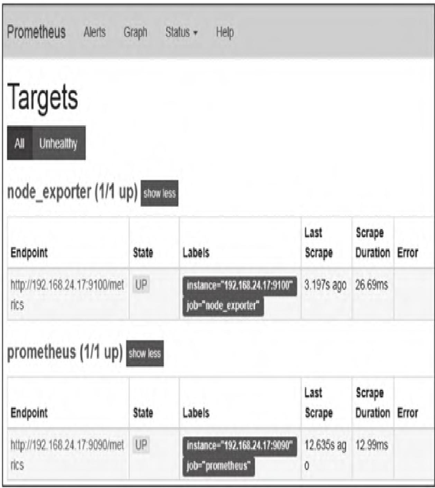
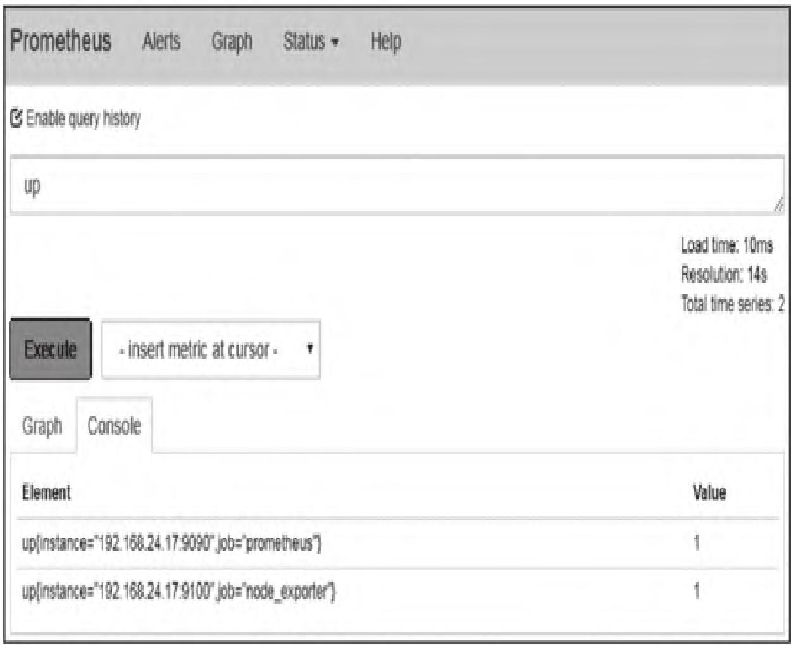
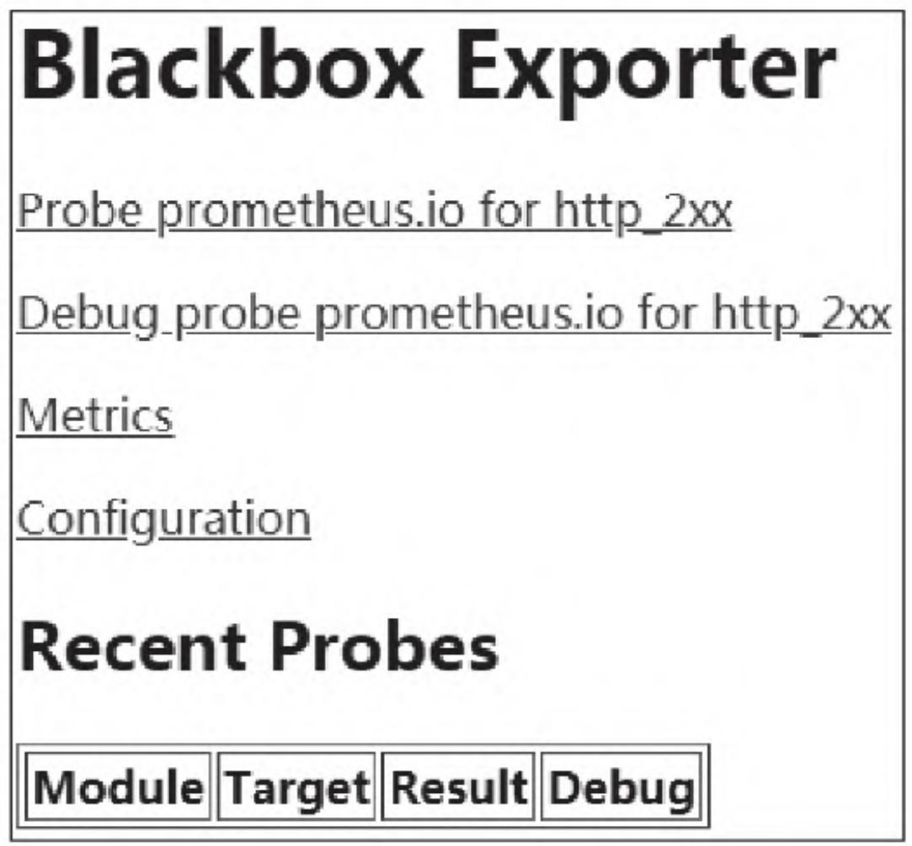
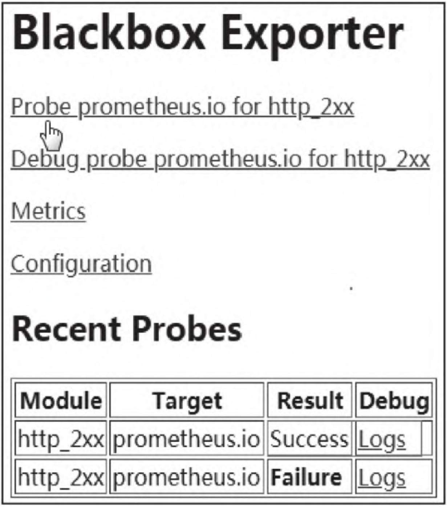

本文聚焦Prometheus数据采集核心组件Exporter，从原理层拆解Exporter类型与数据格式规范，再通过实战落地Linux/Windows主机、MySQL/Redis数据库、Nginx服务及黑盒监控场景的Exporter部署与集成，学完可独立完成全场景监控数据采集落地。

【本篇核心收获】

- 精准区分Exporter两大类型（直接采集型 vs 间接采集型），掌握不同类型的适用场景与核心设计逻辑
- 吃透Prometheus文本数据格式规范，能独立解析metrics输出内容、校验样本数据合法性
- 熟练从官方渠道获取各类Exporter，完成下载、部署及系统服务配置
- 落地Linux（Node Exporter）、Windows（wmi_exporter）主机全维度监控，掌握核心指标解读方法
- 完成MySQL（mysqld_exporter）、Redis（redis_exporter）、Nginx（nginx-vts-exporter）的监控配置与数据采集
- 理解黑盒监控核心理念，落地Blackbox Exporter实现HTTP/HTTPS等多类型网络探测

## 1. Exporter概述

在Prometheus监控体系中，**Exporter是数据采集的核心载体**——Prometheus服务器不直接采集监控数据，而是定时从Exporter提供的HTTP服务拉取样本数据，是连接监控目标与Prometheus的关键桥梁。

### 1.1 Exporter类型

根据监控目标的适配方式，Exporter分为两类，核心差异在于是否与监控目标深度集成：

| 类型 | 核心特征 | 适用场景 | 典型案例 |
|------|----------|----------|----------|
| 直接采集型 | 内置在应用程序中，原生提供Prometheus监控端点 | 需深度监控应用内部状态、自定义监控指标的场景 | cAdvisor、Kubernetes、etcd |
| 间接采集型 | 独立运行的采集程序，适配不原生支持Prometheus的监控目标 | 操作系统、传统数据库、第三方服务等无内置监控端点的场景 | Node Exporter、mysqld_exporter、wmi_exporter |

### 1.2 文本数据格式

所有Exporter返回的监控样本数据，必须遵循Prometheus 2.0+的**基于文本的格式规范**（早期Protobuf格式已废弃），该格式具备跨平台、易读、易解析的特点。

#### 1.2.1 格式基础规则

通过浏览器访问Exporter的`/metrics`端点（如`http://192.168.24.17:9090/metrics`），可查看标准化的文本数据，核心规则：

- 面向行的格式：每行以换行符`\n`分隔，最后一行必须以换行符结尾
- 空行直接忽略
- 以`#`开头的行为注释（部分为功能性注释，部分为可读性注释）
- 非`#`开头的行是实际监控样本数据


#### 1.2.2 行类型与说明

文本数据中的行分为四类，各自承担不同职责：

| 行类型 | 格式示例 | 核心说明 |
|--------|----------|----------|
| `# HELP` | `# HELP node_cpu_seconds_total Total user and system CPU time spent in seconds.` | 监控指标的帮助说明，包含指标名+释义，便于理解指标含义 |
| `# TYPE` | `# TYPE node_cpu_seconds_total counter` | 定义指标类型（Counter/Gauge/Histogram/Summary/Untyped），是PromQL解析的核心依据 |
| 非`#`开头行 | `node_cpu_seconds_total{cpu="0",mode="idle"} 3.9740507e+06` | 实际监控样本数据，包含指标名、标签、值、时间戳 |
| 普通注释 | `# Generated by node_exporter 0.16.0` | 仅提升可读性，Prometheus采集时会忽略 |

#### 1.2.3 样本数据格式规范

样本数据的核心格式如下（需严格遵循，否则会导致采集异常）：

```python
metric_name [ "{" label_name "=" `" label_value `" { "," label_name "=" `" label_value `" } [ "," ] "}" ] value [ timestamp ]
```

**关键约束说明**：

- **metric_name/label_name**：必须符合PromQL命名规范（字母开头，可包含字母、数字、下划线）
- **label_value**：支持任意UTF-8字符，但`\`、`"`、`\n`需分别转义为`\\`、`\"`、`\n`，且必须用双引号包裹
- **value**：支持标准浮点数，以及`Nan`（非数字）、`+Inf`（正无穷）、`-Inf`（负无穷）
- **timestamp**：可选，为自1970-01-01 00:00:00 UTC起的毫秒数（int64类型）
- **唯一性约束**：相同metric_name的样本需按组排列，且每行的“指标名+标签”组合必须唯一，否则会触发未定义行为

#### 1.2.4 Histogram/Summary类型特殊约定

若指标类型为Histogram或Summary，需遵循固定命名规则，确保Prometheus正确解析：

| 指标类型 | 约定规则 | 示例 |
|----------|----------|------|
| Summary | 样本总和：`指标名_sum` | `http_request_duration_sum` |
| Summary | 样本总量：`指标名_count` | `http_request_duration_count` |
| Summary | 分位数：`指标名{quantile="分位值"}` | `http_request_duration{quantile="0.95"}` |
| Histogram | 分区统计：`指标名_bucket{le="阈值"}` | `http_request_duration_bucket{le="0.5"}` |
| Histogram | 必须包含`指标名_bucket{le="+Inf"}`，值等于`指标名_count` | `http_request_duration_bucket{le="+Inf"} 1000` |
| 通用 | quantile/le标签值需按从小到大排序 | - |

**模块小结**：本模块核心拆解了Exporter的两类核心形态，以及Prometheus文本数据格式的全量规范，是理解Exporter输出、排查采集异常的基础，需重点掌握样本数据格式与Histogram/Summary的特殊约定。

## 2. 主机监控

主机是监控体系的基础载体，需针对Linux/Windows不同系统，适配对应的Exporter完成核心指标采集。

### 2.1 Linux主机监控（Node Exporter）

Linux系统不原生支持Prometheus，官方提供**Go语言编写的Node Exporter**，可采集CPU、内存、磁盘、网络、系统负载等全维度系统指标。

#### 2.1.1 环境信息

| 项目 | 具体信息 |
|------|----------|
| Linux版本 | CentOS Linux release 7.5.1804（Core）x86_64 |
| 主机IP | 192.168.24.17 |
| Node Exporter版本 | node_exporter-0.16.0.linux-amd64.tar.gz |

#### 2.1.2 下载与部署

**步骤1：下载并校验**
从官方下载页（<https://prometheus.io/download/>）或GitHub（<https://github.com/prometheus/node_exporter/releases>）下载对应版本，校验SHA256哈希值确保文件完整性。

**步骤2：解压并启动**

```bash
tar -zxf node_exporter-0.16.0.linux-amd64.tar.gz -C /data
cd /data/node_exporter-0.16.0.linux-amd64
./node_exporter
```

- 成功启动后默认监听9100端口，日志中会显示“Enabled collectors”（默认启用的采集器）
- 若需修改端口，启动时添加参数：`--web.listen-address=":9200"`

**避坑指南**：Node Exporter 0.17.0-rc.0版本因缓存问题和goroutine泄漏，默认禁用了wifi采集功能，若需监控wifi指标需手动启用。

**步骤3：配置系统服务（开机自启动）**
创建服务配置文件`/usr/lib/systemd/system/node_exporter.service`：

```ini
[Unit]
Description=node_exporter
Documentation=https://prometheus.io/
After=network-online.target

[Service]
Type=simple
User=root
Group=root
ExecStart=/data/node_exporter/node_exporter
Restart=on-failure

[Install]
WantedBy=multi-user.target
```

> 生产环境建议：创建非root用户（如prometheus）运行Exporter，需提前创建用户并修改配置中的User/Group。

**步骤4：启动并验证服务**

```bash
systemctl daemon-reload          # 重新加载配置文件
systemctl enable node_exporter.service   # 设置开机自启
systemctl start node_exporter.service    # 启动服务
systemctl status node_exporter.service   # 查看运行状态
```

#### 2.1.3 与Prometheus集成

编辑Prometheus主配置文件`prometheus.yml`，添加Node Exporter采集任务：

```yaml
scrape_configs:
- job_name: 'prometheus'
  static_configs:
  - targets: ['192.168.24.17:9090']
- job_name: 'node_exporter'
  static_configs:
  - targets: ['192.168.24.17:9100']
```

> 注意：YAML格式对缩进敏感，相同层级需左对齐，禁止使用tab键。

**配置生效方式**：

- 重启Prometheus：`systemctl restart prometheus`
- 热加载（推荐）：`curl -X POST http://localhost:9090/-/reload`

**验证集成效果**：

1. 访问Prometheus Web UI（`http://192.168.24.17:9090`），点击“Status”→“Targets”，可看到node_exporter状态为“UP”，如图2所示。
2. 在Graph页面输入“up”查询，可看到prometheus和node_exporter两个UP条目，如图3所示。




> 故障模拟验证：关闭node_exporter服务（`systemctl stop node_exporter`），刷新Targets页面，状态会变为“DOWN”并显示错误提示，可用于验证监控告警的有效性。

#### 2.1.4 关键监控指标

Node Exporter采集的核心指标覆盖Linux系统全维度，以下是高频使用的指标及解析：

| 监控维度 | 核心指标 | 类型 | 核心说明 | PromQL示例 |
|----------|----------|------|----------|------------|
| CPU | `node_cpu_seconds_total` | Counter | 每核CPU各模式（idle/system/user等）占用时间 | `avg without(cpu, mode) (rate(node_cpu_seconds_total{mode="idle"}[1m]))`（计算平均空闲CPU占比） |
| 内存 | `node_memory_MemTotal_bytes` | Gauge | 总内存大小（来源于`/proc/meminfo`） | - |
| 内存 | `node_memory_MemAvailable_bytes` | Gauge | 可用内存（核心参考指标） | - |
| 内存 | `node_memory_MemFree_bytes` | Gauge | 空闲内存 | - |
| 内存 | `node_memory_SwapFree_bytes` | Gauge | 交换分区空闲空间 | - |
| 磁盘IO | `node_disk_read_time_seconds_total` | Counter | 磁盘读取总耗时 | - |
| 磁盘IO | `node_disk_written_bytes_total` | Counter | 磁盘写入字节总数 | - |
| 磁盘IO | `node_disk_io_now` | Gauge | 当前正在进行的IO操作数（唯一Gauge类型磁盘指标） | - |
| 文件系统 | `node_filesystem_size_bytes` | Gauge | 文件系统总大小（带device/fstype/mountpoint标签） | - |
| 网络 | `node_network_receive_bytes_total` | Counter | 网卡接收字节数（带device标签） | - |
| 网络 | `node_network_transmit_bytes_total` | Counter | 网卡发送字节数（带device标签） | - |

**模块小结**：本模块完成了Node Exporter的全流程部署，核心掌握Linux主机核心指标的采集与解析，以及与Prometheus的集成验证方法，是Linux主机监控的基础。

### 2.2 Windows主机监控（wmi_exporter）

Windows系统适配**wmi_exporter**，基于WMI（Windows Management Instrumentation）采集系统指标，部署流程更简洁。

#### 2.2.1 环境信息

| 项目 | 具体信息 |
|------|----------|
| Windows版本 | Windows Server 2008 R2 Enterprise x86_64 |
| 主机IP | 192.168.24.16 |
| wmi_exporter版本 | wmi_exporter-0.5.0-amd64.msi |

#### 2.2.2 下载与部署

1. 下载地址：<https://github.com/martinlindhe/wmi_exporter/releases>
2. 安装流程：双击MSI安装包，自动完成以下操作：
   - 安装路径：`C:\Program Files\wmi_exporter`
   - 注册为Windows服务
   - 防火墙入站规则：允许9182端口（WMIExporter）
   - 自动启动，默认监听9182端口
3. 验证安装：访问`http://192.168.24.16:9182/metrics`，可看到CPU、磁盘、网络等采集指标。

> 默认启用采集器：cpu、cs、logical_disk、net、os、service、system、textfile，更多采集器可参考官方GitHub文档。

#### 2.2.3 与Prometheus集成

编辑`prometheus.yml`，添加wmi_exporter采集任务：

```yaml
scrape_configs:
# 其他任务...
- job_name: 'wmi_exporter'
  scrape_interval: 10s          # 覆盖全局15s的采集间隔
  static_configs:
  - targets: ['192.168.24.16:9182']
```

配置生效后，Prometheus Targets页面中wmi_exporter状态应为“UP”。

**模块小结**：wmi_exporter是Windows主机监控的核心组件，核心掌握一键式安装流程与Prometheus集成配置，重点关注9182端口的防火墙放行。

## 3. 数据库监控

数据库是业务核心依赖，需针对MySQL、Redis部署专用Exporter，采集性能、连接、资源使用等核心指标。

### 3.1 MySQL监控（mysqld_exporter）

mysqld_exporter是官方维护的MySQL采集组件，需创建专用数据库用户，授权必要权限后完成部署。

#### 3.1.1 环境信息

| 项目 | 具体信息 |
|------|----------|
| Linux版本 | CentOS Linux release 7.5.1804 x86_64 |
| MySQL主机IP | 192.168.24.61 |
| MySQL版本 | mysql-5.7.20 |
| mysqld_exporter版本 | mysqld_exporter-0.11.0.linux-amd64.tar.gz |

#### 3.1.2 下载与部署

**步骤1：下载并解压**
从官方下载页（<https://prometheus.io/download/>）或GitHub（<https://github.com/prometheus/mysqld_exporter/releases>）下载对应版本，解压到指定目录（如`/data/mysql_exporter`）。

**步骤2：创建MySQL授权用户**
连接MySQL服务器，创建专用采集用户，需授予PROCESS、SELECT、REPLICATION CLIENT权限：

```sql
CREATE USER 'mysqld_exporter'@'localhost' IDENTIFIED BY 'YourStrongPassword' WITH MAX_USER_CONNECTIONS 2;
GRANT PROCESS, REPLICATION CLIENT, SELECT ON *.* TO 'mysqld_exporter'@'localhost';
FLUSH PRIVILEGES;
```

> 注意：MySQL 5.5版本不支持`MAX_USER_CONNECTIONS`选项，需删除该部分。

**步骤3：配置数据库认证**
在mysqld_exporter目录下创建配置文件`.mysqld_exporter.cnf`：

```ini
[client]
user=mysqld_exporter
password=YourStrongPassword
```

**步骤4：启动mysqld_exporter**

```bash
./mysqld_exporter --config.my-cnf=".mysqld_exporter.cnf"
```

成功启动后默认监听9104端口。

**步骤5：配置系统服务**
创建`/usr/lib/systemd/system/mysqld_exporter.service`，开启更多采集项：

```ini
[Unit]
Description=Prometheus MySQL Exporter
After=network.target

[Service]
Type=simple
User=root
Group=root
Restart=always
ExecStart=/data/mysql_exporter/mysql_exporter \
    --config.my-cnf=/data/mysql_exporter/.mysqld_exporter.cnf \
    --collect.global_status \
    --collect.auto_increment.columns \
    --collect.info_schema.processlist \
    --collect.binlog_size \
    --collect.info_schema.tablestats \
    --collect.global_variables \
    --collect.info_schema.innodb_metrics \
    --collect.info_schema.query_response_time \
    --collect.info_schema.userstats \
    --collect.perf_schema.tablelocks \
    --collect.perf_schema.file_events \
    --collect.perf_schema.eventswaits \
    --collect.perf_schema.indexiowaits \
    --collect.perf_schema.tableiowaits \
    --collect.slave_status \
    --web.listen-address=0.0.0.0:9104

[Install]
WantedBy=multi-user.target
```

> 说明：默认启动的采集项较少，上述配置扩展了全局状态、二进制日志、InnoDB指标等核心采集项，更适配生产监控需求。

#### 3.1.3 与Prometheus集成

编辑`prometheus.yml`，添加mysqld_exporter采集任务：

```yaml
scrape_configs:
# 其他任务...
- job_name: 'mysqld_exporter'
  scrape_interval: 10s
  static_configs:
  - targets: ['192.168.24.61:9104']
```

#### 3.1.4 关键监控指标

mysqld_exporter采集的核心指标对应MySQL全局状态，是排查性能问题的关键：

| 监控维度 | 核心指标 | 说明 |
|----------|----------|------|
| 查询吞吐量 | `mysql_global_status_questions` | 客户端发送的所有语句总数（对应`SHOW GLOBAL STATUS LIKE "Questions"`） |
| 慢查询 | `mysql_global_status_slow_queries` | 执行时间超过`long_query_time`的查询数（默认10秒） |
| 连接数 | `mysql_global_variables_max_connections` | 最大连接数配置 |
| 连接数 | `mysql_global_status_threads_connected` | 当前活跃连接数 |
| 连接错误 | `mysql_global_status_connection_errors_total{error="max_connections"}` | 因达到最大连接数导致的连接错误数 |
| InnoDB性能 | `mysql_global_status_innodb_buffer_pool_reads` | InnoDB缓冲池物理读取次数（值越高，缓冲池命中率越低） |

**模块小结**：mysqld_exporter部署的核心是数据库用户授权与采集项配置，需重点掌握核心性能指标的解读，尤其是慢查询、连接数、InnoDB缓冲池相关指标。

### 3.2 Redis监控（redis_exporter）

redis_exporter适配Redis 2.x~5.x版本，部署流程简洁，支持密码认证，可采集连接数、内存、命中率等核心指标。

#### 3.2.1 环境信息

| 项目 | 具体信息 |
|------|----------|
| Linux版本 | CentOS Linux release 7.5.1804 x86_64 |
| Redis主机IP | 192.168.24.61 |
| Redis版本 | redis-4.0.9 |
| redis_exporter版本 | redis_exporter-v0.23.0.linux-amd64.tar.gz |

#### 3.2.2 下载与部署

1. 下载地址：<https://github.com/oliver006/redis_exporter/releases>
2. 启动redis_exporter（支持密码认证）：

   ```bash
   ./redis_exporter -redis.addr localhost:6379 -redis.password YourStrongPassword
   ```

   默认监听9121端口。
3. 配置系统服务`/usr/lib/systemd/system/redis_exporter.service`：

   ```ini
   [Unit]
   Description=Prometheus Redis Exporter
   After=network.target

   [Service]
   Type=simple
   User=root
   Group=root
   Restart=always
   ExecStart=/data/redis_exporter/redis_exporter \
       -redis.addr localhost:6379 \
       -redis.password YourStrongPassword

   [Install]
   WantedBy=multi-user.target
   ```

4. 验证运行状态：访问`http://192.168.24.61:9121/metrics`，可看到`redis_up{addr="localhost:6379"} 1`（1表示Redis连接正常）。

#### 3.2.3 与Prometheus集成

编辑`prometheus.yml`，添加redis_exporter采集任务：

```yaml
scrape_configs:
# 其他任务...
- job_name: 'redis_exporter'
  scrape_interval: 10s
  static_configs:
  - targets: ['192.168.24.61:9121']
```

**模块小结**：redis_exporter部署核心是指定Redis地址与密码，重点关注`redis_up`指标（验证连接状态），以及9121端口的可访问性。

## 4. Nginx监控（nginx-vts-exporter）

nginx-vts-exporter依赖`nginx-module-vts`模块，需先编译安装该模块，再部署Exporter采集流量、连接、状态码等指标。

### 4.1 前置条件

必须为Nginx编译加载`nginx-module-vts`（虚拟主机流量状态模块），步骤如下：

1. 下载模块：<https://github.com/vozlt/nginx-module-vts>
2. 重新编译Nginx：

   ```bash
   ./configure --add-module=/path/to/nginx-module-vts
   make && make install
   ```

3. 配置Nginx启用vts模块（修改`nginx.conf`）：

   ```nginx
   http {
       vhost_traffic_status_zone;
       # 其他配置...
       server {
           # 其他配置...
           location /status {
               vhost_traffic_status_display;
               vhost_traffic_status_display_format html;
           }
       }
   }
   ```

4. 重启Nginx：`nginx -s reload`，访问`http://localhost/status`验证模块是否生效。

### 4.2 环境信息

| 项目 | 具体信息 |
|------|----------|
| Linux版本 | CentOS Linux release 7.5.1804 x86_64 |
| Nginx主机IP | 192.168.24.14 |
| Nginx版本 | nginx-1.14.2 |
| nginx-vts-exporter版本 | nginx-vts-exporter-0.10.3.linux-amd64.tar.gz |

### 4.3 下载与部署

1. 下载地址：<https://github.com/hnlq715/nginx-vts-exporter/releases>
2. 启动nginx-vts-exporter：

   ```bash
   ./nginx-vts-exporter -nginx.scrape_url http://localhost/status/format/json
   ```

   默认监听9913端口。
3. 配置系统服务`/usr/lib/systemd/system/nginx-vts-exporter.service`：

   ```ini
   [Unit]
   Description=Prometheus Nginx VTS Exporter
   After=network.target

   [Service]
   Type=simple
   User=nginx
   Group=nginx
   Restart=always
   ExecStart=/data/nginx-vts-exporter/nginx-vts-exporter -nginx.scrape_uri http://localhost/status/format/json

   [Install]
   WantedBy=multi-user.target
   ```

### 4.4 与Prometheus集成

编辑`prometheus.yml`，添加nginx-vts-exporter采集任务：

```yaml
scrape_configs:
# 其他任务...
- job_name: 'nginx-vts-exporter'
  scrape_interval: 10s
  static_configs:
  - targets: ['192.168.24.14:9913']
```

**模块小结**：nginx-vts-exporter部署的核心是先安装vts模块，再配置Exporter采集/status接口数据，重点关注9913端口与Nginx状态接口的可访问性。

## 5. 黑盒监控（Blackbox Exporter）

前面的监控属于“白盒监控”（需在目标主机部署Exporter），而黑盒监控无需在目标端部署组件，通过HTTP/HTTPS/DNS/TCP/ICMP等方式探测网络可达性、服务状态。

### 5.1 环境信息

| 项目 | 具体信息 |
|------|----------|
| Linux版本 | CentOS Linux release 7.5.1804 x86_64 |
| 主机IP | 192.168.186.7 |
| blackbox_exporter版本 | blackbox_exporter-0.14.0.linux-amd64.tar.gz |

### 5.2 下载与部署

1. 下载地址：<https://github.com/prometheus/blackbox_exporter/releases>
2. 配置系统服务`/usr/lib/systemd/system/blackbox_exporter.service`：

   ```ini
   [Unit]
   Description=blackbox_exporter
   After=network.target

   [Service]
   Type=simple
   User=root
   Group=root
   ExecStart=/data/blackbox_exporter/blackbox_exporter \
       --config.file "/data/blackbox_exporter/blackbox.yml" \
       --web.listen-address=":9115"
   Restart=on-failure

   [Install]
   WantedBy=multi-user.target
   ```

3. 启动服务并验证：访问`http://192.168.186.7:9115/`，可看到Blackbox Exporter控制台，如图4所示。



> 控制台核心内容：Metrics链接（监控自身状态）、最近探测列表、调试日志（排查探测失败问题）。

### 5.3 配置文件（blackbox.yml）

blackbox_exporter的核心配置文件为`blackbox.yml`（YAML格式），需严格遵循语法规范，否则无法启动。

#### 5.3.1 常用监测模块

默认支持的基础模块配置：

```yaml
modules:
    http_2xx:
        prober: http
    http_post_2xx:
        prober: http
        http:
            method: POST
    tcp_connect:
        prober: tcp
    icmp:
        prober: icmp
```

#### 5.3.2 HTTP探测配置

扩展HTTP探测模块，优化探测规则（解决IPv6探测失败、超时等问题）：

```yaml
modules:
    http_2xx:
        prober: http
        timeout: 8s
        http:
            valid_status_codes: []  # 空值匹配所有2xx状态码，可自定义如['200', '205']
            method: GET
            preferred_ip_protocol: "ip4"  # 强制使用IPv4
            ip_protocol_fallback: false   # 禁用IPv6回退
```

配置生效后，控制台的探测记录会显示“成功”状态，如图5所示。



#### 5.3.3 与Prometheus集成

编辑`prometheus.yml`，添加blackbox_http探测任务，核心通过`relabel_configs`实现目标转发：

```yaml
scrape_configs:
# 其他任务...
- job_name: 'blackbox_http'
  metrics_path: /probe  # 黑盒探测的核心接口
  params:
    module: [http_2xx]  # 指定使用的探测模块
  static_configs:
    - targets:
        - www.12306.cn
        - www.baidu.com
  relabel_configs:
    - source_labels: [__address__]
      target_label: __param_target  # 将目标地址写入探测参数
    - source_labels: [__param_target]
      target_label: instance        # 替换instance标签为目标地址
    - target_label: __address__
      replacement: localhost:9115   # 转发请求到blackbox_exporter地址
```

**relabel_configs工作原理**：

1. 第一步：把监控目标（如www.12306.cn）写入`__param_target`参数，作为探测目标
2. 第二步：将`__param_target`的值赋值给`instance`标签，便于在Prometheus中识别探测目标
3. 第三步：将采集地址替换为blackbox_exporter的地址（localhost:9115），确保Prometheus向Exporter发起探测请求

#### 5.3.4 验证探测

通过curl模拟Prometheus的探测请求，验证配置有效性：

```bash
curl "http://192.168.186.7:9115/probe?module=http_2xx&target=www.12306.cn"
```

返回的核心指标说明：

| 指标 | 核心含义 |
|------|----------|
| `probe_dns_lookup_time_seconds` | DNS解析耗时（排查域名解析慢问题） |
| `probe_duration_seconds` | 探测总耗时（评估目标响应速度） |
| `probe_http_status_code` | HTTP状态码（验证服务是否返回正常状态） |
| `probe_http_ssl` | 是否使用SSL（1=是，0=否） |
| `probe_http_redirects` | 重定向次数（排查异常重定向） |
| `probe_success` | 探测是否成功（1=成功，0=失败） |
| `probe_ip_protocol` | 使用的IP协议版本（4=IPv4，6=IPv6） |

### 5.4 使用文件发现简化配置

当监控目标数量较多时，使用`file_sd_configs`（文件发现）替代静态配置，便于批量管理：

**步骤1：创建JSON目标文件**
路径：`/data/prometheus/targets/probes/http_probes.json`

```json
[
    {
        "targets": [
            "www.12306.cn",
            "www.baidu.com",
            "www.taobao.com",
            "www.jd.com",
            "www.qq.com"
        ]
    }
]
```

**步骤2：修改Prometheus配置**

```yaml
- job_name: 'blackbox_http'
  metrics_path: /probe
  params:
    module: [http_2xx]
  file_sd_configs:
    - files:
      - 'targets/probes/http_probes.json'
      refresh_interval: 5m  # 5分钟刷新一次目标列表
  relabel_configs:
    - source_labels: [__address__]
      target_label: __param_target
    - source_labels: [__param_target]
      target_label: instance
    - target_label: __address__
      replacement: 192.168.186.7:9115
```

**步骤3：热加载配置**

```bash
curl -X POST http://localhost:9090/-/reload
```

**模块小结**：Blackbox Exporter是黑盒监控的核心组件，核心掌握探测模块配置、relabel_configs转发逻辑，以及文件发现简化大批量目标管理的方法，重点关注`probe_success`指标（探测结果）与`probe_duration_seconds`（耗时）。

## 【本篇核心知识点速记】

1. **Exporter核心分类**：直接采集型（应用内置，如K8s）、间接采集型（独立程序，如Node Exporter），后者是主流场景
2. **文本数据格式**：`# HELP`（说明）→`# TYPE`（类型）→样本数据（`metric_name{labels} value timestamp`），Histogram/Summary有固定命名约定
3. **主机监控**：
   - Linux：Node Exporter（9100端口），采集CPU/内存/磁盘/网络等全维度指标
   - Windows：wmi_exporter（9182端口），MSI一键安装，内置服务
4. **数据库监控**：
   - MySQL：mysqld_exporter（9104端口），需创建授权用户（PROCESS/SELECT/REPLICATION CLIENT权限）
   - Redis：redis_exporter（9121端口），通过`redis_up`验证连接状态
5. **Nginx监控**：nginx-vts-exporter（9913端口），依赖nginx-module-vts模块，需先编译安装
6. **黑盒监控**：Blackbox Exporter（9115端口），支持HTTP/HTTPS/TCP/ICMP探测，通过relabel_configs实现目标转发，文件发现简化大批量目标管理
7. **核心集成规则**：所有Exporter需在prometheus.yml中配置scrape_configs，通过static_configs/file_sd_configs指定目标，热加载（POST /-/reload）无需重启Prometheus
