本文聚焦Prometheus核心查询语言PromQL，从时序数据库底层特性切入，系统拆解PromQL的数据模型、选择器、聚合操作、运算符及核心函数，结合实战案例解析复杂查询的执行逻辑，帮助读者从零掌握PromQL的完整使用体系，能独立编写符合业务需求的监控表达式。

【本篇核心收获】

- 理解时序数据库（TSDB）的核心特性、基本要求与典型应用场景
- 掌握PromQL四大数据类型（即时向量、区间向量、标量、字符串）及向量选择器的使用方法
- 熟练运用PromQL聚合操作、算术/关系/逻辑运算符及向量匹配模式
- 掌握Counter增长率计算（rate/irate/increase）、趋势预测（predict_linear）等核心函数的使用场景
- 能拆解复杂PromQL查询的执行逻辑，独立编写符合业务需求的监控表达式

## 1. 时序数据库概述

### 1.1 什么是时序数据库

时序数据库（Time Series Database，TSDB）是专为存储**时间序列数据**设计的专业化数据库，具备高性能读写、高压缩比低成本存储、降精度、插值、多维聚合计算和查询能力，核心解决海量高频时序数据的存储成本高、读写效率低的问题。

Google监控系统历经10年演进，从传统探针模型、图形化趋势展示模型，升级为以时序数据为核心的监控报警新模型，并配套开发了时序数据操作语言，取代传统探针脚本。2014年起，DB-Engines将时序数据库列为独立数据库类别，其Top 10排名如图1所示。

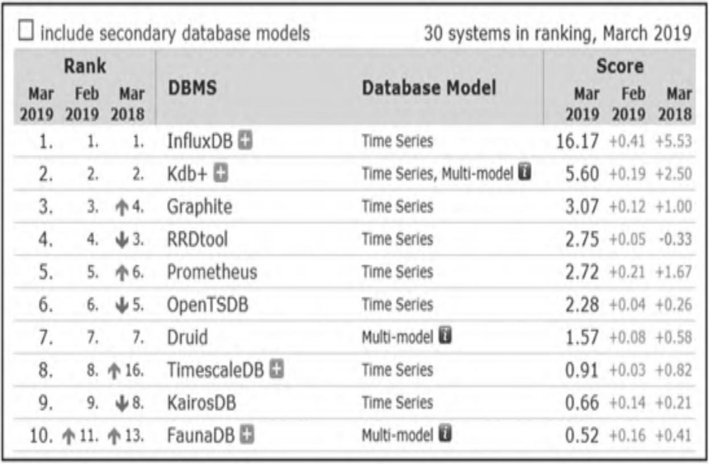

### 1.2 时序数据库发展简史

时序数据库的发展可分为四个阶段，核心演进逻辑是从通用存储适配到垂直场景优化：

| 阶段 | 代表产品 | 核心特点 |
|------|----------|----------|
| 通用关系数据库适配 | MySQL/Oracle | 可存储时序数据，但无时间维度优化，效率低 |
| 初代时序存储工具 | RRDTool、Wishper | 基于平板文件存储，数据模型单一，单机容量受限，内嵌于监控方案 |
| 通用存储定制化 | OpenTSDB、KairosDB | 基于通用存储构建，贴合时序特性做聚合分析创新，支持扩展 |
| 垂直型时序数据库 | InfluxDB | 高性能存储引擎、高效压缩算法，高级数据处理能力，适配云原生场景 |

当前主流云厂商均布局时序数据库生态，未来将呈现技术百花齐放的格局。

### 1.3 时间序列数据的特性

时序数据的核心特性围绕「时间」维度展开，具体分为三类：

- **写入特点**：平稳持续、高并发高吞吐；写多读少（写操作占比超95%）；仅写入最新数据，无更新操作
- **查询特点**：按时间范围读取；近期数据读取概率远高于历史数据；支持多精度（不同数据密度）查询
- **存储特点**：数据量巨大；有明确时效性（需设置保存周期）；多精度分层存储

### 1.4 时序数据库的基本要求

为适配时序数据的特性，TSDB需满足以下核心要求：

1. 支撑高并发、高吞吐的写入能力
2. 提供交互级聚合查询，保证低查询延迟
3. 可根据场景设计支撑海量数据存储
4. 在线场景需高可用架构保障
5. 底层需分布式架构支撑写入和存储需求

### 1.5 应用场景

#### （1）物联网设备监控分析

大型工业园区、智能设备场景下，亿级设备产生海量状态/业务数据，设备量、指标数、上报频率均处于高位，且实时性要求高。TSDB可实现亿级指标快速写入、压缩存储，支持设备实时状态分析、运行概况统计、故障诊断及业务预测。

#### （2）智慧城市建设

智能摄像头、路灯、测速仪等设备产生的海量数据，需通过TSDB实现快速写入与存储，支撑设备运行状态分析，为城市智能管控提供数据支撑。

#### （3）系统运维和业务实时监控

大规模应用集群/机房设备的CPU、内存、负载、调用量等指标，可通过TSDB实现每秒百万级写入，支持任意维度聚合分析，基于分析结果实现自动化故障报警和数据预测，达成智能运维。

**模块小结**：时序数据库是PromQL的底层存储基础，其高写入、低延迟查询、海量存储的特性，决定了PromQL能高效处理监控时序数据，需重点掌握时序数据的读写存储特性及TSDB的核心要求。

## 2. PromQL简介

PromQL（Prometheus Query Language）是Prometheus自研的功能强大的表达式语言，支持实时选择、汇聚时序数据，可完成聚合、分析、计算等操作，帮助管理员通过指标理解系统性能。

> **注意**：PromQL虽以QL结尾，但并非SQL类语言——SQL在时序数据计算上表达能力不足，而PromQL支持标签任意聚合、跨指标算术操作，内置数学/时间等丰富函数，更适配时序数据场景。

### 2.1 数据模型与数据类型

Prometheus 2.0版本重写存储引擎，具备完整持久化方案，其核心数据模型定义为：一条数据包含**指标名称（metric name）** + **一个/多个标签（label）** + **metric value**，其中「指标名称+标签集」唯一标识一条时间线（time series）。

**示例数据**：

```
promhttp_metric_handler_requests_total{code="200", instance="192.168.24.17:9090", job="prometheus"} 247668
```

- 指标名称：`promhttp_metric_handler_requests_total`（Counter类型）
- 标签：`code="200"`、`instance="192.168.24.17:9090"`、`job="prometheus"`
- 数值：247668

时序数据的存储特征可通过「垂直写、水平读」理解：横轴为时间，纵轴为时间线，数据点分布如图2所示。Prometheus写入时，同一时刻多条时间线各产生一个数据点，形成「竖线」写入特征，该特征直接影响数据写入和压缩优化策略。

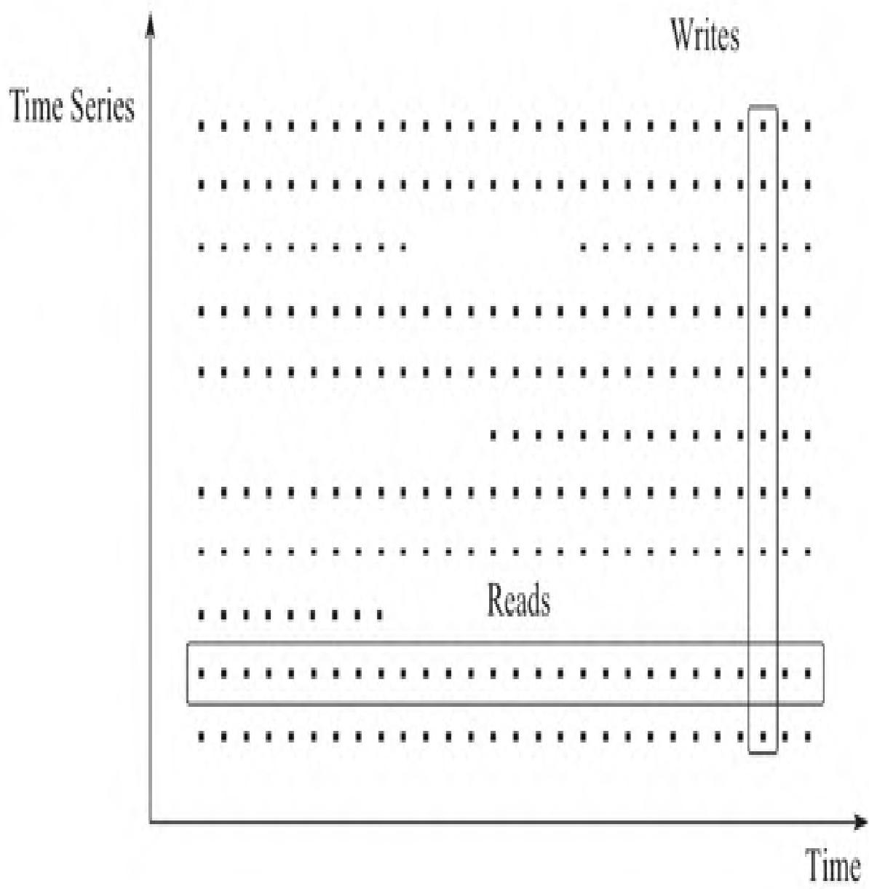

PromQL的四大核心数据类型：

| 数据类型 | 说明 |
| :--- | :--- |
| **即时向量（instant vector）** | 同一时刻的一组时间序列，每个序列仅含一个样本，所有样本共享时间戳 |
| **区间向量（range vector）** | 某一时间范围内的一组时间序列，每个序列包含多个随时间变化的数据点 |
| **标量（scalar）** | 简单浮点数字值，无时序信息 |
| **字符串（string）** | 简单字符串值，目前未实际使用 |

### 2.2 时间序列选择器

#### 2.2.1 即时向量选择器（Instant vector selectors）

返回查询时刻的最新样本，是包含零个/多个时间序列的列表（每个序列一个样本）。

**基础用法**：

- 仅指定指标名称：返回所有该指标的时间序列，例如在Prometheus Web UI执行`UP`，可查看所有target的当前运行状态（图3）。

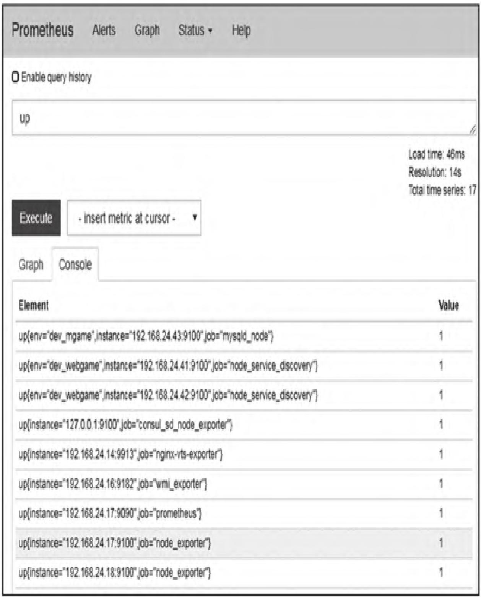

- 标签过滤：通过`{标签匹配条件}`过滤时间序列，例如`up{job="mysqld_node"}`，可精准查询指定job的target状态（图4）。

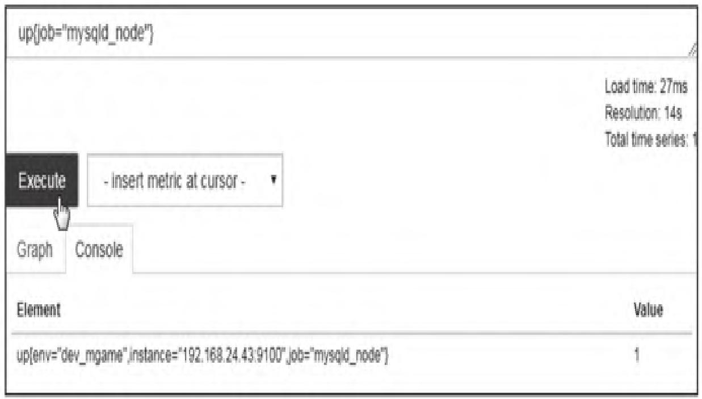

**标签匹配运算符**：

| 运算符 | 描述 |
| :--- | :--- |
| `=` | 相等匹配：标签值与给定值完全一致 |
| `!=` | 反向匹配：标签值与给定值不一致 |
| `=~` | 正则匹配：标签值匹配正则（完全锁定，需用`.*`匹配前缀/后缀） |
| `!~` | 反向正则匹配：标签值不匹配正则 |

**示例**：查询挂载在`/run`但非`/run/user`下的文件系统大小

```promql
node_filesystem_size_bytes{job="node", mountpoint=~"/run/.*", mountpoint!~"/run/user/.*"}
```

> **重要约束**：向量选择器必须指定指标名称，或至少一个非空标签匹配模式。例如`{job=~".*"}`不合法（匹配空值），`{job=~".+"}`、`{job=~".*", method="get"}`合法。

**指标名称的正则匹配**：可通过内置`__name__`标签对指标名称做匹配，例如：

- `http_requests_total` 等效于 `{__name__="http_requests_total"}`
- `{__name__=~"job:.*"}` 匹配名称以`job:`开头的所有指标

#### 2.2.2 区间向量选择器（Range vector selectors）

为每个时间序列返回指定时间范围内的多个样本，语法上在向量选择器后添加`[时间范围]`。

**示例**：查询过去1分钟内`process_cpu_seconds_total`的所有样本（图5）

```promql
process_cpu_seconds_total[1m]
```

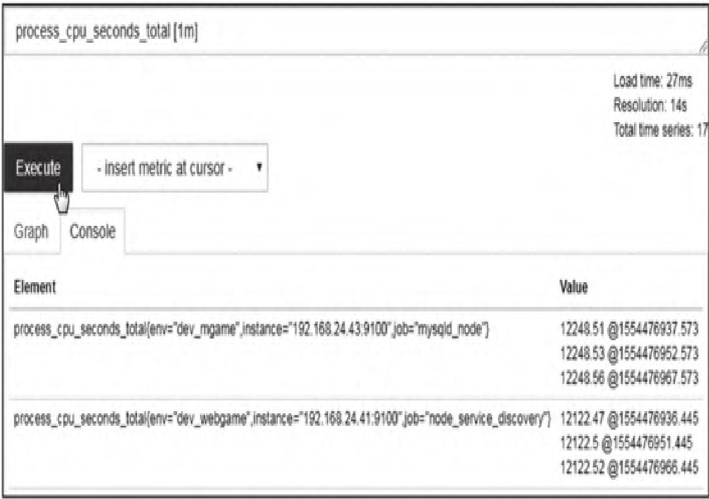

> **提示**：日常使用中，区间向量极少直接查看原始样本，通常作为`rate`/`avg_over_time`等函数的参数使用。

**支持的时间单位**：

- `s`：秒 | `m`：分钟 | `h`：小时 | `d`：天 | `w`：周 | `y`：年

#### 2.2.3 时间偏移（Offset modifier）

默认情况下，向量选择器以「当前时间」为基准，`offset`可修改查询的时间基准，支持即时向量/区间向量。

**基础用法**：

```promql
# 查询15分钟前的即时样本
process_resident_memory_bytes{job="prometheus"} offset 15m
# 查询昨天一天内的样本
process_resident_memory_bytes{job="prometheus"}[1d] offset 1d
```

**实战场景**：计算过去1小时内存使用量变化

```promql
process_resident_memory_bytes{job="prometheus"} - process_resident_memory_bytes{job="prometheus"} offset 1h
# 区间向量的偏移计算
rate(process_resident_memory_bytes{job="prometheus"}[15m]) - rate(process_resident_memory_bytes{job="prometheus"}[15m] offset 1h)
```

**模块小结**：向量选择器是PromQL的基础，需掌握即时向量的标签过滤规则、区间向量的时间范围语法，以及`offset`的时间偏移用法，核心是精准筛选目标时序数据。

## 3. PromQL聚合操作

Prometheus内置聚合操作符，仅适用于**单个即时向量**，可将向量聚合为更少元素的新时间序列。

### 3.1 聚合操作语法

```promql
<aggr-op>([parameter,] <vector expression>) [without|by (<label list>)]
```

- `without`：删除指定标签，保留其他标签
- `by`：仅保留指定标签，删除其他标签

**示例**：

- 去除`instance`标签，计算`http_requests_total`的总和：

  ```promql
  sum(http_requests_total) without(instance)
  ```

- 等效写法（仅保留`application`、`group`标签）：

  ```promql
  sum(http_requests_total) by(application, group)
  ```

- 计算所有应用的HTTP请求总量：

  ```promql
  sum(http_requests_total)
  ```

### 3.2 聚合操作符列表

| 名称 | 描述 | 实战示例 |
| :--- | :--- | :--- |
| `sum` | 求和：组内所有值相加 | `sum(http_requests_total) by (job)` |
| `max` | 最大值：返回组内最大值 | `max without(device, fstype, mountpoint)(node_filesystem_size_bytes)` |
| `min` | 最小值：返回组内最小值 | `min(node_memory_MemFree_bytes) by (instance)` |
| `avg` | 平均值：返回组内平均值 | `avg without(cpu, mode)(rate(node_cpu_seconds_total{mode="idle"}[1m]))` |
| `stddev` | 标准差：检测异常值 | `stddev(rate(http_requests_total[5m])) by (endpoint)` |
| `stdvar` | 标准方差：标准差的平方 | `stdvar(node_cpu_seconds_total{mode="system"}[1m])` |
| `count` | 计数：统计组内时间序列数 | `count without(device)(node_disk_read_bytes_total)` |
| `count_values` | 统计相同样本值的出现次数 | `count_values("value", http_requests_total)` |
| `bottomk` | 返回样本值后N位的序列 | `bottomk(3, node_memory_MemFree_bytes)` |
| `topk` | 返回样本值前N位的序列 | `topk(5, http_requests_total)` |
| `quantile` | 计算分位数（0≤φ≤1） | `quantile(0.5, http_requests_total)`（中位数） |

**模块小结**：聚合操作是PromQL实现多维度统计的核心，需结合`by`/`without`灵活控制标签维度，重点掌握`sum`/`avg`/`count`/`topk`/`quantile`等高频操作符的使用场景。

## 4. PromQL运算符

当聚合操作无法满足多指标计算需求时，可通过运算符实现即时向量的算术、关系、逻辑操作，以及向量匹配。

### 4.1 算术运算符

包含`+`（加）、`-`（减）、`*`（乘）、`/`（除）、`%`（取余）、`^`（幂运算），支持三类操作：

#### （1）scalar/scalar（标量/标量）

两个标量运算，结果仍为标量（图6）。

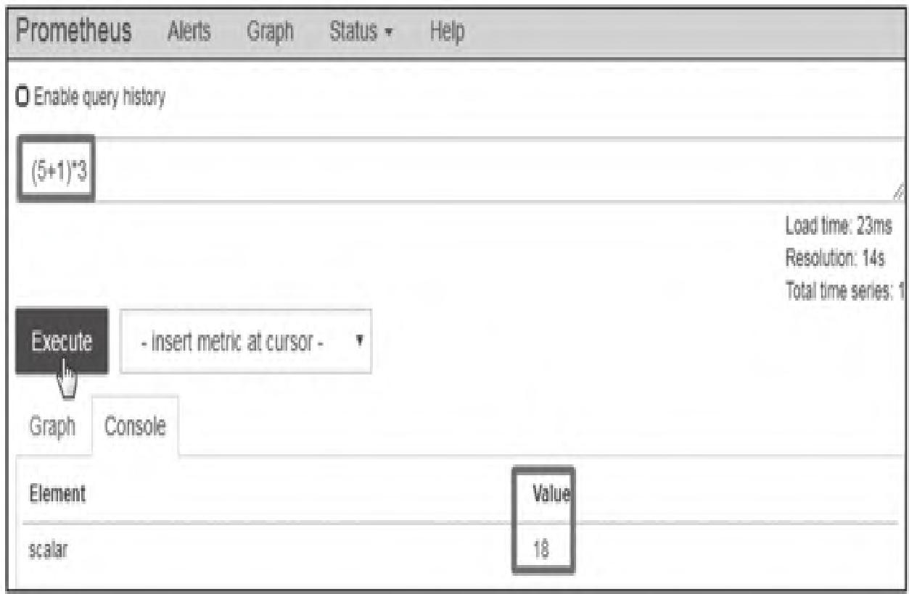

#### （2）vector/scalar（即时向量/标量）

运算符作用于向量的每个样本值，生成新序列。例如将内存字节数转换为MB：

```promql
node_memory_MemTotal_bytes/(1024*1024)
```

执行结果如图7所示。

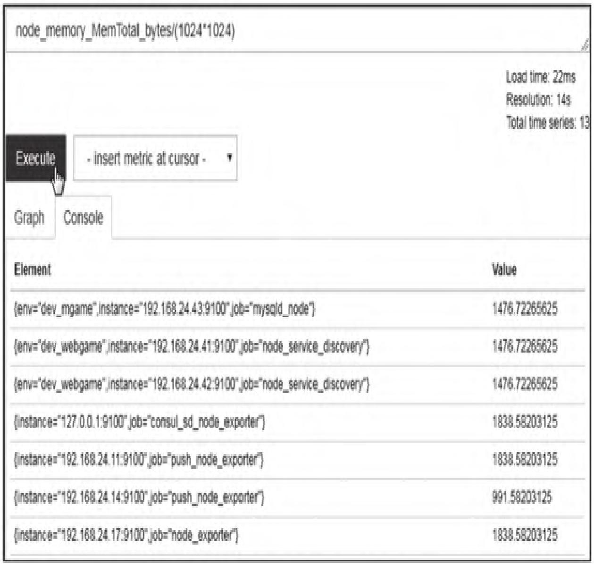

#### （3）vector/vector（即时向量/即时向量）

依次匹配左右向量中标签完全一致的元素进行运算，无匹配项则丢弃，结果不包含指标名称。例如计算磁盘读写总字节数：

```promql
node_disk_read_bytes_total + node_disk_written_bytes_total
```

执行结果如图8所示。

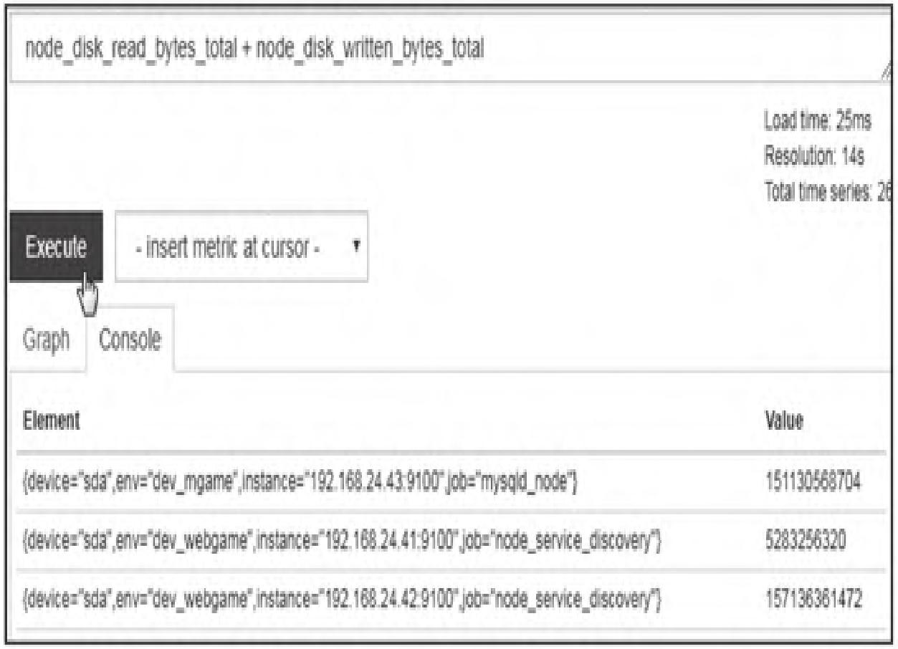

### 4.2 关系运算符

包含`==`（相等）、`!=`（不相等）、`>`（大于）、`<`（小于）、`>=`（大于等于）、`<=`（小于等于），支持三类操作，默认用于过滤时序数据，添加`bool`修饰符可返回0（false）/1（true）。

#### （1）scalar/scalar（标量/标量）

必须使用`bool`修饰符，结果为0/1（图9）。

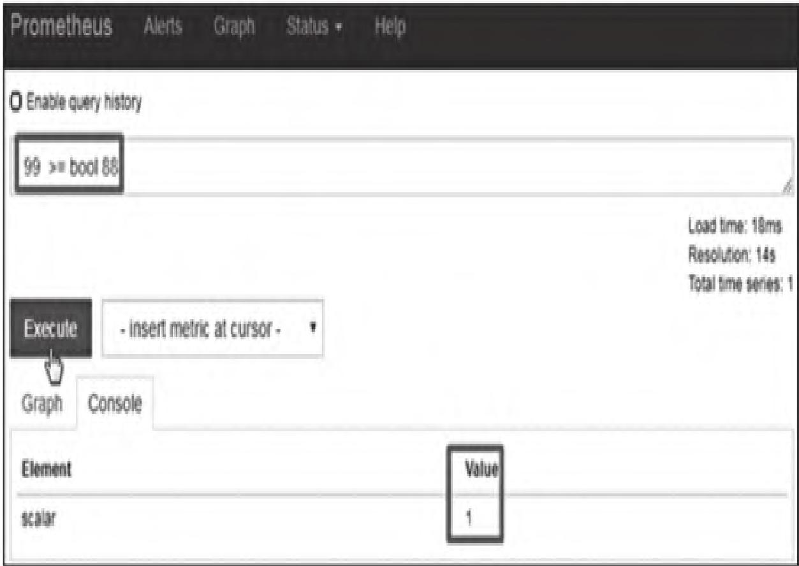

#### （2）vector/scalar（即时向量/标量）

运算符作用于每个序列，结果为true则保留，false则丢弃。例如查询ESTABLISHED状态的TCP连接数大于30的实例：

```promql
node_netstat_Tcp_CurrEstab >= 30
```

执行结果如图10所示。

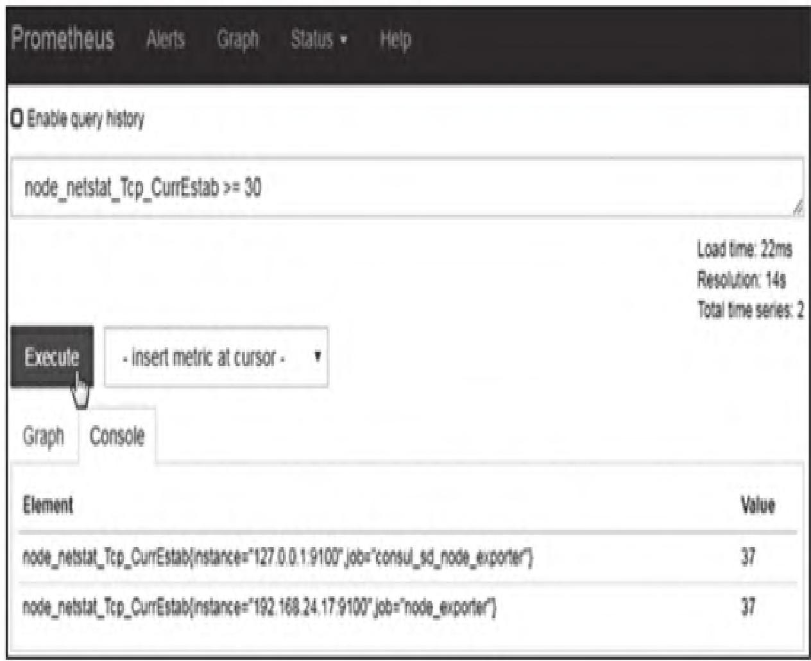

**常用场景**：监控target离线：`up{job="node_exporter"} == 0`。

#### （3）vector/vector（即时向量/即时向量）

默认过滤：匹配且结果为true的元素保留（左侧标签+值），否则丢弃；添加`bool`则保留所有元素，值为0/1。

### 4.3 向量匹配

两个即时向量运算时，需定义样本的匹配规则，PromQL支持两种模式：

#### （1）one-to-one（一对一匹配）

左右向量中标签完全一致的元素一一匹配，默认格式：`vector1 <运算符> vector2`。

**示例**：计算Prometheus进程打开文件数占最大限制的比例

```promql
process_open_fds{instance="192.168.24.17:9090", job="prometheus"} /
process_max_fds{instance="192.168.24.17:9090", job="prometheus"}
```

执行结果如图11所示（仅`__name__`标签不同，其余标签完全匹配）。

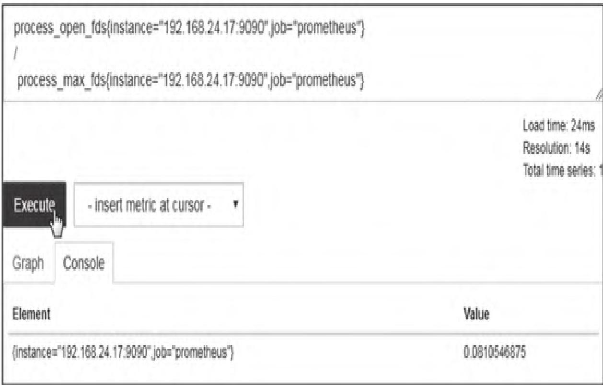

**标签匹配调整**：使用`on`（指定匹配标签）/`ignoring`（忽略匹配标签）：

```promql
<vector expr> <bin-op> ignoring(<label list>) <vector expr>
<vector expr> <bin-op> on(<label list>) <vector expr>
```

**示例**：计算CPU空闲率

```promql
sum by (instance, job) (rate(node_cpu_seconds_total{mode="idle"}[5m])) /
on (instance, job)
sum by (instance, job) (rate(node_cpu_seconds_total[5m]))
```

执行结果如图12所示。

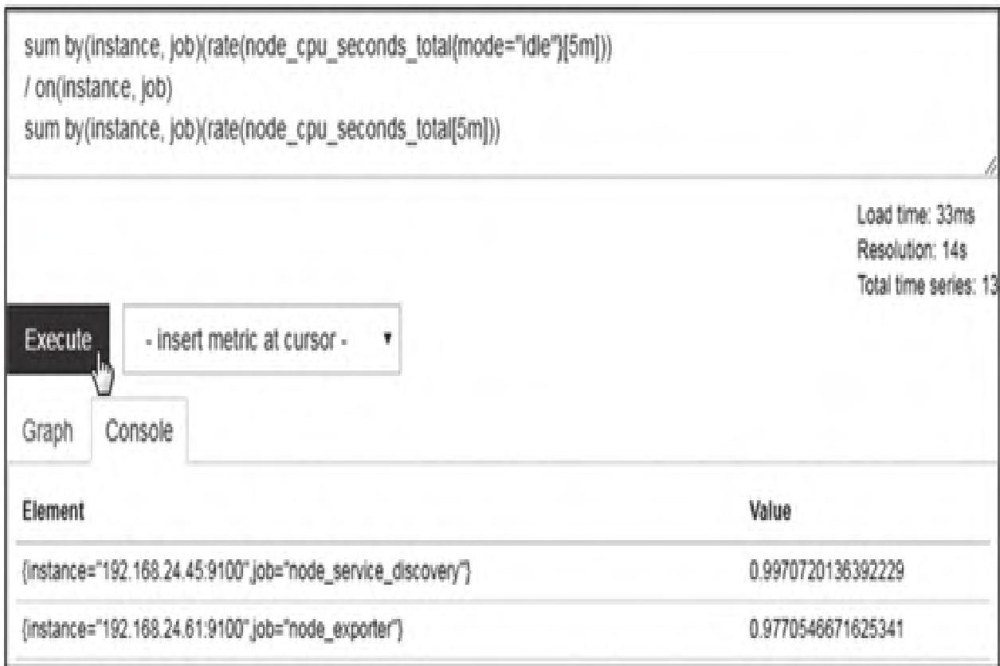

#### （2）many-to-one/one-to-many（多对一/一对多匹配）

一个向量的一个元素匹配另一个向量的多个元素，需用`group_left`（左侧基数高）/`group_right`（右侧基数高）指定基数方向：

```promql
<vector expr> <bin-op> ignoring(<label list>) group_left(<label list>) <vector expr>
<vector expr> <bin-op> on(<label list>) group_right(<label list>) <vector expr>
```

**示例**：计算各CPU模式的占比

```promql
sum without(cpu)(rate(node_cpu_seconds_total[5m])) /
ignoring(mode) group_left
sum without(mode, cpu)(rate(node_cpu_seconds_total[5m]))
```

> **提示**：一对一匹配可满足大部分场景，多对一/一对多需谨慎使用，避免结果膨胀。

### 4.4 逻辑运算符

仅适用于向量间，以多对多方式工作，包含三种：

- `vector1 and vector2`：保留vector1中与vector2标签完全匹配的元素
- `vector1 or vector2`：保留vector1所有元素 + vector2中未匹配vector1的元素
- `vector1 unless vector2`：保留vector1中未匹配vector2的元素

### 4.5 运算符优先级

从高到低依次为：

1. `^`（幂运算）
2. `*`、`/`、`%`（乘、除、取余）
3. `+`、`-`（加、减）
4. `==`、`!=`、`<=`、`<`、`>=`、`>`（关系运算）
5. `and`、`unless`（逻辑与、排除）
6. `or`（逻辑或）

**模块小结**：运算符是PromQL实现多指标计算的核心，需掌握算术/关系/逻辑运算符的使用场景，以及向量匹配的两种模式，重点注意运算符优先级和`bool`修饰符的作用。

## 5. PromQL函数

PromQL内置丰富函数，覆盖数学运算、时间处理、标签操作、指标计算等场景，以下为高频函数详解。

### 5.1 数学函数

对即时向量的每个样本独立处理，返回值删除指标名称：

| 函数 | 说明 | 示例 |
| :--- | :--- | :--- |
| `abs()` | 返回绝对值 | `abs(process_open_fds - 88)` |
| `sqrt()` | 返回平方根 | `sqrt(vector(25))` → `{} 5` |
| `round()` | 四舍五入到最近整数 | `round(vector(7.5))` → `{} 8` |
| `clamp_max()` | 设置上限 | `clamp_max(process_open_fds, 80)` |
| `clamp_min()` | 设置下限 | `clamp_min(process_open_fds, 10)` |

### 5.2 时间函数

Prometheus使用UTC时间，无时区概念，内置时间函数简化日期逻辑：

| 函数 | 返回值 | 说明 |
| :--- | :--- | :--- |
| `time()` | 当前时间戳（秒） | 查询计算时间的秒级时间戳 |
| `minute()` | 0~59 | UTC时间的分钟数 |
| `hour()` | 0~23 | UTC时间的小时数 |
| `day_of_week()` | 0~6（0=星期日） | UTC时间的星期数 |
| `day_of_month()` | 1~31 | UTC时间的月份天数 |
| `days_in_month()` | 28~31 | UTC时间的当月总天数 |
| `month()` | 1~12 | UTC时间的月份 |
| `year()` | 年份 | UTC时间的年份 |

**示例**：查询进程启动年份

```promql
year(process_start_time_seconds)
```

### 5.3 标签操作函数

#### （1）label_replace()

格式：

```promql
label_replace(v instant-vector, dst_label string, replacement string, src_label string, regex string)
```

功能：用正则匹配`src_label`的值，匹配成功则将`dst_label`设为`replacement`（支持`$1`等分组引用），否则不修改。

**示例**：从`instance`提取主机名，赋值给`host`标签

```promql
label_replace(up, "host", "$1", "instance", "(.*):.*")
```

#### （2）label_join()

格式：

```promql
label_join(v instant-vector, dst_label string, separator string, src_label_1 string, src_label_2 string, ...)
```

功能：用`separator`连接多个`src_label`的值，赋值给`dst_label`，保留指标名称。

**示例**：将`instance`和`job`用`-`连接，存入`combined`标签

```promql
label_join(node_disk_read_bytes_total, "combined", "-", "instance", "job")
```

### 5.4 Counter指标增长率

Counter类型指标（只增不减）需通过函数计算增长率，核心有三个：

#### （1）increase()

格式：`increase(v range-vector)`
功能：计算区间向量中序列的增量（取首尾样本差值），仅适用于Counter。

**示例**：计算3分钟内CPU使用增量，转换为平均每秒增长率

```promql
increase(process_cpu_seconds_total[3m]) / 180
```

#### （2）rate()

格式：`rate(v range-vector)`
功能：计算区间向量中序列的**每秒平均增长率**，自动处理Counter重置（目标重启），适用于告警、长期趋势分析。

**示例**：计算3分钟内CPU每秒平均使用率

```promql
rate(process_cpu_seconds_total[3m])
```

#### （3）irate()

格式：`irate(v range-vector)`
功能：计算区间向量中序列的**每秒即时增长率**（基于最后两个样本），灵敏度高，适用于实时监控图形，不适合告警（易受突发值影响）。

**示例**：计算3分钟内CPU每秒即时使用率

```promql
irate(process_cpu_seconds_total[3m])
```

> **选型建议**：告警/长期趋势用`rate`，实时图形用`irate`，避免irate的高灵敏度导致告警误触发。

### 5.5 Gauge指标趋势变化预测

`predict_linear(v range-vector, t scalar)`：基于区间向量的线性回归，预测`t`秒后的指标值，适用于资源耗尽预警。

**示例**：基于过去1小时数据，预测4小时内磁盘可用空间是否耗尽

```promql
predict_linear(node_filesystem_free_bytes{job="node_exporter"}[1h], 4*3600) < 0
```

**场景价值**：传统阈值告警在资源突发增长时易错过处理时间，`predict_linear`可提前预测资源耗尽风险，适用于突发业务、程序bug导致的资源暴涨场景。

**模块小结**：PromQL函数是提升查询能力的核心，需重点掌握Counter增长率函数（rate/irate/increase）和预测函数（predict_linear）的使用场景，以及标签操作函数的灵活运用。

## 6. PromQL查询分析

PromQL查询的核心是「筛选数据→处理计算→输出结果」，以下拆解查询逻辑和操作过程。

### 6.1 指标分析

以查询`node_memory_MemFree_bytes{instance="web"}[5m] offset 1m`为例，拆解执行步骤：

1. **指标选择**：获取`node_memory_MemFree_bytes`的所有时间序列
2. **标签过滤**：筛选出`instance="web"`的序列
3. **区间选择**：截取最后5分钟的样本数据
4. **时间偏移**：将查询基准时间调整为1分钟前

### 6.2 PromQL操作分析

以计算可用内存百分比`node_memory_MemFree_bytes / node_memory_MemTotal_bytes`为例，执行逻辑：

1. 按标签集（如`job="web"`）分组，在每个时间点分别获取`MemFree`和`MemTotal`的值
2. 对每组值执行除法运算，得到内存百分比
3. 保留原始标签集，生成新的即时向量

**模块小结**：PromQL查询的核心逻辑是「先筛选、后计算」，需按「指标选择→标签过滤→区间/偏移→运算符/函数聚合」的顺序拆解，确保每一步的目标数据精准。

## 【本篇核心知识点速记】

1. **时序数据库（TSDB）**：专为时序数据设计，具备高吞吐写入、低延迟查询、高压缩比特性，适用于物联网、智慧城市、系统运维等场景。
2. **PromQL数据类型**：即时向量（单时间点样本）、区间向量（时间范围样本）、标量（浮点值）、字符串（未使用）。
3. **选择器**：
   - 即时向量：`<metric>{<label>=<value>}`，支持`=`/`!=`/`=~`/`!~`匹配
   - 区间向量：`<metric>[时间范围]`，支持`s/m/h/d/w/y`单位
   - 时间偏移：`offset <duration>`，调整查询时间基准
4. **聚合操作**：sum/max/min/avg/count/topk/quantile等，结合`by`/`without`控制标签维度。
5. **运算符**：
   - 算术：`+`/`-`/`*`/`/`/`%`/`^`
   - 关系：`==`/`!=`/`>`/`<`/`>=`/`<=`（`bool`修饰符返回0/1）
   - 逻辑：`and`/`or`/`unless`
   - 向量匹配：一对一（默认）、多对一/一对多（`group_left`/`group_right`）
6. **核心函数**：
   - 数学：abs/sqrt/round/clamp_max/clamp_min
   - 时间：time()/hour()/month()/year()
   - 标签：label_replace/label_join
   - Counter增长率：rate（平均）、irate（即时）、increase（增量）
   - 趋势预测：predict_linear（线性回归）
7. **查询逻辑**：选择指标 → 标签过滤 → 区间/偏移 → 运算符/函数聚合 → 结果向量
