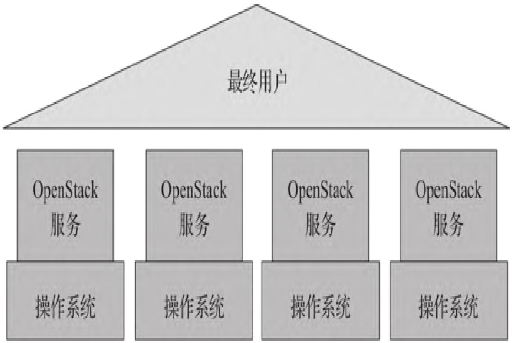
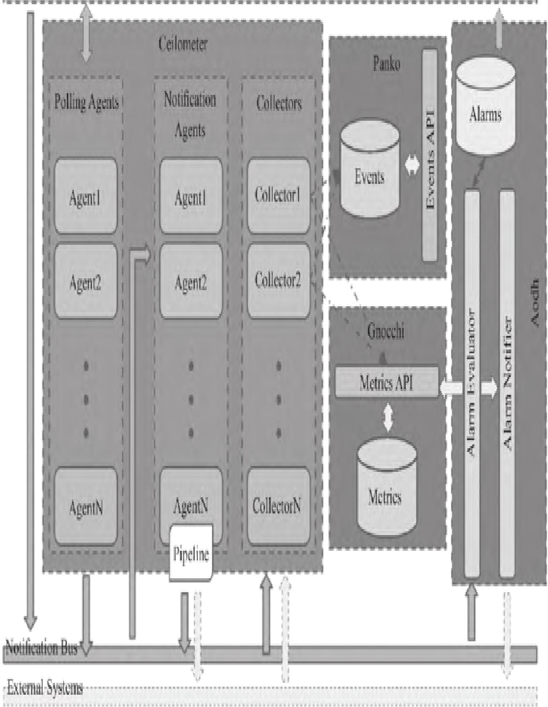
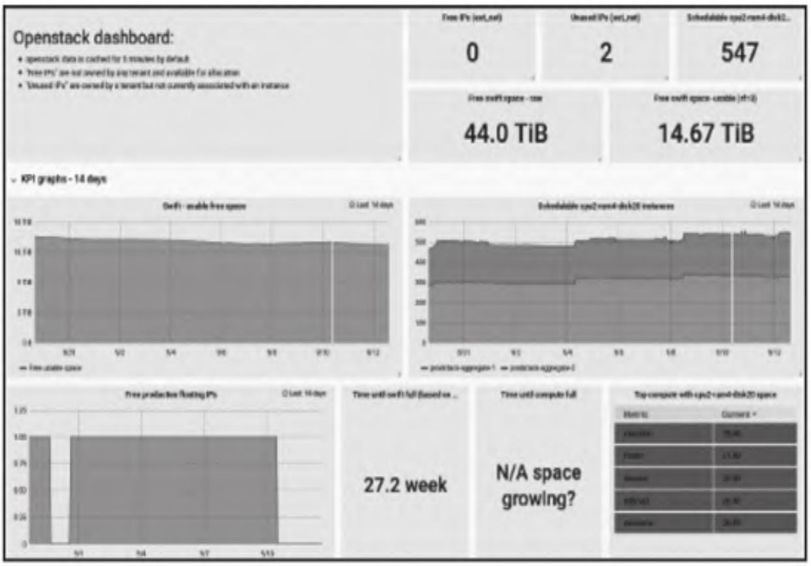
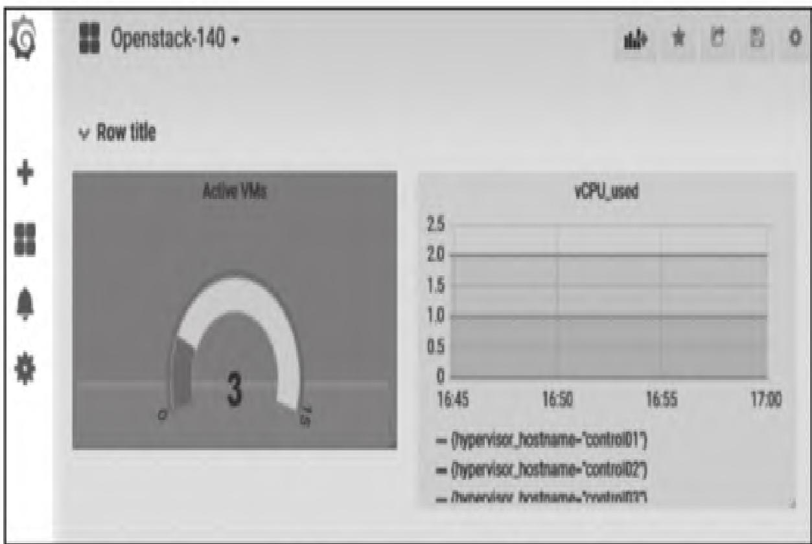

作为Prometheus监控实战系列的第九篇，本文聚焦OpenStack这一主流开源云平台的监控体系，从监控层次、官方Telemetry架构到基于Prometheus的两种落地方案（OpenStack Exporter、OpenStack Helm），全方位拆解OpenStack监控的核心逻辑与实操方法。学完本文，你将能独立完成OpenStack监控体系的搭建、指标采集与可视化落地。

【本篇核心收获】

- 掌握OpenStack监控三层架构（操作系统、服务、端到端）的核心定位与依赖关系
- 理解OpenStack Telemetry监控架构（Ceilometer/Gnocchi/Aodh/Panko）的组件职责与数据流
- 熟练部署三种主流OpenStack Exporter并集成到Prometheus，完成指标采集
- 基于Grafana实现OpenStack监控可视化（社区模板+自定义PromQL）
- 掌握OpenStack Helm在K8s上部署Prometheus/Grafana的方法与服务发现机制

## 1. OpenStack监控架构

OpenStack作为全球最活跃的开源云管理平台，被中国移动、华为、红帽等企业广泛应用。保障其稳定运行的核心是完善的监控体系——既要覆盖底层资源，也要兼顾上层服务与用户体验，这也是本文拆解的核心方向。

### 1.1 监控的三个层次

OpenStack的监控体系分为三层，层层依赖，缺一不可，是保障云平台稳定的基础框架：



- **操作系统监控**：底层基础，采集服务器CPU、内存、IO等核心指标，若操作系统异常，上层服务必然受影响（通常由系统管理员负责）。
- **服务监控**：运维视角，从OpenStack软件架构出发，校验nova/neutron/cinder等核心组件的运行状态。
- **端到端监控**：用户视角，聚焦影响用户使用的问题（如虚拟机创建失败、网络不通），优先级最高，但需依赖前两层定位根因。

**模块小结**：OpenStack监控三层架构是“基础-中间-上层”的依赖关系，操作系统是根基，服务是核心，端到端是最终目标。

### 1.2 Telemetry监控架构

Telemetry是OpenStack官方监控框架（Grizzly版本集成），核心用于采集物理/虚拟资源的计量数据、触发告警，Liberty版本后进一步优化性能与功能。其整体架构支持水平扩展，核心组件包括Ceilometer、Gnocchi、Aodh、Panko，数据流清晰且职责明确。



#### 1.2.1 各组件核心职责

| 组件       | 核心功能                                                                 |
|------------|--------------------------------------------------------------------------|
| Ceilometer | 采集层，由轮询/通知/收集代理、API服务组成，负责采集数据并发送至目标组件   |
| Gnocchi    | 存储层，将计量数据以时间序列格式存储，优化查询效率，替代传统监控数据库接口 |
| Aodh       | 告警层，根据预设规则评估指标，触发短信/邮件等告警动作                     |
| Panko      | 事件存储层，捕获日志、系统操作等文档格式的事件数据                       |

#### 1.2.2 核心数据流

1. 计算/控制节点代理调用OpenStack API，将CPU/IO等指标发送至通知总线；
2. OpenStack组件主动推送信息至通知总线，Ceilometer通知代理监听oslo消息框架获取数据；
3. 数据经Pipeline处理后发送至Collector收集器，存储到Metrics（指标）、Events（事件）；
4. Aodh根据规则评估指标，触发告警并存储到Alarms，同时执行告警动作（短信/邮件）。

#### 1.2.3 架构局限性

Ceilometer存在明显的性能瓶颈（随集群规模扩大愈发显著），且Dashboard未默认集成监控/告警功能，需自定义开发。因此生产环境中，OpenStack监控通常集成Prometheus等第三方开源工具，也是本文后续重点。

**模块小结**：Telemetry是OpenStack官方监控框架，完成“采集-存储-告警-事件”全流程，但性能与易用性不足，需结合第三方工具落地生产级监控。

## 2. OpenStack Exporter

Prometheus监控OpenStack的核心是通过Exporter采集API指标，目前主流的开源Exporter有三种，均通过调用OpenStack API获取指标并暴露给Prometheus。

### 2.1 主流Exporter对比

| Exporter类型       | 开发主体/语言 | 核心特点                                   | 源码地址                                          |
|--------------------|---------------|--------------------------------------------|---------------------------------------------------|
| Prometheus官网推荐版 | Linaro/Go     | 支持neutron/nova/cinder/identity等组件     | <https://github.com/openstack-exporter/openstack-exporter> |
| Canonical版        | Canonical     | 采集OpenStack高层级业务指标                | <https://github.com/CanonicalLtd/prometheus-openstack-exporter> |
| AT&T社区版         | AT&T社区      | 通用API采集，适配性强                      | <https://github.com/att-comdev/prometheus-openstack-exporter> |

**避坑指南**：三种Exporter均建议部署在Ubuntu 16.04及以上版本，核心逻辑一致（定时采集API数据→缓存→暴露给Prometheus），可根据监控粒度需求选择。

### 2.2 OpenStack Exporter部署（AT&T社区版为例）

以AT&T社区版`prometheus-openstack-exporter`为例，讲解Docker方式部署，核心分为“环境准备→镜像构建→容器运行→Prometheus集成”四步。

#### 环境信息

- Exporter部署节点：Ubuntu虚拟机（IP：192.168.1.32），需能访问OpenStack API（192.168.1.102）；
- 核心逻辑：每30秒调用OpenStack API采集指标并缓存，暴露9183端口供Prometheus抓取（默认1分钟一次）。

#### 2.2.1 准备安装环境

首先安装OpenStack Python依赖库与Prometheus Python客户端：

```bash
# 安装OpenStack组件客户端库
sudo apt-get install python-neutronclient python-novaclient python-keystoneclient python-netaddr python-cinderclient
# 安装Prometheus Python客户端
apt-get install python-prometheus-client
```

#### 2.2.2 构建Docker镜像

1. 克隆源码仓库：

```bash
git clone https://github.com/CanonicalLtd/prometheus-openstack-exporter
cd prometheus-openstack-exporter
```

1. 创建Dockerfile（完整保留所有配置，确保依赖完整）：

```dockerfile
FROM ubuntu:16.04
MAINTAINER JimChen<xxx@sina.com>
LABEL Description="Prometheus Openstack Exporter docker image"
RUN apt-get update \
  && apt-get install -y python-neutronclient python-novaclient python-keystoneclient \
     python-netaddr python-cinderclient python-prometheus-client \
  && mkdir -p /var/cache/prometheus-openstack-exporter/ \
  && mkdir -p /etc/prometheus-openstack-exporter
VOLUME /etc/prometheus-openstack-exporter
EXPOSE 9183
COPY ./prometheus-openstack-exporter /
COPY ./openrc.sh /etc/prometheus-openstack-exporter/
COPY ./prometheus-openstack-exporter.yaml /etc/prometheus-openstack-exporter/
RUN chmod 755 /prometheus-openstack-exporter \
  && chmod 777 /var/cache/prometheus-openstack-exporter
CMD . /etc/prometheus-openstack-exporter/openrc.sh \
  && /prometheus-openstack-exporter /etc/prometheus-openstack-exporter/prometheus-openstack-exporter.yaml
```

1. 拷贝OpenStack环境变量文件：
将OpenStack的`admin-openrc.sh`（包含认证信息）拷贝到当前目录，示例内容：

```bash
export OS_PROJECT_DOMAIN_NAME=Default
export OS_USER_DOMAIN_NAME=Default
export OS_PROJECT_NAME=admin
export OS_TENANT_NAME=admin
export OS_USERNAME=admin
export OS_PASSWORD=admin&123456
export OS_AUTH_URL=http://192.168.1.102:35357/v3
export OS_INTERFACE=internal
export OS_IDENTITY_API_VERSION=3
export OS_REGION_NAME=RegionBJ
```

执行拷贝命令：

```bash
cp /etc/kolla/admin-openrc.sh ./openrc.sh
```

1. 构建并运行Docker镜像：

```bash
# 构建镜像
docker build -t prom_openstack_exporter .
# 运行容器（挂载环境变量文件，暴露9183端口）
docker run -d --name prom_openstack_exporter -p 9183:9183 \
  -v /prom_data/prometheus-openstack-exporter/openrc.sh:/etc/prometheus-openstack-exporter/openrc.sh \
  prom_openstack_exporter
```

**避坑指南**：挂载的`openrc.sh`路径需与本地实际路径一致，否则Exporter无法获取OpenStack API认证信息，导致采集失败。

#### 2.2.3 集成到Prometheus

修改Prometheus配置文件`/etc/prometheus/prometheus.yml`，添加Exporter抓取任务：

```yaml
global:
  scrape_interval: 15s
  evaluation_interval: 15s
scrape_configs:
  - job_name: 'prom_openstack_exporter'
    scrape_interval: 5s  # 缩短抓取间隔，提升指标实时性
    static_configs:
      - targets: ['192.168.1.32:9183']  # 替换为Exporter实际IP:端口
```

**注意事项**：修改配置后需重启Prometheus或执行热加载（`curl -X POST http://prometheus-ip:9090/-/reload`），确保抓取任务生效。

**模块小结**：OpenStack Exporter部署核心是“依赖安装→镜像构建→认证配置→Prometheus集成”，关键是保证API认证信息正确、端口暴露正常。

### 2.3 OpenStack监控可视化（Grafana）

完成指标采集后，通过Grafana实现可视化，支持“社区模板导入”和“自定义仪表盘”两种方式，需先确保Grafana已配置Prometheus数据源（地址：<http://192.168.1.32:9090）。>

#### 2.3.1 利用社区模板快速落地

Grafana社区提供了适配OpenStack Exporter的可视化模板（支持v5.2.1+），步骤如下：

1. 访问模板地址：<https://grafana.com/dashboards/7924，下载`openstack-clouds-jacekn_rev1.json`文件；>
2. 登录Grafana（<http://192.168.1.32:3000，默认账号/密码：admin/admin）；>
3. 点击“Import”→上传JSON文件→选择Prometheus数据源→完成导入。

导入后可查看OpenStack核心指标：KPI趋势、Neutron网络、Nova计算、Swift存储、实例状态、Exporter运行状态等，效果如下：



#### 2.3.2 自定义仪表盘（核心指标示例）

若需聚焦核心指标，可自定义PromQL查询并配置图表，示例如下：

1. **总活动VM数**：

```promql
sum(nova_instances{instance_state="ACTIVE"})
```

2. **每台物理机已使用vCPU数**：

```promql
sum(hypervisor_vcpus_used) by (hypervisor_hostname)
```

自定义仪表盘效果如下：



**模块小结**：Grafana可视化核心是“数据源配置+指标查询”，社区模板可快速落地全量监控，自定义查询可聚焦核心指标，按需选择即可。

## 3. OpenStack Helm监控

OpenStack Helm是AT&T主导的工具集，用于在Kubernetes上管理OpenStack生命周期，同时支持Prometheus/Grafana的部署与自动服务发现，适合K8s环境下的OpenStack监控。

### 3.1 基于OpenStack Helm部署Prometheus

OpenStack Helm的Prometheus Chart包含sidecar容器（Apache反向代理）提供身份验证，支持通过K8s endpoints/pod注解实现自动服务发现。

#### 3.1.1 Prometheus核心配置

通过`values.yaml`配置Prometheus运行参数，示例如下：

```yaml
conf:
  prometheus:
    command_line_flags:
      log.level: info
      query.max_concurrency: 20
      query.timeout: 2m
      storage.tsdb.path: /var/lib/prometheus/data
      storage.tsdb.retention: 7d  # 数据保留7天
      web.enable_admin_api: true  # 启用管理API
      web.enable_lifecycle: true  # 启用热加载
    # 抓取配置（可自定义目标）
    scrape_configs:
      # 自定义抓取规则
```

#### 3.1.2 K8s服务发现机制（核心）

OpenStack Helm通过注解实现Prometheus自动发现抓取目标，核心注解函数定义如下（Go模板）：

```go
{{- define "helm-toolkit.snippets.prometheus.service_annotations" -}}
{{- $config := index . 0 -}}
{{- if $config.scrape -}}prometheus.io/scrape: {{ $config.scrape | quote }}{{- end -}}
{{- if $config.scheme -}}prometheus.io/scheme: {{ $config.scheme | quote }}{{- end -}}
{{- if $config.path -}}prometheus.io/path: {{ $config.path | quote }}{{- end -}}
{{- if $config.port -}}prometheus.io/port: {{ $config.port | quote }}{{- end -}}
{{- end -}}

{{- define "helm-toolkit.snippets.prometheus.pod_annotations" -}}
{{- $config := index . 0 -}}
{{- if $config.scrape -}}prometheus.io/scrape: {{ $config.scrape | quote }}{{- end -}}
{{- if $config.path -}}prometheus.io/path: {{ $config.path | quote }}{{- end -}}
{{- if $config.port -}}prometheus.io/port: {{ $config.port | quote }}{{- end -}}
{{- end -}}
```

核心注解说明（需添加到Service/Pod的annotations中）：

| 注解键                | 取值        | 作用                                       |
|-----------------------|-------------|--------------------------------------------|
| prometheus.io/scrape  | true/false  | 是否为Prometheus抓取目标（必填，需设为true） |
| prometheus.io/scheme  | http/https  | 抓取协议（默认http）                       |
| prometheus.io/path    | 路径        | 指标暴露路径（默认/metrics）               |
| prometheus.io/port    | 端口号      | 指标暴露端口（默认服务端口）               |

#### 3.1.3 特殊目标配置（Kubelet/cAdvisor）

抓取Kubelet、cAdvisor需添加额外参数：

```
--cadvisor-port=0
--enable-custom-metrics
```

#### 3.1.4 部署命令

```bash
helm install --namespace=openstack local/prometheus --name=prometheus
```

**扩展说明**：OpenStack Helm Infra提供了多个Exporter Chart，可按需启用：

- `prometheus-kube-state-metrics`：K8s核心指标
- `prometheus-node-exporter`：节点/内核指标
- `prometheus-openstack-metrics-exporter`：OpenStack服务指标

**模块小结**：OpenStack Helm部署Prometheus的核心是“配置文件定义参数+注解实现自动发现”，适合K8s环境下的OpenStack集群监控。

### 3.2 基于OpenStack Helm部署Grafana

OpenStack Helm Infra提供Grafana Chart，支持通过YAML配置数据源、仪表盘，适配Prometheus指标可视化。

#### 3.2.1 Grafana基础配置

通过`values.yaml`映射`grafana.ini`配置，示例如下：

```yaml
conf:
  grafana:
    paths:
    server:
      http_port: 3000
      root_url: http://192.168.1.32:3000
    database:
    session:
    security:
      admin_password: admin  # 管理员密码
    users:
    log:
    log_console:
    dashboards.json:
    grafana_net:
```

#### 3.2.2 Prometheus数据源配置

```yaml
conf:
  provisioning:
    datasources:
      monitoring:
        name: prometheus
        type: prometheus
        access: proxy
        orgId: 1
        url: http://prometheus:9090  # Prometheus服务地址
```

#### 3.2.3 仪表盘配置

通过YAML定义仪表盘（自动转换为JSON并加载到Grafana Pod）：

```yaml
conf:
  dashboards:
    # 自定义仪表盘YAML配置（可从JSON转换）
```

**避坑指南**：可通过`json2yaml`工具将Grafana社区JSON模板转换为YAML，直接集成到Helm配置中，无需手动导入。

**模块小结**：OpenStack Helm部署Grafana的核心是“YAML配置映射+自动加载仪表盘”，可快速适配K8s环境下的可视化需求。

## 本章小结

本文从OpenStack监控的三层架构出发，先拆解官方Telemetry架构的核心逻辑，再详细讲解两种基于Prometheus的落地方案：OpenStack Exporter（通用API采集）、OpenStack Helm（K8s环境自动部署），同时覆盖Grafana可视化的全流程。OpenStack监控体系庞大，除核心组件外，还需兼顾虚拟机、容器、底层主机的监控，需结合实际场景补充完善。

【本篇核心知识点速记】

- **监控三层结构**：操作系统（基础）→服务（核心）→端到端（用户视角），层层依赖；
- **Telemetry架构**：Ceilometer（采集）+Gnocchi（时序存储）+Aodh（告警）+Panko（事件），性能瓶颈需结合第三方工具；
- **OpenStack Exporter**：三种主流实现，Docker部署核心是API认证配置，暴露9183端口供Prometheus抓取；
- **Grafana可视化**：社区模板（ID 7924）快速落地，自定义PromQL聚焦核心指标；
- **OpenStack Helm**：K8s环境下通过注解实现Prometheus自动发现，YAML配置Grafana数据源/仪表盘；
- **核心注解**：`prometheus.io/scrape=true`是Prometheus自动发现的核心开关。
