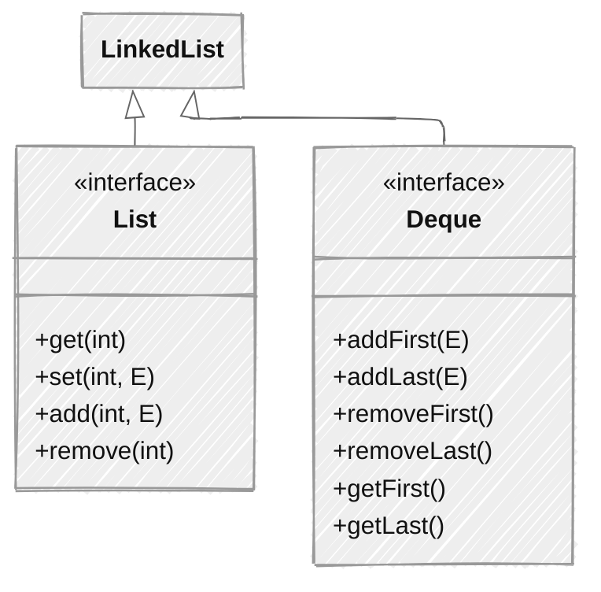

## 概述

`List`接口是Java集合框架中的一个核心接口，继承自`Collection`接口，代表一个有序、可重复的集合。它允许通过索引访问元素，并提供了丰富的操作方法来添加、删除和修改元素。

## 核心特征

+ **有序性**：元素按照插入顺序或通过排序操作后的顺序排列
+ **可重复性**：允许存储重复的元素
+ **索引访问**：支持通过整数索引快速访问和修改元素
+ **丰富的操作**：提供了大量用于操作元素的方法

## `List`接口定义

```java
public interface List<E> extends Collection<E> {
    // 基本操作
    int size();
    boolean isEmpty();
    boolean contains(Object o);
    Iterator<E> iterator();
    Object[] toArray();
    <T> T[] toArray(T[] a);
    
    // 修改操作
    boolean add(E e);
    boolean remove(Object o);
    
    // 批量操作
    boolean containsAll(Collection<?> c);
    boolean addAll(Collection<? extends E> c);
    boolean addAll(int index, Collection<? extends E> c);
    boolean removeAll(Collection<?> c);
    boolean retainAll(Collection<?> c);
    void clear();
    
    // 相等性和哈希码
    boolean equals(Object o);
    int hashCode();
    
    // List特有操作
    E get(int index);
    E set(int index, E element);
    void add(int index, E element);
    E remove(int index);
    int indexOf(Object o);
    int lastIndexOf(Object o);
    ListIterator<E> listIterator();
    ListIterator<E> listIterator(int index);
    List<E> subList(int fromIndex, int toIndex);
    
    // Java 8+ 方法
    default void replaceAll(UnaryOperator<E> operator) {
        Objects.requireNonNull(operator);
        final ListIterator<E> li = this.listIterator();
        while (li.hasNext()) {
            li.set(operator.apply(li.next()));
        }
    }
    
    default void sort(Comparator<? super E> c) {
        Object[] a = this.toArray();
        Arrays.sort(a, (Comparator) c);
        ListIterator<E> i = this.listIterator();
        for (Object e : a) {
            i.next();
            i.set((E) e);
        }
    }
}
```

## 主要实现类对比


## `ArrayList` vs `LinkedList` vs `Vector` 特性对比

| 特性 | ArrayList | LinkedList | Vector |
| :---: | :---: | :---: | :---: |
| 底层实现 | 动态数组 | 双向链表 | 动态数组 |
| 随机访问 | O(1) | O(n) | O(1) |
| 添加元素 | O(1) 平均（末尾） | O(1) | O(1) 平均 |
| 插入元素 | O(n) | O(1) | O(n) |
| 删除元素 | O(n) | O(1) | O(n) |
| 线程安全 | 否 | 否 | 是 |
| 内存占用 | 较低 | 较高（每个节点额外存储前后指针） | 较高 |
| 遍历性能 | 高（连续内存） | 低（分散内存） | 高 |
| 扩容机制 | 原容量1.5倍 | 无需扩容 | 原容量2倍（可指定增长因子） |

## `ArrayList`底层实现原理

### `ArrayList`使用示例

下面是一个简单的`ArrayList`使用示例，展示最基础的创建、添加、遍历等操作：

```java
public class ArrayListBasicExample {
    public static void main(String[] args) {
        // 创建一个ArrayList集合
        ArrayList<String> fruits = new ArrayList<>();
        
        // 添加元素
        fruits.add("苹果");  // 直接添加到末尾
        fruits.add("香蕉");
        fruits.add("橙子");
        System.out.println("添加元素后: " + fruits);  // 输出: [苹果, 香蕉, 橙子]
        
        // 在指定位置插入元素
        fruits.add(1, "葡萄");  // 在索引1的位置插入
        System.out.println("插入元素后: " + fruits);  // 输出: [苹果, 葡萄, 香蕉, 橙子]
        
        // 获取元素
        String firstFruit = fruits.get(0);
        System.out.println("第一个水果: " + firstFruit);  // 输出: 苹果
        
        // 修改元素
        fruits.set(2, "草莓");
        System.out.println("修改元素后: " + fruits);  // 输出: [苹果, 葡萄, 草莓, 橙子]
        
        // 判断是否包含某个元素
        boolean hasApple = fruits.contains("苹果");
        System.out.println("包含苹果: " + hasApple);  // 输出: true
        
        // 遍历ArrayList的三种方式
        
        // 1. 使用for循环遍历
        System.out.println("\n使用for循环遍历:");
        for (int i = 0; i < fruits.size(); i++) {
            System.out.println("第" + (i+1) + "个水果: " + fruits.get(i));
        }
        
        // 2. 使用增强for循环（foreach）遍历
        System.out.println("\n使用foreach遍历:");
        for (String fruit : fruits) {
            System.out.println("水果: " + fruit);
        }
        
        // 3. 使用迭代器遍历
        System.out.println("\n使用迭代器遍历:");
        Iterator<String> iterator = fruits.iterator();
        while (iterator.hasNext()) {
            String fruit = iterator.next();
            System.out.println("水果: " + fruit);
        }
        
        // 删除元素
        fruits.remove(1);  // 根据索引删除
        System.out.println("删除索引1的元素后: " + fruits);  // 输出: [苹果, 草莓, 橙子]
        
        fruits.remove("橙子");  // 根据元素值删除
        System.out.println("删除橙子后: " + fruits);  // 输出: [苹果, 草莓]
        
        // 清空集合
        fruits.clear();
        System.out.println("清空集合后: " + fruits);  // 输出: []
        System.out.println("集合是否为空: " + fruits.isEmpty());  // 输出: true
    }
}
```

### 基本结构

```java
public class ArrayList<E> extends AbstractList<E>
        implements List<E>, RandomAccess, Cloneable, java.io.Serializable {
    
    // 默认初始容量
    private static final int DEFAULT_CAPACITY = 10;
    
    // 空数组实例（用于空实例）
    private static final Object[] EMPTY_ELEMENTDATA = {};
    
    // 默认空数组（用于默认构造函数）
    private static final Object[] DEFAULTCAPACITY_EMPTY_ELEMENTDATA = {};
    
    // 存储元素的数组
    transient Object[] elementData;
    
    // 实际元素个数
    private int size;
    
    // 最大数组大小
    private static final int MAX_ARRAY_SIZE = Integer.MAX_VALUE - 8;
}
```

### 扩容机制详解

`ArrayList`的扩容是其最核心的特性之一，它通过自动扩容来支持动态增长。

#### 扩容触发条件

当调用`add()`方法时，如果当前数组已满（`size == elementData.length`），则触发扩容。

#### 扩容过程

```java
// add方法
public boolean add(E e) {
    ensureCapacityInternal(size + 1);  // 确保容量足够
    elementData[size++] = e;  // 添加元素
    return true;
}

// 确保内部容量足够
private void ensureCapacityInternal(int minCapacity) {
    ensureExplicitCapacity(calculateCapacity(elementData, minCapacity));
}

// 计算所需容量
private static int calculateCapacity(Object[] elementData, int minCapacity) {
    if (elementData == DEFAULTCAPACITY_EMPTY_ELEMENTDATA) {
        return Math.max(DEFAULT_CAPACITY, minCapacity);  // 首次添加至少10个容量
    }
    return minCapacity;
}

// 确保显式容量
private void ensureExplicitCapacity(int minCapacity) {
    modCount++;
    
    // 溢出检查
    if (minCapacity - elementData.length > 0)
        grow(minCapacity);  // 扩容
}

// 核心扩容方法
private void grow(int minCapacity) {
    // 当前容量
    int oldCapacity = elementData.length;
    // 扩容为原来的1.5倍
    int newCapacity = oldCapacity + (oldCapacity >> 1);
    // 如果扩容1.5倍后仍不足，则直接使用所需容量
    if (newCapacity - minCapacity < 0)
        newCapacity = minCapacity;
    // 检查是否超过最大容量
    if (newCapacity - MAX_ARRAY_SIZE > 0)
        newCapacity = hugeCapacity(minCapacity);
    // 复制数组
    elementData = Arrays.copyOf(elementData, newCapacity);
}

// 处理大容量
private static int hugeCapacity(int minCapacity) {
    if (minCapacity < 0) // 溢出
        throw new OutOfMemoryError();
    return (minCapacity > MAX_ARRAY_SIZE) ?
        Integer.MAX_VALUE :
        MAX_ARRAY_SIZE;
}
```

### 扩容机制流程图


## `ArrayList`在不同`JDK`版本的优化演进

`ArrayList`作为Java集合框架中最常用的实现类之一，在不同JDK版本中经历了多次优化和改进。以下是主要版本间的关键变化：

### `JDK 7` vs `JDK 8` vs `JDK 9+` 版本对比

| 特性 | JDK 7 | JDK 8 | JDK 9+ |
| :---: | :---: | :---: | :---: |
| 初始容量处理 | 使用单一的空数组实例 | 区分EMPTY_ELEMENTDATA和DEFAULTCAPACITY_EMPTY_ELEMENTDATA | 保持JDK 8的实现，但优化了内存使用 |
| 扩容算法 | 1.5倍扩容 | 保持1.5倍扩容，但优化了边界条件检查 | 增加了更智能的扩容策略建议 |
| 批量操作性能 | 基础实现 | 优化了removeAll/containsAll等方法 | 进一步优化，减少不必要的数组复制 |
| Collection工厂方法 | 不支持 | 不支持 | 支持List.of()创建不可变列表 |
| 数组复制 | System.arraycopy | 优化的Arrays.copyOf | 进一步优化，增加并行复制支持 |
| 迭代器实现 | 基础实现 | 增加了forEachRemaining方法 | 保持JDK 8的实现，优化了内存占用 |
| 索引查找 | 线性查找 | 优化的indexOf/lastIndexOf实现 | 增加了更高效的算法实现 |

### `JDK 7` 中的关键实现

`JDK 7`中的`ArrayList`实现已经相当成熟，但在初始化和内存使用方面还有改进空间：

```java
// `JDK 7`中的构造函数简化版
public ArrayList() {
    this.elementData = EMPTY_ELEMENTDATA; // 所有空`ArrayList`共享同一个空数组
}

// 首次添加元素时的扩容逻辑相对简单
```

### `JDK 8` 中的主要优化

`JDK 8`引入了一些重要的优化，特别是在初始容量处理和边界条件检查方面：

1. **区分两种空数组状态**：
    + `EMPTY_ELEMENTDATA`：用户显式指定初始容量为0时使用
    + `DEFAULTCAPACITY_EMPTY_ELEMENTDATA`：默认构造函数使用
2. **更精确的首次扩容处理**：

```java
// 计算所需容量的优化
private static int calculateCapacity(Object[] elementData, int minCapacity) {
    if (elementData == DEFAULTCAPACITY_EMPTY_ELEMENTDATA) {
        return Math.max(DEFAULT_CAPACITY, minCapacity); // 首次添加至少10个容量
    }
    return minCapacity;
}
```

3. **优化的索引查找实现**：
    + 改进了`indexOf`和`lastIndexOf`方法，减少不必要的比较操作
4. **增加了forEachRemaining方法**：
    + 为迭代器添加了批量处理元素的能力，提高处理大量数据的效率

### `JDK 9+` 中的进一步改进

`JDK 9`及更高版本在`JDK 8`的基础上进行了更深入的优化：

1. **集合工厂方法**：
    + 引入`List.of()`静态工厂方法，创建不可变列表
    + 优化了内存使用，对于小型固定大小的列表特别高效
2. **性能调优**：
    + 进一步优化了数组复制操作
    + 改进了并发修改检测的实现
3. **JDK 11+ 特性**：
    + 增加了更智能的扩容策略建议
    + 优化了序列化和反序列化性能

### 实际应用建议

1. **JDK 8+ 中的最佳实践**：
    + 对于小型集合，考虑使用`List.of()`工厂方法（JDK 9+）
    + 对于需要频繁修改的大型集合，仍推荐使用`new ArrayList()`并预设合理容量
2. **版本迁移注意事项**：
    + 从`JDK 7`迁移到`JDK 8+`时，空`ArrayList`的行为有细微变化，但通常不会影响现有代码
    + 使用`JDK 9+`的工厂方法时要注意返回的是不可变集合

### `ArrayList`性能优化技巧

1. **预设容量**：如果能预估集合大小，在构造时指定初始容量，避免频繁扩容

```java
List<String> list = new ArrayList<>(100);  // 预设100个元素的容量
```

2. **批量添加**：使用`addAll()`方法批量添加元素，减少扩容次数

```java
list.addAll(anotherList);  // 批量添加
```

3. **及时释放空间**：不再需要大量元素时，调用`trimToSize()`释放多余内存

```java
list.trimToSize();  // 调整容量为实际大小
```

4. **避免随机删除**：避免在中间位置频繁删除元素，因为这会导致数组复制

```java
// 尽量不要这样做
for (int i = list.size() - 1; i >= 0; i--) {
    if (condition) {
        list.remove(i);  // 中间删除，效率低
    }
}
```

5. **使用subList()视图**：需要子列表时，使用`subList()`方法创建视图，避免复制数据

```java
List<String> subList = list.subList(1, 5);  // 创建视图，不复制数据
```

## LinkedList底层实现原理

### 基本结构

```java
public class LinkedList<E> extends AbstractSequentialList<E>
        implements List<E>, Deque<E>, Cloneable, java.io.Serializable {
    
    // 链表长度
    transient int size = 0;
    
    // 头节点
    transient Node<E> first;
    
    // 尾节点
    transient Node<E> last;
    
    // 节点内部类
    private static class Node<E> {
        E item;          // 元素值
        Node<E> next;    // 后继节点
        Node<E> prev;    // 前驱节点
        
        Node(Node<E> prev, E element, Node<E> next) {
            this.item = element;
            this.next = next;
            this.prev = prev;
        }
    }
}
```

### 双重身份

`LinkedList`不仅仅是一个`List`实现，还是一个`Deque`（双端队列）实现，这使得它同时拥有列表和队列的特性。



### 添加元素过程

```java
// 添加到末尾
public boolean add(E e) {
    linkLast(e);
    return true;
}

// 添加到指定位置
public void add(int index, E element) {
    checkPositionIndex(index);
    
    if (index == size)  // 如果是添加到末尾
        linkLast(element);
    else  // 如果是插入到中间
        linkBefore(element, node(index));
}

// 链接到末尾
void linkLast(E e) {
    final Node<E> l = last;
    final Node<E> newNode = new Node<>(l, e, null);
    last = newNode;
    if (l == null)
        first = newNode;  // 空链表情况
    else
        l.next = newNode;
    size++;
    modCount++;
}

// 链接到指定节点之前
void linkBefore(E e, Node<E> succ) {
    // 获取后继节点的前驱
    final Node<E> pred = succ.prev;
    // 创建新节点
    final Node<E> newNode = new Node<>(pred, e, succ);
    // 更新后继节点的前驱为新节点
    succ.prev = newNode;
    // 更新前驱节点的后继为新节点
    if (pred == null)
        first = newNode;  // 如果是插入到头部
    else
        pred.next = newNode;
    size++;
    modCount++;
}

// 查找指定位置的节点
Node<E> node(int index) {
    // 优化：根据索引位置选择从头或从尾开始查找
    if (index < (size >> 1)) {
        Node<E> x = first;
        for (int i = 0; i < index; i++)
            x = x.next;
        return x;
    } else {
        Node<E> x = last;
        for (int i = size - 1; i > index; i--)
            x = x.prev;
        return x;
    }
}
```

### `LinkedList`使用示例

下面是一个简单的`LinkedList`使用示例，展示其基本操作和常用方法：

```java
public class LinkedListBasicExample {
    public static void main(String[] args) {
        // 创建一个LinkedList集合
        LinkedList<String> animals = new LinkedList<>();
        
        // 添加元素（默认添加到末尾）
        animals.add("猫");
        animals.add("狗");
        animals.add("兔子");
        System.out.println("添加元素后: " + animals);  // 输出: [猫, 狗, 兔子]
        
        // 在指定位置插入元素
        animals.add(1, "鸟");
        System.out.println("插入元素后: " + animals);  // 输出: [猫, 鸟, 狗, 兔子]
        
        // 作为双端队列使用，在头部添加和删除元素（LinkedList实现了Deque接口）
        animals.addFirst("大象");  // 添加到头部
        System.out.println("头部添加后: " + animals);  // 输出: [大象, 猫, 鸟, 狗, 兔子]
        
        animals.addLast("熊猫");  // 添加到尾部（等同于add()）
        System.out.println("尾部添加后: " + animals);  // 输出: [大象, 猫, 鸟, 狗, 兔子, 熊猫]
        
        // 获取首尾元素
        String firstAnimal = animals.getFirst();
        String lastAnimal = animals.getLast();
        System.out.println("第一个动物: " + firstAnimal);  // 输出: 大象
        System.out.println("最后一个动物: " + lastAnimal);  // 输出: 熊猫
        
        // 删除首尾元素
        animals.removeFirst();  // 删除并返回第一个元素
        animals.removeLast();   // 删除并返回最后一个元素
        System.out.println("删除首尾后: " + animals);  // 输出: [猫, 鸟, 狗, 兔子]
        
        // 获取指定索引的元素
        String animal = animals.get(2);
        System.out.println("索引2的动物: " + animal);  // 输出: 狗
        
        // 修改元素
        animals.set(2, "老虎");
        System.out.println("修改后: " + animals);  // 输出: [猫, 鸟, 老虎, 兔子]
        
        // 遍历方式与ArrayList相同
        System.out.println("\n使用foreach遍历:");
        for (String a : animals) {
            System.out.println("动物: " + a);
        }
        
        // 清空集合
        animals.clear();
        System.out.println("\n清空后是否为空: " + animals.isEmpty());  // 输出: true
    }
}
```

### `LinkedList`作为`List`的使用示例

```java
public class LinkedListAsList {
    public static void main(String[] args) {
        LinkedList<String> list = new LinkedList<>();
        
        // 添加元素
        list.add("A");
        list.add("B");
        list.add("C");
        System.out.println("添加后: " + list);  // [A, B, C]
        
        // 在指定位置插入
        list.add(1, "X");
        System.out.println("插入后: " + list);  // [A, X, B, C]
        
        // 访问元素
        String element = list.get(2);
        System.out.println("索引2的元素: " + element);  // B
        
        // 修改元素
        list.set(2, "Y");
        System.out.println("修改后: " + list);  // [A, X, Y, C]
        
        // 删除元素
        list.remove(1);
        System.out.println("删除后: " + list);  // [A, Y, C]
        
        // 遍历元素
        for (String s : list) {
            System.out.println(s);
        }
    }
}
```

### `LinkedList`作为`Deque`的使用示例

```java
public class LinkedListAsDeque {
    public static void main(String[] args) {
        LinkedList<String> deque = new LinkedList<>();
        
        // 作为队列（FIFO）
        deque.addLast("A");
        deque.addLast("B");
        deque.addLast("C");
        System.out.println("队列添加后: " + deque);  // [A, B, C]
        
        String first = deque.removeFirst();
        System.out.println("移除队首: " + first);  // A
        System.out.println("队列剩余: " + deque);  // [B, C]
        
        // 作为栈（LIFO）
        deque.push("D");  // 等同于addFirst("D")
        deque.push("E");
        System.out.println("栈添加后: " + deque);  // [E, D, B, C]
        
        String top = deque.pop();  // 等同于removeFirst()
        System.out.println("移除栈顶: " + top);  // E
        System.out.println("栈剩余: " + deque);  // [D, B, C]
        
        // 双端操作
        deque.addFirst("Z");
        deque.addLast("W");
        System.out.println("双端添加后: " + deque);  // [Z, D, B, C, W]
    }
}
```

### `LinkedList`作为`Queue`的使用示例

```java
public class LinkedListAsQueue {
    public static void main(String[] args) {
        Queue<String> queue = new LinkedList<>();
        
        // 添加元素
        queue.offer("A");
        queue.offer("B");
        queue.offer("C");
        System.out.println("队列: " + queue);  // [A, B, C]
        
        // 获取并移除队首
        String head = queue.poll();
        System.out.println("移除的元素: " + head);  // A
        System.out.println("队列剩余: " + queue);  // [B, C]
        
        // 仅获取队首
        String peek = queue.peek();
        System.out.println("队首元素: " + peek);  // B
        System.out.println("队列不变: " + queue);  // [B, C]
    }
}
```

## `List`实现选择指南

### 决策树


### 具体场景选择

#### 查询为主的场景

```java
// 场景：需要频繁随机访问元素
public class AccessIntensiveExample {
    public static void main(String[] args) {
        // 推荐使用ArrayList
        List<Integer> numbers = new ArrayList<>();
        
        // 添加10000个元素
        for (int i = 0; i < 10000; i++) {
            numbers.add(i);
        }
        
        // 频繁随机访问（ArrayList O(1) 优于 LinkedList O(n)）
        long startTime = System.nanoTime();
        for (int i = 0; i < 1000; i++) {
            int randomIndex = (int) (Math.random() * 10000);
            Integer value = numbers.get(randomIndex);  // O(1)
        }
        long endTime = System.nanoTime();
        System.out.println("随机访问耗时: " + (endTime - startTime) + " ns");
    }
}
```

#### 频繁插入删除的场景

```java
// 场景：需要频繁在中间位置插入删除元素
public class ModificationIntensiveExample {
    public static void main(String[] args) {
        // 推荐使用LinkedList
        List<Integer> numbers = new LinkedList<>();
        
        // 添加初始元素
        for (int i = 0; i < 1000; i++) {
            numbers.add(i);
        }
        
        // 获取ListIterator进行中间插入
        ListIterator<Integer> iterator = numbers.listIterator(numbers.size() / 2);
        
        // 频繁中间插入（LinkedList O(1) 优于 ArrayList O(n)）
        long startTime = System.nanoTime();
        for (int i = 0; i < 1000; i++) {
            iterator.add(9999 + i);  // O(1)
        }
        long endTime = System.nanoTime();
        System.out.println("中间插入耗时: " + (endTime - startTime) + " ns");
    }
}
```

#### 队列操作场景

```java
// 场景：需要频繁进行队列操作
public class QueueOperationsExample {
    public static void main(String[] args) {
        // 作为队列使用
        Deque<String> queue = new LinkedList<>();
        
        // 入队操作（队尾添加）
        queue.offer("Task 1");
        queue.offer("Task 2");
        queue.offer("Task 3");
        
        // 出队操作（队首移除）
        while (!queue.isEmpty()) {
            String task = queue.poll();
            System.out.println("处理任务: " + task);
        }
        
        // 作为双端队列使用
        Deque<String> deque = new LinkedList<>();
        deque.addFirst("Start");
        deque.addLast("End");
        deque.addFirst("Very Start");
        System.out.println("双端队列: " + deque);  // [Very Start, Start, End]
    }
}
```

## List接口核心总结

### ArrayList使用常见误区和注意事项

**1. 频繁插入删除元素时使用ArrayList**

+ **误区**：认为`ArrayList`什么情况下都好用
+ **正确做法**：频繁插入删除时应使用`LinkedList`，因为`ArrayList`的插入删除需要移动大量元素

**2. 初始化容量设置不合理**

+ **误区**：不设置初始容量，频繁触发扩容
+ **正确做法**：预估集合大小，设置合理的初始容量，减少扩容次数

**3. 盲目使用for循环遍历**

+ **误区**：始终使用传统for循环遍历`ArrayList`
+ **正确做法**：遍历`ArrayList`时，可以使用`forEach`或迭代器，代码更简洁

**4. 在遍历过程中直接修改集合**

+ **误区**：使用普通for循环遍历时直接调用`remove`方法
+ **正确做法**：使用迭代器的`remove`方法，或使用Java 8的`removeIf`方法

```java
// 正确的删除方式1：使用迭代器
Iterator<String> iterator = list.iterator();
while (iterator.hasNext()) {
    if (iterator.next().startsWith("A")) {
        iterator.remove(); // 安全删除
    }
}

// 正确的删除方式2：使用removeIf（Java 8+）
list.removeIf(s -> s.startsWith("A"));
```

**5. 忽略线程安全问题**

+ **误区**：在多线程环境下直接使用`ArrayList`
+ **正确做法**：多线程环境使用`CopyOnWriteArrayList`或`Collections.synchronizedList`

### List集合的核心特点

**List是一种有序、可重复的集合**，就像我们日常生活中的排队或清单。主要特点：

+ **有序性**：元素按照插入顺序排列，每个元素都有自己的位置（索引）
+ **可重复性**：可以存储相同的元素，不会自动去重
+ **索引访问**：可以通过索引快速定位和访问元素

### `ArrayList` vs `LinkedList` 选择指南

这是Java集合中最经典的选择问题，记住这个简单原则：

| 场景 | 推荐使用 | 为什么？ |
| :---: | :---: | :---: |
| 读多写少，需要频繁随机访问 | ArrayList | 基于数组实现，访问速度快（O(1)） |
| 写多读少，需要频繁插入删除 | LinkedList | 基于链表实现，插入删除快（O(1)） |
| 内存占用考量 | ArrayList | 内存结构紧凑，LinkedList每个元素需要额外的前后引用 |

### 实际应用中的小技巧

1. **ArrayList初始化容量**：如果知道大概需要存储多少元素，创建时指定容量可以减少扩容操作，提高性能

```java
ArrayList<String> list = new ArrayList<>(100);  // 预先分配100个元素的空间
```

2. **避免使用**`Vector`：除非有线程安全的需求，否则优先使用`ArrayList`，因为`Vector`是线程安全的，性能较低
3. **遍历方式选择**：
    + 随机访问元素：使用普通`for循环`（`ArrayList`推荐）
    + 顺序遍历所有元素：使用增强`for循环`（`foreach`）
    + 需要在遍历中删除元素：使用迭代器（`Iterator`）
4. **注意索引越界**：访问元素时要确保索引在有效范围内（`0`到`size()-1`），否则会抛出`IndexOutOfBoundsException`

### 学习建议

+ 先掌握基本用法：添加、获取、遍历、删除元素
+ 理解两种实现的底层原理：数组和链表的区别
+ 练习选择合适的集合类型解决实际问题
+ 学习集合工具类（Collections）的常用方法

## List接口面试知识点

### 1. `ArrayList`扩容机制

**问题**: `ArrayList`是如何实现自动扩容的？

**回答要点**：

+ 默认初始容量为`10`
+ 扩容为原来的`1.5`倍（`oldCapacity + (oldCapacity >> 1)`）
+ 使用`Arrays.copyOf()`复制数组
+ 首次添加元素时至少分配`10`个容量
+ 扩容时会检查是否超过最大数组大小

### 2. `LinkedList`的双重身份

**问题**: `LinkedList`为什么同时实现了`List`和`Deque`接口？有什么优势？

**回答要点**：

+ 底层是双向链表结构，天然支持双端操作
+ 实现`List`接口提供了列表功能（随机访问、索引操作）
+ 实现`Deque`接口提供了队列/栈功能（双端插入删除）
+ 优势：一个集合实例可以同时满足多种数据结构需求，减少对象创建

### 3. `Vector`线程安全

**问题**: `Vector`是线程安全的，那么在多线程环境中是否推荐使用`Vector`？

**回答要点**：

+ `Vector`的线程安全是通过方法级`synchronized`实现的，锁粒度较粗
+ 在高并发环境下性能较差
+ 推荐使用`Collections.synchronizedList()`或`ConcurrentLinkedQueue`等更细粒度的并发集合
+ Java 5+提供的并发集合（如`ConcurrentHashMap`）性能更好

### 4. 遍历方式性能对比

**问题**: `List`有哪些遍历方式？它们的性能如何？

**回答要点**：

+ for循环索引遍历：`ArrayList`高效，`LinkedList`低效（因为需要顺序遍历）
+ 迭代器遍历：两种实现都高效（因为内部使用索引遍历）
+ `foreach`循环：内部使用迭代器，性能与迭代器相当（因为需要顺序遍历）
+ `Stream API`：功能丰富但性能略低（因为需要创建中间操作的流对象）

### 5. 随机访问接口`RandomAccess`

**问题**: `RandomAccess`接口有什么作用？哪些集合实现了这个接口？

**回答要点**：

+ 标记接口，用于标识集合支持快速随机访问
+ `ArrayList`实现了`RandomAccess`，`LinkedList`未实现
+ 可以通过`instanceof`检查，在算法中选择合适的遍历方式
+ 例如：对于实现了`RandomAccess`的集合，优先使用for循环索引遍历

## 最佳实践

1. **选择合适的实现类**：
    + 查询频繁用`ArrayList`（因为支持随机访问）
    + 插入删除频繁用`LinkedList`（因为支持高效的插入删除操作）
    + 线程安全需求用`Vector`（不推荐，建议用并发集合）
2. **合理设置初始容量**：

```java
List<String> list = new ArrayList<>(100);  // 预估大小，避免扩容
```

3. **使用**`subList`**注意事项**：

```java
List<String> subList = list.subList(1, 5);  // 视图，原集合修改会影响子列表
```

    - `subList`返回的是原列表的视图，对原列表的修改会影响子列表
    - 不建议在循环中使用`subList`，因为会导致性能问题
4. **避免在循环中使用**`remove(int)`：

```java
// 错误做法
for (int i = 0; i < list.size(); i++) {
    if (condition) {
        list.remove(i);  // 导致索引偏移
        i--;  // 需要调整索引
    }
}

// 推荐做法
Iterator<String> iterator = list.iterator();
while (iterator.hasNext()) {
    if (condition) {
        iterator.remove();  // 安全删除
    }
}
```

5. **使用**`ListIterator`**进行双向遍历**：

```java
ListIterator<String> iterator = list.listIterator(list.size());
while (iterator.hasPrevious()) {
    String element = iterator.previous();
    // 处理元素
}
```

6. **利用Java 8+新特性**：

```java
// 使用removeIf批量删除
list.removeIf(element -> element.length() > 10);

// 使用replaceAll批量修改
list.replaceAll(String::toUpperCase);

// 使用sort排序
list.sort(Comparator.comparing(String::length));
```

7. **线程安全处理**：

```java
// 方式1：使用同步包装器
List<String> syncList = Collections.synchronizedList(new ArrayList<>());

// 方式2：使用并发集合
CopyOnWriteArrayList<String> concurrentList = new CopyOnWriteArrayList<>();
```

## 小结

List接口是Java集合框架中最常用的接口之一，它提供了有序、可重复的集合功能。通过本章节的学习，我们深入理解了List接口的主要实现类（`ArrayList`、`LinkedList`、`Vector`）的底层原理、性能特征和适用场景。在实际开发中，我们需要根据具体的需求选择合适的List实现，并遵循最佳实践来提高代码的性能和可维护性。
