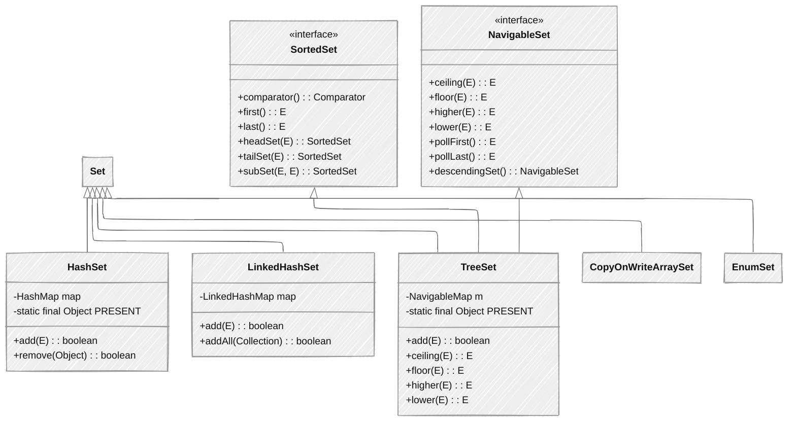
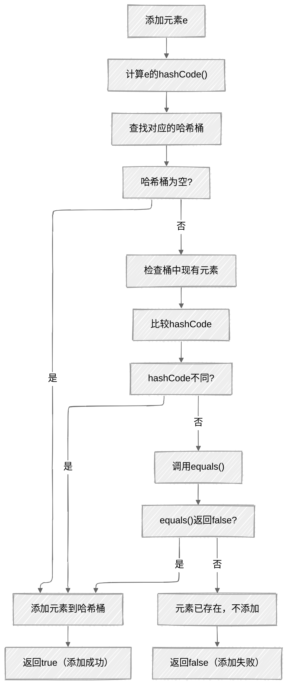

## 概述

`Set`接口是Java集合框架中的一个重要接口，继承自`Collection`接口，代表一个无序、不重复的集合。它的核心特性是元素的唯一性，不允许存储重复的元素。

## 核心特征

+ **无序性**：元素不保证按照特定顺序排列（`LinkedHashSet`除外）
+ **唯一性**：不允许存储重复的元素，依赖`equals()`和`hashCode()`方法
+ **高效查找**：提供高效的元素查找功能
+ **接口继承**：继承自`Collection`接口，拥有`Collection`的所有基本操作

## `Set`接口定义

```java
public interface Set<E> extends Collection<E> {
    // 基本操作
    int size();
    boolean isEmpty();
    boolean contains(Object o);
    Iterator<E> iterator();
    Object[] toArray();
    <T> T[] toArray(T[] a);
    
    // 修改操作
    boolean add(E e);
    boolean remove(Object o);
    
    // 批量操作
    boolean containsAll(Collection<?> c);
    boolean addAll(Collection<? extends E> c);
    boolean removeAll(Collection<?> c);
    boolean retainAll(Collection<?> c);
    void clear();
    
    // 相等性和哈希码
    boolean equals(Object o);
    int hashCode();
    
    // Java 8+ 方法
    default Spliterator<E> spliterator() {
        return Spliterators.spliterator(this, Spliterator.DISTINCT);
    }
    
    // Java 9+ 方法
    static <E> Set<E> of() {
        return ImmutableCollections.emptySet();
    }
    
    static <E> Set<E> of(E e1) {
        return new ImmutableCollections.Set12<>(e1);
    }
    
    // 其他of方法重载...
}
```

## 主要实现类对比



## `HashSet`/`LinkedHashSet`/`TreeSet`特性对比表

| 特性 | HashSet | LinkedHashSet | TreeSet |
| --- | --- | --- | --- |
| 底层实现 | HashMap | LinkedHashMap | TreeMap |
| 存储结构 | 哈希表 | 哈希表 + 链表 | 红黑树 |
| 插入顺序 | 不保证 | 保证 | 不保证（按排序） |
| 元素排序 | 无序 | 插入顺序 | 自然排序或自定义排序 |
| 查找性能 | O(1) 平均 | O(1) 平均 | O(log n) |
| 插入性能 | O(1) 平均 | O(1) 平均 | O(log n) |
| 删除性能 | O(1) 平均 | O(1) 平均 | O(log n) |
| 线程安全 | 否 | 否 | 否 |
| 允许null值 | 是（仅一个） | 是（仅一个） | 否（非Comparable类型） |
| 内存占用 | 中等 | 较高 | 较高 |
| 适用场景 | 快速查找、去重 | 需要保留插入顺序的去重 | 需要排序的去重 |

## `HashSet`底层实现原理

### `HashSet`入门级使用示例

下面是一个简单的`HashSet`使用示例，展示最基础的创建、添加、遍历等操作：

```java
public class HashSetBasicExample {
    public static void main(String[] args) {
        // 创建一个HashSet集合
        HashSet<String> colors = new HashSet<>();
        
        // 添加元素
        colors.add("红色");
        colors.add("蓝色");
        colors.add("绿色");
        colors.add("黄色");
        System.out.println("添加元素后: " + colors);
        // 输出类似: [红色, 蓝色, 绿色, 黄色] (注意：HashSet不保证顺序)
        
        // 尝试添加重复元素（不会成功，且不会抛出异常）
        boolean added = colors.add("红色");
        System.out.println("添加重复元素成功? " + added);  // 输出: false
        System.out.println("Set中的元素: " + colors);  // 仍然是4个元素
        
        // 判断是否包含某个元素
        boolean hasRed = colors.contains("红色");
        System.out.println("包含红色: " + hasRed);  // 输出: true
        
        boolean hasBlack = colors.contains("黑色");
        System.out.println("包含黑色: " + hasBlack);  // 输出: false
        
        // 遍历HashSet的三种方式
        
        // 1. 使用增强for循环（foreach）遍历
        System.out.println("\n使用foreach遍历:");
        for (String color : colors) {
            System.out.println("颜色: " + color);
        }
        
        // 2. 使用迭代器遍历
        System.out.println("\n使用迭代器遍历:");
        Iterator<String> iterator = colors.iterator();
        while (iterator.hasNext()) {
            String color = iterator.next();
            System.out.println("颜色: " + color);
        }
        
        // 3. 使用Lambda表达式遍历（Java 8及以上）
        System.out.println("\n使用Lambda表达式遍历:");
        colors.forEach(color -> {
            System.out.println("颜色: " + color);
        });
        
        // 删除元素
        boolean removed = colors.remove("绿色");
        System.out.println("\n删除绿色成功? " + removed);  // 输出: true
        System.out.println("删除后: " + colors);  // 输出类似: [红色, 蓝色, 黄色]
        
        // 获取集合大小
        System.out.println("集合大小: " + colors.size());  // 输出: 3
        
        // 清空集合
        colors.clear();
        System.out.println("清空后: " + colors);  // 输出: []
        System.out.println("集合是否为空: " + colors.isEmpty());  // 输出: true
        
        // 实际应用场景：去重
        System.out.println("\n去重示例:");
        String[] duplicateArray = {"苹果", "香蕉", "苹果", "橙子", "香蕉", "葡萄"};
        HashSet<String> uniqueFruits = new HashSet<>();
        
        // 添加数组中的所有元素，自动去除重复
        for (String fruit : duplicateArray) {
            uniqueFruits.add(fruit);
        }
        
        System.out.println("去重前数组: " + Arrays.toString(duplicateArray));
        System.out.println("去重后集合: " + uniqueFruits);
        
        // 如果需要保持原来的数组形式
        String[] uniqueArray = uniqueFruits.toArray(new String[0]);
        System.out.println("去重后数组: " + Arrays.toString(uniqueArray));
    }
}
```

### 基本结构

`HashSet`底层基于`HashMap`实现，利用`HashMap`的key不允许重复的特性来保证`Set`的元素唯一性。

```java
public class HashSet<E> extends AbstractSet<E>
        implements Set<E>, Cloneable, java.io.Serializable {
    
    // 底层使用HashMap存储
    private transient HashMap<E, Object> map;
    
    // 所有元素对应的value，一个虚拟对象
    private static final Object PRESENT = new Object();
    
    // 构造函数
    public HashSet() {
        map = new HashMap<>();
    }
    
    public HashSet(Collection<? extends E> c) {
        map = new HashMap<>(Math.max((int) (c.size()/.75f) + 1, 16));
        addAll(c);
    }
    
    public HashSet(int initialCapacity, float loadFactor) {
        map = new HashMap<>(initialCapacity, loadFactor);
    }
    
    public HashSet(int initialCapacity) {
        map = new HashMap<>(initialCapacity);
    }
    
    // 包访问权限的构造函数，供LinkedHashSet使用
    HashSet(int initialCapacity, float loadFactor, boolean dummy) {
        map = new LinkedHashMap<>(initialCapacity, loadFactor);
    }
}
```

### 核心方法实现

```java
// 添加元素
public boolean add(E e) {
    return map.put(e, PRESENT) == null;
}

// 移除元素
public boolean remove(Object o) {
    return map.remove(o) == PRESENT;
}

// 检查元素是否存在
public boolean contains(Object o) {
    return map.containsKey(o);
}

// 获取大小
public int size() {
    return map.size();
}

// 清空集合
public void clear() {
    map.clear();
}
```

### `hashCode()`和`equals()`正确实现

`HashSet`依赖元素的`hashCode()`和`equals()`方法来确保元素的唯一性。为了正确使用`HashSet`，元素类必须正确实现这两个方法。

**实现流程图**：



**正确实现示例**：

```java
public class CorrectStudent {
    private String id;
    private String name;
    private int age;
    
    public CorrectStudent(String id, String name, int age) {
        this.id = id;
        this.name = name;
        this.age = age;
    }
    
    @Override
    public boolean equals(Object o) {
        if (this == o) return true;
        if (o == null || getClass() != o.getClass()) return false;
        CorrectStudent student = (CorrectStudent) o;
        return age == student.age && 
               Objects.equals(id, student.id) && 
               Objects.equals(name, student.name);
    }
    
    @Override
    public int hashCode() {
        return Objects.hash(id, name, age);
    }
    
    @Override
    public String toString() {
        return "Student{" +
               "id='" + id + '\'' +
               ", name='" + name + '\'' +
               ", age=" + age +
               '}';
    }
    
    // 测试HashSet使用
    public static void main(String[] args) {
        Set<CorrectStudent> students = new HashSet<>();
        
        students.add(new CorrectStudent("001", "张三", 20));
        students.add(new CorrectStudent("002", "李四", 21));
        students.add(new CorrectStudent("001", "张三", 20));  // 重复元素
        
        System.out.println("集合大小: " + students.size());  // 应该是2
        for (CorrectStudent student : students) {
            System.out.println(student);
        }
    }
}
```

**错误实现示例**：

```java
public class BadStudent {
    private String id;
    private String name;
    private int age;
    
    public BadStudent(String id, String name, int age) {
        this.id = id;
        this.name = name;
        this.age = age;
    }
    
    // 只重写了equals，没有重写hashCode
    @Override
    public boolean equals(Object o) {
        if (this == o) return true;
        if (o == null || getClass() != o.getClass()) return false;
        BadStudent student = (BadStudent) o;
        return age == student.age && 
               Objects.equals(id, student.id) && 
               Objects.equals(name, student.name);
    }
    
    // 没有重写hashCode，使用Object的默认实现
    
    @Override
    public String toString() {
        return "BadStudent{" +
               "id='" + id + '\'' +
               ", name='" + name + '\'' +
               ", age=" + age +
               '}';
    }
    
    // 测试
    public static void main(String[] args) {
        Set<BadStudent> students = new HashSet<>();
        
        BadStudent s1 = new BadStudent("001", "张三", 20);
        BadStudent s2 = new BadStudent("001", "张三", 20);  // 逻辑上相等
        
        students.add(s1);
        students.add(s2);
        
        System.out.println("s1.equals(s2): " + s1.equals(s2));  // true
        System.out.println("s1.hashCode() == s2.hashCode(): " + 
                          (s1.hashCode() == s2.hashCode()));  // false
        System.out.println("集合大小: " + students.size());  // 2，错误地允许了重复元素
    }
}
```

## `LinkedHashSet`实现原理

### 基本结构

`LinkedHashSet`继承自`HashSet`，底层使用`LinkedHashMap`来维护元素的插入顺序。

```java
public class LinkedHashSet<E> extends HashSet<E>
        implements Set<E>, Cloneable, java.io.Serializable {
    
    public LinkedHashSet(int initialCapacity, float loadFactor) {
        super(initialCapacity, loadFactor, true);  // 调用HashSet的特殊构造函数
    }
    
    public LinkedHashSet(int initialCapacity) {
        super(initialCapacity, .75f, true);
    }
    
    public LinkedHashSet() {
        super(16, .75f, true);
    }
    
    public LinkedHashSet(Collection<? extends E> c) {
        super(Math.max(2*c.size(), 11), .75f, true);
        addAll(c);
    }
}
```

### 底层机制

`LinkedHashSet`通过调用`HashSet`中包访问权限的构造函数，传入`dummy`参数为`true`，来创建一个`LinkedHashMap`实例：

```java
// HashSet中的特殊构造函数
HashSet(int initialCapacity, float loadFactor, boolean dummy) {
    map = new LinkedHashMap<>(initialCapacity, loadFactor);
}
```

`LinkedHashMap`在`HashMap`的基础上，通过维护一个双向链表来记录元素的插入顺序。每个节点除了保存键值对信息外，还保存了前后节点的引用。

### 使用场景示例

```java
public class LinkedHashSetExample {
    public static void main(String[] args) {
        // 创建LinkedHashSet
        Set<String> set = new LinkedHashSet<>();
        
        // 添加元素
        set.add("Apple");
        set.add("Banana");
        set.add("Orange");
        set.add("Grape");
        set.add("Apple");  // 重复元素，不会被添加
        
        // 遍历 - 保持插入顺序
        System.out.println("LinkedHashSet遍历（保持插入顺序）：");
        for (String fruit : set) {
            System.out.println(fruit);
        }
        // 输出: Apple, Banana, Orange, Grape
        
        // 与HashSet对比
        Set<String> hashSet = new HashSet<>(set);
        System.out.println("\nHashSet遍历（不保证顺序）：");
        for (String fruit : hashSet) {
            System.out.println(fruit);
        }
        // 输出顺序可能不同
        
        // 应用场景：需要去重且保持插入顺序的场景
        // 例如：记录用户操作历史，不允许重复操作且需要按时间顺序展示
        
        // 另一个示例：缓存最近访问的不重复元素
        LinkedHashSet<String> recentVisits = new LinkedHashSet<>(100);
        String[] pages = {"首页", "产品页", "详情页", "首页", "联系我们"};
        for (String page : pages) {
            recentVisits.add(page);
        }
        System.out.println("\n最近访问（去重并保持顺序）：" + recentVisits);
        // 输出: [首页, 产品页, 详情页, 联系我们]
    }
}
```

## `TreeSet`实现原理

### 基本结构

`TreeSet`底层基于`TreeMap`实现，利用`TreeMap`的有序性来保证`Set`元素的排序。

```java
public class TreeSet<E> extends AbstractSet<E>
        implements NavigableSet<E>, Cloneable, java.io.Serializable {
    
    // 底层使用NavigableMap（TreeMap的子接口）
    private transient NavigableMap<E, Object> m;
    
    // 所有元素对应的value，一个虚拟对象
    private static final Object PRESENT = new Object();
    
    // 构造函数
    public TreeSet() {
        this(new TreeMap<>());
    }
    
    public TreeSet(Comparator<? super E> comparator) {
        this(new TreeMap<>(comparator));
    }
    
    public TreeSet(Collection<? extends E> c) {
        this();
        addAll(c);
    }
    
    public TreeSet(SortedSet<E> s) {
        this(s.comparator());
        addAll(s);
    }
    
    TreeSet(NavigableMap<E, Object> m) {
        this.m = m;
    }
}
```

### 核心方法实现

```java
// 添加元素
public boolean add(E e) {
    return m.put(e, PRESENT) == null;
}

// 移除元素
public boolean remove(Object o) {
    return m.remove(o) == PRESENT;
}

// 获取第一个（最小）元素
public E first() {
    return m.firstKey();
}

// 获取最后一个（最大）元素
public E last() {
    return m.lastKey();
}

// 获取小于e的最大元素
public E lower(E e) {
    return m.lowerKey(e);
}

// 获取小于等于e的最大元素
public E floor(E e) {
    return m.floorKey(e);
}

// 获取大于等于e的最小元素
public E ceiling(E e) {
    return m.ceilingKey(e);
}

// 获取大于e的最小元素
public E higher(E e) {
    return m.higherKey(e);
}
```

### 排序机制

`TreeSet`支持两种排序方式：

1. **自然排序**：元素类实现`Comparable`接口，并重写`compareTo()`方法
2. **自定义排序**：在构造`TreeSet`时传入`Comparator`接口的实现

**自然排序示例**：

```java
public class NaturalOrderingExample {
    public static void main(String[] args) {
        // 使用自然排序（String实现了Comparable）
        Set<String> treeSet = new TreeSet<>();
        
        treeSet.add("Banana");
        treeSet.add("Apple");
        treeSet.add("Orange");
        treeSet.add("Grape");
        
        // 输出按自然顺序（字典序）排序的元素
        System.out.println("自然排序结果：" + treeSet);
        // 输出: [Apple, Banana, Grape, Orange]
        
        // 自定义类实现Comparable
        class Student implements Comparable<Student> {
            private String name;
            private int score;
            
            public Student(String name, int score) {
                this.name = name;
                this.score = score;
            }
            
            @Override
            public int compareTo(Student o) {
                // 按分数从高到低排序
                return Integer.compare(o.score, this.score);
            }
            
            @Override
            public String toString() {
                return name + "(" + score + ")";
            }
        }
        
        Set<Student> students = new TreeSet<>();
        students.add(new Student("张三", 85));
        students.add(new Student("李四", 92));
        students.add(new Student("王五", 78));
        
        System.out.println("\n学生按分数排序：");
        for (Student student : students) {
            System.out.println(student);
        }
        // 输出: 李四(92), 张三(85), 王五(78)
    }
}
```

**自定义比较器示例**：

```java
public class CustomComparatorExample {
    public static void main(String[] args) {
        // 自定义比较器：按字符串长度排序
        Comparator<String> lengthComparator = Comparator.comparingInt(String::length);
        
        Set<String> treeSet = new TreeSet<>(lengthComparator);
        
        treeSet.add("Java");
        treeSet.add("Python");
        treeSet.add("C");
        treeSet.add("JavaScript");
        
        System.out.println("按长度排序结果：" + treeSet);
        // 输出: [C, Java, Python, JavaScript]
        
        // 复合比较器：先按长度，长度相同按字典序
        Comparator<String> complexComparator = 
            Comparator.comparingInt(String::length)
                      .thenComparing(Comparator.naturalOrder());
        
        Set<String> complexSet = new TreeSet<>(complexComparator);
        complexSet.add("bat");
        complexSet.add("cat");
        complexSet.add("apple");
        complexSet.add("dog");
        
        System.out.println("\n复合排序结果：" + complexSet);
        // 输出: [bat, cat, dog, apple]
    }
}
```

### 范围操作方法

`TreeSet`提供了丰富的范围操作方法，这是其他`Set`实现所不具备的：

```java
public class RangeOperationsExample {
    public static void main(String[] args) {
        NavigableSet<Integer> set = new TreeSet<>();
        
        // 添加元素
        for (int i = 1; i <= 10; i++) {
            set.add(i);
        }
        
        System.out.println("原始集合: " + set);
        
        // 范围查询
        System.out.println("小于5的元素: " + set.headSet(5));  // [1, 2, 3, 4]
        System.out.println("大于等于5的元素: " + set.tailSet(5));  // [5, 6, 7, 8, 9, 10]
        System.out.println("2到7之间的元素: " + set.subSet(2, 8));  // [2, 3, 4, 5, 6, 7]
        
        // 导航方法
        System.out.println("小于5的最大元素: " + set.lower(5));  // 4
        System.out.println("小于等于5的最大元素: " + set.floor(5));  // 5
        System.out.println("大于等于5的最小元素: " + set.ceiling(5));  // 5
        System.out.println("大于5的最小元素: " + set.higher(5));  // 6
        
        // 取首尾元素并移除
        System.out.println("移除最小元素: " + set.pollFirst());  // 1
        System.out.println("移除最大元素: " + set.pollLast());  // 10
        System.out.println("移除后集合: " + set);  // [2, 3, 4, 5, 6, 7, 8, 9]
        
        // 降序视图
        NavigableSet<Integer> descendingSet = set.descendingSet();
        System.out.println("降序视图: " + descendingSet);  // [9, 8, 7, 6, 5, 4, 3, 2]
    }
}
```

### 常见陷阱

1. **元素必须可比较**：如果没有提供比较器，元素类必须实现`Comparable`接口，否则会抛出`ClassCastException`
2. **比较器与**`equals`**一致性**：比较器的比较结果应该与`equals()`方法保持一致，否则可能导致`Set`中存在`equals()`返回`true`的多个元素

```java
public class InconsistentComparisonExample {
    public static void main(String[] args) {
        // 自定义比较器只比较name，忽略age
        Comparator<Person> nameComparator = Comparator.comparing(Person::getName);
        
        Set<Person> treeSet = new TreeSet<>(nameComparator);
        
        treeSet.add(new Person("张三", 20));
        treeSet.add(new Person("张三", 21));  // 不会被添加，因为name相同
        
        // 但两个对象的equals()可能返回false
        Person p1 = new Person("张三", 20);
        Person p2 = new Person("张三", 21);
        System.out.println("p1.equals(p2): " + p1.equals(p2));  // false
        
        System.out.println("集合大小: " + treeSet.size());  // 1
    }
    
    static class Person {
        private String name;
        private int age;
        
        public Person(String name, int age) {
            this.name = name;
            this.age = age;
        }
        
        public String getName() { return name; }
        public int getAge() { return age; }
        
        @Override
        public boolean equals(Object o) {
            if (this == o) return true;
            if (o == null || getClass() != o.getClass()) return false;
            Person person = (Person) o;
            return age == person.age && Objects.equals(name, person.name);
        }
        
        @Override
        public int hashCode() {
            return Objects.hash(name, age);
        }
        
        @Override
        public String toString() {
            return name + "(" + age + ")";
        }
    }
}
```

3. **性能考量**：`TreeSet`的操作时间复杂度为`O(log n)`，比`HashSet`的`O(1)`平均复杂度要高，这是因为`TreeSet`需要维护元素的有序性

## `Set`接口小结

## `Set`接口核心总结（零基础友好版）

### `Set`集合的核心特点

**Set是一种无序、不可重复的集合**，就像数学中的集合概念，或者现实生活中的标签系统。主要特点：

+ **不可重复性**：同一个Set中不能存储相同的元素，会自动去重
+ **无序性**：元素的存储顺序不固定，不能通过索引访问
+ **高效查找**：对于`HashSet`，查找元素的时间复杂度为`O(1)`

### `HashSet` vs `TreeSet` vs `LinkedHashSet` 选择指南

| 集合类型 | 主要特点 | 适用场景 |
| :---: | :---: | :---: |
| HashSet | 无序，查询速度快 | 主要用于去重，不关心元素顺序 |
| TreeSet | 有序，实现了SortedSet接口 | 需要元素按照自然顺序或自定义顺序排列 |
| LinkedHashSet | 维护插入顺序 | 需要保持元素插入顺序的同时又要去重 |

### 实际应用中的小技巧

1. **去重操作**：最常见的应用场景就是去除重复元素

```java
// 快速去重数组中的重复元素
String[] array = {"A", "B", "A", "C", "B"};
Set<String> uniqueSet = new HashSet<>(Arrays.asList(array));
```

2. **判断元素存在**：利用Set高效的查找特性来判断元素是否存在
3. **元素相等判断**：
    + 向Set中添加自定义对象时，必须正确实现`equals()`和`hashCode()`方法
    + 这两个方法的实现必须保持一致：如果两个对象`equals()`返回`true`，它们的`hashCode()`必须相同
4. **遍历方式**：`Set`只能使用增强`for`循环（`foreach`）或迭代器遍历，不能通过索引访问
5. **线程安全问题**：
    + `HashSet`不是线程安全的，多线程环境下可以使用`Collections.synchronizedSet()`或`CopyOnWriteArraySet`

### 学习建议

+ 先理解`Set`的基本特性：无序和不可重复
+ 掌握`Set`的基本操作：添加、删除、遍历、判断元素存在
+ 学会根据需求选择合适的`Set`实现类
+ 理解自定义对象作为`Set`元素时需要注意的事项

### 面试知识点

1. **元素唯一性保证机制**：
    + `HashSet`：基于`HashMap`，依赖`hashCode()`和`equals()`
    + `LinkedHashSet`：基于`LinkedHashMap`，同时保证插入顺序
    + `TreeSet`：基于`TreeMap`，依赖`Comparable`或`Comparator`
2. **性能特征**：
    + `HashSet`：查找、插入、删除O(1)平均
    + `LinkedHashSet`：略高于`HashSet`，但保持插入顺序
    + `TreeSet`：所有操作O(log n)，但提供排序和范围查询
3. **适用场景选择**：
    + 快速去重：`HashSet`
    + 去重并保持插入顺序：`LinkedHashSet`
    + 去重并排序：`TreeSet`
4. **实现细节**：
    + 都不是线程安全的
    + `HashSet`允许一个null元素（如果元素类型允许）
    + `TreeSet`在使用自然排序时，元素不能为null（除非`Comparable`实现允许）

### 最佳实践

1. **正确实现hashCode()和equals()**：使用`HashSet`或`LinkedHashSet`时，确保元素类正确实现这两个方法，以确保元素的唯一性
2. **选择合适的实现类**：根据是否需要排序、是否需要保持插入顺序选择合适的`Set`实现
3. **预估初始容量**：对于`HashSet`和`LinkedHashSet`，可以设置合适的初始容量和负载因子

```java
Set<String> set = new HashSet<>(100, 0.75f);  // 预设容量和负载因子
```

4. **线程安全处理**：

```java
// 方式1：使用同步包装器
Set<String> syncSet = Collections.synchronizedSet(new HashSet<>());

// 方式2：使用CopyOnWriteArraySet（读多写少场景）
Set<String> concurrentSet = new CopyOnWriteArraySet<>();
```

5. **利用Java 8+特性**：

```java
// 使用Stream API处理Set
Set<String> filteredSet = set.stream()
                            .filter(s -> s.length() > 5)
                            .collect(Collectors.toSet());
```

6. **TreeSet排序注意事项**：

```java
// 确保比较器与equals()方法一致
Set<Person> consistentSet = new TreeSet<>((p1, p2) -> {
    int cmp = p1.getName().compareTo(p2.getName());
    if (cmp != 0) return cmp;
    return Integer.compare(p1.getAge(), p2.getAge());
});
```

## 小结

Set接口是Java集合框架中用于存储不重复元素的重要接口。通过本章节的学习，我们深入理解了Set接口的主要实现类（`HashSet`、`LinkedHashSet`、`TreeSet`）的底层原理、性能特征和适用场景。在实际开发中，我们需要根据具体需求选择合适的`Set`实现，并注意正确实现元素类的`hashCode()`和`equals()`方法（对于`HashSet`和`LinkedHashSet`）或提供合适的比较机制（对于`TreeSet`）。
