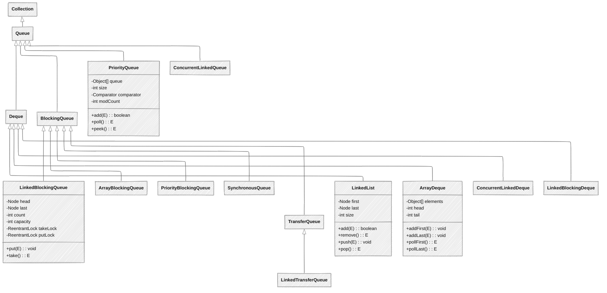

## 概述

`Queue`（队列）和`Deque`（双端队列）是Java集合框架中用于存储和操作元素序列的接口。`Queue`接口定义了先进先出（`FIFO`）的数据结构，而`Deque`接口扩展了`Queue`，支持两端操作，既可以作为队列使用，也可以作为栈使用。

## `Queue`接口

### 核心特征

+ **先进先出（**`FIFO`**）**：元素按照进入队列的顺序被处理
+ **双端操作限制**：只能在一端添加元素，另一端移除元素
+ **可选的容量限制**：一些实现可能有容量限制（如`BlockingQueue`）
+ **特殊方法**：提供两组不同语义的方法（抛出异常或返回特殊值）

### `Queue`接口定义

```java
public interface Queue<E> extends Collection<E> {
    // 添加元素，如果队列已满则抛出IllegalStateException
    boolean add(E e);
    
    // 添加元素，如果队列已满则返回false
    boolean offer(E e);
    
    // 移除并返回队列头部元素，如果队列为空则抛出NoSuchElementException
    E remove();
    
    // 移除并返回队列头部元素，如果队列为空则返回null
    E poll();
    
    // 返回队列头部元素但不移除，如果队列为空则抛出NoSuchElementException
    E element();
    
    // 返回队列头部元素但不移除，如果队列为空则返回null
    E peek();
}
```

### 主要方法对比

| 操作 | 抛出异常 | 返回特殊值 |
| :---: | :---: | :---: |
| 添加元素 | `add(e)` | `offer(e)` |
| 移除元素 | `remove()` | `poll()` |
| 检查头部元素 | `element()` | `peek()` |

## Deque接口

### 核心特征

+ **双端操作**：支持在两端进行元素的插入、删除和获取
+ **既可以作为队列又可以作为栈**：支持`FIFO`和`LIFO`（后进先出）操作
+ **扩展了**`Queue`：提供`Queue`接口的所有功能
+ **栈操作**：提供栈特有的`push/pop/peek`操作

### `Deque`接口定义

```java
public interface Deque<E> extends Queue<E> {
    // 双端添加操作
    void addFirst(E e);
    void addLast(E e);
    boolean offerFirst(E e);
    boolean offerLast(E e);
    
    // 双端移除操作
    E removeFirst();
    E removeLast();
    E pollFirst();
    E pollLast();
    
    // 双端检查操作
    E getFirst();
    E getLast();
    E peekFirst();
    E peekLast();
    
    // 移除特定元素
    boolean removeFirstOccurrence(Object o);
    boolean removeLastOccurrence(Object o);
    
    // 栈操作（从头部进行操作）
    void push(E e);  // 等效于addFirst(e)
    E pop();         // 等效于removeFirst()
    
    // Queue接口方法的实现位置
    // add(e) 等效于 addLast(e)
    // offer(e) 等效于 offerLast(e)
    // remove() 等效于 removeFirst()
    // poll() 等效于 pollFirst()
    // element() 等效于 getFirst()
    // peek() 等效于 peekFirst()
    
    // 其他Collection接口方法...
}
```

## 实现类关系图



## 主要实现类对比

| 特性 | LinkedList | ArrayDeque | PriorityQueue | LinkedBlockingQueue | ArrayBlockingQueue |
| :---: | :---: | :---: | :---: | :---: | :---: |
| 底层实现 | 双向链表 | 动态数组 | 堆 | 链表 + 锁 | 数组 + 锁 |
| 存储结构 | 链表节点 | 循环数组 | 二叉堆 | 链表节点 + 锁 | 数组 + 锁 |
| 元素排序 | 插入顺序 | 插入顺序 | 优先级顺序 | FIFO | FIFO |
| 随机访问 | O(n) | O(1) | O(n) | O(n) | O(1) |
| 添加/删除头部 | O(1) | O(1) | O(log n) | O(1) | O(1) |
| 添加/删除尾部 | O(1) | O(1) | 不适用 | O(1) | O(1) |
| 线程安全 | 否 | 否 | 否 | 是 | 是 |
| 允许null元素 | 是 | 否 | 否 | 否 | 否 |
| 容量限制 | 无 | 无（自动扩容） | 无（自动扩容） | 可选 | 必须 |
| 适用场景 | 频繁插入/删除，双端操作 | 作为栈或队列，频繁两端操作 | 需要优先级排序 | 线程安全的队列 | 固定大小的线程安全队列 |

## `ArrayDeque`实现原理

### `ArrayDeque`入门级使用示例

下面是一个简单的`ArrayDeque`使用示例，展示其作为双端队列的基本操作：

```java
public class ArrayDequeBasicExample {
    public static void main(String[] args) {
        // 创建一个ArrayDeque（双端队列）
        ArrayDeque<String> tasks = new ArrayDeque<>();
        
        // 作为队列使用（先进先出）
        System.out.println("=== 作为队列使用（先进先出） ===");
        
        // 添加元素到队列尾部（入队）
        tasks.offer("任务1");
        tasks.offer("任务2");
        tasks.offer("任务3");
        System.out.println("入队后: " + tasks);  // 输出类似: [任务1, 任务2, 任务3]
        
        // 查看队首元素（不移除）
        String firstTask = tasks.peek();
        System.out.println("队首任务: " + firstTask);  // 输出: 任务1
        System.out.println("查看后: " + tasks);  // 队列内容不变
        
        // 移除队首元素（出队）
        String removedTask = tasks.poll();
        System.out.println("出队任务: " + removedTask);  // 输出: 任务1
        System.out.println("出队后: " + tasks);  // 输出类似: [任务2, 任务3]
        
        // 作为栈使用（后进先出）
        System.out.println("\n=== 作为栈使用（后进先出） ===");
        
        // 创建新的双端队列作为栈
        ArrayDeque<String> stack = new ArrayDeque<>();
        
        // 压栈（添加到头部）
        stack.push("数据1");
        stack.push("数据2");
        stack.push("数据3");
        System.out.println("压栈后: " + stack);  // 输出类似: [数据3, 数据2, 数据1]
        
        // 查看栈顶元素
        String topElement = stack.peek();
        System.out.println("栈顶元素: " + topElement);  // 输出: 数据3
        
        // 弹栈
        String poppedElement = stack.pop();
        System.out.println("弹出元素: " + poppedElement);  // 输出: 数据3
        System.out.println("弹栈后: " + stack);  // 输出类似: [数据2, 数据1]
        
        // 双端操作
        System.out.println("\n=== 双端队列特有操作 ===");
        
        ArrayDeque<String> deque = new ArrayDeque<>();
        
        // 添加到头部
        deque.addFirst("A");
        System.out.println("添加A到头部: " + deque);  // 输出: [A]
        
        // 添加到尾部
        deque.addLast("Z");
        System.out.println("添加Z到尾部: " + deque);  // 输出: [A, Z]
        
        // 在头部添加更多元素
        deque.addFirst("B");
        deque.addFirst("C");
        System.out.println("继续添加B、C到头部: " + deque);  // 输出类似: [C, B, A, Z]
        
        // 获取头部和尾部元素
        System.out.println("头部元素: " + deque.getFirst());  // 输出: C
        System.out.println("尾部元素: " + deque.getLast());   // 输出: Z
        
        // 删除头部和尾部元素
        deque.removeFirst();  // 删除头部元素
        deque.removeLast();   // 删除尾部元素
        System.out.println("删除首尾后: " + deque);  // 输出类似: [B, A]
        
        // 遍历双端队列
        System.out.println("\n遍历双端队列:");
        for (String element : deque) {
            System.out.println("元素: " + element);
        }
        
        // 清空队列
        deque.clear();
        System.out.println("\n清空后是否为空: " + deque.isEmpty());  // 输出: true
    }
}
```

### 基本结构

`ArrayDeque`是`Deque`接口的高效实现，基于动态数组实现，支持两端高效的插入和删除操作。

```java
public class ArrayDeque<E> extends AbstractCollection<E>
                           implements Deque<E>, Cloneable, Serializable {
    
    // 存储元素的数组
    transient Object[] elements; // non-private to simplify nested class access
    
    // 头指针索引
    transient int head;
    
    // 尾指针索引（指向下一个将要插入元素的位置）
    transient int tail;
    
    // 最小初始容量
    private static final int MIN_INITIAL_CAPACITY = 8;
    
    // 构造函数
    public ArrayDeque() {
        elements = new Object[16]; // 默认初始容量为16
    }
    
    public ArrayDeque(int numElements) {
        allocateElements(numElements);
    }
    
    public ArrayDeque(Collection<? extends E> c) {
        allocateElements(c.size());
        addAll(c);
    }
}
```

### 核心方法实现

```java
// 添加元素到头部
public void addFirst(E e) {
    if (e == null)
        throw new NullPointerException();
    // 计算新的头索引，数组是循环使用的
    elements[head = (head - 1) & (elements.length - 1)] = e;
    // 如果头指针追上尾指针，说明数组已满，需要扩容
    if (head == tail)
        doubleCapacity();
}

// 添加元素到尾部
public void addLast(E e) {
    if (e == null)
        throw new NullPointerException();
    // 直接在尾指针位置添加元素
    elements[tail] = e;
    // 更新尾指针，如果尾指针追上头指针，说明数组已满，需要扩容
    if ( (tail = (tail + 1) & (elements.length - 1)) == head)
        doubleCapacity();
}

// 移除并返回头部元素
public E pollFirst() {
    int h = head;
    @SuppressWarnings("unchecked")
    E result = (E) elements[h];
    // 如果队列为空，返回null
    if (result == null)
        return null;
    // 清空该位置的引用，帮助垃圾回收
    elements[h] = null;     // Must null out slot
    // 更新头指针
    head = (h + 1) & (elements.length - 1);
    return result;
}

// 移除并返回尾部元素
public E pollLast() {
    int t = (tail - 1) & (elements.length - 1);
    @SuppressWarnings("unchecked")
    E result = (E) elements[t];
    if (result == null)
        return null;
    elements[t] = null;
    tail = t;
    return result;
}

// 扩容方法
private void doubleCapacity() {
    assert head == tail; // 只有当队列满时才会调用此方法
    int p = head;
    int n = elements.length;
    int r = n - p; // number of elements to the right of p
    int newCapacity = n << 1; // 容量翻倍
    if (newCapacity < 0)
        throw new IllegalStateException("Sorry, deque too big");
    Object[] a = new Object[newCapacity];
    // 复制数组后半部分
    System.arraycopy(elements, p, a, 0, r);
    // 复制数组前半部分
    System.arraycopy(elements, 0, a, r, p);
    elements = a;
    head = 0;
    tail = n;
}
```

### 作为队列使用示例

```java
public class ArrayDequeAsQueueExample {
    public static void main(String[] args) {
        // 创建ArrayDeque作为队列
        Deque<String> queue = new ArrayDeque<>();
        
        // 添加元素（尾部）
        queue.add("张三");  // 等价于 queue.addLast("张三")
        queue.add("李四");
        queue.add("王五");
        System.out.println("初始队列: " + queue);
        // 输出: [张三, 李四, 王五]
        
        // 查看头部元素
        System.out.println("队列头部: " + queue.peek());  // 等价于 queue.peekFirst()
        // 输出: 张三
        
        // 移除头部元素
        String removed = queue.poll();  // 等价于 queue.pollFirst()
        System.out.println("移除的元素: " + removed);
        // 输出: 张三
        
        System.out.println("移除后队列: " + queue);
        // 输出: [李四, 王五]
        
        // 添加更多元素
        queue.offer("赵六");  // 等价于 queue.offerLast("赵六")
        queue.offer("钱七");
        System.out.println("添加后队列: " + queue);
        // 输出: [李四, 王五, 赵六, 钱七]
        
        // 使用offer添加null会抛出NullPointerException
        try {
            queue.offer(null);
        } catch (NullPointerException e) {
            System.out.println("ArrayDeque不允许添加null元素");
        }
        
        // 遍历队列（FIFO顺序）
        System.out.println("遍历队列:");
        while (!queue.isEmpty()) {
            System.out.println(queue.poll());
        }
        // 输出: 李四, 王五, 赵六, 钱七
    }
}
```

### 作为栈使用示例

```java
public class ArrayDequeAsStackExample {
    public static void main(String[] args) {
        // 创建ArrayDeque作为栈
        Deque<String> stack = new ArrayDeque<>();
        
        // 入栈操作（头部）
        stack.push("任务1");  // 等价于 stack.addFirst("任务1")
        stack.push("任务2");
        stack.push("任务3");
        System.out.println("初始栈: " + stack);
        // 输出: [任务3, 任务2, 任务1]
        
        // 查看栈顶元素
        System.out.println("栈顶元素: " + stack.peek());  // 等价于 stack.peekFirst()
        // 输出: 任务3
        
        // 出栈操作
        String popped = stack.pop();  // 等价于 stack.removeFirst()
        System.out.println("出栈元素: " + popped);
        // 输出: 任务3
        
        System.out.println("出栈后栈: " + stack);
        // 输出: [任务2, 任务1]
        
        // 添加更多元素
        stack.push("任务4");
        stack.push("任务5");
        System.out.println("添加后栈: " + stack);
        // 输出: [任务5, 任务4, 任务2, 任务1]
        
        // 双端操作示例
        System.out.println("栈底元素: " + stack.peekLast());
        // 输出: 任务1
        
        // 从尾部移除元素
        System.out.println("移除栈底元素: " + stack.pollLast());
        // 输出: 任务1
        
        System.out.println("移除后栈: " + stack);
        // 输出: [任务5, 任务4, 任务2]
        
        // 遍历栈（LIFO顺序）
        System.out.println("遍历栈:");
        while (!stack.isEmpty()) {
            System.out.println(stack.pop());
        }
        // 输出: 任务5, 任务4, 任务2
    }
}
```

### 性能对比

`ArrayDeque`作为栈和队列使用时，性能优于传统的`Stack`和`LinkedList`：

```java
public class DequePerformanceComparison {
    public static void main(String[] args) {
        int iterations = 1000000;
        
        // 测试ArrayDeque作为栈
        Deque<Integer> arrayDequeStack = new ArrayDeque<>();
        long start = System.currentTimeMillis();
        for (int i = 0; i < iterations; i++) {
            arrayDequeStack.push(i);
        }
        for (int i = 0; i < iterations; i++) {
            arrayDequeStack.pop();
        }
        long arrayDequeStackTime = System.currentTimeMillis() - start;
        System.out.println("ArrayDeque作为栈的时间: " + arrayDequeStackTime + "ms");
        
        // 测试Stack
        Stack<Integer> stack = new Stack<>();
        start = System.currentTimeMillis();
        for (int i = 0; i < iterations; i++) {
            stack.push(i);
        }
        for (int i = 0; i < iterations; i++) {
            stack.pop();
        }
        long stackTime = System.currentTimeMillis() - start;
        System.out.println("Stack的时间: " + stackTime + "ms");
        
        // 测试LinkedList作为栈
        Deque<Integer> linkedListStack = new LinkedList<>();
        start = System.currentTimeMillis();
        for (int i = 0; i < iterations; i++) {
            linkedListStack.push(i);
        }
        for (int i = 0; i < iterations; i++) {
            linkedListStack.pop();
        }
        long linkedListStackTime = System.currentTimeMillis() - start;
        System.out.println("LinkedList作为栈的时间: " + linkedListStackTime + "ms");
        
        // 测试ArrayDeque作为队列
        Deque<Integer> arrayDequeQueue = new ArrayDeque<>();
        start = System.currentTimeMillis();
        for (int i = 0; i < iterations; i++) {
            arrayDequeQueue.offer(i);
        }
        for (int i = 0; i < iterations; i++) {
            arrayDequeQueue.poll();
        }
        long arrayDequeQueueTime = System.currentTimeMillis() - start;
        System.out.println("\nArrayDeque作为队列的时间: " + arrayDequeQueueTime + "ms");
        
        // 测试LinkedList作为队列
        Queue<Integer> linkedListQueue = new LinkedList<>();
        start = System.currentTimeMillis();
        for (int i = 0; i < iterations; i++) {
            linkedListQueue.offer(i);
        }
        for (int i = 0; i < iterations; i++) {
            linkedListQueue.poll();
        }
        long linkedListQueueTime = System.currentTimeMillis() - start;
        System.out.println("LinkedList作为队列的时间: " + linkedListQueueTime + "ms");
    }
}
```

## `PriorityQueue`实现原理

### 基本结构

`PriorityQueue`是一个基于二叉堆实现的优先级队列，元素按照其自然顺序或自定义比较器指定的顺序排列。

```java
public class PriorityQueue<E> extends AbstractQueue<E>
    implements java.io.Serializable {
    
    // 存储元素的数组（二叉堆）
    transient Object[] queue; // non-private to simplify nested class access
    
    // 元素数量
    int size;
    
    // 比较器，如果为null则使用自然顺序
    private final Comparator<? super E> comparator;
    
    // 结构修改次数
    transient int modCount; // non-private to simplify nested class access
    
    // 默认初始容量
    private static final int DEFAULT_INITIAL_CAPACITY = 11;
    
    // 构造函数
    public PriorityQueue() {
        this(DEFAULT_INITIAL_CAPACITY, null);
    }
    
    public PriorityQueue(int initialCapacity) {
        this(initialCapacity, null);
    }
    
    public PriorityQueue(Comparator<? super E> comparator) {
        this(DEFAULT_INITIAL_CAPACITY, comparator);
    }
    
    public PriorityQueue(int initialCapacity, Comparator<? super E> comparator) {
        if (initialCapacity < 1)
            throw new IllegalArgumentException();
        this.queue = new Object[initialCapacity];
        this.comparator = comparator;
    }
    
    public PriorityQueue(Collection<? extends E> c) {
        if (c instanceof SortedSet<?>) {
            SortedSet<? extends E> ss = (SortedSet<? extends E>) c;
            this.comparator = (Comparator<? super E>) ss.comparator();
            initElementsFromCollection(ss);
        }
        else if (c instanceof PriorityQueue<?>) {
            PriorityQueue<? extends E> pq = (PriorityQueue<? extends E>) c;
            this.comparator = (Comparator<? super E>) pq.comparator();
            initFromPriorityQueue(pq);
        }
        else {
            this.comparator = null;
            initFromCollection(c);
        }
    }
}
```

### 核心方法实现

```java
// 添加元素
public boolean add(E e) {
    return offer(e);
}

public boolean offer(E e) {
    if (e == null)
        throw new NullPointerException();
    modCount++;
    int i = size;
    if (i >= queue.length)
        grow(i + 1); // 扩容
    size = i + 1;
    if (i == 0)
        queue[0] = e; // 队列为空，直接插入
    else
        siftUp(i, e); // 向上调整堆
    return true;
}

// 移除并返回队列头部元素（优先级最高的元素）
public E poll() {
    if (size == 0)
        return null;
    int s = --size;
    modCount++;
    E result = (E) queue[0];
    E x = (E) queue[s];
    queue[s] = null;
    if (s != 0)
        siftDown(0, x); // 向下调整堆
    return result;
}

// 返回队列头部元素但不移除
public E peek() {
    return (size == 0) ? null : (E) queue[0];
}

// 向上调整堆
private void siftUp(int k, E x) {
    if (comparator != null)
        siftUpUsingComparator(k, x, queue, comparator);
    else
        siftUpComparable(k, x, queue);
}

// 使用比较器向上调整堆
private static <T> void siftUpUsingComparator(int k, T x, Object[] es, Comparator<? super T> cmp) {
    while (k > 0) {
        int parent = (k - 1) >>> 1; // 获取父节点索引
        Object e = es[parent];
        if (cmp.compare(x, (T) e) >= 0)
            break; // 如果x >= 父节点，停止调整
        es[k] = e; // 否则，父节点下移
        k = parent;
    }
    es[k] = x; // x插入到正确位置
}

// 向下调整堆
private void siftDown(int k, E x) {
    if (comparator != null)
        siftDownUsingComparator(k, x, queue, size, comparator);
    else
        siftDownComparable(k, x, queue, size);
}

// 扩容方法
private void grow(int minCapacity) {
    int oldCapacity = queue.length;
    // 旧容量小于64时，容量翻倍；否则容量增加50%
    int newCapacity = oldCapacity + ((oldCapacity < 64) ?
                                     (oldCapacity + 2) :
                                     (oldCapacity >> 1));
    // 检查是否溢出
    if (newCapacity - MAX_ARRAY_SIZE > 0)
        newCapacity = hugeCapacity(minCapacity);
    queue = Arrays.copyOf(queue, newCapacity);
}
```

### 自然排序示例

```java
public class PriorityQueueNaturalOrderExample {
    public static void main(String[] args) {
        // 创建默认的PriorityQueue（自然排序）
        PriorityQueue<Integer> queue = new PriorityQueue<>();
        
        // 添加元素
        queue.offer(5);
        queue.offer(1);
        queue.offer(9);
        queue.offer(3);
        queue.offer(7);
        
        System.out.println("PriorityQueue（自然排序）: ");
        // 遍历输出（注意：直接遍历不保证顺序，必须通过poll()方法）
        System.out.print("通过poll()方法按优先级输出: ");
        while (!queue.isEmpty()) {
            System.out.print(queue.poll() + " ");
        }
        // 输出: 1 3 5 7 9
        
        // 自定义类实现Comparable接口
        class Task implements Comparable<Task> {
            private String name;
            private int priority; // 优先级，数字越小优先级越高
            
            public Task(String name, int priority) {
                this.name = name;
                this.priority = priority;
            }
            
            @Override
            public int compareTo(Task other) {
                return Integer.compare(this.priority, other.priority);
            }
            
            @Override
            public String toString() {
                return name + "(优先级: " + priority + ")";
            }
        }
        
        // 创建任务队列
        PriorityQueue<Task> taskQueue = new PriorityQueue<>();
        taskQueue.offer(new Task("普通任务", 5));
        taskQueue.offer(new Task("紧急任务", 1));
        taskQueue.offer(new Task("高优任务", 2));
        taskQueue.offer(new Task("低优任务", 10));
        
        System.out.println("\n\n任务队列按优先级处理: ");
        while (!taskQueue.isEmpty()) {
            System.out.println("处理 " + taskQueue.poll());
        }
        // 输出按优先级顺序的任务
    }
}
```

### 自定义比较器示例

```java
public class PriorityQueueCustomComparatorExample {
    public static void main(String[] args) {
        // 创建使用自定义比较器的PriorityQueue（降序）
        PriorityQueue<Integer> maxHeap = new PriorityQueue<>(Comparator.reverseOrder());
        
        // 添加元素
        maxHeap.offer(5);
        maxHeap.offer(1);
        maxHeap.offer(9);
        maxHeap.offer(3);
        maxHeap.offer(7);
        
        System.out.println("最大堆（降序）: ");
        System.out.print("通过poll()方法按优先级输出: ");
        while (!maxHeap.isEmpty()) {
            System.out.print(maxHeap.poll() + " ");
        }
        // 输出: 9 7 5 3 1
        
        // 自定义比较器 - 按字符串长度排序
        Comparator<String> lengthComparator = Comparator.comparingInt(String::length);
        PriorityQueue<String> stringQueue = new PriorityQueue<>(lengthComparator);
        
        stringQueue.offer("Java");
        stringQueue.offer("Python");
        stringQueue.offer("C");
        stringQueue.offer("JavaScript");
        
        System.out.println("\n\n按字符串长度排序: ");
        while (!stringQueue.isEmpty()) {
            System.out.println(stringQueue.poll());
        }
        // 输出按长度升序的字符串
        
        // 复合比较器示例
        class Person {
            private String name;
            private int age;
            private String department;
            
            public Person(String name, int age, String department) {
                this.name = name;
                this.age = age;
                this.department = department;
            }
            
            @Override
            public String toString() {
                return name + "(" + age + ", " + department + ")";
            }
        }
        
        // 先按部门排序，再按年龄排序
        Comparator<Person> personComparator = Comparator
            .comparing((Person p) -> p.department)
            .thenComparingInt(p -> p.age);
        
        PriorityQueue<Person> personQueue = new PriorityQueue<>(personComparator);
        personQueue.offer(new Person("张三", 30, "开发部"));
        personQueue.offer(new Person("李四", 25, "市场部"));
        personQueue.offer(new Person("王五", 35, "开发部"));
        personQueue.offer(new Person("赵六", 28, "市场部"));
        
        System.out.println("\n\n按部门和年龄排序的人员: ");
        while (!personQueue.isEmpty()) {
            System.out.println(personQueue.poll());
        }
    }
}
```

### 任务调度示例

```java
public class TaskSchedulingExample {
    public static void main(String[] args) {
        // 创建任务调度器
        TaskScheduler scheduler = new TaskScheduler();
        
        // 添加不同优先级的任务
        scheduler.addTask(new Task("系统备份", 1, 60)); // 优先级1，执行时间60秒
        scheduler.addTask(new Task("数据同步", 2, 30)); // 优先级2，执行时间30秒
        scheduler.addTask(new Task("日志清理", 3, 10)); // 优先级3，执行时间10秒
        scheduler.addTask(new Task("用户通知", 2, 5));  // 优先级2，执行时间5秒
        
        // 开始执行任务
        scheduler.executeTasks();
    }
    
    static class Task {
        private String name;
        private int priority;   // 优先级，数字越小优先级越高
        private int executionTime; // 执行时间（秒）
        
        public Task(String name, int priority, int executionTime) {
            this.name = name;
            this.priority = priority;
            this.executionTime = executionTime;
        }
        
        public void execute() {
            System.out.println("执行任务: " + name + " (优先级: " + priority + ", 预计时间: " + executionTime + "秒)");
            try {
                // 模拟任务执行
                Thread.sleep(executionTime * 100); // 实际使用时改为 * 1000
            } catch (InterruptedException e) {
                Thread.currentThread().interrupt();
            }
            System.out.println("任务完成: " + name);
        }
    }
    
    static class TaskScheduler {
        // 使用PriorityQueue进行任务调度，按照优先级和执行时间排序
        private final PriorityQueue<Task> taskQueue = new PriorityQueue<>(
            Comparator.comparing((Task t) -> t.priority)
                      .thenComparingInt(t -> t.executionTime));
        
        public void addTask(Task task) {
            taskQueue.offer(task);
        }
        
        public void executeTasks() {
            System.out.println("开始执行任务队列...");
            while (!taskQueue.isEmpty()) {
                Task nextTask = taskQueue.poll();
                nextTask.execute();
            }
            System.out.println("所有任务执行完毕");
        }
    }
}
```

### `Top K`问题示例

```java
public class TopKExample {
    public static void main(String[] args) {
        int[] nums = {3, 2, 1, 5, 6, 4};
        int k = 3;
        
        System.out.println("数组: " + Arrays.toString(nums));
        System.out.println("前" + k + "个最大元素: " + Arrays.toString(findTopK(nums, k)));
        System.out.println("前" + k + "个最小元素: " + Arrays.toString(findBottomK(nums, k)));
        
        // 实际应用场景：统计热门商品
        String[] products = {
            "手机", "电脑", "手机", "平板", "手表", 
            "手机", "电脑", "电脑", "手机", "平板",
            "耳机", "电脑", "手表", "手机", "电脑"
        };
        
        Map<String, Integer> productCount = new HashMap<>();
        for (String product : products) {
            productCount.put(product, productCount.getOrDefault(product, 0) + 1);
        }
        
        List<Map.Entry<String, Integer>> topProducts = findTopKProducts(productCount, 3);
        System.out.println("\nTop 3 热门商品:");
        for (Map.Entry<String, Integer> entry : topProducts) {
            System.out.println(entry.getKey() + ": " + entry.getValue() + "次");
        }
    }
    
    // 查找数组中前K个最大的元素
    public static int[] findTopK(int[] nums, int k) {
        // 使用最小堆，保持堆的大小为k
        PriorityQueue<Integer> minHeap = new PriorityQueue<>(k);
        
        for (int i = 0; i < nums.length; i++) {
            if (i < k) {
                // 前k个元素直接入堆
                minHeap.offer(nums[i]);
            } else if (nums[i] > minHeap.peek()) {
                // 如果当前元素比堆顶大，替换堆顶并调整堆
                minHeap.poll();
                minHeap.offer(nums[i]);
            }
        }
        
        // 将堆中元素转换为数组
        int[] result = new int[k];
        for (int i = 0; i < k; i++) {
            result[i] = minHeap.poll();
        }
        return result;
    }
    
    // 查找数组中前K个最小的元素
    public static int[] findBottomK(int[] nums, int k) {
        // 使用最大堆，保持堆的大小为k
        PriorityQueue<Integer> maxHeap = new PriorityQueue<>(k, Comparator.reverseOrder());
        
        for (int i = 0; i < nums.length; i++) {
            if (i < k) {
                maxHeap.offer(nums[i]);
            } else if (nums[i] < maxHeap.peek()) {
                maxHeap.poll();
                maxHeap.offer(nums[i]);
            }
        }
        
        int[] result = new int[k];
        for (int i = 0; i < k; i++) {
            result[i] = maxHeap.poll();
        }
        return result;
    }
    
    // 查找热门商品
    public static List<Map.Entry<String, Integer>> findTopKProducts(Map<String, Integer> productCount, int k) {
        // 使用最小堆，按照商品数量排序
        PriorityQueue<Map.Entry<String, Integer>> minHeap = new PriorityQueue<>(
            k, Map.Entry.comparingByValue());
        
        for (Map.Entry<String, Integer> entry : productCount.entrySet()) {
            if (minHeap.size() < k) {
                minHeap.offer(entry);
            } else if (entry.getValue() > minHeap.peek().getValue()) {
                minHeap.poll();
                minHeap.offer(entry);
            }
        }
        
        // 将结果转换为列表
        List<Map.Entry<String, Integer>> result = new ArrayList<>(minHeap);
        // 按照数量降序排序
        result.sort(Map.Entry.<String, Integer>comparingByValue().reversed());
        return result;
    }
}
```

## `Queue`与`Deque`接口核心总结（零基础友好版）

### `Queue`的核心概念

**队列是一种先进先出（**`FIFO`**）的数据结构**，就像日常生活中排队等待的队伍。主要特点：

+ **先进先出**：最早进入队列的元素最先被取出
+ **队首队尾操作**：通常只能在队首删除元素，在队尾添加元素
+ **阻塞队列**：在多线程环境下，满队列添加或空队列获取时可以阻塞等待

### `Deque`的核心概念

**双端队列是可以在两端进行操作的队列**，更灵活、功能更强大：

+ **双向操作**：可以在队列的两端进行添加和删除操作
+ **兼具队列和栈的特性**：可以作为普通队列（`FIFO`）或栈（`LIFO`）使用
+ **更高的灵活性**：在需要频繁在两端操作时性能更好

### 实现类选择指南

| 实现类 | 特点 | 适用场景 |
| :---: | :---: | :---: |
| ArrayDeque | 基于数组实现，性能好，非线程安全 | 作为栈或双端队列的首选，替代Stack类 |
| LinkedList | 基于链表实现，支持双端操作 | 需要频繁插入删除且不确定元素数量时 |
| PriorityQueue | 优先级队列，元素按优先级排序 | 需要按优先级处理任务的场景 |
| ArrayBlockingQueue | 阻塞队列，固定容量 | 多线程环境下的生产者-消费者模式 |
| LinkedBlockingQueue | 阻塞队列，可选固定容量 | 多线程环境下的任务调度 |

### 实际应用中的小技巧

1. **避免使用**`Stack`**类**：优先使用`ArrayDeque`作为栈，因为`Stack`是线程安全的，性能较低。
2. **选择合适的添加/删除方法**：
    + 可能失败时返回特殊值：`offer()`/`poll()`/`peek()`
    + 失败时抛出异常：`add()`/`remove()`/`element()`
3. **双端队列的高效性**：在需要在集合两端频繁操作时，`ArrayDeque`比`ArrayList`和`LinkedList`性能更好
4. **阻塞队列的使用**：多线程编程中，使用阻塞队列可以简化线程间通信，避免手动实现等待和唤醒机制

### 学习建议

+ 理解队列的先进先出特性和基本操作
+ 掌握双端队列的双向操作能力
+ 学会选择合适的队列实现类
+ 了解阻塞队列在并发编程中的应用

## `Queue`与`Deque`接口小结

### 面试知识点

1. `Queue`**与**`Deque`**的区别**：
    + `Queue`支持一端进一端出（`FIFO`）
    + `Deque`支持两端操作，可以作为队列和栈使用
2. **主要实现类的特点**：
    + `ArrayDeque`：基于数组的双端队列，高效
    + `LinkedList`：基于链表的双端队列，灵活
    + `PriorityQueue`：基于堆的优先级队列
    + `BlockingQueue`：线程安全的阻塞队列
3. **性能考量**：
    + `ArrayDeque`作为栈和队列的性能优于`Stack`和`LinkedList`
    + `PriorityQueue`的添加和移除操作时间复杂度为`O(log n)`
    + 阻塞队列的线程安全机制及其性能影响
4. **常见使用场景**：
    + 任务调度：使用`PriorityQueue`根据优先级执行任务
    + 缓存实现：使用`ArrayDeque`实现简单的固定大小缓存
    + 生产者-消费者模式：使用`BlockingQueue`实现线程间通信
    + Top K问题：使用`PriorityQueue`高效解决

### 最佳实践

1. **选择合适的实现类**：
    + 需要高效的双端操作：选择`ArrayDeque`
    + 需要频繁在中间插入删除：选择`LinkedList`
    + 需要优先级排序：选择`PriorityQueue`
    + 需要线程安全：选择对应的阻塞队列实现
2. **避免使用**`Stack`**类**：
    + `Stack`类是线程安全的，但性能较差
    + 推荐使用`ArrayDeque`作为栈的实现
3. **正确使用异常处理**：
    + 使用`offer/poll/peek`方法避免异常抛出
    + 只在确保操作一定会成功时使用`add/remove/element`方法
4. **注意线程安全**：
    + 多线程环境下使用`BlockingQueue`或同步包装器（如`Collections.synchronizedQueue`）
    + 了解不同阻塞队列的特性（有界/无界，公平/非公平等）
5. **合理设置初始容量**：
    + 对于`PriorityQueue`等可能频繁扩容的实现，设置合适的初始容量可以避免频繁扩容操作
    + 对于有界队列，选择合适的容量避免频繁阻塞

## 小结

`Queue`和`Deque`接口是Java集合框架中用于处理元素序列的重要接口。`Queue`提供了先进先出的数据结构，而`Deque`扩展了`Queue`，支持更灵活的双端操作。

本章节详细介绍了`Queue`和`Deque`接口的主要实现类（`ArrayDeque`、`LinkedList`、`PriorityQueue`等）的底层原理、特性和使用场景。在实际开发中，我们需要根据具体需求选择合适的实现类，并充分利用其特性来优化程序性能。

通过本章节的学习，我们深入理解了队列和双端队列的设计思想和使用方法，这对于实现各种算法和数据结构至关重要。
