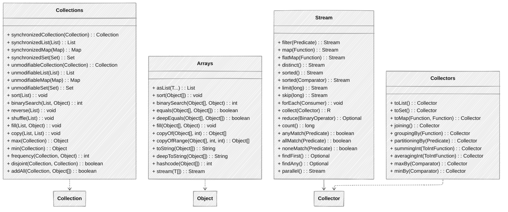

## 概述

Java提供了多种工具类来简化集合操作，提高开发效率。这些工具类主要包括`Collections`（集合操作工具类）、`Arrays`（数组操作工具类）以及`Java 8`引入的`Stream API`。本章将详细介绍这些工具类的使用方法、实现原理和最佳实践。

## 工具类关系图



## `Collections`工具类

### 核心功能

`Collections`类提供了一系列静态方法，用于操作或返回集合。主要功能包括：

+ **同步控制**：将非线程安全的集合转换为线程安全的集合
+ **不可修改集合**：创建不可修改的集合视图
+ **排序和查找**：对集合元素进行排序和二分查找
+ **修改操作**：填充、复制、替换等
+ **查找和比较**：查找最大/最小值、频率统计等

### 使用示例

```java
import java.util.*;

public class CollectionsExample {
    public static void main(String[] args) {
        System.out.println("=== 同步控制示例 ===");
        synchronizedExample();
        
        System.out.println("\n=== 不可修改集合示例 ===");
        unmodifiableExample();
        
        System.out.println("\n=== 排序和查找示例 ===");
        sortingAndSearchingExample();
        
        System.out.println("\n=== 修改操作示例 ===");
        modificationExample();
        
        System.out.println("\n=== 查找和比较示例 ===");
        findingAndComparisonExample();
    }
    
    // 同步控制示例
    private static void synchronizedExample() {
        List<String> list = new ArrayList<>(Arrays.asList("A", "B", "C", "D"));
        Set<String> set = new HashSet<>(Arrays.asList("A", "B", "C", "D"));
        Map<String, Integer> map = new HashMap<>();
        map.put("A", 1);
        map.put("B", 2);
        
        // 创建线程安全的集合
        List<String> syncList = Collections.synchronizedList(list);
        Set<String> syncSet = Collections.synchronizedSet(set);
        Map<String, Integer> syncMap = Collections.synchronizedMap(map);
        
        // 注意：即使是同步集合，在迭代时仍需手动同步
        synchronized (syncList) {
            for (String s : syncList) {
                System.out.println(s);
            }
        }
        
        System.out.println("线程安全集合创建成功");
    }
    
    // 不可修改集合示例
    private static void unmodifiableExample() {
        List<String> list = new ArrayList<>(Arrays.asList("A", "B", "C", "D"));
        Set<String> set = new HashSet<>(Arrays.asList("A", "B", "C", "D"));
        Map<String, Integer> map = new HashMap<>();
        map.put("A", 1);
        map.put("B", 2);
        
        // 创建不可修改的集合视图
        List<String> unmodList = Collections.unmodifiableList(list);
        Set<String> unmodSet = Collections.unmodifiableSet(set);
        Map<String, Integer> unmodMap = Collections.unmodifiableMap(map);
        
        // 尝试修改会抛出UnsupportedOperationException
        try {
            unmodList.add("E");
        } catch (UnsupportedOperationException e) {
            System.out.println("无法修改不可变列表: " + e);
        }
        
        // 注意：不可变视图基于原始集合，原始集合的修改仍会影响视图
        list.add("E");
        System.out.println("原始列表修改后，不可变视图: " + unmodList);
    }
    
    // 排序和查找示例
    private static void sortingAndSearchingExample() {
        List<Integer> numbers = new ArrayList<>(Arrays.asList(5, 3, 8, 1, 2));
        System.out.println("原始列表: " + numbers);
        
        // 自然排序
        Collections.sort(numbers);
        System.out.println("自然排序后: " + numbers);
        
        // 自定义比较器排序（降序）
        Collections.sort(numbers, Comparator.reverseOrder());
        System.out.println("降序排序后: " + numbers);
        
        // 二分查找（必须先排序）
        Collections.sort(numbers); // 先恢复自然排序
        int index = Collections.binarySearch(numbers, 5);
        System.out.println("元素5的索引: " + index);
        
        // 对象列表排序
        List<Person> people = Arrays.asList(
            new Person("Alice", 25),
            new Person("Bob", 20),
            new Person("Charlie", 30)
        );
        Collections.sort(people, Comparator.comparing(Person::getAge));
        System.out.println("按年龄排序的人员: " + people);
    }
    
    // 修改操作示例
    private static void modificationExample() {
        // 填充列表
        List<String> filledList = new ArrayList<>(Collections.nCopies(5, "Default"));
        System.out.println("填充后的列表: " + filledList);
        
        // 替换所有元素
        Collections.fill(filledList, "Updated");
        System.out.println("替换所有元素后: " + filledList);
        
        // 复制列表
        List<String> destList = new ArrayList<>(Collections.nCopies(5, ""));
        List<String> srcList = Arrays.asList("A", "B", "C", "D", "E");
        Collections.copy(destList, srcList);
        System.out.println("复制后的目标列表: " + destList);
        
        // 反转列表
        List<String> reverseList = new ArrayList<>(Arrays.asList("A", "B", "C", "D", "E"));
        Collections.reverse(reverseList);
        System.out.println("反转后的列表: " + reverseList);
        
        // 随机打乱列表
        Collections.shuffle(reverseList);
        System.out.println("打乱后的列表: " + reverseList);
        
        // 替换元素
        List<String> replaceList = new ArrayList<>(Arrays.asList("A", "B", "A", "C", "A"));
        Collections.replaceAll(replaceList, "A", "X");
        System.out.println("替换所有'A'为'X'后: " + replaceList);
    }
    
    // 查找和比较示例
    private static void findingAndComparisonExample() {
        List<Integer> numbers = Arrays.asList(5, 3, 8, 1, 2);
        
        // 查找最大和最小元素
        Integer max = Collections.max(numbers);
        Integer min = Collections.min(numbers);
        System.out.println("最大值: " + max + ", 最小值: " + min);
        
        // 计算频率
        List<String> freqList = Arrays.asList("A", "B", "A", "C", "A");
        int freq = Collections.frequency(freqList, "A");
        System.out.println("'A'出现的次数: " + freq);
        
        // 检查两个集合是否不相交（没有共同元素）
        Collection<String> col1 = Arrays.asList("A", "B", "C");
        Collection<String> col2 = Arrays.asList("D", "E", "F");
        Collection<String> col3 = Arrays.asList("C", "D", "E");
        
        boolean disjoint1 = Collections.disjoint(col1, col2);
        boolean disjoint2 = Collections.disjoint(col1, col3);
        System.out.println("col1和col2不相交: " + disjoint1);
        System.out.println("col1和col3不相交: " + disjoint2);
        
        // 一次性添加多个元素
        List<String> addAllList = new ArrayList<>();
        Collections.addAll(addAllList, "A", "B", "C", "D");
        System.out.println("添加元素后: " + addAllList);
    }
    
    // 内部类，用于演示对象排序
    static class Person {
        private String name;
        private int age;
        
        public Person(String name, int age) {
            this.name = name;
            this.age = age;
        }
        
        public String getName() {
            return name;
        }
        
        public int getAge() {
            return age;
        }
        
        @Override
        public String toString() {
            return name + "(" + age + ")";
        }
    }
}
```

### 同步包装器原理解析

`Collections`提供的同步包装器通过在所有方法上添加同步代码块来实现线程安全：

```java
// Collections.synchronizedList的简化实现
public static <T> List<T> synchronizedList(List<T> list) {
    return (list instanceof RandomAccess ?
            new SynchronizedRandomAccessList<>(list) :
            new SynchronizedList<>(list));
}

static class SynchronizedList<E> extends SynchronizedCollection<E> implements List<E> {
    private final List<E> list;
    
    SynchronizedList(List<E> list) {
        super(list);
        this.list = list;
    }
    
    public E get(int index) {
        synchronized (mutex) { return list.get(index); }
    }
    
    public E set(int index, E element) {
        synchronized (mutex) { return list.set(index, element); }
    }
    
    public void add(int index, E element) {
        synchronized (mutex) { list.add(index, element); }
    }
    
    public E remove(int index) {
        synchronized (mutex) { return list.remove(index); }
    }
    
    // 迭代器方法需要手动同步
    public Iterator<E> iterator() {
        return list.iterator(); // 注意：返回的是原始列表的迭代器
    }
    
    // 其他方法...
}
```

## `Arrays`工具类

### 核心功能

`Arrays`类提供了各种静态方法，用于操作数组。主要功能包括：

+ **数组转集合**：将数组转换为`List`集合
+ **排序**：对数组元素进行排序
+ **查找**：在数组中查找元素
+ **填充和复制**：填充数组元素，复制数组
+ **比较和哈希**：比较数组，计算数组哈希值
+ **其他操作**：数组转字符串等

### 使用示例

```java
import java.util.*;
import java.util.stream.Collectors;

public class ArraysExample {
    public static void main(String[] args) {
        System.out.println("=== 数组转集合示例 ===");
        arrayToListExample();
        
        System.out.println("\n=== 排序示例 ===");
        sortingExample();
        
        System.out.println("\n=== 查找示例 ===");
        searchingExample();
        
        System.out.println("\n=== 填充和复制示例 ===");
        fillAndCopyExample();
        
        System.out.println("\n=== 比较和哈希示例 ===");
        comparisonExample();
        
        System.out.println("\n=== 数组转字符串示例 ===");
        toStringExample();
        
        System.out.println("\n=== 数组流操作示例 ===");
        streamExample();
    }
    
    // 数组转集合示例
    private static void arrayToListExample() {
        String[] array = {"A", "B", "C", "D"};
        
        // 转换为List（注意：返回的List是固定大小的，不能添加或删除元素）
        List<String> list = Arrays.asList(array);
        System.out.println("数组转List: " + list);
        
        // 尝试修改List会影响原数组
        list.set(0, "X");
        System.out.println("修改List后，原数组: " + Arrays.toString(array));
        
        // 如果需要可变的List，可以使用ArrayList构造函数包装
        List<String> mutableList = new ArrayList<>(Arrays.asList(array));
        mutableList.add("E");
        System.out.println("可变List: " + mutableList);
        
        // Java 8+ 也可以使用Stream API
        List<String> streamList = Arrays.stream(array).collect(Collectors.toList());
        System.out.println("Stream API转List: " + streamList);
    }
    
    // 排序示例
    private static void sortingExample() {
        // 基本类型数组排序
        int[] intArray = {5, 3, 8, 1, 2};
        Arrays.sort(intArray);
        System.out.println("整型数组排序: " + Arrays.toString(intArray));
        
        // 对象数组排序
        String[] strArray = {"banana", "apple", "pear", "orange"};
        Arrays.sort(strArray);
        System.out.println("字符串数组排序: " + Arrays.toString(strArray));
        
        // 自定义比较器排序
        Arrays.sort(strArray, Comparator.comparing(String::length));
        System.out.println("按长度排序的字符串数组: " + Arrays.toString(strArray));
        
        // 部分排序（对指定范围排序）
        int[] partialArray = {5, 3, 8, 1, 2, 9, 4};
        Arrays.sort(partialArray, 1, 5); // 对索引1到4的元素排序（不包括5）
        System.out.println("部分排序后的数组: " + Arrays.toString(partialArray));
        
        // 并行排序（Java 8+）
        int[] largeArray = new int[1000];
        for (int i = 0; i < largeArray.length; i++) {
            largeArray[i] = (int) (Math.random() * 1000);
        }
        Arrays.parallelSort(largeArray);
        System.out.println("并行排序后的大型数组（前10个）: " + 
                          Arrays.toString(Arrays.copyOf(largeArray, 10)));
    }
    
    // 查找示例
    private static void searchingExample() {
        // 二分查找（必须先排序）
        int[] sortedArray = {1, 2, 3, 5, 8};
        int index = Arrays.binarySearch(sortedArray, 5);
        System.out.println("元素5的索引: " + index);
        
        // 找不到元素时，返回-插入点-1
        index = Arrays.binarySearch(sortedArray, 4);
        System.out.println("元素4的插入点: " + (-index - 1));
        
        // 对象数组的二分查找
        String[] sortedStrArray = {"apple", "banana", "orange", "pear"};
        index = Arrays.binarySearch(sortedStrArray, "orange");
        System.out.println("字符串'orange'的索引: " + index);
        
        // 使用自定义比较器的二分查找
        index = Arrays.binarySearch(sortedStrArray, "orange", Comparator.naturalOrder());
        System.out.println("使用比较器查找'orange'的索引: " + index);
    }
    
    // 填充和复制示例
    private static void fillAndCopyExample() {
        // 填充数组
        int[] filledArray = new int[5];
        Arrays.fill(filledArray, 10);
        System.out.println("填充后的数组: " + Arrays.toString(filledArray));
        
        // 部分填充
        Arrays.fill(filledArray, 1, 4, 20); // 索引1到3（不包括4）
        System.out.println("部分填充后的数组: " + Arrays.toString(filledArray));
        
        // 复制数组
        int[] sourceArray = {1, 2, 3, 4, 5};
        int[] copiedArray = Arrays.copyOf(sourceArray, sourceArray.length);
        System.out.println("复制后的数组: " + Arrays.toString(copiedArray));
        
        // 复制到更大的数组（多余部分用默认值填充）
        int[] largerArray = Arrays.copyOf(sourceArray, 8);
        System.out.println("复制到更大数组: " + Arrays.toString(largerArray));
        
        // 复制到更小的数组（截断）
        int[] smallerArray = Arrays.copyOf(sourceArray, 3);
        System.out.println("复制到更小数组: " + Arrays.toString(smallerArray));
        
        // 复制指定范围
        int[] rangeArray = Arrays.copyOfRange(sourceArray, 1, 4); // 索引1到3（不包括4）
        System.out.println("复制指定范围后的数组: " + Arrays.toString(rangeArray));
    }
    
    // 比较和哈希示例
    private static void comparisonExample() {
        // 数组比较
        int[] array1 = {1, 2, 3};
        int[] array2 = {1, 2, 3};
        int[] array3 = {1, 2, 4};
        
        boolean equal1 = Arrays.equals(array1, array2);
        boolean equal2 = Arrays.equals(array1, array3);
        System.out.println("array1和array2相等: " + equal1);
        System.out.println("array1和array3相等: " + equal2);
        
        // 多维数组比较
        int[][] matrix1 = {{1, 2}, {3, 4}};
        int[][] matrix2 = {{1, 2}, {3, 4}};
        int[][] matrix3 = {{1, 2}, {3, 5}};
        
        boolean deepEqual1 = Arrays.deepEquals(matrix1, matrix2);
        boolean deepEqual2 = Arrays.deepEquals(matrix1, matrix3);
        System.out.println("matrix1和matrix2相等: " + deepEqual1);
        System.out.println("matrix1和matrix3相等: " + deepEqual2);
        
        // 计算哈希值
        int hashCode = Arrays.hashCode(array1);
        int deepHashCode = Arrays.deepHashCode(matrix1);
        System.out.println("array1的哈希值: " + hashCode);
        System.out.println("matrix1的哈希值: " + deepHashCode);
    }
    
    // 数组转字符串示例
    private static void toStringExample() {
        int[] array = {1, 2, 3, 4, 5};
        String str = Arrays.toString(array);
        System.out.println("数组转字符串: " + str);
        
        // 多维数组转字符串
        int[][] matrix = {{1, 2}, {3, 4}, {5, 6}};
        String deepStr = Arrays.deepToString(matrix);
        System.out.println("多维数组转字符串: " + deepStr);
    }
    
    // 数组流操作示例
    private static void streamExample() {
        int[] numbers = {1, 2, 3, 4, 5, 6, 7, 8, 9, 10};
        
        // 使用Stream API处理数组
        int sum = Arrays.stream(numbers)
                .filter(n -> n % 2 == 0) // 筛选偶数
                .map(n -> n * 2)         // 每个元素乘以2
                .sum();                  // 求和
        
        System.out.println("偶数的两倍之和: " + sum);
        
        // 字符串数组的流操作
        String[] words = {"apple", "banana", "orange", "pear", "grape"};
        List<String> longWords = Arrays.stream(words)
                .filter(w -> w.length() > 5)  // 筛选长度大于5的单词
                .collect(Collectors.toList());
        
        System.out.println("长度大于5的单词: " + longWords);
        
        // 使用并行流
        long count = Arrays.stream(numbers)
                .parallel()
                .filter(n -> n > 5)
                .count();
        
        System.out.println("大于5的元素数量: " + count);
    }
}
```

### `Arrays.asList()`的注意事项

1. **返回的**`List`**是固定大小的**：不能调用`add()`、`remove()`等会改变大小的方法
2. **返回的**`List`**是数组的视图**：修改`List`中的元素会影响原数组
3. **不能存储基本类型**：需要使用包装类
4. **性能考虑**：避免频繁创建临时集合

## `Stream API`

### 核心概念

`Stream API`是`Java 8`引入的函数式编程特性，提供了一种声明式的方式来处理数据集合。核心概念包括：

+ **Stream**：数据序列的抽象表示，不是数据结构，不存储数据，而是通过管道操作数据
+ **中间操作**：返回新的`Stream`，如`filter`、`map`等
+ **终端操作**：消费`Stream`并产生结果，如`collect`、`forEach`等
+ **延迟执行**：中间操作在终端操作调用前不会执行

### 基本操作示例

```java
import java.util.*;
import java.util.stream.*;

public class StreamBasicExample {
    public static void main(String[] args) {
        List<String> names = Arrays.asList("Alice", "Bob", "Charlie", "David", "Eva", "Frank");
        
        System.out.println("=== 过滤操作 ===");
        // 过滤长度大于3的名字
        List<String> filteredNames = names.stream()
                .filter(name -> name.length() > 3)
                .collect(Collectors.toList());
        System.out.println("长度大于3的名字: " + filteredNames);
        
        System.out.println("\n=== 映射操作 ===");
        // 将名字转换为大写
        List<String> upperCaseNames = names.stream()
                .map(String::toUpperCase)
                .collect(Collectors.toList());
        System.out.println("大写名字: " + upperCaseNames);
        
        // 计算每个名字的长度
        List<Integer> nameLengths = names.stream()
                .map(String::length)
                .collect(Collectors.toList());
        System.out.println("名字长度: " + nameLengths);
        
        System.out.println("\n=== 排序操作 ===");
        // 按字母顺序排序
        List<String> sortedNames = names.stream()
                .sorted()
                .collect(Collectors.toList());
        System.out.println("按字母顺序排序: " + sortedNames);
        
        // 按长度降序排序
        List<String> sortedByLength = names.stream()
                .sorted(Comparator.comparing(String::length).reversed())
                .collect(Collectors.toList());
        System.out.println("按长度降序排序: " + sortedByLength);
        
        System.out.println("\n=== 去重操作 ===");
        List<String> withDuplicates = Arrays.asList("Alice", "Bob", "Alice", "David", "Bob");
        List<String> distinctNames = withDuplicates.stream()
                .distinct()
                .collect(Collectors.toList());
        System.out.println("去重后的名字: " + distinctNames);
        
        System.out.println("\n=== 限制和跳过 ===");
        // 取前3个元素
        List<String> firstThree = names.stream()
                .limit(3)
                .collect(Collectors.toList());
        System.out.println("前3个名字: " + firstThree);
        
        // 跳过前2个元素
        List<String> skipFirstTwo = names.stream()
                .skip(2)
                .collect(Collectors.toList());
        System.out.println("跳过前2个后的名字: " + skipFirstTwo);
        
        System.out.println("\n=== 匹配操作 ===");
        // 是否存在长度大于5的名字
        boolean anyLongerThan5 = names.stream()
                .anyMatch(name -> name.length() > 5);
        System.out.println("存在长度大于5的名字: " + anyLongerThan5);
        
        // 是否所有名字都以'A'开头
        boolean allStartWithA = names.stream()
                .allMatch(name -> name.startsWith("A"));
        System.out.println("所有名字都以'A'开头: " + allStartWithA);
        
        // 是否没有名字以'Z'开头
        boolean noneStartWithZ = names.stream()
                .noneMatch(name -> name.startsWith("Z"));
        System.out.println("没有名字以'Z'开头: " + noneStartWithZ);
        
        System.out.println("\n=== 查找操作 ===");
        // 查找第一个以'A'开头的名字
        Optional<String> firstA = names.stream()
                .filter(name -> name.startsWith("A"))
                .findFirst();
        System.out.println("第一个以'A'开头的名字: " + firstA.orElse("None"));
        
        // 查找任意一个以'Z'开头的名字
        Optional<String> anyZ = names.stream()
                .filter(name -> name.startsWith("Z"))
                .findAny();
        System.out.println("是否存在以'Z'开头的名字: " + anyZ.isPresent());
    }
}
```

### `Collectors`收集器示例

```java
import java.util.*;
import java.util.stream.*;
import java.util.function.*;

public class CollectorsExample {
    public static void main(String[] args) {
        List<Person> people = Arrays.asList(
            new Person("Alice", 25, "F", "Engineering"),
            new Person("Bob", 30, "M", "Marketing"),
            new Person("Charlie", 35, "M", "Engineering"),
            new Person("Diana", 28, "F", "HR"),
            new Person("Eva", 22, "F", "Marketing"),
            new Person("Frank", 40, "M", "Engineering")
        );
        
        System.out.println("=== 收集到集合 ===");
        // 收集到List
        List<String> namesList = people.stream()
                .map(Person::getName)
                .collect(Collectors.toList());
        System.out.println("名字列表: " + namesList);
        
        // 收集到Set
        Set<String> departments = people.stream()
                .map(Person::getDepartment)
                .collect(Collectors.toSet());
        System.out.println("部门集合: " + departments);
        
        // 收集到指定集合
        LinkedList<String> namesLinkedList = people.stream()
                .map(Person::getName)
                .collect(Collectors.toCollection(LinkedList::new));
        System.out.println("LinkedList中的名字: " + namesLinkedList);
        
        System.out.println("\n=== 收集到Map ===");
        // 收集到Map（注意：如果有重复的键，会抛出异常）
        Map<String, Integer> nameToAge = people.stream()
                .collect(Collectors.toMap(Person::getName, Person::getAge));
        System.out.println("名字到年龄的映射: " + nameToAge);
        
        // 处理重复键（选择第一个值）
        List<Person> peopleWithDuplicateNames = Arrays.asList(
            new Person("Alice", 25, "F", "Engineering"),
            new Person("Alice", 30, "F", "Marketing")
        );
        
        Map<String, Integer> nameToAgeWithMerge = peopleWithDuplicateNames.stream()
                .collect(Collectors.toMap(
                    Person::getName, 
                    Person::getAge,
                    (existing, replacement) -> existing // 保留旧值
                ));
        System.out.println("处理重复键后的映射: " + nameToAgeWithMerge);
        
        // 收集到指定的Map实现
        LinkedHashMap<String, Person> orderedByInsertion = people.stream()
                .collect(Collectors.toMap(
                    Person::getName, 
                    Function.identity(),
                    (e1, e2) -> e1,
                    LinkedHashMap::new
                ));
        System.out.println("按插入顺序的Map: " + orderedByInsertion);
        
        System.out.println("\n=== 分组操作 ===");
        // 按部门分组
        Map<String, List<Person>> byDepartment = people.stream()
                .collect(Collectors.groupingBy(Person::getDepartment));
        System.out.println("按部门分组: " + byDepartment);
        
        // 按部门分组，并只保留名字
        Map<String, List<String>> namesByDepartment = people.stream()
                .collect(Collectors.groupingBy(
                    Person::getDepartment,
                    Collectors.mapping(Person::getName, Collectors.toList())
                ));
        System.out.println("部门到名字列表的映射: " + namesByDepartment);
        
        // 多级分组（先按部门，再按性别）
        Map<String, Map<String, List<Person>>> byDepartmentAndGender = people.stream()
                .collect(Collectors.groupingBy(
                    Person::getDepartment,
                    Collectors.groupingBy(Person::getGender)
                ));
        System.out.println("按部门和性别多级分组: " + byDepartmentAndGender);
        
        System.out.println("\n=== 分区操作 ===");
        // 按年龄是否大于30分区
        Map<Boolean, List<Person>> partitionedByAge = people.stream()
                .collect(Collectors.partitioningBy(p -> p.getAge() > 30));
        System.out.println("年龄>30的人员: " + partitionedByAge.get(true));
        System.out.println("年龄<=30的人员: " + partitionedByAge.get(false));
        
        System.out.println("\n=== 归约操作 ===");
        // 计算平均年龄
        Double averageAge = people.stream()
                .collect(Collectors.averagingInt(Person::getAge));
        System.out.println("平均年龄: " + averageAge);
        
        // 计算总年龄
        Integer totalAge = people.stream()
                .collect(Collectors.summingInt(Person::getAge));
        System.out.println("总年龄: " + totalAge);
        
        // 统计年龄信息
        IntSummaryStatistics ageStats = people.stream()
                .collect(Collectors.summarizingInt(Person::getAge));
        System.out.println("年龄统计: 平均=" + ageStats.getAverage() + 
                          ", 总和=" + ageStats.getSum() + 
                          ", 最小值=" + ageStats.getMin() + 
                          ", 最大值=" + ageStats.getMax() + 
                          ", 数量=" + ageStats.getCount());
        
        System.out.println("\n=== 连接操作 ===");
        // 连接名字
        String joinedNames = people.stream()
                .map(Person::getName)
                .collect(Collectors.joining(", "));
        System.out.println("连接后的名字: " + joinedNames);
        
        // 自定义连接格式
        String formattedNames = people.stream()
                .map(p -> p.getName() + "(" + p.getAge() + ")")
                .collect(Collectors.joining(", ", "[", "]"));
        System.out.println("格式化后的名字: " + formattedNames);
        
        // 按部门连接名字
        Map<String, String> departmentNames = people.stream()
                .collect(Collectors.groupingBy(
                    Person::getDepartment,
                    Collectors.mapping(Person::getName, Collectors.joining(", "))
                ));
        System.out.println("各部门人员: " + departmentNames);
    }
    
    static class Person {
        private String name;
        private int age;
        private String gender;
        private String department;
        
        public Person(String name, int age, String gender, String department) {
            this.name = name;
            this.age = age;
            this.gender = gender;
            this.department = department;
        }
        
        public String getName() { return name; }
        public int getAge() { return age; }
        public String getGender() { return gender; }
        public String getDepartment() { return department; }
        
        @Override
        public String toString() {
            return name + "(" + age + ", " + gender + ", " + department + ")";
        }
    }
}
```

### 高级收集器示例

```java
import java.util.*;
import java.util.stream.*;
import java.util.function.*;

public class AdvancedCollectorsExample {
    public static void main(String[] args) {
        List<Transaction> transactions = Arrays.asList(
            new Transaction("ACME", "Food", 100.0),
            new Transaction("ACME", "Clothing", 200.0),
            new Transaction("BestBuy", "Electronics", 150.0),
            new Transaction("BestBuy", "Books", 50.0),
            new Transaction("Target", "Food", 75.0),
            new Transaction("Target", "Clothing", 125.0)
        );
        
        System.out.println("=== 按店铺分组并计算总交易额 ===");
        // 按店铺分组并计算总交易额
        Map<String, Double> totalByStore = transactions.stream()
                .collect(Collectors.groupingBy(
                    Transaction::getStore,
                    Collectors.summingDouble(Transaction::getAmount)
                ));
        System.out.println("各店铺总交易额: " + totalByStore);
        
        System.out.println("\n=== 查找每个类别的最高交易额 ===");
        // 查找每个类别的最高交易额
        Map<String, Optional<Transaction>> maxByCategory = transactions.stream()
                .collect(Collectors.groupingBy(
                    Transaction::getCategory,
                    Collectors.maxBy(Comparator.comparing(Transaction::getAmount))
                ));
        
        // 转换Optional为具体值
        Map<String, Double> maxAmountByCategory = maxByCategory.entrySet().stream()
                .collect(Collectors.toMap(
                    Map.Entry::getKey,
                    e -> e.getValue().orElseThrow().getAmount()
                ));
        System.out.println("各类别最高交易额: " + maxAmountByCategory);
        
        System.out.println("\n=== 复杂的多级分组和收集 ===");
        // 按店铺和类别分组，并计算每组的平均交易额
        Map<String, Map<String, Double>> avgByStoreAndCategory = transactions.stream()
                .collect(Collectors.groupingBy(
                    Transaction::getStore,
                    Collectors.groupingBy(
                        Transaction::getCategory,
                        Collectors.averagingDouble(Transaction::getAmount)
                    )
                ));
        System.out.println("各店铺各类别的平均交易额: " + avgByStoreAndCategory);
        
        System.out.println("\n=== 分区并收集多个统计信息 ===");
        // 按金额是否大于100分区，并为每个分区收集统计信息
        Map<Boolean, DoubleSummaryStatistics> statsByAmount = transactions.stream()
                .collect(Collectors.partitioningBy(
                    t -> t.getAmount() > 100,
                    Collectors.summarizingDouble(Transaction::getAmount)
                ));
        
        System.out.println("金额>100的交易统计: " + statsByAmount.get(true));
        System.out.println("金额<=100的交易统计: " + statsByAmount.get(false));
        
        System.out.println("\n=== 使用收集器进行自定义收集 ===");
        // 自定义收集器：计算每个类别的总交易额和交易次数
        class CategoryStats {
            private final String category;
            private double totalAmount = 0;
            private int count = 0;
            
            public CategoryStats(String category) {
                this.category = category;
            }
            
            public void accept(Transaction t) {
                totalAmount += t.getAmount();
                count++;
            }
            
            public CategoryStats combine(CategoryStats other) {
                totalAmount += other.totalAmount;
                count += other.count;
                return this;
            }
            
            @Override
            public String toString() {
                return "CategoryStats{" +
                        "category='" + category + '\'' +
                        ", totalAmount=" + totalAmount +
                        ", count=" + count +
                        ", average=" + (totalAmount / count) +
                        '}';
            }
        }
        
        // 使用自定义收集器
        Map<String, CategoryStats> customStatsByCategory = transactions.stream()
                .collect(Collectors.toMap(
                    Transaction::getCategory,
                    t -> {
                        CategoryStats stats = new CategoryStats(t.getCategory());
                        stats.accept(t);
                        return stats;
                    },
                    CategoryStats::combine
                ));
        
        System.out.println("自定义收集器结果: " + customStatsByCategory);
        
        System.out.println("\n=== 使用收集器创建不可变集合 ===");
        // 创建不可变List
        List<String> immutableList = transactions.stream()
                .map(Transaction::getStore)
                .distinct()
                .collect(Collectors.collectingAndThen(
                    Collectors.toList(),
                    Collections::unmodifiableList
                ));
        
        System.out.println("不可变店铺列表: " + immutableList);
        
        try {
            immutableList.add("Walmart");
            System.out.println("添加成功（这不应该发生）");
        } catch (UnsupportedOperationException e) {
            System.out.println("正确捕获异常: 无法修改不可变列表");
        }
    }
    
    static class Transaction {
        private String store;
        private String category;
        private double amount;
        
        public Transaction(String store, String category, double amount) {
            this.store = store;
            this.category = category;
            this.amount = amount;
        }
        
        public String getStore() { return store; }
        public String getCategory() { return category; }
        public double getAmount() { return amount; }
        
        @Override
        public String toString() {
            return "Transaction{" +
                    "store='" + store + '\'' +
                    ", category='" + category + '\'' +
                    ", amount=" + amount +
                    '}';
        }
    }
}
```

### 并行流处理示例

```java
import java.util.*;
import java.util.stream.*;

public class ParallelStreamExample {
    public static void main(String[] args) {
        // 创建大型数据集
        int size = 10_000_000;
        List<Double> largeList = new ArrayList<>(size);
        for (int i = 0; i < size; i++) {
            largeList.add(Math.random());
        }
        
        System.out.println("=== 顺序流 vs 并行流性能对比 ===");
        
        // 顺序流处理
        long startSequential = System.currentTimeMillis();
        double sumSequential = largeList.stream()
                .filter(n -> n > 0.5)
                .mapToDouble(n -> n * 2)
                .sum();
        long endSequential = System.currentTimeMillis();
        
        System.out.println("顺序流处理时间: " + (endSequential - startSequential) + "ms");
        System.out.println("顺序流处理结果: " + sumSequential);
        
        // 并行流处理
        long startParallel = System.currentTimeMillis();
        double sumParallel = largeList.parallelStream()
                .filter(n -> n > 0.5)
                .mapToDouble(n -> n * 2)
                .sum();
        long endParallel = System.currentTimeMillis();
        
        System.out.println("并行流处理时间: " + (endParallel - startParallel) + "ms");
        System.out.println("并行流处理结果: " + sumParallel);
        
        // 性能提升比例
        double speedup = (double)(endSequential - startSequential) / (endParallel - startParallel);
        System.out.println("并行流比顺序流快 " + String.format("%.2f", speedup) + " 倍");
        
        System.out.println("\n=== 并行流注意事项 ===");
        
        // 示例1：使用并行流时的线程安全问题
        System.out.println("\n示例1：线程安全问题");
        List<Integer> numbers = IntStream.range(0, 1000).boxed().collect(Collectors.toList());
        
        // 非线程安全的累加器
        int[] sum1 = {0};
        numbers.parallelStream().forEach(i -> sum1[0] += i);
        System.out.println("非线程安全累加结果: " + sum1[0]);  // 结果可能不正确
        
        // 线程安全的累加器
        int sum2 = numbers.parallelStream().reduce(0, Integer::sum);
        System.out.println("正确累加结果: " + sum2);
        
        // 示例2：并行流中的排序
        System.out.println("\n示例2：并行流中的排序");
        List<Integer> shuffled = new ArrayList<>(numbers);
        Collections.shuffle(shuffled);
        
        List<Integer> sorted = shuffled.parallelStream()
                .sorted()
                .collect(Collectors.toList());
        System.out.println("排序后前10个元素: " + sorted.subList(0, 10));
        
        // 示例3：使用自定义并行度
        System.out.println("\n示例3：设置自定义并行度");
        ForkJoinPool customPool = new ForkJoinPool(4);  // 设置4个并行线程
        
        try {
            customPool.submit(() -> {
                long startCustom = System.currentTimeMillis();
                double sumCustom = largeList.parallelStream()
                        .filter(n -> n > 0.5)
                        .mapToDouble(n -> n * 2)
                        .sum();
                long endCustom = System.currentTimeMillis();
                System.out.println("自定义并行度处理时间: " + (endCustom - startCustom) + "ms");
            }).get();
        } catch (Exception e) {
            e.printStackTrace();
        } finally {
            customPool.shutdown();
        }
        
        // 示例4：流的并行性检查
        System.out.println("\n示例4：流的并行性检查");
        boolean isParallel1 = numbers.stream().isParallel();
        boolean isParallel2 = numbers.parallelStream().isParallel();
        boolean isParallel3 = numbers.stream().parallel().isParallel();
        boolean isParallel4 = numbers.parallelStream().sequential().isParallel();
        
        System.out.println("顺序流是并行的: " + isParallel1);
        System.out.println("并行流是并行的: " + isParallel2);
        System.out.println("转换为并行流: " + isParallel3);
        System.out.println("并行流转回顺序流: " + isParallel4);
    }
}
```

## 工具类最佳实践

### `Collections`工具类最佳实践

1. **优先使用线程安全的集合实现**：
    + `Collections.synchronizedXxx()`包装器性能较差，考虑使用`ConcurrentHashMap`等专用并发集合
2. **创建不可变集合**：
    + 使用`Collections.unmodifiableXxx()`创建不可变视图
    + `Java 9+`可以使用`List.of(), Set.of(), Map.of()`等工厂方法创建真正的不可变集合
3. **避免频繁的排序操作**：
    + 对于需要频繁排序的场景，考虑使用`TreeSet`或`TreeMap`
    + 对于大数据量，优先考虑并行排序
4. **注意操作的时间复杂度**：
    + `binarySearch`要求集合已排序，复杂度为O(log n)
    + `frequency`操作复杂度为O(n)
    + `copy`操作复杂度为O(n)

### `Arrays`工具类最佳实践

1. `Arrays.asList()`**的使用**：
    + 注意返回的List是固定大小的，需要可变集合时使用`new ArrayList<>(Arrays.asList(...))`
    + 避免存储基本类型，使用包装类
2. **数组排序选择**：
    + 小数据量使用`Arrays.sort()`
    + 大数据量考虑`Arrays.parallelSort()`
    + 自定义排序时注意比较器的性能
3. **数组与集合的转换**：
    + 频繁转换时考虑使用`Stream API`
    + 注意转换后的集合是否可变
4. **避免创建不必要的数组副本**：
    + 只在必要时使用`copyOf`和`copyOfRange`
    + 考虑使用`System.arraycopy`进行底层数组复制

### `Stream API`最佳实践

1. **并行流的使用场景**：
    + 大数据量（通常百万级以上）
    + 计算密集型操作
    + 没有共享可变状态
2. **避免的问题**：
    + 共享可变状态会导致并行流结果不正确
    + 过度并行化会导致性能下降
    + 不要在并行流中使用有状态的lambda表达式
3. **性能优化**：
    + 避免重复创建流
    + 减少中间操作的数量
    + 使用更具体的收集器，如`toList()`、`toSet()`等
4. **异常处理**：
    + 使用`try-catch`包装可能抛出异常的操作
    + 考虑使用`Optional`处理可能为空的结果

## 工具类对比总结

| 功能 | Collections | Arrays | Stream API |
| :---: | :---: | :---: | :---: |
| 同步集合 | 提供synchronizedXxx()方法 | 不适用 | 不适用 |
| 不可变集合 | 提供unmodifiableXxx()方法 | 不适用 | 通过collectingAndThen实现 |
| 排序 | 提供sort()方法 | 提供sort()和parallelSort() | 提供sorted()方法 |
| 查找 | 提供binarySearch()方法 | 提供binarySearch()方法 | 提供findFirst()、findAny()等 |
| 集合转换 | 提供addAll()方法 | 提供asList()方法 | 提供collect()方法 |
| 并行处理 | 不直接支持 | 提供parallelSort()方法 | 提供parallelStream()和parallel()方法 |
| 数据处理 | 基础操作 | 基础操作 | 丰富的函数式操作 |
| 适用场景 | 集合操作，线程安全 | 数组操作，转换 | 数据处理，函数式编程 |

## 小结

Java集合框架提供了强大的工具类，包括`Collections`、`Arrays`和`Stream API`，它们极大地简化了集合和数组的操作，提高了开发效率和代码可读性。

`Collections`类主要用于集合操作，提供了同步控制、不可修改集合创建、排序查找等功能。`Arrays`类专注于数组操作，提供了排序、查找、填充、复制等功能。而`Stream API`则引入了函数式编程范式，提供了声明式的数据处理方式，支持并行处理。

在实际开发中，我们需要根据具体场景选择合适的工具类和方法，同时注意性能和线程安全问题。通过合理使用这些工具类，我们可以编写出更简洁、高效、可靠的代码。
