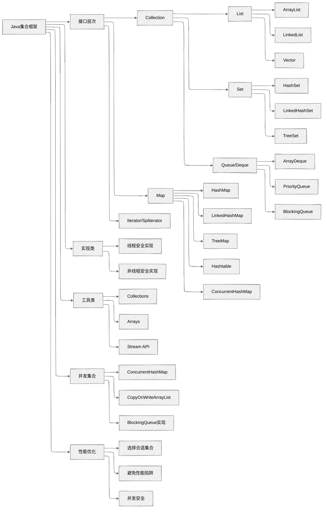

## 知识体系概览



## 高频面试题分类

### 基础概念类

#### `ArrayList`、`LinkedList`、`Vector`的区别与使用场景

**核心要点**：

+ **底层结构**：`ArrayList`基于动态数组，`LinkedList`基于双向链表，`Vector`基于动态数组
+ **线程安全性**：`Vector`线程安全（synchronized），`ArrayList`和`LinkedList`非线程安全
+ **性能特点**：
  + `ArrayList`：随机访问快（O(1)），插入删除慢（O(n)）
  + `LinkedList`：随机访问慢（O(n)），插入删除快（O(1)）
  + `Vector`：性能较低，已被并发集合替代（如`ConcurrentHashMap`、`CopyOnWriteArrayList`）
+ **内存占用**：`ArrayList`内存连续，`LinkedList`每个节点有前后指针开销
+ **扩容机制**：`ArrayList`扩容为1.5倍，`Vector`扩容为2倍

**使用场景**：

+ `ArrayList`：读多写少，需要频繁随机访问
+ `LinkedList`：写多读少，频繁插入删除，或需要作为队列/栈使用
+ `Vector`：几乎不推荐使用，可用`CopyOnWriteArrayList`或`Collections.synchronizedList`替代

#### `HashMap`的工作原理和实现细节

**核心要点**：

+ **存储结构**：`JDK 8+`采用数组+链表/红黑树结构
+ **哈希算法**：`key.hashCode()` → 扰动函数 → 取模定位桶
+ **冲突解决**：链地址法（链表+红黑树）
+ **红黑树转换**：链表长度>=`8`且数组长度>=`64`时转换为红黑树
+ **扩容机制**：
  + 触发条件：元素数量 > 数组长度 * 负载因子(默认`0.75`)
  + 扩容大小：原容量的`2`倍
  + `JDK 8+`优化：扩容时无需重新计算哈希，只需判断最高位是否为1，决定是否迁移到新桶
+ **线程安全性**：非线程安全，可能导致死循环、数据丢失等问题
+ `key`**允许为**`null`：放在数组索引`0`的位置

**JDK 7 vs JDK 8的主要区别**：

+ **存储结构**：`JDK 7`用数组+链表，`JDK 8`用数组+链表/红黑树
+ **链表插入**：`JDK 7`用头插法，`JDK 8`用尾插法
+ **扩容机制**：`JDK 8`优化了重新哈希的过程，无需重新计算哈希，只需判断最高位是否为1，决定是否迁移到新桶
+ **性能**：`JDK 8`在哈希冲突严重时性能更好

#### `HashSet`、`TreeSet`、`LinkedHashSet`的区别与使用场景

**核心要点**：

+ **底层实现**：`HashSet`基于`HashMap`，`TreeSet`基于`TreeMap`，`LinkedHashSet`基于`LinkedHashMap`
+ **排序特性**：`HashSet`无序，`TreeSet`有序（自然排序或自定义排序），`LinkedHashSet`维护插入顺序
+ **性能特点**：
  + `HashSet`：添加、查询、删除都是`O(1)`
  + `TreeSet`：添加、查询、删除都是`O(log n)`
  + `LinkedHashSet`：略慢于`HashSet`，但支持插入顺序遍历
+ **null值**：`HashSet`和`LinkedHashSet`允许一个`null`，`TreeSet`不允许`null`
+ **使用场景**：
  + `HashSet`：只需去重，不关心顺序
  + `TreeSet`：需要排序或范围查询
  + `LinkedHashSet`：需要去重并保持插入顺序

### 性能优化类

#### 集合类的性能优化技巧

**核心要点**：

1. **初始容量设置**：根据预期元素数量设置合理的初始容量，避免频繁扩容
2. **负载因子调整**：权衡时间和空间效率（`HashMap`默认`0.75`）
3. **减少哈希冲突**：合理实现`hashCode()`和`equals()`方法
4. **选择合适集合**：根据操作特性选择合适的集合实现
5. **批量操作**：使用`addAll()`等批量方法替代循环添加
6. **避免自动装箱**：优先使用原始类型集合（如`IntArrayList`），避免自动装箱拆箱操作
7. **及时清理**：不再使用的集合应及时置为`null`，帮助`GC`回收内存
8. **迭代器使用**：优先使用迭代器遍历，避免使用随机访问

#### 并发集合的选择与使用

**核心要点**：

1. **读多写少场景**：使用`CopyOnWriteArrayList`/`CopyOnWriteArraySet`
2. **高频读写场景**：使用`ConcurrentHashMap`
3. **有序并发Map**：使用`ConcurrentSkipListMap`
4. **生产者-消费者模式**：使用`BlockingQueue`实现
5. **避免使用**：尽量避免使用`Hashtable`和`Vector`，因为它们都是线程安全的，性能较低
6. **细粒度锁**：并发集合通常使用细粒度锁或无锁算法，性能优于`Collections.synchronizedXxx()`
7. **弱一致性**：理解并发集合迭代器的弱一致性语义

### 源码理解类

#### `equals()`和`hashCode()`方法的契约及正确实现

**核心要点**：

1. **契约关系**：
    + 如果两个对象`equals`，则它们的`hashCode`必须相等
    + 如果两个对象`hashCode`不相等，则它们一定不`equals`
    + 同一对象多次调用`hashCode()`应返回相同值（只要对象未被修改）
2. **常见错误**：
    + 只重写`equals()`而不重写`hashCode()`
    + `hashCode()`实现过于简单，导致大量哈希冲突
    + `equals()`实现违反自反性、对称性、传递性
3. **正确实现原则**：
    + `equals()`：考虑所有关键属性，处理`null`和类型检查
    + `hashCode()`：结合所有关键属性，使用质数乘积法减少冲突（如`31 * hash + field`）

**示例代码**：

```java
public class Employee {
    private String id;
    private String name;
    private int age;
    
    @Override
    public boolean equals(Object o) {
        if (this == o) return true;
        if (o == null || getClass() != o.getClass()) return false;
        Employee employee = (Employee) o;
        return age == employee.age && 
               Objects.equals(id, employee.id) && 
               Objects.equals(name, employee.name);
    }
    
    @Override
    public int hashCode() {
        return Objects.hash(id, name, age);
    }
}
```

#### `HashMap`的扩容机制与线程安全问题

**核心要点**：

1. **扩容过程**：
    + 创建新的更大的数组（原容量的`2`倍）
    + 重新计算每个元素在新数组中的位置
    + 将元素复制到新数组
2. **JDK 7线程安全问题**：
    + 多线程并发扩容可能导致链表成环
    + 导致`get()`操作进入死循环
    + 原因：头插法+多线程并发修改
3. **JDK 8改进**：
    + 使用尾插法避免链表成环
    + 但仍非线程安全，可能导致数据丢失
4. **线程安全替代方案**：
    + `ConcurrentHashMap`：高并发场景下的线程安全Map实现
    + `Collections.synchronizedMap`：低并发场景下的线程安全Map包装器
    + `HashTable`：不推荐使用，因为它是同步的，性能较低

### 实战应用类

#### 如何实现线程安全的单例模式

**核心要点**：

1. **枚举单例**：最简单且线程安全的方式
2. **双重检查锁定**：需要使用`volatile`关键字防止指令重排序导致的线程安全问题
3. **静态内部类**：利用类加载机制保证线程安全
4. **使用**`ConcurrentHashMap`：可以实现注册表式的单例

`ConcurrentHashMap`**实现示例**：

```java
public class ConcurrentSingletonRegistry {
    private static final ConcurrentHashMap<String, Object> INSTANCES = new ConcurrentHashMap<>();
    
    public static <T> T getInstance(String key, Supplier<T> supplier) {
        return (T) INSTANCES.computeIfAbsent(key, k -> supplier.get());
    }
}
```

#### 设计一个`LRU`缓存

**核心要点**：

1. **数据结构选择**：`LinkedHashMap` + 重写`removeEldestEntry()`方法
2. **手动实现**：`HashMap` + 双向链表
3. **并发实现**：使用`ConcurrentHashMap` + 并发安全的链表
4. **性能考量**：
    + `get`操作：O(1)时间复杂度
    + `put`操作：O(1)时间复杂度
    + 需要维护访问顺序

**LinkedHashMap实现示例**：

```java
public class LRUCache<K, V> extends LinkedHashMap<K, V> {
    private final int capacity;
    
    public LRUCache(int capacity) {
        super(capacity, 0.75f, true);
        this.capacity = capacity;
    }
    
    @Override
    protected boolean removeEldestEntry(Map.Entry<K, V> eldest) {
        return size() > capacity;
    }
}
```

## 面试回答框架

### 直接回答法

适用于简单概念性问题，如集合类的基本功能、使用场景等。

**示例**：  
问：`ArrayList`和`LinkedList`的主要区别是什么？

答：`ArrayList`和`LinkedList`的主要区别体现在三个方面：

1. **底层数据结构不同**：`ArrayList`基于动态数组实现，而`LinkedList`基于双向链表实现。
2. **性能特点不同**：`ArrayList`的随机访问性能优异（O(1)时间复杂度），但插入删除操作较慢（特别是中间位置，O(n)时间复杂度）；`LinkedList`的随机访问性能较差（O(n)时间复杂度），但插入删除操作快速（O(1)时间复杂度）。
3. **内存占用不同**：`ArrayList`内存占用相对连续紧凑，而`LinkedList`每个节点需要额外存储前后引用，内存开销更大。

基于这些差异，`ArrayList`更适合读多写少、需要频繁随机访问的场景，而`LinkedList`更适合写多读少、频繁插入删除的场景。

### 原理阐述法

适用于需要深入解释工作原理的问题，如`HashMap`的实现机制、并发集合的线程安全策略等。

**示例**：  
问：请详细解释`HashMap`的工作原理。

答：HashMap基于哈希表实现，通过键值对存储数据。其核心工作原理包括以下几个方面：

1. **存储结构**：`JDK 8`及以上版本采用数组+链表/红黑树的混合结构。当链表长度超过阈值（默认`8`）且数组长度大于等于64时，会将链表转换为红黑树以提高查询效率。
2. **哈希算法**：`HashMap`使用`hashCode()`方法获取键的哈希码，然后通过扰动函数进行处理，最后对数组长度取模，确定元素在数组中的位置。
3. **冲突解决**：当多个键映射到同一数组位置时，使用链地址法解决冲突，即将这些键值对以链表形式存储。
4. **扩容机制**：当元素数量超过数组长度乘以负载因子（默认`0.75`）时，`HashMap`会进行扩容，将数组大小扩大为原来的两倍，并重新计算所有元素的位置。
5. **线程安全性**：`HashMap`不是线程安全的，在多线程环境下可能导致链表成环、数据丢失等问题。

### 代码示例法

适用于需要展示具体实现的问题，如`equals`/`hashCode`方法的实现、集合遍历等。

**示例**：  
问：如何正确实现`equals`/`hashCode`方法？

答：正确实现`equals`/`hashCode`方法需要遵循以下原则：

1. 如果两个对象通过`equals`方法判断相等，那么它们的`hashCode`方法必须返回相同的值。
2. 同一个对象在未被修改的情况下，多次调用`hashCode`方法应返回相同的值。

以下是一个正确实现的示例：

```java
public class User {
    private String username;
    private String email;
    private int age;
    
    @Override
    public boolean equals(Object o) {
        // 1. 引用相等检查
        if (this == o) return true;
        
        // 2. 非空和类型检查
        if (o == null || getClass() != o.getClass()) return false;
        
        // 3. 类型转换
        User user = (User) o;
        
        // 4. 比较关键属性
        return age == user.age && 
               Objects.equals(username, user.username) && 
               Objects.equals(email, user.email);
    }
    
    @Override
    public int hashCode() {
        // 5. 结合所有关键属性计算哈希码
        return Objects.hash(username, email, age);
    }
}
```

这个实现确保了`equals`/`hashCode`方法的一致性，并且能够正确处理`null`值和不同类型的比较。

### 场景分析法

适用于需要结合实际业务场景的问题，如集合选择、性能优化等。

**示例**：  
问：在一个需要频繁读取但很少修改的数据集合场景中，应该选择哪种线程安全的集合？

答：在这种读多写少的场景中，我会推荐使用`CopyOnWriteArrayList`或`CopyOnWriteArraySet`，原因如下：

1. **实现原理**：`CopyOnWriteArrayList`采用写时复制策略，所有写操作（如`add`、`set`、`remove`等）都会创建底层数组的副本，然后替换原数组。而读操作不需要任何同步措施，可以并发进行。
2. **性能优势**：
    + 读操作完全无锁，性能极高，非常适合频繁读取的场景
    + 读操作不会被写操作阻塞，写操作也不会被读操作阻塞
    + 迭代器基于原数组快照，不会抛出`ConcurrentModificationException`
3. **适用场景**：
    + 配置列表、权限列表等很少修改但频繁读取的数据
    + 事件监听器列表
    + 缓存数据（如果写操作不频繁）
4. **注意事项**：
    + 写操作开销较大，需要复制整个数组
    + 不适合元素数量很大或写操作频繁的场景
    + 内存占用较高，可能存在数据不一致（读操作可能读取到旧数据）

如果数据量很大且写操作相对频繁，可以考虑使用`ConcurrentHashMap`（如果是`Map`结构）或其他并发集合。

## 高频面试题详解

### `HashMap`的工作原理和扩容机制

**问题**：请详细解释`HashMap`的工作原理，包括它的扩容机制和线程安全问题。

**回答**：

`HashMap`是Java中常用的键值对存储结构，其工作原理如下：

1. **基本结构**：
    + JDK 8之前：数组+链表结构
    + JDK 8及以后：数组+链表/红黑树结构
2. **存储过程**：
    + 计算键的哈希码：`key.hashCode()`
    + 对哈希码进行扰动处理（减少碰撞）
    + 对数组长度取模，得到数组索引
    + 如果该位置为空，直接放入；如果不为空，通过`equals()`判断是否相同
    + 相同则覆盖值，不同则添加到链表末尾或树节点
3. **扩容机制**：
    + 触发条件：元素数量 > 数组长度 * 负载因子(默认`0.75`)
    + 扩容过程：
        + 创建一个新的、更大的数组（原容量的`2`倍）
        + 重新计算每个元素的位置并迁移
        + JDK 8优化：使用高低位标记，无需重新计算哈希值
    + 红黑树转换：当链表长度>=`8`且数组长度>=`64`时，链表转换为红黑树
4. **线程安全问题**：
    + JDK 7：多线程并发扩容可能导致链表成环，引起死循环
    + JDK 8：解决了链表成环问题，但仍存在数据覆盖等线程安全问题
    + 线程安全替代：`ConcurrentHashMap`、`Collections.synchronizedMap`等

### `ArrayList`和`LinkedList`的区别

**问题**：`ArrayList`和`LinkedList`有什么区别？在什么场景下应该选择使用它们？

**回答**：

`ArrayList`和`LinkedList`是`List`接口的两个主要实现类，它们的区别主要体现在以下几个方面：

1. **底层数据结构**：
    + `ArrayList`：基于动态数组实现，元素存储在连续的内存空间
    + `LinkedList`：基于双向链表实现，每个节点包含前驱引用、数据和后继引用
2. **性能特点**：
    + `ArrayList`：
        + 随机访问效率高（O(1)时间复杂度）
        + 插入删除效率低，尤其是中间位置（O(n)时间复杂度）
        + 查找效率依赖于查找算法
    + `LinkedList`：
        + 随机访问效率低（O(n)时间复杂度）
        + 插入删除效率高，尤其是首尾位置（O(1)时间复杂度）
        + 双向遍历支持更灵活，可同时从前往后和从后往前遍历
3. **内存开销**：
    + `ArrayList`：内存占用较紧凑，但可能有扩容预留空间，导致内存浪费
    + `LinkedList`：每个元素需要额外存储前后引用，内存开销较大
4. **扩容机制**：
    + `ArrayList`：当容量不足时，扩容为原来的1.5倍，可能会导致内存浪费
    + `LinkedList`：不需要扩容，动态分配节点
5. **接口实现**：
    + `LinkedList`额外实现了`Deque`接口，可作为队列、栈使用
    + `ArrayList`没有实现`Deque`接口，不能直接作为队列或栈使用

使用场景选择：

+ 当需要频繁随机访问元素时，选择`ArrayList`
+ 当需要频繁在任意位置插入删除元素时，选择`LinkedList`
+ 当元素数量大且需要高效遍历（特别是顺序遍历）时，`ArrayList`更优
+ 当需要使用队列或栈功能时，`LinkedList`更方便
+ 对于大多数日常应用，尤其是读多写少的场景，`ArrayList`通常是更好的选择

### `ConcurrentHashMap`的线程安全实现

**问题**：`ConcurrentHashMap`是如何实现线程安全的？它与`Hashtable`和`Collections.synchronizedMap`有什么区别？

**回答**：

`ConcurrentHashMap`通过细粒度锁和无锁算法实现高效的线程安全，其实现方式在`JDK 7`和`JDK 8`中有显著差异：

**JDK 7实现**：

+ 采用分段锁（`Segment`）机制，将整个哈希表分为多个`Segment`
+ 每个`Segment`继承自`ReentrantLock`，内部维护一个小的哈希表
+ 不同`Segment`的操作互不影响，可以并发进行
+ 读写锁分离，允许多个线程同时读同一个`Segment`

**JDK 8实现**：

+ 放弃了分段锁，采用`Node`数组+链表/红黑树结构
+ 使用`CAS操作`和`synchronized关键字`保证线程安全
+ 对链表头节点加锁，而不是整个数组或`Segment`
+ 使用`volatile`关键字确保节点的可见性
+ 支持更高的并发度，理论上可以有数组长度个线程同时写

**与**`Hashtable`**的区别**：

1. 锁粒度：`Hashtable`使用全局锁（`synchronized`方法），`ConcurrentHashMap`使用细粒度锁
2. 并发性能：`ConcurrentHashMap`允许多线程并发访问，`Hashtable`只能串行访问
3. null值：`ConcurrentHashMap`不允许key或value为null，`Hashtable`也不允许
4. 迭代器：`ConcurrentHashMap`的迭代器弱一致性，`Hashtable`的迭代器快速失败

**与**`Collections.synchronizedMap`**的区别**：

1. 锁粒度：`Collections.synchronizedMap`使用单一锁包装整个`Map`，`ConcurrentHashMap`使用细粒度锁
2. 并发性能：`ConcurrentHashMap`并发性能更高
3. 迭代器：`Collections.synchronizedMap`的迭代器快速失败，`ConcurrentHashMap`的迭代器弱一致性
4. 额外操作：`ConcurrentHashMap`提供了更多原子操作，如`putIfAbsent`、`replace`等

总结：`ConcurrentHashMap`通过优化锁机制，在保证线程安全的同时提供了接近`HashMap`的性能，是高并发场景下的首选。

### `fail-fast`和`fail-safe`机制的区别

**问题**：什么是`fail-fast`和`fail-safe`机制？它们有什么区别？哪些集合实现了这些机制？

**回答**：

`fail-fast`和`fail-safe`是两种不同的并发访问策略，用于处理集合在迭代过程中被修改的情况。

**fail-fast机制**：

+ **原理**：在迭代过程中，通过`modCount`（修改计数器）检测集合是否被修改
+ **行为**：如果在迭代过程中集合结构被修改（如添加、删除元素），会抛出`ConcurrentModificationException`异常
+ **实现集合**：`ArrayList`、`HashMap`、`HashSet`等普通集合类
+ **优点**：快速失败，能够及时发现并发修改问题
+ **缺点**：在单线程环境中，如果在迭代器外部修改集合也会抛出异常
+ **注意事项**：`Iterator`的`remove()`方法修改不会触发异常，因为它会同时更新`expectedModCount`和`modCount`

**fail-safe机制**：

+ **原理**：迭代过程中基于集合的快照（副本）进行操作，不直接访问原集合
+ **行为**：即使集合在迭代过程中被修改，也不会抛出异常，但可能读取到的是旧数据
+ **实现集合**：`CopyOnWriteArrayList`、`ConcurrentHashMap`等并发集合类
+ **优点**：迭代过程中可以安全地修改集合，不会抛出异常
+ **缺点**：可能读取到过期数据，内存开销较大

**主要区别**：

1. **异常抛出**：fail-fast会抛出`ConcurrentModificationException`异常，fail-safe不会
2. **数据一致性**：fail-fast保证数据一致性（不允许并发修改），fail-safe可能读取到旧数据
3. **内存开销**：fail-fast内存开销小，fail-safe内存开销大（需要复制集合）
4. **适用场景**：fail-fast适用于单线程环境，fail-safe适用于并发环境

**代码示例**：

```java
// fail-fast示例
List<String> list = new ArrayList<>(Arrays.asList("A", "B", "C"));
Iterator<String> iterator = list.iterator();
while (iterator.hasNext()) {
    String element = iterator.next();
    // 以下操作会抛出ConcurrentModificationException
    list.remove(element);
    // 应该使用迭代器的remove方法：iterator.remove();
}

// fail-safe示例
List<String> safeList = new CopyOnWriteArrayList<>(Arrays.asList("A", "B", "C"));
for (String element : safeList) {
    // 可以安全地修改集合，不会抛出异常
    safeList.add("D");
}
```

## 面试模拟题

### 设计一个LRU缓存

**问题**：请设计并实现一个`LRU`（最近最少使用）缓存机制，要求`get`和`put`操作的时间复杂度都是`O(1)`。

**分析**：

LRU缓存需要支持快速查找和维护访问顺序，可以结合`HashMap`和双向链表实现：

+ `HashMap`用于`O(1)`时间复杂度的查找
+ 双向链表用于维护访问顺序，最近使用的放在链表头部

**解答**：

```java
public class LRUCache<K, V> {
    // 定义双向链表节点
    private class Node {
        K key;
        V value;
        Node prev;
        Node next;
        
        public Node(K key, V value) {
            this.key = key;
            this.value = value;
        }
    }
    
    private final int capacity; // 缓存容量
    private final Map<K, Node> cache; // 存储键到节点的映射
    private Node head; // 虚拟头节点
    private Node tail; // 虚拟尾节点
    
    public LRUCache(int capacity) {
        this.capacity = capacity;
        this.cache = new HashMap<>(capacity);
        // 初始化虚拟头尾节点
        this.head = new Node(null, null);
        this.tail = new Node(null, null);
        head.next = tail;
        tail.prev = head;
    }
    
    // 获取缓存中的值
    public V get(K key) {
        Node node = cache.get(key);
        if (node == null) {
            return null; // 键不存在
        }
        // 将访问的节点移到链表头部（标记为最近使用）
        moveToHead(node);
        return node.value;
    }
    
    // 添加缓存项
    public void put(K key, V value) {
        Node node = cache.get(key);
        
        if (node == null) {
            // 创建新节点
            Node newNode = new Node(key, value);
            cache.put(key, newNode);
            addToHead(newNode); // 添加到链表头部
            
            // 检查是否超出容量
            if (cache.size() > capacity) {
                // 移除链表尾部节点（最久未使用）
                Node tail = removeTail();
                cache.remove(tail.key);
            }
        } else {
            // 更新现有节点的值
            node.value = value;
            moveToHead(node); // 移到链表头部
        }
    }
    
    // 将节点添加到链表头部
    private void addToHead(Node node) {
        node.prev = head;
        node.next = head.next;
        head.next.prev = node;
        head.next = node;
    }
    
    // 从链表中移除节点
    private void removeNode(Node node) {
        node.prev.next = node.next;
        node.next.prev = node.prev;
    }
    
    // 将节点移到链表头部
    private void moveToHead(Node node) {
        removeNode(node);
        addToHead(node);
    }
    
    // 移除并返回链表尾部节点
    private Node removeTail() {
        Node res = tail.prev;
        removeNode(res);
        return res;
    }
    
    // 测试方法
    @Override
    public String toString() {
        StringBuilder sb = new StringBuilder();
        sb.append("LRUCache[capacity=").append(capacity).append(", size=").append(cache.size()).append(", items=[");
        Node current = head.next;
        while (current != tail) {
            sb.append(current.key).append("=").append(current.value);
            current = current.next;
            if (current != tail) {
                sb.append(", ");
            }
        }
        sb.append("]]");
        return sb.toString();
    }
    
    // 主方法演示
    public static void main(String[] args) {
        LRUCache<String, Integer> cache = new LRUCache<>(3);
        
        cache.put("A", 1);
        cache.put("B", 2);
        cache.put("C", 3);
        System.out.println("初始缓存: " + cache); // 应该包含 A=1, B=2, C=3
        
        cache.get("A"); // 访问A，将其移到最近使用
        System.out.println("访问A后: " + cache); // 顺序应该变为 B=2, C=3, A=1
        
        cache.put("D", 4); // 添加D，应该淘汰B
        System.out.println("添加D后: " + cache); // 应该包含 C=3, A=1, D=4
        
        cache.get("B"); // 尝试访问B，应该返回null
        System.out.println("访问B后: " + cache);
        
        cache.put("C", 30); // 更新C的值
        System.out.println("更新C后: " + cache); // C的值应该更新为30，并且移到最近使用
    }
}
```

这个实现满足了要求的O(1)时间复杂度，同时能够有效地管理缓存大小和访问顺序。

### 统计字符串中字符出现频率

**问题**：给定一个字符串，统计其中每个字符出现的频率，并按照频率从高到低排序输出。

**分析**：

这个问题可以通过以下步骤解决：

1. 使用`HashMap`统计每个字符的出现次数
2. 将字符和频率的映射转换为列表或集合
3. 按照频率从高到低排序
4. 输出排序结果

**解答**：

```java
import java.util.*;
import java.util.stream.*;

public class CharacterFrequencyCounter {
    // 方法1：使用HashMap和Collections.sort
    public static Map<Character, Integer> countFrequency1(String input) {
        if (input == null || input.isEmpty()) {
            return Collections.emptyMap();
        }
        
        // 统计字符频率
        Map<Character, Integer> frequencyMap = new HashMap<>();
        for (char c : input.toCharArray()) {
            frequencyMap.put(c, frequencyMap.getOrDefault(c, 0) + 1);
        }
        
        // 将Map转换为List进行排序
        List<Map.Entry<Character, Integer>> entryList = new ArrayList<>(frequencyMap.entrySet());
        entryList.sort(Map.Entry.<Character, Integer>comparingByValue().reversed());
        
        // 创建有序的LinkedHashMap来保持排序结果
        Map<Character, Integer> sortedMap = new LinkedHashMap<>();
        for (Map.Entry<Character, Integer> entry : entryList) {
            sortedMap.put(entry.getKey(), entry.getValue());
        }
        
        return sortedMap;
    }
    
    // 方法2：使用Stream API
    public static Map<Character, Integer> countFrequency2(String input) {
        if (input == null || input.isEmpty()) {
            return Collections.emptyMap();
        }
        
        return input.chars()
                .mapToObj(c -> (char) c)
                .collect(Collectors.groupingBy(c -> c, Collectors.summingInt(c -> 1)))
                .entrySet().stream()
                .sorted(Map.Entry.<Character, Integer>comparingByValue().reversed())
                .collect(Collectors.toMap(
                        Map.Entry::getKey,
                        Map.Entry::getValue,
                        (oldValue, newValue) -> oldValue,
                        LinkedHashMap::new
                ));
    }
    
    // 方法3：处理Unicode字符，使用codePoint
    public static Map<String, Integer> countFrequencyUnicode(String input) {
        if (input == null || input.isEmpty()) {
            return Collections.emptyMap();
        }
        
        Map<String, Integer> frequencyMap = new HashMap<>();
        
        // 使用codePoint方法处理Unicode字符
        int i = 0;
        while (i < input.length()) {
            int codePoint = input.codePointAt(i);
            String character = new String(Character.toChars(codePoint));
            frequencyMap.put(character, frequencyMap.getOrDefault(character, 0) + 1);
            i += Character.charCount(codePoint);
        }
        
        // 排序并创建有序Map
        List<Map.Entry<String, Integer>> entryList = new ArrayList<>(frequencyMap.entrySet());
        entryList.sort(Map.Entry.<String, Integer>comparingByValue().reversed());
        
        Map<String, Integer> sortedMap = new LinkedHashMap<>();
        for (Map.Entry<String, Integer> entry : entryList) {
            sortedMap.put(entry.getKey(), entry.getValue());
        }
        
        return sortedMap;
    }
    
    // 打印结果的辅助方法
    public static void printFrequencyMap(Map<?, Integer> frequencyMap) {
        System.out.println("字符频率统计结果（按频率降序）：");
        frequencyMap.forEach((key, value) -> {
            System.out.printf("'%s': %d\n", key, value);
        });
    }
    
    public static void main(String[] args) {
        // 测试基本ASCII字符
        String testString = "hello world! programming is fun. java collection framework.";
        System.out.println("=== 测试基本ASCII字符 ===");
        System.out.println("输入字符串: " + testString);
        
        System.out.println("\n方法1结果：");
        Map<Character, Integer> result1 = countFrequency1(testString);
        printFrequencyMap(result1);
        
        System.out.println("\n方法2结果：");
        Map<Character, Integer> result2 = countFrequency2(testString);
        printFrequencyMap(result2);
        
        // 测试Unicode字符
        String unicodeString = "你好，世界！Java集合框架很有趣。😊😂👍";
        System.out.println("\n=== 测试Unicode字符 ===");
        System.out.println("输入字符串: " + unicodeString);
        
        Map<String, Integer> unicodeResult = countFrequencyUnicode(unicodeString);
        printFrequencyMap(unicodeResult);
    }
}
```

### 实现线程安全的单例模式

**问题**：请实现几种线程安全的单例模式，并分析它们的优缺点。

**分析**：

单例模式确保一个类只有一个实例，并提供全局访问点。线程安全的单例模式有多种实现方式，各有优缺点。

**解答**：

```java
import java.util.concurrent.ConcurrentHashMap;
import java.util.function.Supplier;

// 1. 饿汉式（线程安全）
class EagerSingleton {
    // 类加载时就创建实例
    private static final EagerSingleton INSTANCE = new EagerSingleton();
    
    // 私有构造函数防止外部实例化
    private EagerSingleton() {
        // 防止通过反射创建多个实例
        if (INSTANCE != null) {
            throw new RuntimeException("请使用getInstance()方法获取实例");
        }
    }
    
    public static EagerSingleton getInstance() {
        return INSTANCE;
    }
}

// 2. 懒汉式（使用synchronized实现线程安全）
class LazySingleton {
    private static LazySingleton instance;
    
    private LazySingleton() {
        // 防止通过反射创建多个实例
        if (instance != null) {
            throw new RuntimeException("请使用getInstance()方法获取实例");
        }
    }
    
    // 方法同步，线程安全但性能较差
    public static synchronized LazySingleton getInstance() {
        if (instance == null) {
            instance = new LazySingleton();
        }
        return instance;
    }
}

// 3. 双重检查锁定（Double-Checked Locking）
class DCLSingleton {
    // volatile关键字防止指令重排序
    private static volatile DCLSingleton instance;
    
    private DCLSingleton() {
        // 防止通过反射创建多个实例
        if (instance != null) {
            throw new RuntimeException("请使用getInstance()方法获取实例");
        }
    }
    
    public static DCLSingleton getInstance() {
        // 第一次检查，避免不必要的同步
        if (instance == null) {
            synchronized (DCLSingleton.class) {
                // 第二次检查，确保只创建一个实例
                if (instance == null) {
                    instance = new DCLSingleton();
                }
            }
        }
        return instance;
    }
}

// 4. 静态内部类实现（Initialization-on-demand holder idiom）
class HolderSingleton {
    // 静态内部类
    private static class SingletonHolder {
        private static final HolderSingleton INSTANCE = new HolderSingleton();
    }
    
    private HolderSingleton() {
        // 防止通过反射创建多个实例
        if (SingletonHolder.INSTANCE != null) {
            throw new RuntimeException("请使用getInstance()方法获取实例");
        }
    }
    
    public static HolderSingleton getInstance() {
        return SingletonHolder.INSTANCE;
    }
}

// 5. 枚举实现（Enum Singleton）
enum EnumSingleton {
    INSTANCE;
    
    // 枚举构造函数默认是私有的
    EnumSingleton() {
        // 初始化代码
    }
    
    // 添加业务方法
    public void businessMethod() {
        System.out.println("枚举单例的业务方法");
    }
}

// 6. 使用ConcurrentHashMap实现注册表式单例
class ConcurrentSingletonRegistry {
    private static final ConcurrentHashMap<String, Object> INSTANCES = new ConcurrentHashMap<>();
    
    // 私有构造函数
    private ConcurrentSingletonRegistry() {}
    
    // 获取指定类型的单例
    @SuppressWarnings("unchecked")
    public static <T> T getInstance(String key, Supplier<T> creator) {
        return (T) INSTANCES.computeIfAbsent(key, k -> creator.get());
    }
}

// 测试类
public class SingletonTest {
    public static void main(String[] args) {
        // 测试饿汉式
        EagerSingleton eager1 = EagerSingleton.getInstance();
        EagerSingleton eager2 = EagerSingleton.getInstance();
        System.out.println("饿汉式单例相同: " + (eager1 == eager2));
        
        // 测试懒汉式
        LazySingleton lazy1 = LazySingleton.getInstance();
        LazySingleton lazy2 = LazySingleton.getInstance();
        System.out.println("懒汉式单例相同: " + (lazy1 == lazy2));
        
        // 测试双重检查锁定
        DCLSingleton dcl1 = DCLSingleton.getInstance();
        DCLSingleton dcl2 = DCLSingleton.getInstance();
        System.out.println("DCL单例相同: " + (dcl1 == dcl2));
        
        // 测试静态内部类
        HolderSingleton holder1 = HolderSingleton.getInstance();
        HolderSingleton holder2 = HolderSingleton.getInstance();
        System.out.println("静态内部类单例相同: " + (holder1 == holder2));
        
        // 测试枚举单例
        EnumSingleton enum1 = EnumSingleton.INSTANCE;
        EnumSingleton enum2 = EnumSingleton.INSTANCE;
        System.out.println("枚举单例相同: " + (enum1 == enum2));
        enum1.businessMethod();
        
        // 测试ConcurrentHashMap注册表
        TestClass test1 = ConcurrentSingletonRegistry.getInstance("test", TestClass::new);
        TestClass test2 = ConcurrentSingletonRegistry.getInstance("test", TestClass::new);
        System.out.println("ConcurrentHashMap注册表单例相同: " + (test1 == test2));
    }
    
    // 测试用的类
    static class TestClass {
        // 类内容
    }
}

/* 各实现方式的优缺点分析：

1. 饿汉式：
   - 优点：实现简单，绝对线程安全
   - 缺点：类加载时就创建实例，可能造成资源浪费

2. 懒汉式（synchronized方法）：
   - 优点：实现简单，延迟加载
   - 缺点：性能较差，每次获取实例都需要同步

3. 双重检查锁定：
   - 优点：延迟加载，性能较好，只有第一次创建实例时需要同步
   - 缺点：实现较复杂，需要使用volatile关键字防止指令重排序

4. 静态内部类：
   - 优点：延迟加载，线程安全，性能好
   - 缺点：实现稍复杂

5. 枚举实现：
   - 优点：实现最简单，绝对线程安全，防止序列化和反射攻击
   - 缺点：不能延迟加载，类加载时就初始化

6. ConcurrentHashMap注册表：
   - 优点：支持多类型单例注册，线程安全，延迟加载
   - 缺点：实现较复杂，需要额外的键来标识不同类型的单例
*/
```

## 面试加分要点

### 版本差异

1. **JDK 7 vs JDK 8的**`HashMap`**区别**：
    + 存储结构：7用数组+链表，8用数组+链表/红黑树
    + 链表插入：7用头插法，8用尾插法
    + 扩容机制：8优化了哈希计算，避免链表成环问题
    + 性能：8在哈希冲突严重时性能更好（O(log n) vs O(n)）
2. **JDK 7 vs JDK 8的**`ConcurrentHashMap`**区别**：
    + 锁机制：7用分段锁（`Segment`），8用`CAS`+`synchronized`优化
    + 并发度：7受`Segment`数量限制，`8`理论上等于数组长度
    + 性能：`8`在高并发场景下性能更好（O(log n) vs O(n)）

### 性能分析

1. **时间复杂度分析**：
    + `ArrayList`随机访问：`O(1)`
    + `LinkedList`随机访问：`O(n)`
    + `HashMap`查找/添加/删除：平均`O(1)`，最坏`O(log n)`（红黑树）
    + `TreeMap`查找/添加/删除：`O(log n)`
    + `HashSet`添加/删除/查找：平均`O(1)`，最坏`O(log n)`
2. **空间复杂度分析**：
    + `ArrayList`：`O(n)`，但可能有额外的预留空间
    + `LinkedList`：`O(n)`，额外存储前后引用
    + `HashMap`：`O(n)`，负载因子影响空间利用率
    + `ConcurrentHashMap`：`O(n)`，额外的并发控制开销
    + `CopyOnWriteArrayList`：写操作时`O(n)`，需要复制整个数组

### 源码理解

1. `HashMap`**的**`resize()`**方法**：理解扩容过程和重哈希算法
2. `ConcurrentHashMap`**的**`putVal()`**方法**：理解细粒度锁实现
3. `ArrayList`**的扩容机制**：理解`grow()`方法和`Arrays.copyOf()`的使用
4. `LinkedList`**的链表操作**：理解节点添加、删除的实现

### 实战经验

1. **集合初始化容量**：根据预期数据量设置合适的初始容量
2. **线程安全选择**：根据并发场景选择合适的线程安全集合
3. **避免性能陷阱**：
    + 避免在循环中使用`ArrayList`的`remove()`方法，因为它会导致元素移动
    + 避免创建大量临时集合对象，及时清理不再使用的引用
    + 正确使用迭代器，避免在遍历中修改集合
4. **内存优化**：
    + 使用原始类型集合（如`IntArrayList`）减少装箱开销
    + 对于大集合，考虑使用并行流处理
    + 及时清理不再使用的集合引用

### 扩展思考

1. **自定义集合实现**：如何实现一个自定义的高性能集合
2. **集合框架设计**：理解Java集合框架的设计理念和接口层次
3. **替代方案比较**：与其他语言集合框架的比较（如`C++ STL`、Python集合）
4. **新特性关注**：`Java 9+`集合工厂方法、`Java 16+`向量API等新特性

## 面试准备清单

### 必背知识点

1. **核心接口层次结构**：`Collection`、`Map`及其子接口
2. **主要实现类特点**：`ArrayList`、`LinkedList`、`HashMap`、`TreeMap`等
3. **并发集合特性**：`ConcurrentHashMap`、`CopyOnWriteArrayList`、`BlockingQueue`等
4. `equals/hashCode`**契约**：正确实现的原则和示例
5. **常见设计模式**：单例模式、工厂模式、装饰器模式（集合框架中的应用）

### 实战技能

1. **集合性能分析**：能够分析不同集合操作的时间和空间复杂度
2. **线程安全问题排查**：能够识别和解决集合在并发环境中的问题
3. **代码优化能力**：能够优化集合相关代码的性能
4. **设计能力**：能够根据需求设计合适的数据结构和集合选择方案

### 思维训练

1. **类比思维**：将集合类与现实世界的容器进行类比
2. **对比分析**：能够对比不同集合类的优缺点和适用场景
3. **原理解析**：能够深入解释集合类的底层实现原理
4. **场景应用**：能够将集合知识应用到实际业务场景中

## 小结

Java集合框架是Java开发中最常用的API之一，也是面试中的高频知识点。本章系统总结了Java集合框架的核心知识点、面试高频问题及回答技巧，希望能够帮助你在面试中取得好成绩。

面试中，不仅要掌握集合类的基本用法，更要深入理解其底层实现原理、性能特性和适用场景。同时，结合实际项目经验，能够灵活运用集合框架解决实际问题，也是面试官非常看重的能力。

最后，建议通过大量的编码练习和源码阅读来加深对Java集合框架的理解，这样在面试中才能做到游刃有余。
