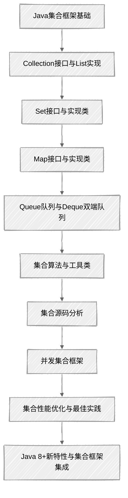

## 学习路线图

## 章节概览

### 1. 集合框架基础

+ **内容**: 集合框架层次结构、接口设计、泛型使用
+ **重点**: 理解Collection和Map两大根接口，掌握泛型的基本用法

### 2. Collection接口与List实现

+ **内容**: List接口规范、ArrayList、LinkedList、Vector等实现类
+ **重点**: 各List实现类的特点、性能差异及适用场景

### 3. Set接口与实现类

+ **内容**: Set接口规范、HashSet、LinkedHashSet、TreeSet等实现类
+ **重点**: 去重原理、哈希表结构、红黑树实现

### 4. Map接口与实现类

+ **内容**: Map接口规范、HashMap、LinkedHashMap、TreeMap、ConcurrentHashMap等实现类
+ **重点**: HashMap工作原理、冲突解决策略、线程安全性

### 5. Queue队列与Deque双端队列

+ **内容**: Queue接口、Deque接口、LinkedList、ArrayDeque、PriorityQueue等实现类
+ **重点**: 队列操作、优先级队列、双端队列的实际应用

### 6. 集合算法与工具类

+ **内容**: Collections工具类、Arrays工具类、排序、查找等常用算法
+ **重点**: 集合操作的便捷方法、算法实现原理

### 7. 迭代器与集合源码分析

+ **内容**: ArrayList、LinkedList、HashMap、ConcurrentHashMap等核心源码解读
+ **重点**: 数据结构设计、性能优化技巧、核心算法实现

### 8. 并发集合框架设计与实现

+ **内容**: 线程安全集合类、ConcurrentHashMap、CopyOnWriteArrayList等
+ **重点**: 并发安全机制、读写锁策略、性能考量

### 9. 集合框架常见面试问题解析

+ **内容**: 集合选择策略、性能对比、内存优化、常见陷阱
+ **重点**: 实际项目中的最佳选择、性能调优技巧

### 10. Java 8+新特性与集合框架的集成应用

+ **内容**: Stream API、函数式接口、Optional、集合工厂方法
+ **重点**: 声明式编程、并行处理、函数式风格

## 学习建议

1. **循序渐进**: 从基础开始，逐步深入理解集合框架的设计理念和实现细节
2. **源码阅读**: 重点关注JDK核心集合类的源码，理解其设计思想和性能优化策略
3. **实践应用**: 结合实际项目场景，选择合适的集合类并应用最佳实践
4. **性能分析**: 学习如何分析集合操作的性能，避免常见的性能陷阱
5. **新特性应用**: 积极应用Java 8+的新特性，编写更简洁、高效的代码

## 面试重点

1. **基础概念**: 集合框架层次结构、接口设计原则
2. **实现原理**: HashMap、ArrayList等核心类的实现细节
3. **线程安全**: 并发集合的实现机制、线程安全保障策略
4. **性能优化**: 不同集合类的性能特性、适用场景选择
5. **新特性应用**: Stream API、函数式编程在集合操作中的应用

通过系统学习本系列文档，您将全面掌握Java集合框架的核心知识，能够在实际开发中灵活选择和高效使用各种集合类，同时也为面试做好充分准备。
