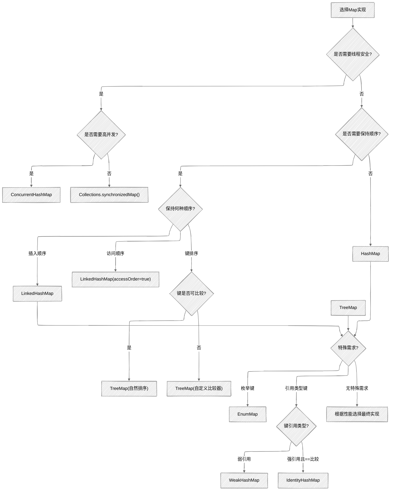

## 概述

`Map`接口是Java集合框架中用于存储键值对（`key-value`）映射关系的接口。`Map`中的键（`key`）是唯一的，每个键最多可以映射到一个值（`value`）。`Map`接口不直接继承`Collection`接口，而是独立存在的，但它与`Collection`一样，是Java集合框架中的重要组成部分。

## 核心特征

+ **键值对存储**：以键值对（`key-value`）的形式存储数据
+ **键唯一性**：每个键只能映射到一个值，键不允许重复
+ **值可重复**：不同的键可以映射到相同的值
+ **查找高效**：提供高效的键查找机制
+ **视图操作**：支持获取键集、值集和键值对集的视图

## Map接口定义

```java
public interface Map<K, V> {
    // 基本操作
    int size();
    boolean isEmpty();
    boolean containsKey(Object key);
    boolean containsValue(Object value);
    V get(Object key);
    V put(K key, V value);
    V remove(Object key);
    
    // 批量操作
    void putAll(Map<? extends K, ? extends V> m);
    void clear();
    
    // 视图操作
    Set<K> keySet();
    Collection<V> values();
    Set<Map.Entry<K, V>> entrySet();
    
    // 内部接口Entry
    interface Entry<K, V> {
        K getKey();
        V getValue();
        V setValue(V value);
        boolean equals(Object o);
        int hashCode();
        
        // Java 8+ 方法
        public static <K extends Comparable<? super K>, V> Comparator<Map.Entry<K, V>> comparingByKey() {
            return (Comparator<Map.Entry<K, V>> & Serializable)
                (c1, c2) -> c1.getKey().compareTo(c2.getKey());
        }
        
        public static <K, V extends Comparable<? super V>> Comparator<Map.Entry<K, V>> comparingByValue() {
            return (Comparator<Map.Entry<K, V>> & Serializable)
                (c1, c2) -> c1.getValue().compareTo(c2.getValue());
        }
    }
    
    // 相等性和哈希码
    boolean equals(Object o);
    int hashCode();
    
    // Java 8+ 方法
    default V getOrDefault(Object key, V defaultValue) {
        V v;      
        return (((v = get(key)) != null) || containsKey(key)) ? v : defaultValue;
    }
    
    default void forEach(BiConsumer<? super K, ? super V> action) {
        Objects.requireNonNull(action);
        for (Map.Entry<K, V> entry : entrySet()) {
            K k;      
            V v;
            try {
                k = entry.getKey();
                v = entry.getValue();
            } catch(IllegalStateException ise) {
                throw new ConcurrentModificationException(ise);
            }
            action.accept(k, v);
        }
    }
    
    // 其他Java 8+默认方法...
}
```

## 主要实现类对比


## `HashMap`/`LinkedHashMap`/`TreeMap`特性对比表

| 特性 | HashMap | LinkedHashMap | TreeMap |
| :---: | :---: | :---: | :---: |
| 底层实现 | 哈希表(数组+链表/红黑树) | 哈希表+双向链表 | 红黑树 |
| 存储结构 | 数组+链表/红黑树 | 数组+链表/红黑树+双向链表 | 红黑树 |
| 插入顺序 | 不保证 | 保证 | 不保证（按排序） |
| 元素排序 | 无序 | 插入顺序或访问顺序 | 自然排序或自定义排序 |
| 查找性能 | O(1) 平均 | O(1) 平均 | O(log n) |
| 插入性能 | O(1) 平均 | O(1) 平均 | O(log n) |
| 删除性能 | O(1) 平均 | O(1) 平均 | O(log n) |
| 线程安全 | 否 | 否 | 否 |
| 允许null键/值 | 是(1个null键) | 是(1个null键) | 否(null键) |
| 内存占用 | 中等 | 较高 | 较高 |
| 适用场景 | 快速查找、键值映射 | 需要顺序访问的映射 | 需要排序的映射 |
| 初始容量 | 16 | 16 | 无 |
| 负载因子 | 0.75 | 0.75 | 无 |

## `HashMap`实现原理

### `HashMap`入门级使用示例

下面是一个简单的`HashMap`使用示例，展示最基础的创建、添加、获取、遍历等操作：

```java
public class HashMapBasicExample {
    public static void main(String[] args) {
        // 创建一个HashMap集合
        HashMap<String, Integer> scores = new HashMap<>();
        
        // 添加键值对
        scores.put("张三", 85);
        scores.put("李四", 92);
        scores.put("王五", 78);
        scores.put("赵六", 95);
        System.out.println("添加元素后: " + scores);
        // 输出类似: {张三=85, 李四=92, 王五=78, 赵六=95}
        
        // 如果键已存在，put方法会返回旧值并覆盖
        Integer oldScore = scores.put("李四", 98);
        System.out.println("李四的旧分数: " + oldScore);  // 输出: 92
        System.out.println("更新后: " + scores);
        // 输出类似: {张三=85, 李四=98, 王五=78, 赵六=95}
        
        // 获取指定键的值
        Integer zhangsanScore = scores.get("张三");
        System.out.println("张三的分数: " + zhangsanScore);  // 输出: 85
        
        // 获取不存在的键，返回null
        Integer sunqiScore = scores.get("孙七");
        System.out.println("孙七的分数: " + sunqiScore);  // 输出: null
        
        // 使用getOrDefault避免空指针
        Integer sunqiScore2 = scores.getOrDefault("孙七", 0);
        System.out.println("孙七的分数(默认): " + sunqiScore2);  // 输出: 0
        
        // 判断是否包含指定的键
        boolean hasZhangsan = scores.containsKey("张三");
        System.out.println("包含张三: " + hasZhangsan);  // 输出: true
        
        // 判断是否包含指定的值
        boolean hasScore85 = scores.containsValue(85);
        System.out.println("包含分数85: " + hasScore85);  // 输出: true
        
        // 获取键的集合
        Set<String> names = scores.keySet();
        System.out.println("所有学生: " + names);
        // 输出类似: [张三, 李四, 王五, 赵六]
        
        // 获取值的集合
        Collection<Integer> allScores = scores.values();
        System.out.println("所有分数: " + allScores);
        // 输出类似: [85, 98, 78, 95]
        
        // 遍历HashMap的四种方式
        
        // 1. 使用keySet遍历
        System.out.println("\n方式一：使用keySet遍历");
        for (String name : scores.keySet()) {
            System.out.println(name + ": " + scores.get(name));
        }
        
        // 2. 使用entrySet遍历（推荐，更高效）
        System.out.println("\n方式二：使用entrySet遍历");
        for (Map.Entry<String, Integer> entry : scores.entrySet()) {
            System.out.println(entry.getKey() + ": " + entry.getValue());
        }
        
        // 3. 使用Lambda表达式遍历（Java 8及以上）
        System.out.println("\n方式三：使用Lambda表达式遍历");
        scores.forEach((name, score) -> {
            System.out.println(name + ": " + score);
        });
        
        // 4. 使用values遍历（只遍历值）
        System.out.println("\n方式四：只遍历值");
        for (Integer score : scores.values()) {
            System.out.println("分数: " + score);
        }
        
        // 删除元素
        Integer removedScore = scores.remove("王五");
        System.out.println("\n删除的分数: " + removedScore);  // 输出: 78
        System.out.println("删除后: " + scores);
        // 输出类似: {张三=85, 李四=98, 赵六=95}
        
        // 获取集合大小
        System.out.println("集合大小: " + scores.size());  // 输出: 3
        
        // 清空集合
        scores.clear();
        System.out.println("清空后: " + scores);  // 输出: {}
        System.out.println("集合是否为空: " + scores.isEmpty());  // 输出: true
    }
}
```

### 基本结构

`HashMap`的底层实现经历了从JDK 7到JDK 8的重大变化。JDK 8中，`HashMap`采用数组+链表+红黑树的结构，当链表长度超过阈值（默认为`8`）时，会将链表转换为红黑树以提高查找效率。

### `HashMap`在不同JDK版本的实现对比

#### `JDK 7` 与 `JDK 8+` `HashMap`实现对比

| 特性 | JDK 7 HashMap | JDK 8+ HashMap |
| :---: | :---: | :---: |
| 基本结构 | 数组 + 链表 | 数组 + 链表 + 红黑树 |
| 链表插入方式 | 头插法（先将新节点的next指向原头节点，再将新节点设为头节点） | 尾插法（直接追加到链表末尾） |
| 扩容时重新计算哈希 | 是的，每次扩容都需要重新计算所有元素的哈希值 | 否，利用位运算优化，仅需判断高位是否为1 |
| 查找时间复杂度 | 最坏O(n) | 最坏O(log n)（红黑树优化） |
| 新增常量 | 无 | TREEIFY_THRESHOLD=8, UNTREEIFY_THRESHOLD=6, MIN_TREEIFY_CAPACITY=64 |
| 内部节点类 | Entry<K,V> | Node<K,V>（链表节点）和TreeNode<K,V>（红黑树节点） |
| 并发安全性 | 非线程安全，可能导致环形链表 | 非线程安全，但避免了环形链表问题 |

#### 详细差异分析

**1. 数据结构优化**

```java
// JDK 7 中的链表节点
static class Entry<K,V> implements Map.Entry<K,V> {
    final K key;
    V value;
    Entry<K,V> next;
    final int hash;
    // ...
}

// JDK 8 中的链表节点
static class Node<K,V> implements Map.Entry<K,V> {
    final int hash;
    final K key;
    V value;
    Node<K,V> next;
    // ...
}

// JDK 8 中的红黑树节点
static final class TreeNode<K,V> extends LinkedHashMap.Entry<K,V> {
    TreeNode<K,V> parent;  // 父节点
    TreeNode<K,V> left;    // 左子节点
    TreeNode<K,V> right;   // 右子节点
    TreeNode<K,V> prev;    // 前一个节点
    boolean red;           // 颜色标记
    // ...
}
```

**2. 哈希冲突解决方法改进**

+ `JDK 7`：仅使用链地址法，所有哈希冲突的元素都存储在同一个链表中
+ `JDK 8+`：结合链地址法和红黑树，当链表长度超过`8`且数组长度大于等于`64`时，将链表转换为红黑树

**3. 头插法 vs 尾插法**

```java
// JDK 7 头插法伪代码
void addEntry(int hash, K key, V value, int bucketIndex) {
    Entry<K,V> e = table[bucketIndex];
    table[bucketIndex] = new Entry<>(hash, key, value, e);  // 头插法
    if (size++ >= threshold) {
        resize(2 * table.length);
    }
}

// JDK 8 尾插法伪代码
Node<K,V> newNode(int hash, K key, V value, Node<K,V> next) {
    return new Node<>(hash, key, value, next);
}

// 在putVal方法中使用尾插法
```

**4. 扩容优化**

+ `JDK 7`：
  + 重新计算所有元素的哈希值
  + 重新计算索引位置
  + 采用头插法可能导致链表顺序反转
  + 多线程环境下可能形成环形链表
+ `JDK 8+`：
  + 利用扩容前的哈希值和旧容量进行位运算
  + 新索引要么是原索引，要么是原索引+旧容量
  + 使用尾插法保持链表原有顺序
  + 避免了多线程环境下的环形链表问题（但仍非线程安全）

**5. 性能提升**

+ **查找效率**：链表转红黑树后，查找时间复杂度从`O(n)`优化到`O(log n)`
+ **扩容效率**：位运算优化减少了计算量
+ **内存使用**：`JDK 8+`在节点设计上更加紧凑

#### 为什么要在JDK 8中引入红黑树？

1. **性能优化**：当哈希冲突严重时，长链表的查找性能会退化
2. **避免极端情况**：恶意构造哈希值可能导致`O(n)`的查找复杂度（但在实践中基本不会发生）
3. **更平衡的数据结构**：红黑树提供了稳定的`O(log n)`性能

#### 为什么阈值设为`8`？

+ 基于泊松分布的统计数据，链表长度达到8的概率非常低（约`0.00000006`）
+ 平衡了时间和空间成本
+ 长度为`8`是性能优化的临界点

```java
public class HashMap<K, V> extends AbstractMap<K, V>
        implements Map<K, V>, Cloneable, Serializable {
    
    // 序列化版本ID
    private static final long serialVersionUID = 362498820763181265L;
    
    // 默认初始容量 (16)
    static final int DEFAULT_INITIAL_CAPACITY = 1 << 4;
    
    // 最大容量
    static final int MAXIMUM_CAPACITY = 1 << 30;
    
    // 默认负载因子
    static final float DEFAULT_LOAD_FACTOR = 0.75f;
    
    // 链表转红黑树的阈值
    static final int TREEIFY_THRESHOLD = 8;
    
    // 红黑树转链表的阈值
    static final int UNTREEIFY_THRESHOLD = 6;
    
    // 最小树化容量
    static final int MIN_TREEIFY_CAPACITY = 64;
    
    // 存储元素的数组
    transient Node<K,V>[] table;
    
    // 存储元素的集合
    transient Set<Map.Entry<K,V>> entrySet;
    
    // 元素个数
    transient int size;
    
    // 结构修改次数
    transient int modCount;
    
    // 阈值，当size>=threshold时，进行扩容
    int threshold;
    
    // 负载因子
    final float loadFactor;
    
    // 构造函数
    public HashMap() {
        this.loadFactor = DEFAULT_LOAD_FACTOR; // all other fields defaulted
    }
    
    public HashMap(int initialCapacity) {
        this(initialCapacity, DEFAULT_LOAD_FACTOR);
    }
    
    public HashMap(int initialCapacity, float loadFactor) {
        // 验证参数
        if (initialCapacity < 0)
            throw new IllegalArgumentException("Illegal initial capacity: " +
                                               initialCapacity);
        if (initialCapacity > MAXIMUM_CAPACITY)
            initialCapacity = MAXIMUM_CAPACITY;
        if (loadFactor <= 0 || Float.isNaN(loadFactor))
            throw new IllegalArgumentException("Illegal load factor: " +
                                               loadFactor);
        this.loadFactor = loadFactor;
        this.threshold = tableSizeFor(initialCapacity);
    }
}
```

### 数据节点定义

```java
// 普通节点
static class Node<K,V> implements Map.Entry<K,V> {
    final int hash;
    final K key;
    V value;
    Node<K,V> next;
    
    Node(int hash, K key, V value, Node<K,V> next) {
        this.hash = hash;
        this.key = key;
        this.value = value;
        this.next = next;
    }
    
    public final K getKey()        { return key; }
    public final V getValue()      { return value; }
    public final String toString() { return key + "=" + value; }
    
    public final int hashCode() {
        return Objects.hashCode(key) ^ Objects.hashCode(value);
    }
    
    public final V setValue(V newValue) {
        V oldValue = value;
        value = newValue;
        return oldValue;
    }
    
    public final boolean equals(Object o) {
        if (o == this)
            return true;
        if (o instanceof Map.Entry) {
            Map.Entry<?,?> e = (Map.Entry<?,?>)o;
            if (Objects.equals(key, e.getKey()) &&
                Objects.equals(value, e.getValue()))
                return true;
        }
        return false;
    }
}

// 红黑树节点
static final class TreeNode<K,V> extends LinkedHashMap.Entry<K,V> {
    TreeNode<K,V> parent;  // 父节点
    TreeNode<K,V> left;    // 左子节点
    TreeNode<K,V> right;   // 右子节点
    TreeNode<K,V> prev;    // 前一个节点
    boolean red;           // 节点颜色
    
    TreeNode(int hash, K key, V val, Node<K,V> next) {
        super(hash, key, val, next);
    }
    
    // 其他红黑树相关方法...
}
```

### `HashMap`的`put`过程

`HashMap`的`put`操作是其最核心的方法之一，JDK 8中的实现如下：

```java
public V put(K key, V value) {
    return putVal(hash(key), key, value, false, true);
}

final V putVal(int hash, K key, V value, boolean onlyIfAbsent,
               boolean evict) {
    Node<K,V>[] tab; Node<K,V> p; int n, i;
    
    // 1. 如果table未初始化或为空，初始化table
    if ((tab = table) == null || (n = tab.length) == 0)
        n = (tab = resize()).length;
    
    // 2. 计算数组索引，如果该位置为空，直接插入新节点
    if ((p = tab[i = (n - 1) & hash]) == null)
        tab[i] = newNode(hash, key, value, null);
    else {
        Node<K,V> e; K k;
        
        // 3. 如果key已存在，直接更新value
        if (p.hash == hash &&
            ((k = p.key) == key || (key != null && key.equals(k))))
            e = p;
        // 4. 如果节点是红黑树节点，调用红黑树的插入方法
        else if (p instanceof TreeNode)
            e = ((TreeNode<K,V>)p).putTreeVal(this, tab, hash, key, value);
        // 5. 如果是链表，遍历链表
        else {
            for (int binCount = 0; ; ++binCount) {
                if ((e = p.next) == null) {
                    p.next = newNode(hash, key, value, null);
                    // 6. 如果链表长度超过阈值，转换为红黑树
                    if (binCount >= TREEIFY_THRESHOLD - 1) // -1 for 1st
                        treeifyBin(tab, hash);
                    break;
                }
                // 7. 如果在链表中找到相同的key，更新value
                if (e.hash == hash &&
                    ((k = e.key) == key || (key != null && key.equals(k))))
                    break;
                p = e;
            }
        }
        
        // 8. key已存在，更新value
        if (e != null) { // existing mapping for key
            V oldValue = e.value;
            if (!onlyIfAbsent || oldValue == null)
                e.value = value;
            afterNodeAccess(e);
            return oldValue;
        }
    }
    
    ++modCount; // 增加修改计数
    // 9. 如果size超过阈值，进行扩容
    if (++size > threshold)
        resize();
    afterNodeInsertion(evict);
    return null;
}
```

### 哈希值计算和索引确定

`HashMap`中哈希值的计算非常巧妙，目的是减少哈希冲突：

```java
// 计算哈希值
static final int hash(Object key) {
    int h;
    // 1. 如果key为null，哈希值为0
    // 2. 否则，先获取key的hashCode()，然后将高16位与低16位异或，增加哈希值的随机性
    return (key == null) ? 0 : (h = key.hashCode()) ^ (h >>> 16);
}

// 计算数组索引：使用与运算替代取模运算，提高效率
// 要求数组长度必须是2的幂
int index = (n - 1) & hash;
```

### `HashMap`的扩容机制

当`HashMap`的元素数量超过阈值（容量*负载因子）时，会触发扩容操作，将容量扩大为原来的两倍：

```java
final Node<K,V>[] resize() {
    Node<K,V>[] oldTab = table;
    int oldCap = (oldTab == null) ? 0 : oldTab.length;
    int oldThr = threshold;
    int newCap, newThr = 0;
    
    if (oldCap > 0) {
        // 如果旧容量已经达到最大值，则不再扩容
        if (oldCap >= MAXIMUM_CAPACITY) {
            threshold = Integer.MAX_VALUE;
            return oldTab;
        }
        // 将容量扩大为原来的两倍
        else if ((newCap = oldCap << 1) < MAXIMUM_CAPACITY &&
                 oldCap >= DEFAULT_INITIAL_CAPACITY)
            newThr = oldThr << 1; // double threshold
    }
    else if (oldThr > 0) // initial capacity was placed in threshold
        newCap = oldThr;
    else {               // zero initial threshold signifies using defaults
        newCap = DEFAULT_INITIAL_CAPACITY;
        newThr = (int)(DEFAULT_LOAD_FACTOR * DEFAULT_INITIAL_CAPACITY);
    }
    
    if (newThr == 0) {
        float ft = (float)newCap * loadFactor;
        newThr = (newCap < MAXIMUM_CAPACITY && ft < (float)MAXIMUM_CAPACITY ?
                  (int)ft : Integer.MAX_VALUE);
    }
    threshold = newThr;
    
    // 创建新数组
    @SuppressWarnings({"rawtypes","unchecked"})
    Node<K,V>[] newTab = (Node<K,V>[])new Node[newCap];
    table = newTab;
    
    // 将旧数组中的元素重新哈希到新数组
    if (oldTab != null) {
        for (int j = 0; j < oldCap; ++j) {
            Node<K,V> e;
            if ((e = oldTab[j]) != null) {
                oldTab[j] = null;
                if (e.next == null)
                    newTab[e.hash & (newCap - 1)] = e;
                else if (e instanceof TreeNode)
                    ((TreeNode<K,V>)e).split(this, newTab, j, oldCap);
                else { // preserve order
                    Node<K,V> loHead = null, loTail = null;
                    Node<K,V> hiHead = null, hiTail = null;
                    Node<K,V> next;
                    do {
                        next = e.next;
                        // 原索引
                        if ((e.hash & oldCap) == 0) {
                            if (loTail == null)
                                loHead = e;
                            else
                                loTail.next = e;
                            loTail = e;
                        }
                        // 原索引 + oldCap
                        else {
                            if (hiTail == null)
                                hiHead = e;
                            else
                                hiTail.next = e;
                            hiTail = e;
                        }
                    } while ((e = next) != null);
                    if (loTail != null) {
                        loTail.next = null;
                        newTab[j] = loHead;
                    }
                    if (hiTail != null) {
                        hiTail.next = null;
                        newTab[j + oldCap] = hiHead;
                    }
                }
            }
        }
    }
    return newTab;
}
```

## `LinkedHashMap`实现原理

### 基本结构

`LinkedHashMap`继承自`HashMap`，在`HashMap`的基础上，通过维护一个双向链表来记录元素的插入顺序或访问顺序。

```java
public class LinkedHashMap<K,V> extends HashMap<K,V> implements Map<K,V> {
    
    // 双向链表的头节点（最早插入的元素）
    transient LinkedHashMap.Entry<K,V> head;
    
    // 双向链表的尾节点（最近插入的元素）
    transient LinkedHashMap.Entry<K,V> tail;
    
    // 访问顺序模式：true表示按照访问顺序排序，false表示按照插入顺序排序
    final boolean accessOrder;
    
    // 构造函数
    public LinkedHashMap() {
        super();
        accessOrder = false; // 默认按插入顺序
    }
    
    public LinkedHashMap(int initialCapacity, float loadFactor, boolean accessOrder) {
        super(initialCapacity, loadFactor);
        this.accessOrder = accessOrder;
    }
    
    // 其他构造函数...
}
```

### 节点定义

`LinkedHashMap`的节点继承自`HashMap.Node`，并增加了双向链表的引用：

```java
static class Entry<K,V> extends HashMap.Node<K,V> {
    Entry<K,V> before, after;
    Entry(int hash, K key, V value, Node<K,V> next) {
        super(hash, key, value, next);
    }
}
```

### 维护双向链表的核心方法

`LinkedHashMap`通过重写`HashMap`中的钩子方法来维护双向链表：

```java
// 在节点访问后调用（get操作时）
void afterNodeAccess(Node<K,V> e) { // move node to last
    LinkedHashMap.Entry<K,V> last;
    // 如果是访问顺序模式且访问的不是尾节点
    if (accessOrder && (last = tail) != e) {
        LinkedHashMap.Entry<K,V> p =
            (LinkedHashMap.Entry<K,V>)e, b = p.before, a = p.after;
        p.after = null;
        if (b == null)
            head = a;
        else
            b.after = a;
        if (a != null)
            a.before = b;
        else
            last = b;
        if (last == null)
            head = p;
        else {
            p.before = last;
            last.after = p;
        }
        tail = p;
        ++modCount;
    }
}

// 在节点插入后调用（put操作时）
void afterNodeInsertion(boolean evict) { // possibly remove eldest
    LinkedHashMap.Entry<K,V> first;
    // 如果需要删除最老的元素（由removeEldestEntry方法决定）
    if (evict && (first = head) != null && removeEldestEntry(first)) {
        K key = first.key;
        removeNode(hash(key), key, null, false, true);
    }
}

// 在节点删除后调用（remove操作时）
void afterNodeRemoval(Node<K,V> e) { // unlink
    LinkedHashMap.Entry<K,V> p = 
        (LinkedHashMap.Entry<K,V>)e, b = p.before, a = p.after;
    p.before = p.after = null;
    if (b == null)
        head = a;
    else
        b.after = a;
    if (a == null)
        tail = b;
    else
        a.before = b;
}
```

### 实现`LRU`缓存示例

`LinkedHashMap`可以很容易地实现`LRU`（最近最少使用）缓存：

```java
public class LRUCache<K, V> extends LinkedHashMap<K, V> {
    private final int capacity;
    
    public LRUCache(int capacity) {
        // 第三个参数设置为true，表示按照访问顺序排序
        super(capacity, 0.75f, true);
        this.capacity = capacity;
    }
    
    @Override
    protected boolean removeEldestEntry(Map.Entry<K, V> eldest) {
        // 当缓存大小超过容量时，删除最老的元素
        return size() > capacity;
    }
    
    public static void main(String[] args) {
        // 创建容量为3的LRU缓存
        LRUCache<String, Integer> cache = new LRUCache<>(3);
        
        // 添加元素
        cache.put("A", 1);
        cache.put("B", 2);
        cache.put("C", 3);
        System.out.println("初始缓存: " + cache);
        // 输出: {A=1, B=2, C=3}
        
        // 访问元素，会将其移到链表末尾（最近使用）
        cache.get("A");
        System.out.println("访问A后: " + cache);
        // 输出: {B=2, C=3, A=1}
        
        // 添加新元素，会删除最久未使用的元素B
        cache.put("D", 4);
        System.out.println("添加D后: " + cache);
        // 输出: {C=3, A=1, D=4}
        
        // 再次访问元素，会将其移到链表末尾
        cache.get("C");
        System.out.println("访问C后: " + cache);
        // 输出: {A=1, D=4, C=3}
        
        // 添加新元素，会删除最久未使用的元素A
        cache.put("E", 5);
        System.out.println("添加E后: " + cache);
        // 输出: {D=4, C=3, E=5}
    }
}
```

## `TreeMap`实现原理

### 基本结构

`TreeMap`底层基于红黑树（`Red-Black Tree`）实现，能够保证元素按照键的自然顺序或自定义顺序进行排序。

```java
public class TreeMap<K,V> extends AbstractMap<K,V>
    implements NavigableMap<K,V>, Cloneable, java.io.Serializable {
    
    // 红黑树的根节点
    private transient Entry<K,V> root;
    
    // 元素数量
    private transient int size = 0;
    
    // 结构修改次数
    private transient int modCount = 0;
    
    // 比较器，如果为null则使用键的自然顺序
    private final Comparator<? super K> comparator;
    
    // 构造函数
    public TreeMap() {
        comparator = null;
    }
    
    public TreeMap(Comparator<? super K> comparator) {
        this.comparator = comparator;
    }
    
    public TreeMap(Map<? extends K, ? extends V> m) {
        comparator = null;
        putAll(m);
    }
    
    public TreeMap(SortedMap<K, ? extends V> m) {
        comparator = m.comparator();
        try {
            buildFromSorted(m.size(), m.entrySet().iterator(), null, null);
        } catch (java.io.IOException cannotHappen) {
        } catch (ClassNotFoundException cannotHappen) {
        }
    }
    
    // 红黑树节点定义
    static final class Entry<K,V> implements Map.Entry<K,V> {
        K key;
        V value;
        Entry<K,V> left;
        Entry<K,V> right;
        Entry<K,V> parent;
        boolean color = BLACK;
        
        // 构造函数和方法...
    }
    
    // 其他方法...
}
```

### 排序机制

`TreeMap`支持两种排序方式：

1. **自然排序**：键类实现`Comparable`接口，并重写`compareTo()`方法
2. **自定义排序**：在构造`TreeMap`时传入`Comparator`接口的实现

### 查找与修改操作

```java
// 获取元素
public V get(Object key) {
    Entry<K,V> p = getEntry(key);
    return (p==null ? null : p.value);
}

// 获取节点
final Entry<K,V> getEntry(Object key) {
    // 如果提供了比较器，使用比较器查找
    if (comparator != null)
        return getEntryUsingComparator(key);
    if (key == null)
        throw new NullPointerException();
    @SuppressWarnings("unchecked")
        Comparable<? super K> k = (Comparable<? super K>) key;
    Entry<K,V> p = root;
    while (p != null) {
        int cmp = k.compareTo(p.key);
        if (cmp < 0)
            p = p.left;
        else if (cmp > 0)
            p = p.right;
        else
            return p;
    }
    return null;
}

// 添加元素
public V put(K key, V value) {
    Entry<K,V> t = root;
    if (t == null) {
        compare(key, key); // type (and possibly null) check

        root = new Entry<>(key, value, null);
        size = 1;
        modCount++;
        return null;
    }
    int cmp;
    Entry<K,V> parent;
    // split comparator and comparable paths
    Comparator<? super K> cpr = comparator;
    if (cpr != null) {
        do {
            parent = t;
            cmp = cpr.compare(key, t.key);
            if (cmp < 0)
                t = t.left;
            else if (cmp > 0)
                t = t.right;
            else
                return t.setValue(value);
        } while (t != null);
    }
    else {
        if (key == null)
            throw new NullPointerException();
        @SuppressWarnings("unchecked")
            Comparable<? super K> k = (Comparable<? super K>) key;
        do {
            parent = t;
            cmp = k.compareTo(t.key);
            if (cmp < 0)
                t = t.left;
            else if (cmp > 0)
                t = t.right;
            else
                return t.setValue(value);
        } while (t != null);
    }
    Entry<K,V> e = new Entry<>(key, value, parent);
    if (cmp < 0)
        parent.left = e;
    else
        parent.right = e;
    fixAfterInsertion(e);
    size++;
    modCount++;
    return null;
}
```

### `TreeMap`排序和范围查询示例

```java
public class TreeMapExample {
    public static void main(String[] args) {
        // 创建TreeMap（自然排序）
        NavigableMap<Integer, String> map = new TreeMap<>();
        
        // 添加元素
        map.put(3, "Three");
        map.put(1, "One");
        map.put(5, "Five");
        map.put(2, "Two");
        map.put(4, "Four");
        
        System.out.println("自然排序结果: " + map);
        // 输出: {1=One, 2=Two, 3=Three, 4=Four, 5=Five}
        
        // 范围查询
        System.out.println("小于3的元素: " + map.headMap(3));
        // 输出: {1=One, 2=Two}
        
        System.out.println("大于等于3的元素: " + map.tailMap(3));
        // 输出: {3=Three, 4=Four, 5=Five}
        
        System.out.println("2到4之间的元素: " + map.subMap(2, 5));
        // 输出: {2=Two, 3=Three, 4=Four}
        
        // 导航方法
        System.out.println("小于3的最大键: " + map.lowerKey(3));  // 2
        System.out.println("小于等于3的最大键: " + map.floorKey(3));  // 3
        System.out.println("大于等于3的最小键: " + map.ceilingKey(3));  // 3
        System.out.println("大于3的最小键: " + map.higherKey(3));  // 4
        
        // 降序视图
        NavigableMap<Integer, String> descendingMap = map.descendingMap();
        System.out.println("降序视图: " + descendingMap);
        // 输出: {5=Five, 4=Four, 3=Three, 2=Two, 1=One}
        
        // 自定义比较器（降序）
        NavigableMap<String, Integer> customMap = new TreeMap<>(Comparator.reverseOrder());
        customMap.put("apple", 10);
        customMap.put("banana", 5);
        customMap.put("orange", 8);
        
        System.out.println("\n自定义降序结果: " + customMap);
        // 输出: {orange=8, banana=5, apple=10}
        
        // 复合比较器示例
        NavigableMap<Person, String> personMap = new TreeMap<>(
            Comparator.comparing(Person::getAge)
                      .thenComparing(Person::getName));
        
        personMap.put(new Person("Alice", 25), "Employee");
        personMap.put(new Person("Bob", 30), "Manager");
        personMap.put(new Person("Charlie", 25), "Developer");
        
        System.out.println("\n按年龄和姓名排序的人员: ");
        personMap.forEach((k, v) -> System.out.println(k + ": " + v));
        // 输出按年龄排序，同年龄按姓名排序
    }
    
    static class Person {
        private String name;
        private int age;
        
        public Person(String name, int age) {
            this.name = name;
            this.age = age;
        }
        
        public String getName() { return name; }
        public int getAge() { return age; }
        
        @Override
        public String toString() {
            return name + "(" + age + ")";
        }
    }
}
```

## `Map`选择指南

### 选择决策流程图



### 场景演示

```java
public class MapSelectionDemo {
    public static void main(String[] args) {
        // 场景1：快速查询，无需顺序
        Map<String, String> hashMap = new HashMap<>();
        hashMap.put("user1", "Alice");
        hashMap.put("user2", "Bob");
        System.out.println("快速查询场景: " + hashMap);
        
        // 场景2：需要保持插入顺序
        Map<String, String> linkedHashMap = new LinkedHashMap<>();
        linkedHashMap.put("step1", "准备材料");
        linkedHashMap.put("step2", "开始制作");
        linkedHashMap.put("step3", "完成");
        System.out.println("保持插入顺序场景: " + linkedHashMap);
        
        // 场景3：需要按键排序
        Map<Integer, String> treeMap = new TreeMap<>();
        treeMap.put(3, "第三章");
        treeMap.put(1, "第一章");
        treeMap.put(2, "第二章");
        System.out.println("按键排序场景: " + treeMap);
        
        // 场景4：缓存实现（LRU）
        Map<String, Object> lruCache = new LinkedHashMap<String, Object>(16, 0.75f, true) {
            @Override
            protected boolean removeEldestEntry(Map.Entry<String, Object> eldest) {
                return size() > 5; // 缓存容量为5
            }
        };
        
        for (int i = 1; i <= 10; i++) {
            lruCache.put("key" + i, "value" + i);
        }
        System.out.println("LRU缓存场景: " + lruCache); // 保留最近访问的5个元素
        
        // 场景5：线程安全的高并发场景
        Map<String, String> concurrentMap = new ConcurrentHashMap<>();
        concurrentMap.put("counter", "0");
        System.out.println("并发场景: " + concurrentMap);
        
        // 场景6：枚举键场景
        Map<DayOfWeek, String> enumMap = new EnumMap<>(DayOfWeek.class);
        enumMap.put(DayOfWeek.MONDAY, "星期一");
        enumMap.put(DayOfWeek.TUESDAY, "星期二");
        System.out.println("枚举键场景: " + enumMap);
    }
}
```

## `Map`接口核心总结（零基础友好版）

### `HashMap`使用常见误区和注意事项

**1. 忽略键的**`hashCode`**和**`equals`**方法实现**

+ **误区**：使用自定义对象作为键时，不重写`hashCode`和`equals`方法
+ **正确做法**：必须重写这两个方法，确保相同的对象有相同的`hashCode`，且`equals`返回`true`

**2. 初始容量设置不合理**

+ **误区**：不设置初始容量，导致频繁扩容
+ **正确做法**：预估存储元素数量，设置合理初始容量（通常设置为`预期元素数量 / 0.75 + 1`）

**3. 在遍历过程中直接修改集合**

+ **误区**：使用普通遍历方式直接修改`HashMap`
+ **正确做法**：使用`entrySet`遍历，或使用迭代器的`remove`方法，或使用Java 8+的`removeIf`方法

**4. 认为**`HashMap`**是线程安全的**

+ **误区**：在多线程环境中直接使用`HashMap`
+ **正确做法**：多线程环境使用`ConcurrentHashMap`或`Collections.synchronizedMap`

**5. 键或值使用**`null`

+ **误区**：在所有情况下都允许`null`键或`null`值
+ **正确做法**：
  + `HashMap`允许一个`null`键和多个`null`值
  + `TreeMap`不允许`null`键
  + `ConcurrentHashMap`不允许`null`键和`null`值
  + 建议尽量避免使用`null`，以防止空指针异常

**6. 频繁的哈希冲突**

+ **误区**：不关注哈希函数的质量
+ **正确做法**：确保自定义键的`hashCode`方法分布均匀，减少哈希冲突

```java
// 示例：自定义对象作为键时的正确实现
class Person {
    private String name;
    private int age;
    
    // 构造方法、getter和setter省略
    
    @Override
    public int hashCode() {
        return Objects.hash(name, age);
    }
    
    @Override
    public boolean equals(Object obj) {
        if (this == obj) return true;
        if (obj == null || getClass() != obj.getClass()) return false;
        Person person = (Person) obj;
        return age == person.age && Objects.equals(name, person.name);
    }
}
```

## `Map`接口核心总结（零基础友好版）

### `Map`集合的核心特点

`Map`**是一种键值对集合**，就像现实生活中的字典或通讯录，通过"键"可以快速找到对应的"值"。主要特点：

+ **键值对存储**：每个元素包含两个部分 - 键（`Key`）和值（`Value`）
+ **键唯一性**：同一个`Map`中不能有重复的键，但值可以重复
+ **快速查找**：通过键可以在常数时间内（`O(1)`）找到对应的值

### `HashMap` vs `TreeMap` vs `LinkedHashMap` 选择指南

| 集合类型 | 主要特点 | 适用场景 |
| --- | --- | --- |
| HashMap | 无序，查询速度快 | 主要用于快速查询，不关心顺序 |
| TreeMap | 按键排序，实现了SortedMap接口 | 需要按键的自然顺序或自定义顺序排序 |
| LinkedHashMap | 维护插入顺序 | 需要保持元素插入顺序的同时又要快速查询 |

### 实际应用中的小技巧

1. `HashMap`**初始化容量**：如果知道大概需要存储多少键值对，可以在创建时指定容量和加载因子

```java
// 预计存储1000个键值对，设置初始容量为1000*2=2000（避免频繁扩容）
Map<String, Object> map = new HashMap<>(2000);
```

2. **遍历方式选择**：
    + 只需要键：使用`keySet()`遍历
    + 只需要值：使用`values()`遍历
    + 需要同时使用键和值：使用`entrySet()`遍历（推荐，性能更好）
3. **避免空指针异常**：使用`getOrDefault()`方法获取值

```java
// 安全地获取值，如果键不存在则返回默认值
Integer count = map.getOrDefault("key", 0);
```

4. **键的选择**：
    + 最好使用不可变类型作为键（如`String`、`Integer`等），因为它们的`hashCode`和`equals`方法是固定的
    + 如果使用自定义对象作为键，必须正确实现`equals()`和`hashCode()`方法，确保相同的对象有相同的`hashCode`，且`equals`返回`true`
5. **线程安全问题**：
    + `HashMap`不是线程安全的，多线程环境下可以使用`ConcurrentHashMap`
    + 避免使用`Hashtable`，它是线程安全的但性能较低

### 学习建议

+ 先掌握`Map`的基本操作：添加、获取、遍历、删除键值对
+ 理解`HashMap`的工作原理：哈希表、哈希冲突、扩容机制
+ 学会根据需求选择合适的`Map`实现类
+ 掌握自定义对象作为键时的注意事项

## `Map`接口小结

### 面试知识点

1. `HashMap`**的工作原理**：
    + 底层结构（数组+链表/红黑树）
    + 哈希冲突解决方法（链地址法）
    + 扩容机制（容量翻倍，重新哈希）
    + 树化阈值（`8`）和去树化阈值（`6`）
2. `HashMap`**vs **`LinkedHashMap`** vs**`TreeMap`：
    + 性能特点
    + 存储结构
    + 排序特性
    + 适用场景
3. `hashCode()`**和**`equals()`**的重要性**：
    + 两者必须保持一致
    + 如何正确实现
    + 常见错误实现
4. **线程安全的**`Map`**实现**：
    + `Hashtable`
    + `Collections.synchronizedMap()`
    + `ConcurrentHashMap`
    + `CopyOnWriteArraySet`
5. `LinkedHashMap`**实现**`LRU`**缓存**：
    + 访问顺序模式
    + `removeEldestEntry`方法
    + 实现原理

### 最佳实践

1. **初始容量选择**：
    + 预估元素数量，设置合适的初始容量
    + 计算公式：初始容量 = 预计元素数量 / 负载因子
2. **正确实现键的**`hashCode()`**和**`equals()`：
    + 使用`Objects.hash()`生成`hashCode`
    + 确保`equals()`方法考虑所有关键属性
    + 保证两者逻辑一致
3. **线程安全处理**：
    + 读多写少：`CopyOnWriteArraySet`
    + 高并发：`ConcurrentHashMap`
    + 低并发：`Collections.synchronizedMap()`
4. **避免使用**`Hashtable`：
    + 性能较差
    + 已被更现代的实现取代
5. **利用Java 8+新特性**：
    + `forEach`方法遍历
    + `compute/computeIfAbsent/computeIfPresent`方法
    + `merge`方法
6. **选择合适的实现类**：
    + 快速查询：`HashMap`
    + 保持顺序：`LinkedHashMap`
    + 按键排序：`TreeMap`
    + 并发环境：`ConcurrentHashMap`

## 小结

Map接口是Java集合框架中用于存储键值对的重要接口，本章节详细介绍了其主要实现类（`HashMap`、`LinkedHashMap`、`TreeMap`）的底层原理、性能特征和适用场景。在实际开发中，我们需要根据具体需求选择合适的Map实现，并注意正确实现键类的`hashCode()`和`equals()`方法。

通过本章节的学习，我们深入理解了Map接口及其实现类的设计思想和使用方法，这对于编写高效、可靠的Java程序至关重要。
