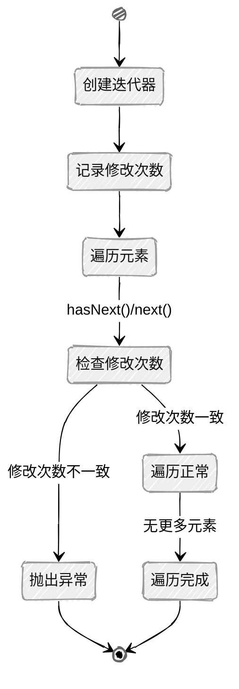
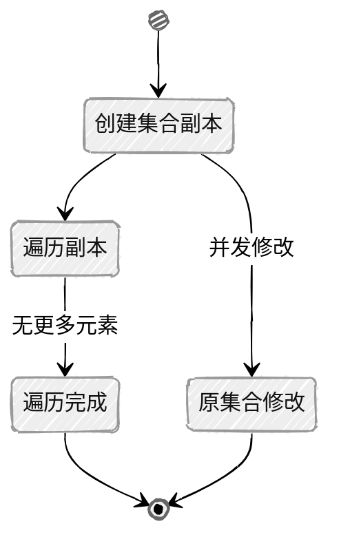

## 概述

迭代器模式是Java集合框架中的重要设计模式，它提供了一种方法来访问集合中的元素，而无需暴露集合的底层实现。Java提供了两种主要的迭代器接口：传统的`Iterator`接口以及Java 8引入的`Spliterator`接口（用于并行处理）。

## 迭代器基础

### 核心特征

+ **统一的遍历接口**：为不同的集合提供一致的遍历方式，无需关心集合的具体实现
+ **封装底层实现**：客户端无需了解集合的具体实现细节
+ **支持移除操作**：部分迭代器允许在遍历过程中移除元素
+ **支持**`Fail-Fast`**机制**：检测并发修改并快速失败，避免在遍历过程中修改集合结构

### `Iterator`接口定义

```java
public interface Iterator<E> {
    // 检查是否还有下一个元素
    boolean hasNext();
    
    // 获取下一个元素
    E next();
    
    // 移除当前元素（可选操作）
    default void remove() {
        throw new UnsupportedOperationException("remove");
    }
    
    // 对剩余元素执行指定操作（Java 8+）
    default void forEachRemaining(Consumer<? super E> action) {
        Objects.requireNonNull(action);
        while (hasNext())
            action.accept(next());
    }
}
```

### `Iterable`接口定义

集合类通常实现`Iterable`接口，该接口定义了获取迭代器的方法：

```java
public interface Iterable<T> {
    // 获取迭代器
    Iterator<T> iterator();
    
    // 增强型for循环的支持（Java 8+）
    default void forEach(Consumer<? super T> action) {
        Objects.requireNonNull(action);
        for (T t : this) {
            action.accept(t);
        }
    }
    
    // 获取Spliterator（Java 8+）
    default Spliterator<T> spliterator() {
        return Spliterators.spliteratorUnknownSize(iterator(), 0);
    }
}
```

## 迭代器实现原理

### `ArrayList`的迭代器实现

以`ArrayList`为例，查看其迭代器的实现：

```java
private class Itr implements Iterator<E> {
    int cursor;       // 下一个要返回的元素的索引
    int lastRet = -1; // 上一个返回的元素的索引；如果没有则为-1
    int expectedModCount = modCount; // 期望的修改次数

    Itr() {}

    // 检查是否还有下一个元素
    public boolean hasNext() {
        return cursor != size;
    }

    // 获取下一个元素
    @SuppressWarnings("unchecked")
    public E next() {
        checkForComodification(); // 检查并发修改
        int i = cursor;
        if (i >= size)
            throw new NoSuchElementException();
        Object[] elementData = ArrayList.this.elementData;
        if (i >= elementData.length)
            throw new ConcurrentModificationException();
        cursor = i + 1;
        return (E) elementData[lastRet = i];
    }

    // 移除当前元素
    public void remove() {
        if (lastRet < 0)
            throw new IllegalStateException();
        checkForComodification(); // 检查并发修改

        try {
            ArrayList.this.remove(lastRet);
            cursor = lastRet;
            lastRet = -1;
            expectedModCount = modCount; // 更新期望的修改次数
        } catch (IndexOutOfBoundsException ex) {
            throw new ConcurrentModificationException();
        }
    }

    // 对剩余元素执行指定操作
    @Override
    @SuppressWarnings("unchecked")
    public void forEachRemaining(Consumer<? super E> consumer) {
        Objects.requireNonNull(consumer);
        final int size = ArrayList.this.size;
        int i = cursor;
        if (i >= size) {
            return;
        }
        final Object[] elementData = ArrayList.this.elementData;
        if (i >= elementData.length) {
            throw new ConcurrentModificationException();
        }
        while (i != size && modCount == expectedModCount) {
            consumer.accept((E) elementData[i++]);
        }
        // 更新迭代器状态
        cursor = i;
        lastRet = i - 1;
        checkForComodification();
    }

    // 检查并发修改
    final void checkForComodification() {
        if (modCount != expectedModCount)
            throw new ConcurrentModificationException();
    }
}
```

### `LinkedList`的迭代器实现

`LinkedList`的迭代器实现更为复杂，因为它需要处理链表的遍历：

```java
private class ListItr implements ListIterator<E> {
    private Node<E> lastReturned; // 上一个返回的节点
    private Node<E> next;         // 下一个要返回的节点
    private int nextIndex;        // 下一个节点的索引
    private int expectedModCount = modCount; // 期望的修改次数

    ListItr(int index) {
        // 初始化迭代器，根据索引定位到正确的位置
        next = (index == size) ? null : node(index);
        nextIndex = index;
    }

    public boolean hasNext() {
        return nextIndex < size;
    }

    public E next() {
        checkForComodification();
        if (!hasNext())
            throw new NoSuchElementException();

        lastReturned = next;
        next = next.next;
        nextIndex++;
        return lastReturned.item;
    }

    public boolean hasPrevious() {
        return nextIndex > 0;
    }

    public E previous() {
        checkForComodification();
        if (!hasPrevious())
            throw new NoSuchElementException();

        lastReturned = next = (next == null) ? last : next.prev;
        nextIndex--;
        return lastReturned.item;
    }

    public int nextIndex() {
        return nextIndex;
    }

    public int previousIndex() {
        return nextIndex - 1;
    }

    public void remove() {
        checkForComodification();
        if (lastReturned == null)
            throw new IllegalStateException();

        Node<E> lastNext = lastReturned.next;
        unlink(lastReturned);
        if (next == lastReturned) {
            next = lastNext;
        } else {
            nextIndex--;
        }
        lastReturned = null;
        expectedModCount++;
    }

    public void set(E e) {
        if (lastReturned == null)
            throw new IllegalStateException();
        checkForComodification();
        lastReturned.item = e;
    }

    public void add(E e) {
        checkForComodification();
        lastReturned = null;
        if (next == null) {
            linkLast(e);
        } else {
            linkBefore(e, next);
        }
        nextIndex++;
        expectedModCount++;
    }

    // 对剩余元素执行指定操作
    @Override
    public void forEachRemaining(Consumer<? super E> action) {
        Objects.requireNonNull(action);
        while (modCount == expectedModCount && nextIndex < size) {
            action.accept(next.item);
            lastReturned = next;
            next = next.next;
            nextIndex++;
        }
        // 检查并发修改
        checkForComodification();
    }

    final void checkForComodification() {
        if (modCount != expectedModCount)
            throw new ConcurrentModificationException();
    }
}
```

## `Spliterator`接口

### 核心特征

+ **支持并行处理**：专为并行流设计
+ **分割能力**：可以将数据源分割成多个部分
+ **批量遍历**：支持批量处理元素以提高性能
+ **延迟绑定**：可以在第一次遍历、分割或查询估计大小时绑定到数据源

### `Spliterator`接口定义

```java
public interface Spliterator<T> {
    // 尝试消费下一个元素
    boolean tryAdvance(Consumer<? super T> action);
    
    // 尝试批量消费元素
    default void forEachRemaining(Consumer<? super T> action) {
        do {
        } while (tryAdvance(action));
    }
    
    // 尝试分割成两个Spliterator
    Spliterator<T> trySplit();
    
    // 估计剩余元素数量
    long estimateSize();
    
    // 获取精确的大小（如果已知）
    default long getExactSizeIfKnown() {
        return (characteristics() & SIZED) == 0 ? -1L : estimateSize();
    }
    
    // 获取特征值
    int characteristics();
    
    // 检查是否具有指定特征
    default boolean hasCharacteristics(int characteristics) {
        return (characteristics() & characteristics) == characteristics;
    }
    
    // 获取比较器（如果有序）
    default Comparator<? super T> getComparator() {
        throw new IllegalStateException();
    }
    
    // 特征常量
    public static final int ORDERED    = 0x00000010; // 元素有确定的顺序
    public static final int DISTINCT   = 0x00000001; // 元素都是不同的
    public static final int SORTED     = 0x00000004; // 元素按照比较器排序
    public static final int SIZED      = 0x00000040; // 大小已知
    public static final int NONNULL    = 0x00000100; // 没有null元素
    public static final int IMMUTABLE  = 0x00000400; // 元素不能修改
    public static final int CONCURRENT = 0x00001000; // 可以安全并发修改
    public static final int SUBSIZED   = 0x00004000; // 子Spliterator也有SIZED特征
}
```

### `Spliterator`的使用示例

```java
public class SpliteratorExample {
    public static void main(String[] args) {
        List<String> names = Arrays.asList("Alice", "Bob", "Charlie", "David", "Eva", "Frank");
        
        // 获取Spliterator
        Spliterator<String> spliterator = names.spliterator();
        
        System.out.println("=== 基本使用 ===");
        // 基本遍历
        spliterator.forEachRemaining(System.out::println);
        
        // 创建新的Spliterator用于后续示例
        spliterator = names.spliterator();
        
        System.out.println("\n=== 批量处理 ===");
        // 批量处理示例
        batchProcessing(spliterator);
        
        System.out.println("\n=== 分割演示 ===");
        // 创建新的Spliterator用于分割演示
        spliterator = names.spliterator();
        splitDemo(spliterator);
        
        System.out.println("\n=== 自定义Spliterator ===");
        // 自定义Spliterator示例
        customSpliteratorExample();
    }
    
    // 批量处理示例
    private static void batchProcessing(Spliterator<String> spliterator) {
        // 创建一个容量为10的数组，用于批量存储元素
        String[] batch = new String[10];
        
        // 批量处理
        int batchSize = spliterator.tryAdvanceBatch(batch, 0, batch.length);
        System.out.println("批量处理了 " + batchSize + " 个元素");
        
        for (int i = 0; i < batchSize; i++) {
            System.out.println("批量元素[" + i + "]: " + batch[i]);
        }
    }
    
    // 分割演示
    private static void splitDemo(Spliterator<String> spliterator) {
        // 打印Spliterator特征
        System.out.println("初始Spliterator特征:");
        printSpliteratorInfo(spliterator);
        
        // 尝试分割
        Spliterator<String> other = spliterator.trySplit();
        
        if (other != null) {
            System.out.println("\n分割后第一个Spliterator:");
            printSpliteratorInfo(spliterator);
            
            System.out.println("\n分割后第二个Spliterator:");
            printSpliteratorInfo(other);
            
            // 遍历两个Spliterator
            System.out.println("\n第一个Spliterator元素:");
            spliterator.forEachRemaining(System.out::println);
            
            System.out.println("\n第二个Spliterator元素:");
            other.forEachRemaining(System.out::println);
        } else {
            System.out.println("无法分割此Spliterator");
        }
    }
    
    // 打印Spliterator信息
    private static void printSpliteratorInfo(Spliterator<?> spliterator) {
        System.out.println("估计大小: " + spliterator.estimateSize());
        System.out.println("精确大小: " + spliterator.getExactSizeIfKnown());
        System.out.println("有序: " + spliterator.hasCharacteristics(Spliterator.ORDERED));
        System.out.println("去重: " + spliterator.hasCharacteristics(Spliterator.DISTINCT));
        System.out.println("排序: " + spliterator.hasCharacteristics(Spliterator.SORTED));
        System.out.println("大小已知: " + spliterator.hasCharacteristics(Spliterator.SIZED));
        System.out.println("非空: " + spliterator.hasCharacteristics(Spliterator.NONNULL));
        System.out.println("不可变: " + spliterator.hasCharacteristics(Spliterator.IMMUTABLE));
        System.out.println("并发: " + spliterator.hasCharacteristics(Spliterator.CONCURRENT));
        System.out.println("子大小已知: " + spliterator.hasCharacteristics(Spliterator.SUBSIZED));
    }
    
    // 自定义Spliterator示例
    private static void customSpliteratorExample() {
        String text = "Hello, this is a custom Spliterator example!";
        
        // 计算文本中单词的数量
        int wordCount = countWords(text);
        System.out.println("单词数量: " + wordCount);
    }
    
    private static int countWords(String text) {
        Spliterator<Character> charSpliterator = new CharArraySpliterator(text);
        
        // 使用Spliterator计算单词数量
        WordCounter counter = StreamSupport.stream(charSpliterator, true) // 并行处理
            .collect(() -> new WordCounter(0, false),
                     WordCounter::accept,
                     WordCounter::combine);
        
        return counter.getWordCount();
    }
    
    // 字符数组Spliterator实现
    static class CharArraySpliterator implements Spliterator<Character> {
        private final String text;
        private int currentPosition = 0;
        
        public CharArraySpliterator(String text) {
            this.text = text;
        }
        
        @Override
        public boolean tryAdvance(Consumer<? super Character> action) {
            action.accept(text.charAt(currentPosition++));
            return currentPosition < text.length();
        }
        
        @Override
        public Spliterator<Character> trySplit() {
            int currentSize = text.length() - currentPosition;
            if (currentSize < 10) {
                return null; // 太小，不分割
            }
            
            // 分割位置
            for (int splitPos = currentPosition + currentSize / 2; splitPos < text.length(); splitPos++) {
                if (Character.isWhitespace(text.charAt(splitPos))) {
                    // 创建新的Spliterator
                    CharArraySpliterator spliterator = new CharArraySpliterator(text);
                    spliterator.currentPosition = currentPosition;
                    currentPosition = splitPos + 1;
                    return spliterator;
                }
            }
            return null;
        }
        
        @Override
        public long estimateSize() {
            return text.length() - currentPosition;
        }
        
        @Override
        public int characteristics() {
            return ORDERED + SIZED + SUBSIZED + NONNULL + IMMUTABLE;
        }
    }
    
    // 单词计数器
    static class WordCounter {
        private final int count;
        private final boolean lastSpace;
        
        public WordCounter(int count, boolean lastSpace) {
            this.count = count;
            this.lastSpace = lastSpace;
        }
        
        public WordCounter accept(Character c) {
            if (Character.isWhitespace(c)) {
                return lastSpace ? this : new WordCounter(count, true);
            } else {
                return lastSpace ? new WordCounter(count + 1, false) : this;
            }
        }
        
        public WordCounter combine(WordCounter other) {
            return new WordCounter(count + other.count, other.lastSpace);
        }
        
        public int getWordCount() {
            return count;
        }
    }
}

// 注意：tryAdvanceBatch方法不是标准JDK的方法，这里只是演示批量处理的概念
// 实际使用中需要实现自定义的批量处理逻辑
```

### 并行处理示例

```java
public class ParallelStreamExample {
    public static void main(String[] args) {
        // 创建一个大的整数列表
        List<Integer> numbers = new ArrayList<>();
        for (int i = 0; i < 10_000_000; i++) {
            numbers.add(i);
        }
        
        // 顺序流计算
        long startSequential = System.currentTimeMillis();
        long sumSequential = numbers.stream()
            .filter(n -> n % 2 == 0)
            .mapToLong(n -> n)
            .sum();
        long endSequential = System.currentTimeMillis();
        
        System.out.println("顺序流处理结果: " + sumSequential);
        System.out.println("顺序流处理时间: " + (endSequential - startSequential) + "ms");
        
        // 并行流计算
        long startParallel = System.currentTimeMillis();
        long sumParallel = numbers.parallelStream()
            .filter(n -> n % 2 == 0)
            .mapToLong(n -> n)
            .sum();
        long endParallel = System.currentTimeMillis();
        
        System.out.println("\n并行流处理结果: " + sumParallel);
        System.out.println("并行流处理时间: " + (endParallel - startParallel) + "ms");
        
        // 性能提升比例
        double speedup = (double)(endSequential - startSequential) / (endParallel - startParallel);
        System.out.println("\n并行流比顺序流快 " + String.format("%.2f", speedup) + " 倍");
        
        // 自定义并行处理
        System.out.println("\n=== 自定义并行处理 ===");
        customParallelProcessing();
    }
    
    private static void customParallelProcessing() {
        // 创建数据
        List<String> data = new ArrayList<>();
        for (int i = 0; i < 10000; i++) {
            data.add("Item " + i);
        }
        
        // 获取Spliterator
        Spliterator<String> spliterator = data.spliterator();
        
        // 创建并行任务
        ForkJoinPool pool = ForkJoinPool.commonPool();
        
        // 提交任务并等待完成
        CounterTask task = new CounterTask(spliterator);
        int result = pool.invoke(task);
        
        System.out.println("自定义并行处理结果: 处理了 " + result + " 个元素");
    }
    
    // 自定义并行任务
    static class CounterTask extends RecursiveTask<Integer> {
        private final Spliterator<String> spliterator;
        private final int threshold = 1000; // 阈值
        
        public CounterTask(Spliterator<String> spliterator) {
            this.spliterator = spliterator;
        }
        
        @Override
        protected Integer compute() {
            // 如果数量小于阈值，直接处理
            if (spliterator.estimateSize() <= threshold) {
                int count = 0;
                spliterator.forEachRemaining(item -> {
                    // 模拟处理
                    try {
                        Thread.sleep(1);
                    } catch (InterruptedException e) {
                        Thread.currentThread().interrupt();
                    }
                });
                return (int) spliterator.estimateSize();
            } else {
                // 尝试分割
                Spliterator<String> other = spliterator.trySplit();
                if (other == null) {
                    // 无法分割，直接处理
                    return compute();
                }
                
                // 创建子任务
                CounterTask leftTask = new CounterTask(spliterator);
                CounterTask rightTask = new CounterTask(other);
                
                // 并行执行子任务
                leftTask.fork();
                int rightResult = rightTask.compute();
                int leftResult = leftTask.join();
                
                // 合并结果
                return leftResult + rightResult;
            }
        }
    }
}
```

## `Fail-Fast`与`Fail-Safe`机制

### `Fail-Fast`机制

`Fail-Fast`机制是一种错误检测机制，当发现可能发生并发修改时，会立即抛出`ConcurrentModificationException`异常。



#### 特点

+ **及时检测**：一旦发现并发修改，立即抛出异常
+ **非线程安全**：主要用于单线程环境
+ **常见实现**：`ArrayList`、`HashMap`等的迭代器
+ **使用场景**：快速失败，避免数据不一致

#### 示例代码

```java
public class FailFastExample {
    public static void main(String[] args) {
        List<String> list = new ArrayList<>(Arrays.asList("A", "B", "C", "D"));
        
        System.out.println("=== 示例1: 遍历期间修改集合 ===");
        try {
            for (String element : list) {
                System.out.println(element);
                // 在增强型for循环中修改集合
                if (element.equals("B")) {
                    list.add("E");  // 这会触发ConcurrentModificationException
                }
            }
        } catch (ConcurrentModificationException e) {
            System.out.println("捕获到ConcurrentModificationException: " + e.getMessage());
        }
        
        System.out.println("\n=== 示例2: 使用迭代器的remove方法 ===");
        list = new ArrayList<>(Arrays.asList("A", "B", "C", "D"));
        Iterator<String> iterator = list.iterator();
        while (iterator.hasNext()) {
            String element = iterator.next();
            System.out.println(element);
            // 使用迭代器的remove方法是安全的
            if (element.equals("B")) {
                iterator.remove();
            }
        }
        System.out.println("修改后的列表: " + list);
        
        System.out.println("\n=== 示例3: 多线程环境下的Fail-Fast ===");
        final List<String> threadSafeList = new ArrayList<>(Arrays.asList("A", "B", "C", "D"));
        
        // 创建一个线程用于遍历
        Thread reader = new Thread(() -> {
            try {
                for (String element : threadSafeList) {
                    System.out.println("读取: " + element);
                    Thread.sleep(100);
                }
            } catch (ConcurrentModificationException e) {
                System.out.println("读取线程捕获到ConcurrentModificationException");
            } catch (InterruptedException e) {
                Thread.currentThread().interrupt();
            }
        });
        
        // 创建一个线程用于修改
        Thread writer = new Thread(() -> {
            try {
                Thread.sleep(200);  // 等待读取线程开始工作
                System.out.println("写入线程添加元素: E");
                threadSafeList.add("E");
            } catch (InterruptedException e) {
                Thread.currentThread().interrupt();
            }
        });
        
        // 启动线程
        reader.start();
        writer.start();
        
        try {
            reader.join();
            writer.join();
        } catch (InterruptedException e) {
            Thread.currentThread().interrupt();
        }
    }
}
```

### `Fail-Safe`机制

`Fail-Safe`机制不会抛出异常，而是在遍历开始时创建集合的副本，遍历的是副本而不是原集合，因此不会受到并发修改的影响。



#### 特点

+ **不抛出异常**：遍历期间集合可以被修改
+ **线程安全**：可以在多线程环境下使用
+ **内存开销**：需要创建集合的副本
+ **数据一致性**：遍历的是副本，可能不是最新数据
+ **常见实现**：`CopyOnWriteArrayList`、`ConcurrentHashMap`等

#### 示例代码

```java
import java.util.concurrent.CopyOnWriteArrayList;

public class FailSafeExample {
    public static void main(String[] args) {
        // 使用CopyOnWriteArrayList，它是Fail-Safe的
        CopyOnWriteArrayList<String> list = new CopyOnWriteArrayList<>(Arrays.asList("A", "B", "C", "D"));
        
        System.out.println("=== 示例1: 遍历期间修改集合 ===");
        for (String element : list) {
            System.out.println(element);
            // 在增强型for循环中修改集合是安全的
            if (element.equals("B")) {
                list.add("E");
                System.out.println("添加了元素E，但当前遍历的是原始副本");
            }
        }
        System.out.println("遍历完成后，实际列表: " + list);
        
        System.out.println("\n=== 示例2: 多线程环境下的Fail-Safe ===");
        final CopyOnWriteArrayList<String> threadSafeList = 
            new CopyOnWriteArrayList<>(Arrays.asList("A", "B", "C", "D"));
        
        // 创建一个线程用于遍历
        Thread reader = new Thread(() -> {
            try {
                System.out.println("读取线程开始遍历");
                for (String element : threadSafeList) {
                    System.out.println("读取: " + element);
                    Thread.sleep(100);
                }
                System.out.println("读取线程遍历完成");
            } catch (InterruptedException e) {
                Thread.currentThread().interrupt();
            }
        });
        
        // 创建一个线程用于修改
        Thread writer = new Thread(() -> {
            try {
                Thread.sleep(200);  // 等待读取线程开始工作
                System.out.println("写入线程添加元素: E");
                threadSafeList.add("E");
                System.out.println("写入线程修改后的列表: " + threadSafeList);
            } catch (InterruptedException e) {
                Thread.currentThread().interrupt();
            }
        });
        
        // 启动线程
        reader.start();
        writer.start();
        
        try {
            reader.join();
            writer.join();
        } catch (InterruptedException e) {
            Thread.currentThread().interrupt();
        }
        
        System.out.println("\n最终列表状态: " + threadSafeList);
    }
}
```

## 迭代器小结

### 面试知识点

1. `Iterator`**与**`Iterable`**的区别**：
    + `Iterable`：定义了获取迭代器的方法，是集合类的基础接口，所有集合类都实现了这个接口。
    + `Iterator`：实际执行遍历操作的接口，提供了遍历集合元素的方法。
2. `Fail-Fast`**与**`Fail-Safe`**机制**：
    + `Fail-Fast`：快速失败，发现并发修改立即抛出异常
    + `Fail-Safe`：安全失败，遍历副本，不抛出异常
3. `Spliterator`**的特性和优势**：
    + 支持并行处理
    + 支持批量遍历
    + 提供分割能力
    + 设计用于高效的并行流操作
4. **常见遍历方式的区别**：
    + **增强型for循环**：语法简洁，内部使用迭代器，不支持在遍历过程中移除元素
    + **普通for循环**：适合需要索引的场景，支持在遍历过程中移除元素
    + `Iterator`：支持在遍历过程中移除元素，是传统的遍历方式
    + `forEachRemaining`：批量处理剩余元素，用于并行流操作
    + **Stream API**：函数式编程风格，支持并行处理，不支持在遍历过程中移除元素

### 最佳实践

1. **选择合适的遍历方式**：
    + 需要索引：使用普通for循环
    + 需要在遍历中移除元素：使用`Iterator`的`remove`方法
    + 简单遍历：使用增强型for循环
    + 需要并行处理：使用并行流
2. **避免在增强型for循环中修改集合**：
    + 增强型for循环底层使用`Iterator`，直接修改集合会触发`ConcurrentModificationException`
    + 如果需要修改，使用`Iterator`的`remove`方法
3. **合理使用**`Spliterator`：
    + 对于大数据量处理，考虑使用`Spliterator`的并行能力
    + 自定义`Spliterator`时，正确实现分割逻辑以获得良好的并行性能
4. **多线程环境下的选择**：
    + **读多写少**：使用`CopyOnWriteArrayList`等Fail-Safe集合，它们在遍历过程中不会抛出并发修改异常
    + **并发修改频繁**：使用同步机制或`ConcurrentHashMap`等并发集合，它们提供了线程安全的操作
5. **注意性能考虑**：
    + `Iterator`**的**`hasNext()`**和**`next()`**方法复杂度因集合实现而异**，例如`ArrayList`的`hasNext()`是O(1)，而`LinkedList`的`hasNext()`是O(n)
    + `LinkedList`**的**`Iterator`**性能优于随机访问**，因为它的`next()`方法直接访问下一个节点，而不是通过索引计算
    + **批量处理通常比单个元素处理更高效**，因为它可以减少遍历次数，提高性能

## 小结

迭代器是Java集合框架中的重要组件，提供了统一的遍历接口，使客户端代码与集合的具体实现解耦。传统的`Iterator`接口适用于单线程环境，而`Java 8`引入的`Spliterator`接口则专为并行处理设计，支持更高效的数据处理。

在实际开发中，我们需要了解不同迭代器的特性，根据具体场景选择合适的遍历方式。同时，也要注意并发修改的问题，合理选择`Fail-Fast`或`Fail-Safe`机制的集合实现。

通过本章节的学习，我们深入理解了迭代器的设计思想和使用方法，这对于编写高效、健壮的集合操作代码至关重要。
