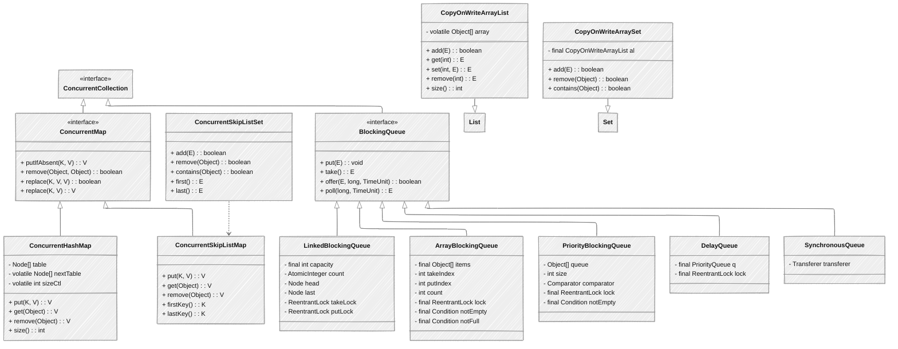

## 并发集合入门导读

### 什么是并发集合？为什么需要并发集合？

**并发集合是专为多线程环境设计的集合类**，可以安全地在多个线程同时访问和修改的情况下工作。

为什么需要并发集合？

+ 普通集合（如`ArrayList`、`HashMap`）不是线程安全的，多线程环境下可能导致数据不一致问题
+ 简单地使用`synchronized`或`Lock`会导致性能问题
+ 并发集合提供了更细粒度的线程安全机制，性能更好

### 并发集合的主要类型

Java提供了多种并发集合，主要分为以下几类：

1. **ConcurrentXxx**：如`ConcurrentHashMap`、`ConcurrentLinkedQueue`等，提供高并发读写能力，适用于高并发场景
2. **CopyOnWriteXxx**：如`CopyOnWriteArrayList`、`CopyOnWriteArraySet`，适合读多写少的场景，通过复制底层数组实现线程安全
3. **阻塞队列**：如`ArrayBlockingQueue`、`LinkedBlockingQueue`等，支持线程间同步，适用于生产者-消费者模式
4. **ConcurrentSkipListMap**：并发有序映射，相当于线程安全的`TreeMap`，提供高效的并发操作

### 并发集合使用示例

下面是一个简单的`ConcurrentHashMap`使用示例：

```java
import java.util.concurrent.ConcurrentHashMap;

public class ConcurrentHashMapBasicExample {
    public static void main(String[] args) {
        // 创建一个ConcurrentHashMap
        ConcurrentHashMap<String, Integer> scores = new ConcurrentHashMap<>();
        
        // 添加元素
        scores.put("张三", 85);
        scores.put("李四", 92);
        scores.put("王五", 78);
        
        // 原子操作 - 如果键不存在则添加
        scores.putIfAbsent("赵六", 95);
        
        // 原子操作 - 更新元素（通过函数式接口）
        scores.compute("张三", (k, v) -> v + 5);  // 张三的分数加5
        
        System.out.println("并发集合内容: " + scores);
        
        // 遍历（安全）
        scores.forEach((name, score) -> {
            System.out.println(name + ": " + score);
        });
    }
}
```

## 概述

在多线程环境下，普通集合类不是线程安全的，直接使用可能导致数据不一致或并发异常。Java提供了专门的并发集合框架，位于`java.util.concurrent`包中，这些集合类设计用于高并发场景，能够安全地在多个线程中访问和修改数据。本章将详细介绍Java中的并发集合，包括它们的实现原理、使用场景和性能特性。

## 并发集合分类与关系



## 并发集合核心特征

并发集合相比传统集合有以下核心特征：

1. **线程安全**：设计用于多线程环境，能够安全地进行并发访问和修改，避免数据不一致问题
2. **高性能**：相比使用同步代码块或`Collections.synchronizedXxx()`方法，提供更好的并发性能，利用多核处理器的并行能力
3. **原子操作支持**：提供丰富的原子操作，如`putIfAbsent`、`replace`等，能够在不使用同步块的情况下实现线程安全的修改
4. **迭代器弱一致性**：大多数并发集合的迭代器提供弱一致性保证，不会抛出`ConcurrentModificationException`，但在迭代过程中不保证元素的实时性
5. **不同的线程安全策略**：
    + 分段锁（如`ConcurrentHashMap`）
    + 写时复制（如`CopyOnWriteArrayList`）
    + 无锁算法（如某些队列的实现）

## 并发`Map`

### `ConcurrentHashMap`

#### 实现原理

`ConcurrentHashMap`是`HashMap`的线程安全版本，它通过分段锁机制（`JDK 7`）和`CAS`操作+节点锁（`JDK 8+`）实现高并发访问。

#### `JDK 7` 与 `JDK 8+` `ConcurrentHashMap`实现对比

| 特性 | JDK 7 ConcurrentHashMap | JDK 8+ ConcurrentHashMap |
| --- | --- | --- |
| 基本结构 | 分段数组（Segment数组）+ HashEntry数组 + 链表 | Node数组 + 链表/红黑树（与HashMap结构相似） |
| 锁机制 | 分段锁（Segment继承自ReentrantLock） | CAS操作 + synchronized节点锁 |
| 并发度 | 由Segment数组大小决定（默认16） | 由数组长度决定，理论上是元素数量级 |
| 内存占用 | 较高（Segment对象开销） | 较低（优化了节点结构） |
| 扩容机制 | 分段扩容（每个Segment独立扩容） | 并发扩容（支持多线程协助扩容） |
| 统计计数 | 使用Segment的count属性，需要加锁 | 使用CounterCell数组，无锁计数 |
| 树化支持 | 不支持（无红黑树优化） | 支持（链表过长时转红黑树） |

#### 详细差异分析

**1. 数据结构设计**

```java
// JDK 7 ConcurrentHashMap结构
public class ConcurrentHashMap<K, V> extends AbstractMap<K, V>
        implements ConcurrentMap<K, V>, Serializable {
    
    // 分段数组
    final Segment<K,V>[] segments;
    
    // 分段锁类
    static final class Segment<K,V> extends ReentrantLock implements Serializable {
        transient volatile HashEntry<K,V>[] table;
        transient int count;
        // ...
    }
    
    // 链表节点
    static final class HashEntry<K,V> {
        final K key;
        final int hash;
        volatile V value;
        final HashEntry<K,V> next;
        // ...
    }
}

// JDK 8+ ConcurrentHashMap结构
public class ConcurrentHashMap<K, V> extends AbstractMap<K, V>
        implements ConcurrentMap<K, V>, Serializable {
    
    // 存储节点的数组
    transient volatile Node<K,V>[] table;
    
    // 扩容时的过渡表
    private transient volatile Node<K,V>[] nextTable;
    
    // 基础节点类
    static class Node<K,V> implements Map.Entry<K,V> {
        final int hash;
        final K key;
        volatile V val;
        volatile Node<K,V> next;
        // ...
    }
    
    // 红黑树节点类
    static final class TreeNode<K,V> extends Node<K,V> {
        // 红黑树相关字段
        // ...
    }
}
```

**2. 锁机制演进**

+ **JDK 7 分段锁机制**：
  + 将数据分成多个`Segment`（默认16个）
  + 每个`Segment`独立加锁，互不影响
  + 并发度受限于`Segment`数量
  + 锁粒度较大
+ **JDK 8+ CAS + 节点锁机制**：
  + 移除了`Segment`，采用更细粒度的锁
  + 对空桶使用`CAS`无锁操作
  + 对非空桶仅锁定链表/树的头节点
  + 锁粒度大大减小，并发度显著提高

**3. 扩容优化**

+ **JDK 7**：
  + 每个`Segment`独立扩容
  + 扩容时该`Segment`锁定，其他`Segment`不受影响
  + 扩容过程相对简单但效率不高
+ **JDK 8+**：
  + 支持多线程并发扩容
  + 使用`transfer`方法和`ForwardingNode`标记正在迁移的桶
  + 线程可以帮助其他线程共同完成扩容
  + 扩容期间仍然可以进行读操作

**4. 计数实现**

+ **JDK 7**：
  + 使用`Segment`的`count`变量统计元素数量
  + 获取总大小时需要遍历所有`Segment`并加锁
  + 计数操作成本较高
+ **JDK 8+**：
  + 使用`CounterCell`数组进行无锁计数
  + 利用`LongAdder`的思想分散热点
  + 计数更加高效，尤其是在高并发环境

**5. 性能对比**

| 场景 | JDK 7 | JDK 8+ |
| :---: | :---: | :---: |
| 读操作 | 需要获取Segment的读锁 | 完全无锁（volatile保证可见性） |
| 写操作 | 获取Segment的写锁 | 仅锁定单个节点 |
| 高并发读 | 性能较好 | 性能极佳 |
| 高并发写 | 受Segment数量限制 | 几乎不受限制 |
| 内存开销 | 较高 | 较低 |

#### 为什么JDK 8要改变ConcurrentHashMap的实现？

1. **提高并发度**：从分段锁到节点锁，锁粒度更细
2. **优化内存使用**：移除`Segment`对象，减少内存占用
3. **利用新特性**：更好地利用`CAS`操作和`synchronized`的优化
4. **提升性能**：读操作完全无锁，写操作锁粒度减小
5. **结构统一**：与`HashMap`结构更相似，维护成本降低

#### 实际应用建议

1. **JDK 8+环境**：直接使用`ConcurrentHashMap`
2. **高并发读场景**：JDK 8+版本性能优势明显
3. **内存受限场景**：JDK 8+版本内存占用更小
4. **需要精确size的场景**：注意`size()`方法在JDK 8+中是近似值，非强一致性

**JDK 8+的实现要点**：

1. **存储结构**：Node数组 + 链表/红黑树，与`HashMap`结构更相似
2. **并发控制**：
    + 使用`volatile`保证节点的可见性
    + 使用`CAS`操作进行无锁更新
    + 只锁定需要修改的节点，而不是整个集合
3. **扩容机制**：支持并发扩容，使用`transfer`方法迁移数据
4. **统计计数**：使用`CounterCell`数组进行无锁计数

#### 核心源码分析

```java
// ConcurrentHashMap的put方法简化实现
public V put(K key, V value) {
    return putVal(key, value, false);
}

/** Implementation for put and putIfAbsent */
final V putVal(K key, V value, boolean onlyIfAbsent) {
    if (key == null || value == null) throw new NullPointerException();
    int hash = spread(key.hashCode());
    int binCount = 0;
    for (Node<K,V>[] tab = table;;) {
        Node<K,V> f;
        int n, i, fh;
        if (tab == null || (n = tab.length) == 0)
            tab = initTable();
        else if ((f = tabAt(tab, i = (n - 1) & hash)) == null) {
            // 如果桶为空，使用CAS操作插入新节点
            if (casTabAt(tab, i, null, new Node<K,V>(hash, key, value, null)))
                break;                   // no lock when adding to empty bin
        }
        else if ((fh = f.hash) == MOVED)
            tab = helpTransfer(tab, f);
        else {
            V oldVal = null;
            // 对链表头节点加锁
            synchronized (f) {
                if (tabAt(tab, i) == f) {
                    if (fh >= 0) {
                        binCount = 1;
                        for (Node<K,V> e = f;; ++binCount) {
                            K ek;
                            if (e.hash == hash &&
                                ((ek = e.key) == key ||
                                 (ek != null && key.equals(ek)))) {
                                oldVal = e.val;
                                if (!onlyIfAbsent)
                                    e.val = value;
                                break;
                            }
                            Node<K,V> pred = e;
                            if ((e = e.next) == null) {
                                pred.next = new Node<K,V>(hash, key, value, null);
                                break;
                            }
                        }
                    }
                    else if (f instanceof TreeBin) {
                        Node<K,V> p;
                        binCount = 2;
                        if ((p = ((TreeBin<K,V>)f).putTreeVal(hash, key, value)) != null) {
                            oldVal = p.val;
                            if (!onlyIfAbsent)
                                p.val = value;
                        }
                    }
                }
            }
            if (binCount != 0) {
                if (binCount >= TREEIFY_THRESHOLD)
                    treeifyBin(tab, i);
                if (oldVal != null)
                    return oldVal;
                break;
            }
        }
    }
    addCount(1L, binCount);
    return null;
}

// 获取元素的方法
public V get(Object key) {
    Node<K,V>[] tab;
    Node<K,V> e, p;
    int n, eh;
    K ek;
    int h = spread(key.hashCode());
    if ((tab = table) != null && (n = tab.length) > 0 &&
        (e = tabAt(tab, (n - 1) & h)) != null) {
        if ((eh = e.hash) == h) {
            if ((ek = e.key) == key || (ek != null && key.equals(ek)))
                return e.val;
        }
        else if (eh < 0)
            return (p = e.find(h, key)) != null ? p.val : null;
        while ((e = e.next) != null) {
            if (e.hash == h &&
                ((ek = e.key) == key || (ek != null && key.equals(ek))))
                return e.val;
        }
    }
    return null;
}
```

#### 使用示例

```java
import java.util.concurrent.*;
import java.util.*;

public class ConcurrentHashMapExample {
    public static void main(String[] args) throws InterruptedException {
        // 创建ConcurrentHashMap实例
        ConcurrentHashMap<String, Integer> map = new ConcurrentHashMap<>();
        
        System.out.println("=== 基本操作示例 ===");
        // 添加元素
        map.put("one", 1);
        map.put("two", 2);
        map.put("three", 3);
        System.out.println("初始Map: " + map);
        
        // 获取元素
        Integer value = map.get("two");
        System.out.println("key为'two'的值: " + value);
        
        // 移除元素
        map.remove("one");
        System.out.println("移除'one'后: " + map);
        
        // 获取大小
        System.out.println("Map大小: " + map.size());
        
        System.out.println("\n=== 原子操作示例 ===");
        // putIfAbsent: 如果键不存在，则添加
        map.putIfAbsent("four", 4);
        map.putIfAbsent("two", 22); // 不会替换已存在的值
        System.out.println("putIfAbsent后: " + map);
        
        // remove: 只有当键和值都匹配时才移除
        boolean removed = map.remove("two", 22);
        System.out.println("键'two'值为22时移除: " + removed);
        removed = map.remove("two", 2);
        System.out.println("键'two'值为2时移除: " + removed);
        System.out.println("移除后: " + map);
        
        // replace: 替换已存在的键的值
        map.replace("three", 30);
        System.out.println("替换'three'后: " + map);
        
        // replace: 只有当原值匹配时才替换
        map.replace("three", 30, 300);
        System.out.println("原值为30时替换'three': " + map);
        
        System.out.println("\n=== 多线程并发操作示例 ===");
        ConcurrentHashMap<String, Integer> counterMap = new ConcurrentHashMap<>();
        ExecutorService executor = Executors.newFixedThreadPool(10);
        
        // 10个线程，每个线程递增1000次
        for (int i = 0; i < 10; i++) {
            executor.submit(() -> {
                for (int j = 0; j < 1000; j++) {
                    // 使用merge方法进行并发计数
                    counterMap.merge("counter", 1, Integer::sum);
                }
            });
        }
        
        executor.shutdown();
        executor.awaitTermination(10, TimeUnit.SECONDS);
        
        System.out.println("预期计数: 10000");
        System.out.println("实际计数: " + counterMap.get("counter"));
        
        System.out.println("\n=== 批量操作示例 ===");
        ConcurrentHashMap<String, Integer> bulkMap = new ConcurrentHashMap<>();
        
        // 批量添加
        Map<String, Integer> toAdd = new HashMap<>();
        toAdd.put("a", 1);
        toAdd.put("b", 2);
        toAdd.put("c", 3);
        bulkMap.putAll(toAdd);
        System.out.println("批量添加后: " + bulkMap);
        
        // 遍历
        System.out.println("Map中的所有键值对:");
        for (Map.Entry<String, Integer> entry : bulkMap.entrySet()) {
            System.out.println(entry.getKey() + ": " + entry.getValue());
        }
        
        // 计算
        Integer sum = bulkMap.reduceValuesToInt(1, Integer::intValue, 0, Integer::sum);
        System.out.println("所有值的和: " + sum);
    }
}
```

### `ConcurrentSkipListMap`

#### 实现原理

`ConcurrentSkipListMap`是`TreeMap`的线程安全版本，它基于跳表（`SkipList`）数据结构实现，提供了有序的映射关系和并发访问能力。

**核心特点**：

1. **跳表结构**：通过维护多层链表，实现快速查找、插入和删除操作
2. **并发控制**：使用`CAS`操作和节点标记实现无锁并发控制
3. **自动排序**：根据键的自然顺序或指定的比较器排序
4. **性能特性**：查找、插入、删除操作的平均时间复杂度为O(log n)

#### 使用示例

```java
import java.util.concurrent.*;
import java.util.*;

public class ConcurrentSkipListMapExample {
    public static void main(String[] args) {
        // 创建默认按自然顺序排序的ConcurrentSkipListMap
        ConcurrentSkipListMap<String, Integer> map = new ConcurrentSkipListMap<>();
        
        System.out.println("=== 基本操作示例 ===");
        // 添加元素
        map.put("apple", 5);
        map.put("banana", 3);
        map.put("orange", 7);
        map.put("grape", 2);
        map.put("pear", 4);
        
        // 由于是有序的，输出将按键的字典序排列
        System.out.println("有序Map: " + map);
        
        // 获取元素
        Integer count = map.get("banana");
        System.out.println("banana的数量: " + count);
        
        // 获取首尾元素
        System.out.println("最小键: " + map.firstKey() + ", 值: " + map.firstEntry());
        System.out.println("最大键: " + map.lastKey() + ", 值: " + map.lastEntry());
        
        System.out.println("\n=== 范围操作示例 ===");
        // 获取小于等于指定键的最大键对应的键值对
        Map.Entry<String, Integer> floorEntry = map.floorEntry("orange");
        System.out.println("小于等于'orange'的最大键值对: " + floorEntry);
        
        // 获取大于等于指定键的最小键对应的键值对
        Map.Entry<String, Integer> ceilingEntry = map.ceilingEntry("grape");
        System.out.println("大于等于'grape'的最小键值对: " + ceilingEntry);
        
        // 获取指定范围的子映射
        NavigableMap<String, Integer> subMap = map.subMap("banana", true, "orange", true);
        System.out.println("banana到orange的子映射: " + subMap);
        
        // 获取小于指定键的所有元素
        SortedMap<String, Integer> headMap = map.headMap("orange");
        System.out.println("小于'orange'的所有元素: " + headMap);
        
        // 获取大于等于指定键的所有元素
        SortedMap<String, Integer> tailMap = map.tailMap("grape");
        System.out.println("大于等于'grape'的所有元素: " + tailMap);
        
        System.out.println("\n=== 自定义比较器示例 ===");
        // 使用自定义比较器（按值大小排序）
        ConcurrentSkipListMap<String, Integer> valueSortedMap = new ConcurrentSkipListMap<>(
            Comparator.comparing(map::get).thenComparing(Comparator.naturalOrder())
        );
        
        valueSortedMap.putAll(map);
        System.out.println("按值排序的Map: " + valueSortedMap);
        
        System.out.println("\n=== 原子操作示例 ===");
        // putIfAbsent操作
        map.putIfAbsent("watermelon", 8);
        map.putIfAbsent("apple", 10); // 不会替换已存在的值
        System.out.println("putIfAbsent后: " + map);
        
        // replace操作
        map.replace("banana", 30);
        System.out.println("替换banana后: " + map);
        
        // 条件替换
        map.replace("banana", 30, 300);
        System.out.println("条件替换后: " + map);
    }
}
```

## 并发`List`和`Set`

### `CopyOnWriteArrayList`

#### 实现原理

`CopyOnWriteArrayList`是`ArrayList`的线程安全变体，它采用写时复制（`Copy-On-Write`）策略实现线程安全。

**核心特点**：

1. **写时复制**：修改操作会创建底层数组的副本，然后替换原数组
2. **读操作无锁**：读操作不需要加锁，可以并发执行
3. **弱一致性迭代器**：迭代器基于迭代时的数组快照，不会抛出`ConcurrentModificationException`
4. **适用场景**：读多写少的并发场景

#### 核心源码分析

```java
// CopyOnWriteArrayList的核心实现
public class CopyOnWriteArrayList<E> implements List<E>, RandomAccess, Cloneable, java.io.Serializable {
    // 使用volatile保证数组的可见性
    private transient volatile Object[] array;
    
    // 获取当前数组
    final Object[] getArray() {
        return array;
    }
    
    // 设置新数组
    final void setArray(Object[] a) {
        array = a;
    }
    
    // 添加元素
    public boolean add(E e) {
        final ReentrantLock lock = this.lock;
        lock.lock(); // 获取写锁
        try {
            Object[] elements = getArray();
            int len = elements.length;
            // 创建新数组，复制原数组元素，并添加新元素
            Object[] newElements = Arrays.copyOf(elements, len + 1);
            newElements[len] = e;
            // 替换原数组
            setArray(newElements);
            return true;
        } finally {
            lock.unlock(); // 释放写锁
        }
    }
    
    // 获取元素
    public E get(int index) {
        return get(getArray(), index);
    }
    
    private E get(Object[] a, int index) {
        return (E) a[index]; // 读操作无需加锁
    }
    
    // 移除元素
    public E remove(int index) {
        final ReentrantLock lock = this.lock;
        lock.lock(); // 获取写锁
        try {
            Object[] elements = getArray();
            int len = elements.length;
            E oldValue = get(elements, index);
            int numMoved = len - index - 1;
            if (numMoved == 0)
                setArray(Arrays.copyOf(elements, len - 1));
            else {
                // 创建新数组，复制除index位置外的所有元素
                Object[] newElements = new Object[len - 1];
                System.arraycopy(elements, 0, newElements, 0, index);
                System.arraycopy(elements, index + 1, newElements, index, numMoved);
                setArray(newElements);
            }
            return oldValue;
        } finally {
            lock.unlock(); // 释放写锁
        }
    }
}
```

#### 使用示例

```java
import java.util.concurrent.*;
import java.util.*;

public class CopyOnWriteArrayListExample {
    public static void main(String[] args) throws InterruptedException {
        // 创建CopyOnWriteArrayList实例
        CopyOnWriteArrayList<String> list = new CopyOnWriteArrayList<>();
        
        System.out.println("=== 基本操作示例 ===");
        // 添加元素
        list.add("A");
        list.add("B");
        list.add("C");
        System.out.println("初始列表: " + list);
        
        // 获取元素
        String element = list.get(1);
        System.out.println("索引1的元素: " + element);
        
        // 设置元素
        list.set(1, "B-modified");
        System.out.println("修改索引1后: " + list);
        
        // 移除元素
        list.remove(0);
        System.out.println("移除索引0后: " + list);
        
        // 获取大小
        System.out.println("列表大小: " + list.size());
        
        System.out.println("\n=== 遍历与修改示例 ===");
        // 创建一个新的列表用于测试
        CopyOnWriteArrayList<String> iterateList = new CopyOnWriteArrayList<>(
            Arrays.asList("One", "Two", "Three", "Four", "Five"));
        
        System.out.println("原始列表: " + iterateList);
        
        // 迭代过程中修改列表（不会抛出ConcurrentModificationException）
        for (String item : iterateList) {
            System.out.println("正在处理: " + item);
            if (item.equals("Three")) {
                iterateList.add("Six");
                iterateList.remove("One");
                System.out.println("迭代过程中修改了列表");
            }
        }
        
        System.out.println("迭代完成后的列表: " + iterateList);
        
        System.out.println("\n=== 多线程读写示例 ===");
        CopyOnWriteArrayList<Integer> threadList = new CopyOnWriteArrayList<>();
        
        // 添加初始元素
        for (int i = 0; i < 100; i++) {
            threadList.add(i);
        }
        
        ExecutorService executor = Executors.newFixedThreadPool(10);
        
        // 创建5个读线程
        for (int i = 0; i < 5; i++) {
            executor.submit(() -> {
                for (int j = 0; j < 1000; j++) {
                    // 随机读取元素
                    int index = ThreadLocalRandom.current().nextInt(threadList.size());
                    Integer value = threadList.get(index);
                    if (j % 1000 == 0) {
                        System.out.println(Thread.currentThread().getName() + 
                                           " 读取索引 " + index + ": " + value);
                    }
                }
            });
        }
        
        // 创建1个写线程
        executor.submit(() -> {
            for (int j = 0; j < 10; j++) {
                try {
                    Thread.sleep(100); // 短暂休眠
                    threadList.add(1000 + j); // 添加新元素
                    System.out.println(Thread.currentThread().getName() + 
                                       " 添加元素: " + (1000 + j));
                } catch (InterruptedException e) {
                    Thread.currentThread().interrupt();
                }
            }
        });
        
        executor.shutdown();
        executor.awaitTermination(10, TimeUnit.SECONDS);
        
        System.out.println("\n最终列表大小: " + threadList.size());
    }
}
```

### CopyOnWriteArraySet

#### 实现原理

`CopyOnWriteArraySet`是`TreeSet`的线程安全变体，它内部使用`CopyOnWriteArrayList`实现，通过维护元素的唯一性来提供`Set`接口的功能。

**核心特点**：

1. **基于**`CopyOnWriteArrayList`：内部持有一个`CopyOnWriteArrayList`实例
2. **元素去重**：添加元素前会检查元素是否已存在
3. **写时复制**：与`CopyOnWriteArrayList`相同的并发控制策略
4. **适用场景**：读多写少、元素数量较少的并发场景

#### 使用示例

```java
import java.util.concurrent.*;
import java.util.*;

public class CopyOnWriteArraySetExample {
    public static void main(String[] args) {
        // 创建CopyOnWriteArraySet实例
        CopyOnWriteArraySet<String> set = new CopyOnWriteArraySet<>();
        
        System.out.println("=== 基本操作示例 ===");
        // 添加元素
        boolean added1 = set.add("A");
        boolean added2 = set.add("B");
        boolean added3 = set.add("A"); // 重复元素，添加失败
        
        System.out.println("添加'A': " + added1);
        System.out.println("添加'B': " + added2);
        System.out.println("添加重复的'A': " + added3);
        System.out.println("当前Set: " + set);
        
        // 检查元素是否存在
        boolean contains = set.contains("B");
        System.out.println("Set包含'B': " + contains);
        
        // 移除元素
        boolean removed = set.remove("A");
        System.out.println("移除'A': " + removed);
        System.out.println("移除后的Set: " + set);
        
        // 获取大小
        System.out.println("Set大小: " + set.size());
        
        System.out.println("\n=== 遍历与修改示例 ===");
        // 创建一个新的Set用于测试
        CopyOnWriteArraySet<String> iterateSet = new CopyOnWriteArraySet<>(
            Arrays.asList("One", "Two", "Three", "Four", "Five"));
        
        System.out.println("原始Set: " + iterateSet);
        
        // 迭代过程中修改Set（不会抛出ConcurrentModificationException）
        for (String item : iterateSet) {
            System.out.println("正在处理: " + item);
            if (item.equals("Three")) {
                iterateSet.add("Six");
                iterateSet.remove("One");
                System.out.println("迭代过程中修改了Set");
            }
        }
        
        System.out.println("迭代完成后的Set: " + iterateSet);
        
        System.out.println("\n=== 批量操作示例 ===");
        CopyOnWriteArraySet<String> bulkSet = new CopyOnWriteArraySet<>();
        
        // 添加多个元素
        Collection<String> toAdd = Arrays.asList("X", "Y", "Z", "X"); // 包含重复元素
        boolean allAdded = bulkSet.addAll(toAdd);
        System.out.println("添加集合结果: " + allAdded);
        System.out.println("添加后的Set: " + bulkSet);
        
        // 移除多个元素
        Collection<String> toRemove = Arrays.asList("X", "Y");
        boolean allRemoved = bulkSet.removeAll(toRemove);
        System.out.println("移除集合结果: " + allRemoved);
        System.out.println("移除后的Set: " + bulkSet);
    }
}
```

## `BlockingQueue`

### 核心概念

`BlockingQueue`是一个支持两个附加操作的队列：

1. **阻塞添加**：当队列满时，阻塞添加元素的线程，直到队列有空间
2. **阻塞删除**：当队列为空时，阻塞删除元素的线程，直到队列有元素

这些操作使`BlockingQueue`非常适合生产者-消费者模式。

### 主要实现类对比

| 实现类 | 数据结构 | 是否有界 | 排序方式 | 特点 | 适用场景 |
| :---: | :---: | :---: | :---: | :---: | :---: |
| LinkedBlockingQueue | 链表 | 可选有界 | FIFO | 吞吐量高，可选择有界或无界 | 生产者-消费者模式，任务队列 |
| ArrayBlockingQueue | 数组 | 有界 | FIFO | 固定大小，公平性选择 | 固定大小的缓冲区，有界队列 |
| PriorityBlockingQueue | 数组实现的二叉堆 | 无界 | 优先级 | 自动排序，基于比较器 | 任务调度，优先级处理 |
| DelayQueue | 优先级队列 | 无界 | 延迟时间 | 延迟元素，到期后才能取出 | 定时任务，缓存过期 |
| SynchronousQueue | 无内部存储 | 无界（概念上） | FIFO或优先级 | 直接传递，生产者等待消费者 | 线程间直接通信，交换数据 |
| LinkedBlockingDeque | 双向链表 | 可选有界 | FIFO/LIFO | 双向操作，双端队列 | 工作窃取算法，双向队列 |

### `LinkedBlockingQueue`示例

```java
import java.util.concurrent.*;
import java.util.*;

public class LinkedBlockingQueueExample {
    public static void main(String[] args) throws InterruptedException {
        // 创建一个容量为10的LinkedBlockingQueue
        BlockingQueue<String> queue = new LinkedBlockingQueue<>(10);
        
        System.out.println("=== 基本操作示例 ===");
        // 添加元素（不会阻塞，因为队列未满）
        queue.add("A");
        queue.put("B"); // put方法在队列满时会阻塞
        boolean offerResult = queue.offer("C");
        
        System.out.println("添加'C'的结果: " + offerResult);
        System.out.println("队列大小: " + queue.size());
        
        // 移除元素
        String polled = queue.poll();
        String taken = queue.take(); // take方法在队列空时会阻塞
        String peeked = queue.peek(); // 查看队首元素但不移除
        
        System.out.println("poll()获取的元素: " + polled);
        System.out.println("take()获取的元素: " + taken);
        System.out.println("peek()查看的元素: " + peeked);
        System.out.println("队列大小: " + queue.size());
        
        System.out.println("\n=== 限时操作示例 ===");
        // 限时添加元素
        boolean offerWithTimeout = queue.offer("D", 1, TimeUnit.SECONDS);
        System.out.println("限时添加'D'的结果: " + offerWithTimeout);
        
        // 限时获取元素
        String pollWithTimeout = queue.poll(1, TimeUnit.SECONDS);
        System.out.println("限时poll()获取的元素: " + pollWithTimeout);
        
        System.out.println("\n=== 生产者-消费者模式示例 ===");
        // 创建一个更大的队列用于生产者-消费者示例
        BlockingQueue<Task> taskQueue = new LinkedBlockingQueue<>(20);
        
        // 创建3个消费者线程
        for (int i = 0; i < 3; i++) {
            final int consumerId = i + 1;
            new Thread(() -> {
                try {
                    while (!Thread.currentThread().isInterrupted()) {
                        // 从队列中获取任务，会阻塞直到有任务
                        Task task = taskQueue.take();
                        System.out.println("消费者" + consumerId + " 处理任务: " + task);
                        // 模拟任务处理时间
                        Thread.sleep(ThreadLocalRandom.current().nextInt(500, 1500));
                    }
                } catch (InterruptedException e) {
                    Thread.currentThread().interrupt();
                }
            }, "Consumer-" + consumerId).start();
        }
        
        // 创建2个生产者线程
        for (int i = 0; i < 2; i++) {
            final int producerId = i + 1;
            new Thread(() -> {
                try {
                    for (int j = 0; j < 10; j++) {
                        // 创建新任务
                        Task task = new Task(producerId, j);
                        // 将任务添加到队列
                        taskQueue.put(task);
                        System.out.println("生产者" + producerId + " 发布任务: " + task);
                        // 模拟生产间隔
                        Thread.sleep(ThreadLocalRandom.current().nextInt(200, 800));
                    }
                } catch (InterruptedException e) {
                    Thread.currentThread().interrupt();
                }
            }, "Producer-" + producerId).start();
        }
        
        // 等待一段时间让程序运行
        Thread.sleep(15000);
        System.out.println("生产者-消费者示例运行结束");
    }
    
    // 任务类
    static class Task {
        private final int producerId;
        private final int taskId;
        private final long timestamp;
        
        public Task(int producerId, int taskId) {
            this.producerId = producerId;
            this.taskId = taskId;
            this.timestamp = System.currentTimeMillis();
        }
        
        @Override
        public String toString() {
            return "Task{producer=" + producerId + ", id=" + taskId + ", time=" + timestamp + "}";
        }
    }
}
```

### `PriorityBlockingQueue`示例

```java
import java.util.concurrent.*;
import java.util.*;

public class PriorityBlockingQueueExample {
    public static void main(String[] args) throws InterruptedException {
        // 创建基于自然排序的PriorityBlockingQueue
        PriorityBlockingQueue<Integer> naturalQueue = new PriorityBlockingQueue<>();
        
        System.out.println("=== 自然排序示例 ===");
        // 添加元素
        naturalQueue.add(5);
        naturalQueue.add(1);
        naturalQueue.add(8);
        naturalQueue.add(3);
        naturalQueue.add(6);
        
        System.out.print("按优先级顺序取出元素: ");
        while (!naturalQueue.isEmpty()) {
            System.out.print(naturalQueue.poll() + " ");
        }
        System.out.println();
        
        System.out.println("\n=== 自定义比较器示例 ===");
        // 创建使用自定义比较器的PriorityBlockingQueue（按任务优先级）
        PriorityBlockingQueue<Task> taskQueue = new PriorityBlockingQueue<>(
            10, 
            Comparator.comparingInt(Task::getPriority).reversed() // 优先级高的先出队
        );
        
        // 添加不同优先级的任务
        taskQueue.add(new Task("Low priority task", 1));
        taskQueue.add(new Task("High priority task", 5));
        taskQueue.add(new Task("Medium priority task", 3));
        taskQueue.add(new Task("Very high priority task", 10));
        taskQueue.add(new Task("Another medium task", 3));
        
        System.out.println("按优先级顺序处理任务:");
        while (!taskQueue.isEmpty()) {
            Task task = taskQueue.poll();
            System.out.println("处理: " + task);
        }
        
        System.out.println("\n=== 任务调度示例 ===");
        // 创建一个任务调度队列
        PriorityBlockingQueue<ScheduledTask> scheduleQueue = new PriorityBlockingQueue<>();
        
        // 添加定时任务
        long now = System.currentTimeMillis();
        scheduleQueue.add(new ScheduledTask("Task 1", now + 2000));
        scheduleQueue.add(new ScheduledTask("Task 2", now + 1000));
        scheduleQueue.add(new ScheduledTask("Task 3", now + 3000));
        
        System.out.println("开始任务调度...");
        
        // 模拟调度器
        while (!scheduleQueue.isEmpty()) {
            ScheduledTask task = scheduleQueue.peek();
            long delay = task.getExecuteTime() - System.currentTimeMillis();
            
            if (delay > 0) {
                System.out.println("等待 " + delay + "ms 执行: " + task.getName());
                Thread.sleep(delay);
            }
            
            // 执行任务
            scheduleQueue.poll();
            System.out.println("执行任务: " + task.getName());
        }
        
        System.out.println("\n=== Top K问题示例 ===");
        // 使用PriorityBlockingQueue解决Top K问题
        int[] nums = {3, 1, 6, 8, 2, 9, 4, 5, 7};
        int k = 3; // 找出最大的3个元素
        
        // 使用小顶堆，保持堆大小不超过k
        PriorityBlockingQueue<Integer> minHeap = new PriorityBlockingQueue<>(k);
        
        for (int num : nums) {
            if (minHeap.size() < k) {
                minHeap.add(num);
            } else if (num > minHeap.peek()) {
                minHeap.poll();
                minHeap.add(num);
            }
        }
        
        System.out.print("数组中最大的" + k + "个元素: ");
        while (!minHeap.isEmpty()) {
            System.out.print(minHeap.poll() + " ");
        }
        System.out.println();
    }
    
    // 带优先级的任务类
    static class Task {
        private final String name;
        private final int priority; // 优先级，数字越大优先级越高
        
        public Task(String name, int priority) {
            this.name = name;
            this.priority = priority;
        }
        
        public int getPriority() {
            return priority;
        }
        
        @Override
        public String toString() {
            return name + " (优先级: " + priority + ")";
        }
    }
    
    // 定时任务类
    static class ScheduledTask implements Comparable<ScheduledTask> {
        private final String name;
        private final long executeTime; // 执行时间戳
        
        public ScheduledTask(String name, long executeTime) {
            this.name = name;
            this.executeTime = executeTime;
        }
        
        public String getName() {
            return name;
        }
        
        public long getExecuteTime() {
            return executeTime;
        }
        
        // 实现Comparable接口，按执行时间排序
        @Override
        public int compareTo(ScheduledTask other) {
            return Long.compare(this.executeTime, other.executeTime);
        }
    }
}
```

## 并发集合实战应用

### `ConcurrentHashMap`用于高频计数

```java
import java.util.concurrent.*;
import java.util.stream.*;

public class ConcurrentCounterExample {
    public static void main(String[] args) throws InterruptedException {
        // 创建一个大型字符串数组，包含重复元素
        String[] words = generateRandomWords(100_000, 100);
        
        System.out.println("开始统计词频...");
        long startTime = System.currentTimeMillis();
        
        // 使用ConcurrentHashMap进行并发计数
        ConcurrentHashMap<String, Integer> wordCount = new ConcurrentHashMap<>();
        
        // 创建线程池
        ExecutorService executor = Executors.newFixedThreadPool(8);
        int chunkSize = words.length / 8;
        
        // 划分任务，并行处理
        for (int i = 0; i < 8; i++) {
            final int start = i * chunkSize;
            final int end = (i == 7) ? words.length : (i + 1) * chunkSize;
            
            executor.submit(() -> {
                for (int j = start; j < end; j++) {
                    // 使用merge方法进行线程安全的计数
                    wordCount.merge(words[j], 1, Integer::sum);
                }
            });
        }
        
        executor.shutdown();
        executor.awaitTermination(1, TimeUnit.MINUTES);
        
        long endTime = System.currentTimeMillis();
        System.out.println("词频统计完成，耗时: " + (endTime - startTime) + "ms");
        System.out.println("不同单词数量: " + wordCount.size());
        
        // 找出出现频率最高的前10个单词
        wordCount.entrySet().stream()
            .sorted(Map.Entry.<String, Integer>comparingByValue().reversed())
            .limit(10)
            .forEach(entry -> System.out.println(entry.getKey() + ": " + entry.getValue()));
    }
    
    // 生成随机单词数组
    private static String[] generateRandomWords(int count, int maxWordLength) {
        String[] words = new String[count];
        String chars = "ABCDEFGHIJKLMNOPQRSTUVWXYZabcdefghijklmnopqrstuvwxyz";
        Random random = new Random(42); // 使用固定种子保证可重复性
        
        for (int i = 0; i < count; i++) {
            int wordLength = random.nextInt(maxWordLength) + 1;
            StringBuilder word = new StringBuilder(wordLength);
            for (int j = 0; j < wordLength; j++) {
                word.append(chars.charAt(random.nextInt(chars.length())));
            }
            words[i] = word.toString();
        }
        
        return words;
    }
}
```

### `CopyOnWriteArrayList`用于读多写少场景

```java
import java.util.concurrent.*;
import java.util.*;

public class CopyOnWriteReadHeavyExample {
    public static void main(String[] args) throws InterruptedException {
        // 创建一个存储配置的列表
        CopyOnWriteArrayList<String> configList = new CopyOnWriteArrayList<>();
        
        // 初始化配置
        for (int i = 0; i < 100; i++) {
            configList.add("config_" + i + "=value_" + i);
        }
        
        System.out.println("=== 读多写少场景示例 ===");
        System.out.println("初始配置数量: " + configList.size());
        
        // 创建20个读线程
        CountDownLatch readLatch = new CountDownLatch(20);
        for (int i = 0; i < 20; i++) {
            final int readerId = i;
            new Thread(() -> {
                try {
                    for (int j = 0; j < 1000; j++) {
                        // 随机读取配置
                        int index = ThreadLocalRandom.current().nextInt(configList.size());
                        String config = configList.get(index);
                        if (j % 1000 == 0) {
                            System.out.println("Reader " + readerId + " 读取配置: " + config);
                        }
                        // 模拟处理时间
                        Thread.sleep(5);
                    }
                } catch (InterruptedException e) {
                    Thread.currentThread().interrupt();
                } finally {
                    readLatch.countDown();
                }
            }, "Reader-" + readerId).start();
        }
        
        // 创建1个写线程，定期更新配置
        CountDownLatch writeLatch = new CountDownLatch(1);
        new Thread(() -> {
            try {
                for (int i = 0; i < 5; i++) {
                    // 等待一段时间再更新
                    Thread.sleep(2000);
                    
                    // 添加新配置
                    String newConfig = "new_config_" + i + "=new_value_" + i;
                    configList.add(newConfig);
                    System.out.println("Writer 添加新配置: " + newConfig);
                    
                    // 更新现有配置
                    int updateIndex = ThreadLocalRandom.current().nextInt(configList.size() - 10);
                    String oldConfig = configList.get(updateIndex);
                    String[] parts = oldConfig.split("=");
                    String newConfigValue = parts[0] + "=updated_value_" + i;
                    configList.set(updateIndex, newConfigValue);
                    System.out.println("Writer 更新配置: " + oldConfig + " -> " + newConfigValue);
                }
            } catch (InterruptedException e) {
                Thread.currentThread().interrupt();
            } finally {
                writeLatch.countDown();
            }
        }, "Writer").start();
        
        // 等待所有线程完成
        writeLatch.await();
        readLatch.await();
        
        System.out.println("\n所有操作完成");
        System.out.println("最终配置数量: " + configList.size());
    }
}
```

### `BlockingQueue`实现生产者-消费者模式

```java
import java.util.concurrent.*;
import java.util.*;

public class ProducerConsumerPattern {
    public static void main(String[] args) throws InterruptedException {
        // 创建缓冲区
        BlockingQueue<DataPacket> buffer = new LinkedBlockingQueue<>(20);
        
        // 创建计数器和同步工具
        CountDownLatch latch = new CountDownLatch(5); // 5个生产者
        ExecutorService executor = Executors.newCachedThreadPool();
        
        System.out.println("启动生产者-消费者系统...");
        
        // 创建3个消费者
        for (int i = 0; i < 3; i++) {
            final int consumerId = i + 1;
            executor.submit(() -> {
                try {
                    while (!Thread.currentThread().isInterrupted()) {
                        // 从缓冲区获取数据，会阻塞直到有数据
                        DataPacket data = buffer.take();
                        
                        // 处理数据
                        processData(data, consumerId);
                    }
                } catch (InterruptedException e) {
                    Thread.currentThread().interrupt();
                }
            });
        }
        
        // 创建5个生产者，每个生产者生成20个数据包
        for (int i = 0; i < 5; i++) {
            final int producerId = i + 1;
            executor.submit(() -> {
                try {
                    for (int j = 0; j < 20; j++) {
                        // 创建数据包
                        DataPacket data = new DataPacket(producerId, j, "Data content " + j);
                        
                        // 添加到缓冲区，会阻塞直到有空间
                        buffer.put(data);
                        System.out.println("Producer " + producerId + " produced: " + data);
                        
                        // 模拟生产间隔
                        Thread.sleep(ThreadLocalRandom.current().nextInt(100, 300));
                    }
                } catch (InterruptedException e) {
                    Thread.currentThread().interrupt();
                } finally {
                    latch.countDown();
                }
            });
        }
        
        // 等待所有生产者完成
        latch.await();
        
        // 再等待5秒让消费者处理剩余数据
        System.out.println("所有生产者完成，等待消费者处理剩余数据...");
        Thread.sleep(5000);
        
        // 关闭线程池
        executor.shutdownNow();
        System.out.println("系统已关闭");
    }
    
    // 处理数据的方法
    private static void processData(DataPacket data, int consumerId) throws InterruptedException {
        // 模拟数据处理时间
        Thread.sleep(ThreadLocalRandom.current().nextInt(200, 500));
        System.out.println("Consumer " + consumerId + " processed: " + data);
    }
    
    // 数据包类
    static class DataPacket {
        private final int producerId;
        private final int sequenceNumber;
        private final String content;
        private final long timestamp;
        
        public DataPacket(int producerId, int sequenceNumber, String content) {
            this.producerId = producerId;
            this.sequenceNumber = sequenceNumber;
            this.content = content;
            this.timestamp = System.currentTimeMillis();
        }
        
        @Override
        public String toString() {
            return "DataPacket{producer=" + producerId + ", seq=" + sequenceNumber + ", time=" + 
                   timestamp + ", content='" + content + "'}";
        }
    }
}
```

## 并发集合与传统集合对比

### 性能对比

| 操作类型 | 传统同步集合 | 并发集合 | 优势 |
| :---: | :---: | :---: | :---: |
| 读操作 | 使用synchronized，串行执行 | 大多数支持并发读，无锁或细粒度锁 | 高并发读性能更好 |
| 写操作 | 使用synchronized，串行执行 | 使用分段锁、CAS等技术，支持并发写 | 高并发写性能更好 |
| 迭代操作 | 可能抛出ConcurrentModificationException | 提供弱一致性迭代器 | 更安全的并发迭代 |
| 内存开销 | 较低 | 较高（额外的并发控制机制） | 空间换时间 |

### 选择建议

1. **读多写少场景**：
    + 优先选择`CopyOnWriteArrayList`和`CopyOnWriteArraySet`，因为它们在读操作上有优势，而写操作的成本较高。
2. **高频读写且需要Map操作**：
    + 优先选择`ConcurrentHashMap`，因为它在高并发场景下提供了很好的性能。
3. **需要有序Map操作**：
    + 优先选择`ConcurrentSkipListMap`，因为它在并发场景下保持了有序性。
4. **生产者-消费者模式**：
    + 根据需求选择合适的`BlockingQueue`实现：
        + 一般场景：`LinkedBlockingQueue`
        + 固定大小缓冲区：`ArrayBlockingQueue`
        + 任务调度：`PriorityBlockingQueue`
        + 线程间直接通信：`SynchronousQueue`
5. **线程安全但性能要求不高**：
    + 可考虑使用`Collections.synchronizedXxx()`包装的传统集合，因为它们在简单场景下提供了线程安全的访问。

## 并发集合最佳实践

1. **选择合适的并发集合**：根据应用场景选择最适合的并发集合实现
2. **避免过度同步**：优先使用并发集合而不是手动加锁的普通集合
3. **注意内存开销**：特别是`CopyOnWriteArrayList`，在元素数量多时写操作开销很大，因为每次写操作都需要复制整个数组。
4. **了解弱一致性**：理解并发集合迭代器的弱一致性语义，避免依赖强一致性保证
5. **使用原子操作**：充分利用并发集合提供的原子操作方法，如`putIfAbsent`、`replace`等，避免手动实现同步逻辑
6. **监控性能**：在高并发场景下监控并发集合的性能表现，必要时进行调优
7. **避免长时间持有迭代器**：迭代器基于集合快照，长时间持有可能导致内存占用增加
8. **注意初始化容量**：为有界集合指定合适的初始容量，避免频繁扩容

## 小结

Java并发集合框架提供了多种高性能、线程安全的集合实现，适用于不同的并发场景。`ConcurrentHashMap`、`CopyOnWriteArrayList`和各种`BlockingQueue`实现是最常用的并发集合，它们通过不同的并发控制策略（如细粒度锁、写时复制、`CAS`操作等）实现了高性能的线程安全访问。

在实际开发中，我们需要根据具体的应用场景和性能需求选择合适的并发集合，同时注意理解它们的实现原理和行为特性，以便正确使用并充分发挥其性能优势。
