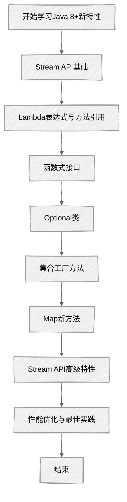

## 学习路径



## 1. `Stream` API详解

### 1.1 `Stream` API概述

`Stream` API是`Java 8`引入的函数式编程工具，它允许以声明式方式处理数据集合。`Stream`不是数据结构，而是一种来自数据源的元素队列，并支持聚合操作。

**核心特征：**

+ 不存储数据
+ 不修改源数据（产生新的结果）
+ 延迟执行（惰性求值）
+ 可并行操作

### 1.2 `Stream` 创建方法

```java
// 1. 从集合创建
List<String> list = Arrays.asList("a", "b", "c");
Stream<String> stream1 = list.stream();
Stream<String> parallelStream = list.parallelStream();

// 2. 从数组创建
String[] array = {"x", "y", "z"};
Stream<String> stream2 = Arrays.stream(array);

// 3. 使用Stream.of()
Stream<String> stream3 = Stream.of("hello", "world");

// 4. 创建无限流
Stream<Integer> infiniteStream = Stream.iterate(0, n -> n + 2);
Stream<Double> randomStream = Stream.generate(Math::random);

// 5. 使用Builder模式
Stream<String> builderStream = Stream.<String>builder()
    .add("a")
    .add("b")
    .build();
```

### 1.3 `Stream` 操作分类

#### 1.3.1 中间操作（惰性操作）

```java
// 筛选
List<String> filtered = list.stream()
    .filter(s -> s.startsWith("a"))
    .collect(Collectors.toList());

// 映射
List<Integer> lengths = list.stream()
    .map(String::length)
    .collect(Collectors.toList());

// 排序
List<String> sorted = list.stream()
    .sorted()
    .collect(Collectors.toList());

// 去重
List<String> distinct = list.stream()
    .distinct()
    .collect(Collectors.toList());

// 截断
List<String> limited = list.stream()
    .limit(2)
    .collect(Collectors.toList());

// 跳过
List<String> skipped = list.stream()
    .skip(1)
    .collect(Collectors.toList());

// 扁平化
List<String> flatMap = Arrays.asList("abc", "def").stream()
    .flatMap(s -> s.chars().mapToObj(c -> (char) c + ""))
    .collect(Collectors.toList());
```

#### 1.3.2 终端操作（即时求值）

```java
// 收集结果
List<String> collected = list.stream()
    .collect(Collectors.toList());

// 匹配
boolean anyMatch = list.stream().anyMatch(s -> s.contains("a"));
boolean allMatch = list.stream().allMatch(s -> s.length() > 1);
boolean noneMatch = list.stream().noneMatch(s -> s.isEmpty());

// 查找
Optional<String> first = list.stream().findFirst();
Optional<String> any = list.stream().findAny();

// 计数
long count = list.stream().count();

// 归约
Optional<String> reduced = list.stream()
    .reduce((s1, s2) -> s1 + s2);

// 聚合
Optional<String> max = list.stream().max(Comparator.naturalOrder());
Optional<String> min = list.stream().min(Comparator.naturalOrder());

// 迭代
list.stream().forEach(System.out::println);
```

### 1.4 `Stream` 高级操作

```java
// 分组
Map<Integer, List<String>> groupByLength = list.stream()
    .collect(Collectors.groupingBy(String::length));

// 分区
Map<Boolean, List<String>> partitioned = list.stream()
    .collect(Collectors.partitioningBy(s -> s.length() > 2));

// 连接字符串
String joined = list.stream()
    .collect(Collectors.joining(", "));

// 计算平均值
Double avgLength = list.stream()
    .collect(Collectors.averagingInt(String::length));

// 统计信息
IntSummaryStatistics stats = list.stream()
    .collect(Collectors.summarizingInt(String::length));
System.out.println("最大值: " + stats.getMax());
System.out.println("最小值: " + stats.getMin());
System.out.println("平均值: " + stats.getAverage());
System.out.println("总和: " + stats.getSum());
System.out.println("数量: " + stats.getCount());
```

## 2. `函数式接口` 与 `Lambda` 表达式

### 2.1 核心函数式接口

| 接口 | 方法 | 描述 |
| --- | --- | --- |
| `Function<T, R>` | `R apply(T t)` | 接收`T`类型参数，返回`R`类型结果 |
| `Predicate<T>` | `boolean test(T t)` | 接收`T`类型参数，返回`boolean`值 |
| `Consumer<T>` | `void accept(T t)` | 接收`T`类型参数，无返回值 |
| `Supplier<T>` | `T get()` | 无参数，返回`T`类型结果 |
| `BiFunction<T, U, R>` | `R apply(T t, U u)` | 接收两个参数，返回一个结果 |
| `UnaryOperator<T>` | `T apply(T t)` | 接收`T`类型参数，返回`T`类型结果 |
| `BinaryOperator<T>` | `T apply(T t1, T t2)` | 接收两个`T`类型参数，返回`T`类型结果 |

### 2.2 `Lambda` 表达式与方法引用

```java
// Lambda表达式示例
List<String> sortedByLength = list.stream()
    .sorted((s1, s2) -> Integer.compare(s1.length(), s2.length()))
    .collect(Collectors.toList());

// 方法引用示例
List<String> sortedByLength2 = list.stream()
    .sorted(Comparator.comparingInt(String::length))
    .collect(Collectors.toList());

// 静态方法引用
List<Integer> numbers = Arrays.asList(1, 2, 3);
numbers.forEach(System.out::println);

// 实例方法引用
String prefix = "Item: ";
list.forEach(prefix::concat);

// 构造函数引用
List<String> names = Arrays.asList("张三", "李四");
List<Person> persons = names.stream()
    .map(Person::new)
    .collect(Collectors.toList());
```

## 3. `Optional` 类

### 3.1 `Optional` 概述

`Optional` 是 Java 8 引入的用于解决空指针异常的容器类，它可以包含或不包含非空值。

### 3.2 `Optional` 使用示例

```java
// 创建Optional
Optional<String> empty = Optional.empty();
Optional<String> of = Optional.of("hello"); // 如果传入null会抛出NullPointerException
Optional<String> ofNullable = Optional.ofNullable(getNullableValue());

// 判断是否存在值
boolean isPresent = optional.isPresent();
optional.ifPresent(s -> System.out.println("值存在: " + s));

// 获取值
String value = optional.get(); // 如果值不存在会抛出NoSuchElementException
String orElse = optional.orElse("默认值");
String orElseGet = optional.orElseGet(() -> generateDefault());
String orElseThrow = optional.orElseThrow(() -> new RuntimeException("值不存在"));

// 转换值
Optional<Integer> mapped = optional.map(String::length);
Optional<Integer> flatMapped = optional.flatMap(s -> Optional.ofNullable(s.length()));

// 过滤
Optional<String> filtered = optional.filter(s -> s.length() > 5);
```

## 4. `集合工厂方法`（Java 9+）

### 4.1 `List` 工厂方法

```java
// 创建不可变List
List<String> immutableList = List.of("a", "b", "c");

// 尝试修改会抛出UnsupportedOperationException
// immutableList.add("d"); // 抛出异常
```

### 4.2 `Set` 工厂方法

```java
// 创建不可变Set
Set<String> immutableSet = Set.of("x", "y", "z");

// 尝试添加重复元素会抛出IllegalArgumentException
// Set.of("a", "a"); // 抛出异常
```

### 4.3 `Map` 工厂方法

```java
// 创建不可变Map（最多10个键值对）
Map<String, Integer> immutableMap = Map.of(
    "one", 1,
    "two", 2,
    "three", 3
);

// 创建任意数量键值对的不可变Map
Map<String, Integer> largerMap = Map.ofEntries(
    Map.entry("key1", 1),
    Map.entry("key2", 2),
    Map.entry("key3", 3)
);
```

## 5. `Map` 接口新方法

### 5.1 Java 8 `Map` 新方法

```java
Map<String, Integer> map = new HashMap<>();

// compute
map.compute("key", (k, v) -> (v == null) ? 1 : v + 1);

// computeIfAbsent
map.computeIfAbsent("newKey", k -> 42);

// computeIfPresent
map.computeIfPresent("existingKey", (k, v) -> v * 2);

// forEach
map.forEach((k, v) -> System.out.println(k + ": " + v));

// getOrDefault
int value = map.getOrDefault("nonExistentKey", 0);

// merge
map.merge("keyToMerge", 10, Integer::sum);

// putIfAbsent
map.putIfAbsent("absentKey", 99);

// replace
map.replace("key", 100);
map.replace("key", 100, 200); // 只有当当前值为100时才替换为200
map.replaceAll((k, v) -> v * 2);
```

### 5.2 Java 9+ `Map` 新方法

```java
// ofEntries
Map<String, Integer> map = Map.ofEntries(
    Map.entry("a", 1),
    Map.entry("b", 2)
);

// entrySet().removeIf()
map.entrySet().removeIf(entry -> entry.getValue() < 2);

// replaceAll()
map.replaceAll((k, v) -> v * 2);
```

## 6. 并行流处理

### 6.1 并行流概述

并行流允许在多个线程上并行执行流操作，适用于处理大量数据。

### 6.2 并行流使用示例

```java
// 创建并行流
List<Integer> numbers = IntStream.rangeClosed(1, 1000000)
    .boxed()
    .collect(Collectors.toList());

// 使用并行流计算总和
long sumParallel = numbers.parallelStream()
    .mapToLong(Integer::longValue)
    .sum();

// 控制并行度
System.setProperty("java.util.concurrent.ForkJoinPool.common.parallelism", "4");

// 注意事项：避免共享可变状态
List<String> resultList = Collections.synchronizedList(new ArrayList<>());
numbers.parallelStream()
    .map(String::valueOf)
    .forEach(resultList::add);
```

## 7. 性能优化与最佳实践

### 7.1 性能考量

+ **延迟执行**：中间操作是惰性的，只有在执行终端操作时才会计算
+ **短路操作**：使用`anyMatch`、`allMatch`、`noneMatch`等短路操作提高效率
+ **并行流选择**：对于CPU密集型任务且数据量大时使用并行流，能够有效利用多核处理器的性能优势
+ **避免过度并行**：并行流有线程创建和管理的开销，在数据量较小或任务简单时不建议使用并行流

### 7.2 常见陷阱

+ **共享可变状态**：在并行流中修改共享可变对象可能导致线程安全问题
+ **无状态操作**：确保中间操作是无状态的，避免依赖外部状态
+ **关闭资源**：对于IO操作的流，确保正确关闭资源

### 7.3 最佳实践示例

```java
// 1. 使用并行流但避免共享可变状态
List<String> result = numbers.parallelStream()
    .map(String::valueOf)
    .collect(Collectors.toList()); // 正确的做法，collect是线程安全的

// 2. 使用短路操作提高效率
boolean hasNegative = numbers.stream()
    .anyMatch(n -> n < 0);

// 3. 避免在forEach中进行修改操作
// 不推荐的做法
numbers.forEach(n -> {
    if (n % 2 == 0) {
        evenNumbers.add(n); // 可能有线程安全问题
    }
});

// 推荐的做法
List<Integer> evenNumbers = numbers.stream()
    .filter(n -> n % 2 == 0)
    .collect(Collectors.toList());

// 4. 使用Optional避免空指针异常
Optional<String> optionalValue = getOptionalValue();
optionalValue.ifPresent(value -> processValue(value));

// 5. 选择合适的收集器
Map<String, List<Person>> peopleByCity = people.stream()
    .collect(Collectors.groupingBy(Person::getCity));
```

## 8. 实战应用示例

### 8.1 数据处理与转换

```java
// 示例1：提取并转换数据
List<Person> people = Arrays.asList(
    new Person("张三", 25, "北京"),
    new Person("李四", 30, "上海"),
    new Person("王五", 35, "广州")
);

List<String> namesInBeijing = people.stream()
    .filter(p -> "北京".equals(p.getCity()))
    .map(Person::getName)
    .collect(Collectors.toList());

// 示例2：数据统计
Map<String, Double> averageAgeByCity = people.stream()
    .collect(Collectors.groupingBy(
        Person::getCity,
        Collectors.averagingInt(Person::getAge)
    ));

// 示例3：多级分组
Map<String, Map<Integer, List<Person>>> peopleByCityAndAgeGroup = people.stream()
    .collect(Collectors.groupingBy(
        Person::getCity,
        Collectors.groupingBy(p -> p.getAge() / 10 * 10)
    ));
```

### 8.2 复杂查询与聚合

```java
// 查找年龄最大的人
Optional<Person> oldestPerson = people.stream()
    .max(Comparator.comparingInt(Person::getAge));

// 按年龄排序并分页
List<Person> paginatedPeople = people.stream()
    .sorted(Comparator.comparingInt(Person::getAge).reversed())
    .skip(1) // 跳过第一页
    .limit(2) // 每页2条
    .collect(Collectors.toList());

// 计算总人数和平均年龄
DoubleSummaryStatistics stats = people.stream()
    .collect(Collectors.summarizingDouble(Person::getAge));
System.out.println("总人数: " + stats.getCount());
System.out.println("平均年龄: " + stats.getAverage());
```

## 9. Java 9+ 集合框架新特性

Java 9及更高版本在Java 8的基础上，进一步丰富和优化了集合框架。以下是各版本中的主要新特性：

### 9.1 集合工厂方法（Java 9）

Java 9引入了静态工厂方法，用于创建不可变集合，提供了更简洁的语法和更好的性能：

```java
// 创建不可变List
List<String> immutableList = List.of("a", "b", "c");

// 创建不可变Set
Set<Integer> immutableSet = Set.of(1, 2, 3, 4, 5);

// 创建不可变Map（最多支持10个键值对）
Map<String, Integer> immutableMap = Map.of("one", 1, "two", 2, "three", 3);

// 创建包含更多键值对的不可变Map
Map<String, Integer> largeMap = Map.ofEntries(
    Map.entry("key1", 1),
    Map.entry("key2", 2),
    Map.entry("key3", 3),
    // 可以添加任意数量的键值对
    Map.entry("keyN", 100)
);
```

**核心特性：**

+ 创建的集合是完全不可变的
+ 不允许`null`元素（`List`和`Set`）
+ `Map`不允许`null`键或值
+ 实现了适当的序列化和哈希码计算
+ 针对小数据集进行了空间优化

### 9.2 `Collection` 接口新增方法（Java 9+）

Java 9为`Collection`接口添加了新方法，增强了集合操作能力：

```java
// 添加单个元素（如果不存在）
collection.addIfAbsent(element);

// 添加多个元素（仅添加不存在的元素）
collection.addAllIfAbsent(elements);

// 移除满足条件的元素
collection.removeIf(predicate);

// 替换满足条件的元素
collection.replaceAll(operator);
```

### 9.3 List接口的新方法（Java 9+）

```java
// 创建包含指定元素的不可变List
List<String> list = List.of("a", "b", "c");

// 获取List的不可变副本（Java 10+）
List<String> immutableCopy = List.copyOf(mutableList);
```

### 9.4 `Map` 接口的增强（Java 9+）

#### Java 9添加的 `Map` 方法

```java
// 获取键对应的值，如果不存在则返回默认值
map.getOrDefault(key, defaultValue);

// 计算指定键的值（如果不存在）
map.computeIfAbsent(key, k -> computeValue(k));

// 仅当键已存在时计算新值
map.computeIfPresent(key, (k, v) -> computeNewValue(k, v));

// 合并键值对
map.merge(key, value, (oldValue, newValue) -> mergeFunction(oldValue, newValue));

// 遍历Map
map.forEach((k, v) -> action(k, v));
```

#### Java 10+的 `Map` 改进

```java
// 创建包含指定键值对的不可变Map
Map<String, Integer> map = Map.of("key", 1);

// 获取Map的不可变副本
Map<String, Integer> immutableCopy = Map.copyOf(mutableMap);
```

### 9.5 `Stream` API的增强（Java 9-16）

#### Java 9 `Stream` 增强

```java
// 创建可中断的流
Stream<String> stream = Stream.of("a", "b", "c");

// 取流中的前n个元素（如果可用）
stream.takeWhile(predicate);

// 跳过流中满足条件的元素，直到遇到第一个不满足条件的元素
stream.dropWhile(predicate);

// 创建空流
Stream<String> emptyStream = Stream.empty();

// 从迭代器创建流
Stream<String> iteratorStream = StreamSupport.stream(spliterator, parallel);
```

#### Java 16 `Stream` 增强

```java
// 将流转换为不可变List（Java 16）
List<String> resultList = stream.toList();
```

### 9.6 `Java 11-17` 的集合框架优化

#### `Java 11` 特性

+ **Lambda参数的局部变量语法**：允许在Lambda表达式中使用`var`声明参数

```java
list.sort((var a, var b) -> a.compareTo(b));
```

+ **API改进**：增强了String和集合的交互能力

```java
String text = "a,b,c";
List<String> items = Arrays.asList(text.split(","));
```

#### `Java 14` 特性

+ **记录类（Record Classes）**：简化数据载体类的创建，与集合框架结合使用更加方便

```java
record Person(String name, int age) {}

List<Person> people = List.of(
    new Person("张三", 25),
    new Person("李四", 30)
);
```

#### `Java 17` 特性

+ **增强型空指针异常信息**：提供更详细的空指针异常原因，帮助快速定位问题

```java
// 异常信息会显示具体哪个链式调用环节出现了null
person.getAddress().getCity().toUpperCase();
```

+ **密封类（**`Sealed Classes`**）**：限制类的继承，提供更好的类型安全性

```java
sealed interface Shape permits Circle, Rectangle, Triangle {}
```

### 9.7 `Java 9+` 集合框架性能优化

1. **内存优化**：不可变集合工厂方法针对小型集合进行了空间优化
2. **并发性能**：改进了并发集合的实现，减少锁竞争
3. **算法优化**：部分集合操作的算法实现得到优化，提升执行效率
4. **减少装箱拆箱开销**：更智能的处理基本类型和包装类型的转换

### 9.8 实际应用示例

```java
// 使用Java 9+特性的综合示例
public void processData(List<Order> orders) {
    // 使用Stream API + Java 16 toList()
    List<String> orderIds = orders.stream()
        .filter(o -> o.getStatus() == OrderStatus.COMPLETED)
        .map(Order::getId)
        .toList();
    
    // 使用Map.ofEntries()创建配置映射
    Map<String, String> config = Map.ofEntries(
        Map.entry("timeout", "30s"),
        Map.entry("retryCount", "3"),
        Map.entry("maxConnections", "100")
    );
    
    // 使用record类处理数据（Java 14+）
    record OrderSummary(String orderId, BigDecimal amount) {}
    
    List<OrderSummary> summaries = orders.stream()
        .map(o -> new OrderSummary(o.getId(), o.getAmount()))
        .toList();
}
```

## 10. 面试知识点与高频问题

### 9.1 核心概念

+ **Stream的特性**：不存储数据、不修改源数据、延迟执行
+ **中间操作 vs 终端操作**：中间操作返回新的流，终端操作产生最终结果
+ **并行流的原理**：基于`ForkJoinPool`实现，适用于CPU密集型任务，利用多核处理器并行处理数据
+ **函数式接口**：只包含一个抽象方法的接口，可使用Lambda表达式实现

### 9.2 高频面试题

#### Q1: Stream API的优点是什么？

**A:** Stream API提供了声明式数据处理方式，代码更简洁易读；支持并行处理提高性能；内置丰富的操作符简化复杂数据处理逻辑。

#### Q2: 中间操作和终端操作的区别？

**A:** 中间操作返回新的流，是惰性的，只有在执行终端操作时才会真正执行；终端操作返回非流结果，会触发整个流的计算。

#### Q3: 并行流和串行流的选择依据？

**A:** 数据量大且是CPU密集型任务时选择并行流；数据量小或IO密集型任务时使用串行流更高效。并行流有线程管理开销，小数据量时可能反而更慢。

#### Q4: 如何避免并行流中的线程安全问题？

**A:** 避免在并行流中修改共享可变状态；使用线程安全的收集器或容器；尽量使用函数式编程风格，确保操作是无状态的。

#### Q5: Optional类的设计目的是什么？

**A:** 主要目的是解决空指针异常(`NullPointerException`)，通过提供一种优雅的方式来处理可能为null的值，提高代码的健壮性。

#### Q6: 集合工厂方法(`List.of()`, `Set.of()`, `Map.of()`)的特点？

**A:** 创建的集合是不可变的；不允许`null`元素（`List`和`Set`）；`Map`不允许`null`键或值；对于`Map.of()`最多支持10个键值对，更多时应使用`Map.ofEntries()`。

### 10. 总结与扩展

Java 8+引入的新特性极大地丰富了集合框架的功能，特别是Stream API的引入使数据处理更加声明式和函数式。这些新特性不仅提高了代码的可读性和可维护性，还为性能优化提供了更多可能性。在实际开发中，应充分利用这些特性来简化数据处理逻辑，同时也要注意潜在的性能陷阱和线程安全问题。

随着Java版本的不断更新，集合框架也在持续演进，如Java 16引入的`Stream.toList()`方法、Java 17的增强型空指针异常信息等，都进一步提升了开发效率和代码质量。持续关注和学习这些新特性，将有助于编写更加现代、高效的Java代码。
