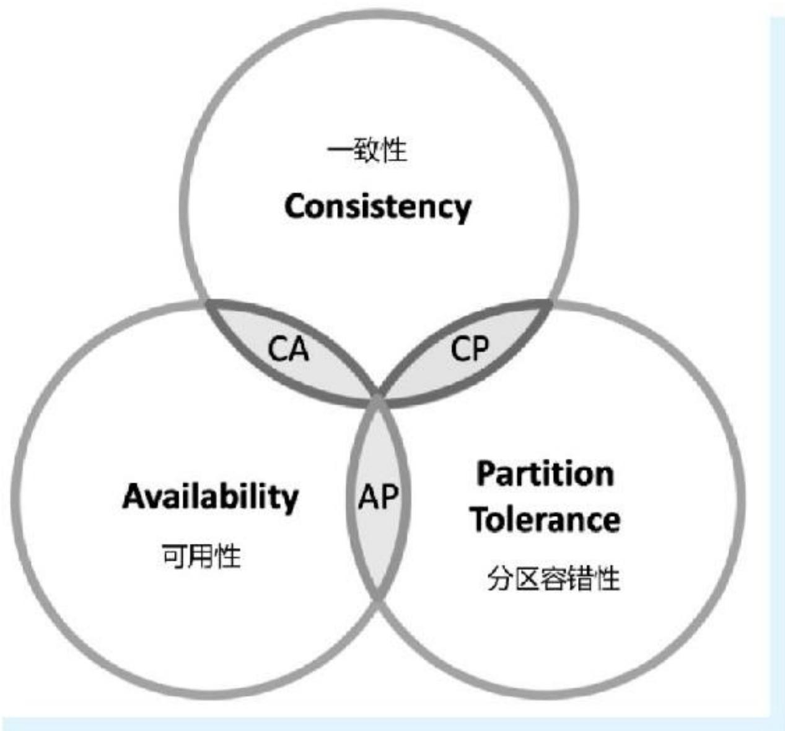
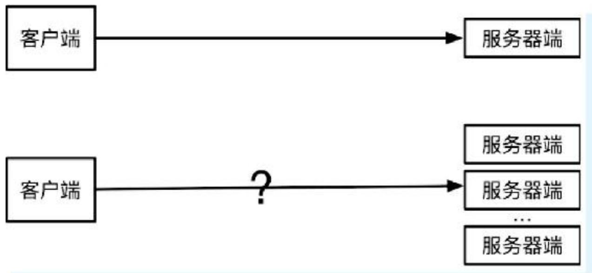
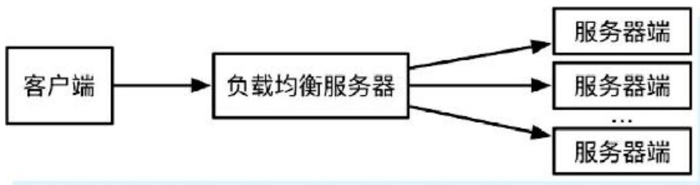
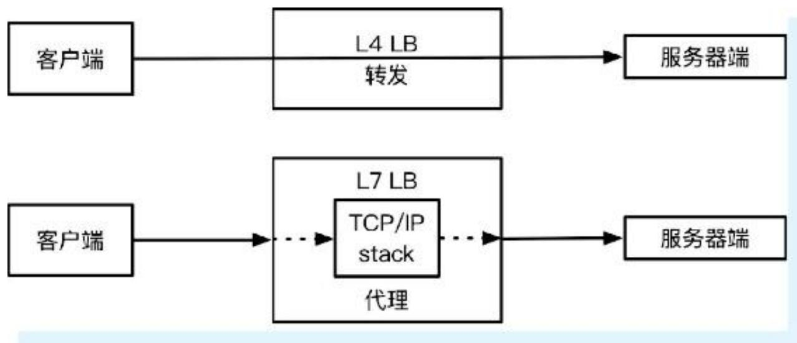
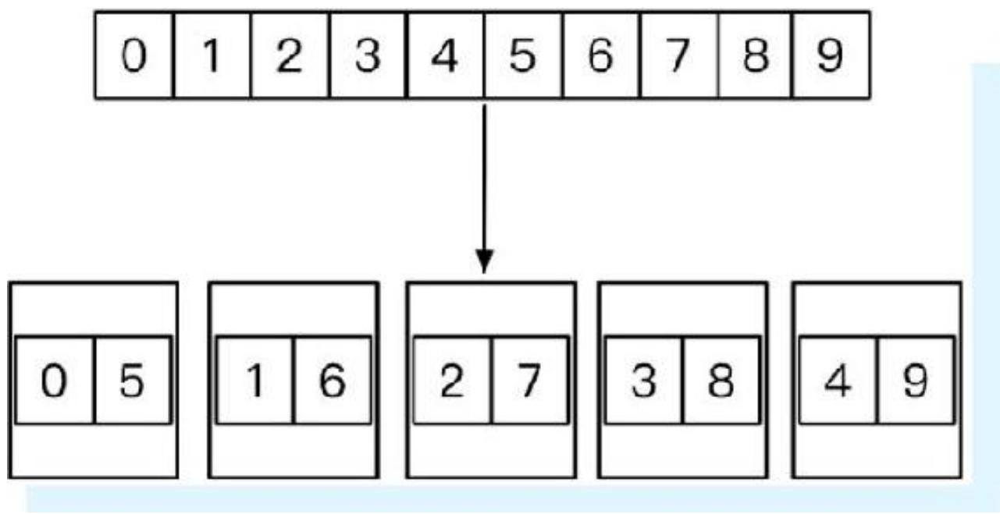
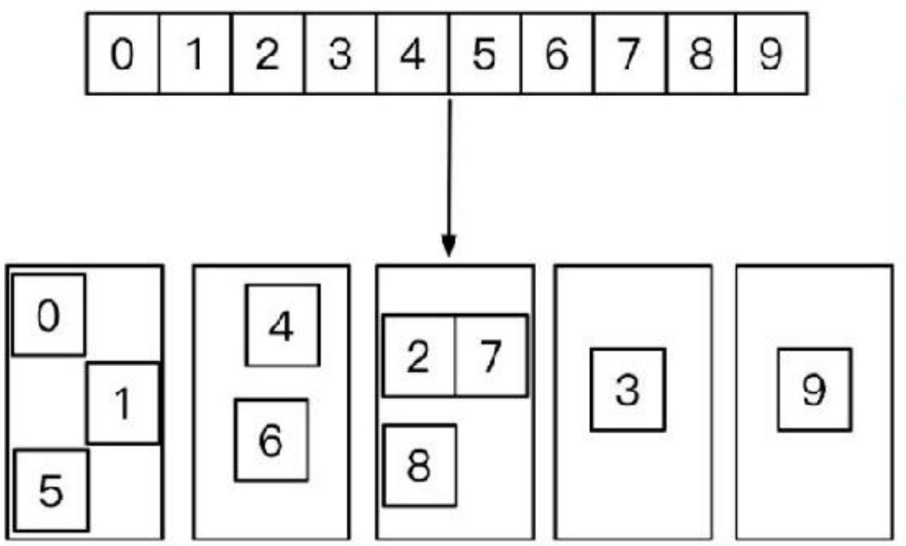
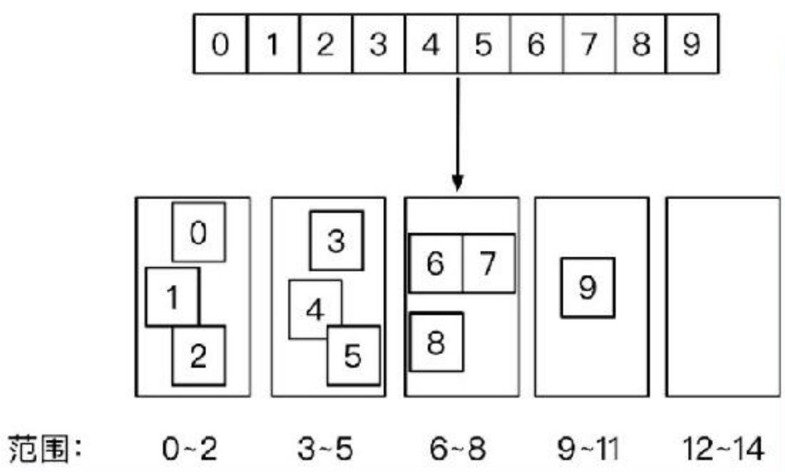
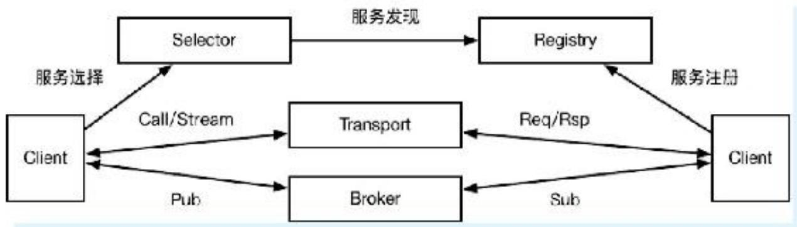
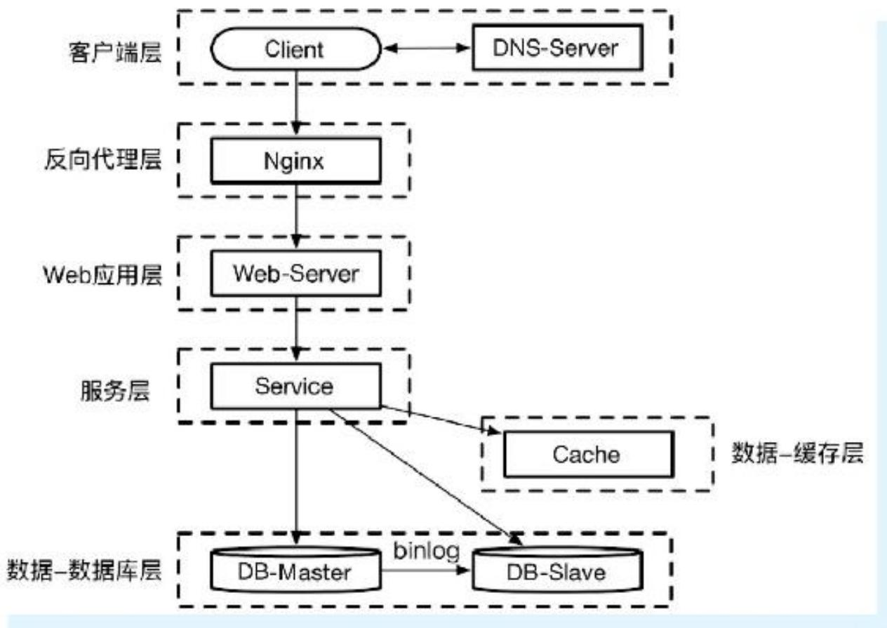

> 本文基于《Go语言高级开发与实战》第5章内容，系统讲解分布式系统的核心原理、常见算法、负载均衡技术、分布式锁实现，以及Go语言中的分布式应用和框架。涵盖CAP定理、Paxos/Raft共识算法、轮询/随机/一致性哈希负载均衡、基于MySQL/ZooKeeper/Redis/etcd的分布式锁、Snowflake分布式ID、Paxos的Go实现，以及Go Micro和Consul框架。通过大量代码示例，帮助读者掌握分布式系统的设计与实践。

## 一、分布式系统原理

### 1.1 什么是分布式系统

**分布式系统**是由一组通过网络通信、为了完成共同任务而协调工作的计算机节点组成的系统。目的是用廉价的普通机器完成单机无法完成的计算、存储任务。

**核心思想**：分而治之——分片（Partition）。对于计算，每个节点计算一部分，最终汇总（MapReduce思想）；对于存储，数据分散存储在不同节点。

**分片与复制集**：

- **分片**：提升性能和并发，提升可用性
- **复制集（Replication）**：多个节点负责同一任务，增强可用性与可靠性



### 1.2 CAP定理

CAP定理由Eric Brewer提出，后由Gilbert和Lynch证明。分布式系统最多只能同时满足以下两项：

- **一致性（Consistency）**：所有节点访问同一份最新的数据副本
- **可用性（Availability）**：每次请求都能获取非错响应（不保证最新）
- **分区容错性（Partition Tolerance）**：系统在时限内无法达成一致性时，必须选择C或A



**FLP不可能原理**：在网络可靠但允许节点失效的最小化异步模型系统中，不存在解决一致性问题的确定性共识算法。

### 1.3 分布式系统的挑战

1. **异构的机器与网络**：配置、语言、带宽、延迟各不相同
2. **普遍的节点故障**：节点越多，故障概率越高
3. **网络通信问题**：分割、延时、丢包、乱序，不确定性高

**处理原则**：在设计流程时，思考每一步发生异常时的处理方式及影响。

### 1.4 分布式系统特性与衡量标准

- **透明性**：用户感知不到是分布式系统
- **可扩展性**：通过增加机器应对数据增长，动态伸缩
- **可用性与可靠性**：7×24小时服务，计算结果正确、数据不丢失
- **高性能**：高并发、低延迟
- **一致性**：强一致性 vs 最终一致性

### 1.5 分布式系统的常用组件

- **负载均衡（LB）**：多节点提供同质服务时，选择具体节点
- **分布式缓存**：加速读取
- **RPC**：远程过程调用，屏蔽网络细节
- **分布式事务**：保证多个操作的原子性
- **服务注册与发现**：协调中心（ZooKeeper等）
- **消息队列**：解耦、异步、削峰
- **分布式计算平台**：Hadoop、Storm
- **分布式存储**：NoSQL、分库分表

### 1.6 常见一致性算法

#### Paxos算法

- 1990年由Leslie Lamport提出
- 基于消息传递的高度容错共识算法
- 解决在异常（进程慢、被杀、重启、消息延迟、丢失、重复）情况下如何就某个值达成一致
- 角色：提案者（Proposer）、接受者（Acceptor）、学习者（Learner）
- 两阶段提交：第一阶段确定编号最高的提案者，第二阶段提交提案

#### Raft协议

- 目标：替代Paxos，更易理解
- 特性：
  - **强领导者**：日志条目只从领导者发送给其他服务器
  - **领导选举**：使用随机计时器
  - **成员关系调整**：共同一致方法处理集群成员变换

## 二、负载均衡简介

### 2.1 什么是负载均衡

**负载均衡**：在多个计算机、网络连接、CPU等资源中分配负载，优化资源使用、最大化吞吐率、最小化响应时间、避免过载。

**早期方案**：DNS负载均衡（存在问题：延迟、缓存、策略简单）

**现代方案**：

- **4层负载均衡**（传输层）：修改数据包地址信息转发，如LVS
- **7层负载均衡**（应用层）：代理模式，解析应用层流量，如Nginx







### 2.2 常见负载均衡技术

1. **基于DNS的负载均衡**：域名解析到多个IP
2. **反向代理负载均衡**：如Apache+JK2+Tomcat
3. **基于NAT的负载均衡**：如LVS

## 三、常见负载均衡算法

### 3.1 轮询调度算法（Round Robin）

**原理**：将请求轮流分配给内部服务器，从1到N，再重新开始。无状态调度。

**伪代码**：

```c
j = i;
do {
    j = (j + 1) mod n;
    i = j;
    return Si;
} while (j != i);
return NULL;
```

**Go实现**：

```go
type RoundRobinBalancer struct {
    m     sync.Mutex
    next  int
    items []interface{}
}

func (b *RoundRobinBalancer) Pick() (interface{}, error) {
    if len(b.items) == 0 {
        return nil, ErrNoAvailableItem
    }
    b.m.Lock()
    r := b.items[b.next]
    b.next = (b.next + 1) % len(b.items)
    b.m.Unlock()
    return r, nil
}
```

**优点**：简单高效，易于水平扩展  
**缺点**：不考虑机器性能差异



### 3.2 随机算法（Random）

**原理**：从服务器列表中随机选取一台。样本量足够大时，效果趋近于轮询。

**Go实现**：

```go
type RandomBalance struct {
    m        sync.Mutex
    curIndex int
    rss      []string
}

func (r *RandomBalance) Next() string {
    if len(r.rss) == 0 {
        return ""
    }
    r.m.Lock()
    r.curIndex = rand.Intn(len(r.rss))
    r.m.Unlock()
    return r.rss[r.curIndex]
}
```



### 3.3 一致性哈希算法（Consistent Hashing）

**原理**：根据请求来源地址计算哈希值，对服务器列表大小取余，同一源地址映射到同一服务器。

**优点**：相同地址落在同一节点，可人为干预  
**缺点**：节点故障导致该节点上的客户端无法使用；热点用户导致冷热不均

**Go实现**（使用groupcache库）：

```go
hash := consistenthash.New(4, nil) // 4个虚拟节点
hash.Add("10.0.0.1:8080", "10.0.0.1:8081", "10.0.0.1:8082", "10.0.0.1:8083")
node := hash.Get("10.0.0.1")
fmt.Println(node)
```

### 3.4 键值范围算法

**原理**：根据键值的范围分配节点，如0-10万→节点1，10万-20万→节点2。

**优点**：容易水平扩展，增加节点不影响旧数据  
**缺点**：负载不均衡（新用户活跃度高）、单点故障


## 四、分布式锁

### 4.1 分布式锁简介

分布式锁用于分布式应用各节点对共享资源的排他式访问。单机并发中使用锁（如sync.Mutex）保证数据一致性，分布式场景下需要跨节点的锁。

**单机无锁问题示例**：

```go
var count int
for i := 0; i < 500; i++ {
    go func() { count++ }()
}
// 结果不确定，如481、489
```

**加锁解决**：

```go
var lock sync.Mutex
lock.Lock()
count++
lock.Unlock()
// 结果稳定为500
```

### 4.2 基于MySQL实现分布式锁

#### 方式一：锁表（唯一索引）

创建表`methodLock`，对`method_name`加唯一索引。获取锁时INSERT，释放锁时DELETE。

**问题**：

- 数据库单点故障
- 无失效时间，解锁失败导致死锁
- 非阻塞
- 非重入

**改进**：双库同步、定时清理、while循环重试、记录主机/线程信息支持重入。

#### 方式二：排他锁（SELECT FOR UPDATE）

```go
tx, err := db.Begin()
_, err = tx.Exec("SELECT * FROM methodLock WHERE method_name = ? FOR UPDATE", methodName)
// 业务逻辑
tx.Commit() // 释放锁
```

**优点**：阻塞等待、服务宕机自动释放  
**缺点**：仍存在单点问题；MySQL可能使用表锁而非行锁（小表或优化器选择全表扫描）

### 4.3 基于ZooKeeper实现分布式锁

**原理**：利用ZooKeeper的临时顺序节点。同一目录下只能有一个唯一文件名，创建临时顺序节点，序号最小的获得锁。

**步骤**：

1. 创建目录（如`/mylock`）
2. 线程A创建临时顺序节点
3. 获取所有子节点，判断自己是否最小，是则获得锁
4. 线程B判断自己不是最小，监听比自己小的节点
5. 线程A删除节点，线程B收到通知，判断自己成为最小，获得锁

**Go实现**（使用`go-zookeeper`）：

```go
c, _ := zk.Connect([]string{"127.0.0.1"}, time.Second)
lock := zk.NewLock(c, "/lock", zk.WorldACL(zk.PermAll))
err := lock.Lock()
// 业务逻辑
lock.Unlock()
```

**优点**：高可用、可重入、阻塞、避免死锁  
**缺点**：性能不如Redis，适合粗粒度锁（锁占用时间长）

### 4.4 基于Redis实现分布式锁

#### 方式一：SETNX + DELETE（有问题）

```bash
SETNX lock_key random_value
# 业务逻辑
DELETE lock_key
```

**问题**：获取锁后服务故障，死锁。

#### 方式二：SETNX + SETEX（非原子，仍有死锁风险）

```bash
SETNX lock_key random_value
SETEX lock_key 5 random_value
```

**问题**：SETNX和SETEX之间故障，死锁。

#### 方式三：SET NX PX（推荐，原子操作）

```bash
SET lock_key random_value NX PX 5000
# 业务逻辑
DELETE lock_key
```

**问题**：锁被错误释放或抢占时无法感知。

#### 方式四：SET NX PX + Lua脚本释放（最严谨）

```lua
-- 释放锁时检查value是否为自己加的
if redis.call('get', KEYS[1]) == ARGV[1] then
    return redis.call('del', KEYS[1])
else
    return 0
end
```

**Go完整实现**：

```go
func getLock(redisAddr, lockKey string, ex, retry int) error {
    conn, _ := redis.DialTimeout("tcp", redisAddr, time.Minute, time.Minute, time.Minute)
    defer conn.Close()
    ts := time.Now()
    for i := 1; i <= retry; i++ {
        if i > 1 {
            time.Sleep(time.Second)
        }
        v, err := conn.Do("SET", lockKey, ts, "EX", ex, "NX")
        if err == nil && v != nil {
            // 获取锁成功
            return nil
        }
    }
    return fmt.Errorf("get lock failed with max retry times")
}

func unlock(redisAddr, lockKey string) error {
    conn, _ := redis.DialTimeout("tcp", redisAddr, time.Minute, time.Minute, time.Minute)
    defer conn.Close()
    _, err := conn.Do("DEL", lockKey)
    return err
}
```

**注意事项**：

- 超时时间不能太短（任务未完成锁释放）也不能太长（死锁后长时间等待）
- 建议根据任务内容合理设置，或使用定期续租

### 4.5 基于etcd实现分布式锁

**原理**：利用etcd的租约（Lease）和事务（Txn）。创建key时使用租约，只有创建成功的节点获得锁。

**Go实现**：

```go
type EtcdMutex struct {
    Ttl    int64
    Conf   clientv3.Config
    key    string
    cancel context.CancelFunc
    lease  clientv3.Lease
    leaseID clientv3.LeaseID
    txn    clientv3.Txn
}

func (em *EtcdMutex) Lock() error {
    // 初始化、创建租约、保持心跳
    // 事务：如果key不存在则创建
    em.txn.If(clientv3.Compare(clientv3.CreateRevision(em.key), "=", 0)).
        Then(clientv3.OpPut(em.key, "", clientv3.WithLease(em.leaseID))).
        Else()
    _, err := em.txn.Commit()
    return err
}

func (em *EtcdMutex) Unlock() {
    em.cancel()
    em.lease.Revoke(context.TODO(), em.leaseID)
}
```

**优点**：强一致性、可靠性高  
**缺点**：吞吐量较低、延迟较高、无法通过增加节点提升性能

### 4.6 分布式锁的选择

| 实现方式 | 功能要求 | 实现难度 | 学习成本 | 运维成本 |
|---------|---------|---------|---------|---------|
| MySQL表锁/行锁 | 基本满足 | 不难 | 熟悉 | 一般，大量影响业务 |
| ZooKeeper | 满足要求 | 需熟悉API | 需要学习 | 较高，需堆机器 |
| Redis SET NX EX | 基本满足 | 不难 | 熟悉 | 一般，扩容方便 |
| etcd | 满足要求 | 较易 | 熟悉 | 较高，不能增加节点提高性能 |

**建议**：

- 单机阶段：使用单机锁
- 小规模分布式：任意方案均可，尽量不引入新技术栈
- 对数据可靠性要求极高：使用etcd或ZooKeeper
- 注意：etcd和ZooKeeper集群无法通过增加节点提高性能，需搭建多个集群分片

## 五、Go实现常见的分布式应用

### 5.1 Snowflake分布式ID生成器

**Snowflake算法**（Twitter设计）：生成64位int类型ID，组成：

- 1位符号位（0）
- 41位时间戳（毫秒级，可用69年）
- 5位数据中心ID（datacenterId）
- 5位工作节点ID（workerId）
- 12位序列号（每毫秒4096个ID）


**Go实现**（使用`snowflake`包）：

```go
s, _ := snowflake.NewSnowflake(int64(1), int64(1))
val := s.NextVal()
fmt.Println(val)
```

**注意**：多实例环境下，确保每个实例的(datacenterId, workerId)唯一。

### 5.2 Go语言实现Paxos一致性算法

**Paxos角色**：

- 提案者（Proposer）：提出提案
- 接受者（Acceptor）：投票
- 学习者（Learner）：获取批准结果

**两阶段**：

1. **Prepare阶段**：确定编号最高的提案者
2. **Accept阶段**：编号最高者提交提案，若无更高编号则通过

**Go实现核心代码**：

**Prepare阶段**：

```go
func (px *Paxos) Prepare(args *PrepareArgs, reply *PrepareReply) error {
    px.mu.Lock()
    defer px.mu.Unlock()
    round, exist := px.rounds[args.Seq]
    if !exist {
        px.rounds[args.Seq] = px.newInstance()
        round, _ = px.rounds[args.Seq]
        reply.Err = OK
    } else {
        if args.PNum > round.proposeNumber {
            reply.Err = OK
        } else {
            reply.Err = Reject
        }
    }
    if reply.Err == OK {
        reply.AcceptPnum = round.acceptPnum
        reply.AcceptValue = round.acceptValue
        px.rounds[args.Seq].proposeNumber = args.PNum
    }
    return nil
}
```

**Accept阶段**：

```go
func (px *Paxos) Accept(args *AcceptArgs, reply *AcceptReply) error {
    px.mu.Lock()
    defer px.mu.Unlock()
    round, exist := px.rounds[args.Seq]
    if !exist {
        px.rounds[args.Seq] = px.newInstance()
        reply.Err = OK
    } else {
        if args.PNum >= round.proposeNumber {
            reply.Err = OK
        } else {
            reply.Err = Reject
        }
    }
    if reply.Err == OK {
        px.rounds[args.Seq].acceptorNumber = args.PNum
        px.rounds[args.Seq].proposeNumber = args.PNum
        px.rounds[args.Seq].acceptValue = args.Value
    }
    return nil
}
```

**Decide阶段**：提案者确定某个值，映射到状态机。

## 六、Go语言常见分布式框架

### 6.1 Go Micro框架

**设计理念**：可插拔的插件化架构，提供底层接口定义和基础工具，默认组件可替换。

**核心接口**（8个）：

| 接口 | 作用 | 默认实现 | 可替换为 |
|------|------|---------|---------|
| Service | 构建服务的主组件 | - | - |
| Client | 请求服务 | RPC | HTTP、gRPC |
| Server | 监听服务调用 | RPC | HTTP、gRPC |
| Broker | 消息发布/订阅 | HTTP | Kafka、RabbitMQ、NSQ |
| Codec | 编码/解码 | protobuf | JSON、BSON、Mercury |
| Registry | 服务注册/发现 | Consul | etcd、ZooKeeper、K8s |
| Selector | 客户端负载均衡 | 随机算法 | 轮询、标签、黑名单 |
| Transport | 服务间通信 | HTTP | TCP、UDP、NATS、gRPC |





**安装**：

```bash
go get -u github.com/asim/go-micro
```

**Hello World示例**：

```go
type Greeter struct{}

func (g *Greeter) Hello(ctx context.Context, req *pb.Request, rsp *pb.Response) error {
    rsp.Greeting = "Hello " + req.Name
    return nil
}

func main() {
    service := micro.NewService(micro.Name("helloworld"))
    service.Init()
    pb.RegisterGreeterHandler(service.Server(), new(Greeter))
    service.Run()
}
```

### 6.2 Consul框架

**Consul特性**：

- **服务发现**：通过DNS或HTTP发现服务提供者
- **健康检查**：任意数量的检查（服务状态、节点状态）
- **Key/Value存储**：动态配置、功能标记、协调
- **多数据中心**：开箱即用

**架构**：每个节点运行Consul Agent，Agent与Consul Server交互。每个数据中心建议3~5台服务器集群。

**安装**（macOS）：

```bash
brew install consul
```

## 七、回顾与启示

本章系统学习了：

- 分布式系统原理（CAP定理、FLP不可能原理、挑战、特性）
- 负载均衡技术（4层/7层、DNS、反向代理、NAT）
- 负载均衡算法（轮询、随机、一致性哈希、键值范围）
- 分布式锁（MySQL、ZooKeeper、Redis、etcd实现及对比）
- Snowflake分布式ID生成器
- Paxos一致性算法的Go实现
- Go Micro和Consul框架

掌握这些知识，能够设计、实现和运维高可用、可扩展的分布式系统。
