> 本文基于《Go语言高级开发与实战》第6章内容，完整呈现一个高并发秒杀系统的设计与实现。涵盖高并发系统架构原则、秒杀业务特点与难点、前端静态化与限流、代理层Nginx负载均衡与令牌桶限流、应用层库存扣减与防超卖、Redis预减库存与Lua原子操作、数据库层隔离，以及压力测试全流程。通过可运行的Go代码，帮助读者掌握构建秒杀系统的核心技能。

## 一、秒杀系统简介

### 1.1 高并发系统基础

**什么是高并发**：通过设计保证系统能够同时并行处理很多请求。常用指标：

| 指标 | 说明 |
|------|------|
| 响应时间 | 系统对请求做出响应的时间（如200ms） |
| 吞吐量 | 单位时间内处理的请求数量 |
| QPS（每秒查询率） | 每秒响应请求数 |
| 并发用户数 | 同时承载正常使用系统的用户数量 |

**提升并发能力的方式**：

- **垂直扩展（Scale Up）**：增强单机硬件性能（CPU、内存、SSD、万兆网卡）或提升单机架构性能（Cache、异步、无锁数据结构）
- **水平扩展（Scale Out）**：增加服务器数量，线性扩充性能（终极解决方案）

### 1.2 互联网分层架构

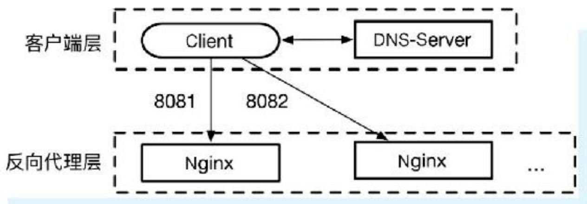

1. **客户端层**：浏览器/APP
2. **反向代理层**：Nginx
3. **Web应用层**：Go/Java/Python
4. **服务层**：RPC服务化
5. **数据-缓存层**：Redis
6. **数据-数据库层**：MySQL/Oracle

### 1.3 分层水平扩展实践

**反向代理层**：通过DNS轮询实现水平扩展  
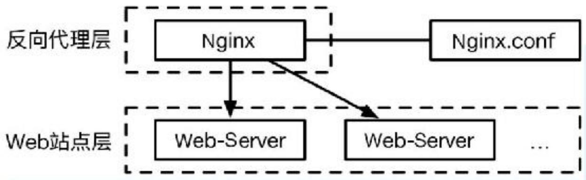

**站点层**：通过Nginx配置多个Web后端实现水平扩展  
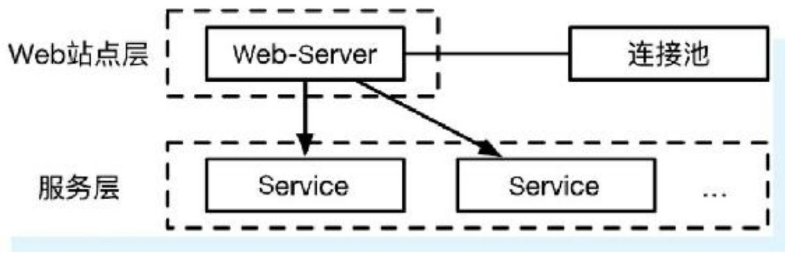

**服务层**：通过RPC-client连接池实现水平扩展  
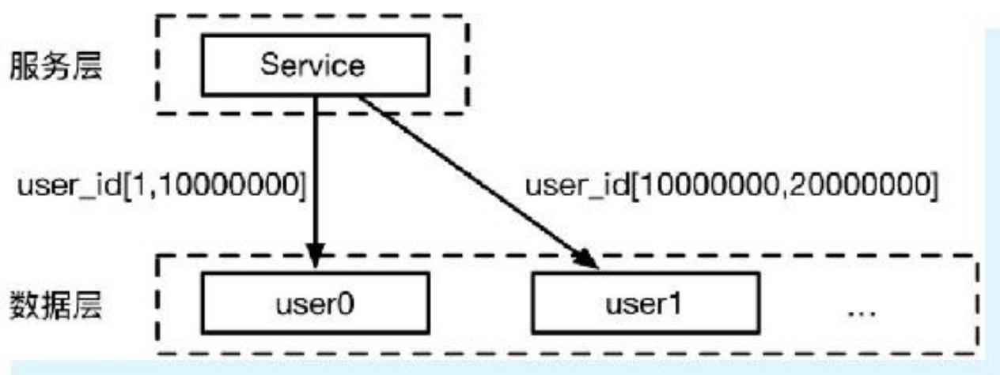

**数据层**：范围水平拆分（如user_id 1~10000000 → user0库）  
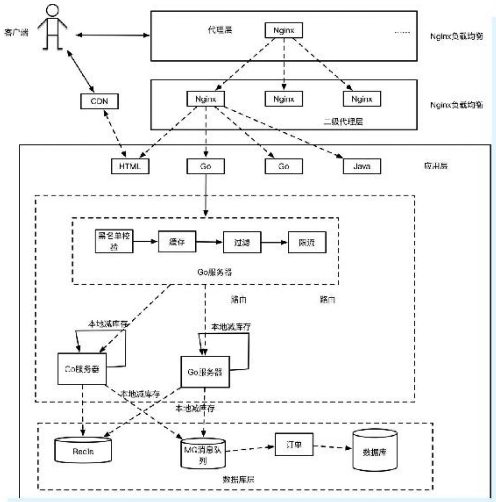

### 1.4 秒杀业务特点与难点

**业务特点**：

- 定时开始：瞬时流量激增
- 库存有限：只有少部分用户成功
- 操作可靠：不能超卖

**常见场景**：

1. 预抢购业务（活动预约、定金预约）
2. 分批抢购（分时段多场次）
3. 实时秒杀（618、双11）

**核心难点**：

- 短时间内高并发，系统负载压力大
- 竞争资源有限，数据库锁冲突严重
- 避免对其他业务的影响

## 二、秒杀系统架构

### 2.1 架构原则

1. **尽量将请求拦截在上游**：保护底层数据库
2. **充分利用缓存**：Redis承载读压力
3. **热点隔离**：
   - 业务隔离：单独项目，提前“热场”
   - 技术隔离：前端CDN缓存、接入层限流、应用层集群+队列+分布式锁
   - 数据库隔离：独立库/表，秒杀结束后同步

### 2.2 整体架构简图

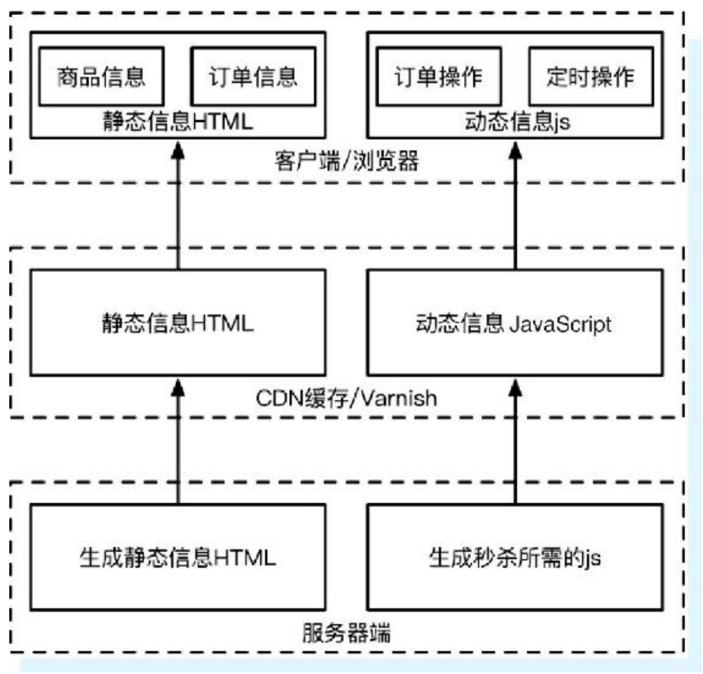

**核心流程**：

1. 客户端访问CDN托管的静态HTML/JS
2. Nginx负载均衡分流
3. 单机限流 + Redis原子扣减库存
4. 异步生成订单

## 三、HTML静态页面开发

### 3.1 秒杀页面设计

核心HTML模板（部分）：

```html
<div class="right fr">
    <div class="n3 ml20 mt20">{{.product.Title}}</div>
    <div class="jianjie mr40 ml20 mt10">{{.product.SubTitle}}</div>
    <div class="jiage ml20 mt10">
        现价: {{.product.Price}}元
        <span class="old price">原价: {{.product.ProductPrice}}元</span>
    </div>
</div>
<div class="xiadan ml20 mt10">
    <input class="addToCart" type="button" name="addToCart" id="addCart" value="立即抢购"/>
</div>
```

### 3.2 页面优化技巧

1. **按钮单击控制**：禁止重复提交
2. **频率限制**：一定时间内只能提交一次
3. **秒杀URL动态化**：MD5加密随机字符，后台校验

**JavaScript限频示例**：

```javascript
var times = 0;
function checkTime(btn) {
    if (times < 10) {
        ++times;
    } else {
        btn.disabled = true;
        console.log("You clicked too much!");
        setTimeout(function() { times = 0; }, 8640000);
    }
}
```

### 3.3 页面静态化

- 将商品描述、参数、成交记录、图像、评价写入静态HTML
- 用户请求不经过后端服务器，直接从CDN获取
- 秒杀开始前才由系统动态下发下单URL（时间戳+Hash）
- 控制下单的JavaScript也从CDN获取

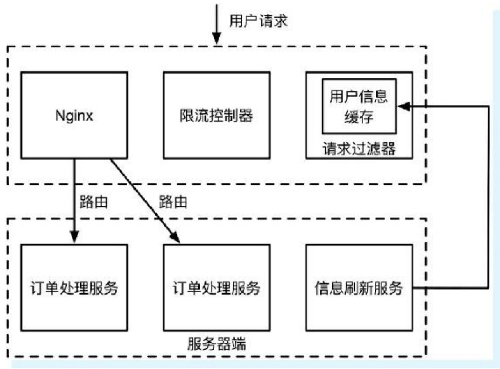

### 3.4 客户端限流

**重复请求限制**：通过Redis的EXPIRE实现

- 每个请求从Redis获取key（如userId）
- 若值为空则放行，并设置EXPIRE 10秒
- 若非空则丢弃

## 四、服务端开发

### 4.1 代理层设计

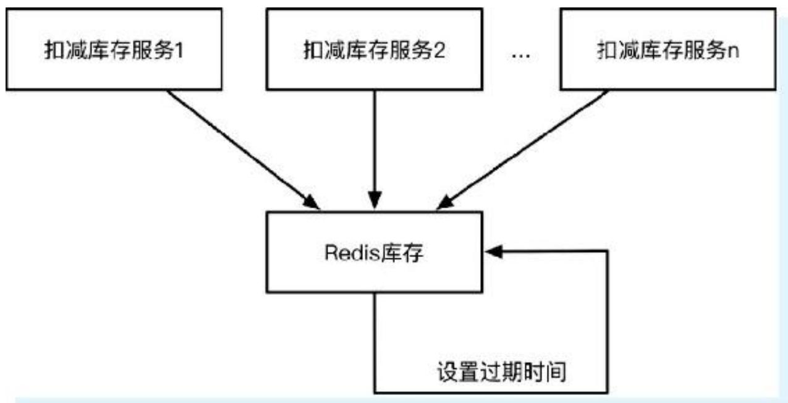

#### 1. 缓存

代理层缓存用户信息、商品信息等变化不频繁的数据。

#### 2. 过滤

- 根据风控系统过滤恶意IP、高频请求
- 识别秒杀参数，路由到专用服务器集群

#### 3. 限流（令牌桶算法）

**令牌桶概念**：

- 令牌（Token）：每次请求需拿到令牌才能继续
- 桶：固定容量
- 入桶频率：固定速率放入令牌

**Go语言实现**：使用 `golang.org/x/time/rate` 包

```go
type Limiter struct {
    mu        sync.Mutex
    limit     Limit   // 放入桶的频率
    burst     int     // 桶的大小
    tokens    float64 // 当前剩余令牌数
    last      time.Time
    lastEvent time.Time
}
```

**使用示例**：

```go
func main() {
    r := rate.Every(1 * time.Millisecond)
    limiter := rate.NewLimiter(r, 10) // 每毫秒放1个，桶容量10
    http.HandleFunc("/", func(w http.ResponseWriter, r *http.Request) {
        if limiter.Allow() {
            fmt.Printf("请求成功,时间:%s\n", time.Now().Format("2006-01-02 15:04:05"))
        } else {
            fmt.Printf("请求被限流\n")
        }
    })
    http.ListenAndServe(":8081", nil)
}
```

**压力测试结果**：前面的请求成功，后续因令牌不足被限流。

### 4.2 应用层实现

#### 1. 防止超卖的方法

**方法一：精简SQL（乐观锁）**

```sql
UPDATE seckill_product SET stock = stock - 1 
WHERE goods_id = ? AND version = ? AND stock > 0;
```

**方法二：Redis预减库存**

- 秒杀开始前在Redis中预设库存常量
- 每次下单先获取Redis中的库存值，判断后原子减1
- 取消订单时增加库存（需Lua脚本保证原子性）

**方法三：分布式锁（Redis SET NX EX）**

- 多个服务同时访问Redis库存时，使用锁保证互斥
- 设置资源超时时间 + 服务获取锁超时时间

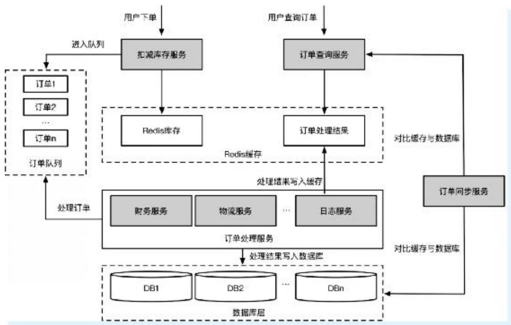

#### 2. 优化订单处理流程

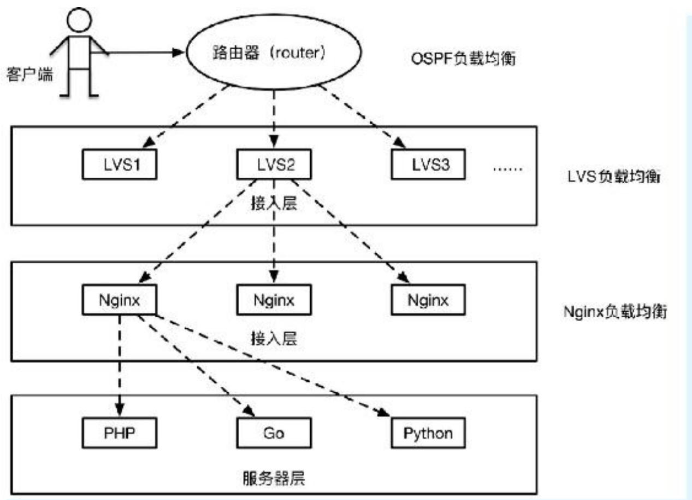

**核心思路**：

- 扣减库存服务作为入口，先扣Redis库存
- 使用队列存放订单请求，平滑流量
- 订单处理服务监听队列，异步处理并写入数据库
- 结果先写入缓存，用户查询缓存获取状态
- 订单同步服务对比缓存和数据库，保证最终一致性

#### 3. 大型高并发负载均衡架构

**代理式负载均衡（Proxy Model）**：

- 有独立的负载均衡设备（F5/LVS/HAproxy）
- 服务地址映射表由运维配置
- 健康检查自动摘除不健康实例

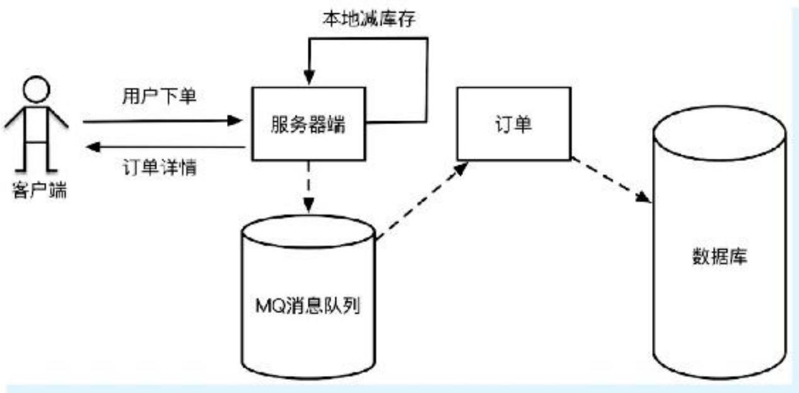

- **第一层 OSPF**：内部网关协议，自动计算Cost，最多6条链路负载均衡
- **第二层 LVS**：IP负载均衡，高吞吐率
- **第三层 Nginx**：HTTP代理/反向代理，支持轮询、加权轮询、IP Hash

**Nginx加权轮询配置**：

```nginx
upstream load_rule {
    server 127.0.0.1:8081 weight=3;
    server 127.0.0.1:8082 weight=2;
    server 127.0.0.1:8083 weight=1;
}
server {
    listen 80;
    server_name www.yourdomain.com;
    location / {
        proxy_pass http://load_rule;
    }
}
```

**测试结果**：8081、8082、8083分别收到300、200、100请求，与权重比吻合。

**其他负载均衡方案**：

- **平衡感知客户端**：负载均衡集成在客户端进程，直接调用，无额外开销，但多语言栈维护成本高
- **外部负载均衡服务**：负载均衡独立为主机进程，简化调用方，但部署复杂

#### 4. 秒杀抢购系统选型

**三种库存扣减时机对比**：

| 方案 | 优点 | 缺点 |
|------|------|------|
| 下单减库存 | 不超卖 | 创建订单频繁写数据库，性能差；恶意下单只下单不支付 |
| 支付减库存 | 不少卖 | 超卖风险大，用户抢到订单但支付时无库存 |
| 预扣库存（推荐） | 快速响应，不超卖 | 需处理订单过期释放库存 |

**预扣库存方案**：先扣库存（Redis）→ 异步生成订单（MQ）→ 订单有效期控制 → 过期释放库存

#### 5. 高并发下扣库存的优化

**单机优化**：本地内存扣库存（避免数据库I/O）

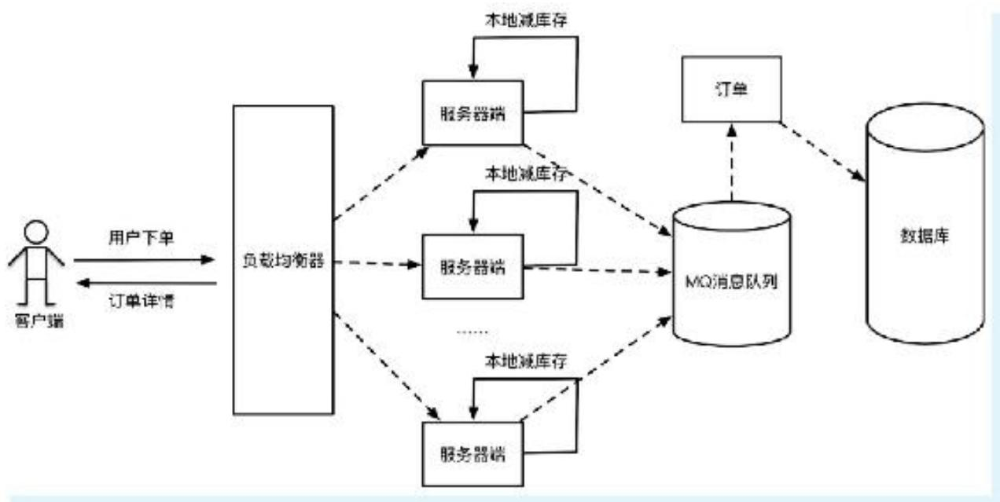

**集群方案**：

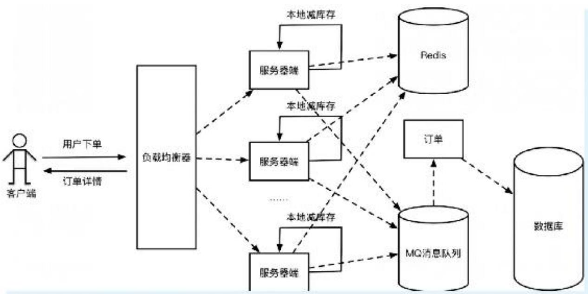

- 100万请求通过Nginx均衡到100台服务器，每台1万请求
- 每台本地库存100件，总库存1万
- 问题：部分机器宕机会导致少卖

**容错方案**：本地库存 + 统一Redis库存 + Buffer

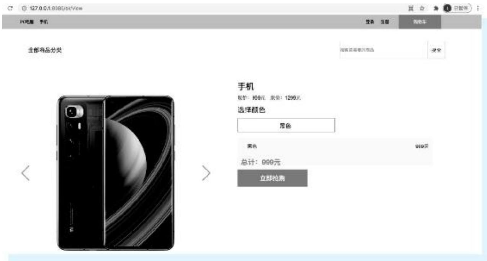

- 每台机器分配本地库存 + Buffer剩余库存
- 本地扣减成功后，再请求Redis统一扣减
- 两者都成功才返回抢购成功
- Buffer值需根据负载能力设定，兼顾Redis压力

#### 6. Go语言核心代码实现

**初始化**：

```go
package main

import (
    "github.com/garyburd/redigo/redis"
    "gitee.com/shirdonl/goAdvanced/chapter7/secondKill/cache"
)

var (
    localCache  cache.LocalCache
    remoteCache cache.RemoteCacheKeys
    redisPool   *redis.Pool
    done        chan int
)

func init() {
    localCache = cache.LocalCache{
        LocalInStock:     150,
        LocalSalesVolume: 0,
    }
    remoteCache = cache.RemoteCacheKeys{
        SpikeOrderHashKey:   "goods_hash_key",
        TotalInventoryKey:   "goods_total_number",
        QuantityOfOrderKey:  "goods_sold_number",
    }
    redisPool = cache.NewPool()
    done = make(chan int, 1)
    done <- 1
}
```

**本地扣库存**：

```go
package cache

type LocalCache struct {
    LocalInStock     int64
    LocalSalesVolume int64
}

func (cache *LocalCache) LocalDeductionStock() bool {
    cache.LocalSalesVolume = cache.LocalSalesVolume + 1
    return cache.LocalSalesVolume <= cache.LocalInStock
}
```

**远程Redis扣库存（Lua脚本原子操作）**：

```go
const LuaScript = `
    local goods_key = KEYS[1]
    local goods_total_key = ARGV[1]
    local goods_sold_key = ARGV[2]
    local goods_total_number = tonumber(redis.call('HGET', goods_key, goods_total_key))
    local goods_sold_number = tonumber(redis.call('HGET', goods_key, goods_sold_key))
    if (goods_total_number >= goods_sold_number) then
        return redis.call('HINCRBY', goods_key, goods_sold_key, 1)
    end
    return 0
`

func (r *RemoteCacheKeys) DeductStock(conn redis.Conn) bool {
    lua := redis.NewScript(1, LuaScript)
    result, err := redis.Int(lua.Do(conn,
        r.SpikeOrderHashKey,
        r.TotalInventoryKey,
        r.QuantityOfOrderKey))
    if err != nil {
        return false
    }
    return result != 0
}
```

**初始化Redis库存**：

```bash
hmset goods_hash_key goods_total_number 1000 goods_sold_number 0
```

**HTTP处理器（使用通道避免竞态）**：

```go
func seckillController(w http.ResponseWriter, r *http.Request) {
    redisConn := redisPool.Get()
    defer redisConn.Close()
    
    <-done  // 获取通道锁
    if localCache.LocalDeductionStock() && remoteCache.DeductStock(redisConn) {
        util.ResponseJson(w, 1, "抢购成功", nil)
    } else {
        util.ResponseJson(w, -1, "已售罄", nil)
    }
    done <- 1  // 释放锁
}

func main() {
    http.HandleFunc("/seckill/goods/1", seckillController)
    http.HandleFunc("/sk/view", viewHandler)
    http.ListenAndServe(":8085", nil)
}
```

**运行页面**：

```bash
go run main.go
```

浏览器访问 `http://127.0.0.1:8085/sk/view`

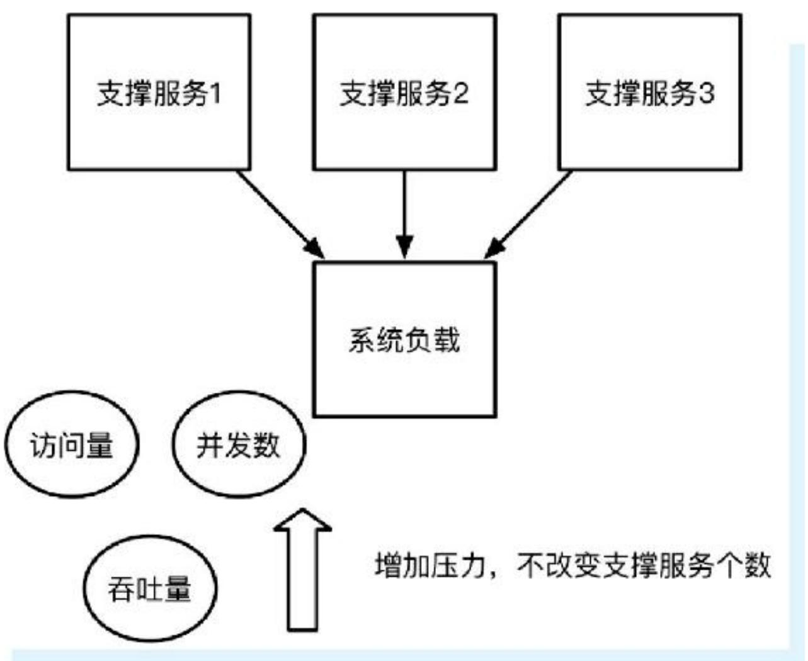

### 4.3 数据库层隔离

#### 1. 分表分库

- MySQL单表推荐存储量约500万条
- 超过阈值做分表
- 连接数过多做分库

#### 2. 数据隔离

- 使用专用表存放秒杀数据，不与业务系统共用
- 表设计除ID外尽量不设其他主键，保证快速插入

#### 3. 数据合并

- 秒杀结束后，将专用表数据合并到主业务系统
- 只读数据可导入读库或NoSQL

## 五、压力测试

### 5.1 什么是压力测试

目的：检验系统崩溃的边缘及极限，合理设置流量上限。

**测试方法**：

- **正压力测试**：逐步增加请求量，直到系统接近崩溃（做加法）
- **负压力测试**：逐步减少支撑资源，直到系统无法支撑（做减法）

**测试步骤**：

1. 确定测试目标
2. 确定关键功能（如下单、扣库存）
3. 确定负载（关注高负载服务）
4. 选择环境（与生产一致）
5. 确定监视点（CPU、内存、吞吐量）
6. 产生负载（使用真实或历史数据）
7. 执行测试
8. 分析数据

### 5.2 秒杀系统单机压力测试

使用Apache Bench（ab）工具：

```bash
ab -n 10000 -c 100 http://127.0.0.1:8085/seckill/goods/1
```

**结果摘要**：

```
Concurrency Level:      100
Time taken for tests:   1.575 seconds
Complete requests:      10000
Failed requests:        0
Requests per second:    6349.23 [#/sec] (mean)
Time per request:       15.750 [ms] (mean)
```

单机QPS约6300+，多核服务器可达1万+。日志记录显示库存扣减正常。

## 六、回顾与启示

**核心经验**：

1. **负载均衡，分而治之**：通过负载均衡将流量分发到多台机器，每台机器发挥极致性能
2. **合理使用并发和异步**：Go语言天然支持并发，HTTP请求每个在goroutine中执行；异步处理订单队列可显著提升吞吐量

**注意事项**：

- 订单有效期控制：用户30分钟内不支付，订单失效，库存补充
- Buffer库存设置：需根据系统负载能力权衡，既要容错又要避免压垮Redis
- 完整订单系统还需：订单进度查看、定时同步剩余库存、订单释放等

秒杀系统的本质是在高并发下保证数据一致性（不超卖、不少卖）的同时，最大化系统吞吐量。通过层层拦截（CDN → Nginx → 本地内存 → Redis → 数据库）、异步解耦、热点隔离，可以构建稳定可靠的秒杀服务。
