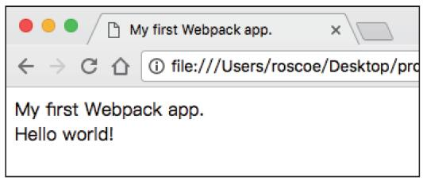
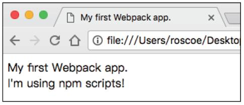
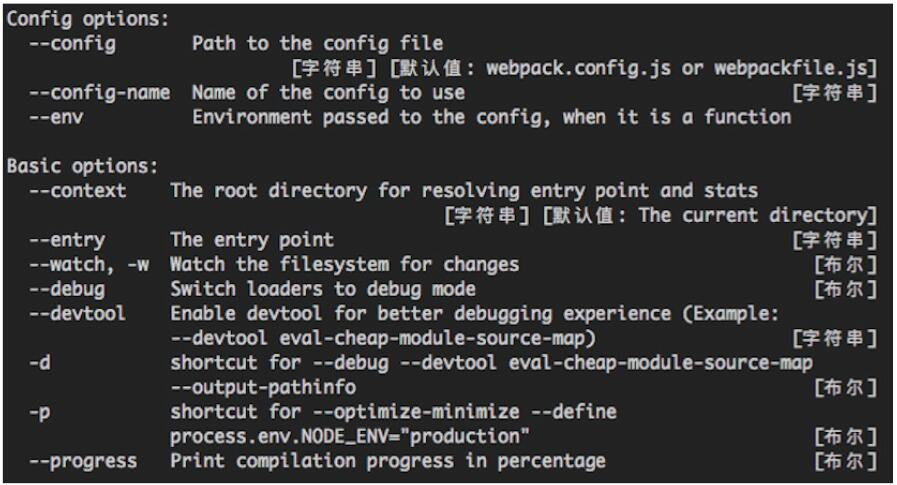
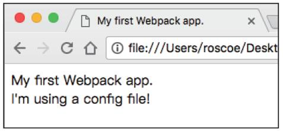
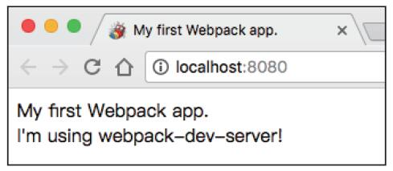

本文是Webpack系统学习的第一篇内容，聚焦Webpack的核心认知与快速上手实操，从“什么是Webpack”“为什么需要Webpack”讲起，逐步完成环境搭建、第一个打包案例、配置优化及本地开发服务搭建，帮助零基础读者快速建立Webpack的核心认知，掌握本地工程的基础配置与使用方法。

### 【本篇核心收获】

- 理解Webpack的核心定位、模块化解决的核心问题及相比同类工具的优势
- 掌握Webpack的本地安装方法（规避全局安装的坑点）
- 完成第一个Webpack打包案例，理解entry、output、mode核心配置的作用
- 学会用npm scripts简化打包命令，用webpack.config.js管理复杂配置
- 掌握webpack-dev-server的安装、配置与使用，理解其内存打包、自动刷新的核心特性

## 1. 核心认知：Webpack到底是什么？

### 1.1 何为Webpack

**Webpack是一个开源的JavaScript模块打包工具**，其最核心的功能是解决模块之间的依赖，把各个模块按照特定的规则和顺序组织在一起，最终合并为一个JS文件（有时会有多个，这里讨论的只是最基本的情况）。这个过程就叫作模块打包。

你可以把Webpack理解为一个模块处理工厂：将源代码交给Webpack，由它进行加工、拼装处理，产出最终的资源文件，等待送往用户。

没有接触过打包工具的读者可能会疑惑：Web开发打交道的无非是HTML、CSS、JS等静态资源，为什么不直接发布源文件，而要交给Webpack处理？这就要从使用Webpack的核心意义说起。

#### 模块小结

本模块明确了Webpack的核心定位——开源的JavaScript模块打包工具，核心功能是解决模块依赖并将模块合并为（通常）单个JS文件，可理解为处理源代码的“模块工厂”。

### 1.2 为什么需要Webpack

开发简单Web应用仅需浏览器和编辑器，但应用规模扩大后，人工维护代码的成本会急剧上升。“工欲善其事，必先利其器”，Webpack作为模块打包工具，其价值需从“模块”的本质说起。

#### 1.2.1 何为模块

我们每时每刻都在与模块打交道：引入日期处理的npm包、编写工具方法的JS文件，这些都可称为模块。

**模块化核心思想**：不把所有代码堆在一起，而是按功能拆分为多个代码段，每个代码段实现特定目的，可独立设计、开发、测试，最终通过接口组合。

若把程序比作城市，模块就像学校、医院、消防局等职能部门，各有特定功能，协同保障程序正常运转。

#### 1.2.2 JavaScript中的模块

多数编程语言（C、C++、Java）原生支持模块化，工程模块经编译、链接后整合为可执行文件；但JavaScript在很长一段时间里没有模块概念，只能通过script标签逐个插入页面。

这是因为JavaScript之父Brendan Eich最初仅将其定位为小型脚本语言，用于实现简单动态特性，未考虑复杂场景，模块化自然被忽略。

随着JavaScript应用场景复杂化，传统script引入方式的问题逐渐暴露，而模块化则完美解决了这些问题，具体对比如下：

| 问题类型                | 传统script引入的问题                                                                 | 模块化的解决方案                                                                 |
|-------------------------|--------------------------------------------------------------------------------------|----------------------------------------------------------------------------------|
| 依赖管理                | 手动维护加载顺序，依赖关系隐式，文件过多易出错                                       | 通过导入/导出语句清晰展示模块依赖关系                                             |
| 网络开销                | 每个script对应一次服务器请求，HTTP 2普及前连接成本高，拖慢网页渲染                     | 模块可打包为单个文件，减少请求次数，降低网络开销                                   |
| 作用域问题              | 顶层作用域为全局作用域，易造成全局作用域污染、命名冲突                               | 模块间作用域隔离，无命名冲突问题                                                 |

2009年起，JavaScript社区尝试了AMD、CommonJS、CMD等模块化方案（均为社区规范，非语言特性）；2015年，ES6正式定义了JavaScript模块标准，让这门语言终于拥有原生模块概念。

ES6模块虽已被多数现代浏览器支持，但实际应用仍有局限：

- 无法使用code splitting和tree shaking（Webpack核心特性）
- 多数npm模块为CommonJS形式，浏览器不支持
- 需考虑个别浏览器/平台的兼容性

因此，要让模块化工程正常运行在浏览器中，**模块打包工具**是必需的。

#### 1.2.3 模块打包工具

**模块打包工具（module bundler）** 的核心任务是解决模块依赖，使打包结果能运行在浏览器上，主要工作方式有两种：

1. 将有依赖的模块按规则合并为单个JS文件，一次性加载进页面
2. 初始加载入口模块，其他模块异步加载

目前社区主流的模块打包工具有Webpack、Parcel、Rollup等。

#### 1.2.4 为什么选择Webpack

对比同类工具，Webpack的核心优势如下：

| 优势点                  | 具体说明                                                                 |
|-------------------------|--------------------------------------------------------------------------|
| 多模块标准支持          | 默认支持AMD、CommonJS、ES6模块，可处理多标准混合的工程依赖                 |
| 完备的代码分割方案      | 可拆分打包资源，首屏仅加载必要部分，减小资源体积，提升首页渲染速度         |
| 多类型资源处理          | 可处理JS、样式、模板、图片等资源，仅需通过loader导入即可（第4章详解）     |
| 庞大的社区支持          | 丰富的插件和工具，绝大多数需求都有现成解决方案                           |

#### 模块小结

本模块从模块化的本质出发，分析了JavaScript模块化的发展历程与痛点，明确了模块打包工具的核心价值，并梳理了Webpack相比同类工具的四大核心优势。

## 2. 环境准备：安装Webpack

Webpack无操作系统限制（Windows/Mac/Linux均可），唯一依赖是Node.js，需按以下步骤完成安装。

### 2.1 安装Node.js

Webpack对Node.js版本有要求，**推荐使用LTS（长期维护）版本**：

- LTS版本稳定，无激进特性，经时间验证，适配生产环境
- 版本号及发布计划可查看：<https://github.com/nodejs/Release>
- 可从Node.js官网（<https://nodejs.org/）下载对应系统的LTS版本>

安装完成后，打开命令行执行以下命令验证：

```bash
node -v
```

若输出Node.js版本号，说明安装成功。

### 2.2 本地安装Webpack

Node.js的包管理器npm支持“全局安装”和“本地安装”两种方式，**推荐本地安装**，原因如下：

1. 全局安装易导致团队协作时版本不一致，输出结果偏差
2. 部分Webpack插件会调用项目本地的Webpack内部模块，全局+本地共存易混淆

本地安装步骤：

#### 步骤1：初始化工程

新建工程目录，进入目录后执行初始化命令：

```bash
npm init # 若使用yarn，执行 yarn init
```

按提示输入项目基本信息，完成后目录会生成`package.json`文件（记录项目名称、版本、仓库等信息）。

#### 步骤2：安装Webpack

执行以下命令安装Webpack核心包和命令行工具：

```bash
npm install webpack webpack-cli --save-dev
```

#### 步骤3：验证安装

执行以下命令查看版本号，验证安装成功：

```bash
npx webpack -v
npx webpack-cli -v
```

> **注意**：本地安装的Webpack无法直接用`webpack`指令，需通过`npx webpack <command>`执行，后续会介绍简化方法。


#### 模块小结

本模块完成了Webpack的环境准备，核心是安装Node.js（推荐LTS版本），并采用本地安装方式部署Webpack（规避版本不一致、插件调用混淆的问题），同时验证了安装结果。

## 3. 实操落地：打包第一个Webpack应用

接下来通过实操完成第一个Webpack打包案例，直观理解核心配置的作用。

### 3.1 基础案例：Hello World

#### 步骤1：创建工程文件

在工程目录下创建以下文件：

`index.js`：

```javascript
import addContent from './add-content.js';
document.write('My first Webpack app.<br />');
addContent();
```

`add-content.js`：

```javascript
export default function() {
    document.write('Hello world!');
}
```

`index.html`：

```html
<!DOCTYPE html>
<html lang="zh-CN">
<head>
    <meta charset="UTF-8">
    <title>My first Webpack app.</title>
</head>
<body>
    <script src="./dist/bundle.js"></script>
</body>
</html>
```

#### 步骤2：执行打包命令

在控制台输入以下命令：

```bash
npx webpack --entry=./index.js --output-filename=bundle.js --mode=development
```

#### 步骤3：验证效果

用浏览器打开`index.html`，页面显示“My first Webpack app.Hello world！”，如图2所示。



#### 核心参数说明

- `entry`：资源打包入口，Webpack从这里查找模块依赖（本例包含`index.js`和`add-content.js`）
- `output-filename`：输出资源名，打包后生成`dist`目录，其中`bundle.js`为打包结果
- `mode`：打包模式，支持`development`（开发）、`production`（生产）、`none`，不同模式会自动添加适配的配置

#### 模块小结

本模块完成了第一个Webpack打包案例，理解了entry（入口）、output-filename（输出文件名）、mode（打包模式）三个核心命令行参数的作用，验证了基础打包效果。

### 3.2 简化命令：使用npm scripts

每次打包输入冗长命令易出错，可通过`package.json`的`scripts`字段简化：

#### 步骤1：修改package.json

编辑`package.json`，添加`build`脚本：

```json
{
  "scripts": {
    "build": "webpack --entry=./index.js --output-filename=bundle.js --mode=development"
  }
}
```

#### 步骤2：修改测试文件

修改`add-content.js`内容：

```javascript
export default function() {
    document.write('I\'m using npm scripts!');
}
```

#### 步骤3：执行简化命令

```bash
npm run build
```

#### 步骤4：验证效果

打开`index.html`，内容变为“I’m using npm scripts！”，如图3所示。



> **说明**：npm scripts中可直接使用模块添加的指令（如`webpack`替代`npx webpack`）。

#### 模块小结

本模块通过npm scripts简化了冗长的打包命令，实现了用`npm run build`快速执行打包操作，提升了开发效率。

### 3.3 规范目录：使用默认目录配置

通常工程会区分“源码目录”和“输出目录”：源码放`/src`，输出资源放`/dist`（Webpack默认输出目录）。

#### 步骤1：调整目录结构

创建`src`目录，将`index.js`和`add-content.js`移入该目录。

#### 步骤2：简化npm scripts

Webpack默认入口为`src/index.js`，因此可省略`entry`配置，修改`package.json`：

```json
{
  "scripts": {
    "build": "webpack --output-filename=bundle.js --mode=development"
  }
}
```

> **建议**：遵循`src/dist`目录规范，利于工程结构清晰和多人协作（非强制，可通过配置修改）。

#### 模块小结

本模块遵循Webpack默认目录规范，将源码放入`src`目录，输出目录沿用默认的`dist`，进一步简化了打包命令的配置。

### 3.4 管理配置：使用配置文件

Webpack有大量配置项，命令行参数过多时难以维护，可通过`webpack.config.js`（默认配置文件）管理。

#### 步骤1：创建配置文件

在工程根目录创建`webpack.config.js`，添加以下内容：

```javascript
module.exports = {
    entry: './src/index.js',
    output: {
        filename: 'bundle.js',
    },
    mode: 'development',
}
```

#### 配置说明

- 配置文件通过`module.exports`导出对象，Webpack打包时读取该对象
- `entry`：资源入口（对应命令行`--entry`）
- `output`：输出配置对象，`filename`对应命令行`--output-filename`；`path`（需绝对路径）对应`--output-path`，可通过`path.join(__dirname, 'dist')`拼接（`__dirname`为当前文件绝对路径）
- 配置采用层级结构，便于管理大量配置项

#### 步骤2：简化npm scripts

删除`package.json`中的打包参数：

```json
{
  "scripts": {
    "build": "webpack"
  }
}
```

#### 步骤3：验证效果

修改`add-content.js`：

```javascript
export default function() {
    document.write('I\'m using a config file!');
}
```

执行`npm run build`，打开`index.html`，内容变为“I’m using a config file！”，如图5所示。

> 补充：可通过`npx webpack -h`查看所有Webpack配置参数，部分参数如图4所示。




#### 模块小结

本模块通过`webpack.config.js`将命令行参数转为配置文件管理，解决了参数过多难以维护的问题，理解了配置对象的层级结构特点。

## 4. 本地开发优化：配置webpack-dev-server

单纯使用Webpack打包需手动执行命令，效率低，可通过`webpack-dev-server`搭建本地开发服务，实现自动打包、自动刷新。

### 4.1 安装webpack-dev-server

执行以下命令安装（作为开发环境依赖）：

```bash
npm install webpack-dev-server --save-dev
```

> **说明**：`--save-dev`将其加入`package.json`的`devDependencies`，生产环境无需该依赖，上线时可通过`npm install --production`过滤，加快安装速度。

### 4.2 配置启动脚本

修改`package.json`，添加`dev`指令：

```json
{
  "scripts": {
    "build": "webpack",
    "dev": "webpack-dev-server"
  }
}
```

### 4.3 配置webpack-dev-server

修改`webpack.config.js`（修正原文笔误）：

```javascript
const path = require('path');
module.exports = {
    entry: './src/index.js',
    output: {
        filename: 'bundle.js',
        path: path.join(__dirname, 'dist')
    },
    mode: 'development',
    devServer: {
        publicPath: '/dist',
    },
};
```

#### devServer核心职能

1. 触发Webpack模块打包，处理打包结果的资源请求
2. 作为普通Web Server，处理静态资源文件请求

`publicPath`：资源服务地址，浏览器请求该路径下的资源时，devServer从Webpack内存中的打包结果里查找并返回；非该路径的请求则读取硬盘源文件。

### 4.4 启动并验证服务

#### 步骤1：修改测试文件

修改`add-content.js`：

```javascript
export default function() {
    document.write('I\'m using webpack-dev-server!');
}
```

#### 步骤2：启动服务

执行`npm run dev`，打开浏览器访问`http://localhost:8080/`，页面显示“I’m using webpack-dev-server！”，如图6所示。



#### 核心特性说明

1. **内存打包**：webpack-dev-server仅将打包结果存入内存，不写入实际的`bundle.js`；删除`dist`目录后，页面仍能正常显示，避免生成垃圾文件。
2. **live-reloading（自动刷新）**：保持服务启动状态，修改`add-content.js`：

   ```javascript
   export default function() {
       document.write('This is from live-reloading!');
   }
   ```

   切回浏览器，内容会自动更新，无需手动刷新。

> 补充：后续会介绍更先进的hot-module-replacement（模块热替换），无需刷新浏览器即可更新内容。

#### 模块小结

本模块完成了webpack-dev-server的安装与配置，理解了其两大核心职能（处理打包资源请求、作为静态Web Server），掌握了内存打包、自动刷新的特性，提升了本地开发效率。

## 【本篇核心知识点速记】

1. Webpack核心定位：开源的JavaScript模块打包工具，核心功能是解决模块依赖并将模块合并为（通常）单个JS文件。
2. 模块化核心价值：解决传统script引入的加载顺序混乱、请求过多、全局作用域污染问题；ES6模块是语言标准，但仍需打包工具适配。
3. Webpack核心优势：多模块标准支持、完备的代码分割、多类型资源处理、庞大的社区生态。
4. 安装原则：优先本地安装Webpack，规避全局安装导致的版本不一致、插件调用混淆问题。
5. 核心配置：entry（打包入口）、output（输出配置，含filename/path）、mode（打包模式：development/production/none）。
6. 效率优化：用npm scripts简化打包命令，用webpack.config.js管理复杂配置，提升维护效率。
7. webpack-dev-server：本地开发服务，核心特性为内存打包（不生成实际文件）、live-reloading自动刷新；publicPath需匹配资源请求路径。
