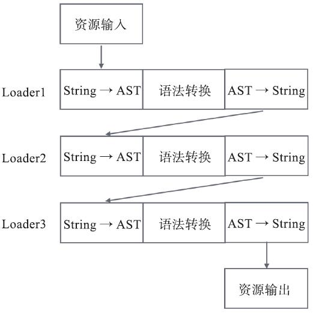
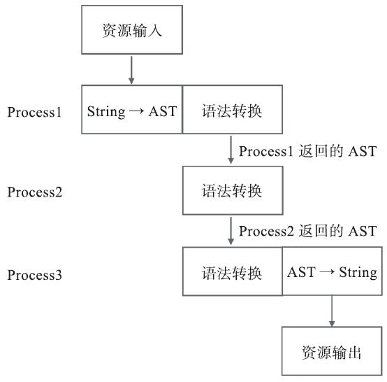
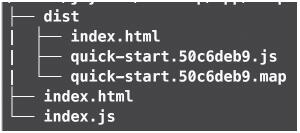

在前端工程化体系中，打包工具是核心基础设施，除了主流的Webpack外，Rollup和Parcel凭借各自的特性在不同场景下占据重要地位。本篇将系统拆解Rollup和Parcel的核心特性、使用方法及底层优化逻辑，同时分析JavaScript打包工具的发展趋势，帮助你掌握不同打包工具的选型思路，适配不同项目的构建需求。

### 本篇核心收获

- 掌握Rollup的核心特性（轻量打包、原生tree shaking、多模块格式输出）及JS库打包的实操方法
- 理解Parcel的打包速度优化原理（资源处理流程、并行任务、缓存机制）与零配置使用方式
- 清晰对比Rollup/Parcel与Webpack的核心差异，明确各工具的适用场景边界
- 洞悉JavaScript打包工具的三大发展趋势：性能与通用性平衡、配置极小化、WebAssembly支持
- 建立基于项目场景（应用开发/库开发）选择打包工具的核心决策逻辑

## 10.1 Rollup——专注于JavaScript的轻量打包工具

Rollup的核心定位是「聚焦JS打包的手术刀式工具」，相比Webpack的全场景覆盖，它更专注于JavaScript模块的打包，产出无冗余附加代码，是JS库开发的首选工具之一。

### 10.1.1 基础配置与快速上手

Rollup的配置极简，核心只需指定入口、输出文件及模块格式，以下是完整实操步骤：

#### 步骤1：创建配置文件与源码文件

```javascript
// rollup.config.js
module.exports = {
  input: 'src/app.js', // 入口文件
  output: {
    file: 'dist/bundle.js', // 输出文件
    format: 'cjs', // 输出模块格式（CommonJS）
  },
};

// src/app.js
console.log('My first rollup app.');
```

#### 步骤2：安装与执行打包

Rollup支持全局安装（区别于Webpack的项目内安装）：

```bash
(sudo) npm i rollup -g
```

执行打包命令（`-c` 指定配置文件）：

```bash
rollup -c rollup.config.js
```

#### 步骤3：打包结果对比（Rollup vs Webpack）

Rollup打包结果（无冗余代码）：

```javascript
'use strict';
console.log('My first rollup app.');
```

相同源码的Webpack打包结果（含约50行自身运行时代码）：

```javascript
!(function(e) {
  var t = {};
  function r(n) {
    if (t[n]) return t[n].exports;
    var o = (t[n] = { i: n, l: !1, exports: {}, });
    return e[n].call(o.exports, o, o.exports, r), (o.l = !0), o.exports;
  }
  // 省略Webpack自身运行时代码（约50行）
})([
  function(e, t) {
    console.log('My first rollup app.');
  }
]);
```

**核心差异**：Rollup仅打包业务代码，无附加运行时，资源体积更小；Webpack需注入自身运行时以支持模块化，即便单行代码也会包含冗余内容。

> 避坑指南：Rollup的`output.strict`配置可移除打包结果中的`'use strict'`，满足非严格模式的开发需求。

### 10.1.2 原生tree shaking——未引用代码自动剔除

tree shaking特性最早由Rollup实现，后被Webpack借鉴，其核心是基于ES6 Modules静态分析，排除未被引用的模块代码。

#### 实操验证

```javascript
// app.js
import { add } from './util';
console.log(`2 + 3 = ${add(2, 3)}`);

// util.js
export function add(a, b) {
  return a + b;
}
export function sub(a, b) {
  return a - b;
}
```

Rollup打包结果（仅保留被引用的`add`函数）：

```javascript
'use strict';

function add(a, b) {
  return a + b;
}

console.log(`2 + 3 = ${add(2, 3)}`);
```

**核心逻辑**：ES6 Modules的导入导出是静态声明（不可动态修改），Rollup可在打包阶段精准分析依赖关系，剔除未引用的`sub`函数，最终产出无冗余的代码。

### 10.1.3 多格式输出——适配不同模块规范

Rollup独有的`output.format`配置支持输出多种模块格式，是JS库开发的核心优势（Webpack无原生支持），支持的格式包括：

| 格式标识 | 模块规范 | 适用场景 |
|----------|----------|----------|
| cjs      | CommonJS | Node.js环境 |
| amd      | AMD      | 浏览器端模块化（RequireJS） |
| esm      | ES6 Modules | 现代浏览器/ES模块工程 |
| iife     | 立即执行函数 | 浏览器全局变量（无模块化） |
| umd      | UMD      | 跨环境（兼容cjs/amd/全局变量） |
| system   | SystemJS | 模块化加载器环境 |

#### 示例：同一源码打包为不同格式

源码：

```javascript
'use strict';
export function add(a, b) {
  return a + b;
}
export function sub(a, b) {
  return a - b;
}
```

- 输出cjs格式：

```javascript
Object.defineProperty(exports, '__esModule', { value: true });
function add(a, b) {
  return a + b;
}
function sub(a, b) {
  return a - b;
}
exports.add = add;
exports.sub = sub;
```

- 输出esm格式：

```javascript
function add(a, b) {
  return a + b;
}
function sub(a, b) {
  return a - b;
}
export { add, sub };
```

### 10.1.4 Rollup的核心适用场景——JavaScript库开发

Rollup是React、Vue等主流JS库的打包工具，React团队迁移至Rollup后获得的核心收益：

1. 最小化附加代码，降低库体积；
2. 原生支持ES6 Modules，适配现代工程；
3. 通过tree shaking剔除开发环境代码（如调试逻辑）；
4. 支持自定义插件实现特殊打包逻辑（如React的源码优化）。

> 注意事项：Rollup对应用开发的支持较弱（无HMR、loader生态不完善），不建议用于复杂前端应用的构建。

**模块小结**：Rollup的核心优势是轻量、原生tree shaking、多模块格式输出，适配JS库开发；劣势是通用性不足，无法满足复杂应用的全场景需求。

## 10.2 Parcel——零配置高速度的打包工具

Parcel是2017年推出的后起之秀，核心卖点是「零配置」和「超高速打包」，解决了Webpack配置复杂、打包速度慢的痛点，适配快速原型开发、轻量项目构建场景。

### 10.2.1 打包速度优化——三大核心策略

Parcel的打包速度比Webpack快近8倍（有缓存场景），核心优化点包括：

1. **多核并行任务**：利用Worker线程并行执行编译任务，充分利用CPU资源；
2. **文件系统缓存**：缓存编译结果，重复打包时跳过未修改文件的编译；
3. **资源编译流程优化**：简化String与AST的转换步骤，降低耗时（核心差异点）。

#### 资源处理流程对比

Webpack的loader机制要求输入/输出均为字符串，多loader串联时会反复转换String↔AST，流程如下：


Parcel无显性loader概念，不同编译阶段可直接传递AST，仅最终输出时转换为String，流程如下：


**核心优势**：AST解析是高耗时操作，Parcel只需执行一次AST解析，相比Webpack的多次转换，大幅降低编译时间（尤其适用于大型工程）。

### 10.2.2 零配置特性——快速上手与工程适配

Parcel的「零配置」并非完全无配置，而是内置了通用默认配置，无需手动编写打包配置文件，以下是完整实操步骤：

#### 步骤1：创建源码文件（支持HTML作为入口）

```html
<!-- index.html -->
<html>
<body>
  <script src="./index.js"></script>
</body>
</html>
```

```javascript
// index.js
document.write('hello world');
```

#### 步骤2：安装与执行打包

```bash
# 全局安装
npm i parcel-bundler -g

# 开发模式（启动本地服务，默认端口1234）
parcel index.html

# 生产打包（输出到dist目录）
parcel build index.html
```

#### 步骤3：打包结果特性

Parcel自动完成以下操作（无需配置）：

- 以HTML为入口解析所有依赖（JS/CSS/图片等）；
- 为输出资源生成hash版本号；
- 自动生成source map；
- 压缩输出代码（JS/CSS/HTML）。

打包后的dist目录结构：


#### 零配置的本质——配置拆分与内置适配

Parcel将配置拆分至各工具的专属配置文件（如`.babelrc`控制ES6编译），同时内置了主流框架/工具的适配逻辑：
示例：Parcel中使用Vue（无需手动配置vue-loader）

```bash
npm install --save vue
npm install --save-dev parcel-bundler
```

> 避坑指南：Parcel的零配置适合快速开发，但深度定制化场景仍需依赖Babel/PostCSS等工具的配置文件，并非真正「无配置」。

**模块小结**：Parcel的核心优势是零配置、打包速度快，适配快速原型开发、轻量项目；劣势是定制化能力弱，复杂工程的灵活度低于Webpack。

## 10.3 JavaScript打包工具的发展趋势

除Rollup、Parcel外，社区还有FuseBox、Microbundle等小众工具，整体发展趋势可总结为三大方向：

### 10.3.1 性能与通用性的平衡

性能与通用性是互相制衡的核心指标：

- 通用型工具（如Webpack）：覆盖全场景，但无法针对单一场景做到极致性能；
- 垂直型工具（如Rollup）：聚焦特定场景（JS库），性能更优，但通用性不足。

**选型逻辑**：根据项目场景权衡——复杂应用选Webpack（通用性），JS库选Rollup（性能），快速原型选Parcel（效率）。

### 10.3.2 配置极小化与工程标准化

「零配置/极简配置」成为主流趋势（Webpack 4.0也支持零配置），背后是前端工程的标准化：

1. 目录结构标准化：src（源码）、dist（输出）成为通用约定；
2. 编译流程标准化：代码压缩、ES6编译、资源处理的默认方案形成共识；
3. 配置拆分标准化：将打包配置拆分至各工具的专属配置文件（如Babel/PostCSS）。

**核心价值**：降低工程搭建成本，提升团队协作效率，减少个性化配置带来的维护成本。

### 10.3.3 WebAssembly支持

WebAssembly（Wasm）是高性能底层技术，可将C/Rust等语言编译为浏览器可运行的代码，主流打包工具均已支持Wasm模块：
示例：在打包工具中引用Wasm模块

```javascript
import { add } from './util.wasm';
add(2, 3);
```

**发展前景**：未来可能支持直接引用C/Rust等语言的模块，拓展前端工程的技术栈边界（如计算密集型场景：游戏、图像识别）。

**模块小结**：打包工具的发展围绕「性能优化、配置简化、技术拓展」展开，核心是平衡通用性与性能，适配工程标准化与新技术融合。

## 本篇核心知识点速记

1. **Rollup核心特性**：轻量打包（无冗余代码）、原生tree shaking、多模块格式输出，适配JS库开发；
2. **Parcel核心特性**：零配置、打包速度快（AST流程优化+并行任务+缓存），适配快速原型开发；
3. **工具对比**：Webpack（通用型，复杂应用）、Rollup（垂直型，JS库）、Parcel（高效型，轻量项目）；
4. **发展趋势**：性能与通用性平衡、配置极小化（工程标准化）、WebAssembly原生支持；
5. **选型原则**：根据项目场景（应用/库/原型）选择，优先匹配核心需求（通用性/性能/效率）。
