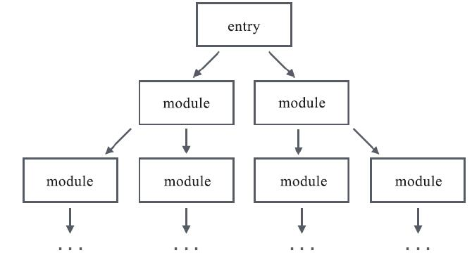
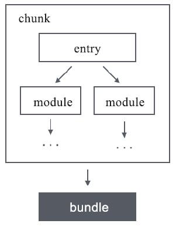
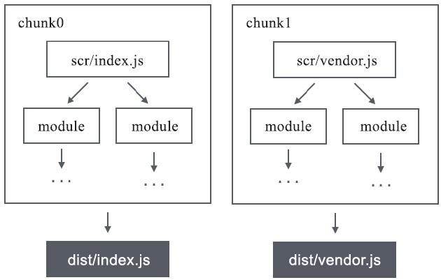
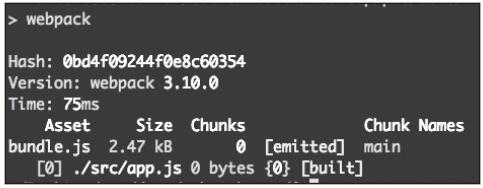
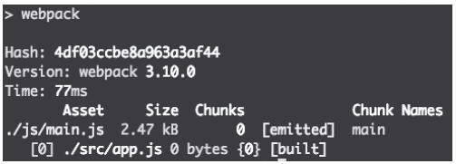
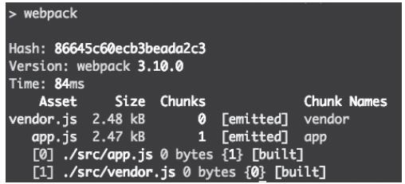

本文聚焦Webpack核心的资源输入输出配置体系，从资源处理的底层流程入手，系统拆解入口（context/entry）与出口（output）的全量配置规则，结合单页应用、多页应用、提取vendor等实战场景，让你彻底掌握Webpack如何定义「原材料来源」与「成品输出路径」，解决资源打包路径、缓存控制、多入口拆分等核心问题。

### 【本篇核心收获】

- 理解Webpack中entry、chunk、bundle的核心关系与资源处理全流程
- 掌握context路径前缀与entry多形式（字符串/数组/对象/函数）的配置规则
- 精通output核心配置（filename/path/publicPath）的作用与差异化场景用法
- 落地单页/多页应用、提取vendor等实战场景的输入输出配置方案
- 规避publicPath与devServer.publicPath混淆、缓存配置不当等常见坑点

## 3.1 资源处理流程

Webpack打包的本质如同工厂组装产品，「资源输入」定义原材料来源，「资源输出」定义成品交付路径。在配置具体规则前，需先理解Webpack的资源处理核心流程：

1. **入口（entry）**：指定Webpack打包的起始文件，若将工程模块依赖关系视为一棵树，入口就是依赖树的根，如图1所示。
2. **chunk生成**：存在依赖关系的模块会被封装为chunk（代码块），可理解为“装着多个模块的文件袋”，工程打包可能生成一个或多个chunk。
3. **bundle输出**：由chunk最终生成的打包产物即为bundle，entry、chunk、bundle的关系如图2所示。





工程中可定义多个入口，默认情况下一个入口对应一个bundle（如src/index.js→dist/index.js、src/lib.js→dist/lib.js），entry与bundle的对应关系如图3所示（特殊场景下单入口也可能生成多个bundle，后续章节会详解）。



### 模块小结

本模块核心讲解了Webpack资源处理的核心链路：入口触发依赖分析→生成chunk→输出bundle，明确了entry、chunk、bundle三个核心概念的关联关系，是后续配置入口出口的基础认知。

## 3.2 配置资源入口

Webpack通过`context`和`entry`两个配置项共同决定入口文件路径，配置入口的核心目标有两个：

- 确定入口模块位置，告诉Webpack打包起始点；
- 定义chunk name（单入口默认`main`，多入口需手动定义唯一标识）。

### 3.2.1 context

`context`可理解为资源入口的路径前缀，**必须配置为绝对路径**，核心作用是简化`entry`的路径编写（尤其多入口场景）。

示例：以下两种配置效果完全一致，入口均为`<工程根路径>/src/scripts/index.js`

```javascript
// 配置方式1
module.exports = {
    context: path.join(__dirname, './src'),
    entry: './scripts/index.js',
};
// 配置方式2
module.exports = {
    context: path.join(__dirname, './src/scripts'),
    entry: './index.js',
};
```

`context`可省略，默认值为当前工程的根目录。

### 3.2.2 entry

与`context`仅支持字符串不同，`entry`支持**字符串、数组、对象、函数**四种配置形式，可适配不同场景需求：

#### 1. 字符串类型入口

直接传入文件路径，适用于单入口基础场景：

```javascript
module.exports = {
    entry: './src/index.js',
    output: {
        filename: 'bundle.js',
    },
    mode: 'development',
};
```

#### 2. 数组类型入口

将多个资源预先合并，Webpack会将数组最后一个元素作为实际入口路径，常用于提前引入polyfill等全局依赖：

```javascript
module.exports = {
    entry: ['babel-polyfill', './src/index.js'] ,
};
```

上述配置等价于：

```javascript
// webpack.config.js
module.exports = {
    entry: './src/index.js',
};

// index.js
import 'babel-polyfill';
```

#### 3. 对象类型入口

**多入口场景必须使用对象形式**，对象的key为chunk name，value为入口路径（支持字符串/数组）：

```javascript
// 基础多入口配置
module.exports = {
    entry: {
        index: './src/index.js', // chunk name为index
        lib: './src/lib.js',     // chunk name为lib
    },
};

// 数组形式的多入口配置
module.exports = {
    entry: {
        index: ['babel-polyfill', './src/index.js'],
        lib: './src/lib.js',
    },
};
```

> 注意：字符串/数组定义单入口时，chunk name固定为`main`无法修改；对象定义多入口时，必须为每个入口手动指定chunk name。

#### 4. 函数类型入口

返回字符串/数组/对象形式的入口配置，支持动态逻辑或异步操作（可返回Promise）：

```javascript
// 返回字符串入口
module.exports = {
    entry: () => './src/index.js',
};

// 返回对象入口
module.exports = {
    entry: () => ({
        index: ['babel-polyfill', './src/index.js'],
        lib: './src/lib.js',
    }),
};

// 异步入口（返回Promise）
module.exports = {
    entry: () => new Promise((resolve) => {
        setTimeout(() => {
            resolve('./src/index.js');
        }, 1000);
    }),
};
```

### 3.2.3 实例

#### 1. 单页应用（SPA）

单页应用通常定义单一入口，所有模块由入口文件统一引用：

```javascript
module.exports = {
    entry: './src/app.js',
};
```

**优点**：依赖关系清晰，仅生成一个JS文件；
**弊端**：应用规模扩大后bundle体积过大（Webpack默认对压缩前大于250kB的bundle触发警告，如图4所示），影响页面渲染速度。

![图4：大于250kB的资源会有[big]提示](./images/image_10.jpg)

#### 2. 提取vendor

为解决单入口bundle体积过大、缓存利用率低的问题，可将第三方库/框架（vendor）单独打包：

```javascript
module.exports = {
    context: path.join(__dirname, './src'),
    entry: {
        app: './src/app.js',       // 业务代码入口
        vendor: ['react', 'react-dom', 'react-router'], // 第三方依赖入口
    },
};
```

需配合`optimization.splitChunks`（Webpack4+，替代废弃的CommonsChunkPlugin）将公共模块提取为独立bundle，由于vendor不常变动，可有效利用客户端缓存提升页面加载速度。

#### 3. 多页应用

多页应用需为每个页面配置独立入口，确保每个页面仅加载自身必要逻辑：

```javascript
// 基础多页入口配置
module.exports = {
    entry: {
        pageA: './src/pageA.js',
        pageB: './src/pageB.js',
        pageC: './src/pageC.js',
    },
};

// 多页应用+提取vendor
module.exports = {
    entry: {
        pageA: './src/pageA.js',
        pageB: './src/pageB.js',
        pageC: './src/pageC.js',
        vendor: ['react', 'react-dom'] ,
    },
};
```

每个HTML仅需引入对应页面的bundle，配合vendor提取可进一步减小单页面资源体积。

### 模块小结

本模块详解了入口配置的核心：`context`作为路径前缀简化entry编写，`entry`支持四种配置形式适配不同场景；同时落地了单页、多页、提取vendor三大实战场景的入口配置方案，解决了单入口体积过大、多入口拆分、缓存优化等核心问题。

## 3.3 配置资源出口

所有输出相关配置均集中在`output`对象中，核心配置项包括`filename`、`path`、`publicPath`，可覆盖绝大多数场景需求：

```javascript
const path = require('path');
module.exports = {
    entry: './src/app.js',
    output: {
        filename: 'bundle.js',   // 输出文件名
        path: path.join(__dirname, 'assets'), // 输出目录
        publicPath: '/dist/',    // 间接资源请求路径
    },
};
```

### 3.3.1 filename

`filename`控制输出资源的文件名，支持字符串（固定名称）或模板变量（动态名称）：

#### 1. 固定文件名（单入口）

```javascript
module.exports = {
    entry: './src/app.js',
    output: {
        filename: 'bundle.js',
    },
};
```

打包结果如图5所示：



#### 2. 带路径的文件名

`filename`可指定相对路径，Webpack会自动创建不存在的目录：

```javascript
module.exports = {
    entry: './src/app.js',
    output: {
        filename: './js/bundle.js',
    },
};
```

打包结果如图6所示：



#### 3. 模板变量（多入口/缓存控制）

多入口场景需用模板变量区分不同bundle，生产环境可结合`[chunkhash]`控制客户端缓存，核心模板变量如下：

| 变量        | 含义                     | 核心用途                     |
|-------------|--------------------------|------------------------------|
| `[name]`    | chunk name               | 区分不同chunk（可读性高）    |
| `[chunkhash]`| chunk内容对应的哈希值    | 精准控制客户端缓存           |
| `[id]`      | chunk的唯一标识（数字）  | 区分不同chunk                |
| `[hash]`    | 整个打包过程的哈希值     | 全局缓存控制（易牵连所有资源）|
| `[query]`   | 手动指定的查询参数       | 手动控制缓存                 |

**多入口动态命名示例**：

```javascript
module.exports = {
    entry: {
        app: './src/app.js',
        vendor: './src/vendor.js',
    },
    output: {
        filename: '[name].js',
    },
};
```

打包结果如图7所示：



**生产环境缓存控制示例**：

```javascript
module.exports = {
    entry: {
        app: './src/app.js',
        vendor: './src/vendor.js',
    },
    output: {
        filename: '[name]@[chunkhash].js',
    },
};
```

打包结果如图8所示：

![图8：使用了[name]和[chunkhash]的filename配置](./images/image_15.jpg)

> 注意：`[chunkhash]`仅适用于生产环境配置，开发环境无需配置（详见第7章分离配置文件部分）。

### 3.3.2 path

`path`指定资源的输出位置，**必须配置为绝对路径**：

```javascript
const path = require('path');
module.exports = {
    entry: './src/app.js',
    output: {
        filename: 'bundle.js',
        path: path.join(__dirname, 'dist') ,
    },
};
```

Webpack4+中`output.path`默认值为工程根目录下的`dist`，无需手动配置（需修改时除外）。

### 3.3.3 publicPath

`publicPath`是极易与`path`混淆的核心配置项：

- `path`：资源的**输出位置**（打包后资源生成的目录）；
- `publicPath`：间接资源的**请求位置**（JS/CSS请求的异步JS、图片、字体等资源的路径）。

`publicPath`支持三种配置形式：

#### 1. HTML相关（相对路径）

以当前页面HTML所在路径为基准，拼接相对路径形成请求URL：

```
// 假设HTML地址：https://example.com/app/index.html
// 异步加载资源名：0.chunk.js
publicPath: ""          // 实际请求：https://example.com/app/0.chunk.js
publicPath: "./js"      // 实际请求：https://example.com/app/js/0.chunk.js
publicPath: "../assets/"// 实际请求：https://example.com/assets/0.chunk.js
```

#### 2. Host相关（根路径）

以当前页面的host name为基准，路径以`/`开头：

```
// 假设HTML地址：https://example.com/app/index.html
// 异步加载资源名：0.chunk.js
publicPath: "/"         // 实际请求：https://example.com/0.chunk.js
publicPath: "/js/"      // 实际请求：https://example.com/js/0.chunk.js
publicPath: "/dist/"    // 实际请求：https://example.com/dist/0.chunk.js
```

#### 3. CDN相关（绝对路径）

静态资源部署在CDN时，需配置绝对路径（支持协议头/相对协议）：

```
// 假设HTML地址：https://example.com/app/index.html
// 异步加载资源名：0.chunk.js
publicPath: "http://cdn.com/"    // 实际请求：http://cdn.com/0.chunk.js
publicPath: "https://cdn.com/"   // 实际请求：https://cdn.com/0.chunk.js
publicPath: "//cdn.com/assets/"  // 实际请求：//cdn.com/assets/0.chunk.js
```

#### 注意：devServer.publicPath

webpack-dev-server的`publicPath`与Webpack的`output.publicPath`含义不同，它指定静态资源的服务路径：

```javascript
const path = require('path');
module.exports = {
    entry: './src/app.js',
    output: {
        filename: 'bundle.js',
        path: path.join(__dirname, 'dist'),
    },
    devServer: {
        publicPath: '/assets/', // 资源服务路径为/assets/
        port: 3000,
    },
};
```

上述配置中，bundle.js实际输出到`dist`目录，但需访问`localhost:3000/assets/bundle.js`才能获取（访问`localhost:3000/dist/bundle.js`会404）。

**避坑指南**：为保证开发/生产环境一致性，建议将`devServer.publicPath`与`output.path`保持一致：

```javascript
const path = require('path');
module.exports = {
    entry: './src/app.js',
    output: {
        filename: 'bundle.js',
        path: path.join(__dirname, 'dist') ,
    },
    devServer: {
        publicPath: '/dist/', // 与output.path对齐
        port: 3000,
    },
};
```

### 3.3.4 实例

#### 1. 单入口场景

单入口无需动态配置`filename`，重点对齐devServer路径：

```javascript
const path = require('path');
module.exports = {
    entry: './src/app.js',
    output: {
        filename: 'bundle.js',
    },
    devServer: {
        publicPath: '/dist/', // 与默认output.path对齐
    },
};
```

#### 2. 多入口场景

多入口需用`[name]`模板变量动态命名，生产环境可追加`[chunkhash]`：

```javascript
const path = require('path');
module.exports = {
    entry: {
        pageA: './src/pageA.js',
        pageB: './src/pageB.js',
    },
    output: {
        filename: '[name].js', // 生产环境可改为[name]@[chunkhash].js
    },
    devServer: {
        publicPath: '/dist/',
    },
};
```

### 模块小结

本模块核心讲解了输出配置的三大核心项：`filename`控制输出文件名（支持模板变量适配多入口/缓存）、`path`指定输出目录（绝对路径）、`publicPath`指定间接资源请求路径（分三类场景）；同时明确了devServer.publicPath的特殊含义与配置对齐原则，落地了单/多入口的输出配置方案。

## 【本篇核心知识点速记】

1. 资源处理流程：入口（entry）→依赖树分析→生成chunk→输出bundle，多入口默认对应多bundle（特殊场景单入口可生成多bundle）；
2. 入口配置：
   - `context`：绝对路径前缀，简化entry编写，默认工程根目录；
   - `entry`：支持字符串/数组/对象/函数，多入口必须用对象定义chunk name；
3. 出口配置：
   - `filename`：输出文件名，多入口用`[name]`区分，生产环境用`[chunkhash]`控制缓存；
   - `path`：绝对输出路径，Webpack4+默认dist目录；
   - `publicPath`：间接资源请求路径，分HTML/Host/CDN三类场景，devServer.publicPath需与output.path对齐；
4. 实战技巧：
   - 单页应用：单一入口，可提取vendor拆分第三方依赖；
   - 多页应用：多入口配置，每个页面对应独立bundle；
   - 缓存优化：生产环境用`[chunkhash]`，仅变更内容的chunk会更新哈希值；
5. 避坑点：
   - 开发环境无需配置`[chunkhash]`；
   - 区分`path`（输出位置）与`publicPath`（请求位置）的核心差异；
   - devServer.publicPath是静态资源服务路径，非资源请求路径。
