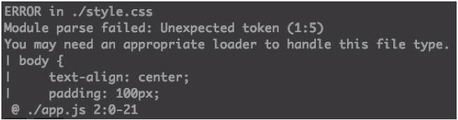

本文聚焦Webpack中核心的资源预处理能力——loader，从“一切皆模块”的核心思想出发，全面解析loader的底层原理、配置方式、常用loader实战用法，以及自定义loader的完整流程，学完后可掌握Webpack处理CSS、图片、TS、Vue等各类非JS资源的全流程落地能力，解决工程中多类型资源的统一编译与管理问题。

### 本篇核心收获

- 理解Webpack“一切皆模块”的核心思想，掌握通过loader关联不同类型资源依赖关系的方法
- 吃透loader的底层原理（函数本质、链式执行逻辑），掌握loader的完整配置规则（test/use/exclude等）
- 熟练使用主流loader处理各类资源（ES6+、TS、CSS、图片、HTML、Vue组件等），规避配置中的常见坑点
- 掌握自定义loader的完整流程，包括初始化、缓存、options解析、source-map支持等核心特性
- 明确loader配置中的优先级、执行顺序等关键规则，优化工程打包性能与可维护性

## 1. 一切皆模块：Webpack处理多类型资源的核心思想

Web工程通常包含HTML、JS、CSS、图片、字体等多种静态资源，且资源间存在依赖关系（如CSS引用图片、组件依赖自身样式）。Webpack的核心思想是**一切皆模块**——所有静态资源都可视为模块，能像加载JS文件一样加载其他类型资源（如在JS中引入CSS）。

### 1.1 资源依赖关系的优化

传统开发中，组件的JS和样式需要分开引入/删除（如引入日历组件时，需同时引入JS和SCSS），易出错且维护成本高；通过Webpack的“一切皆模块”思想，可在组件JS中直接引入自身样式：

```javascript
// ./ui/calendar/index.js
import './style.scss'; // 引用组件自身样式
// 组件业务逻辑代码...

// ./page/home/index.js
import Calendar from './ui/calendar/index.js';
import './style.scss'; // 仅需引入页面自身样式
```

此时组件的JS和SCSS作为一个整体被页面引入，依赖关系更清晰：移除组件时仅需删除JS引用，Webpack会自动维护关联的样式资源，工程结构更直观、可维护性更强。

### 1.2 模块特性的延伸

模块具备高内聚、可复用的特性，将这一特性应用到所有静态资源上，可基于Webpack设计出更健壮的资源管理系统，统一管理各类资源的依赖、编译与输出。

**模块小结**：Webpack“一切皆模块”的思想核心是将所有静态资源纳入模块体系，通过依赖关系关联不同资源，简化资源管理流程，提升工程可维护性。

## 2. loader概述：底层原理与核心本质

Webpack本身仅能识别JavaScript，loader（预处理器）是赋予Webpack处理非JS资源能力的核心，本质是**处理资源的函数**，负责将非JS资源转译为Webpack可识别的形式。

### 2.1 loader的核心公式

loader的本质可简化为函数逻辑：

```
output = loader(input)
```

- `input`：可为源文件字符串、上一个loader的输出（含字符串、source map、AST对象）
- `output`：包含转换后的文件字符串、source map、AST对象；若为最后一个loader，输出直接交给Webpack，否则作为下一个loader的输入

示例：使用babel-loader转译ES6+为ES5

```
ES5 = babel-loader(ES6+)
```

### 2.2 链式执行逻辑

loader支持链式配置，执行顺序为**数组从后往前**（后配置的loader先执行），公式为：

```
output = loaderA(loaderB(loaderC(input)))
```

示例：编译SCSS为页面style标签的链式逻辑

```
Style标签 = style-loader(css-loader(sass-loader(SCSS)))
```

### 2.3 loader的源码结构

loader本身是一个Node.js函数，核心结构如下：

```javascript
module.exports = function loader (content, map, meta) {
   // 异步回调（处理异步逻辑）
   var callback = this.async();
   // 核心处理逻辑：转换输入内容
   var result = handler(content, map, meta);
   // 返回转换结果：错误、内容、source-map、AST
   callback(
       null,           // error：无错误时传null
       result.content, // 转换后的内容
       result.map,     // 转换后的 source-map
       result.meta,    // 转换后的 AST
   );
};
```

**模块小结**：loader是处理非JS资源的核心函数，支持链式执行，通过输入输出的传递完成资源转译，是Webpack扩展多资源处理能力的核心机制。

## 3. loader配置：从基础引入到高级配置

loader的配置集中在Webpack配置文件的`module.rules`中，核心是定义“规则作用的资源”和“使用的loader”，涵盖基础引入、链式使用、高级筛选等场景。

### 3.1 基础引入：处理CSS资源的核心步骤

以处理CSS文件为例，演示loader的基础引入流程：

#### 步骤1：场景复现（未配置loader的报错）

在JS中引入CSS文件：

```javascript
// app.js
import './style.css';

// style.css
body {
    text-align: center;
    padding: 100px;
    color: #fff;
    background-color: #09c;
}
```

直接打包会报错（Webpack无法识别CSS语法），报错提示如图1所示：


#### 步骤2：安装loader

loader是第三方npm模块，需先安装：

```bash
npm install css-loader
```

#### 步骤3：基础配置

在Webpack配置中添加规则：

```javascript
module.exports = {
    // 其他配置...
    module: {
        rules: [{
            test: /\.css$/, // 匹配所有.css后缀的文件
            use: ['css-loader'], // 使用的loader
        }],
    },
};
```

**注意**：仅配置css-loader只能处理CSS的`@import`/`url()`等语法，无法将样式插入页面生效，需配合style-loader。

**模块小结**：基础配置的核心是通过`test`匹配资源、`use`指定loader，需先安装loader再配置规则，单一loader可能无法满足完整的资源处理需求。

### 3.2 链式loader：多loader协同工作规则

处理SCSS/CSS等资源时，需多个loader协同，核心规则是**use数组从后往前执行**。

#### 步骤1：安装style-loader

```bash
npm install style-loader
```

#### 步骤2：链式配置

```javascript
module.exports = {
    module: {
        rules: [
            {
                test: /\.css$/,
                use: ['style-loader', 'css-loader'], // 执行顺序：css-loader → style-loader
            }
        ],
    },
};
```

- `css-loader`：处理CSS的依赖语法（如`@import`），输出处理后的CSS字符串
- `style-loader`：将CSS字符串包装为`style`标签插入页面，使样式生效

#### 避坑指南

- 链式loader的顺序不可颠倒：若将`css-loader`放在前面，`style-loader`处理的是未解析依赖的原始CSS，会导致样式失效
- 链式执行逻辑需牢记：数组最后一位的loader先执行，第一位的loader最后执行

**模块小结**：链式loader通过数组配置，执行顺序为从后往前，需根据资源处理流程合理排列loader顺序，确保每个loader的输入是前一个loader的有效输出。

### 3.3 loader options：传入自定义配置项

loader支持通过`options`传入自定义配置，适用于需要定制loader行为的场景：

```javascript
rules: [
    {
        test: /\.css$/,
        use: [
            'style-loader',
            {
                loader: 'css-loader',
                options: {
                    // css-loader的自定义配置（如模块化、压缩等）
                    modules: false, // 关闭CSS模块化
                    minimize: true, // 压缩CSS
                },
            }
        ],
    },
],
```

**补充说明**：部分老版loader会用`query`替代`options`，功能等价，具体需参考对应loader的文档。

### 3.4 高级配置：精准控制规则作用范围

通过`exclude`/`include`、`resource`/`issuer`、`enforce`等配置，可精准控制loader规则的作用范围和执行顺序。

#### 3.4.1 exclude与include：筛选资源目录

- `exclude`：排除指定目录的资源（优先级更高）
- `include`：仅匹配指定目录的资源
- 核心作用：缩小loader处理范围，提升打包性能（如排除`node_modules`）

**基础示例**：排除`node_modules`中的CSS文件

```javascript
rules: [
    {
        test: /\.css$/,
        use: ['style-loader', 'css-loader'],
        exclude: /node_modules/, // 排除node_modules目录
    }
],
```

**进阶示例**：仅匹配`src`目录，排除`src/lib`子目录

```javascript
rules: [
    {
        test: /\.css$/,
        use: ['style-loader', 'css-loader'],
        exclude: /src\/lib/, // 排除src/lib
        include: /src/, // 仅匹配src目录
    },
],
```

**特殊场景**：排除`node_modules`但包含其中某个模块

```javascript
rules: [
    {
        test: /\.css$/,
        use: ['style-loader', 'css-loader'],
        // 排除node_modules中除了foo/bar以外的所有模块
        exclude: /node_modules\/(?!(foo|bar)\/).*/,
    },
],
```

#### 3.4.2 resource与issuer：区分加载者与被加载者

Webpack中：

- `resource`：被加载的模块（如`style.css`）
- `issuer`：加载资源的模块（如`index.js`）

通过`resource`/`issuer`可精准限制规则生效条件，示例：仅允许`src/pages`目录下的JS文件引用CSS：

```javascript
rules: [
    {
        use: ['style-loader', 'css-loader'],
        resource: { // 被加载者（CSS）的规则
            test: /\.css$/,
            exclude: /node_modules/,
        },
        issuer: { // 加载者（JS）的规则
            test: /\.js$/,
            include: /src/pages/,
        },
    }
],
```

#### 3.4.3 enforce：强制指定loader执行顺序

Webpack中loader分为4类：`pre`（前置）、`inline`（内联，不推荐）、`normal`（默认）、`post`（后置），通过`enforce`可强制指定loader类型：

- `enforce: 'pre'`：在所有normal loader前执行
- `enforce: 'post'`：在所有normal loader后执行

示例：使用eslint-loader前置检测JS代码（保证检测的是原始代码）

```javascript
rules: [
    {
        test: /\.js$/,
        enforce: 'pre', // 前置执行
        use: 'eslint-loader',
        exclude: /node_modules/,
    }
],
```

**避坑指南**：

- `enforce`仅用于明确执行顺序，不使用时需手动保证loader顺序正确
- 实际工程中配置文件较长时，推荐使用`enforce`避免顺序错误

**模块小结**：高级配置通过`exclude/include`筛选资源、`resource/issuer`区分加载者与被加载者、`enforce`强制执行顺序，可精准控制loader规则的作用范围，提升配置的健壮性与打包性能。

## 4. 常用loader实战：处理各类资源的主流方案

针对不同类型的资源，社区提供了成熟的loader方案，以下是最常用的loader及核心配置方式。

### 4.1 babel-loader：转译ES6+为ES5

用于将ES6+代码转译为ES5，兼容低版本浏览器，核心依赖包括`babel-loader`（衔接Webpack与Babel）、`@babel/core`（Babel核心编译器）、`@babel/preset-env`（自动适配目标环境的预置器）。

#### 步骤1：安装依赖

```bash
npm install babel-loader @babel/core @babel/preset-env
```

#### 步骤2：配置规则

```javascript
rules: [
  {
    test: /\.js$/,
    exclude: /node_modules/, // 必加：避免编译第三方模块，提升速度
    use: {
      loader: 'babel-loader',
      options: {
        cacheDirectory: true, // 启用缓存，避免重复编译，提升打包速度
        presets: [[
          '@babel/preset-env', {
            modules: false, // 禁用ES6 Module转CommonJS，保证tree-shaking生效
          }
        ]],
      },
    },
  }
],
```

#### 关键配置说明

- `exclude: /node_modules/`：必须配置，否则会编译`node_modules`中已转译的代码，拖慢打包速度
- `cacheDirectory: true`：缓存编译结果，缓存目录默认在`node_modules/.cache/babel-loader`
- `modules: false`：`@babel/preset-env`默认会将ES6 Module转为CommonJS，导致Webpack的tree-shaking失效，需禁用

#### 补充说明

babel-loader支持从`.babelrc`文件读取配置，可将`presets`/`plugins`从Webpack配置中抽离，效果一致。

### 4.2 ts-loader：集成TypeScript

用于衔接Webpack与TypeScript，实现TS代码的编译与类型检查。

#### 步骤1：安装依赖

```bash
npm install ts-loader typescript
```

#### 步骤2：配置规则

```javascript
rules: [
    {
        test: /\.ts$/,
        use: 'ts-loader',
        exclude: /node_modules/,
    }
],
```

#### 关键说明

- TypeScript的配置需放在工程根目录的`tsconfig.json`中，而非ts-loader的options：

  ```json
  {
      "compilerOptions": {
          "target": "es5", // 编译目标为ES5
          "sourceMap": true, // 生成source-map
      },
  }
  ```

- 更多配置可参考ts-loader官方文档：<https://github.com/TypeStrong/ts-loader>

### 4.3 html-loader：处理HTML片段

将HTML文件转为字符串，支持在JS中加载HTML片段并插入页面。

#### 步骤1：安装依赖

```bash
npm install html-loader
```

#### 步骤2：配置规则

```javascript
rules: [
    {
        test: /\.html$/,
        use: 'html-loader',
        exclude: /node_modules/,
    }
],
```

#### 使用示例

```html
<!-- header.html -->
<header>
    <h1>This is a Header.</h1>
</header>
```

```javascript
// index.js
import headerHtml from './header.html';
document.write(headerHtml); // 将HTML片段插入页面
```

### 4.4 handlebars-loader：处理Handlebars模板

用于编译Handlebars模板，加载后返回模板函数，支持传入变量生成最终HTML。

#### 步骤1：安装依赖

```bash
npm install handlebars-loader handlebars
```

#### 步骤2：配置规则

```javascript
rules: [
    {
        test: /\.handlebars$/,
        use: 'handlebars-loader',
        exclude: /node_modules/,
    }
],
```

#### 使用示例

```handlebars
<!-- content.handlebars -->
<div class="entry">
    <h1>{{ title }}</h1>
    <div class="body">{{ body }}</div>
</div>
```

```javascript
// index.js
import contentTemplate from './content.handlebars';
const div = document.createElement('div');
// 传入变量生成HTML字符串
div.innerHTML = contentTemplate({
         title: "Title",
         body: "Your books are due next Tuesday"
});
document.body.appendChild(div);
```

### 4.5 file-loader：打包文件类资源

用于打包图片、字体等文件资源，返回资源的publicPath，支持自定义文件名和引用路径。

#### 步骤1：安装依赖

```bash
npm install file-loader
```

#### 步骤2：基础配置

```javascript
const path = require('path');
module.exports = {
    entry: './app.js',
    output: {
        path: path.join(__dirname, 'dist'), // 输出目录
        filename: 'bundle.js',
        // publicPath: './assets/', // 资源引用前缀（可选）
    },
    module: {
        rules: [
            {
                test: /\.(png|jpg|gif)$/,
                use: 'file-loader',
            }
        ],
    },
};
```

#### 使用示例

```javascript
import avatarImage from './avatar.jpg';
console.log(avatarImage); 
// 无publicPath时：输出hash值+后缀（如c6f482ac9a1905e1d7d22caa909371fc.jpg）
// 配置publicPath: './assets/'时：输出./assets/c6f482ac9a1905e1d7d22caa909371fc.jpg
```

#### 自定义文件名/引用路径

```javascript
rules: [
    {
        test: /\.(png|jpg|gif)$/,
        use: {
            loader: 'file-loader',
            options: {
                name: '[name].[ext]', // 保留原文件名和后缀
                publicPath: './another-path/', // 覆盖output.publicPath
            },
        },
    }
],
```

配置后输出：`./another-path/avatar.jpg`

### 4.6 url-loader：小文件Base64编码

与file-loader功能类似，核心区别是支持设置文件大小阈值：

- 小于阈值：返回Base64编码字符串（减少HTTP请求）
- 大于阈值：同file-loader返回publicPath

#### 步骤1：安装依赖

```bash
npm install url-loader
```

#### 步骤2：配置规则

```javascript
rules: [
    {
        test: /\.(png|jpg|gif)$/,
        use: {
            loader: 'url-loader',
            options: {
                limit: 10240, // 阈值：10KB（单位：字节）
                name: '[name].[ext]',
                publicPath: './assets-path/',
            },
        },
    }
],
```

#### 使用示例

```javascript
import avatarImage from './avatar.jpg';
// 图片小于10KB时：输出Base64编码（如data:image/jpeg;base64,/9j/2wCEAAgGBg……）
// 图片大于10KB时：输出./assets-path/avatar.jpg
```

### 4.7 vue-loader：处理Vue单文件组件

用于解析Vue单文件组件（.vue），拆分模板、JS、样式并分别处理。

#### 步骤1：安装依赖

```bash
npm install vue-loader vue vue-template-compiler css-loader
```

- `vue-template-compiler`：编译Vue模板
- `css-loader`：处理组件内的样式（若用SCSS/LESS需额外安装对应loader）

#### 步骤2：配置规则

```javascript
rules: [
    {
        test: /\.vue$/,
        use: 'vue-loader',
        exclude: /node_modules/,
    }
],
```

#### 使用示例

```vue
<!-- App.vue -->
<template>
    <h1>{{ title }}</h1>
</template>
<script>
export default {
    name: 'app',
    data() {
        return { title: 'Welcome to Your Vue.js App' }
    }
}
</script>
<style lang="css">
h1 {
    color: #09c;
}
</style>
```

更多高级配置可参考vue-loader官方文档：<https://vue-loader.vuejs.org/zh-cn>

**模块小结**：不同类型的资源对应不同的主流loader，核心是根据资源类型选择合适的loader，配置时需注意依赖安装、exclude优化、自定义options等关键点，确保资源处理符合工程需求。

## 5. 自定义loader：从基础实现到高级特性

当现有loader无法满足需求时，可自定义loader，核心是实现一个处理资源的函数，支持缓存、options解析、source-map等特性。

### 5.1 初始化：实现强制严格模式loader

需求：为所有JS文件头部添加`'use strict';`，启用严格模式。

#### 步骤1：初始化loader项目

```bash
# 创建目录并初始化
mkdir force-strict-loader && cd force-strict-loader
npm init -y
```

#### 步骤2：编写loader核心代码

```javascript
// force-strict-loader/index.js
module.exports = function(content) {
     var useStrictPrefix = '\'use strict\';\n\n';
     return useStrictPrefix + content;
}
```

#### 步骤3：在工程中安装并使用

```bash
# 在Webpack工程目录下安装（软链，支持实时修改）
npm install <path-to-loader>/force-strict-loader
```

#### 步骤4：配置Webpack规则

```javascript
module.exports = {
    module: {
        rules: [
            {
                test: /\.js$/,
                use: 'force-strict-loader',
                exclude: /node_modules/,
            }
        ]
    }
}
```

打包后所有JS文件头部都会添加`'use strict';`。

### 5.2 启用缓存：提升打包性能

当文件输入和依赖未变化时，复用loader的处理结果，避免重复编译：

```javascript
// force-strict-loader/index.js
module.exports = function(content) {
    // 启用缓存（Webpack内置缓存机制）
    if (this.cacheable) {
        this.cacheable();
    }
    var useStrictPrefix = '\'use strict\';\n\n';
    return useStrictPrefix + content;
}
```

**核心作用**：相同输入的文件仅编译一次，大幅提升重复打包的速度。

### 5.3 获取options：接收自定义配置

通过`loader-utils`库解析传入的options，实现loader的可配置化。

#### 步骤1：安装依赖

```bash
cd force-strict-loader
npm install loader-utils
```

#### 步骤2：修改loader代码

```javascript
// force-strict-loader/index.js
var loaderUtils = require("loader-utils");
module.exports = function(content) {
    if (this.cacheable) {
        this.cacheable();
    }
    // 解析options（无配置时返回空对象）
    var options = loaderUtils.getOptions(this) || {};
    console.log('loader options:', options); // 打印配置项
    // 核心处理逻辑
    var useStrictPrefix = '\'use strict\';\n\n';
    return useStrictPrefix + content;
}
```

#### 步骤3：传入options使用

```javascript
rules: [
    {
        test: /\.js$/,
        use: {
            loader: 'force-strict-loader',
            options: {
                sourceMap: true, // 自定义配置项
            },
        },
        exclude: /node_modules/,
    }
],
```

### 5.4 支持source-map：保证调试体验

source-map用于浏览器调试时映射源码，自定义loader需处理source-map确保调试准确性。

#### 步骤1：安装依赖

```bash
cd force-strict-loader
npm install source-map
```

#### 步骤2：修改loader代码

```javascript
// force-strict-loader/index.js
var loaderUtils = require("loader-utils");
var SourceNode = require("source-map").SourceNode;
var SourceMapConsumer = require("source-map").SourceMapConsumer;

module.exports = function(content, sourceMap) {
    var useStrictPrefix = '\'use strict\';\n\n';
    if (this.cacheable) {
        this.cacheable();
    }

    // 处理source-map（配置开启且有传入sourceMap时）
    var options = loaderUtils.getOptions(this) || {};
    if (options.sourceMap && sourceMap) {
        var currentRequest = loaderUtils.getCurrentRequest(this);
        // 从现有内容和sourceMap创建SourceNode
        var node = SourceNode.fromStringWithSourceMap(
            content,
            new SourceMapConsumer(sourceMap)
        );
        // 在内容头部添加严格模式语句
        node.prepend(useStrictPrefix);
        // 生成新的内容和sourceMap
        var result = node.toStringWithSourceMap({ file: currentRequest });
        // 异步返回结果（支持多返回值：错误、内容、sourceMap）
        var callback = this.async();
        callback(null, result.code, result.map.toJSON());
    }

    // 不支持source-map时直接返回内容
    return useStrictPrefix + content;
}
```

#### 核心逻辑说明

- `sourceMap`参数：由Webpack或上一个loader传入，包含原始的源码映射信息
- `SourceNode`：用于修改内容并维护source-map的关联关系
- `this.async()`：异步回调，支持返回内容+source-map，替代直接return

**补充说明**：更多loader API可参考Webpack官方文档：<https://doc.webpack-china.org/api/loaders/>

**模块小结**：自定义loader的核心是实现资源处理函数，可通过缓存提升性能、options实现配置化、source-map保证调试体验，需遵循Webpack的loader API规范，确保与Webpack生态兼容。

## 本篇核心知识点速记

1. 核心思想：Webpack“一切皆模块”，通过loader将非JS资源转为模块，关联资源依赖关系，提升工程可维护性
2. loader本质：处理资源的函数，支持链式执行（数组从后往前），输入为源文件/上一个loader的输出，输出为转译后的内容+sourceMap+AST
3. 配置规则：核心是`module.rules`，通过`test`匹配资源、`use`指定loader，`exclude/include`筛选目录，`enforce`强制执行顺序，`options`传入自定义配置
4. 常用loader：babel-loader（ES6+转ES5）、ts-loader（TS编译）、file-loader/url-loader（文件资源）、vue-loader（Vue组件）等，需注意安装依赖、排除`node_modules`、配置缓存等优化点
5. 自定义loader：实现处理函数，支持缓存、options解析、source-map，遵循Webpack API规范，可通过npm软链本地调试
6. 避坑要点：链式loader顺序不可颠倒、`exclude: /node_modules/`提升打包速度、`@babel/preset-env`的`modules: false`保证tree-shaking生效、`enforce`明确loader执行顺序
