代码分片是Webpack实现前端资源按需加载、优化首屏性能的核心技术，本篇将系统拆解Webpack代码分片的完整实现方案，从入口划分、公共模块提取（CommonsChunkPlugin与SplitChunksPlugin）到异步加载原理，帮你掌握如何通过合理的代码拆分减小首屏资源体积、提升客户端缓存利用率，最终实现高性能的前端应用交付。

### 本篇核心收获

- 掌握Webpack通过入口划分实现基础代码分片的方法及适用场景
- 理解CommonsChunkPlugin的核心用法、配置项及局限性
- 精通Webpack 4+ SplitChunksPlugin的声明式配置、提取规则及优化逻辑
- 掌握资源异步加载的实现方式（import()函数）及异步chunk的命名配置
- 理解代码分片背后的缓存优化逻辑，学会通过拆分运行时提升长效缓存效果

## 一、代码分片的核心价值与应用场景

代码分片（code splitting）是Webpack特有的资源拆分技术，核心目标是让用户仅加载当前页面所需的资源，优先级较低的资源延迟加载，从而减小首屏加载资源体积、提升页面渲染速度。但代码分片也需解决“拆分哪些模块”“如何管理分片资源”等问题，本篇将从以下维度完整拆解：

- 代码分片与公共模块提取；
- CommonsChunkPlugin与SplitChunksPlugin；
- 资源异步加载原理。

## 二、通过入口划分实现基础代码分片

Webpack中每个入口（entry）对应一个输出资源文件，通过合理配置入口可实现简单且有效的代码拆分，核心思路是将不常变动的库/工具、公共模块拆分到独立入口，利用客户端缓存减少重复加载。

### 2.1 单页应用：拆分第三方库到独立入口

对于单页应用，可将不常更新的第三方库（如lib-a、lib-b）拆分到独立入口，示例配置如下：

```javascript
// webpack.config.js
entry: {
    app: './app.js',
    lib: ['lib-a', 'lib-b', 'lib-c']
}

// index.html
<script src="dist/lib.js"></script>
<script src="dist/app.js"></script>
```

**注意**：这种拆分方式仅适用于接口绑定在全局对象上的库，因为业务代码与库代码属于不同依赖树，业务模块无法直接引用库内模块。

### 2.2 多页面应用：拆分页面专属代码与公共模块

多页面应用可给每个页面创建专属入口（仅包含该页面代码），同时创建公共入口存放所有页面共享的模块，但这种方式存在两个问题：

1. 公共模块与业务模块处于不同依赖树；
2. 无法精准匹配不同页面的公共模块需求（如A/B页面需lib-a，C/D页面需lib-b），手工配置复杂度高。
因此需借助Webpack专用插件实现自动化提取。

## 三、CommonsChunkPlugin：Webpack 4前的公共模块提取

CommonsChunkPlugin是Webpack 4之前内置的公共模块提取插件，可将多个Chunk的公共部分提取出来，核心收益包括：

- 开发阶段减少重复模块打包，提升打包速度；
- 减小整体资源体积；
- 合理拆分后可提升客户端缓存利用率。

### 3.1 基础使用示例

#### 3.1.1 未提取公共模块的场景

假设项目有foo.js和bar.js两个入口，均引入react，未使用插件的配置如下：

```javascript
// webpack.config.js
module.exports = {
    entry: {
        foo: './foo.js',
        bar: './bar.js',
    },
    output: {
        filename: '[name].js',
    },
};

// foo.js
import React from 'react';
document.write('foo.js', React.version);

// bar.js
import React from 'react';
document.write('bar.js', React.version);
```

打包结果如图1所示，react被分别打包到foo.js和bar.js中，导致资源体积冗余。
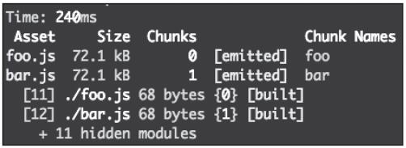

#### 3.1.2 配置插件提取公共模块

修改webpack.config.js，引入并配置CommonsChunkPlugin：

```javascript
const webpack = require('webpack');
module.exports = {
    entry: {
        foo: './foo.js',
        bar: './bar.js',
    },
    output: {
        filename: '[name].js',
    },
    plugins: [
        new webpack.optimize.CommonsChunkPlugin({
            name: 'commons',
            filename: 'commons.js',
        })
    ],
};
```

核心配置项说明：

- name：指定公共chunk的名称；
- filename：提取后资源的文件名。

打包结果如图2所示，新增commons.js文件，foo.js和bar.js体积从72.1kB降至不足1kB（react及依赖被提取到commons.js）。
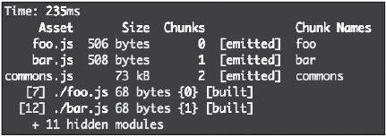

**注意**：需在页面中先引入commons.js，再引入其他业务JS，确保公共模块先加载。

### 3.2 进阶配置：精准控制提取逻辑

#### 3.2.1 提取vendor（第三方类库）

即使是单入口应用，也可通过单独创建vendor入口提取第三方类库：

```javascript
// webpack.config.js
const webpack = require('webpack');
module.exports = {
    entry: {
        app: './app.js',
        vendor: ['react'],
    },
    output: {
        filename: '[name].js',
    },
    plugins: [
        new webpack.optimize.CommonsChunkPlugin({
            name: 'vendor',
            filename: 'vendor.js',
        })
    ],
};

// app.js
import React from 'react';
document.write('app.js', React.version);
```

打包结果如图3所示，react被提取到vendor.js中，实现业务代码与第三方库的分离。
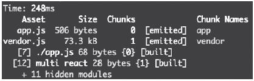

#### 3.2.2 设置提取范围（chunks配置）

通过chunks配置项可指定从哪些入口提取公共模块，示例如下：

```javascript
// webpack.config.js
const webpack = require('webpack');
module.exports = {
    entry: {
        a: './a.js',
        b: './b.js',
        c: './c.js',
    },
    output: {
        filename: '[name].js',
    },
    plugins: [
        new webpack.optimize.CommonsChunkPlugin({
            name: 'commons',
            filename: 'commons.js',
            chunks: ['a', 'b'],
        })
    ],
};
```

上述配置仅从a.js和b.js中提取公共模块，打包结果如图4所示。
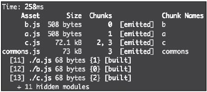

**适用场景**：大型多页面应用（数十个入口），可配置多个CommonsChunkPlugin，为每个插件指定不同提取范围，提升拆分精准度。

#### 3.2.3 设置提取规则（minChunks配置）

CommonsChunkPlugin默认规则：模块被2个入口chunk引用即被提取。通过minChunks可自定义提取规则，支持数字、Infinity、函数三种类型：

##### （1）数字类型

minChunks设为n时，仅当模块被n个入口引用时才提取（数组形式入口的模块不受此阈值影响）。示例：

```javascript
// webpack.config.js
const webpack = require('webpack');
module.exports = {
    entry: {
        foo: './foo.js',
        bar: './bar.js',
        vendor: ['react'],
    },
    output: {
        filename: '[name].js',
    },
    plugins: [
        new webpack.optimize.CommonsChunkPlugin({
            name: 'vendor',
            filename: 'vendor.js',
            minChunks: 3,
        })
    ],
};

// foo.js
import React from 'react';
import './util';
document.write('foo.js', React.version);

// bar.js
import React from 'react';
import './util';
document.write('bar.js', React.version);

// util.js
console.log('util');
```

上述配置中，minChunks=3，util.js仅被2个入口引用，因此不会被提取到vendor.js；而react作为数组形式入口的模块，仍会被提取。

##### （2）Infinity类型

设为无穷大时，所有模块都不会被提取，核心用途有两个：

1. 仅提取数组型入口指定的模块，完全可控提取范围；
2. 提取Webpack运行时（runtime）生成manifest文件，优化长效缓存（详见3.2.4）。

##### （3）函数类型

通过自定义函数细粒度控制提取逻辑，模块经函数处理返回true时被提取：

```javascript
new webpack.optimize.CommonsChunkPlugin({
    name: 'vendor',
    filename: 'vendor.js',
    minChunks: function(module, count) {
        // module.context 模块目录路径
        if(module.context && module.context.includes('node_modules')) {
            return true;
        }

        // module.resource 包含模块名的完整路径
        if(module.resource && module.resource.endsWith('util.js')) {
            return true;
        }

        // count 为模块被引用的次数
        if(count > 5) {
            return true;
        }
    },
}),
```

上述配置可提取：node_modules目录下的模块、util.js、被引用超过5次的模块。

### 3.3 hash与长效缓存：提取运行时（manifest）

CommonsChunkPlugin提取的公共资源包含Webpack运行时（初始化环境的代码，如模块缓存对象、加载函数），早期Webpack中运行时包含数字型模块ID，模块ID变动会导致chunk hash变化，破坏客户端缓存。

**解决方案**：将运行时单独提取为manifest文件，配置示例：

```javascript
// webpack.config.js
const webpack = require('webpack');
module.exports = {
    entry: {
        app: './app.js',
        vendor: ['react'],
    },
    output: {
        filename: '[name].js',
    },
    plugins: [
        new webpack.optimize.CommonsChunkPlugin({
            name: 'vendor',
        }),
        new webpack.optimize.CommonsChunkPlugin({
            name: 'manifest',
        })
    ],
};
```

打包结果如图5所示，新增manifest.js文件，专门存放运行时代码。
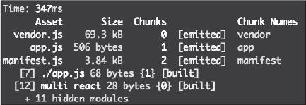

**注意**：manifest的CommonsChunkPlugin必须配置在最后，否则无法正常提取模块；页面中需最先引入manifest.js初始化Webpack环境：

```html
<!-- index.html -->
<script src="dist/manifest.js"></script>
<script src="dist/vendor.js"></script>
<script src="dist/app.js"></script>
```

此方式下，app.js的变动仅影响manifest.js（体积极小），vendor.js的内容和hash保持稳定，可被客户端长期缓存。

### 3.4 CommonsChunkPlugin的不足

CommonsChunkPlugin虽能满足基础场景，但存在以下缺陷：

1. 一个插件仅能提取一个vendor，提取多个需配置多个插件，增加重复代码；
2. manifest文件会增加浏览器的资源加载数量，影响页面渲染速度；
3. 破坏原有Chunk的模块依赖关系，异步Chunk场景下无法正常工作。示例：

```javascript
// webpack.config.js
const webpack = require('webpack');
module.exports = {
    entry: './foo.js',
    output: {
        filename: 'foo.js',
    },
    plugins: [
        new webpack.optimize.CommonsChunkPlugin({
            name: 'commons',
            filename: 'commons.js',
        })
    ],
};

// foo.js
import React from 'react';
import('./bar.js');
document.write('foo.js', React.version);

// bar.js
import React from 'react';
document.write('bar.js', React.version);
```

打包结果如图6所示，react未被提取到commons.js中，仍保留在foo.js里。
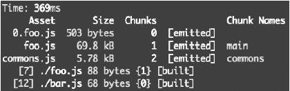

## 四、SplitChunksPlugin：Webpack 4+的声明式代码分片

optimization.SplitChunks（简称SplitChunks）是Webpack 4为改进CommonsChunkPlugin设计的新特性，功能更强、使用更简单，可自动处理异步Chunk的公共模块提取。

### 4.1 基础使用示例：解决异步Chunk提取问题

针对3.4中CommonsChunkPlugin失效的场景，改用SplitChunks配置：

```javascript
// webpack.config.js
module.exports = {
    entry: './foo.js',
    output: {
        filename: 'foo.js',
        publicPath: '/dist/',
    },
    mode: 'development',
    optimization: {
        splitChunks: {
            chunks: 'all',
        },
    },
};

// foo.js
import React from 'react';
import('./bar.js');
document.write('foo.js', React.version);

// bar.js
import React from 'react';
console.log('bar.js', React.version);
```

核心配置说明：

- optimization.splitChunks替代CommonsChunkPlugin，chunks: 'all'表示对所有Chunk（同步+异步）生效（默认仅对异步Chunk生效）；
- mode: 'development'为Webpack 4新增配置，自动适配开发环境的默认配置。

打包结果如图7所示，react被提取到vendors~main.foo.js中，解决了异步Chunk的公共模块提取问题。
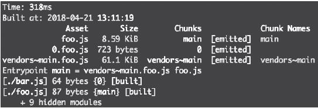

### 4.2 从命令式到声明式：SplitChunks的提取逻辑

CommonsChunkPlugin是“命令式”配置（指定提取哪些入口/模块），而SplitChunks是“声明式”配置（设置提取条件，满足条件自动提取）。

#### 4.2.1 默认提取条件

SplitChunks默认仅提取满足以下所有条件的模块：

1. 模块可被共享，或来自node_modules目录；
2. 提取后的JS Chunk体积>30kB（压缩前），CSS Chunk体积>50kB（压缩前）；
3. 按需加载时，并行请求数≤5；
4. 首次加载时，并行请求数≤3。

以4.1的示例验证条件：

- react来自node_modules，满足条件1；
- react体积>30kB，满足条件2；
- 按需加载并行请求数=1（0.foo.js），满足条件3；
- 首次加载并行请求数=2（foo.js + vendors~main.foo.js），满足条件4。

#### 4.2.2 默认的异步提取（无需额外配置）

SplitChunks默认对异步Chunk生效，无需配置即可提取异步模块中的公共依赖。示例：

```javascript
// webpack.config.js
module.exports = {
    entry: './foo.js',
    output: {
        filename: 'foo.js',
        publicPath: '/dist/',
    },
    mode: 'development',
};

// foo.js
import('./bar.js');
console.log('foo.js');

// bar.js
import lodash from 'lodash';
console.log(lodash.flatten([1, [2, 3]]));
```

打包结果如图8所示，lodash被提取到1.foo.js中，foo.js生成0.foo.js（bar.js）和1.foo.js（lodash）。
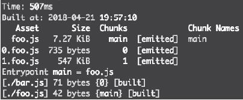

验证默认条件：

- lodash来自node_modules，满足条件1；
- lodash体积>30kB，满足条件2；
- 按需加载并行请求数=2（0.foo.js + 1.foo.js），满足条件3；
- 首次加载并行请求数=1（foo.js），满足条件4。

### 4.3 SplitChunks核心配置解析

SplitChunks的默认配置如下，可根据业务需求自定义：

```javascript
splitChunks: {
    chunks: "async", // 匹配模式：async（仅异步）、initial（仅入口）、all（所有）
    minSize: { // 最小体积阈值
      javascript: 30000,
      style: 50000,
    },
    maxSize: 0, // 最大体积（0表示不限制）
    minChunks: 1, // 最小引用次数
    maxAsyncRequests: 5, // 按需加载最大并行请求数
    maxInitialRequests: 3, // 首次加载最大并行请求数
    automaticNameDelimiter: '~', // chunk名称分隔符
    name: true, // 自动生成chunk名称
    cacheGroups: { // 提取规则组
        vendors: { // 提取node_modules模块
            test: /[\\/]node_modules[\\/]/,
            priority: -10, // 优先级（数值越高优先级越高）
        },
        default: { // 提取被多次引用的模块
            minChunks: 2,
            priority: -20,
            reuseExistingChunk: true, // 复用已存在的chunk
        },
    },
},
```

**关键配置说明**：

- cacheGroups：拆分规则的核心，可新增/修改/禁用（置为false）规则；
- priority：模块匹配多个cacheGroups时，按优先级选择（数值越高优先级越高）；
- reuseExistingChunk：避免重复提取，复用已有的公共chunk。

## 五、资源异步加载：按需加载的实现原理

资源异步加载（按需加载）可将暂时不用的模块延迟加载，减小首屏资源体积，Webpack推荐使用import()函数实现（替代旧的require.ensure）。

### 5.1 import()函数：异步加载的核心方式

ES6的import语法要求在顶层作用域，而Webpack的import()函数可在任意位置调用，返回Promise对象，加载模块及其依赖。

#### 5.1.1 基础示例：从同步加载到异步加载

**同步加载（首屏加载冗余）**：

```javascript
// foo.js
import { add } from './bar.js';
console.log(add(2, 3));

// bar.js
export function add(a, b) {
    return a + b;
}
```

**异步加载（延迟加载bar.js）**：

```javascript
// foo.js
import('./bar.js').then(({ add }) => {
    console.log(add(2, 3));
});

// bar.js
export function add(a, b) {
    return a + b;
}
```

#### 5.1.2 配置publicPath：指定异步资源路径

异步加载的资源是“间接资源”（由首屏JS动态加载），需配置output.publicPath指定资源路径：

```javascript
module.exports = {
    entry: {
        foo: './foo.js'
    },
    output: {
        publicPath: '/dist/', // 异步资源的基础路径
        filename: '[name].js',
    },
    mode: 'development',
    devServer: {
        publicPath: '/dist/',
        port: 3000,
    },
};
```

#### 5.1.3 异步加载的实现原理

import()函数的底层原理是：通过JavaScript动态在页面head标签插入script标签（如/dist/0.js），加载异步模块。

- Network面板可看到0.js的请求，Initiator为foo.js（如图9）；
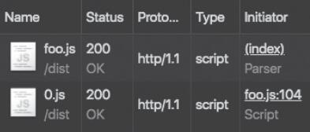
- Elements面板可看到动态插入的script标签（如图10）。
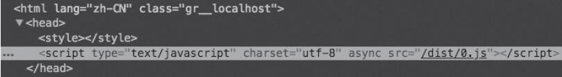

#### 5.1.4 动态异步加载：按需触发

import()函数可在条件判断、事件回调等场景调用，实现动态加载：

```javascript
if (condition) {
    import('./a.js').then(a => {
        console.log(a);
    });
} else {
    import('./b.js').then(b => {
        console.log(b);
    });
}
```

**典型应用**：路由切换时加载对应组件，大幅减小首屏资源体积。

### 5.2 异步chunk的命名配置

默认情况下，异步chunk的名称是数字ID（如0.js），可读性差，可通过以下配置自定义名称：

#### 5.2.1 配置output.chunkFilename

指定异步chunk的文件名规则：

```javascript
// webpack.config.js
module.exports = {
    entry: {
        foo: './foo.js',
    },
    output: {
        publicPath: '/dist/',
        filename: '[name].js',
        chunkFilename: '[name].js', // 异步chunk文件名规则
    },
    mode: 'development',
};
```

#### 5.2.2 魔法注释：指定异步chunk名称

在import()函数中添加webpackChunkName注释，指定chunk名称：

```javascript
// foo.js
import(/* webpackChunkName: "bar" */ './bar.js').then(({ add }) => {
    console.log(add(2, 3));
});
```

打包结果如图11所示，异步chunk被命名为bar.js，而非默认的数字ID。
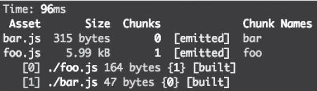

## 本篇核心知识点速记

1. 代码分片核心目标：减小首屏资源体积，提升缓存利用率，优先加载核心资源；
2. 入口划分是基础分片方式，适用于简单场景，缺点是依赖树隔离、配置复杂；
3. CommonsChunkPlugin（Webpack 4前）：命令式提取公共模块，支持提取范围、提取规则配置，需单独提取manifest优化缓存，但异步Chunk支持差；
4. SplitChunksPlugin（Webpack 4+）：声明式配置，默认满足4个条件自动提取，支持同步/异步Chunk，配置更简洁、功能更强；
5. 异步加载通过import()函数实现，需配置publicPath指定资源路径，通过魔法注释+chunkFilename自定义异步chunk名称；
6. 长效缓存优化关键：提取Webpack运行时（manifest），避免业务代码变动影响第三方库的hash。
