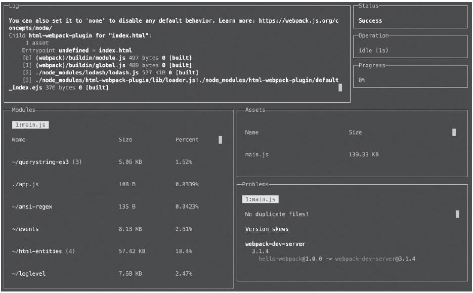
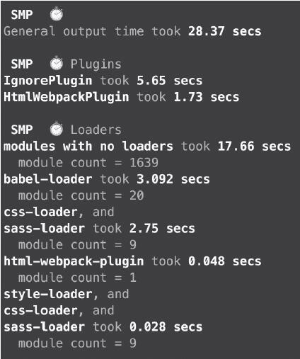
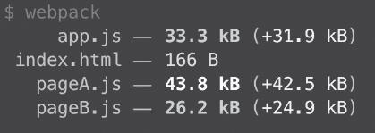
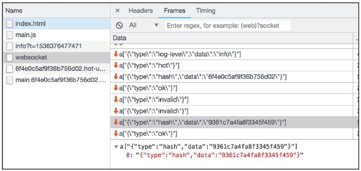
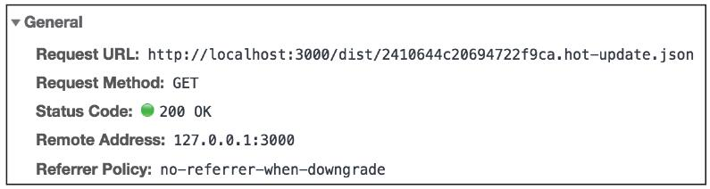
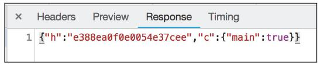
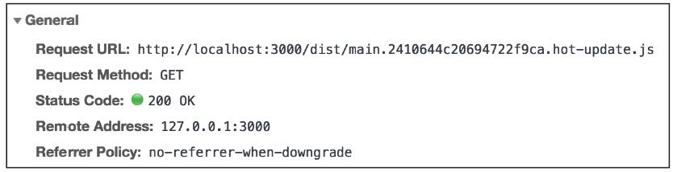
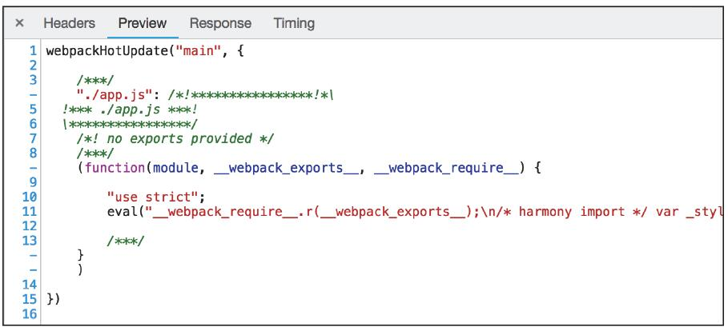
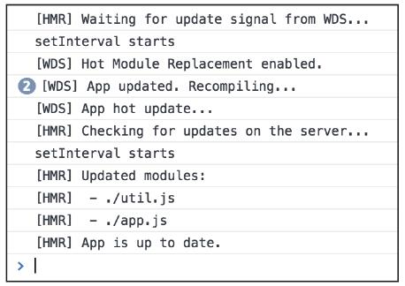

在前端工程化落地过程中，Webpack的开发效率直接影响日常研发节奏。本篇聚焦Webpack开发环境调优方向，系统讲解提升开发效率的核心插件与模块热替换（HMR）的使用及底层原理，学完后可快速落地高效的Webpack开发配置，大幅降低调试成本、提升开发体验。

### 【本篇核心收获】

- 掌握4款核心Webpack效率插件的安装、配置与核心作用，解决打包信息可视化、多环境配置合并、构建性能分析、资源体积监控问题
- 理解模块热替换（HMR）的核心价值，掌握手动开启HMR的完整配置步骤与第三方工具集成方式
- 吃透HMR的底层工作原理，包括客户端与服务端的通信机制、资源更新拉取流程
- 学会使用HMR API针对不同模块定制热更新策略，规避热更新导致的运行时问题
- 能够基于实战场景定位Webpack构建性能瓶颈，从开发环节优化整体研发效率

## 一、Webpack开发效率插件

Webpack拥有丰富的生态系统，社区插件可从不同维度增强其能力。以下聚焦4款高频使用的插件，覆盖打包信息可视化、多环境配置、构建性能分析、资源体积监控核心场景，解决日常开发中的效率痛点。

### 1.1 webpack-dashboard：打包信息可视化

Webpack默认打包完成后会在控制台输出列表形式的日志信息，内容分散、不够直观。`webpack-dashboard`将这些信息拆分为多面板展示，清晰呈现日志、模块体积、构建警告/错误等核心内容。

#### 安装与配置步骤

1. 安装插件

```bash
npm install webpack-dashboard
```

1. 添加到Webpack配置

```javascript
const DashboardPlugin = require('webpack-dashboard/plugin');
module.exports = {
  entry: './app.js',
  output: {
    filename: '[name].js',
  },
  mode: 'development',
  plugins: [
    new DashboardPlugin()
  ],
};
```

1. 修改启动命令
需将`webpack-dashboard`作为命令前缀，原启动命令作为参数传入。例如原`package.json`启动脚本：

```json
{
  "scripts": {
    "dev": "webpack-dev-server"
  }
}
```

修改后：

```json
{
  "scripts": {
    "dev": "webpack-dashboard -- webpack-dev-server"
  }
}
```

启动后的效果如图1所示。


`webpack-dashboard`控制台分为多个面板：左上角Log面板展示Webpack原生日志，下方Modules面板呈现参与打包的模块及体积占比，右下方Problems面板展示构建过程中的警告和错误。

### 1.2 webpack-merge：多环境配置智能合并

对于多环境（本地/测试/生产）的项目，需提取公共配置并差异化合并。传统`Object.assign`无法精准替换配置项，易导致代码冗余，`webpack-merge`可通过`smart`合并策略，按`test`标识符精准覆盖规则，解决配置冗余问题。

#### 安装与使用步骤

1. 安装插件

```bash
npm install webpack-merge
```

1. 定义公共配置（webpack.common.js）

```javascript
// webpack.common.js
module.exports = {
  entry: './app.js',
  output: {
    filename: '[name].js',
  },
  module: {
    rules: [
      {
        test: /\.(png|jpg|gif)$/,
        use: 'file-loader',
      },
      {
        test: /\.css$/,
        use: [
          'style-loader',
          'css-loader'
        ],
      }
    ],
  },
};
```

1. 生产环境差异化配置（webpack.prod.js）
传统`Object.assign`方式需重复编写完整`module.rules`：

```javascript
// webpack.prod.js（Object.assign方式，冗余）
const commonConfig = require('./webpack.common.js');
const ExtractTextPlugin = require('extract-text-webpack-plugin');

module.exports = Object.assign(commonConfig, {
  mode: 'production',
  module: {
    rules: [
      {
        test: /\.(png|jpg|gif)$/,
        use: 'file-loader',
      },
      {
        test: /\.css$/,
        use: ExtractTextPlugin.extract({
          fallback: 'style-loader',
          use: 'css-loader',
        }),
      }
    ],
  },
});
```

使用`webpack-merge.smart`可精准覆盖CSS规则，无需重复编写其他规则：

```javascript
// webpack.prod.js（webpack-merge方式，精简）
const merge = require('webpack-merge');
const commonConfig = require('./webpack.common.js');
const ExtractTextPlugin = require('extract-text-webpack-plugin');

module.exports = merge.smart(commonConfig, {
  mode: 'production',
  module: {
    rules: [
      {
        test: /\.css$/,
        use: ExtractTextPlugin.extract({
          fallback: 'style-loader',
          use: 'css-loader',
        }),
      }
    ]
  },
});
```

`webpack-merge`的`smart`策略会以`test`为标识符，用新规则覆盖旧规则，大幅减少配置冗余。更多复杂场景可参考官方文档：<https://github.com/survivejs/webpack-merge>

### 1.3 speed-measure-webpack-plugin：构建性能瓶颈分析

若Webpack构建速度慢，`speed-measure-webpack-plugin`（简称SMP）可精准统计每个loader、plugin的耗时，帮助定位性能瓶颈。

#### 安装与使用步骤

1. 安装插件

```bash
npm install speed-measure-webpack-plugin
```

1. 包裹Webpack配置

```javascript
// webpack.config.js
const SpeedMeasurePlugin = require('speed-measure-webpack-plugin');
const smp = new SpeedMeasurePlugin();
module.exports = smp.wrap({
  entry: './app.js',
  // 其他配置...
});
```

执行Webpack构建命令，将会输出SMP的时间测量结果，如图2所示。


通过测量结果可快速定位耗时较长的构建步骤，针对性优化后可反复测试验证效果。

### 1.4 size-plugin：资源体积变化监控

随着项目迭代，打包产物体积易逐渐臃肿，`size-plugin`可监控每次构建的资源体积（gzip压缩后），并对比上一次构建的体积变化，提前发现资源膨胀问题。

#### 安装与配置步骤

1. 安装插件

```bash
npm install size-plugin
```

1. 添加到Webpack配置

```javascript
const path = require('path');
const SizePlugin = require('size-plugin');

module.exports = {
  entry: './app.js',
  output: {
    path: path.join(__dirname, 'dist'),
    filename: '[name].js',
  },
  mode: 'production',
  plugins: [
    new SizePlugin(),
  ],
};
```

在每次执行Webpack打包命令后，size-plugin都会输出本次构建的资源体积（gzip过后），以及与上次构建相比体积变化了多少，如图3所示。


> 注意：该插件暂不支持将体积对比结果输出为文件，无法直接在持续集成平台对比，但其功能仍在迭代完善中。

### 本模块小结

本模块介绍了4款核心效率插件：`webpack-dashboard`可视化打包信息，`webpack-merge`智能合并多环境配置，`speed-measure-webpack-plugin`分析构建耗时，`size-plugin`监控资源体积变化。可根据项目需求组合使用，从配置层面提升Webpack开发效率。

## 二、模块热替换（HMR）

早期前端开发需手动刷新页面验证代码改动，live reload可实现自动刷新，但仍需重新加载页面；Webpack的模块热替换（Hot Module Replacement，HMR）可在不刷新页面的前提下更新代码，保留页面当前状态，尤其适用于大型应用，大幅降低调试成本。

### 2.1 开启HMR的条件与配置

HMR需手动开启，且依赖`webpack-dev-server`或`webpack-dev-middle`（Webpack原生命令行不支持）。

#### 核心配置步骤

1. 添加HMR插件并开启devServer热更新

```javascript
const webpack = require('webpack');
module.exports = {
  // 其他配置...
  plugins: [
    new webpack.HotModuleReplacementPlugin()
  ],
  devServer: {
    hot: true,
  },
};
```

配置后，Webpack会为每个模块绑定`module.hot`对象（HMR API），可通过该API控制热更新逻辑。

#### HMR API的使用方式

- 手动调用：适用于简单场景，直接在入口文件添加API调用，使入口及依赖模块支持热更新：

  ```javascript
  // index.js（入口文件）
  import { add } from 'util.js';
  add(2, 3);

  if (module.hot) {
    module.hot.accept(); // 开启当前模块及依赖的热更新
  }
  ```

- 第三方工具集成：复杂场景建议使用成熟工具（如`react-hot-loader`、`vue-loader`），这些工具已封装HMR逻辑，可避免手动处理的兼容性问题。

### 2.2 HMR底层工作原理

开启HMR后打包产物体积会增大，因Webpack注入了大量HMR相关代码。其核心是客户端从服务端拉取`chunk diff`（chunk的更新部分），整体流程分为4步：

#### 步骤1：监听文件变化并推送更新事件

`webpack-dev-server`（WDS）作为服务端，监听本地源文件变化；WDS与浏览器之间维护`websocket`连接，文件变化时，WDS向浏览器推送更新事件（含本次构建的hash），客户端通过hash比对避免冗余更新（如仅修改空行不会触发更新）。

websocket发送的事件列表如图4所示。


> 注意：websocket并非HMR独有，live reload也依赖该机制，因此开启多个页面时，代码改动会同步更新所有页面。

#### 步骤2：请求改动模块列表

客户端比对hash发现差异后，向WDS发起请求（地址为`[hash].hot-update.json`），获取需更新的chunk列表。

- 请求地址示例如图5所示：
  
- WDS返回的改动chunk信息示例如图6所示：
  

#### 步骤3：拉取chunk增量更新

客户端根据返回的chunk名称和版本，请求对应的增量更新内容。

- 请求URL示例（含chunk name与版本信息）如图7所示：
  
- 增量更新接口返回值示例如图8所示：
  

#### 步骤4：处理增量更新

客户端获取chunk更新后，需通过HMR API（如`module.hot.accept`）处理更新逻辑（哪些状态保留、哪些更新）。Webpack仅提供API，具体处理逻辑需开发者或第三方工具（如`react-hot-loader`）实现。

### 2.3 HMR API实战示例

以下通过简单案例演示HMR API的使用，以及如何规避热更新导致的运行时问题。

#### 基础案例代码

```javascript
// index.js（入口）
import { logToScreen } from './util.js';
let counter = 0;
console.log('setInteval starts');
setInterval(() => {
  counter += 1;
  logToScreen(counter);
}, 1000);

// util.js
export function logToScreen(content) {
  document.body.innerHTML = `content: ${content}`;
}
```

该案例实现“每秒在页面输出递增整数”的功能。

#### 简单开启HMR的问题

直接添加`module.hot.accept()`会导致重复创建`setInterval`：

```javascript
// index.js
import { add } from 'util.js';
add(2, 3);

if (module.hot) {
  module.hot.accept(); // 开启当前模块及依赖的热更新
}
```

热更新后，原有`setInterval`未清除，新的`setInterval`会叠加，页面数字会乱跳。从图9中的console信息可以看出setInterval确实执行了多次。


#### 精细化控制HMR策略

通过`module.hot.decline`禁用当前模块热更新（改动时刷新页面），仅对指定依赖开启热更新：

```javascript
// index.js
import { logToScreen } from './util.js';
let counter = 0;
console.log('setInteval starts');
setInterval(() => {
  counter += 1;
  logToScreen(counter);
}, 1000);

if (module.hot) {
  module.hot.decline(); // 禁用当前模块的HMR，改动时刷新页面
  module.hot.accept(['./util.js']); // 仅util.js改动时开启HMR
}
```

该配置既保证`util.js`的热更新生效，又避免`index.js`改动导致的`setInterval`重复问题。

> 提示：更多HMR API可参考Webpack官方文档，需根据业务场景定制热更新逻辑。

### 本模块小结

HMR的核心是无刷新更新代码，依赖`webpack-dev-server`的websocket通信和`chunk diff`拉取机制；通过`module.hot` API可精细化控制热更新策略，复杂场景建议使用第三方工具封装的HMR逻辑，避免运行时异常。

## 【本篇核心知识点速记】

1. 效率插件：`webpack-dashboard`可视化打包信息，`webpack-merge`智能合并多环境配置，`speed-measure-webpack-plugin`分析构建耗时，`size-plugin`监控资源体积变化；
2. HMR核心条件：依赖`webpack-dev-server`/`webpack-dev-middle`，需配置`HotModuleReplacementPlugin`和`devServer.hot: true`；
3. HMR API：`module.hot.accept`开启指定模块热更新，`module.hot.decline`禁用当前模块热更新，复杂场景优先使用`react-hot-loader`等第三方工具；
4. HMR原理：WDS监听文件变化→推送hash→客户端请求改动列表→拉取chunk增量更新→通过API处理更新逻辑；
5. 实战要点：使用HMR时需管控运行时状态（如定时器、事件监听），避免热更新导致的逻辑异常。
