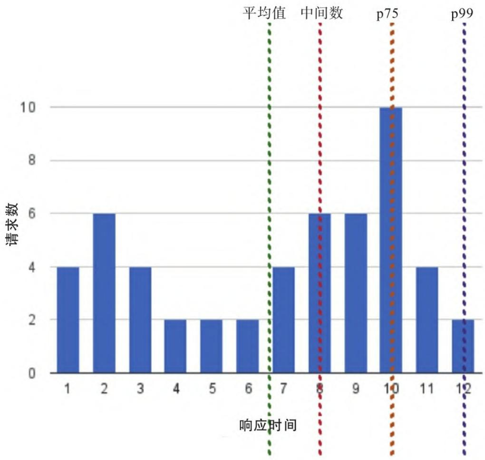

监控是保障技术系统稳定运行、支撑业务持续发展的核心能力，而 Prometheus 作为开源监控领域的标杆工具，其设计思想和使用方式都建立在对监控本质的深刻理解之上。本文将从监控的核心价值、反模式与设计原则、核心机制、指标体系、经典方法论等维度，为你夯实监控体系的基础，为后续 Prometheus 实战做好铺垫。

## 一、监控的核心价值：技术与业务的双重诉求

监控绝非简单的“看数据”，而是将系统/应用指标转化为业务价值的关键链路。一个完善的监控系统有两个核心“客户”：

### 1.1 技术视角：提前发现并解决问题

监控是运维、DevOps、SRE 团队的“眼睛”——通过实时采集数据，可检测、诊断、解决技术故障（尤其是用户感知前），同时为产品和技术决策提供数据支撑，验证资源投入的有效性。

### 1.2 业务视角：支撑业务持续运转

监控能输出业务相关的报告，帮助企业评估技术投资的价值，确保技术体系始终服务于业务目标，比如通过用户侧指标反映产品体验，最终推动业务增长。

## 二、监控的反模式与设计原则：避开坑，建标准

落地监控时，很多团队会陷入“看似监控了，实则没价值”的误区，以下是典型反模式及对应的解决方案，也是优秀监控系统的设计原则。

### 2.1 常见监控反模式

| 反模式类型 | 核心问题 | 解决方案 |
|------------|----------|----------|
| 事后监控 | 把监控当“增值组件”，项目收尾才考虑 | 监控融入应用设计、开发、部署全生命周期，提前定义各组件监控指标 |
| 机械式监控 | 复用旧检查逻辑，忽略新系统/应用的核心价值 | 自上而下设计监控：从业务逻辑→应用逻辑→基础设施，优先监控高价值模块 |
| 不够准确的监控 | 仅监控表面状态（如HTTP 200），忽略业务正确性 | 监控业务事务内容/速率，而非仅监控底层服务存活状态 |
| 静态监控 | 依赖固定阈值（如CPU>80%告警），忽略系统动态性 | 基于数据窗口分析，结合智能算法动态调整阈值 |
| 不频繁的监控 | 检查周期过长（5~15分钟/次），丢失关键事件 | 高频采集数据，保留足够历史数据，识别故障、趋势和性能问题 |
| 缺少自动化/自服务 | 监控部署/配置手动化，开发/运维使用门槛高 | 配置管理自动化、服务自动发现、插件化埋点、数据可视化自服务 |

### 2.2 优秀监控系统的核心特征

一个有价值的监控系统需具备：

- 全局视角：从业务顶层向下覆盖全链路；
- 故障诊断能力：可定位问题根因；
- 多角色支撑：为研发、运维、业务人员提供数据；
- 全生命周期融入：设计阶段即规划监控；
- 自动化+自服务：降低使用和维护成本。

> 补充：监控的“良好设计”与“可观察性”高度重叠，后者是监控理念的延伸，核心是通过数据全面理解系统状态。

## 三、监控的核心机制：从采集方式到数据类型

### 3.1 监控采集方式：探针（黑盒）vs 内省（白盒）

监控应用的核心方式分为两种，建议组合使用：

- **探针监控（黑盒监控）**：从外部检测应用状态，比如 ICMP 检查、端口监听、HTTP 状态码校验。优势是无需侵入应用，适合第三方服务监控；缺点是仅能反映表面可用性。
- **内省监控（白盒监控）**：从应用内部采集数据（如埋点、内部组件状态、事务性能）。优势是能反映应用真实运行状态，提供丰富上下文；是 Prometheus 推荐的核心方式。

### 3.2 数据获取模式：拉取（Pull）vs 推送（Push）

- **拉取模式**：监控系统主动从应用/主机的指标端点抓取数据（Prometheus 核心模式）；
- **推送模式**：应用主动将数据发送给监控系统；
- 两者无绝对优劣，Prometheus 以拉取为主，也支持通过网关接收推送数据。

### 3.3 监控数据类型：指标（核心）与日志

监控工具采集的数据主要分两类：

- **指标**：时间序列数据，记录应用/系统的状态度量，是 Prometheus 的核心处理对象；
- **日志**：应用产生的文本事件，适合故障诊断（如 ELK 堆栈），本文重点聚焦指标。

## 四、指标：监控体系的核心载体

Prometheus 颠覆了“指标仅为故障检测补充”的传统思路，将指标作为监控的核心。理解指标的本质、类型和分析方法，是用好监控的关键。

### 4.1 指标的本质：时间序列数据

指标是软硬件组件的属性度量，通过“观察点”（值+时间戳+标签）记录状态，多个观察点按时间排列形成**时间序列**。

- 颗粒度（采集间隔）：过粗会丢失细节（如5分钟采集CPU无法发现瞬时峰值），过细会增加存储/分析成本，需按需选择；
- 可视化：时间序列数据通常以“时间（X轴）+数值（Y轴）”的二维图表呈现，直观反映趋势和异常。

### 4.2 核心指标类型

| 指标类型 | 定义 | 典型示例 | 核心价值 |
|----------|------|----------|----------|
| 测量型（Gauge） | 可上下增减的数值快照 | CPU使用率、内存占用、在线用户数 | 反映“当前状态” |
| 计数型（Counter） | 只增不减（可重置）的数值 | 系统运行时长、收发包字节数、订单数 | 计算变化率（如每秒登录次数） |
| 直方图（Histogram） | 采样数据的频率分布（分箱） | 应用响应时间分布 | 展现数据分布特征，适合延迟类指标 |
| 摘要型（Summary） | 类似直方图，额外计算百分位数 | 95%请求响应时间 | 直接反映数据的分位特征 |

### 4.3 指标分析：别只看平均值

指标分析的核心是通过统计方法挖掘数据价值，但不同方法的适用场景差异极大：

#### （1）平均值：易掩盖异常

平均值计算简单，但假设数据呈正态分布，而真实系统中（如请求响应时间）往往存在极端值，导致“平均响应时间正常，却有大量用户体验极差”。
> 经典案例：统计学家跳进“平均深度10英寸”的湖差点淹死——因为湖中有深水区，平均值无法反映真实风险。

#### （2）中位数（50百分位数）：仍有局限

中位数是数据的几何中点（50%值低于它，50%高于它），但同样在非正态分布场景下效果有限。

#### （3）标准差：仅适用于正态分布

标准差衡量数据离散程度，但只有数据符合“68-95-99.7法则”（正态分布）时，才能有效识别异常（如超过2个标准差的事件）。

#### （4）百分位数：最适合监控的分析方法

百分位数（如p95、p99）能清晰展现数据分布：

- 例：p99响应时间=10ms → 99%的请求在10ms内完成，1%超过10ms；
- 实战建议：监控延迟类指标时，组合展示「p50 + p99 + 最大值」，既反映整体情况，也能捕捉异常。

**图1：响应时间的平均值、中间数和百分位数示例**

## 五、经典监控方法论：USE与Google四大黄金指标

落地监控时，无需盲目采集所有指标，可基于成熟方法论聚焦核心维度：

### 5.1 USE方法：主机级监控的核心

由Netflix工程师Brendan Gregg提出，核心是：**针对每个硬件/软件资源，检查使用率、饱和度、错误**。

- 资源：CPU、内存、磁盘、网络等；
- 使用率：资源忙的时间占比（百分比）；
- 饱和度：资源排队等待的工作数（队列长度）；
- 错误：资源错误事件计数；
- 实战：按资源清单逐一检查，快速定位主机级性能瓶颈。

### 5.2 Google四大黄金指标：应用级监控的核心

来自Google SRE手册，聚焦应用/用户侧核心指标：

- 延迟：服务请求耗时（需区分成功/失败请求）；
- 流量：系统负载（如每秒HTTP请求数、数据库事务数）；
- 错误：请求失败率（显式失败：HTTP 500；隐式失败：返回错误内容）；
- 饱和度：应用资源饱和程度（如内存使用率、磁盘填充速率）；
- 补充：衍生的RED方法（Rate、Error、Duration）更适配微服务场景。

## 六、警报与通知：监控的最终输出

监控的最终价值是“发现问题并推动解决”，警报（指标触发事件）和通知（将事件告知人/系统）是关键环节，设计时需明确：

- 哪些问题需要通知（避免无效告警）；
- 谁需要被通知（按职责划分）；
- 如何通知（邮件、短信、工单等）；
- 通知频率与升级规则（避免告警疲劳）；
- 通知内容：简洁、清晰、可操作（例：避免“磁盘空间不足”，应明确“服务器A / 磁盘/dev/sda / 使用率95% / 剩余空间10GB”）。

## 总结

监控的本质是“用数据理解系统、支撑业务”，而非单纯的工具配置。本文梳理的监控核心价值、反模式与设计原则、指标体系、经典方法论，是后续学习Prometheus的基础——只有理解了监控“为什么做”，才能更好地掌握Prometheus“怎么做”。
