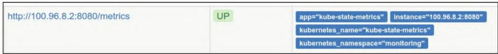

在云原生时代，Kubernetes（K8s）作为容器编排的事实标准，其自身及运行在其上的应用的监控至关重要。Prometheus凭借强大的时序数据采集、存储和告警能力，成为K8s监控的首选工具。本文将从实战角度，完整落地K8s集群的全栈监控方案，涵盖节点、核心组件（API Server、kube-state-metrics）、容器（cAdvisor）等维度，结合Prometheus的服务发现、配置管理、规则告警，打造一套可落地的K8s监控体系。

## 一、环境基础说明

### 1.1 目标K8s集群配置

本文实操的K8s集群信息如下：

- 集群名称：tornado.quicknuke.com
- 运行环境：AWS
- K8s版本：1.8.7
- 节点规模：3个主节点 + 6个工作节点（跨3个可用区）
- 构建工具：kops（集群创建命令参考如下）

```shell
$ kops create cluster \
--node-count 6 \
--zones us-east-2a,us-east-2b,us-east-2c \
--master-zones us-east-2a,us-east-2b,us-east-2c \
--node-size t2.micro \
--master-size t2.micro \
--topology private \
--networking kopeio-vxlan \
--api-loadbalancer-type=public \
--bastion \
tornadoquicknuke.com
```

### 1.2 Prometheus部署方式

为简化监控链路，将Prometheus也部署在目标K8s集群内，核心部署策略：

- 部署方式：手动创建Deployment + Service（而非Operator，避免版本兼容问题）；
- 配置管理：通过ConfigMap管理Prometheus配置、告警规则；
- 告警组件：部署3节点Alertmanager集群；
- 命名空间：所有监控组件统一部署在`monitoring`命名空间；
- 配置源码：可参考[官方示例](https://github.com/turnbullpress/prometheusbook-code/tree/master/12-13)。

## 二、监控K8s节点：Node Exporter落地

节点是K8s集群的物理基础，需采集CPU、内存、磁盘、系统服务等核心指标。本文采用DaemonSet部署Node Exporter（适配托管K8s场景，无需手动安装到节点）。

### 2.1 Node Exporter DaemonSet配置（核心）

DaemonSet确保每个节点（含主节点）运行一个Node Exporter Pod，核心配置如下（注意安全风险：需以root运行、挂载主机命名空间）：

```yaml
apiVersion: extensions/v1beta1  
kind: DaemonSet  
metadata:  
    name: node-exporter  
    namespace: monitoring  
spec:  
    tolerations:  
        - key: node-role.kubernetes.io/master  
          effect: NoSchedule  # 允许Pod调度到主节点
    template:
      spec:
        hostNetwork: true   # 共享主机网络命名空间
        hostPID: true       # 共享主机PID命名空间
        hostIPC: true       # 共享主机IPC命名空间
        securityContext: 
          runAsUser: 0      # root用户运行（兼容systemd采集）
        containers:  
        - image: prom/node-exporter:latest  
          name: node-exporter  
          volumeMounts:  
            - mountPath: /run/systemd/private  
              name: systemd-socket  
              readOnly: true  
          args:  # 仅监控核心systemd服务
            - --collector.systemd
            - --collector.systemd.unit-whitelist=(docker|ssh|rsyslog|kubelet).service
          ports:  
            - containerPort: 9100  
              hostPort: 9100  
              name: scrape 
          # 存活探针：失败则重启容器
          livenessProbe:  
            httpGet:  
                path: /metrics  
                port: 9100  
            initialDelaySeconds: 30  
            timeoutSeconds: 10  
            periodSeconds: 1  
          # 就绪探针：确认服务可提供指标
          readinessProbe:  
              failureThreshold: 5  
              httpGet:  
                  path: /metrics  
                  port: 9100  
              initialDelaySeconds: 10  
              timeoutSeconds: 10  
              periodSeconds: 2 
```

**关键说明**：

- `tolerations`：突破主节点的调度限制，确保主节点也部署Node Exporter；
- 主机命名空间挂载：需评估安全风险，若不可接受，可将Node Exporter直接安装到节点镜像；
- 探针配置：减少监控误报（如服务未就绪触发告警），并自动恢复故障容器。

### 2.2 Node Exporter Service配置

创建Service暴露9100端口，并通过注解标记为Prometheus可抓取目标：

```yaml
apiVersion: v1  
kind: Service  
metadata:  
    annotations:  
        prometheus.io/scrape: 'true'  # 标记为Prometheus可抓取
    labels:  
        app: node-exporter  
    name: node-exporter  
    namespace: monitoring  
spec:  
    clusterIP: None  # Headless Service，直接映射Pod IP
    ports:  
        - name: scrape  
          port: 9100  
          protocol: TCP  
    selector:  
        app: node-exporter  
    type: ClusterIP  # 仅集群内访问
```

### 2.3 部署与验证

```shell
# 1. 创建DaemonSet和Service
kubectl create -f ./node-exporter.yaml -n monitoring

# 2. 可选：设置默认命名空间（避免重复-n monitoring）
kubectl config set-context $(kubectl config current-context) --namespace=monitoring

# 3. 检查Pod（应等于节点数：9个）
kubectl get pods -n monitoring | grep node-exporter
# 示例输出：node-exporter-4fx57 1/1 Running 0 5s

# 4. 检查Service
kubectl get services -n monitoring | grep node-exporter
# 示例输出：node-exporter ClusterIP None <none> 9100/TCP 8s
```

### 2.4 Prometheus自动抓取配置（K8s服务发现）

通过Prometheus的K8s服务发现能力，自动抓取带`prometheus.io/scrape: 'true'`注解的Service端点，核心作业配置：

```yaml
- job_name: 'kubernetes-service-endpoints'
  kubernetes_sd_configs:
    - role: endpoints  # 发现所有K8s Service端点
  relabel_configs:
    # 仅保留scrape注解为true的目标
    - source_labels: [__meta_kubernetes_service_annotation_prometheus_io_scrape]
      action: keep
      regex: true
    # 替换抓取协议（http/https）
    - source_labels: [__meta_kubernetes_service_annotation_prometheus_io_scheme]
      action: replace
      target_label: __scheme__
      regex: (https?)
    # 替换metrics路径
    - source_labels: [__meta_kubernetes_service_annotation_prometheus_io_path]
      action: replace
      target_label: __metrics_path__
      regex: (.+)
    # 替换抓取端口
    - source_labels: [__meta_kubernetes_service_annotation_prometheus_io_port]
      action: replace
      target_label: __address__
      regex: ([^:]+)(?::\d+)?;(\d+)
      replacement: $1:$2
    # 映射Service标签到Prometheus标签
    - action: labelmap
      regex: __meta_kubernetes_service_label_(.+)
    # 补充命名空间/服务名标签
    - source_labels: [__meta_kubernetes_namespace]
      action: replace
      target_label: kubernetes_namespace
    - source_labels: [__meta_kubernetes_service_name]
      action: replace
      target_label: kubernetes_name
```

**配置生效步骤**：

```shell
# 1. 更新ConfigMap
kubectl replace -f ./prom-config-map-v1.yaml -n monitoring

# 2. 重启Prometheus Pod加载配置
kubectl delete pod -l app=prometheus-core -n monitoring
```

配置生效后，可在Prometheus Targets页面看到Node Exporter等端点：
**图12-1 Kubernetes端点目标**  


### 2.5 节点监控规则与告警

复用基础节点监控规则，新增K8s服务可用性告警：

```yaml
# 1. K8s服务不可用（抓取失败）
- alert: KubernetesServiceDown
  expr: up{job="kubernetes-service-endpoints"} == 0
  for: 10m
  labels:
    severity: critical
  annotations:
    summary: Pod {{ $labels.instance }} is down!

# 2. K8s服务全部消失
- alert: KubernetesServicesGone
  expr: absent(up{job="kubernetes-service-endpoints"}) 
  for: 10m
  labels:
    severity: critical
  annotations:
    summary: No Kubernetes services are reporting!
    description: All Kubernetes service endpoints are missing!

# 3. 核心系统服务故障（docker/ssh/kubelet等）
- alert: CriticalServiceDown
  expr: node_systemd_unit_state{state="active"} != 1
  for: 2m
  labels:
    severity: critical
  annotations:
    summary: {{ $labels.instance }}: Service {{ $labels.name }} failed to start.
    description: {{ $labels.instance }} failed to (re)start service {{ $labels.name }}.
```

## 三、监控K8s核心组件

### 3.1 kube-state-metrics：监控K8s工作负载

kube-state-metrics采集K8s资源（Deployment、Pod、Node等）的状态指标（如副本数、重启次数、部署版本），部署后依赖前文`kubernetes-service-endpoints`作业自动抓取。

#### 核心告警规则

```yaml
# 1. Deployment部署失败（版本不匹配）
- alert: DeploymentGenerationMismatch
  expr: kube_deployment_status_observed_generation != kube_deployment_metadata_generation
  for: 5m
  labels:
    severity: warning
  annotations:
    description: Observed deployment generation does not match expected one for deployment {{ $labels.namespace }}/{{ $labels.deployment }}
    summary: Deployment is outdated

# 2. Deployment副本未更新/不可用
- alert: DeploymentReplicasNotUpdated
  expr: ((kube_deployment_status_replicas_updated != kube_deployment_spec_replicas) or (kube_deployment_status_replicas_available != kube_deployment_spec_replicas)) unless (kube_deployment_spec_paused == 1)
  for: 5m
  labels:
    severity: warning
  annotations:
    description: Replicas are not updated and available for deployment {{ $labels.namespace }}/{{ $labels.deployment }}
    summary: Deployment replicas are outdated

# 3. Pod频繁重启
- alert: PodFrequentlyRestarting
  expr: increase(kube_pod_container_status_restarts_total[1h]) > 5
  for: 10m
  labels:
    severity: warning
  annotations:
    description: Pod {{ $labels.namespace }}/{{ $labels.pod }} was restarted {{ $value }} times within the last hour
    summary: Pod is restarting frequently
```

部署后，Prometheus Targets可看到kube-state-metrics端点：

### 3.2 监控K8s API Server

API Server是K8s集群的核心入口，需监控其延迟、错误率、可用性。

#### 3.2.1 Prometheus作业配置

```yaml
- job_name: 'kubernetes-apiservers'
  scheme: https
  tls_config:
    ca_file: /var/run/secrets/kubernetes.io/serviceaccount/ca.crt
    insecure_skip_verify: true  # 跳过证书校验（测试环境）
  bearer_token_file: /var/run/secrets/kubernetes.io/serviceaccount/token  # 自动挂载的服务账户令牌
  kubernetes_sd_configs:
    - role: endpoints
  relabel_configs:
    # 仅保留default命名空间的kubernetes服务（API Server）
    - source_labels: [__meta_kubernetes_namespace, __meta_kubernetes_service_name, __meta_kubernetes_endpoint_port_name]
      action: keep
      regex: default;kubernetes;https
```

#### 3.2.2 延迟计算规则（50/90/99百分位）

```yaml
- record: apiserver_latency_seconds:quantile
  expr: histogram_quantile(0.99, rate(apiserver_request_latencies_bucket[5m])) / 1e6
  labels:
    quantile: "0.99"
- record: apiserver_latency_seconds:quantile
  expr: histogram_quantile(0.9, rate(apiserver_request_latencies_bucket[5m])) / 1e6
  labels:
    quantile: "0.9"
- record: apiserver_latency_seconds:quantile
  expr: histogram_quantile(0.5, rate(apiserver_request_latencies_bucket[5m])) / 1e6
  labels:
    quantile: "0.5"
```

#### 3.2.3 API Server告警规则

```yaml
# 1. API高延迟（99分位>4秒，排除非核心谓词）
- alert: APIHighLatency
  expr: apiserver_latency_seconds:quantile{quantile="0.99", subresource!="log", verb!~"^(?:WATCH|WATCHLIST|PROXY|CONNECT)"} > 4
  for: 10m
  labels:
    severity: critical
  annotations:
    description: The API server has a 99th percentile latency of {{ $value }} seconds for {{ $labels.verb }} {{ $labels.resource }}
    summary: API server high latency

# 2. API错误率过高（5xx错误占比>5%）
- alert: APIServerErrorsHigh
  expr: rate(apiserver_request_count{code=~"5.."}[5m]) / rate(apiserver_request_count[5m]) * 100 > 5
  for: 10m
  labels:
    severity: critical
  annotations:
    description: API server returns errors for {{ $value }}% of requests
    summary: API server high error rate

# 3. API Server不可用/消失
- alert: KubernetesAPIServerDown
  expr: up{job="kubernetes-apiservers"} == 0
  for: 10m
  labels:
    severity: critical
  annotations:
    summary: APIServer {{ $labels.instance }} is down!
- alert: KubernetesAPIServersGone
  expr: absent(up{job="kubernetes-apiservers"}) 
  for: 10m
  labels:
    severity: critical
  annotations:
    summary: No Kubernetes apiservers are reporting!
    description: All Kubernetes API server endpoints are missing!
```

### 3.3 cAdvisor：监控容器/节点性能

K8s内置cAdvisor，采集容器级CPU、内存、磁盘IO等指标，通过以下作业抓取：

```yaml
- job_name: 'kubernetes-cadvisor'
  scheme: https
  tls_config:
    insecure_skip_verify: true
    ca_file: /var/run/secrets/kubernetes.io/serviceaccount/ca.crt
  bearer_token_file: /var/run/secrets/kubernetes.io/serviceaccount/token
  kubernetes_sd_configs:
    - role: node  # 发现所有K8s节点
  relabel_configs:
    - action: labelmap
      regex: __meta_kubernetes_node_label_(.+)  # 映射节点标签
    - target_label: __address__
      replacement: kubernetes.default.svc:443  # 指向API Server
    - source_labels: [__meta_kubernetes_node_name]
      regex: (.+)
      target_label: __metrics_path__
      replacement: /api/v1/nodes/${1}/proxy/metrics/cadvisor  # 拼接节点专属cAdvisor路径
```

**核心逻辑**：通过K8s Node角色发现所有节点，拼接节点名称到API Server的cAdvisor代理路径，实现容器指标统一抓取。

## 四、总结

本文完整落地了K8s集群的全栈监控方案，核心亮点：

1. **自动化**：基于K8s服务发现实现监控目标自动抓取，无需手动维护目标列表；
2. **分层监控**：覆盖节点层（Node Exporter）、资源层（kube-state-metrics）、核心组件层（API Server/cAdvisor）；
3. **告警闭环**：针对可用性、性能、故障场景设计告警规则，减少误报；
4. **可落地性**：配置兼容多数K8s版本，避开Operator的版本兼容陷阱。
