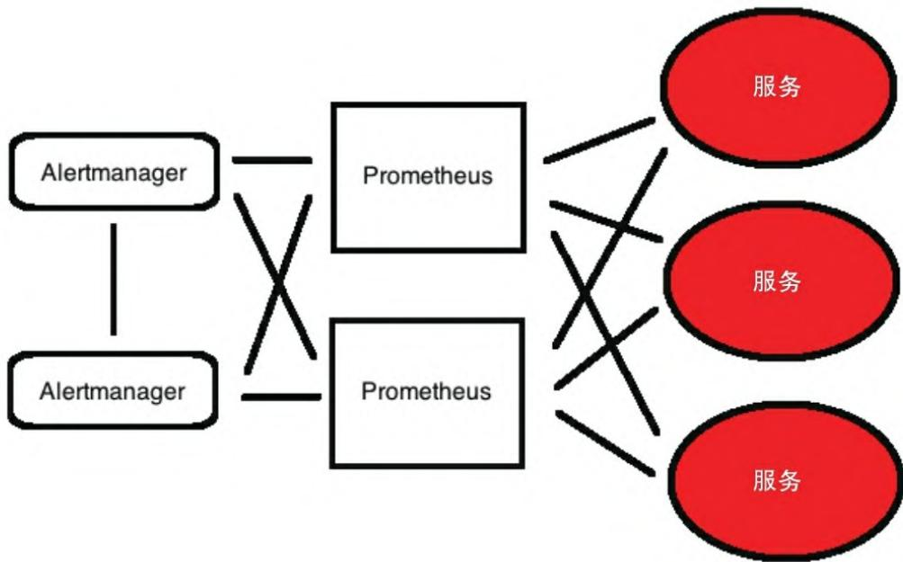

Prometheus 作为云原生时代的核心监控工具，凭借轻量、高效、易扩展的特性，成为容器、微服务场景下监控的事实标准。本文将从起源出发，全面拆解 Prometheus 的核心架构、数据模型与生态体系，帮你建立对 Prometheus 的完整认知（本文内容基于 Prometheus 2.0+ 版本，早期版本不适用）。

## 一、Prometheus 起源：从 Borgmon 到云原生标准

Prometheus 的灵感源于 Google 内部的 Borgmon——为集群管理器 Borg 设计的实时时间序列监控系统。由于 Borg 和 Borgmon 未开源，前 Google SRE Matt T.Proud 将其核心思想落地为 Prometheus 研究项目，后在 SoundCloud 与 Julius Volz 等工程师合作完善，并于 2015 年 1 月正式发布。

Prometheus 天生适配动态云环境和容器化微服务的监控需求，核心设计理念是**聚焦近期数据**（Facebook 研究验证 85% 的监控查询针对 26 小时内数据），因此更适合近实时的监控与告警场景。它由 Go 语言编写，基于 Apache 2.0 协议开源，也是云原生计算基金会（CNCF）接纳的第二个托管项目。

## 二、Prometheus 核心架构：拉取式采集的闭环体系

Prometheus 核心采用**拉取（Pull）模式**采集指标，辅以推送网关适配特殊场景，整体架构涵盖指标采集、服务发现、聚合告警、查询可视化等核心环节。

### 2.1 整体架构概览

  

**图2-1 Prometheus架构**  

Prometheus 架构的核心组件与流程：

- 指标来源：应用通过客户端库、exporter（导出器）暴露 HTTP 端点，或通过推送网关接收临时/内网目标的少量数据；
- 核心能力：服务发现自动识别监控目标、拉取指标存储到本地、通过 PromQL 查询聚合数据、触发告警至 Alertmanager；
- 可视化：内置表达式浏览器，或对接 Grafana 实现专业仪表板展示。

### 2.2 核心能力拆解

#### （1）指标收集：拉取式采集的核心逻辑

Prometheus 将可抓取指标的 HTTP 端点称为**端点（endpoint）**（对应单个进程/主机/服务），抓取配置通过**目标（target）** 定义（含连接方式、认证、元数据等），一组同类目标构成**作业（job）**（如集群内所有 Apache 服务器）。

采集的时间序列数据默认存储在 Prometheus 服务器本地，也可配置同步至外部时序数据库。

#### （2）服务发现：适配动态环境的关键

Prometheus 支持多种方式发现监控目标，适配云原生动态扩缩容场景：

- 静态资源列表：手动配置目标地址；
- 基于文件的发现：通过配置工具生成自动更新的目标列表文件；
- 自动发现：查询 Consul、云厂商（AWS/GCP）API 或解析 DNS SRV 记录，自动识别目标。

#### （3）聚合和警报：从数据到告警的转化

- 聚合规则：预定义常用查询（如计算CPU使用率变化率、求和聚合），生成新的时间序列，提升查询性能；
- 告警规则：配置条件触发告警（如 CPU 使用率异常），Prometheus 不直接发送告警，而是将告警推送到独立的 Alertmanager；
- Alertmanager：负责告警的去重、分组、路由（如发送邮件/钉钉），是告警生命周期的核心管理器。

#### （4）查询数据：PromQL 与表达式浏览器

Prometheus 内置专属查询语言 PromQL，支持对时间序列数据进行多维度筛选、聚合、计算；同时提供表达式浏览器，可视化查询结果。

**图2-2 Prometheus表达式浏览器**  

#### （5）自治：高性能的本地存储设计

Prometheus 设计为「自治式」服务器，可支撑数千台主机、数百万时间序列的规模：

- 存储优化：本地存储格式降低磁盘占用，兼顾查询/聚合的快速检索；
- 硬件建议：优先使用大内存（内存中处理核心逻辑）和 SSD 磁盘，保障速度与可靠性。

#### （6）冗余和高可用性：侧重弹性而非数据持久化

Prometheus 推荐按环境/团队部署独立实例，而非单体部署；若需高可用（HA），可部署多台配置相同的 Prometheus 服务器采集数据，配合高可用 Alertmanager 集群消除重复告警。

#### （7）可视化：内置工具 + Grafana 集成

- 基础可视化：通过内置表达式浏览器查看数据；
- 专业可视化：与 Grafana 深度集成，构建自定义仪表板（后续章节会详细讲解集成方式）。

## 三、Prometheus 数据模型：多维时间序列的核心设计

Prometheus 基于**多维时间序列数据模型**组织数据，每个时间序列由「名称 + 标签」唯一标识，是理解 Prometheus 指标的核心。

### 3.1 指标名称

时间序列名称描述数据的核心含义（如 `website_visits_total` 表示网站访问总数），命名规则：可包含 ASCII 字符、数字、下划线和冒号，建议遵循语义化命名规范。

### 3.2 标签：维度扩展的关键

标签是键值对形式的元数据，为时间序列添加维度信息（如 `site="MegaApp"` 标识应用、`location="NJ"` 标识地域），支持多维度筛选查询。标签分为两类：

- 插桩标签：来自被监控资源（如 HTTP 指标的 `method="GET"`），由客户端/exporter 添加；
- 目标标签：与架构相关（如 `datacenter="us-east-1"`），由 Prometheus 在采集时添加。

**注意**：添加/修改标签会生成新的时间序列；以 `__` 为前缀的标签为 Prometheus 内部保留标签。

### 3.3 采样数据

时间序列的实际值由采样数据构成，包含两部分：

- 数值：float64 类型；
- 时间戳：毫秒精度。

### 3.4 符号表示

时间序列的标准表示格式：

```txt
<time series name>{<label name>=<label value>,...}
```

示例：

```txt
total_website_visits{site="MegaApp", location="NJ", instance="webserver", job="web"}
```

其中 `instance`（标识源主机/应用）和 `job`（标识采集作业）是所有时间序列的默认标签。

### 3.5 保留时间

Prometheus 默认保留 15 天的本地数据（适配近期监控需求），若需长期存储，可将数据同步至外部时序数据库（后续章节讲解配置方式）。

## 四、安全模型：极简设计，按需扩展

Prometheus 核心设计聚焦监控能力，未内置服务器端的身份验证、授权或加密功能，其安全假设：

- 不受信任用户可访问 HTTP API，查看所有监控数据；
- 仅受信任用户可访问命令行、配置文件、规则文件。

从 2.0 版本开始，默认禁用部分 HTTP API 的管理功能。若需强化安全（如生产环境），需通过反向代理（访问 Prometheus）、正向代理（访问 exporter）等方式自行实现权限控制。

## 五、Prometheus 生态系统：丰富的组件与工具链

Prometheus 生态围绕核心服务器展开，涵盖采集、告警、可视化全链路工具：

1. **核心组件**：
   - Prometheus 服务器：指标采集、存储、查询核心；
   - Alertmanager：告警管理、路由、去重；
   - Pushgateway：接收临时/内网目标的推送数据；
2. **Exporter 生态**：官方/社区提供大量 exporter，支持监控 Apache、MySQL、Redis 等主流应用/服务；
3. **客户端库**：支持 Go、Python、Java、Ruby 等主流语言，方便应用埋点暴露指标；
4. **可视化工具**：Grafana（核心）、内置表达式浏览器。

## 六、小结

本文从起源、架构、数据模型、安全、生态五个维度拆解了 Prometheus 的核心知识点：

- 起源：脱胎于 Google Borgmon，适配云原生监控场景；
- 架构：拉取式采集为核心，覆盖服务发现、聚合告警、可视化全流程；
- 数据模型：多维时间序列（名称 + 标签）是核心，支撑灵活的 PromQL 查询；
- 生态：组件丰富，与云原生工具链深度兼容。

## 参考链接

- Prometheus 官网：<https://prometheus.io/>
- Prometheus 文档：<https://prometheus.io/docs/>
- Prometheus GitHub 主页：<https://github.com/prometheus/>
- Grafana 官网：<https://grafana.com/>
- 核心 Exporter 列表：<https://prometheus.io/docs/instrumenting/exporters/>
- 客户端库列表：<https://prometheus.io/docs/instrumenting/clientlibs/>
