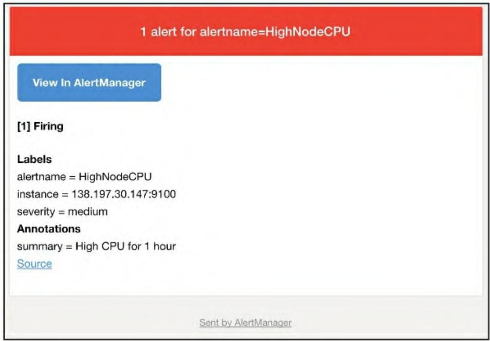

Prometheus作为云原生监控的核心组件，指标采集与存储只是基础，真正能让监控产生价值的是**告警闭环**——及时发现异常、精准推送通知、高效定位问题。Alertmanager作为Prometheus生态中负责告警管理的核心组件，承担了告警去重、分组、路由、静默等关键能力。本文将从告警设计原则出发，手把手完成Alertmanager的部署、配置、Prometheus对接，以及告警规则的编写与通知路由的精细化搭建，形成完整的监控告警闭环。

## 一、告警设计：避开反模式，打造有效告警

首先要明确：**糟糕的告警比没有告警更可怕**。过多、无效、分类错误的告警会导致“告警疲劳”，让重要告警被淹没。

### 1.1 常见告警反模式

- 告警泛滥：无操作性的信息型告警、上游故障触发下游全量告警、只告警“原因”而非“症状”（如只告警高数据库使用率，而非API高延迟）；
- 错误分类：重要告警被归类到低优先级、发送到错误的接收方；
- 信息缺失：告警仅告知“有问题”，未提供上下文（如磁盘使用率9%，但未说明磁盘总容量、增长速率）。

### 1.2 优秀告警的核心特征

1. 数量可控：聚焦“症状”而非“原因”，减少噪声（修复告警不足比修复过度告警更容易）；
2. 优先级精准：紧急告警快速触达责任人，非紧急告警按需推送；
3. 上下文完整：包含故障节点、指标值、排查链接等关键信息，开箱即用。

> 参考：Google SRE手册中对告警设计的核心原则，与本文理念高度一致。

## 二、Alertmanager 核心工作原理

Alertmanager是Prometheus生态中独立的告警管理组件，核心职责是处理Prometheus（或其他工具）发送的告警，完成以下核心动作：

1. 去重：合并重复的告警事件，避免重复通知；
2. 分组：按指定维度（如实例、集群）将告警分组，批量推送；
3. 路由：根据告警标签将不同类型/级别告警路由到不同接收方（邮件、PagerDuty、Slack等）；
4. 静默/维护：管理维护窗口，临时屏蔽指定告警。

Prometheus与Alertmanager的协作流程：

1. Prometheus根据预定义的告警规则，触发告警并推送到Alertmanager的HTTP端点；
2. Alertmanager接收告警后，按路由规则处理；
3. 最终将告警推送到配置的接收器（邮件、短信、SaaS工具等）。

## 三、Alertmanager 部署实战

Alertmanager是Go语言编写的独立二进制程序，支持Linux、Windows、macOS等多平台，部署方式灵活。

### 3.1 Linux 平台部署（64位）

#### 步骤1：下载并解压二进制包

```shell
cd /tmp
# 下载对应版本（本文以0.15.2为例，可替换为最新版）
wget https://github.com/prometheus/alertmanager/releases/download/v0.15.2/alertmanager-0.15.2-linux-amd64.tar.gz
# 解压
tar -xzf alertmanager-0.15.2-linux-amd64.tar.gz
# 复制二进制文件到系统路径
sudo cp alertmanager-0.15.2-linux-amd64/alertmanager /usr/local/bin/
# 复制amtool（Alertmanager命令行工具）
sudo cp alertmanager-0.15.2-linux-amd64/amtool /usr/local/bin/
```

#### 步骤2：验证部署

```shell
alertmanager --version
# 预期输出（版本相关）：
# alertmanager, version 0.15.2 (branch: HEAD, revision: 30dd0426c08b6479d9a26259ea5efd63bc1ee273)
# build user: root@3e103e3fc918
# build date: 20171116-17:45:26
# go version: go1.9.2
```

### 3.2 Windows 平台部署

#### 步骤1：创建目录并下载二进制包

```powershell
# 创建目录
C:\> MKDIR alertmanager
C:\> CD alertmanager
# 下载Windows版二进制包（解压后得到alertmanager.exe）
# 下载地址：https://github.com/prometheus/alertmanager/releases/download/v0.15.2/alertmanager-0.15.2.windows-amd64.tar.gz
# 用7-Zip解压到C:\alertmanager
```

#### 步骤2：配置环境变量

```powershell
# 将alertmanager目录加入PATH
$env:Path += ";C:\alertmanager"
```

#### 步骤3：验证部署

```powershell
C:\>alertmanager.exe --version
# 输出同Linux版本（略）
```

### 3.3 便捷部署方式

- 监控套件部署：可通过Docker Compose/Swarm快速部署包含Alertmanager的Prometheus监控栈（参考：<https://github.com/danguita/prometheus-monitoring-stack）；>
- 配置管理工具：Ansible/SaltStack等配置管理工具可批量部署Alertmanager（推荐生产环境使用）。

## 四、Alertmanager 核心配置

Alertmanager配置文件为YAML格式（默认alertmanager.yml），核心包含`global`、`templates`、`route`、`receivers`四大块。

### 4.1 基础配置示例（邮件接收器）

#### 步骤1：创建配置文件目录与文件

```shell
sudo mkdir -p /etc/alertmanager/
sudo touch /etc/alertmanager/alertmanager.yml
```

#### 步骤2：编写基础配置

```yaml
global:
  smtp_smarthost: 'localhost:25'  # SMTP服务器地址
  smtp_from: 'alertmanager@example.com'  # 发件人邮箱
  smtp_require_tls: false  # 禁用TLS（根据实际SMTP配置调整）
templates:
  - /etc/alertmanager/template/*.mpl  # 告警模板目录
route:
  receiver: email  # 默认接收器
receivers:
  - name: 'email'  # 接收器名称
    email_configs:
      - to: 'alerts@example.com'  # 收件人邮箱
```

### 4.2 配置模块说明

| 模块       | 作用                                                                 |
|------------|----------------------------------------------------------------------|
| `global`   | 全局配置，为其他模块设置默认值（如SMTP、超时等）                     |
| `templates`| 指定告警模板目录，用于自定义告警内容（如邮件标题、正文格式）         |
| `route`    | 告警路由规则，定义告警的分发逻辑（核心，按标签匹配、分支路由等）     |
| `receivers`| 告警接收器，定义告警的推送目的地（邮件、Slack、PagerDuty等）         |

路由核心逻辑：告警从“根路由”进入，按标签匹配子路由，未匹配的告警走默认路由。

## 五、启动Alertmanager & 对接Prometheus

### 5.1 启动Alertmanager

```shell
# 指定配置文件启动
alertmanager --config.file /etc/alertmanager/alertmanager.yml
```

Alertmanager默认监听9093端口，可通过Web界面查看告警：`http://localhost:9093/`

### 5.2 配置Prometheus对接Alertmanager

修改Prometheus配置文件（prometheus.yml），添加`alerting`块指定Alertmanager地址：

#### 方式1：静态配置

```yaml
alerting:
  alertmanagers:
    - static_configs:
        - targets:
            - alertmanager:9093  # Alertmanager地址&端口
```

#### 方式2：DNS SRV服务发现（推荐生产环境）

1. 配置DNS SRV记录：

```txt
alertmanager._tcp.example.com. 300 IN SRV 10 1 9093 alertmanager1.example.com.
```

1. Prometheus配置：

```yaml
alerting:
  alertmanagers:
    - dns_sdconfigs:
        - names: ['_alertmanager._tcp.example.com']
```

#### 5.3 监控Alertmanager本身

在Prometheus中添加抓取Alertmanager指标的作业，监控其运行状态：

```yaml
- job_name: 'alertmanager'
  static_configs:
    - targets: ['localhost:9093']  # Alertmanager地址
```

Alertmanager暴露的指标以`alertmanager_`为前缀，包含告警状态、通知成功率等关键数据。

## 六、告警规则编写实战

Prometheus的告警规则通过YAML文件定义，与记录规则语法相似，核心包含`groups`（规则组）、`alert`（告警名称）、`expr`（触发表达式）、`for`（持续时间）、`labels`（标签）、`annotations`（注解）。

### 6.1 基础规则示例（CPU使用率告警）

#### 步骤1：创建告警规则文件

```shell
mkdir -p /etc/prometheus/rules
touch /etc/prometheus/rules/node_alerts.yml
```

#### 步骤2：编写CPU告警规则

```yaml
groups:
  - name: node_alerts
    rules:
      - alert: HighNodeCPU  # 告警名称（组内唯一）
        expr: instance:node_cpu:avg_rate5m > 80  # 触发条件：5分钟CPU平均使用率>80%
        for: 60m  # 持续满足条件60分钟才触发
        labels:
          severity: warning  # 告警级别
        annotations:
          summary: "High Node CPU for 1 hour"  # 告警摘要
          console: "查看节点面板：http://grafana.example.com/dashboard/db/node-dashboard"  # 排查链接
```

#### 步骤3：配置Prometheus加载规则文件

修改prometheus.yml，通过通配符加载所有告警规则文件：

```yaml
rule_files:
  - "rules/*_alerts.yml"  # 匹配所有以_alerts.yml结尾的规则文件
```

### 6.2 告警状态说明

Prometheus告警有3种状态，按生命周期流转：

- `Inactive`：未触发；
- `Pending`：满足触发条件，但未达到`for`指定的持续时间；
- `Firing`：满足条件且超过`for`时长，正式触发并推送到Alertmanager。

### 6.3 实用告警规则示例

#### 6.3.1 磁盘空间预警（4小时内将占满）

```yaml
- alert: DiskWillFillIn4Hours
  expr: predict_linear(node_filesystem_free_bytes{mountpoint="/"}[1h], 4*3600) < 0
  for: 5m
  labels:
    severity: critical
  annotations:
    summary: "磁盘 {{ $labels.instance }} 将在4小时内占满！"
```

#### 6.3.2 实例宕机告警

```yaml
- alert: InstanceDown
  expr: up{job="node"} == 0
  for: 10m
  labels:
    severity: critical
  annotations:
    summary: "实例 {{ $labels.instance }} (作业：{{ $labels.job }}) 已宕机！"
```

#### 6.3.3 Prometheus自身监控告警

```yaml
# 配置重载失败告警
- alert: PrometheusConfigReloadFailed
  expr: prometheus_config_last_reload_successful == 0
  for: 10m
  labels:
    severity: warning
  annotations:
    description: "Prometheus {{ $labels.instance }} 配置重载失败！"

# Alertmanager连接失败告警
- alert: PrometheusNotConnectedToAlertmanagers
  expr: prometheus_notifications_alertmanagers_discovered < 1
  for: 10m
  labels:
    severity: warning
  annotations:
    description: "Prometheus {{ $labels.instance }} 未连接到任何Alertmanager！"
```

### 6.4 告警模板：动态填充上下文

Prometheus支持Go模板语法，在注解/标签中动态引用指标标签和值，核心变量：

- `$labels`：指标的标签集合（如`{{ $labels.instance }}`）；
- `$value`：指标的数值（可结合`humanize`函数格式化，如`{{ humanize $value }}%`）。

示例：

```yaml
annotations:
  summary: "节点 {{ $labels.instance }} CPU使用率 {{ humanize $value }}%（持续1小时）"
```

## 七、告警路由精细化配置

通过路由规则，可实现“不同级别/类型的告警推送到不同接收方”，核心配置项：

- `group_by`：按标签分组告警（如按instance、cluster）；
- `group_wait`：等待时间，用于缓冲同组告警（如30秒，避免批量告警拆分推送）；
- `group_interval`：同组告警再次推送的间隔（如5分钟）；
- `repeat_interval`：同一告警重复推送的间隔（如3小时）；
- `match`：精确匹配标签；
- `match_re`：正则匹配标签；
- `continue`：是否继续匹配后续路由（默认false）。

### 7.1 多接收器路由示例

```yaml
route:
  group_by: ['instance']
  group_wait: 30s
  group_interval: 5m
  repeat_interval: 3h
  receiver: email  # 默认接收器
  routes:
    # 紧急告警推送到Pager
    - match:
        severity: critical
      receiver: pager
    # 警告/紧急告警推送到支持团队
    - match_re:
        severity: ^(warning|critical)$
      receiver: support-team

receivers:
  - name: 'email'
    email_configs:
      - to: 'alerts@example.com'
  - name: 'support-team'
    email_configs:
      - to: 'support@example.com'
  - name: 'pager'
    email_configs:
      - to: 'alert-pager@example.com'
```

### 7.2 嵌套路由（多级匹配）

```yaml
routes:
  - match:
      severity: critical
    receiver: pager
    routes:
      # 仅application1的紧急告警推送到支持团队
      - match:
          service: application1
        receiver: support-team
```

**图6-5 Alertmanager中触发的警报**
  

## 八、总结

本文从告警设计原则出发，完整覆盖了Alertmanager的部署、配置、与Prometheus的对接，以及告警规则的编写和路由的精细化配置。核心要点：

1. 告警设计要聚焦“症状”、控制数量、提供完整上下文；
2. Alertmanager是告警闭环的核心，负责告警的分组、路由、推送；
3. 告警规则需结合`for`避免误报，通过模板丰富上下文；
4. 路由规则可实现告警的精准分发，适配多团队、多级别告警场景。

通过以上步骤，可搭建起一套“精准、高效、可运维”的Prometheus告警体系，真正发挥监控的价值——提前发现问题、快速定位问题、高效解决问题。
