作为云原生监控领域的核心学习内容，本篇将从云计算时代的IT架构变革切入，系统拆解云原生监控的核心挑战、成熟度模型及主流工具特性，最终聚焦Prometheus的设计理念与核心优势，帮助你搭建起云原生监控体系的完整认知框架，为后续实操落地筑牢基础。

【本篇核心收获】

- 理解云计算时代应用系统与传统IT架构的本质区别，掌握“双模IT”在企业数字化转型中的核心价值
- 精准识别云计算环境下监控系统面临的四大核心挑战，明确监控系统的核心目标与服务可靠性层级模型
- 掌握监控系统成熟度四级模型，了解Zabbix、OpenTSDB等主流开源监控工具的架构特点与适用场景
- 深度理解Prometheus的诞生背景、设计理念及核心优势，建立云原生监控体系的完整认知
- 明晰云原生监控的范围与架构设计逻辑，能区分不同监控工具的适配场景

## 1. 云计算时代的监控系统：背景与变革

过去十年，云计算、容器、微服务、DevOps等技术推动IT架构发生根本性变革，监控系统作为保障业务稳定运行的核心组件，必须适配云环境的动态性、复杂性特征。本节从云计算时代的应用特点入手，分析监控面临的核心背景与变革方向。

### 1.1 云计算时代的应用系统

云计算时代的应用系统核心目标是通过“IT云化”实现企业数字化转型，最终保障业务服务的高可用性，其核心特征体现在IT架构与管理模式的双重变革。

#### 1.1.1 企业“IT云化”实现数字化转型

- **云化是时代必然趋势**：云计算发展进入第二个十年，我国云计算市场保持高速增长。2018年我国云计算整体市场规模达962.8亿元，增速39.2%；预计2022年公有云市场规模将达1731亿元，私有云达1172亿元，企业IT云化成为数字化转型的核心路径。
- **双模IT成为常态**：Gartner 2014年提出“双模IT”理念，企业IT部门分为两部分：传统IT架构（保障核心业务平稳运行，维稳）、敏捷化IT架构（敏捷开发、快速迭代，应对新挑战，图新），双轨模式共同推动企业发展。

#### 1.1.2 云计算时代的IT架构特点

企业IT架构历经数十年演进，从集中式大型机到分布式云架构，每一次变革都推动生产力升级，核心演进路径如下：

- 20世纪60年代：大型机时代，使用门槛高、成本高，仅少数企业可用；
- 20世纪80年代：PC/小型机时代，硬件私有化，但架构不灵活、资源利用率低；
- 20世纪90年代：IDC托管时代，硬件托管但系统仍需企业自研，计算能力集中在大企业；
- 2000年：去IOE浪潮，x86服务器成为主流；
- 现阶段：云架构时代，按需获取计算能力，容器、微服务、函数计算成为主流，应用交付周期大幅缩短。

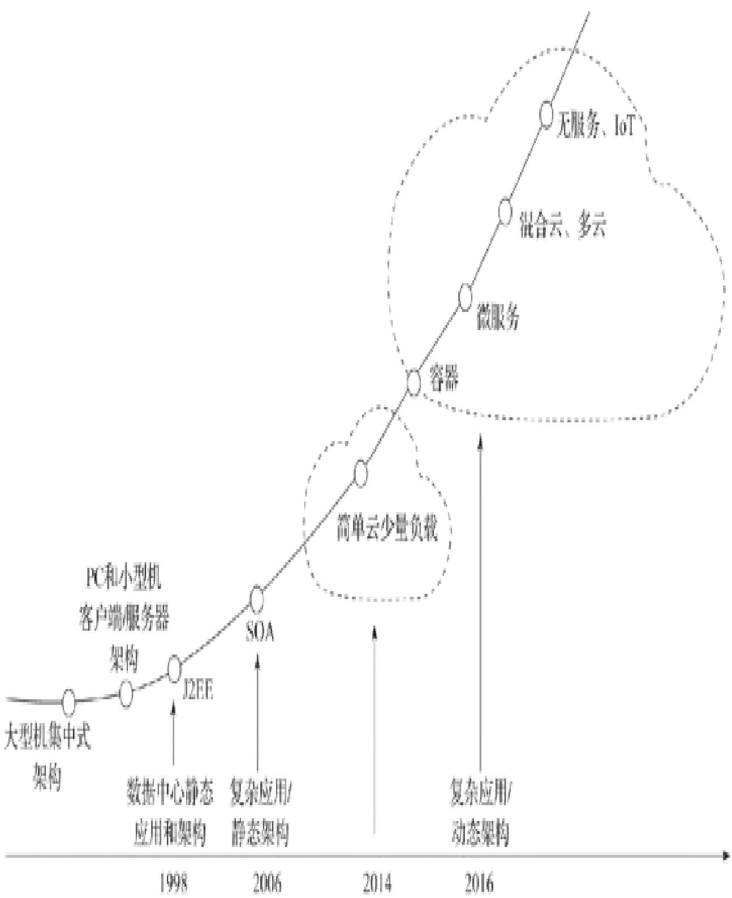

#### 1.1.3 云计算时代的IT管理变革

云架构的弹性与服务化特征，带来企业IT投入、人员能力要求、核心关注指标的全方位变革：

| 变革维度 | 传统IT模式 | 云计算模式 |
| :--- | :--- | :--- |
| 投入模式 | 基础设施投入占比最大，应用开发占比最小 | 基础设施租用成本最低，运维成本下降，更多资金投入业务开发 |
| 人员能力要求 | 关注底层基础设施运维，被动响应业务需求 | 关注业务需求与创新，主动探索新方案，“创建比修复更容易” |
| 核心关注指标 | 基础设施稳定性 | 用户体验与业务指标（SLI/SLO/SLA） |

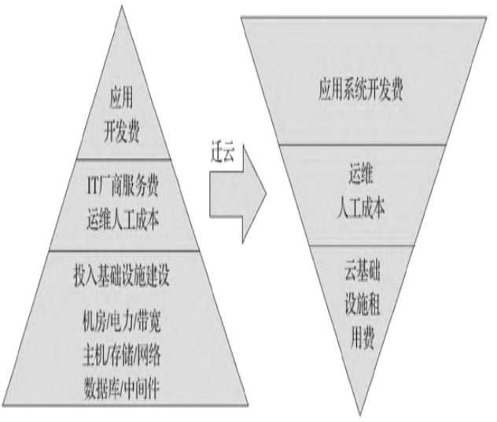

**核心指标说明**：

- SLI（服务质量指标）：服务最核心的基础度量指标；
- SLO（服务质量目标）：SLI的预期值；
- SLA（服务质量协议）：SLI未达预期时的应对计划。

通过SLI/SLO/SLA的量化约定，可明确开发与运维的责任边界，保障系统稳定运行。

**模块小结**：云计算时代的应用系统核心是通过云化实现数字化转型，IT架构从集中式走向分布式、服务化，IT管理则从关注基础设施转向关注业务与用户体验，双模IT是企业转型的核心模式。

### 1.2 云计算监控的目标和挑战

监控系统是云环境下业务稳定运行的核心保障，明确其核心目标与挑战，是设计高效监控体系的前提。

#### 1.2.1 云计算监控目标

监控系统的核心目标：全面监控复杂信息系统，反映云资源池健康状态，保障业务安全、稳定、高效运行；控制管理成本，为决策提供数据支持。

监控系统需解决三大核心问题：“出问题了吗？”“哪里出了问题？”“是什么问题？”，同时需支持白盒监控（洞察内部状态，预判问题）与黑盒监控（外部探针，快速告警），具体价值体现在：

- 长期趋势分析：如通过磁盘空间增长率预判扩容节点；
- 对照分析：对比不同版本/容量下的系统性能；
- 告警：快速响应故障，提前预防问题；
- 故障分析与定位：通过历史数据对比找到根因；
- 数据可视化：直观呈现系统运行状态。

服务可靠性层级模型中，监控系统是最底层基础，无完善的监控体系，应急处理、容量规划等上层工作均无支撑。

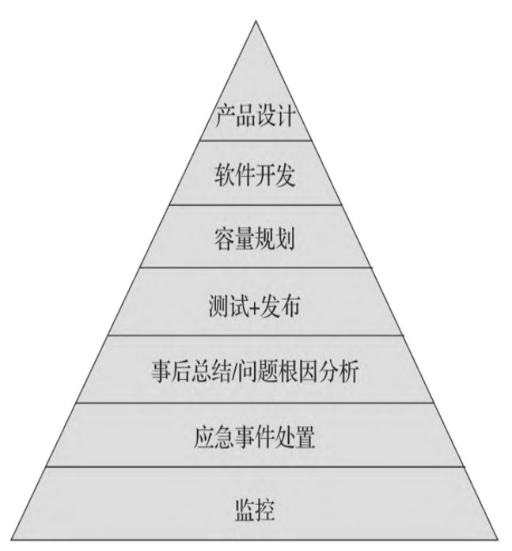

#### 1.2.2 云计算监控挑战

云环境的动态性、复杂性给监控系统带来四大核心挑战：

| 挑战类型 | 核心痛点 | 应对难点 |
| :--- | :--- | :--- |
| 持续变更 | 云资源弹性伸缩、DevOps持续部署导致系统频繁变更，监控参数需同步调整 | 监控配置需自动化，适配动态变化的基础设施 |
| 监控维度权衡（自下而上vs自上而下） | 自下而上：监控粒度细但关联分析难；自上而下：发现问题晚，根因定位难 | 需平衡监控粒度与问题响应效率，兼顾底层数据与上层聚合 |
| 微服务架构复杂性 | 微服务调用链路长，性能瓶颈节点难识别，“慢节点”定义与阈值难设定 | 需精准追踪分布式调用链路，动态调整监控阈值 |
| 海量分布式数据 | 每秒产生数百万指标/日志，采集、传输、存储开销大 | 需动态调整采集粒度，结合分布式日志系统与机器学习处理数据 |

**避坑指南**：

- 避免固定采集间隔，需根据系统状态动态调整（异常时细粒度，正常时粗粒度）；
- 优先使用成熟的分布式日志系统（如Logstash），避免自研导致的性能问题；
- 微服务监控需聚焦端到端链路，而非单一节点指标。

**模块小结**：云计算监控的核心目标是保障业务稳定并支撑决策，需解决“是否出问题、哪里出问题、是什么问题”三大问题；核心挑战集中在持续变更、维度权衡、微服务复杂性、海量数据处理四个维度，需针对性设计解决方案。

### 1.3 云计算监控的范围和架构

明确监控范围与架构设计逻辑，是搭建监控系统的基础，需覆盖全层级数据采集与合理的架构设计。

#### 1.3.1 监控管理的范围

现代监控体系架构需覆盖业务逻辑、应用程序、运行环境全层级，以事件、日志、指标为核心监控对象：

- 数据采集：全层级收集日志（建议统一至公共日志服务）、指标（如CPU/内存/磁盘使用率）；
- 事件路由：负责事件存储、转发，支撑可视化、告警、异常检测等能力。

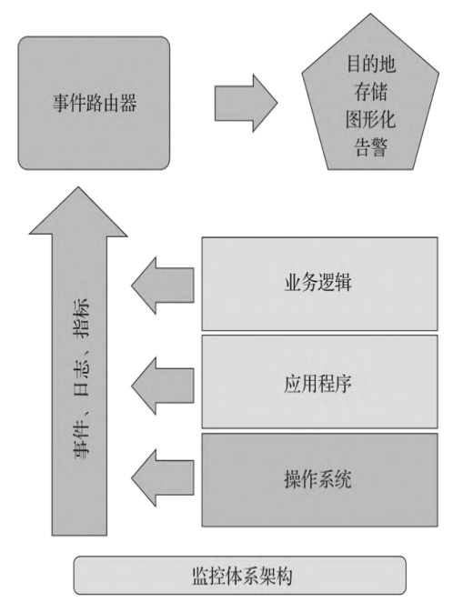

监控范围涵盖所有IT资源，除传统资源外，需重点覆盖云环境下的虚拟化资源。

#### 1.3.2 监控系统的基本架构

监控系统核心架构包含数据采集、传输、存储、应用四大环节：

1. 数据采集：分为入侵式（系统主动提供数据）、非入侵式（如健康检查）；
2. 数据传输：通过代理/非代理方式将数据发送至分布式中心数据库，传输过程可过滤/聚合数据；
3. 数据存储：逻辑集中的分布式数据库，需考虑本地节点故障与网络阻塞问题；
4. 数据应用：告警、可视化、故障诊断等。

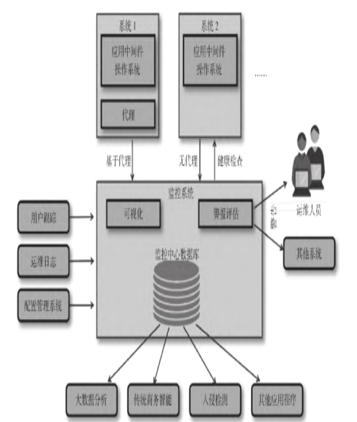

**架构设计要点**：

- 本地节点数据需及时采集，避免故障导致数据丢失；
- 合理设计过滤/聚合策略，平衡数据粒度与网络开销；
- 推荐采用“发布-订阅”架构，统一管理日志与指标数据。

**模块小结**：云计算监控需覆盖全层级IT资源，核心架构需兼顾数据采集的全面性、传输的高效性、存储的可靠性，同时支持灵活的数据应用能力。

### 1.4 百花齐放的开源监控软件工具

开源监控工具是搭建云原生监控体系的核心选择，需了解监控系统成熟度模型及主流工具的核心特性。

#### 1.4.1 监控系统成熟度

监控系统成熟度分为四级，是评估与优化监控体系的核心依据：

1. 第1级（组件监控）：监控组件状态，支持基础告警；
2. 第2级（层级监控）：全层级收集指标、日志、追踪信息；
3. 第3级（全栈可视化）：关联依赖关系，实时洞察系统整体状态；
4. 第4级（智能化）：故障预测、自我治愈、异常检测。

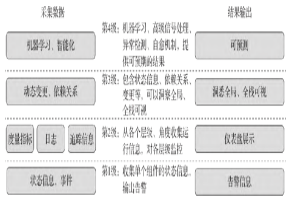

从低级别向高级别演进，可逐步实现从“被动响应”到“主动预测”的监控能力升级。

#### 1.4.2 Zabbix

Zabbix是企业级开源分布式监控解决方案，核心特征如下：

- 架构：Server+Agent模式，Server可单独监控远程服务，也可与Agent配合（主动轮询/被动接收数据）；
- 协议支持：SNMP、IPMI、JMX、Telnet、SSH等；
- 核心能力：网络参数监控、告警通知、二次开发扩展；
- 优势：功能全面、扩展性强，覆盖数据采集、分析、告警全流程。

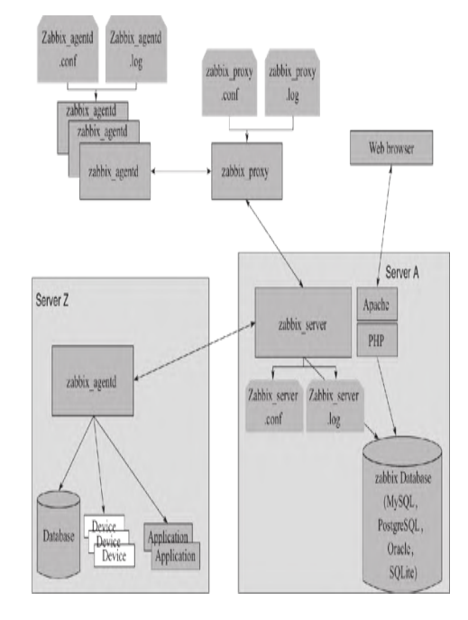

#### 1.4.3 OpenTSDB

OpenTSDB是基于HBase的分布式时序数据库，核心特征如下：

- 存储：全量存储时序数据，无需采样，支持永久存储；
- 采集：秒级数据采集，适配高实时性场景；
- 优势：大数据分析能力强，适用于大规模基础设施监控。

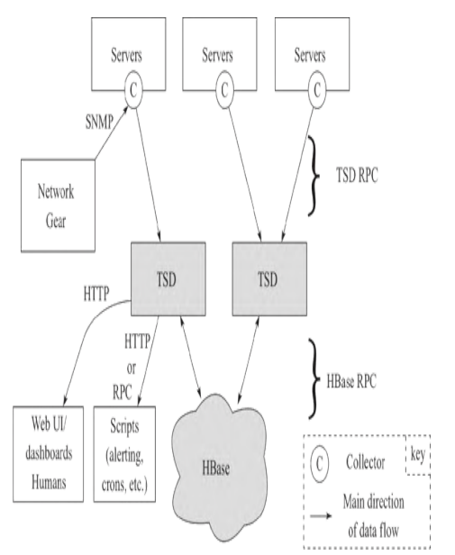

**工具选型建议**：

- 需全面覆盖传统基础设施监控：优先Zabbix；
- 需高实时性、大规模时序数据存储分析：优先OpenTSDB；
- 云原生微服务环境：优先Prometheus（下文重点讲解）。

**模块小结**：监控系统成熟度四级模型是优化监控体系的核心框架，Zabbix适合全功能传统监控，OpenTSDB适合高实时性、大规模时序数据场景，需根据场景选择适配工具。

### 1.5 Prometheus监控系统

Prometheus是云原生时代的主流监控工具，专为容器、微服务环境设计，具备高可定制性与完善的生态体系。

#### 1.5.1 应运而生，茁壮成长

##### 1. Prometheus简史

- 起源：2012年由前Google工程师在SoundCloud研发，受Google Borgmon监控系统启发；
- 发展：2015年初发布早期版本，2016年加入CNCF，2017年发布2.0版本，2018年成为CNCF“毕业”项目；
- 现状：GitHub超2万星，650+贡献者，120+第三方集成，成为云原生监控主流工具。

##### 2. Prometheus设计理念

- 数据采集：基于Pull模型，拉取应用程序导出的时序数据（通过客户端库/导出器暴露HTTP端点）；
- 数据聚焦：关注近期数据（默认保留15天），适配故障排查的核心需求；
- 补充能力：提供推送网关，适配无法直接拉取的监控目标。

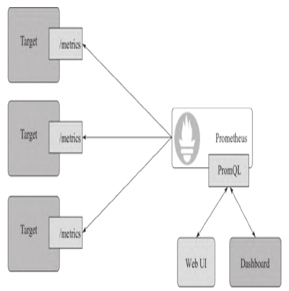

#### 1.5.2 功能完善、监控所有层级指标

传统监控需多工具组合，而Prometheus可覆盖云原生环境全层级指标，简化监控架构：

| 监控层级 | 监控内容 | 监控指标(示例) |
| :--- | :--- | :--- |
| 编排系统 | 集群资源、调度 | Kubernetes 组件 |
| 应用 | 时延、错误、查询量、内部状态等 | 自定义代码埋点 |
| 容器 | 资源使用、性能特性等 | cAdvisor |
| 主机(OS,硬件) | 硬件失效、虚机置备、主机资源等 | Node exporter |
| 网络 | 路由器、交换机等 | SNMP exporter |

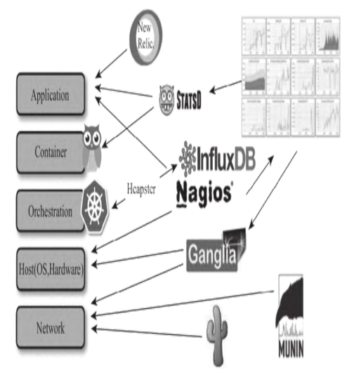
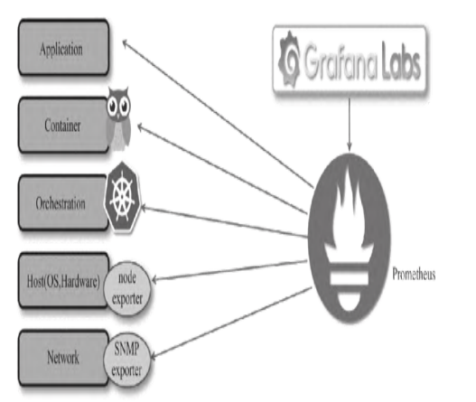

#### 1.5.3 开放、高效、易用的完整解决方案

Prometheus相比传统监控系统，具备七大核心优势：

| 优势类型 | 核心特征 |
| :--- | :--- |
| 易管理性 | 单二进制文件，无第三方依赖，Pull模型适配多环境部署，支持动态服务发现 |
| 架构契合度 | Pull模型由服务端控制采集行为，适配微服务动态性，易获取应用内部状态 |
| 数据模型灵活性 | 监控数据由值、时间戳、标签表组成，支持采集阶段修改标签，扩展能力强 |
| 性能与查询能力 | 单实例可处理百万级指标/数十万数据点，内置PromQL提供丰富计算函数 |
| 可扩展性 | 支持联邦集群、功能分区，适配大规模环境 |
| 生态开放性 | 支持多语言SDK，兼容Graphite、Nagios等工具，丰富的第三方采集插件 |
| 可视化能力 | 自带UI，完美兼容Grafana，支持自定义API开发可视化界面 |

**避坑指南**：Prometheus存在以下局限性，需结合其他工具补充：

- 日志监控、分布式追踪能力待完善；
- 告警规则/联系人仅支持静态文件配置；
- 原生聚合函数有限，且不支持扩展。

**模块小结**：Prometheus是云原生监控的核心工具，基于Pull模型设计，可覆盖全层级监控指标，具备易管理、高性能、生态完善等优势，但需注意其在日志、告警配置等方面的局限性，结合其他工具形成完整方案。

## 【本篇核心知识点速记】

- **双模IT**：企业数字化转型中，传统IT架构（维稳）与敏捷开发架构（图新）并存的新常态。
- **监控三大目标**：解决“出问题了吗？”、“哪里出了问题？”、“是什么问题？”，同时支持白盒监控（内部状态）与黑盒监控（外部探针）。
- **云计算监控四大挑战**：持续变更、自下而上/自上而下的监控维度权衡、复杂的微服务架构、大容量分布式数据处理。
- **监控系统成熟度四级**：组件监控→层级监控→全栈可视化依赖洞察→智能化预测自愈。
- **Zabbix核心特点**：基于Web的企业级开源监控，支持Server+Agent模式及多种协议，功能全面。
- **OpenTSDB核心特点**：基于HBase的分布式时序数据库，支持秒级采集与永久存储，适合大数据分析。
- **Prometheus设计理念**：基于Pull模型的云原生监控系统，灵感源自Google Borgmon，关注近期数据，默认保留15天。
- **Prometheus核心优势**：易管理（单二进制、无外部依赖）、Pull模型契合微服务、灵活的数据模型（标签）、强大的PromQL查询、可扩展联邦集群、健全的第三方生态。
- **Prometheus局限性**：日志监控与分布式追踪能力待完善，告警规则配置静态化，原生聚合函数有限。
