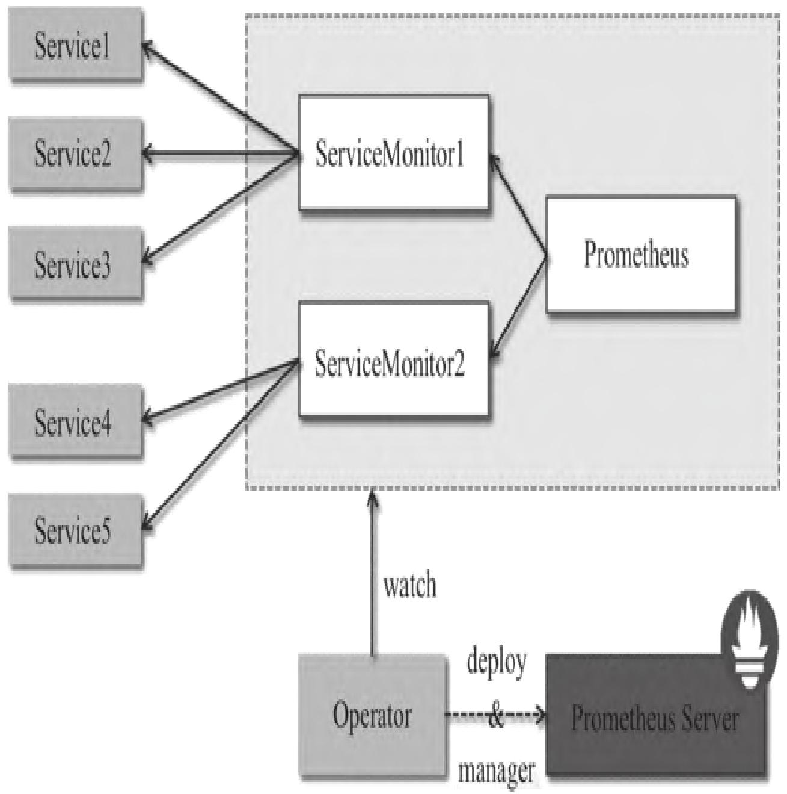
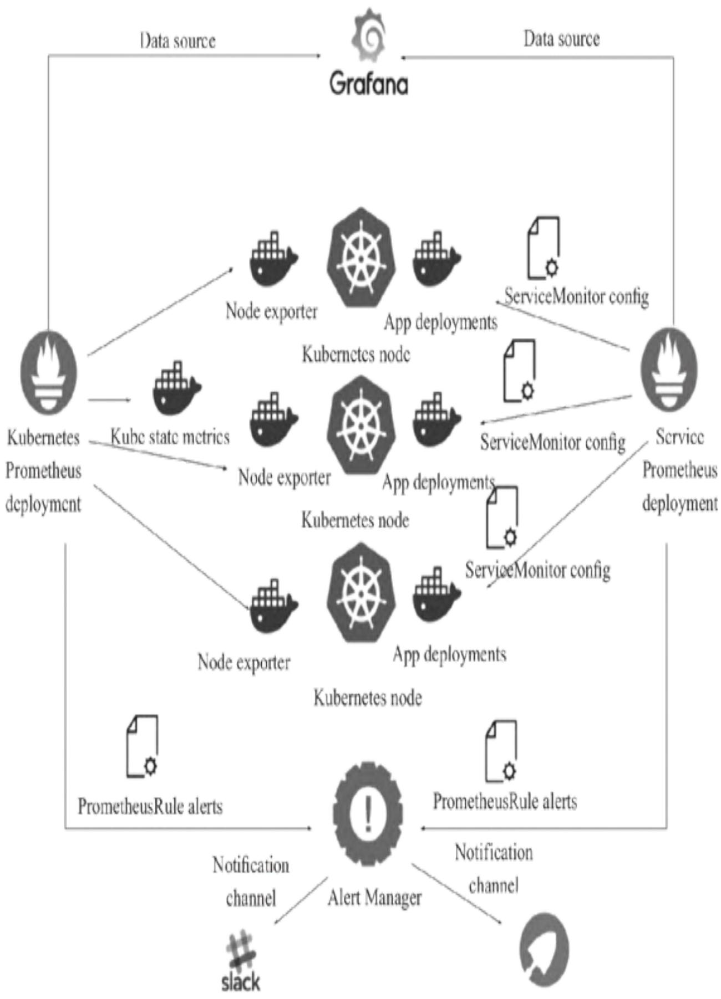
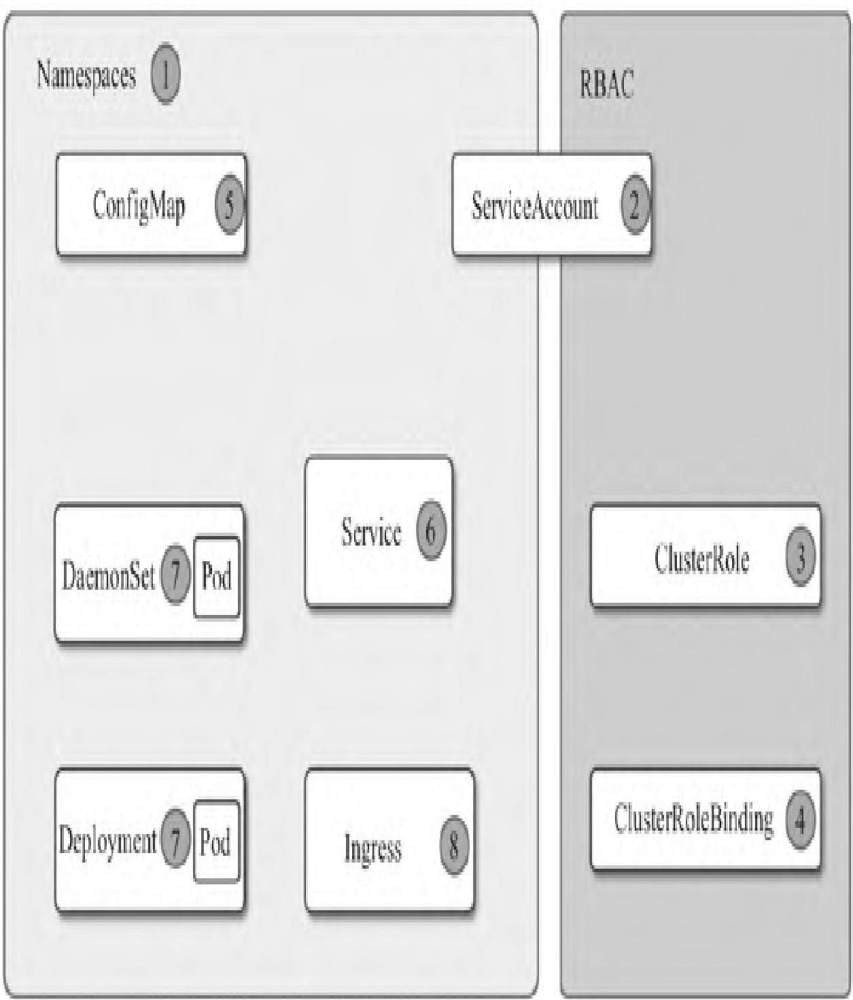
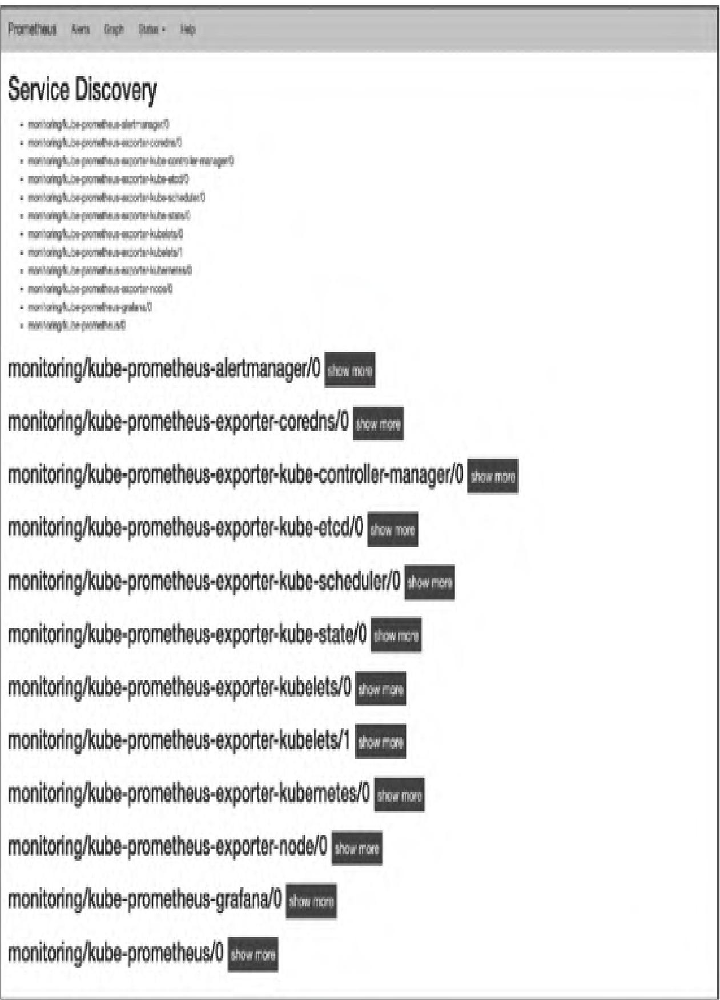

本文聚焦Kubernetes环境下Prometheus监控体系的落地与深度解析，从技术原理到实操部署、从传统方式到Operator简化方案、从配置规则到监控对象全覆盖，学完可独立完成K8s集群Prometheus监控栈的搭建、配置与运维。

【本篇核心收获】

- 理解Prometheus与Kubernetes结合的技术原理，以及Prometheus Operator在Kubernetes中的角色
- 掌握传统方式在Kubernetes上部署Prometheus的全流程（命名空间、RBAC、ConfigMap、Service、Deployment、Ingress）
- 掌握kube-state-metrics、node-exporter、Grafana在Kubernetes中的部署与集成
- 学会通过Operator方式（Helm）快速部署Prometheus监控栈
- 理解Prometheus在Kubernetes中的服务发现机制（Node、Service、Pod、Endpoints、Ingress）
- 掌握Kubernetes环境下Prometheus的监控对象（容器、apiserver、kube-state-metrics、主机）及配置
- 学会使用Grafana展示Kubernetes监控数据，并集成Alertmanager实现告警（包括微信告警）

## 1. Prometheus与Kubernetes完美结合

云计算的快速发展推动了Docker、Kubernetes、Prometheus等开源软件的普及，Docker+Kubernetes构成云原生基石，而Prometheus则为云原生场景提供了完善的监控能力，且天然适配Kubernetes生态。

### 1.1 Kubernetes Operator

Kubernetes的基础API对象（如Deployment）可轻松管理无状态应用的伸缩与故障恢复，但数据库、缓存、监控系统等有状态应用的管理存在挑战——这类应用需要领域专属知识来完成伸缩、升级、故障恢复。

Operator通过CRD（自定义资源定义，原TPR）扩展Kubernetes API，将特定应用的运维知识编码到软件中，实现对集群范围内多实例有状态应用的创建、配置和管理。

### 1.2 Prometheus Operator

Prometheus Operator为Kubernetes中Prometheus实例的部署和管理提供了声明式的监控定义，安装后具备以下核心能力：

- **创建/销毁**：可在Kubernetes命名空间中便捷启动Prometheus实例，适配不同应用/团队的监控需求
- **简单配置**：通过Kubernetes本地资源定义Prometheus的版本、持久化、保留策略、副本数等基础配置
- **标签化Target管理**：基于Kubernetes标签自动生成监控Target配置，无需编写Prometheus专属配置

Prometheus Operator架构如图1所示：


架构中各组件以Kubernetes资源形式运行，核心职责如下：

- **Operator**：核心控制中心，基于CRD部署/管理Prometheus Server，监控自定义资源事件并执行对应操作
- **Prometheus**：声明式描述Prometheus部署的期望状态
- **Prometheus Server**：Operator根据Prometheus自定义资源部署的集群，对应StatefulSets资源
- **ServiceMonitor**：自定义资源，通过标签选取Service Endpoint，为Prometheus Server提供监控Target列表
- **Service**：对应K8s集群中的Metrics Server Pod，是ServiceMonitor选取的监控对象（如Node Exporter Service）
- **Alertmanager**：自定义资源，由Operator部署的Alertmanager集群

**模块小结**：本模块解析了Prometheus与K8s结合的核心载体（Operator），明确了Prometheus Operator的核心能力与架构组成，为后续部署实操奠定原理基础。

## 2. 在Kubernetes上部署Prometheus的传统方式

传统方式通过YAML文件逐一步骤部署Prometheus、kube-state-metrics、node-exporter、Grafana，各组件调用关系如图2所示：


Node exporter部署在K8s节点上采集主机监控数据，kube-state-metrics部署在Master节点采集集群状态，所有数据汇总至Prometheus处理存储，最终通过Grafana可视化展示。

### 2.1 Kubernetes部署Prometheus

部署流程遵循「命名空间→RBAC→ConfigMap→Service→Deployment→Ingress」的顺序，架构如图3所示：


#### 步骤1：创建命名空间

创建`monitoring`命名空间统一管理监控相关资源：

```bash
kubectl create -f ns-monitoring.yaml
```

`ns-monitoring.yaml`内容：

```yaml
apiVersion: v1
kind: Namespace
metadata:
  name: monitoring
```

验证创建结果：

```bash
$ kubectl get ns monitoring
NAME          STATUS   AGE
monitoring    Active   1d
```

#### 步骤2：创建RBAC规则

创建ServiceAccount、ClusterRole、ClusterRoleBinding，赋予Prometheus访问K8s API的权限：

```bash
kubectl create -f prometheus-rbac.yaml
```

`prometheus-rbac.yaml`内容：

```yaml
apiVersion: v1
kind: ServiceAccount
metadata:
  name: prometheus-k8s
  namespace: monitoring
---
apiVersion: rbac.authorization.k8s.io/v1
kind: ClusterRole
metadata:
  name: prometheus
rules:
- apiGroups: [""]
  resources: ["nodes", "services", "endpoints", "pods"]
  verbs: ["get", "list", "watch"]
- apiGroups: [""]
  resources: ["configmaps"]
  verbs: ["get"]
- nonResourceURLs: ["/metrics"]
  verbs: ["get"]
---
apiVersion: rbac.authorization.k8s.io/v1
kind: ClusterRoleBinding
metadata:
  name: prometheus
roleRef:
  apiGroup: rbac.authorization.k8s.io
  kind: ClusterRole
  name: cluster-admin
subjects:
- kind: ServiceAccount
  name: prometheus-k8s
  namespace: monitoring
```

验证创建结果：

```bash
$ kubectl get sa prometheus-k8s -n monitoring
NAME              SECRETS   AGE
prometheus-k8s    1         1d
$ kubectl get clusterrole prometheus
NAME          AGE
prometheus    1d
$ kubectl get clusterrolebinding prometheus
NAME          AGE
prometheus    1d
```

#### 步骤3：创建Prometheus配置文件（ConfigMap）

通过ConfigMap存储Prometheus核心配置：

```bash
kubectl create -f prometheus-core-cm.yaml
```

`prometheus-core-cm.yaml`内容：

```yaml
kind: ConfigMap
metadata:
  creationTimestamp: null
  name: prometheus-core
  namespace: monitoring
apiVersion: v1
data:
  prometheus.yaml: |
    global:
      scrape_interval: 15s
      scrape_timeout: 15s
      evaluation_interval: 15s
    alerting:
      alertmanagers:
      - static_configs:
          targets: ["10.254.127.110:9093"]
    rule_files:
      - "/etc/prometheus-rules/*.yaml"
    scrape_configs:
    - job_name: 'kubernetes-apiservers'
      kubernetes_sd_configs:
      - role: endpoints
      scheme: https
      tls_config:
        ca_file: /var/run/secrets/kubernetes.io/serviceaccount/ca.crt
      bearer_token_file: /var/run/secrets/kubernetes.io/serviceaccount/token
      relabel_configs:
      - source_labels: [__meta_kubernetes_namespace, __meta_kubernetes_service_name, __meta_kubernetes_endpoint_port_name]
        action: keep
        regex: default;kubernetes;https
```

> 注：完整配置包含更多监控Job，本文仅展示核心片段。

验证创建结果：

```bash
$ kubectl get cm -n monitoring prometheus-core
NAME              DATA   AGE
prometheus-core   1      1d
# 查看详细配置
kubectl get cm -n monitoring prometheus-core -oyaml
```

#### 步骤4：创建Prometheus rules配置文件

通过ConfigMap存储告警规则（node-up.yml、cpu-usage.yml）：

```bash
kubectl create -f prometheus-rules-cm.yaml
```

`prometheus-rules-cm.yaml`内容：

```yaml
kind: ConfigMap
apiVersion: v1
metadata:
  name: prometheus-rules
  namespace: monitoring
data:
  node-up.yml: |
    groups:
      - name: serverRules
        rules:
          - alert: 机器宕机
            expr: up{component="node-exporter"} != 1
            for: 1m
            labels:
              severity: "warning"
              instance: "{{$labels.instance}}"
            annotations:
              summary: "机器 {{$labels.instance}}处于down的状态"
              description: "{{ $labels.instance }} of job {{ $labels.job }}已经处于down状态超过1分钟,请及时处理"
  cpu-usage.yml: |
    groups:
      - name: cpu_rule
        rules:
          - alert: cpu 剩余量过低
            expr: 100 - (avg by (instance) (irate(node_cpu_seconds_total{mode="idle"}[5m]) * 100)) > 85
            for: 1m
            labels:
              severity: "warning"
              instance: "{{$labels.instance}}"
            annotations:
              summary: "机器 {{$labels.instance}} cpu 已用超过设定值"
              description: "{{$labels.instance}} CPU 用量已超过 85% (current value is:{{$value}}),请及时处理。"
```

验证创建结果：

```bash
$ kubectl get cm -n monitoring prometheus-rules
NAME                DATA   AGE
prometheus-rules    2      1d
# 查看详细配置
kubectl get cm -n monitoring prometheus-rules -oyaml
```

#### 步骤5：创建Prometheus Service

创建ClusterIP类型Service，为Prometheus提供集群内固定访问地址：

```bash
kubectl create -f prometheus-service.yaml
```

`prometheus-service.yaml`内容：

```yaml
apiVersion: v1
kind: Service
metadata:
  name: prometheus
  namespace: monitoring
  labels:
    app: prometheus
    component: core
  annotations:
    prometheus.io/scrape: 'true'
spec:
  ports:
    - port: 9090
      targetPort: 9090
      protocol: TCP
      name: webui
  selector:
    app: prometheus
    component: core
```

验证创建结果：

```bash
$ kubectl get svc prometheus -n monitoring
NAME         TYPE        CLUSTER-IP       EXTERNAL-IP   PORT(S)    AGE
prometheus   ClusterIP   10.254.192.194   <none>        9090/TCP   1d
```

#### 步骤6：创建Prometheus Deployment

部署Prometheus容器实例，关联上述ConfigMap和ServiceAccount：

```bash
kubectl create -f prometheus-deploy.yaml
```

`prometheus-deploy.yaml`内容：

```yaml
apiVersion: extensions/v1beta1
kind: Deployment
metadata:
  name: prometheus-core
  namespace: monitoring
  labels:
    app: prometheus
    component: core
spec:
  replicas: 1
  template:
    metadata:
      name: prometheus-main
      labels:
        app: prometheus
        component: core
    spec:
      serviceAccountName: prometheus-k8s
      nodeSelector:
        kubernetes.io/hostname: 192.168.10.2
      containers:
      - name: prometheus
        image: zqdlove/prometheus:v2.0.0
        args:
          - '--storage.tsdb.retention=15d'
          - '--config.file=/etc/prometheus/prometheus.yaml'
          - '--storage.tsdb.path=/home/prometheus_data'
          - '--web.enable-lifecycle'
        ports:
        - name: webui
          containerPort: 9090
        resources:
          requests:
            cpu: 20000m
            memory: 20000M
          limits:
            cpu: 20000m
            memory: 20000M
        securityContext:
          privileged: true
        volumeMounts:
        - name: data
          mountPath: /home/prometheus_data
        - name: config-volume
          mountPath: /etc/prometheus
        - name: rules-volume
          mountPath: /etc/prometheus-rules
        - name: time
          mountPath: /etc/localtime
      volumes:
      - name: data
        hostPath:
          path: /home/cdnadmin/prometheus_data
      - name: config-volume
        configMap:
          name: prometheus-core
      - name: rules-volume
        configMap:
          name: prometheus-rules
      - name: time
        hostPath:
          path: /etc/localtime
```

验证部署状态：

```bash
$ kubectl get deployment prometheus-core -n monitoring
NAME               DESIRED   CURRENT   UP-TO-DATE   AVAILABLE   AGE
prometheus-core    1         1         1            1           1d
```

返回结果说明：期望Pod数1个、当前运行1个、最新版本1个、可用1个，部署成功。

#### 步骤7：创建Prometheus Ingress

通过Ingress实现外部域名访问Prometheus：

```bash
kubectl create -f prometheus-ingress.yaml
```

`prometheus-ingress.yaml`内容：

```yaml
apiVersion: extensions/v1beta1
kind: Ingress
metadata:
  name: traefik-prometheus
  namespace: monitoring
spec:
  rules:
  - host: prometheus.test.com
    http:
      paths:
      - path: /
        backend:
          serviceName: prometheus
          servicePort: 9090
```

验证Ingress状态：

```bash
$ kubectl get ing traefik-prometheus -n monitoring
NAME                 HOSTS                 ADDRESS   PORTS   AGE
traefik-prometheus   prometheus.test.com             80      1d
```

将`prometheus.test.com`解析至Ingress服务器，访问该域名可进入Prometheus主界面，如图4所示：


**避坑指南**：

- Ingress部署后需确认域名解析正确，且Ingress Controller正常运行
- Prometheus的存储路径需确保节点上对应目录存在且权限正确
- RBAC配置中ClusterRole的权限需覆盖监控所需的K8s资源（如nodes、pods等）

**模块小结**：本模块完整拆解了传统方式部署Prometheus的7个核心步骤，涵盖命名空间、权限、配置、服务、部署、外部访问全流程，确保每一步操作可落地、可验证。

### 2.2 Kubernetes部署kube-state-metrics

kube-state-metrics用于采集K8s集群资源的状态数据，复用`monitoring`命名空间。

#### 步骤1：创建RBAC

赋予kube-state-metrics访问集群资源的权限：

```bash
kubectl create -f kube-state-metrics-rbac.yaml
```

`kube-state-metrics-rbac.yaml`内容：

```yaml
apiVersion: v1
kind: ServiceAccount
metadata:
  name: kube-state-metrics
  namespace: monitoring
---
apiVersion: rbac.authorization.k8s.io/v1
kind: ClusterRole
metadata:
  name: kube-state-metrics
rules:
- apiGroups: [""]
  resources: ["nodes", "pods", "services", "resourcequotas", "replicationcontrollers", "limitranges"]
  verbs: ["list", "watch"]
- apiGroups: ["extensions"]
  resources: ["daemonsets", "deployments", "replicasets"]
  verbs: ["list", "watch"]
- apiGroups: ["batch/v1"]
  resources: ["jobs"]
  verbs: ["list", "watch"]
- apiGroups: ["v1"]
  resources: ["persistentvolumeclaims"]
  verbs: ["list", "watch"]
- apiGroups: ["apps"]
  resources: ["statefulsets"]
  verbs: ["list", "watch"]
- apiGroups: ["batch/v2alpha1"]
  resources: ["cronjobs"]
  verbs: ["list", "watch"]
---
apiVersion: rbac.authorization.k8s.io/v1
kind: ClusterRoleBinding
metadata:
  name: kube-state-metrics
roleRef:
  apiGroup: rbac.authorization.k8s.io
  kind: ClusterRole
  name: kube-state-metrics
subjects:
- kind: ServiceAccount
  name: kube-state-metrics
  namespace: monitoring
```

验证创建结果：

```bash
$ kubectl get sa kube-state-metrics -n monitoring
NAME                 SECRETS   AGE
kube-state-metrics   1         1d
$ kubectl get clusterrole kube-state-metrics
NAME                 AGE
kube-state-metrics   1d
$ kubectl get clusterrolebinding kube-state-metrics
NAME                 AGE
kube-state-metrics   1d
```

#### 步骤2：创建Service

创建ClusterIP类型Service暴露kube-state-metrics的监控端口：

```bash
kubectl create -f kube-state-metrics-service.yaml
```

`kube-state-metrics-service.yaml`内容：

```yaml
apiVersion: v1
kind: Service
metadata:
  annotations:
    prometheus.io/scrape: 'true'
  name: kube-state-metrics
  namespace: monitoring
  labels:
    app: kube-state-metrics
spec:
  ports:
  - name: kube-state-metrics
    port: 8080
    protocol: TCP
  selector:
    app: kube-state-metrics
```

验证Service状态：

```bash
$ kubectl get svc kube-state-metrics -n monitoring
NAME                 TYPE        CLUSTER-IP       EXTERNAL-IP   PORT(S)    AGE
kube-state-metrics   ClusterIP   10.254.76.203    <none>        8080/TCP   1d
```

#### 步骤3：创建Deployment

部署kube-state-metrics容器实例：

```bash
kubectl create -f kube-state-metrics-deploy.yaml
```

`kube-state-metrics-deploy.yaml`内容：

```yaml
apiVersion: extensions/v1beta1
kind: Deployment
metadata:
  name: kube-state-metrics
  namespace: monitoring
spec:
  replicas: 1
  template:
    metadata:
      labels:
        app: kube-state-metrics
    spec:
      serviceAccountName: kube-state-metrics
      nodeSelector:
        type: k8smaster
      containers:
      - name: kube-state-metrics
        image: zqdlove/kube-state-metrics:v1.0.1
        ports:
        - containerPort: 8080
```

验证部署状态：

```bash
$ kubectl get deployment kube-state-metrics -n monitoring
NAME                 DESIRED   CURRENT   UP-TO-DATE   AVAILABLE   AGE
kube-state-metrics   1         1         1            1           1d
# 查看详细信息
kubectl get deployment kube-state-metrics -n monitoring -oyaml
kubectl describe deployment kube-state-metrics -n monitoring
```

部署完成后，Prometheus可自动发现kube-state-metrics的监控Target，如图5所示：


**模块小结**：本模块完成了kube-state-metrics的RBAC、Service、Deployment部署，实现了K8s集群状态数据的采集，且可通过Prometheus验证Target是否发现成功。

### 2.3 Kubernetes部署node-exporter

node-exporter用于采集*NIX主机的系统监控数据，采用DaemonSet部署（每个节点运行一个实例），复用`monitoring`命名空间。

#### 步骤1：创建Service

创建Headless Service（ClusterIP: None）暴露node-exporter的9100端口：

```bash
kubectl create -f node_exporter-service.yaml
```

`node_exporter-service.yaml`内容：

```yaml
apiVersion: v1
kind: Service
metadata:
  annotations:
    prometheus.io/scrape: 'true'
  name: prometheus-node-exporter
  namespace: monitoring
  labels:
    app: prometheus
    component: node-exporter
spec:
  clusterIP: None
  ports:
    - name: prometheus-node-exporter
      port: 9100
      protocol: TCP
  selector:
    app: prometheus
    component: node-exporter
```

验证Service状态：

```bash
$ kubectl get svc prometheus-node-exporter -n monitoring
NAME                        TYPE        CLUSTER-IP   EXTERNAL-IP   PORT(S)    AGE
prometheus-node-exporter    ClusterIP   None         <none>        9100/TCP   1d
```

#### 步骤2：创建DaemonSet

部署node-exporter至所有K8s节点：

```bash
kubectl create -f node_exporter-daemonset.yaml
```

`node_exporter-daemonset.yaml`内容：

```yaml
apiVersion: extensions/v1beta1
kind: DaemonSet
metadata:
  name: prometheus-node-exporter
  namespace: monitoring
  labels:
    app: prometheus
    component: node-exporter
spec:
  template:
    metadata:
      name: prometheus-node-exporter
      labels:
        app: prometheus
        component: node-exporter
    spec:
      containers:
      - image: zqdlove/node-exporter:v0.16.0
        name: prometheus-node-exporter
        ports:
          - name: prom-node-exp
            containerPort: 9100
            hostPort: 9100
        resources:
          requests:
            cpu: "0.6"
            memory: 100M
          limits:
            cpu: "0.6"
            memory: 100M
        command:
        - /bin/node_exporter
        - --path.procfs=/host/proc
        - --path.sysfs=/host/sys
        - --collector.filesystem.ignored-mount-points=^/(sys|proc|dev|host|etc)($|/)
        volumeMounts:
        - name: proc
          mountPath: /host/proc
        - name: sys
          mountPath: /host/sys
        - name: root
          mountPath: /rootfs
      volumes:
      - name: proc
        hostPath:
          path: /proc
      - name: sys
        hostPath:
          path: /sys
      - name: root
        hostPath:
          path: /
      hostNetwork: true
      hostPID: true
```

> 注：可通过`nodeAffinity`配置指定仅部署在特定节点。

验证DaemonSet状态：

```bash
$ kubectl get ds prometheus-node-exporter -n monitoring
NAME                         DESIRED   CURRENT   READY   UP-TO-DATE   AVAILABLE   NODE SELECTOR   AGE
prometheus-node-exporter     3         3         3       3            3           <none>          1d
# 查看详细信息
kubectl get ds prometheus-node-exporter -n monitoring -oyaml
kubectl describe ds prometheus-node-exporter -n monitoring
```

返回结果说明：3个节点均成功部署node-exporter，且所有实例处于Ready状态。

**避坑指南**：

- node-exporter需要挂载主机的/proc、/sys等目录，需确保容器有足够权限
- hostNetwork: true确保监控数据准确对应节点IP，避免容器网络干扰
- 资源限制需根据节点配置调整，避免资源不足导致采集异常

**模块小结**：本模块通过DaemonSet实现了node-exporter的全节点部署，结合Headless Service暴露监控端口，完成了主机级监控数据的采集。

### 2.4 Kubernetes部署Grafana

Grafana用于可视化展示Prometheus的监控数据，复用`monitoring`命名空间。

#### 步骤1：创建Service

创建ClusterIP类型Service暴露Grafana的3000端口：

```bash
kubectl create -f grafana-service.yaml
```

`grafana-service.yaml`内容：

```yaml
apiVersion: v1
kind: Service
metadata:
  name: grafana
  namespace: monitoring
  labels:
    app: grafana
    component: core
spec:
  ports:
    - port: 3000
  selector:
    app: grafana
    component: core
```

验证Service状态：

```bash
$ kubectl get svc grafana -n monitoring
NAME      TYPE        CLUSTER-IP       EXTERNAL-IP   PORT(S)    AGE
grafana   ClusterIP   10.254.254.2     <none>        3000/TCP   1d
```

#### 步骤2：创建Deployment

部署Grafana容器实例：

```bash
kubectl create -f grafana-deploy.yaml
```

`grafana-deploy.yaml`内容：

```yaml
apiVersion: extensions/v1beta1
kind: Deployment
metadata:
  name: grafana-core
  namespace: monitoring
  labels:
    app: grafana
    component: core
spec:
  replicas: 1
  template:
    metadata:
      labels:
        app: grafana
        component: core
    spec:
      nodeSelector:
        kubernetes.io/hostname: 192.168.10.2
      containers:
      - image: zqdlove/grafana:v5.0.0
        name: grafana-core
        imagePullPolicy: IfNotPresent
        resources:
          limits:
            cpu: 10000m
            memory: 32000Mi
          requests:
            cpu: 10000m
            memory: 32000Mi
        env:
        - name: GF_AUTH_BASIC_ENABLED
          value: "true"
        - name: GF_AUTH_ANONYMOUS_ENABLED
          value: "false"
        readinessProbe:
          httpGet:
            path: /login
            port: 3000
        volumeMounts:
        - name: grafana-persistent-storage
          mountPath: /var
        - name: grafana
          mountPath: /etc/grafana
      volumes:
      - name: grafana-persistent-storage
        emptyDir: {}
      - name: grafana
        hostPath:
          path: /etc/grafana
```

验证部署状态：

```bash
$ kubectl get deployment grafana-core -n monitoring
NAME           DESIRED   CURRENT   UP-TO-DATE   AVAILABLE   AGE
grafana-core   1         1         1            1           1d
# 查看详细信息
kubectl get deployment grafana-core -n monitoring -oyaml
kubectl describe deployment grafana-core -n monitoring
```

#### 步骤3：创建Ingress

通过Ingress实现外部域名访问Grafana：

```bash
kubectl create -f grafana-ingress.yaml
```

`grafana-ingress.yaml`内容：

```yaml
apiVersion: extensions/v1beta1
kind: Ingress
metadata:
  name: traefik-grafana
  namespace: monitoring
spec:
  rules:
  - host: grafana.test.com
    http:
      paths:
      - path: /
        backend:
          serviceName: grafana
          servicePort: 3000
```

验证Ingress状态：

```bash
$ kubectl get ingress traefik-grafana -n monitoring
NAME              HOSTS               ADDRESS   PORTS   AGE
traefik-grafana   grafana.test.com              80      1d
```

将`grafana.test.com`解析至Ingress服务器，即可访问Grafana可视化界面。

**避坑指南**：

- Grafana的持久化存储建议使用PVC替代emptyDir，避免数据丢失
- 资源限制需根据监控面板数量调整，避免内存不足导致界面卡顿
- 首次访问需配置Prometheus数据源，确保数据源地址可访问

**模块小结**：本模块完成了Grafana的Service、Deployment、Ingress部署，实现了监控数据的可视化展示，且支持外部域名访问。

## 3. 通过Operator方式部署Prometheus

传统部署方式步骤繁琐，Operator方式通过Helm简化部署流程，核心依赖Kubernetes 1.14.0、Helm v2.13.1（需提前安装coreDNS、Nginx）。

### 3.1 安装Prometheus Operator

1. 下载Prometheus Operator源码并切换至指定版本：

```bash
git clone https://github.com/coreos/prometheus-operator.git
cd prometheus-operator
git checkout -b v0.29.0 v0.29.0
cd helm
```

2. 通过Helm在`monitoring`命名空间安装Prometheus Operator：

```bash
helm install prometheus-operator --name prometheus-operator --namespace monitoring
```

3. 验证安装结果：

```bash
$ helm ls prometheus-operator
NAME                  REVISION   UPDATED                     STATUS     CHART                        APP VERSION   NAMESPACE
prometheus-operator   1          Thu Apr 11 10:30:11 2019    DEPLOYED   prometheus-operator-0.0.29   0.20.0        monitoring
```

### 3.2 部署kube-prometheus

1. 创建依赖chart目录：

```bash
mkdir -p kube-prometheus/charts
```

2. 打包kube-prometheus依赖的chart包：

```bash
helm package -d kube-prometheus/charts alertmanager grafana prometheus exporter-kube-dns exporter-kube-scheduler exporter-kubelets exporter-node exporter-kube-controllermanager exporter-kube-etcd exporter-kube-state exporter-coredns exporter-kubernetes
```

3. 通过Helm安装kube-prometheus：

```bash
helm install kube-prometheus --name kube-prometheus --namespace monitoring
```

4. 验证安装结果：

```bash
$ helm ls kube-prometheus
NAME               REVISION   UPDATED                     STATUS     CHART                   APP VERSION   NAMESPACE
kube-prometheus    1          Thu Apr 11 11:55:44 2019    DEPLOYED   kube-prometheus-0.0.105               monitoring
```

**避坑指南**：

- Helm版本需与Kubernetes版本兼容，避免安装失败
- 若chart包下载失败，可手动下载后放入指定目录
- 安装前需确保`monitoring`命名空间已存在

**模块小结**：本模块通过Helm+Operator方式快速部署了Prometheus监控栈，相比传统方式大幅简化了操作步骤，适合生产环境快速落地。

## 4. 服务配置

Prometheus的配置分为静态配置和动态服务发现配置，核心用于定义监控Target的获取方式。

### 4.1 静态配置

静态配置直接指定监控Target地址，是最基础的配置方式：

```yaml
scrape_configs:
- job_name: 'prometheus'
  static_configs:
  - targets: ['localhost:9090', 'localhost:9100']
    labels:
      group: 'prometheus'
```

配置说明：

- `scrape_configs`：定义监控数据采集规则
- `job_name`：监控任务名称
- `static_configs`：静态Target列表
- `targets`：监控目标地址（Prometheus自身+node-exporter）
- `labels`：为采集的指标添加标签（group=prometheus）

### 4.2 服务发现配置

Prometheus支持多种服务发现机制（文件、DNS、Kubernetes等），Kubernetes环境下核心支持5种模式：Node、Service、Pod、Endpoints、Ingress，适配不同监控场景：

| 发现模式 | 适用场景 |
|----------|----------|
| Node     | 主机级监控（如kubelet、节点资源） |
| Service  | 黑盒监控（如服务可用性） |
| Pod      | Pod实例监控（如应用自定义指标） |
| Endpoints | Pod实例监控（更精准的Endpoint级） |
| Ingress  | 入口层监控（如Ingress流量、可用性） |

以下是Endpoints模式的服务发现配置示例：

```yaml
scrape_configs:
- job_name: monitoring/kube-prometheus/0
  scrape_interval: 30s
  scrape_timeout: 10s
  metrics_path: /metrics
  scheme: http
  kubernetes_sd_configs:
    - api_server: null
      role: endpoints
      namespaces:
        names:
          - monitoring
  relabel_configs:
    - source_labels: [__meta_kubernetes_service_label_app]
      separator: ;
      regex: prometheus
      replacement: $1
      action: keep
    - source_labels: [__meta_kubernetes_service_label_chart]
      separator: ;
      regex: kube-prometheus
      replacement: $1
      action: keep
    - source_labels: [__meta_kubernetes_endpoint_port_name]
      separator: ;
      regex: http
      replacement: $1
      action: keep
    - source_labels: [__meta_kubernetes_namespace]
      separator: ;
      regex: (.*)
      target_label: namespace
      replacement: $1
      action: replace
    - source_labels: [__meta_kubernetes_pod_name]
      separator: ;
      regex: (.*)
      target_label: pod
      replacement: $1
      action: replace
    - source_labels: [__meta_kubernetes_service_name]
      separator: ;
      regex: (.*)
      target_label: service
      replacement: $1
      action: replace
    - source_labels: [__meta_kubernetes_service_name]
      separator: ;
      regex: (.*)
      target_label: job
      replacement: ${1}
      action: replace
    - source_labels: [__meta_kubernetes_service_label_app]
      separator: ;
      regex: (.+)
      target_label: job
      replacement: ${1}
      action: replace
    - separator: ;
      regex: (.*)
      target_label: endpoint
      replacement: http
      action: replace
```

配置说明：

- `scrape_interval/scrape_timeout`：采集间隔/超时时间
- `kubernetes_sd_configs`：K8s服务发现配置（指定role=endpoints，限定monitoring命名空间）
- `relabel_configs`：采集前修改Target标签（过滤、重命名、添加标签）

该配置对应Prometheus服务发现界面中的`monitoring/kube-prometheus/0`，如图6所示：


**模块小结**：本模块对比了静态配置与动态服务发现配置的差异，重点解析了K8s环境下的5种服务发现模式及Endpoints模式的配置示例，明确了relabel_configs的核心作用。

## 5. 监控对象

Prometheus可监控K8s集群的多类对象，核心包括容器、kube-apiserver、kube-state-metrics、主机等，完整Target可通过Prometheus界面查看，如图7所示：


### 5.1 容器监控

Kubelet内置cAdvisor，自动采集容器的CPU、内存、文件系统、网络等资源使用情况，对应的Prometheus配置如下：

```yaml
- job_name: monitoring/kube-prometheus-exporter-kubelets/1
  honor_labels: true
  scrape_interval: 30s
  scrape_timeout: 10s
  metrics_path: /metrics/cadvisor
  scheme: https
  kubernetes_sd_configs:
    - api_server: null
      role: endpoints
      namespaces:
        names:
          - kube-system
  bearer_token_file: /var/run/secrets/kubernetes.io/serviceaccount/token
  tls_config:
    ca_file: /var/run/secrets/kubernetes.io/serviceaccount/ca.crt
    insecure_skip_verify: true
  relabel_configs:
    - source_labels: [__meta_kubernetes_service_label_k8s_app]
      separator: ;
      regex: kubelet
      replacement: $1
      action: keep
```

配置说明：

- `metrics_path: /metrics/cadvisor`：指定采集cAdvisor的指标路径
- `scheme: https`：使用HTTPS访问kubelet的metrics接口
- `tls_config`：配置证书验证（使用ServiceAccount的CA证书）
- `relabel_configs`：过滤出kube-system命名空间下的kubelet服务

**模块小结**：本模块明确了K8s环境下Prometheus的核心监控对象，重点解析了容器监控的实现方式（依赖kubelet内置cAdvisor）及对应的配置规则。

## 本篇核心知识点速记

1. **原理层**：Prometheus Operator通过CRD扩展K8s API，实现Prometheus集群的声明式管理，核心组件包括Operator、Prometheus、ServiceMonitor、Alertmanager等。
2. **部署层**：
   - 传统方式：按「命名空间→RBAC→ConfigMap→Service→Deployment→Ingress」部署Prometheus，配套部署kube-state-metrics（集群状态）、node-exporter（主机监控）、Grafana（可视化）。
   - Operator方式：通过Helm快速部署Prometheus Operator+kube-prometheus，简化操作流程。
3. **配置层**：
   - 静态配置：直接指定Target地址，适合简单场景。
   - 动态服务发现：K8s环境支持Node/Service/Pod/Endpoints/Ingress 5种模式，通过relabel_configs优化Target标签。
4. **监控对象**：核心监控容器（cAdvisor）、kube-apiserver、kube-state-metrics、主机（node-exporter）等，覆盖K8s集群全维度数据。
5. **避坑要点**：
   - RBAC权限需覆盖监控所需的K8s资源，避免采集失败。
   - node-exporter需挂载主机目录，确保采集数据准确。
   - Grafana建议使用PVC持久化存储，避免数据丢失。
   - Ingress部署后需验证域名解析和Ingress Controller状态。
