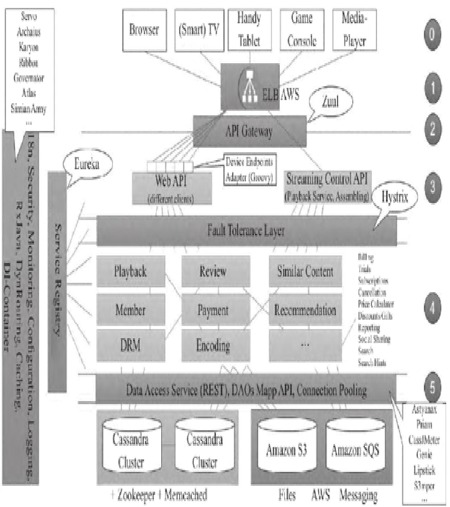
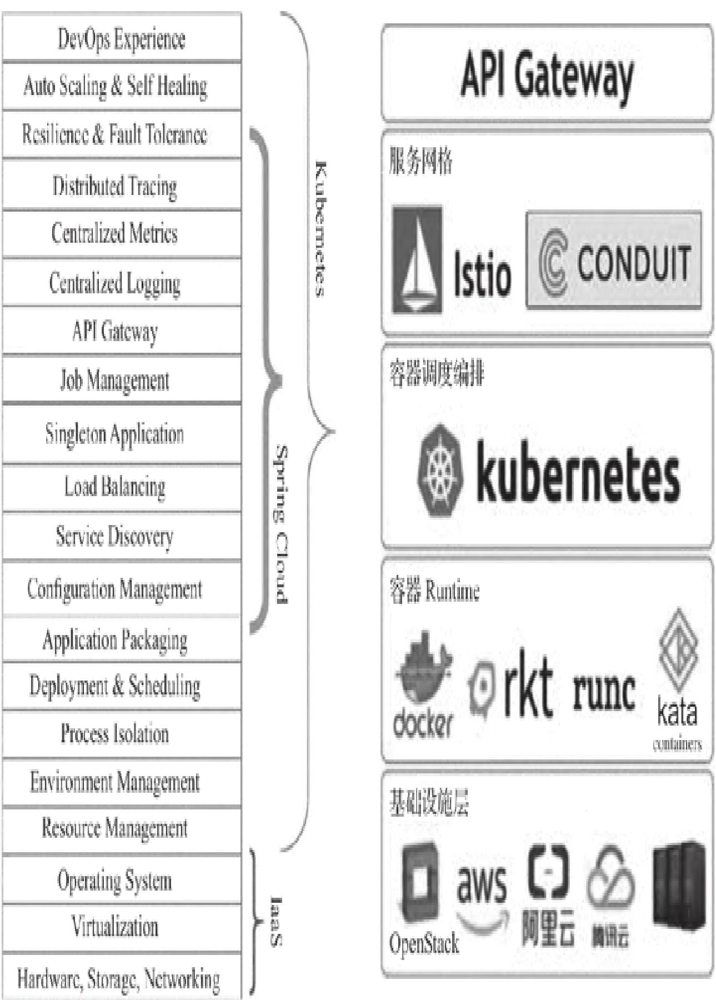
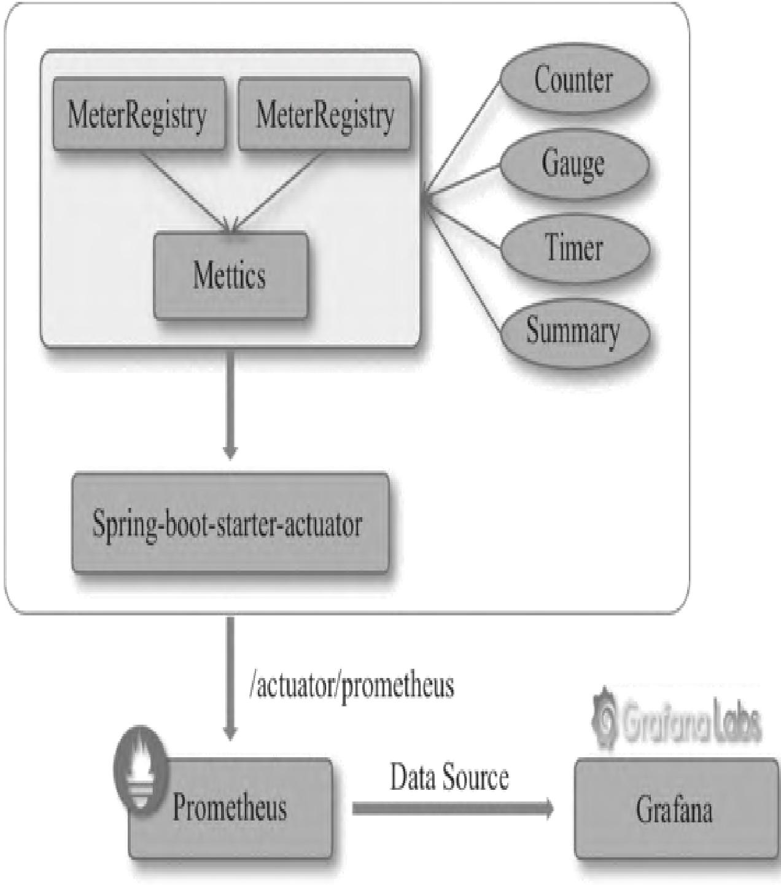
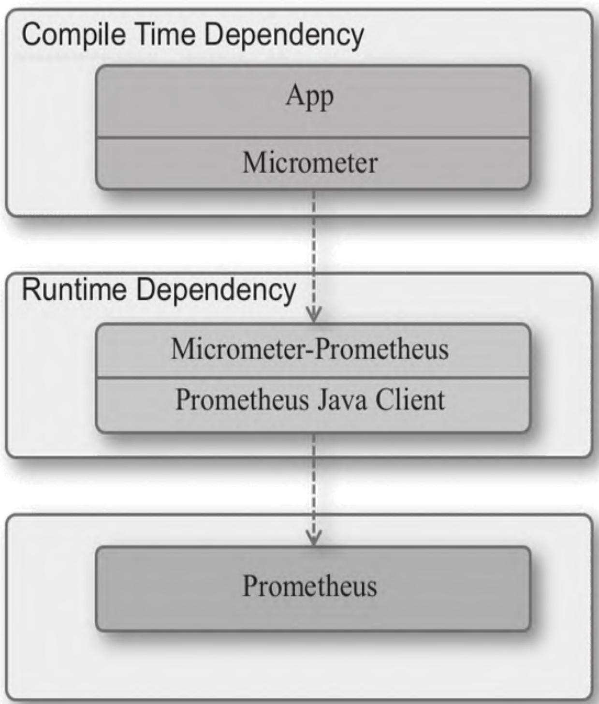
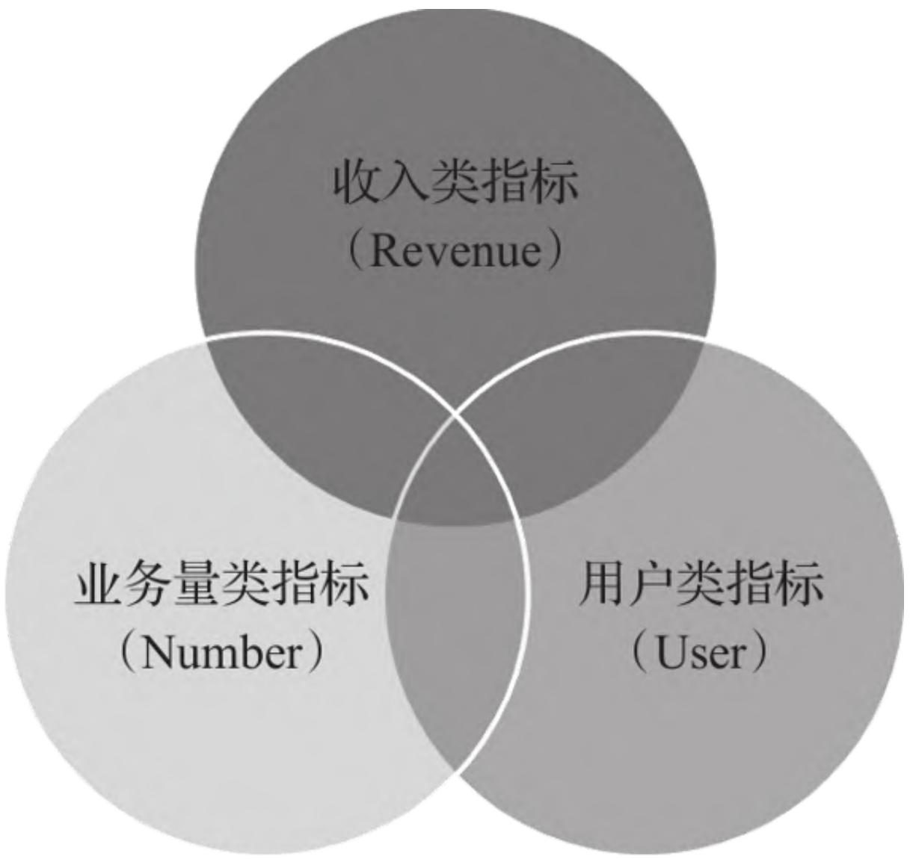
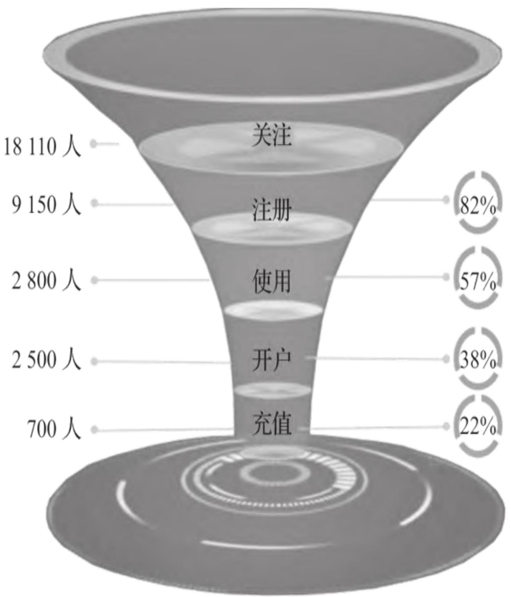

本文聚焦微服务与业务指标监控领域，从微服务架构特性出发，拆解微服务监控的核心挑战与维度，落地Spring Boot微服务监控的实操流程，同时详解业务运营指标体系的构建方法与自定义Metrics实现，帮助读者完成从微服务监控认知到业务指标落地的全链路掌握。

【本篇核心收获】

- 理解微服务架构模式（Netflix分层架构、Kubernetes+Service Mesh）及微服务监控的核心挑战
- 掌握微服务监控的三个维度（指标监控、链路监控、日志监控）和关键指标体系（URL监控、主机监控、产品监控等）
- 学会基于Spring Boot + Actuator + Micrometer构建微服务监控架构
- 掌握Actuator组件的配置与Prometheus集成方法，理解Micrometer中四种核心度量类型（Counter、Gauge、Timer、Summary）的使用场景与代码实现
- 掌握业务运营指标体系的结构化设计方法（RUN指标体系、AARRR框架），并能在Spring Boot中自定义Prometheus Metrics

## 1. 微服务监控

微服务体系结构通过将应用拆解为轻量级、松耦合的独立服务，解决了单体应用的部署、扩展等问题，但也带来了监控视角和复杂度的全新挑战。

### 1.1 微服务架构模式

微服务概念源于2014年Martin Fowler的《Microservices》一文，核心是将单一应用拆分为多个独立进程的小服务，通过HTTP/RESTful API或RPC通信，围绕业务构建且可独立部署。

#### 1.1.1 Netflix微服务从外而内分层视图架构

Netflix作为微服务标杆，其分层架构覆盖了从用户端到数据层的全链路，各层级职责清晰：


- **第0层：端用户设备层**：支持浏览器、手持设备、智能电视等超1000种终端设备。
- **第1层：接入层**：基于AWS ELB承接用户流量。
- **第2层：网关层**：通过Zuul网关实现反向路由、安全、限流熔断、日志监控等横切面功能，无业务逻辑，无状态部署。
- **第3层：聚合服务层（边界服务层）**：对后台服务聚合/裁减/加工后适配前端设备，主要使用Groovy脚本开发。
- **第4层：后台基础服务层（中间层服务层）**：提供Playback、Member、Review、Payment等核心业务服务。
- **第5层：数据访问层**：支持Cassandra、Memcached、Zookeeper等数据存储/中间件的访问。

#### 1.1.2 Kubernetes+Service Mesh=完整的微服务框架

Kubernetes是容器编排事实标准，容器作为微服务最小单元可最大化架构优势；Service Mesh（如Istio、Conduit）补足了K8s在服务通信上的短板，二者结合形成语言无关、覆盖Dev和Ops阶段的完整微服务框架（对比Dubbo、Spring Cloud等绑定特定语言/场景的框架更通用）。

Kubernetes+Service Mesh降低了微服务实施成本，为大规模落地提供了基础保障。

**模块小结**：微服务架构的核心是“拆”，Netflix分层架构和K8s+Service Mesh框架分别代表了业务层和基础设施层的最佳实践，是理解微服务监控范围的前提。

### 1.2 以服务为中心的监控

微服务监控与传统监控的核心区别是**视角从机器转向服务**，其面临的核心挑战包括：

- 监控对象动态可变，无法预先配置；
- 监控范围繁杂，各类监控难以融合；
- 服务间调用关系复杂，故障排查困难；
- 架构快速演进，难以抽象稳定的通用监控模型。

生产环境中还需应对：

- 监控数据爆炸式增长，要求监控系统具备高处理/展示能力；
- 监控系统需高可靠（无单点故障、数据可备份恢复）；
- 支持云上部署和快速水平扩容（云原生要求）。

微服务监控可分为三个核心维度，对应开源解决方案如下：

| 监控维度 | 核心作用 | 开源解决方案 |
|----------|----------|--------------|
| 指标监控 | 采集服务运行指标（如QPS、延迟） | Prometheus、InfluxDB |
| 链路监控 | 追踪服务间调用链路，定位性能瓶颈 | Zipkin、Pinpoint |
| 日志监控 | 聚合分析服务日志，排查业务/系统问题 | ELK（Elasticsearch+Logstash+Kibana） |

**模块小结**：以服务为中心的监控需解决“动态、复杂、海量”三大问题，指标、链路、日志三个维度缺一不可，共同构成微服务监控的核心体系。

### 1.3 微服务监控的关键指标

微服务监控的核心痛点是“服务多、调用杂”，需通过关键指标快速定位问题。从数据、资源、代码三个维度，可拆解出8类原子化监控场景：

| 产品/维度 | 数据维度 | 资源维度 | 代码维度 |
| :--- | :--- | :--- | :--- |
| URL监控 | ★ | | ★ |
| 主机监控 | | ★ | |
| 产品监控 | | ★ | |
| 组件监控 | | ★ | |
| 自定义监控 | ★ | ★ | ★ |
| 资源监控 | ★ | | ★ |
| 应用性能监控(APM) | ★ | | ★ |
| 事件监控 | | ★ | |

通过收集上述原子化场景数据，可基于用户体验设计统一UI，可视化展示全量监控数据。

**模块小结**：8类原子化监控场景覆盖了微服务从数据到资源再到代码的全维度，是构建微服务监控指标体系的基础。

## 2. 构建Spring Boot微服务监控

Spring Boot整合了成熟的微服务组件，可快速搭建监控体系，核心依赖`spring-boot-starter-actuator`导出运行指标，结合Micrometer实现多维度指标采集，最终对接Prometheus完成监控。

### 2.1 Spring Boot监控架构

Spring Boot监控的核心原理是：通过`spring-boot-starter-actuator`暴露监控端点，内部通过`MeterRegistryPostProcessor`将所有`MeterRegistry`类型Bean整合到`CompositeMeterRegistry`，最终统一导出指标给Prometheus。


**模块小结**：Spring Boot监控架构的核心是“Actuator暴露端点 + Micrometer统一指标 + Prometheus拉取数据”，实现指标采集-导出-存储的全链路。

### 2.2 配置加载Actuator监控组件

`spring-boot-starter-actuator`是Spring Boot监控的核心组件，支持HTTP/JMX方式管理/监控应用，包含健康检查、指标采集、审计日志等能力，配置步骤如下：

#### 步骤1：引入依赖

在`pom.xml`中添加以下依赖（适配Spring Boot 2.1.4.RELEASE）：

```xml
<!-- Spring boot actuator to expose metrics endpoint -->
<dependency>
    <groupId>org.springframework.boot</groupId>
    <artifactId>spring-boot-starter-actuator</artifactId>
</dependency>
<!-- Micrometer core dependency -->
<dependency>
    <groupId>io.micrometer</groupId>
    <artifactId>micrometer-core</artifactId>
</dependency>
<dependency>
    <groupId>io.micrometer</groupId>
    <artifactId>micrometer-registry-prometheus</artifactId>
</dependency>
```

#### 步骤2：配置Actuator端点访问权限

Spring Boot 2.x需显式配置对外开放的端点（1.x的`management.security.enabled`已废弃），默认端点路径前缀为`http://{host}/{port}/actuator/`。

**基础配置示例**：

```yaml
# 暴露所有端点，排除env、beans（无权限控制）
management.endpoints.web.exposure.include=*
management.endpoints.web.exposure.exclude=env,beans
# JMX暴露所有端点
management.endpoints.jmx.exposure.include=*
```

**仅暴露健康检查端点示例**：

```yaml
management.endpoints.web.exposure.include=health
```

Spring Boot 2.x核心端点说明：

| ID | 描述 |
| :--- | :--- |
| `auditevents` | 公开当前应用程序的审计事件信息 |
| `beans` | 显示应用程序中所有Spring bean的完整列表 |
| `configprops` | 显示应用中配置的属性信息报告 |
| `env` | 显示应用中所有可用的环境属性（环境变量、JVM属性、配置属性等） |
| `health` | 显示应用健康信息 |
| `httptrace` | 显示最后100个HTTP请求-响应交换的跟踪信息 |
| `info` | 显示应用自定义信息（默认空） |
| `metrics` | 显示应用运行指标（内存、线程、QPS等） |
| `mappings` | 显示所有URL映射关系 |
| `scheduledtasks` | 显示应用中的计划任务 |
| `shutdown` | 支持应用正常关机（需谨慎开启） |
| `threaddump` | 显示运行中的线程信息 |

配置完成后，访问`http://localhost:8080/actuator/prometheus`可获取Prometheus格式的指标数据，示例如下：

```txt
HTTP/1.1 200 OK
Content-Type: text/plain;version=0.0.4; charset=utf-8
Content-Length: 2375
# HELP jvm_memory_max_bytes The maximum amount of memory in bytes that can be used for memory management
# TYPE jvm_memory_max_bytes gauge
jvm_memory_max_bytes{area="heap",id="PS Survivor Space",} 3.0932992E7
jvm_memory_max_bytes{area="heap",id="PS Old Gen",} 7.16177408E8
...
```

#### 步骤3：在Prometheus中配置Spring Boot应用

修改`prometheus.yml`，添加针对Spring Boot应用的采集任务：

```yaml
scrape_configs:
- job_name: 'spring'
  metrics_path: '/actuator/prometheus'  # Actuator暴露的Prometheus端点路径
  static_configs:
  - targets: ['HOST:PORT']  # 替换为Spring Boot应用的IP和端口
```

**避坑指南**：

- 确保Spring Boot应用的`actuator/prometheus`端点可被Prometheus服务器访问（无防火墙/网络策略拦截）；
- `targets`配置需使用实际的IP:Port，而非localhost（除非Prometheus与应用部署在同一机器）；
- 若修改了Actuator端点前缀，需同步调整`metrics_path`。

**模块小结**：Actuator配置的核心是“引入依赖 + 开放端点 + 配置Prometheus采集”，需注意2.x版本与1.x的配置差异，避免权限配置失效。

### 2.3 使用io.micrometer构建监控指标

Spring Boot 2.x重构了Metrics体系，核心引入`io.micrometer`，支持Tag/Label多维度监控，其与Spring Boot、Prometheus的集成关系如下：


Micrometer核心概念：

- **计量器（Meter）**：需采集的性能指标（如Counter、Gauge）；
- **计量器注册表（MeterRegistry）**：创建/维护计量器，不同监控系统有专属实现（如`PrometheusMeterRegistry`）；
- **CompositeMeterRegistry**：组合多个注册表，支持同时向多监控系统推送指标；
- **Tag**：多维度监控的基础（K-V键值对），需成对出现。

Micrometer 1.1.4版本支持四种核心度量类型，以下是各自的使用场景与代码实现：

#### 2.3.1 Counter（计数器）

**核心特性**：只增不减的单值计数器，计数值为double类型，默认增量1.0。
**使用场景**：记录请求数、任务完成数、错误数等。
**代码实现**：

```java
public class Counters {
    private SimpleMeterRegistry registry = new SimpleMeterRegistry();
    private double value = 0.0;
    
    public void counter() {
        // 方式1：直接通过注册表创建
        Counter counter1 = registry.counter("simple1");
        counter1.increment(2.0); // 增量2.0
        
        // 方式2：通过Builder创建（支持描述、Tag）
        Counter counter2 = Counter.builder("simple2")
                .description("A simple counter")
                .tag("tag1", "a")
                .register(registry);
        counter2.increment(); // 默认增量1.0
    }
    
    public void functionCounter() {
        // 基于方法返回值创建FunctionCounter
        List<Tag> tags = new ArrayList<>();
        registry.more().counter("function1", tags, this, Counters::getValue);
        
        // Builder方式创建FunctionCounter
        FunctionCounter functionCounter = FunctionCounter.builder("function2", this, Counters::getValue)
                .description("A function counter")
                .tags(tags)
                .register(registry);
        functionCounter.count();
    }
    
    private double getValue() {
        return value++;
    }
}
```

#### 2.3.2 Gauge（计量仪）

**核心特性**：可增可减的单值指标，取样时返回当前值，无法手动修改。
**使用场景**：记录内存使用率、队列长度、实时并发数等。
**代码实现**：

```java
public class Gauges {
    private SimpleMeterRegistry registry = new SimpleMeterRegistry();
    
    public void gauge() {
        // 记录AtomicInteger值
        AtomicInteger value = registry.gauge("gauge1", new AtomicInteger(0));
        value.set(1);
        
        // 记录集合大小
        List<String> list = registry.gaugeCollectionSize("list.size", Collections.emptyList(), new ArrayList<>());
        list.add("a");
        
        // 记录Map大小
        Map<String, String> map = registry.gaugeMapSize("map.size", Collections.emptyList(), new HashMap<>());
        map.put("a", "b");
        
        // Builder方式创建（支持动态取值）
        Gauge.builder("value", this, Gauges::getValue)
                .description("a simple gauge")
                .tag("tag1", "a")
                .register(registry);
    }
    
    private double getValue() {
        // 返回随机值模拟动态变化
        return ThreadLocalRandom.current().nextDouble();
    }
}
```

#### 2.3.3 Timer（计时器）

**核心特性**：记录事件持续时间，自动统计事件数量和总耗时，无需单独创建Counter。
**使用场景**：记录接口响应时间、任务执行耗时等。
**代码实现**：

```java
public class Timers {
    private SimpleMeterRegistry registry = new SimpleMeterRegistry();
    
    public void record() {
        // 直接记录Runnable执行时间
        Timer timer = registry.timer("simple");
        timer.record(() -> {
            try {
                Thread.sleep(3000); // 模拟耗时操作
            } catch (InterruptedException e) {
                e.printStackTrace();
            }
        });
    }
    
    public void sample() {
        // 手动启动/停止计时（适用于异步场景）
        Timer.Sample sample = Timer.start();
        new Thread(() -> {
            try {
                Thread.sleep(2000); // 模拟异步耗时操作
            } catch (InterruptedException e) {
                e.printStackTrace();
            }
            sample.stop(registry.timer("sample")); // 停止计时并记录
        }).start();
    }
}
```

#### 2.3.4 Summary（分布摘要）

**核心特性**：跟踪事件分布（如响应时间分布），支持直方图和百分比计算，对应类`DistributionSummary`。
**使用场景**：分析指标的分布特征（如50%/75%/90%响应时间）。
**代码实现**：

```java
public class DistributionSummaries {
    private SimpleMeterRegistry registry = new SimpleMeterRegistry();
    
    public void summary() {
        DistributionSummary summary = DistributionSummary.builder("simple")
                .description("simple distribution summary")
                .minimumExpectedValue(1L) // 最小预期值
                .maximumExpectedValue(10L) // 最大预期值
                .publishPercentiles(0.5, 0.75, 0.9) // 发布50%、75%、90%分位值
                .register(registry);
        
        // 记录样本值
        summary.record(1);
        summary.record(1.3);
        summary.record(2.4);
        summary.record(3.5);
        summary.record(4.1);
        
        // 输出数据快照（包含最大值、总和、平均值、总次数）
        System.out.println(summary.takeSnapshot());
    }
    
    public static void main(String[] args) {
        new DistributionSummaries().summary();
    }
}
```

**避坑指南**：

- Gauge创建后无法手动修改值，需通过绑定对象（如AtomicInteger、集合）或方法实现动态取值；
- Timer的`sample()`方法需确保`stop()`被执行，否则会导致计时数据丢失；
- Summary的分位值计算若数据量小，结果可能不具备参考性，需保证样本量充足。

**模块小结**：Micrometer的四种度量类型覆盖了“计数、动态值、耗时、分布”四大类指标场景，结合Tag可实现多维度监控，是Spring Boot指标采集的核心工具。

## 3. 业务监控与运营指标

监控的最终目标是服务业务，构建结构化的业务运营指标体系，可实现业务问题预警、根因定位，是数据驱动运营的核心基础。

### 3.1 业务运营指标

结构化指标体系的核心价值：

1. 指标异常时，可通过层级拆解定位问题；
2. 达成KPI时，可通过体系分解落地路径。

主流指标体系框架：

#### （1）RUN指标体系（通用型）

覆盖互联网/运营商核心业务维度，是结构化指标体系的基础：


- **R（Revenue）**：收入类指标（如流水、ARPU、付费率）；
- **U（User）**：用户类指标（如DAU、MAU、留存率）；
- **N（Number）**：业务量类指标（如播放量、安装量、PV/UV）。

#### （2）AARRR框架（移动APP专用）

聚焦用户生命周期转化，覆盖拉新到传播全流程：


- **A（Acquisition）**：获取用户（如新增用户数、渠道转化率）；
- **A（Activation）**：用户激活（如首日留存、功能使用率）；
- **R（Retention）**：用户留存（如7日留存、月留存）；
- **R（Revenue）**：收益转化（如付费金额、客单价）；
- **R（Refer）**：口碑传播（如分享率、邀请新增数）。

**模块小结**：RUN体系是通用框架，AARRR是垂直场景补充，二者结合可覆盖大部分业务的指标需求，核心是“结构化”和“业务导向”。

### 3.2 业务量类指标

业务量类指标是RUN体系的核心，承载业务价值，反映用户忠诚度/活跃度，分为两类：

#### （1）核心业务量指标

- 定义：业务的核心价值指标，通常是KPI关键项；
- 示例：音乐试听量、视频播放量、应用安装量、网站PV/UV、运营商通话时长/流量。

#### （2）普通业务量指标

- 定义：用户行为类指标，数据稀疏但反映用户深度需求；
- 示例：搜索量、评论量、分享量、UGC量、点击量、收藏量；
- 价值：此类指标用户占比低，但忠诚度/不满度极高（如网易云音乐的评论功能提升用户粘性）。

业务量指标最终需产品化/平台化呈现（如DW平台、数据仪表盘），供决策/运营人员查看。

**模块小结**：核心业务量指标是业务的“生命线”，普通业务量指标是“增值线”，二者结合可全面反映业务的用户行为特征。

### 3.3 构建运营指标体系

构建高质量指标体系需遵循三大原则：

#### （1）立足于业务

- 被动适配：响应业务方需求，实现报表/指标；
- 主动设计：数据部门基于业务理解，主动提供指标体系建议（如整合多业务共性、补充漏斗分析等）；
- 核心：指标需真实反映业务场景，避免“为指标而指标”。

#### （2）结构化体系

- 核心价值：异常定位、KPI拆解；
- 落地方式：仅对核心指标（如流水、DAU、核心业务量）进行结构化拆解；
- 示例：游戏安装量下降→拆解为“新安装/更新安装”→“渠道A/渠道B”→“页面X/页面Y”→定位根因。

#### （3）良好的可视化能力

- 核心价值：快速发现问题/规律，降低理解成本；
- 选型原则：
  - 趋势类（如收入增长）：用折线图/柱状图；
  - 占比类（如渠道分布）：用饼图/环形图；
  - 对比类（如不同版本指标）：用表格/分组柱状图；
  - 漏斗类（如用户转化）：用漏斗图。

**模块小结**：业务指标体系的核心是“业务导向、结构化拆解、可视化呈现”，三者缺一不可，才能真正发挥数据驱动运营的价值。

## 4. 在Spring Boot自定义Metrics

基于Prometheus Java Client，可扩展Spring Boot的监控埋点，实现自定义业务指标的采集与导出，覆盖Prometheus四大指标类型（Counter、Gauge、Histogram、Summary）。

### 4.1 扩展Spring Boot支持监控埋点

#### 步骤1：添加Prometheus Java Client依赖

在`build.gradle`中添加：

```gradle
dependencies {
    compile "io.prometheus:simpleclient:0.0.24"
    compile "io.prometheus:simpleclient_spring_boot:0.0.24"
    compile "io.prometheus:simpleclient_hotspot:0.0.24"
}
```

#### 步骤2：启用Prometheus Metrics Endpoint

添加`@EnablePrometheusEndpoint`注解，同时初始化`DefaultExporter`（导出JVM指标）：

```java
@SpringBootApplication
@EnablePrometheusEndpoint
public class SpringApplication implements CommandLineRunner {
    public static void main(String[] args) {
        SpringApplication.run(GatewayApplication.class, args);
    }
    
    @Override
    public void run(String... strings) throws Exception {
        DefaultExports.initialize(); // 导出JVM相关指标
    }
}
```

**配置修改（可选）**：默认端点为`/prometheus`，可通过配置调整：

```yaml
endpoints:
  prometheus:
    id: metrics
    sensitive: true
    enabled: true
```

启动应用后访问`http://localhost:8080/metrics`，可看到JVM指标示例：

```tcl
# HELP jvm_gc_collection_seconds Time spent in a given JVM garbage collector in seconds.
# TYPE jvm_gc_collection_seconds summary
jvm_gc_collection_seconds_count{gc="PS Scavenge",} 11.0
jvm_gc_collection_seconds_sum{gc="PS Scavenge",} 0.18
# HELP jvm_classes_loaded The number of classes that are currently loaded in the JVM
# TYPE jvm_classes_loaded gauge
jvm_classes_loaded 8376.0
...
```

#### 步骤3：添加拦截器，为监控埋点做准备

通过拦截器捕获所有HTTP请求，为自定义指标采集做准备：

```java
@SpringBootApplication
@EnablePrometheusEndpoint
public class SpringApplication extends WebMvcConfigurerAdapter implements CommandLineRunner {
    // 注册拦截器，覆盖所有请求
    @Override
    public void addInterceptors(InterceptorRegistry registry) {
        registry.addInterceptor(new PrometheusMetricsInterceptor()).addPathPatterns("/**");
    }
    
    // 省略main/run方法...
}

// 自定义拦截器，捕获请求前后事件
public class PrometheusMetricsInterceptor extends HandlerInterceptorAdapter {
    @Override
    public boolean preHandle(HttpServletRequest request, HttpServletResponse response, Object handler) throws Exception {
        // 请求处理前逻辑（如记录开始时间）
        return super.preHandle(request, response, handler);
    }
    
    @Override
    public void afterCompletion(HttpServletRequest request, HttpServletResponse response, Object handler, Exception ex) throws Exception {
        // 请求完成后逻辑（如记录耗时、响应码）
        super.afterCompletion(request, response, handler, ex);
    }
}
```

**避坑指南**：

- 拦截器需确保`preHandle`返回`true`，否则请求会被拦截；
- `afterCompletion`无论请求是否异常都会执行，适合记录最终指标；
- 避免在拦截器中执行耗时操作，防止影响接口响应性能。

**模块小结**：扩展Spring Boot监控埋点的核心是“引入依赖 + 启用端点 + 拦截请求”，为自定义业务指标采集搭建基础框架。

### 4.2 自定义Metrics监控指标

Prometheus核心支持4种指标类型，以下是Spring Boot中自定义实现的实操案例：

#### 4.2.1 Counter：只增不减的计数器

**使用场景**：记录接口访问次数、业务操作次数等。
**代码实现**：

```java
package com.tom.controller;

import io.prometheus.client.CollectorRegistry;
import io.prometheus.client.Counter;
import org.springframework.web.bind.annotation.GetMapping;
import org.springframework.web.bind.annotation.RestController;

@RestController
public class CounterController {
    private final Counter requestCount;
    
    // 注入CollectorRegistry（Spring Boot默认注册表）
    public CounterController(CollectorRegistry collectorRegistry) {
        requestCount = Counter.build()
                .name("request_count") // 指标名
                .help("Number of hello requests") // 指标说明
                .register(collectorRegistry); // 绑定到注册表
    }
    
    @GetMapping(value = "/hello")
    public String hello() {
        requestCount.inc(); // 每次访问计数器+1
        return "Hi!";
    }
}
```

**验证方式**：访问`/actuator/prometheus`，可看到指标：

```txt
# HELP request_count Number of times requested hello.
# TYPE request_count counter
request_count 15.0
```

#### 4.2.2 Gauge：可增可减的仪表盘

**使用场景**：记录实时在线人数、队列长度、库存数量等动态变化值。
**代码实现**：

```java
package com.tom.controller;

import io.prometheus.client.CollectorRegistry;
import io.prometheus.client.Gauge;
import org.springframework.web.bind.annotation.GetMapping;
import org.springframework.web.bind.annotation.PostMapping;
import org.springframework.web.bind.annotation.RequestParam;
import org.springframework.web.bind.annotation.RestController;

@RestController
public class GaugeController {
    private final Gauge onlineUserCount;
    
    public GaugeController(CollectorRegistry collectorRegistry) {
        onlineUserCount = Gauge.build()
                .name("online_user_count")
                .help("Real-time online user count")
                .register(collectorRegistry);
    }
    
    // 增加在线人数
    @PostMapping("/user/online")
    public String userOnline() {
        onlineUserCount.inc();
        return "User online, current count: " + onlineUserCount.get();
    }
    
    // 减少在线人数
    @PostMapping("/user/offline")
    public String userOffline() {
        onlineUserCount.dec();
        return "User offline, current count: " + onlineUserCount.get();
    }
    
    // 查询当前在线人数
    @GetMapping("/user/count")
    public String getUserCount() {
        return "Current online users: " + onlineUserCount.get();
    }
}
```

**验证方式**：调用`/user/online`/`/user/offline`后，访问`/actuator/prometheus`可看到指标值动态变化：

```txt
# HELP online_user_count Real-time online user count
# TYPE online_user_count gauge
online_user_count 8.0
```

#### 4.2.3 Histogram：直方图

**核心特性**：将指标值划分到不同桶（bucket），统计每个桶的数量，支持计算分位值。
**使用场景**：记录接口响应时间分布、业务操作耗时分布等。
**代码实现**：

```java
package com.tom.controller;

import io.prometheus.client.CollectorRegistry;
import io.prometheus.client.Histogram;
import org.springframework.web.bind.annotation.GetMapping;
import org.springframework.web.bind.annotation.RestController;

import java.util.Random;

@RestController
public class HistogramController {
    private final Histogram requestLatency;
    private final Random random = new Random();
    
    public HistogramController(CollectorRegistry collectorRegistry) {
        requestLatency = Histogram.build()
                .name("request_latency_seconds")
                .help("Request latency in seconds")
                .buckets(0.05, 0.1, 0.2, 0.5, 1.0) // 定义桶：50ms、100ms、200ms、500ms、1000ms
                .register(collectorRegistry);
    }
    
    @GetMapping("/api/latency")
    public String latencyApi() {
        // 记录耗时（模拟随机响应时间：0-1000ms）
        Histogram.Timer timer = requestLatency.startTimer();
        try {
            long sleepTime = random.nextInt(1000);
            Thread.sleep(sleepTime);
            return "API completed in " + sleepTime + "ms";
        } catch (InterruptedException e) {
            Thread.currentThread().interrupt();
            return "API interrupted";
        } finally {
            timer.observeDuration(); // 停止计时并记录
        }
    }
}
```

**验证方式**：多次调用`/api/latency`后，访问`/actuator/prometheus`可看到桶分布数据：

```txt
# HELP request_latency_seconds Request latency in seconds
# TYPE request_latency_seconds histogram
request_latency_seconds_bucket{le="0.05",} 12.0
request_latency_seconds_bucket{le="0.1",} 25.0
request_latency_seconds_bucket{le="0.2",} 48.0
request_latency_seconds_bucket{le="0.5",} 76.0
request_latency_seconds_bucket{le="1.0",} 100.0
request_latency_seconds_bucket{le="+Inf",} 100.0
request_latency_seconds_count 100.0
request_latency_seconds_sum 38.56
```

#### 4.2.4 Summary：摘要

**核心特性**：直接统计分位值（如P50、P95），无需手动定义桶，适合关注精准分位值的场景。
**使用场景**：记录核心接口的95%响应时间、订单金额分布等。
**代码实现**：

```java
package com.tom.controller;

import io.prometheus.client.CollectorRegistry;
import io.prometheus.client.Summary;
import org.springframework.web.bind.annotation.PostMapping;
import org.springframework.web.bind.annotation.RequestParam;
import org.springframework.web.bind.annotation.RestController;

@RestController
public class SummaryController {
    private final Summary orderAmountSummary;
    
    public SummaryController(CollectorRegistry collectorRegistry) {
        orderAmountSummary = Summary.build()
                .name("order_amount_summary")
                .help("Order amount summary with percentiles")
                .quantile(0.5, 0.05) // P50，误差5%
                .quantile(0.95, 0.01) // P95，误差1%
                .register(collectorRegistry);
    }
    
    @PostMapping("/order/create")
    public String createOrder(@RequestParam("amount") double amount) {
        orderAmountSummary.observe(amount); // 记录订单金额
        return "Order created, amount: " + amount;
    }
}
```

**验证方式**：多次创建不同金额的订单后，访问`/actuator/prometheus`可看到分位值数据：

```txt
# HELP order_amount_summary Order amount summary with percentiles
# TYPE order_amount_summary summary
order_amount_summary{quantile="0.5",} 100.0
order_amount_summary{quantile="0.95",} 500.0
order_amount_summary_count 200.0
order_amount_summary_sum 18560.0
```

**避坑指南**：

- Counter仅支持`inc()`，若需递减需使用Gauge；
- Histogram的桶需根据业务场景合理定义（过细会增加存储，过粗会降低精度）；
- Summary的分位值计算会消耗更多内存，高并发场景需谨慎使用；
- 所有自定义指标名需符合Prometheus规范（字母、数字、下划线，首字符为字母）。

**模块小结**：自定义Metrics需根据业务场景选择合适的指标类型，Counter/Gauge适用于简单计数/动态值，Histogram/Summary适用于分布/分位值统计，核心是“绑定注册表 + 埋点采集 + 验证输出”。

## 本篇核心知识点速记

1. 微服务监控核心是“以服务为中心”，覆盖指标、链路、日志三个维度，需应对动态、复杂、海量三大挑战；
2. Spring Boot监控架构：Actuator暴露端点 + Micrometer采集指标 + Prometheus拉取数据，Micrometer支持Counter/Gauge/Timer/Summary四种度量类型；
3. 业务指标体系需结构化，RUN体系（收入/用户/业务量）是通用框架，AARRR框架适用于APP用户生命周期；
4. 自定义Prometheus Metrics的核心步骤：引入Java Client依赖 → 启用Prometheus端点 → 拦截请求/业务埋点 → 选择对应指标类型实现采集；
5. Prometheus四大指标类型：Counter（只增不减）、Gauge（可增可减）、Histogram（桶分布）、Summary（分位值），需根据业务场景选择。
