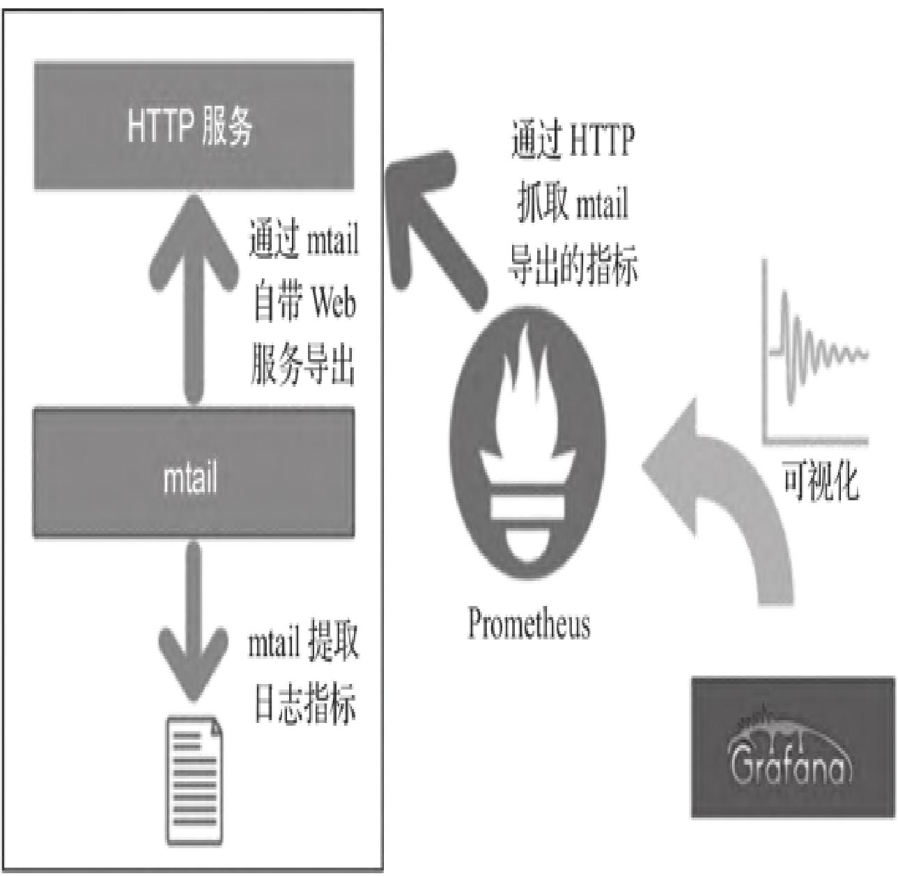
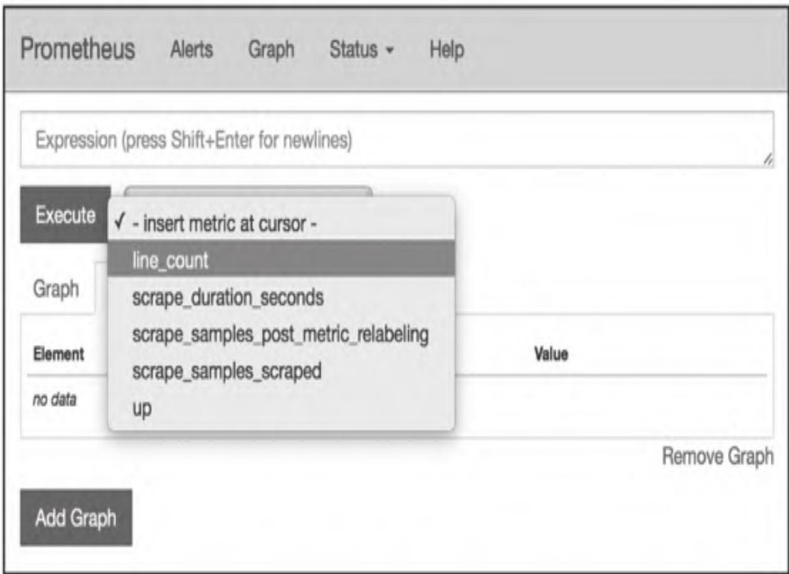
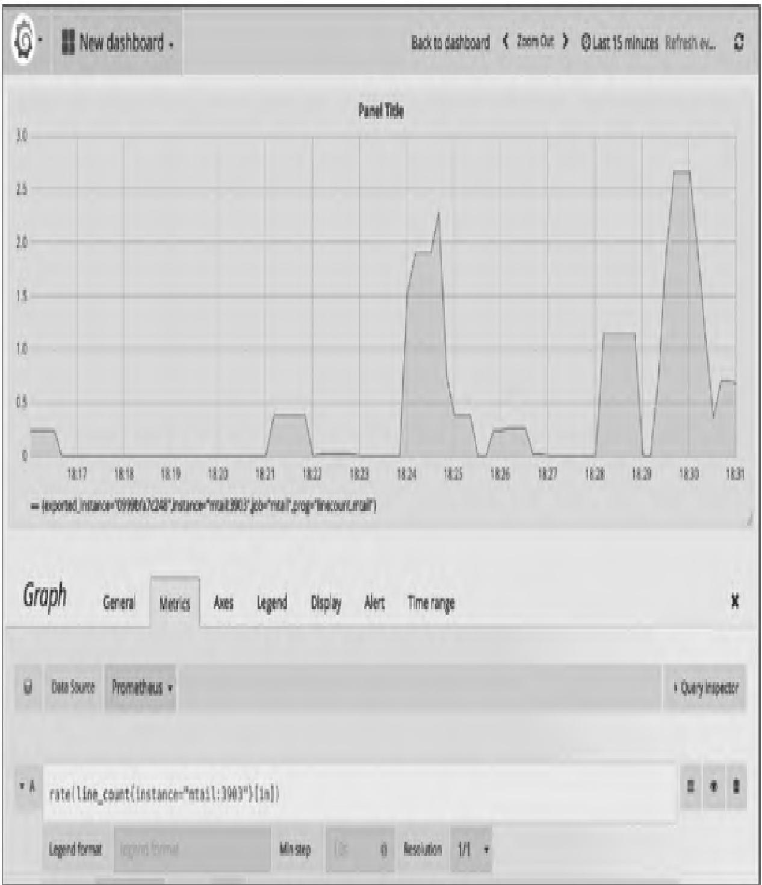
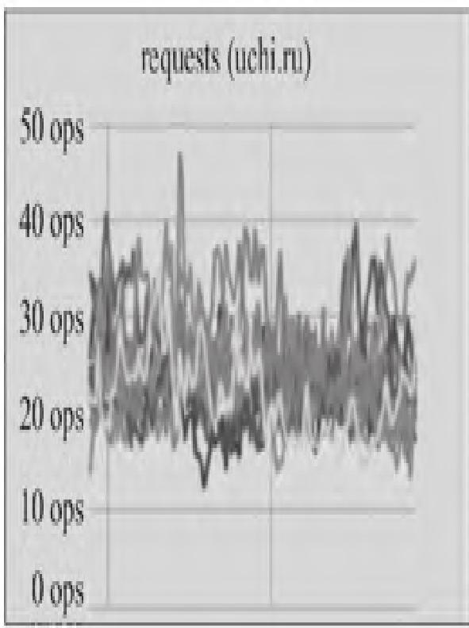
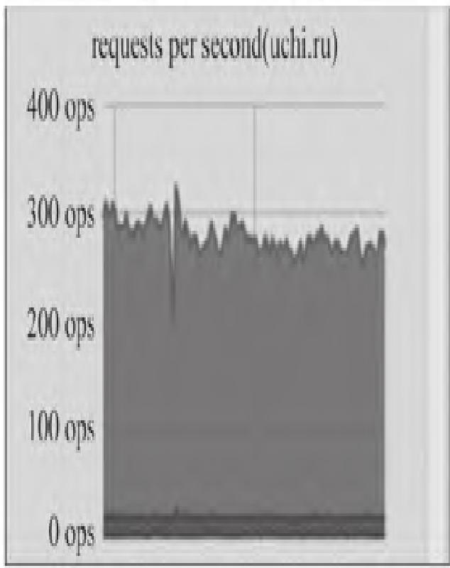
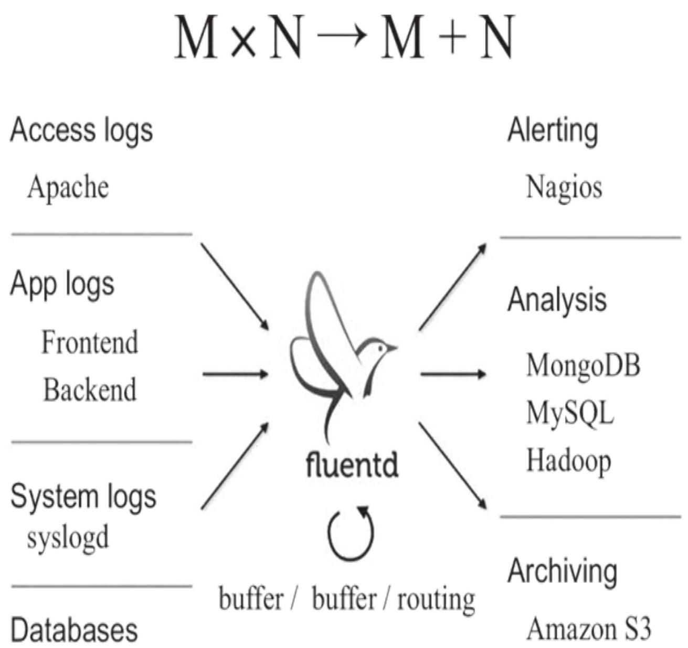
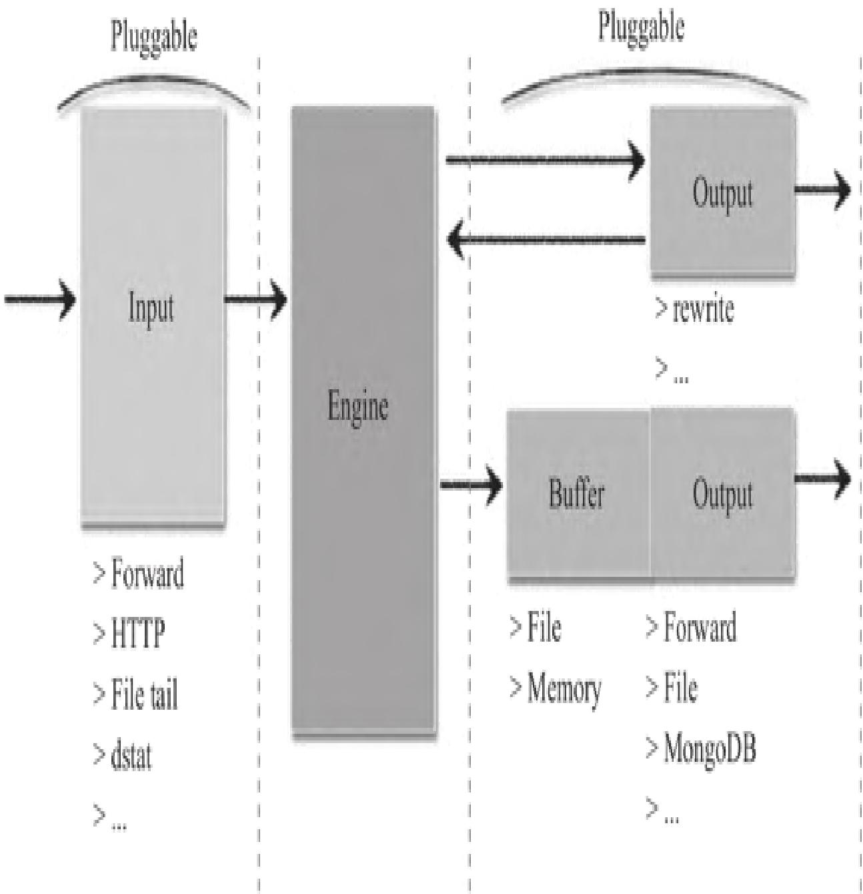
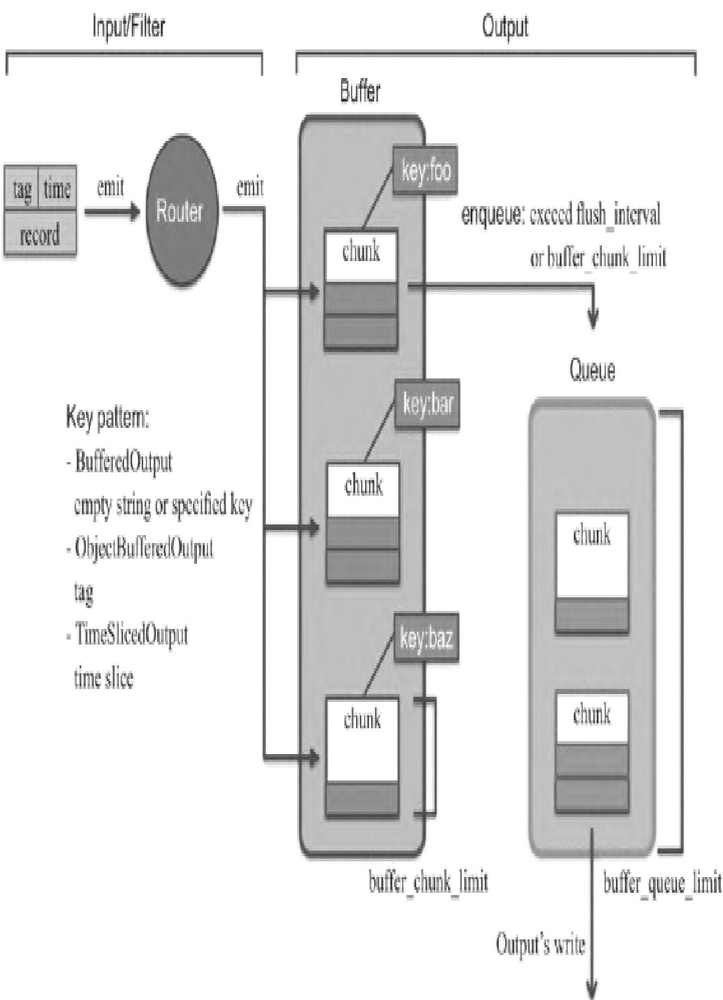
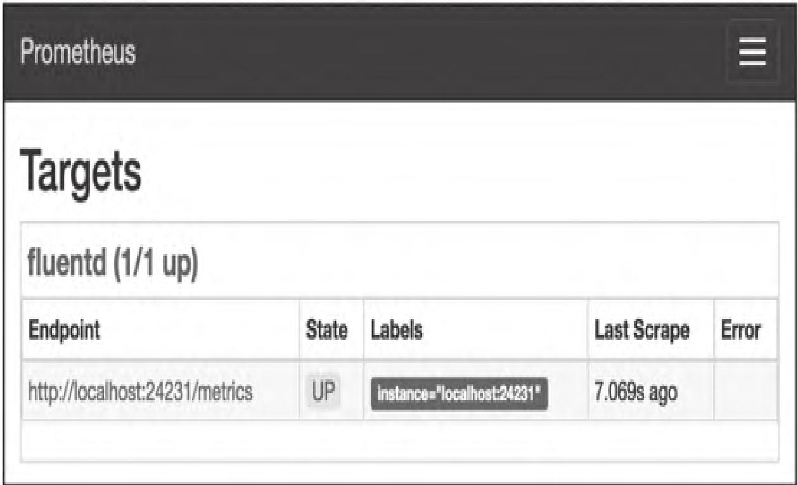
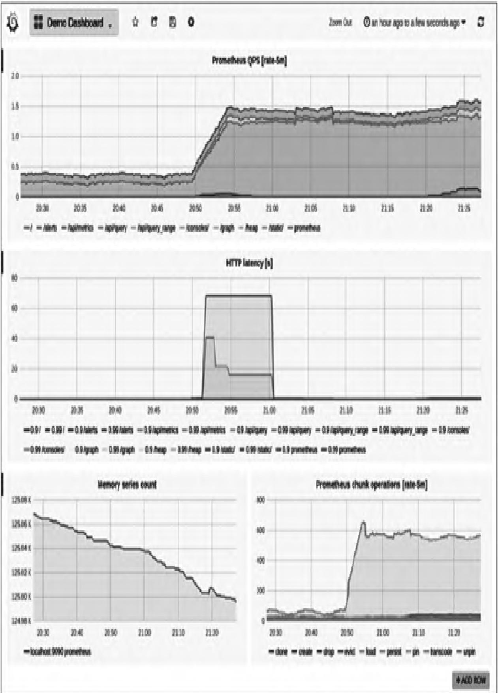

本文聚焦Prometheus生态下的日志监控落地实践，系统拆解mtail、Fluentd主流日志监控方案的核心原理、环境搭建、实操配置与集成方法，学完后可独立完成从日志解析到Prometheus抓取、Grafana可视化的全流程日志监控体系搭建。

### 【本篇核心收获】

- 掌握日志监控的核心价值与主流技术方案（mtail/Fluentd）的优劣对比
- 独立完成mtail的环境搭建、规则编写、与Prometheus/Grafana的集成配置
- 理解Fluentd的核心架构与插件体系，实现Fluentd+Prometheus的日志指标监控
- 熟悉日志监控从指标提取到可视化展示的全链路落地逻辑与避坑要点

## 13.1 日志监控概述

日志是带时间戳的时间序列机器数据，涵盖IT系统（服务器、网络设备、操作系统、应用软件）及物联网传感器等信息，能真实反映用户行为与系统运行状态。随着集群规模扩大，日志处理方案经历了三个阶段：

| 阶段 | 核心特征 | 局限性 |
|------|----------|--------|
| 日志处理v1.0 | 无集中式处理、事后追查、数据库存储 | 黑客删日志无法察觉、无法处理复杂事务 |
| 日志处理v2.0 | Hadoop离线批处理、Storm/Spark流处理 | 实时性差、需二次开发，非开箱即用 |
| 日志处理v3.0 | 实时搜索引擎分析（Splunk/ELK/SILK/EFK） | 实时性强（秒级延时）、处理量大（TB级/天）、灵活度高 |

通过工具解析日志条目生成度量指标，可作为Prometheus的抓取数据源。当前主流的日志转Prometheus指标方案有三种：

- **mtail**：谷歌SRE团队开发，功能强大，支持自定义正则规则提取指标，官方地址：<https://github.com/google/mtail>
- **fluentd+prometheus插件**：支持指标少，高级正则支持不完善，官方地址：<https://github.com/kazegusuri/fluent-plugin-prometheus>
- **grok_exporter**：导出指标少，一个文件需一个实例，使用不便，官方地址：<https://github.com/fstab/grok_exporter>

**模块小结**：日志监控的核心是将非结构化日志解析为结构化的Prometheus指标，mtail是功能最灵活的主流方案，Fluentd侧重日志采集与流转，grok_exporter轻量化但扩展性弱。

## 13.2 mtail日志监控

mtail由谷歌SRE团队开发，遵循Apache2.0协议，基于Go语言实现，专为从应用日志提取度量指标并导出到时间序列数据库设计，无需修改应用程序即可监控无法直接暴露内部状态的应用。其核心是通过规则程序定义日志匹配模式，生成对应度量指标，支持Prometheus、collectd、graphite、statsd等监控工具。

### 13.2.1 mtail安装与使用

mtail支持Linux、Windows、iOS环境，需依赖≥1.9版本的Go运行环境，以下以CentOS7为例讲解安装与基础使用。

#### 1. 环境准备（CentOS7配置Golang）

步骤1：下载Go安装包（国内源）

```shell
wget https://golang.google.cn/dl/go1.12.1.linux-amd64.tar.gz
```

步骤2：解压到/usr/local目录

```shell
tar -zxvf go1.12.1.linux-amd64.tar.gz -C /usr/local/
```

步骤3：新建Go项目根目录

```shell
mkdir -p /var/opt/wwwroot/goblog
```

步骤4：配置环境变量（/etc/profile）

```shell
vim /etc/profile
# 新增以下内容
export GOROOT=/usr/local/go
export GOBIN=$GOROOT/bin
export PATH=$PATH:$GOBIN
export GOPATH=/var/opt/wwwroot/goblog
# 生效配置
source /etc/profile
```

步骤5：验证安装

```shell
go version
# 预期输出：go version go1.12.1 linux/amd64
```

#### 2. 安装mtail

步骤1：下载二进制文件（v3.0.0-rc29）

```shell
wget https://github.com/google/mtail/releases/download/v3.0.0-rc29/mtail_v3.0.0-rc29_linux_amd64
```

步骤2：移动并赋予执行权限

```shell
mv mtail_v3.0.0-rc29_linux_amd64 /usr/bin/mtail
chmod 0755 /usr/bin/mtail
```

步骤3：验证安装（查看参数）

```shell
mtail -help
# 预期输出包含版本信息及36个配置参数说明
```

mtail常用参数如下：

| 参数 | 类型 | 说明 |
|------|------|------|
| -address | string | 绑定HTTP监听的主机/IP地址 |
| -logs | value | 要监控的日志清单（多文件用逗号分隔） |
| -mtailDebug | int | 设置解析器的调试级别 |
| -override_timezone | string | 覆盖时间戳时区（默认UTC） |
| -poll_interval | duration | 日志文件轮询间隔（正数，0为不轮询） |
| -port | string | HTTP监听端口（默认3903） |
| -progs | string | 存放mtail规则程序的目录 |
| -version | - | 输出mtail版本信息 |

#### 3. mtail规则编写基础

mtail规则文件以`.mtail`为后缀，核心是定义计数器/度量器、日志匹配规则及动作。示例（行计数规则`line_count.mtail`）：

```mtail
counter line_count /$/ {
    line_count++
}
```

- `counter`：声明计数器类型指标
- `/$/`：RE2正则匹配行尾（mtail基于RE2正则引擎，支持Linux/UNIX平台）
- `line_count++`：匹配到行尾时计数器+1

**避坑提示**：mtail的正则规则基于RE2，不支持PCRE的回溯特性，编写复杂正则时需注意语法兼容。

**模块小结**：mtail安装依赖Go环境，核心是规则文件编写，通过正则匹配日志并生成指标，常用参数需重点掌握`-progs`（规则目录）和`-logs`（监控日志）。

### 13.2.2 mtail运行与输出

#### 1. 启动mtail

```shell
mtail --progs /etc/mtail --logs '/var/log/'
```

- `--progs`：指定规则文件目录（加载所有.mtail后缀文件）
- `--logs`：指定监控的日志目录/文件
- 启动后默认在3903端口暴露HTTP服务，可通过`-address`/`-port`修改

#### 2. Web界面输出

访问`http://192.168.1.100:3903/`，可查看日志监控的基础信息，包括程序加载状态、监控的日志文件及行数等：


#### 3. metrics指标输出

访问`http://192.168.1.100:3903/metrics`，可获取Prometheus可抓取的指标，示例输出：

```shell
# HELP mtail_line_count number of lines received by the program loader  
# TYPE mtail_line_count untyped  
mtail_line_count 119  
# HELP mtail_loglines_total number of lines read per log file  
# TYPE mtail_loglines_total untyped  
mtail_loglines_total{logfile="/var/log/cron"} 29  
mtail_loglines_total{logfile="/var/log/messages"} 57  
mtail_loglines_total{logfile="/var/log/secure"} 8  
mtail_loglines_total{logfile="/var/log/wtmp"} 25 
```

**模块小结**：mtail启动后通过3903端口暴露Web界面和metrics指标，Web界面用于可视化查看监控状态，metrics路径为Prometheus提供标准化指标数据。

### 13.2.3 mtail与Prometheus、Grafana集成

#### 1. Prometheus抓取配置

修改`prometheus.yml`，新增mtail作业：

```yaml
global:
    scrape_interval: 10s
    evaluation_interval: 10s
    external_labels:
        monitor: 'codelab-monitor'
rule_files:
# - "/var/app/prometheus/alert.rules"
scrape_configs:
    - job_name: 'mtail'
      static_configs:
          - targets: ['192.168.1.100:3903']
```

配置完成后重启Prometheus，可在Web UI（`http://<prometheus-ip>:9090`）查看抓取的`line_count`指标：


#### 2. Grafana集成配置

步骤1：在Grafana中添加Prometheus数据源；
步骤2：面板中添加指标表达式：

```txt
rate(line_count{instance="mtail:3903"}[1m])
```

步骤3：可视化展示监控曲线：


**模块小结**：mtail与Prometheus集成核心是配置抓取作业，与Grafana集成需通过PromQL计算指标趋势，实现日志指标的可视化展示。

### 13.2.4 处理Web服务器访问日志（Apache示例）

#### 1. 编写Apache日志解析规则（`apache_combined.mtail`）

```mtail
# Parser for the common apache "NCSA extended/combined" log format
# LogFormat "%h %l %u %t \"%r\" %>s %b \"%{Referer}i\" \"%{User-agent}i\""
counter apache_http_requests_total by request_method, http_version, request_status
counter apache_http_bytes_total by request_method, http_version, request_status

/^(?P<hostname>[0-9A-Za-z\.-]+) (?P<remote_logname>[0-9A-Za-z-]+) (?P<remote_username>[0-9A-Za-z-]+) \[(?P<timestamp>\d{2}\/\w{3}\/\d{4}:\d{2}:\d{2}:\d{2} (\+|-)\d{4})\] "(?P<request_method>[A-Z]+) (?P<URI>\S+) (?P<http_version>HTTP\/[0-9\.]+)" (?P<request_status>\d{3}) (?P<response_size>\d+) "(?P<reference>\S+)" "(?P<user_agent>[[:print:]]+)"$/ {
    apache_http_requests_total[$request_method][$http_version][$request_status]++
    apache_http_bytes_total[$request_method][$http_version][$request_status] += $response_size
}
```

**避坑提示**：可直接复用mtail官方示例：<https://github.com/google/mtail/blob/master/examples/apache_metrics.mtail>

#### 2. 重启mtail加载规则

```shell
mtail --progs /etc/mtail --logs '/var/log/apache/*.access'
```

#### 3. 验证指标输出

访问`http://<mtail-ip>:3903/metrics`，可看到新增指标：

```shell
# TYPE apache_http_requests_total counter
apache_http_requests_total{http_version="HTTP/1.1",request_method="GET",request_status="200",prog="apache_combined.mtail"} 73
apache_http_requests_total{http_version="HTTP/1.1",request_method="GET",request_status="304",prog="apache_combined.mtail"} 3
# TYPE apache_http_bytes_total counter
apache_http_bytes_total{http_version="HTTP/1.1",request_method="GET",request_status="200",prog="apache_combined.mtail"} 2814654
apache_http_bytes_total{http_version="HTTP/1.1",request_method="GET",request_status="304",prog="apache_combined.mtail"} 0
```

**模块小结**：处理Apache日志的核心是编写匹配组合日志格式的正则规则，提取请求方法、HTTP版本、响应状态等维度的计数和字节数指标。

### 13.2.5 集成mtail定制caching_exporter

#### 1. 编写自定义规则（`caching.mtail`）

```mtail
counter caching_parsed_loglines
counter caching_registrations
counter caching_cleanup
counter caching_request by request_source, file_type

/^(?P<date>\d+-\d+-\d+ \d+:\d+:\d+\.\d+)/ {
    strptime($date, "2006-01-02 15:04:05.000")
    caching_parsed_loglines++

    # 匹配Registration成功日志
    /Registration succeeded/ {
        caching_registrations++
    }

    # 匹配Cleanup成功日志
    /Cleanup succeeded/ {
        caching_cleanup++
    }

    # 匹配请求日志
    /#.*Request by "(?P<request_source>\w+\/\d+\.\d+)" for http:\/\/.*\.(?P<file_type>\w+)/ {
        caching_request[$request_source][$file_type]++
    }
}
```

#### 2. 验证指标输出

访问`http://caching.example.net:3903/metrics`，示例输出：

```txt
# TYPE caching_parsed_loglines counter  
caching_parsed_loglines{prog="caching.mtail",instance="mylaptop.example.net"} 1124  
# TYPE caching_registrations counter  
caching_registrations{prog="caching.mtail",instance="mylaptop.example.net"} 0  
# TYPE caching_cleanup counter  
caching_cleanup{prog="caching.mtail",instance="mylaptop.example.net"} 182  
# TYPE caching_request counter  
caching_request{file_type="ipa",request_source="itunesstored/1.0",prog="caching.mtail",instance="mylaptop.example.net"} 2 
```

#### 3. 部署caching_exporter

参考地址：<https://github.com/groob/caching_exporter>，启动命令：

```shell
./caching_exporter -progs ./progs --logs /Library/Server/Caching/Logs/Debug.log
```

#### 4. Prometheus配置抓取caching_exporter

步骤1：启动Prometheus（Docker方式）

```shell
docker pull prom/prometheus  
docker run -d --name prometheus -p 9090:9090 -v $(pwd)/config:/prometheus-config prom/prometheus --config.file=/prometheus-config/prometheus.yml
```

步骤2：修改`prometheus.yml`

```yaml
global:
  scrape_interval: 15s
  evaluation_interval: 15s
  external_labels:
    monitor: 'devbox'
scrape_configs:
  - job_name: 'caching-server'
    scrape_interval: 30s
    scrape_timeout: 10s
    static_configs:
      - targets: ['caching-serverurl:3903']
```

**模块小结**：基于mtail可定制专属exporter，核心是编写匹配业务日志的规则，实现业务日志指标的精准提取。

### 13.2.6 nginx-prometheus-exporter（基于mtail）

#### 1. 配置Nginx日志格式

修改Nginx配置文件，新增日志格式：

```perl
log_format mtail '$server_name $remote_addr - $remote_user [$time_local] '
                 '"$request" $status $body_bytes_sent $request_time '
                 '"$http_referer" "$http_user_agent" "$content_type"';
```

在server块中启用该格式：

```txt
access_log /var/log/nginx/access.log mtail;
```

#### 2. 编写mtail规则（Nginx日志解析）

```mtail
counter http_request_total by vhost, method, code, content_type
counter http_request_duration_milliseconds_sum by vhost, method, code, content_type
counter http_response_size_bytes_sum by vhost, method, code, content_type

/^(?P<vhost>[0-9A-Za-z\.\:]+) (?P<remote_addr>[0-9A-Za-z\.\:]+) - (?P<remote_user>[0-9A-Za-z\-]+) \[(?P<time_local>\d{2}\/\w{3}\/\d{4}:\d{2}:\d{2}:\d{2} \+\d{4})\] "(?P<request_method>[A-Z]+) (?P<request_uri>\S+) (?P<http_version>HTTP\/[0-9\.]+)" (?P<status>\d{3}) (?P<bytes_sent>\d+) (?P<request_seconds>\d+)\.(?P<request_milliseconds>\d+) "(?P<http_referer>\S+)" "(?P<http_user_agent>[[:print:]]+)" "(?P<content_type>[^;\s]+)/ {
    http_request_total[$vhost][tolower($request_method)][$status][$content_type]++
    http_request_duration_milliseconds_sum[$vhost][tolower($request_method)][$status][$content_type] += $request_seconds*1000 + $request_milliseconds
    http_response_size_bytes_sum[$vhost][tolower($request_method)][$status][$content_type] += $bytes_sent
}
```

#### 3. Docker运行nginx-prometheus-exporter

```shell
docker run -d \
-v /var/log/nginx:/var/log/nginx:ro \
-p 3093:3093 \
ndiazg/nginx-prometheus-exporter \
/var/log/nginx/access.log
```

#### 4. 指标抓取

访问`http://<host>:3093/metrics`（Prometheus格式）或`http://<host>:3093/json`（JSON格式），可查看Nginx日志指标：



**模块小结**：nginx-prometheus-exporter是mtail针对Nginx日志的定制化实现，核心是适配Nginx日志格式编写正则规则，实现Nginx关键指标的提取。

## 13.3 Fluentd日志监控

Fluentd是CNCF毕业项目，专为数据流处理设计，采用JSON统一数据格式，插件化架构（1000+社区插件），支持高可用、高扩展性，可替代Logstash成为ELK（EFK）体系的核心组件。

### 13.3.1 Fluentd系统架构

Fluentd分为客户端（采集端）和服务端（收集端），核心流程：

1. 输入插件读取日志，生成包含`time`（采集时间）、`tag`（路由标签）、`record`（日志内容，JSON）的事件；
2. 事件经路由进入buffer处理：
   - `map`：临时存储事件，文件格式`.log.bxxxxx.log`，超过`buffer_chunk_limit`或到`flush_interval`自动刷入queue；
   - `queue`：待输出的事件集合，文件格式`.log.qxxxxx.log`，失败时通过指数退避重试输出。

Fluentd核心架构：


Fluentd插件化架构：


Fluentd日志采集流程：


**避坑提示**：生产环境建议使用td-agent（Fluentd稳定版），安装参考：<https://docs.fluentd.org/installation>

**模块小结**：Fluentd核心是插件化的日志采集与流转架构，buffer机制保证数据不丢失，支持多源输入、多端输出。

### 13.3.2 Fluentd的Prometheus监控插件

Fluentd核心配置文件为`fluentd.conf`，插件是配置的核心，支持7类插件：

| 插件类型 | 作用 | 对应命令 |
|----------|------|----------|
| Input Plugins | 读取日志 | source |
| Parser Plugins | 修改日志输入格式 | source |
| Filter Plugins | 修改日志事件流 | filter |
| Formatter Plugins | 修改日志输出格式 | match |
| Buffer Plugins | 缓存输出日志 | match |
| Storage Plugins | 存储内部状态 | - |
| Output Plugins | 输出日志 | match |

Fluentd的Prometheus插件（`fluent-plugin-prometheus`）包含6个子插件：

- `in_prometheus`：暴露metrics指标，供Prometheus抓取；
- `in_prometheus_monitor`：监控Output的buffer插件；
- `in_prometheus_output_monitor`：监控Output插件（指标更多）；
- `in_prometheus_tail_monitor`：监控in_tail插件；
- `filter_prometheus`：统计输入records数；
- `out_prometheus`：统计输出records数。

**避坑提示**：Fluentd版本不同，需匹配的`fluent-plugin-prometheus`版本不同，建议指定版本安装。

**模块小结**：`fluent-plugin-prometheus`是Fluentd与Prometheus集成的核心，通过不同子插件实现Fluentd自身状态和日志事件的指标化。

### 13.3.3 用Prometheus监控Fluentd

#### 1. 安装Prometheus插件

```shell
sudo td-agent-gem install fluent-plugin-prometheus --version='~>1.0.0'
```

#### 2. 配置Fluentd（`fluent.conf`）

##### 步骤1：过滤插件统计输入记录

```xml
<filter company.**>
  @type prometheus
  <metric>
    name fluentd_input_status_num_records_total
    type counter
    desc The total number of incoming records
    <labels>
      tag ${tag}
      hostname ${hostname}
    </labels>
  </metric>
</filter>
```

##### 步骤2：输出插件统计输出记录

```xml
<match company.**>
  @type copy
  <store>
    @type forward
    <server>
      name myserver1
      hostname 192.168.1.101
      port 24224
      weight 60
    </server>
  </store>
  <store>
    @type prometheus
    <metric>
      name fluentd_output_status_num_records_total
      type counter
      desc The total number of outgoing records
      <labels>
        tag ${tag}
        hostname ${hostname}
      </labels>
    </metric>
  </store>
</match>
```

##### 步骤3：输入插件暴露指标

```xml
<source>
  @type prometheus
  bind 0.0.0.0
  port 24231
  metrics_path /metrics
</source>
<source>
  @type prometheus_output_monitor
  interval 10
  <labels>
    hostname ${hostname}
  </labels>
</source>
```

#### 3. 验证配置

步骤1：重启Fluentd/td-agent

```shell
# 原生Fluentd
fluentd -c fluentd.conf
# td-agent
sudo systemctl restart td-agent
```

步骤2：发送测试日志

```powershell
echo '{"message":"hello"}' | bundle exec fluent-cat company.test1
echo '{"message":"hello"}' | bundle exec fluent-cat company.test1
echo '{"message":"hello"}' | bundle exec fluent-cat company.test1
echo '{"message":"hello"}' | bundle exec fluent-cat company.test2
```

步骤3：查看指标

```shell
curl http://localhost:24231/metrics
# 示例输出
# TYPE fluentd_input_status_num_records_total counter
# HELP fluentd_input_status_num_records_total The total number of incoming records
fluentd_input_status_num_records_total{tag="company.test1",hostname="KZK.local"} 3.0
fluentd_input_status_num_records_total{tag="company.test2",hostname="KZK.local"} 1.0
# TYPE fluentd_output_status_num_records_total counter
# HELP fluentd_output_status_num_records_total The total number of outgoing records
fluentd_output_status_num_records_total{tag="company.test1",hostname="KZK.local"} 3.0
fluentd_output_status_num_records_total{tag="company.test2",hostname="KZK.local"} 1.0
# TYPE fluentd_output_status_buffer_queue_length gauge
# HELP fluentd_output_status_buffer_queue_length Current buffer queue length.
fluentd_output_status_buffer_queue_length{hostname="KZK.local",plugin_id="object:3fbccc6d388",type="forward"} 1.0
```

**模块小结**：Fluentd与Prometheus集成需配置过滤、输出、输入三类Prometheus插件，分别实现记录统计和指标暴露。

### 13.3.4 与Prometheus集成配置

#### 1. 修改Prometheus配置（`prometheus.yml`）

```yaml
global:
  scrape_interval: 10s
  evaluation_interval: 10s
  external_labels:
    monitor: 'devbox'
scrape_configs:
  - job_name: 'fluentd'
    static_configs:
      - targets: ['localhost:24231']
```

#### 2. 启动Prometheus

```powershell
./prometheus --config.file="prometheus.yml"
```

#### 3. 验证集成效果

##### 步骤1：查看Fluentd节点状态

访问`http://localhost:9090/targets`，可查看Fluentd节点的抓取状态：


##### 步骤2：查看监控指标

访问`http://localhost:9090/graph`，可查看8个Fluentd相关指标：


##### 步骤3：PromQL查询示例

```txt
# 每秒每主机输入记录数
sum(rate(fluentd_input_status_num_records_total[1m])) by (hostname)
# 每秒每标签输入记录数
sum(rate(fluentd_input_status_num_records_total[1m])) by (tag)
# 每秒每主机输出记录数
sum(rate(fluentd_output_status_num_records_total[1m])) by (hostname)
# 每秒每标签输出记录数
sum(rate(fluentd_output_status_num_records_total[1m])) by (tag)
# 每秒emit次数
rate(fluentd_output_status_emit_count[1m])
# 最近1分钟最大buffer队列长度
max_over_time(fluentd_output_status_buffer_queue_length[1m])
# 最近1分钟最大buffer字节数
max_over_time(fluentd_output_status_buffer_total_bytes[1m])
# 最近1分钟最大重试等待时间
max_over_time(fluentd_output_status_retry_wait[1m])
# 每秒重试次数
rate(fluentd_output_status_retry_count[1m])
```

#### 4. Grafana可视化

下载Fluentd专用仪表盘：<https://grafana.com/grafana/dashboards/3522/>，导入后可可视化展示指标：


**模块小结**：Fluentd与Prometheus集成后，需通过PromQL计算指标趋势，重点监控buffer队列长度、重试次数等关键指标，避免数据丢失。

### 【本篇核心知识点速记】

1. 日志监控核心是将非结构化日志解析为Prometheus可抓取的结构化指标，主流方案中mtail功能最灵活，Fluentd侧重日志采集流转；
2. mtail依赖Go环境，核心是编写RE2正则规则文件，通过`--progs`指定规则目录、`--logs`指定监控日志，3903端口暴露指标；
3. Fluentd通过`fluent-plugin-prometheus`插件实现指标化，需配置过滤（统计输入）、输出（统计输出）、输入（暴露指标）三类插件；
4. mtail/Fluentd均可与Prometheus/Grafana集成，通过PromQL计算指标趋势，实现可视化监控；
5. 关键避坑点：mtail正则基于RE2不支持回溯，Fluentd需匹配插件版本，buffer队列长度/重试次数是Fluentd监控核心指标。
