本文聚焦Prometheus服务发现核心能力落地，从静态配置的局限性切入，系统讲解基于文件、Consul、DNS的三种服务发现实现方式，同时深度拆解Relabelling机制的底层逻辑与实操场景，帮助读者掌握动态监控目标管理的全流程，适配从测试环境到大规模生产集群的监控需求。

【本篇核心收获】

- 理解静态配置的局限性，掌握服务发现的核心价值与适用场景
- 掌握基于文件的服务发现配置方法，实现配置文件的动态加载
- 掌握Consul的安装部署、服务注册与发现机制，以及与Prometheus的集成
- 掌握基于DNS SRV记录的服务发现原理与配置方法（含自建DNS与阿里云域名解析）
- 理解Relabelling机制的底层逻辑，掌握元数据标签的重写、过滤与保留操作

## 1. 服务发现概述

在第3章中，我们通过各类Exporter完成了操作系统、数据库和HTTP服务的监控数据采集，所有监控目标（target）均通过Prometheus配置文件`prometheus.yml`的`static_configs`静态配置手工添加IP和端口。

这种方式在少数服务器的测试环境中简单易用，但在生产环境中存在明显局限性：

- 面对成百上千台服务器的集群，手工维护配置文件易出错、效率低；
- 容器/云平台环境中，实例会动态创建/销毁，人工修改配置并重启/热加载Prometheus完全不可行。

Prometheus的**服务发现（Service Discovery）** 功能解决了这一问题：它能自动化检测、分类监控目标，识别新目标和变更目标，无需人工干预即可动态完成数据采集。目前Prometheus支持Consul、EC2、OpenStack、Kubernetes等多种服务信息来源，本章将重点讲解文件、Consul、DNS三种核心服务发现方式。

## 2. 基于文件的服务发现

基于文件的服务发现是Prometheus最通用的服务发现方式，不依赖第三方服务，通过拆分配置文件提升管理效率，是静态配置的进阶方案。

### 2.1 静态配置的局限性

静态配置示例（node_exporter监控）：

```yaml
scrape_configs:
- job_name: 'node_exporter'
  static_configs:
  - targets: ['192.168.24.17:9100']
```

配置后Prometheus Web UI的Targets页面可看到对应列表，如图1所示。

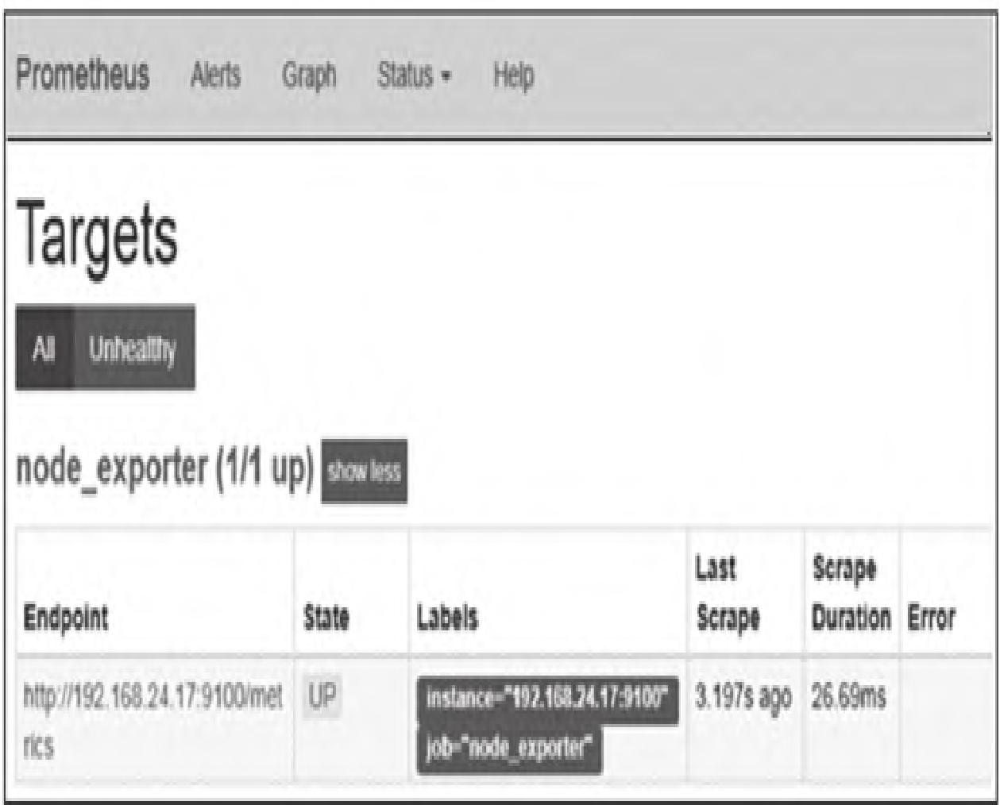

新增两台服务器时，需手动修改配置：

```yaml
scrape_configs:
- job_name: 'node_exporter'
  static_configs:
  - targets: ['192.168.24.17:9100', '192.168.24.18:9100']
  - targets: ['192.168.24.61:9100']
```

修改后Targets页面如图2所示。

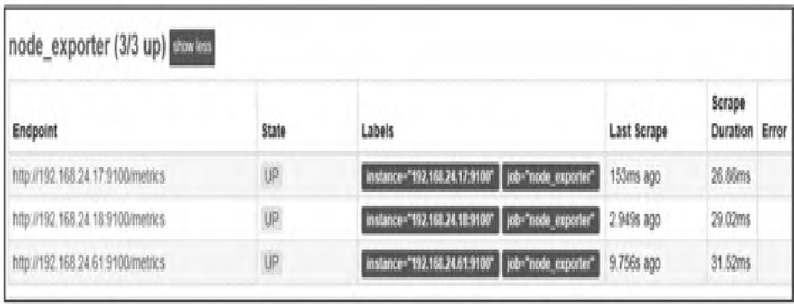

随着目标数量增加，静态配置文件会急剧膨胀，易出现误操作，而基于文件的服务发现可通过配置文件拆分解决这一问题。

### 2.2 文件服务发现配置

#### 核心规则

- 文件格式：仅支持`.json`（推荐）、`.yml`/`.yaml`；
- 内容要求：每个文件可包含多组目标列表；
- 加载机制：Prometheus定时读取文件，自动更新targets信息。

#### 2.2.1 添加JSON格式文件

```bash
# 切换到Prometheus安装目录
cd /data/prometheus

# 创建targets目录（自定义名称）
mkdir targets

# 创建JSON文件
touch targets/dev_node.json
```

编辑`dev_node.json`：

```json
{
    "targets": ["192.168.24.41:9100","192.168.24.42:9100"],
    "labels": {
        "env": "dev_webgame"
    }
}
```

#### 2.2.2 修改prometheus.yml配置文件

```yaml
vi prometheus.yml

scrape_configs:
- job_name: 'node_service_discovery'
  file_sd_configs:
  - files:
    - targets/*.json
    refresh_interval: 60s
```

| 参数 | 说明 |
| :--- | :--- |
| `file_sd_configs` | 基于文件的服务发现配置入口 |
| `- files` | 待加载文件路径（支持通配符） |
| `refresh_interval` | 文件刷新间隔，默认5m，此处自定义为60s |

> **注意**：首次添加动态配置文件需重启Prometheus生效，后续修改文件无需重启，Prometheus会自动刷新加载。

配置生效后，Targets页面如图3所示。

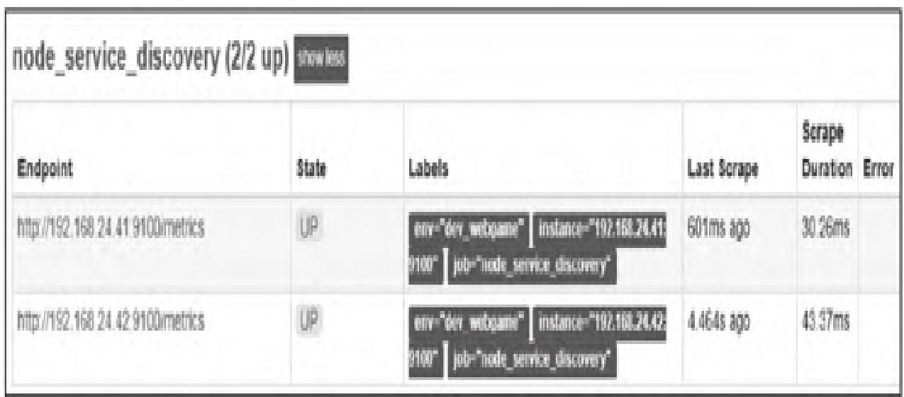

#### 2.2.3 动态更新配置

修改`dev_node.json`添加新服务器：

```json
[
    {
        "targets": ["192.168.24.41:9100","192.168.24.42:9100"],
        "labels": {
            "env": "dev_webgame"
        }
    },
    {
        "targets": ["192.168.24.43:9100"],
        "labels": {
            "env": "dev_mgame",
            "job": "mysql_node"
        }
    }
]
```

Prometheus自动加载后，Targets页面如图4所示。

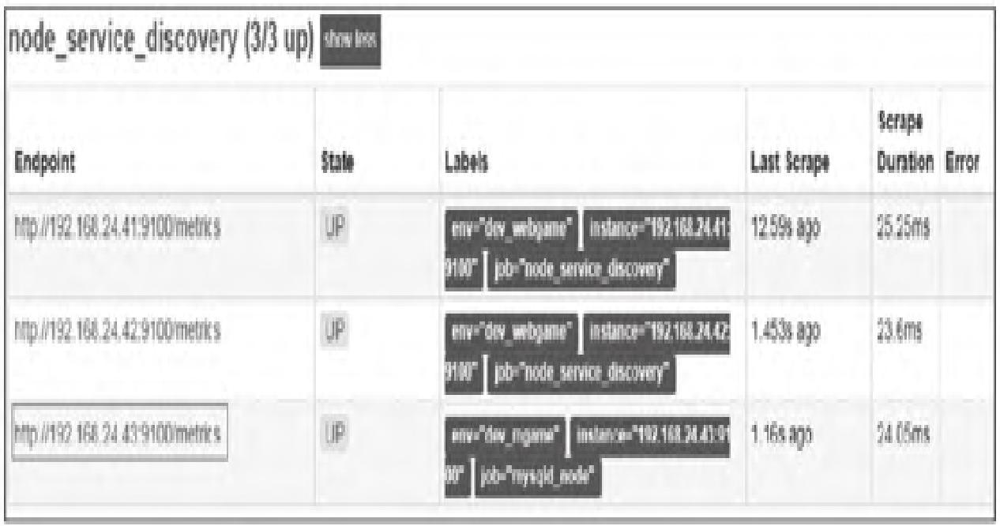

#### 2.2.4 使用YAML格式文件

创建`targets/dev_node.yaml`：

```yaml
- targets:
    - "192.168.24.45:9100"
```

修改`prometheus.yml`添加YAML文件加载：

```yaml
vi prometheus.yml

scrape_configs:
- job_name: 'node_service_discovery'
  file_sd_configs:
  - files:
    - targets/*.json
    refresh_interval: 60s
  - files:
    - targets/*.yaml
    refresh_interval: 60s
```

配置生效后Targets页面如图5所示。

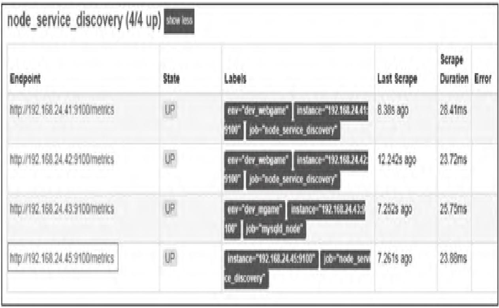

### 2.3 应用场景与模块小结

基于文件的服务发现可配合Ansible、SaltStack等配置管理工具，或CMDB系统生成动态配置文件，Prometheus定时刷新后即可实现监控目标的自动发现，是无第三方服务依赖场景下的首选方案。

## 3. 基于Consul的服务发现

Consul是Go语言开发的分布式服务发现与配置管理工具，具备高可用、高扩展性，核心支持服务注册、健康检查、键值存储、多数据中心等能力，是生产环境中主流的服务发现中间件。

### 3.1 Consul核心功能

| 功能 | 说明 |
| :--- | :--- |
| **服务发现** | 通过HTTP API/DNS完成服务注册与发现，支持外部服务接入 |
| **健康检查** | 监控服务运行状态，动态更新服务注册表 |
| **键/值存储** | 存储动态配置、功能标记、协调选举等数据 |
| **多数据中心** | 支持单/多数据中心部署，适配大规模集群 |
| **服务分割** | 基于TLS加密和身份授权实现安全的服务通信 |

### 3.2 Consul体系架构

Consul的体系架构如图6所示。

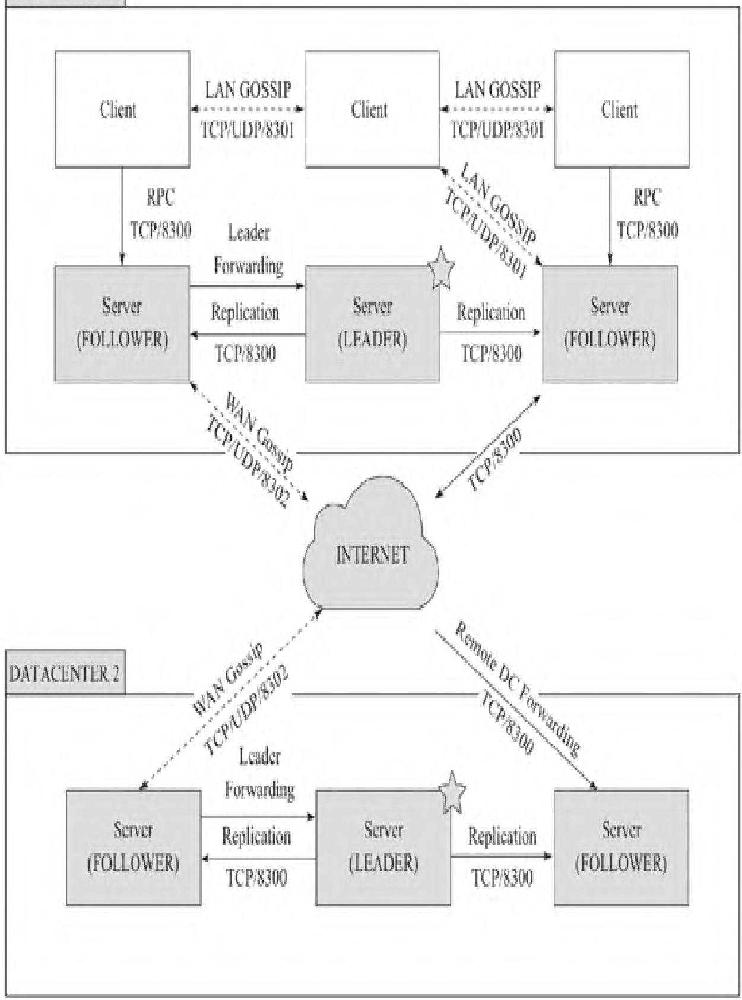

#### 核心组件

- **Client模式**：无状态，将RPC请求转发至Server，自身不持久化数据，仅消耗少量带宽；
- **Server模式**：参与Raft选举、维护集群状态、响应RPC查询，持久化所有数据；Server Leader负责同步注册信息和节点健康检查。

#### Gossip协议

所有节点加入Gossip协议，核心作用：

1. 客户端无需配置Server地址，自动完成发现；
2. 分布式节点故障检测，比心跳机制更易扩展；
3. 作为消息传递层（如Leader选举事件）。

> **官方建议**：单数据中心部署3~5台Server，兼顾可用性与性能；Client数量无限制，可扩展至数千台。

### 3.3 Consul部署与体验

#### 3.3.1 环境信息

| 项目 | 信息 |
| :--- | :--- |
| 操作系统 | CentOS Linux release 7.5.1804（Core）x86_64 |
| Consul版本 | consul_1.4.0_linux_amd64.zip |

#### 3.3.2 软件下载与部署

```bash
# 创建存放目录
mkdir -p /data/consul

# 解压软件包（下载地址：https://www.consul.io/downloads.html）
unzip consul_1.4.0_linux_amd64.zip -d /data/consul/

# 进入目录
cd /data/consul

# 查看帮助
./consul --help
```

#### 3.3.3 开发者模式启动
>
> **警告**：开发者模式仅用于测试，不持久化任何状态，禁止在生产环境使用。

```bash
./consul agent -dev
```

启动输出信息如图7所示。


#### 输出信息说明

| 名称 | 说明 |
| :--- | :--- |
| Version | Consul版本 |
| Node name | 节点名称（默认主机名，可通过`-node`自定义） |
| Datacenter | 数据中心名称（默认dc1，可通过`-datacenter`设置） |
| Server | agent运行模式（Server/Client） |
| Client Addr | 客户端接口地址（默认localhost） |
| Cluster Addr | 集群通信地址与端口 |

#### 验证集群节点

```bash
./consul members

Node      Address         Status  Type    Build  Protocol  DC   Segment
monitor   127.0.0.1:8301  alive   server  1.4.0  2         dc1  <all>
```

#### Consul默认端口

| 端口 | 协议 | 说明 |
| :--- | :--- | :--- |
| 8300 | TCP | Server RPC端口（Client-Server/Server-Server通信） |
| 8301 | TCP/UDP | 单数据中心Client间通信 |
| 8302 | TCP/UDP | 多数据中心Server信息同步 |
| 8400 | TCP | 处理CLI的RPC请求 |
| 8500 | TCP | HTTP API/Web UI访问 |
| 8600 | TCP/UDP | DNS查询解析 |

> **注意**：开发者模式下，GRPC默认监听8502/TCP端口。

#### Consul常用命令

| 命令 | 说明 |
| :--- | :--- |
| `agent` | 运行agent（维护集群成员、注册服务、健康检查等） |
| `join` | 加入已有集群 |
| `members` | 查看集群成员及状态（alive/left/failed） |
| `reload` | 重新加载配置文件 |
| `monitor` | 查看agent最新日志 |
| `leave` | 退出并移除集群 |
| `version` | 查看版本信息 |

### 3.4 服务注册与发现

Consul支持两种服务注册方式：配置文件注册、HTTP API注册。

#### 3.4.1 配置文件注册服务

以node_exporter为例：

```bash
# 创建配置目录
mkdir -p /data/consul/consul.d

# 创建注册配置文件
vi /data/consul/consul.d/node_exporter.json
```

配置内容：

```json
{
    "service": {
        "id": "node_exporter",
        "name": "node_exporter",
        "tags": [
            "devGames"
        ],
        "address": "127.0.0.1",
        "port": 9100
    }
}
```

| 参数 | 说明 |
| :--- | :--- |
| `id` | 服务ID（可选，默认等于name） |
| `name` | 服务名称（必填，节点内唯一） |
| `tags` | 服务标签（可选，用于分类） |
| `address` | 服务IP（默认agent IP） |
| `port` | 服务端口 |

#### 3.4.2 启动Consul并加载配置

```bash
# 停止原有开发者模式（Ctrl+C）
# 重新启动并指定配置目录
./consul agent -dev -config-dir=/data/consul/consul.d
```

#### 3.4.3 服务发现验证

**方式1：HTTP API**

```bash
curl http://localhost:8500/v1/catalog/service/node_exporter
```

返回JSON格式的服务信息（包含Node、Address、ServiceID、ServicePort等）。

**方式2：DNS服务**

```bash
# 安装dig工具（CentOS）
yum install -y bind-utils

# 查询SRV记录
dig @127.0.0.1 -p 8600 node_exporter.service.consul
```

SRV记录格式：`_service._proto.name. TTL class SRV priority weight port target.`

### 3.5 与Prometheus集成

#### 3.5.1 配置prometheus.yml

```yaml
- job_name: 'consul_sd_node_exporter'
  scheme: http
  consul_sd_configs:
    - server: 127.0.0.1:8500
      services: ['node_exporter']
```

| 参数 | 说明 |
| :--- | :--- |
| `consul_sd_configs` | Consul服务发现配置入口 |
| `- server` | Consul服务地址（本例与Prometheus同主机） |
| `services` | 待发现的服务列表（留空则获取所有服务） |

配置生效后，Targets页面如图8所示。

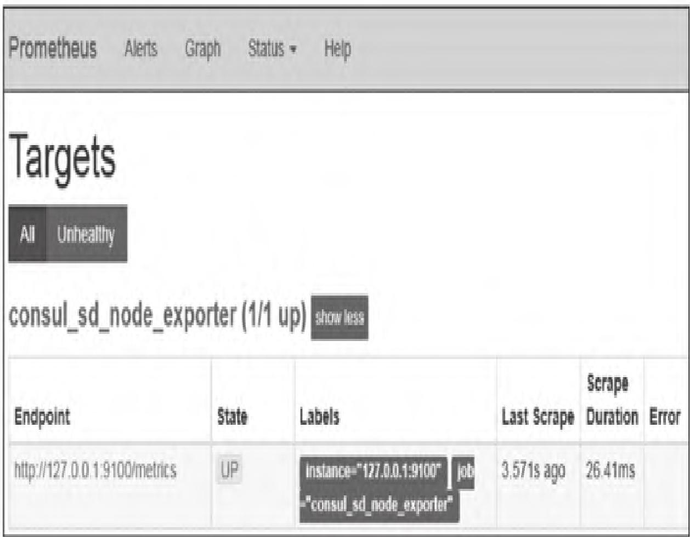

#### 3.5.2 服务注销

当监控目标下线时，需注销Consul中的服务（否则Prometheus仍会显示该target）：

```bash
curl --request PUT http://127.0.0.1:8500/v1/agent/service/deregister/node_exporter
```

> **注意**：注销参数为服务ID（配置文件中`service.id`，未配置则为`service.name`）。

注销后Targets页面如图9所示。


服务恢复后，执行`./consul reload`重新加载配置即可。

### 3.6 模块小结

Consul服务发现适配大规模、分布式集群场景，支持服务健康检查和多数据中心部署，是生产环境中Prometheus动态发现的核心方案，需重点掌握服务注册、注销与Prometheus集成配置。

## 4. 基于DNS的服务发现

在大型内网/专有网络环境中，集群主机/容器通常不暴露IP，可通过DNS的SRV记录实现服务发现，适配无中间件依赖的网络级服务发现场景。

### 4.1 DNS SRV记录

SRV记录是DNS的一种资源记录类型，用于指定服务的地址、端口、优先级和权重，格式如下：

```
_service._proto.name. TTL class SRV priority weight port target.
```

| 字段 | 说明 |
| :--- | :--- |
| `_service` | 服务名称（前缀`_`避免与DNS Label冲突） |
| `_proto` | 通信协议（TCP/UDP） |
| `name` | 有效域名（以`.`结尾） |
| `TTL` | 缓存有效期 |
| `class` | DNS类别（如IN） |
| `priority` | 优先级（0~65535，数值越小优先级越高） |
| `weight` | 权重（0~65535，数值越大权重越高） |
| `port` | 服务端口 |
| `target` | 服务主机地址（以`.`结尾） |

### 4.2 自建DNS服务SRV记录设置

在自建DNS服务器配置文件中添加以下记录：

```txt
_prometheus._tcp.363.com. 300 IN SRV 10 1 9100 webgame.363.com.
_prometheus._tcp.363.com. 300 IN SRV 10 1 9100 mmorpg.363.com.
_webgame IN A 192.168.24.47
mmorpg IN A 192.168.24.48
```

### 4.3 Prometheus集成配置

编辑`prometheus.yml`：

```yaml
- job_name: 'DNS_sd_node_exporter'
  dns_sd_configs:
  - names: ['_prometheus._tcp.363.com']
```

| 参数 | 说明 |
| :--- | :--- |
| `dns_sd_configs` | DNS服务发现配置入口 |
| `- names` | SRV记录名称（对应`_service._proto.name`，无需结尾`.`） |

#### 网络配置

将Prometheus和被监控服务器的DNS指向自建DNS：

```txt
# CentOS 7修改/etc/resolv.conf
nameserver 192.168.24.74
```

配置生效后，Targets页面如图10所示。

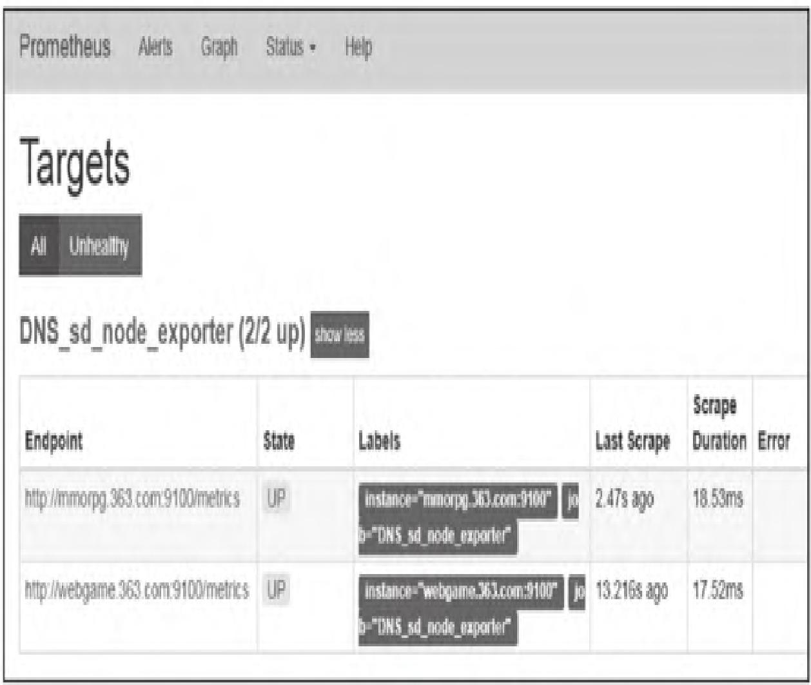

### 4.4 阿里云域名解析SRV记录设置

广域网场景下，可通过阿里云域名解析配置SRV记录，步骤如下：

1. 登录阿里云管理控制台，进入域名解析列表；
2. 选择目标域名，点击「添加记录」；
3. 配置SRV记录：
   - 记录类型：SRV；
   - 主机记录：`_prometheus._tcp`；
   - 记录值：`10 1 9100 webgame.363.com`；
4. 点击确定完成配置。

配置界面如图11所示。


> 与Prometheus的集成配置与自建DNS完全一致，无需额外调整。

### 4.5 模块小结

DNS SRV服务发现适配内网/广域网无中间件依赖场景，核心是配置SRV记录并让Prometheus指向对应DNS服务器，是轻量级服务发现的补充方案。

## 5. Relabelling机制

复杂监控环境中，服务发现的target标签可能杂乱无章，Prometheus通过Relabelling机制重写、过滤、新增标签，实现监控指标的标准化管理。

### 5.1 元数据标签

所有target默认包含元数据标签（以`__`开头），在Prometheus Web UI的Targets页面可查看（鼠标悬停至Labels栏），如图12所示。

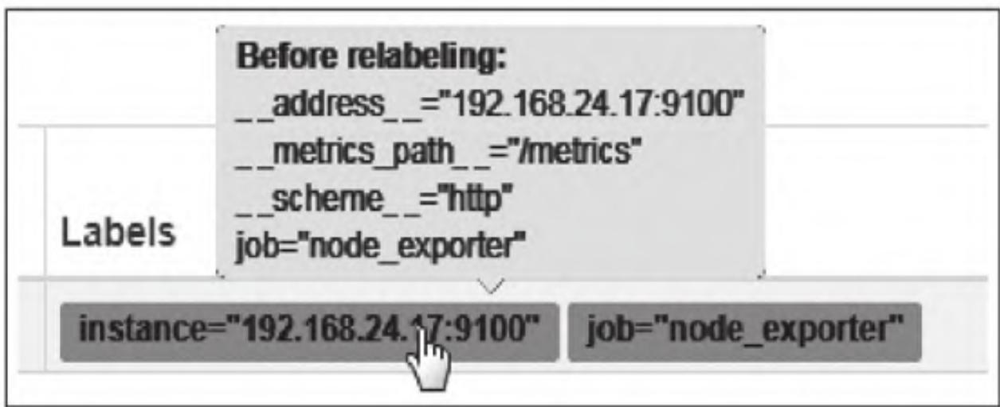

核心元数据标签：

| 标签 | 说明 |
| :--- | :--- |
| `__address__` | target访问地址（`<host>:<port>`） |
| `__metrics_path__` | 指标采集路径 |
| `__scheme__` | 采集协议（http/https） |
| `__param_<name>` | 采集请求参数 |

> 注：`instance`标签默认与`__address__`一致，本质是一次标签重写操作。

### 5.2 relabel_configs配置

通过`relabel_configs`自定义标签规则，完整配置项如下：

```txt
# 源标签（与regex匹配）
[ source_labels: ['<labelname> [, ...]'] ]
[ separator: <string> | default = ; ]

# 目标标签（写入匹配结果）
[ target_label: <labelname> ]

# 正则匹配规则
[ regex: <regex> | default = (.*) ]

# 哈希取模
[ modulus: <uint64> ]

# 正则替换值
[ replacement: <string> | default = $1 ]

# 执行动作
[ action: <relabel_action> | default = replace ]
```

### 5.3 Action操作类型

| Action | 说明 |
| :--- | :--- |
| `replace` | 默认动作，将匹配的源标签值写入目标标签 |
| `keep` | 保留匹配regex的target，丢弃其他 |
| `drop` | 丢弃匹配regex的target，保留其他 |
| `hashmod` | 对源标签值哈希取模，写入目标标签 |
| `labelmap` | 将匹配regex的标签名，复制值到新标签 |
| `labelkeep` | 保留匹配regex的标签，删除其他 |
| `labeldrop` | 删除匹配regex的标签，保留其他 |

### 5.4 应用示例

#### 5.4.1 添加新标签（replace）

默认node节点标签如图13所示。

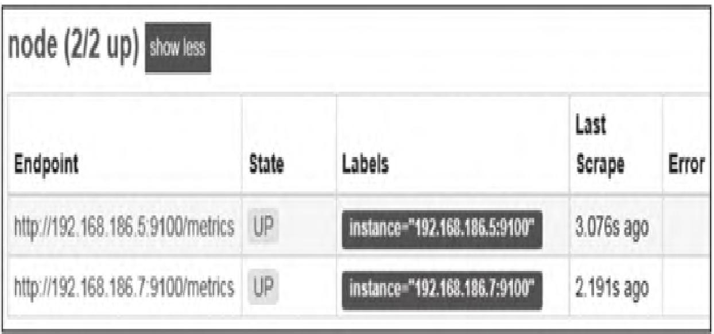

修改`prometheus.yml`添加新标签：

```yaml
scrape_configs:
- job_name: 'node'
  static_configs:
  - targets: ['192.168.186.7:9100', '192.168.186.5:9100']
  relabel_configs:
  - action: replace
    source_labels: ['__address__']
    regex: (.*)
    replacement: $1
    target_label: MobileGames
```

配置生效后，新增`MobileGames`标签，如图14所示。

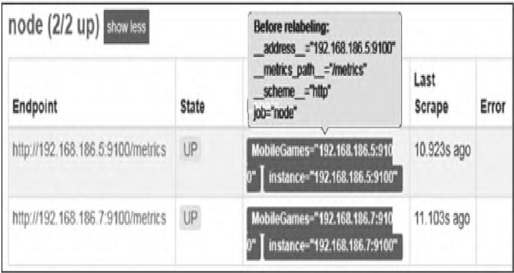

#### 5.4.2 过滤Target（keep/drop）

基于文件的服务发现中，`targets/*.json`内容：

```json
[
    {
        "targets": ["192.168.186.5:9100"],
        "labels": {
            "env": "dev_WebGames",
            "job": "node"
        }
    },
    {
        "targets": ["192.168.186.7:9100"],
        "labels": {
            "env": "test_MobileGames",
            "job": "node"
        }
    }
]
```

初始Targets列表如图15所示。

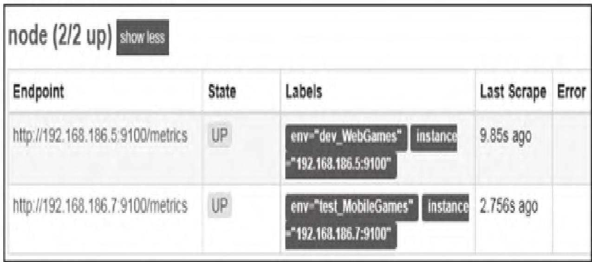

**场景1：保留开发环境（keep）**

```yaml
- job_name: 'node_service_discovery'
  file_sd_configs:
    - files:
      - targets/*.json
      refresh_interval: 60m
  relabel_configs:
    - action: keep
      source_labels: ['env']
      regex: (dev.*)
```

结果：仅保留`env="dev_WebGames"`的target，如图16所示。

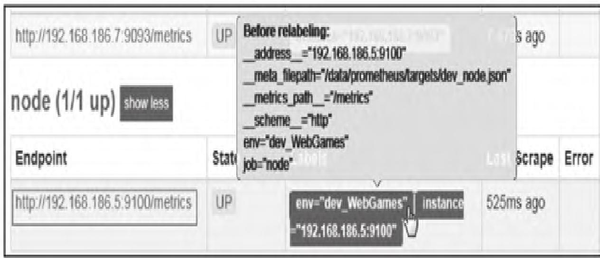

**场景2：过滤开发环境（drop）**

```yaml
relabel_configs:
  - action: drop
    source_labels: ['env']
    regex: (dev.*)
```

结果：丢弃`env="dev_WebGames"`的target，仅保留测试环境，如图17所示。

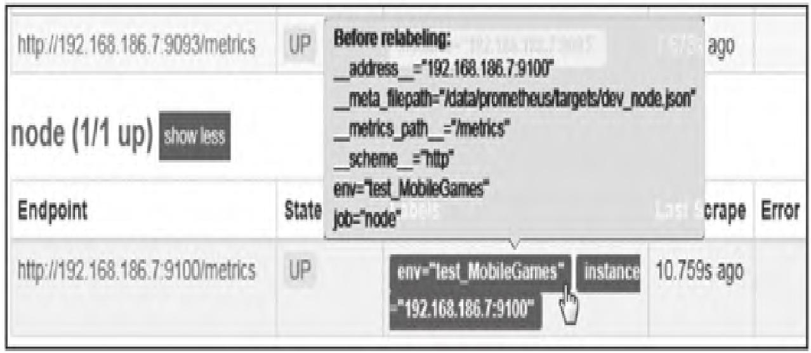

### 5.5 重新标记阶段

Prometheus支持两个阶段的标签重写，覆盖采集全流程：

| 阶段 | 配置模块 | 说明 |
| :--- | :--- | :--- |
| 采集前 | `relabel_configs` | 重写服务发现的target标签，应用元数据标签 |
| 采集后（存储前） | `metric_relabel_configs` | 筛选/重写指标，决定最终存储的内容 |

### 5.6 模块小结

Relabelling机制是Prometheus标签标准化的核心，需掌握`replace/keep/drop`等核心action的使用场景，以及两个重标记阶段的差异，适配复杂监控环境的标签管理需求。

## 【本篇核心知识点速记】

1. **服务发现核心价值**：自动化识别新/变更监控目标，解决静态配置在动态集群中的维护难题；
2. **三种服务发现方式**：
   - 文件发现：JSON/YAML格式文件，Prometheus定时刷新（`refresh_interval`），首次需重启，后续自动生效；
   - Consul发现：需部署Consul集群，支持服务注册（配置文件/HTTP API）、健康检查，默认端口8500；
   - DNS发现：基于SRV记录，格式为`_service._proto.name`，配合`dns_sd_configs`使用；
3. **Consul核心端口**：8300（RPC）、8301（LAN gossip）、8302（WAN gossip）、8500（HTTP API）、8600（DNS）；
4. **Relabelling机制**：
   - 元数据标签以`__`开头，核心包括`__address__`、`__metrics_path__`、`__scheme__`；
   - `relabel_configs`：采集前重写target标签；`metric_relabel_configs`：采集后、存储前重写指标标签；
   - 核心Action：`replace`（新增/修改标签）、`keep`（保留匹配target）、`drop`（丢弃匹配target）。
